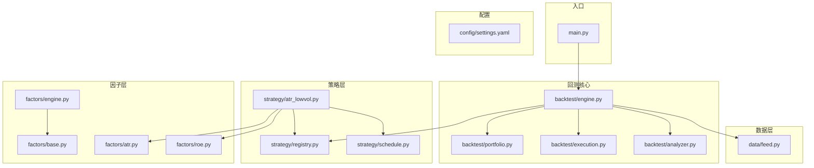
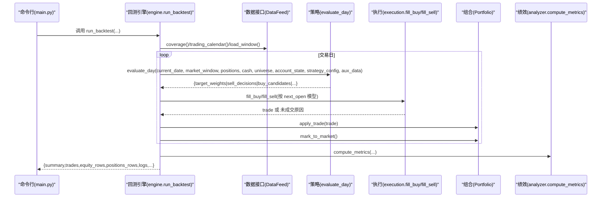
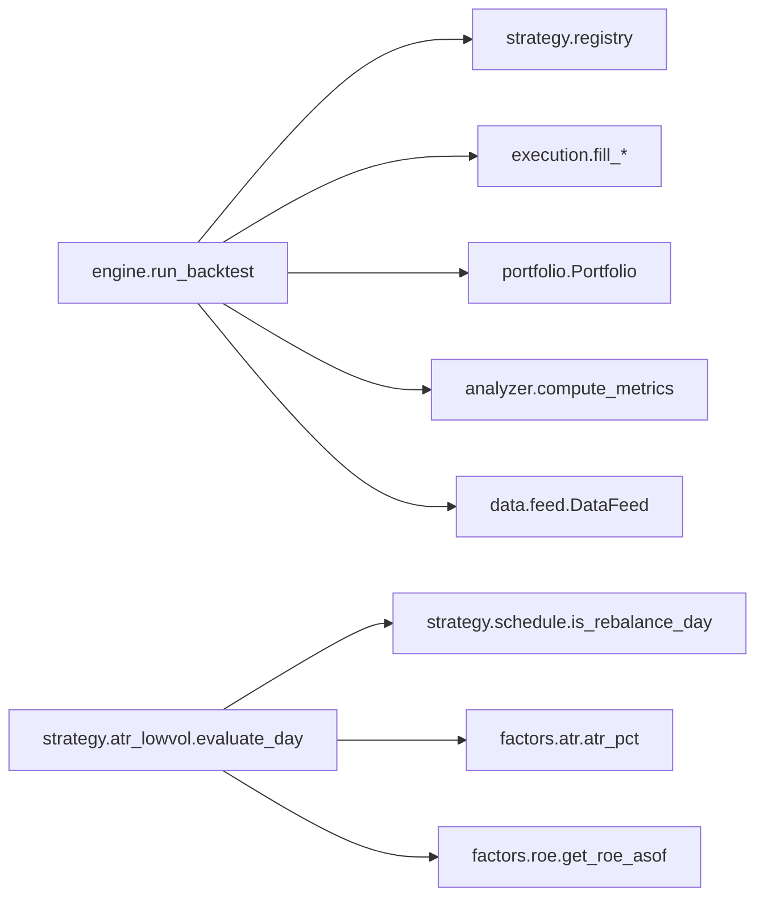

# API 参考文档

<cite>
**本文引用的文件**   
- [main.py](file://main.py)
- [engine.py](file://backtest/engine.py)
- [portfolio.py](file://backtest/portfolio.py)
- [execution.py](file://backtest/execution.py)
- [analyzer.py](file://backtest/analyzer.py)
- [feed.py](file://data/feed.py)
- [registry.py](file://strategy/registry.py)
- [schedule.py](file://strategy/schedule.py)
- [atr_lowvol.py](file://strategy/atr_lowvol.py)
- [engine.py](file://factors/engine.py)
- [base.py](file://factors/base.py)
- [atr.py](file://factors/atr.py)
- [roe.py](file://factors/roe.py)
- [settings.yaml](file://config/settings.yaml)
</cite>

## 目录
1. [简介](#简介)
2. [项目结构](#项目结构)
3. [核心组件](#核心组件)
4. [架构总览](#架构总览)
5. [详细组件分析](#详细组件分析)
6. [依赖关系分析](#依赖关系分析)
7. [性能考虑](#性能考虑)
8. [故障排查指南](#故障排查指南)
9. [结论](#结论)
10. [附录：配置与迁移](#附录配置与迁移)

## 简介
本文件为 QuantLab 的 API 参考文档，面向开发者与策略研究员，系统性说明回测引擎、数据接口、因子引擎与策略注册器等关键公共接口的使用方法、参数约定、返回值结构与异常处理。文档同时提供使用示例路径、最佳实践、错误码说明以及版本兼容与迁移建议，帮助快速集成与扩展。

## 项目结构
QuantLab 采用“扁平化 + 模块化”的组织方式：
- backtest：回测主循环、执行撮合、组合记账、绩效分析
- data：统一数据源接口（astock/duckdb）
- strategy：策略注册器、调度工具与示例策略
- factors：因子引擎与常用因子实现
- config：全局配置（YAML）
- main：命令行入口与旧版兼容

图表来源 
- [main.py:1-104](file://main.py#L1-L104)
- [engine.py:1-619](file://backtest/engine.py#L1-L619)
- [portfolio.py:1-189](file://backtest/portfolio.py#L1-L189)
- [execution.py:1-204](file://backtest/execution.py#L1-L204)
- [analyzer.py:1-176](file://backtest/analyzer.py#L1-L176)
- [feed.py:1-197](file://data/feed.py#L1-L197)
- [registry.py:1-115](file://strategy/registry.py#L1-L115)
- [schedule.py:1-47](file://strategy/schedule.py#L1-L47)
- [atr_lowvol.py:1-165](file://strategy/atr_lowvol.py#L1-L165)
- [engine.py:1-86](file://factors/engine.py#L1-L86)
- [base.py:1-52](file://factors/base.py#L1-L52)
- [atr.py:1-43](file://factors/atr.py#L1-L43)
- [roe.py:1-43](file://factors/roe.py#L1-L43)
- [settings.yaml:1-69](file://config/settings.yaml#L1-L69)

章节来源
- [main.py:1-104](file://main.py#L1-L104)
- [settings.yaml:1-69](file://config/settings.yaml#L1-L69)

## 核心组件
- DataFeed：统一数据接口，支持 astock parquet 与 duckdb 两种后端，提供日线、股票池与财务数据读取能力。
- FactorEngine：因子注册与批量计算、IC 统计；配合 FactorBase 抽象类定义因子接口与预处理方法。
- StrategyRegistry：策略装饰器注册与自动发现，提供 evaluate_day 函数解析与交易模型校验。
- Backtest Engine：回测主循环，串联 reader -> strategy_core -> execution -> portfolio -> metrics，输出结果结构体。
- Execution：next_open 模型下的买卖撮合，内置涨跌停、停牌、滑点、佣金、印花税与整手约束。
- Portfolio：组合记账，T+1 可用规则、逐日盯市、权益曲线与持仓快照。
- Analyzer：绩效指标计算（收益、回撤、夏普、Calmar、胜率、持有期、基准超额等）。

章节来源
- [feed.py:17-124](file://data/feed.py#L17-L124)
- [engine.py:9-86](file://factors/engine.py#L9-L86)
- [base.py:9-52](file://factors/base.py#L9-L52)
- [registry.py:24-44](file://strategy/registry.py#L24-L44)
- [engine.py:237-619](file://backtest/engine.py#L237-L619)
- [execution.py:95-204](file://backtest/execution.py#L95-L204)
- [portfolio.py:38-189](file://backtest/portfolio.py#L38-L189)
- [analyzer.py:96-176](file://backtest/analyzer.py#L96-L176)

## 架构总览
QuantLab 的回测流程以“目标权重”为核心：策略仅输出 target_weights，框架负责将目标权重转换为可执行的买卖决策，并应用真实约束（涨跌停、停牌、滑点、整手、行业上限、杠杆等），最终由组合模块记账与绩效模块评估。

图表来源 
- [engine.py:237-619](file://backtest/engine.py#L237-L619)
- [execution.py:95-204](file://backtest/execution.py#L95-L204)
- [portfolio.py:38-189](file://backtest/portfolio.py#L38-L189)
- [analyzer.py:96-176](file://backtest/analyzer.py#L96-L176)

## 详细组件分析

### DataFeed 数据接口
- 作用：统一 astock 与 duckdb 数据源，提供 get_daily、get_universe、get_financials 等方法。
- 关键方法
  - get_daily(codes, start_date, end_date, fields) -> DataFrame
    - 返回 MultiIndex(date, code) 的日线面板，字段包含 open/high/low/close/volume/amount 等。
  - get_universe(end_date, top_n) -> List[str]
    - 按成交额排序选取前 top_n 标的作为股票池。
  - get_financials(codes) -> DataFrame
    - 返回财务指标宽表（当前默认 astock 路径）。
- 内部实现要点
  - astock：从 parquet 加载，按代码与日期过滤，设置 MultiIndex。
  - duckdb：通过 DuckDBDailyReader 拉取窗口数据后拼接为 MultiIndex。
- 异常与边界
  - 未知 source 抛出 ValueError。
  - astock parquet 不存在时抛出 FileNotFoundError。
  - 空数据返回空 DataFrame 或空列表。

章节来源
- [feed.py:17-124](file://data/feed.py#L17-L124)
- [feed.py:126-134](file://data/feed.py#L126-L134)

### FactorEngine 因子引擎
- 作用：注册因子、批量计算、截面 IC 统计。
- 关键方法
  - register(factor) -> self
    - 以 factor.name 为键注册实例。
  - compute_all(panel, fin_ffill, **kwargs) -> DataFrame
    - 返回 index=(date, code)、columns=factor_names 的面板。
  - compute_ic(factor_panel, price_data, forward_days=20) -> DataFrame
    - 计算各因子的 IC 均值、标准差、ICIR、正比例、样本天数。
  - list_factors() -> List[str]
- 复杂度与健壮性
  - compute_all 对每个因子 try/except 捕获异常，避免单因子失败影响整体。
  - compute_ic 要求每日截面样本数不少于阈值（如 30），否则跳过该日。

章节来源
- [engine.py:9-86](file://factors/engine.py#L9-L86)

### FactorBase 因子基类
- 作用：定义因子抽象接口与通用预处理方法。
- 关键方法
  - compute(panel, fin_ffill, **kwargs) -> Series
    - 子类必须实现，输入面板与财务填充数据，输出 (date, code) 序列。
  - winsorize(series, lower, upper) -> Series
  - zscore(series) -> Series
  - rank_normalize(series) -> Series

章节来源
- [base.py:9-52](file://factors/base.py#L9-L52)

### StrategyRegistry 策略注册器
- 作用：装饰器注册 evaluate_day，自动扫描 strategy/ 包触发注册，提供查询与测试辅助。
- 关键方法
  - @register_strategy(name)
    - 在模块顶层装饰 evaluate_day，同名重复注册抛错。
  - get_strategy(name) -> callable
    - 获取已注册的 evaluate_day，未注册抛 KeyError。
  - list_strategies() -> List[str]
  - strategy_spy(name, fn=None) -> contextmanager
    - 测试期间临时替换策略函数。
- 自动发现
  - _autodiscover 跳过非目标模块，逐个导入 strategy.* 触发装饰器。

章节来源
- [registry.py:24-44](file://strategy/registry.py#L24-L44)
- [registry.py:96-115](file://strategy/registry.py#L96-L115)

### 示例策略 atr_lowvol（目标权重模式）
- 作用：ATR 低波动选股 + 质量/动量门控，调仓频率由配置决定，输出 target_weights。
- 关键逻辑
  - 非调仓日：根据止损条件决定是否退出持仓，其余保持。
  - 调仓日：筛选换手率区间、非 ST、ATR% 阈值、ROE>0、12-1月动量>0，按 ATR% 升序选前 n_hold。
  - 输出 target_weights={code: 1.0}，交由框架进行仓位分配与风控。
- 依赖
  - schedule.is_rebalance_day 判断调仓日
  - factors.atr.atr_pct 计算 ATR%
  - factors.roe.get_roe_asof 获取 ROE 作为质量门控

章节来源
- [atr_lowvol.py:1-165](file://strategy/atr_lowvol.py#L1-L165)
- [schedule.py:10-47](file://strategy/schedule.py#L10-L47)
- [atr.py:20-43](file://factors/atr.py#L20-L43)
- [roe.py:37-43](file://factors/roe.py#L37-L43)

### 回测引擎 engine.run_backtest
- 作用：回测主循环，串联数据、策略、执行、组合与绩效。
- 关键参数
  - reader：具备 coverage/trading_calendar/load_window 方法的对象
  - universe：代码列表
  - start_date/end_date：YYYY-MM-DD
  - strategy_config：策略配置字典
  - execution_cfg：价格/滑点/佣金/税率等
  - initial_cash：初始资金
  - aux_data：auxiliary 数据（含 trading_calendar/benchmark_closes）
  - benchmark_code/db_path：基准代码与数据库路径
  - strategy_name/trading_model：策略名与交易模型（默认 next_open）
  - fundamentals_reader：可选的基本面读取器
  - industry_map：行业映射用于行业上限控制
- 返回值
  - summary：运行元信息、数据覆盖、执行配置、绩效摘要、诊断聚合等
  - trades/equity_rows/positions_rows/logs/trading_calendar：明细与日志

章节来源
- [engine.py:237-619](file://backtest/engine.py#L237-L619)

### 执行撮合 execution.fill_buy/fill_sell
- 模型：next_open（T 收盘信号，T+1 开盘成交）
- 买入
  - 若 T+1 开盘涨幅接近涨停则拒绝；否则按 open*(1+slippage) 成交，金额转手数向下取整（100 股整手）。
- 卖出
  - 若 T+1 开盘跌幅接近跌停则拒绝；否则按 open*(1-slippage) 成交，支持 target_cash 指定卖出金额。
- 常见未成交原因
  - suspended（停牌）、limit_up_at_open/limit_down_at_open（涨跌停）、invalid_price（无效价格）、no_target_cash（无目标金额）、below_min_lot（不足一手）、no_available_volume（无可卖数量）

章节来源
- [execution.py:27-53](file://backtest/execution.py#L27-L53)
- [execution.py:95-204](file://backtest/execution.py#L95-L204)

### 组合记账 portfolio.Portfolio
- 功能：现金与持仓管理、T+1 可用规则、逐日盯市、权益曲线与持仓快照。
- 关键方法
  - position_list()：格式化持仓供 evaluate_day 使用
  - mark_to_market(market_window, date)：更新 last_price 与未实现盈亏
  - advance_holding_days()：递增持有天数并解冻可用数量
  - apply_trade(trade)：按买卖方向更新现金、持仓与可用数量
  - equity_row()/positions_rows()：生成每日快照

章节来源
- [portfolio.py:38-189](file://backtest/portfolio.py#L38-L189)

### 绩效分析 analyzer.compute_metrics
- 指标：总收益、年化收益、最大回撤、夏普、Calmar、胜率、平均持有天数、基准超额/信息比率/跟踪误差（当基准可用）。
- 输入：equity_rows、trades、trading_calendar、initial_cash、benchmark_* 系列。

章节来源
- [analyzer.py:96-176](file://backtest/analyzer.py#L96-L176)

## 依赖关系分析
- 模块耦合
  - engine 依赖 registry、execution、portfolio、analyzer、reader、benchmark_reader
  - atr_lowvol 依赖 registry、schedule、atr、roe
  - feed 依赖 astock parquet 或 duckdb reader
- 外部依赖
  - pandas/numpy 用于数据处理
  - duckdb 用于基准指数与行情读取（按需）
- 潜在循环依赖
  - 策略模块仅依赖 registry/schedule/factors，不反向依赖 engine，避免循环

图表来源 
- [engine.py:237-619](file://backtest/engine.py#L237-L619)
- [registry.py:24-44](file://strategy/registry.py#L24-L44)
- [execution.py:95-204](file://backtest/execution.py#L95-L204)
- [portfolio.py:38-189](file://backtest/portfolio.py#L38-L189)
- [analyzer.py:96-176](file://backtest/analyzer.py#L96-L176)
- [feed.py:17-124](file://data/feed.py#L17-L124)
- [atr_lowvol.py:1-165](file://strategy/atr_lowvol.py#L1-L165)
- [schedule.py:10-47](file://strategy/schedule.py#L10-L47)
- [atr.py:20-43](file://factors/atr.py#L20-L43)
- [roe.py:37-43](file://factors/roe.py#L37-L43)

## 性能考虑
- 数据切片优化
  - engine 预计算 cut_index，使每日窗口切片 O(1)，减少内存拷贝与搜索开销。
- 基准数据对齐
  - 基准收盘价使用前向填充补齐缺失，提升鲁棒性。
- 因子计算
  - FactorEngine 对每个因子独立 try/except，避免长尾失败拖慢整体；compute_ic 对样本不足的日期直接跳过。
- 执行撮合
  - 整手向下取整与涨跌停判定在撮合层完成，减少策略侧复杂度。
- 内存与缓存
  - DataFeed 对 astock parquet 做进程内缓存；ROE 读取使用进程级缓存。

[本节为通用指导，无需引用具体文件]

## 故障排查指南
- 常见问题与原因
  - 未成交订单：below_min_lot（资金不足一手）、suspended（停牌）、limit_up_at_open/limit_down_at_open（涨跌停）、no_target_cash（买入无目标金额）、no_available_volume（卖出无可卖数量）
  - 基准不可用：benchmark_db_path 未配置或文件不存在、基准数据缺失或起点为 0
  - 数据缺失：universe_coverage 中 codes_missing 非空，需检查数据覆盖范围
- 定位建议
  - 查看 logs 中的 ERROR/INFO 行，关注 unfilled_order reason
  - 检查 summary.data_coverage_actual.universe_coverage.missing_count
  - 确认 execution_cfg 的 slippage/commission_rate/tax_rate 是否符合预期
- 恢复措施
  - 调整 initial_cash 或 target_cash 以满足整手约束
  - 扩大数据时间窗口或修正基准数据库路径
  - 放宽策略筛选条件（如 ATR% 阈值、换手率区间）

章节来源
- [execution.py:95-204](file://backtest/execution.py#L95-L204)
- [engine.py:282-310](file://backtest/engine.py#L282-L310)
- [engine.py:445-489](file://backtest/engine.py#L445-L489)

## 结论
QuantLab 通过“目标权重 + 框架撮合”的设计，将策略聚焦于选股与信号，而将执行细节与风控下沉到框架层，显著降低策略开发复杂度并提高可移植性。DataFeed/FactorEngine/StrategyRegistry 构成可扩展的数据-因子-策略管线，配合稳健的执行与组合记账，形成完整的回测闭环。

[本节为总结性内容，无需引用具体文件]

## 附录：配置与迁移

### 配置参数说明（settings.yaml）
- project：项目名称、版本、根路径
- data.source：数据源类型（astock/duckdb）
- data.astock.*：parquet 路径配置
- data.cache.enabled/dir/expire_days：缓存开关与过期策略
- backtest.start_date/end_date/initial_capital/commission/slippage/benchmark：回测基础参数
- logging.level/dir/max_file_size/backup_count：日志配置
- factors.neutralize/standardize/winsorize 及方法：因子预处理开关与方法
- strategy.default_universe/universes.*：默认股票池与市值区间
- trading.config/enabled：实盘配置开关

章节来源
- [settings.yaml:1-69](file://config/settings.yaml#L1-L69)

### 版本与兼容性
- 策略核心版本：_STRATEGY_CORE_VERSION="0.2.0"
- 摘要 Schema 版本：_SUMMARY_SCHEMA_VERSION="0.2"
- 交易模型：默认 next_open，策略可通过 ALLOWED_TRADING_MODELS 声明允许模型
- 向后兼容：main.py 保留旧版 multi_factor_ic 回测入口，便于平滑迁移

章节来源
- [engine.py:29-31](file://backtest/engine.py#L29-L31)
- [engine.py:207-234](file://backtest/engine.py#L207-L234)
- [main.py:28-92](file://main.py#L28-L92)

### 迁移指南（从旧版 multi_factor_ic 到新框架）
- 步骤
  - 将策略重写为 evaluate_day，输出 target_weights 或 sell_decisions/buy_candidates
  - 使用 @register_strategy("your_strategy") 注册策略
  - 通过 engine.run_backtest(reader, universe, dates, strategy_config, execution_cfg, ...) 运行
  - 如需基本面数据，传入 fundamentals_reader 并在 aux_data 中注入
- 注意事项
  - 确保策略声明 ALLOWED_TRADING_MODELS=["next_open"]
  - 使用 strategy.schedule.is_rebalance_day 控制调仓频率
  - 利用 execution 层的涨跌停/停牌/整手约束，避免在策略中重复实现

章节来源
- [registry.py:24-44](file://strategy/registry.py#L24-L44)
- [schedule.py:10-47](file://strategy/schedule.py#L10-L47)
- [engine.py:237-310](file://backtest/engine.py#L237-L310)

### 使用示例（路径指引）
- 运行 Project_01 回测（新模块）
  - 入口：main.run_backtest(strategy_name="project_01")
  - 数据加载：research.multi_factor_ic.data_loader.build_panel / load_universe
  - 回测调用：research.multi_factor_ic.backtest.backtest(panel, fin_ffill, top_n, freq, tx_cost, filter_func, weights)
- 使用 DataFeed 获取面板
  - feed.get_panel(start_date, end_date, top_n) -> (panel, fin_ffill)
- 因子引擎用法
  - fe = FactorEngine(); fe.register(factor); panel = fe.compute_all(panel, fin_ffill); ic_df = fe.compute_ic(panel, price_data, forward_days)

章节来源
- [main.py:28-92](file://main.py#L28-L92)
- [feed.py:137-181](file://data/feed.py#L137-L181)
- [engine.py:9-86](file://factors/engine.py#L9-L86)