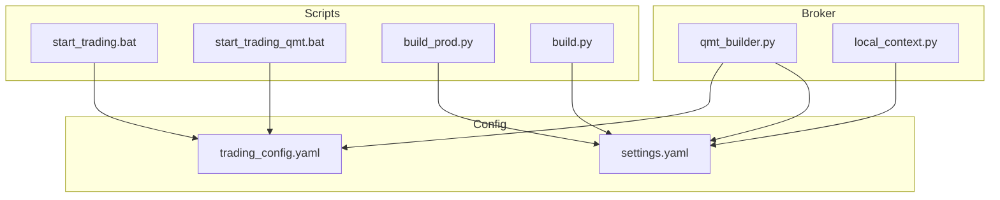
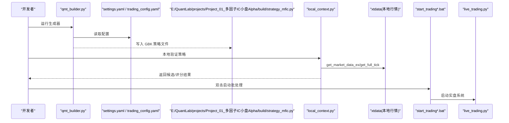
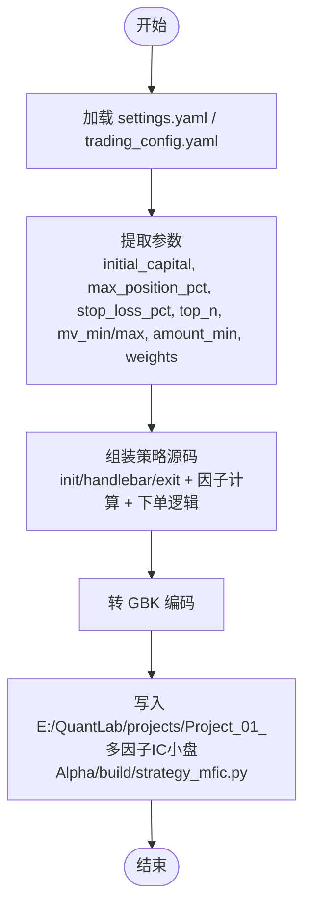
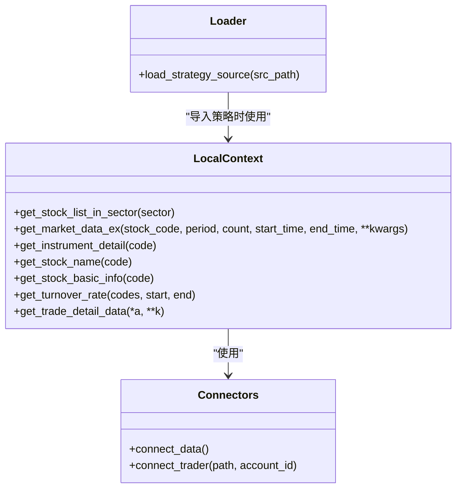
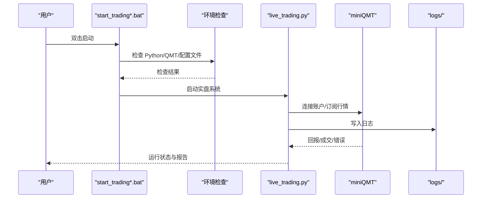
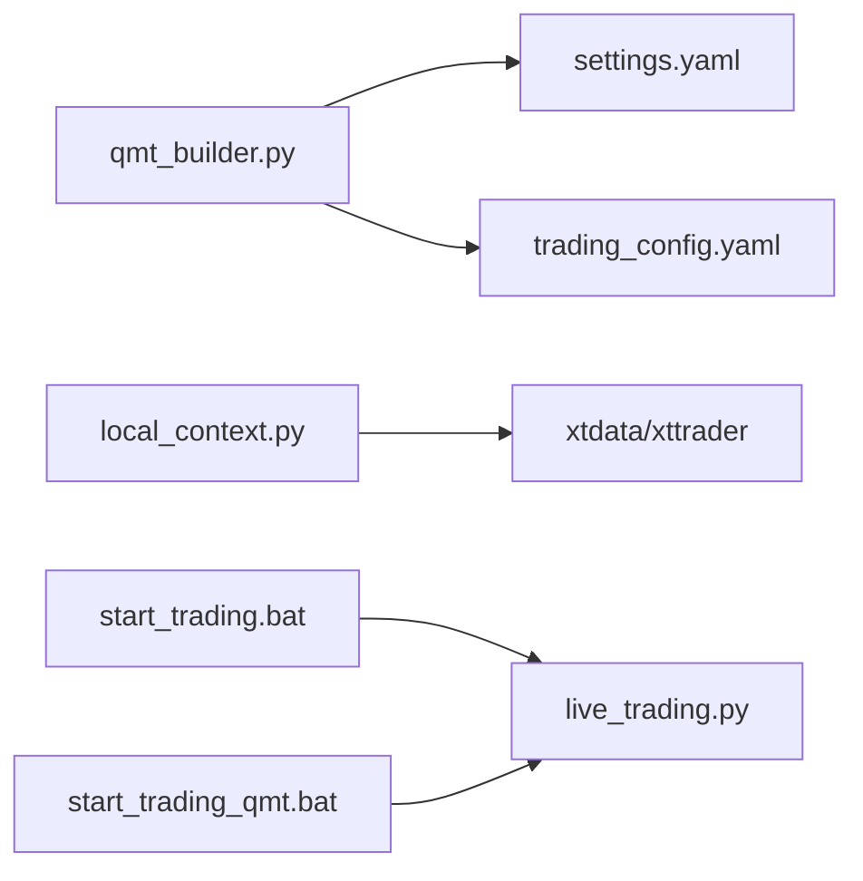

# 券商接口 API

<cite>
**本文引用的文件**
- [qmt_builder.py](file://broker/qmt_builder.py)
- [local_context.py](file://broker/local_context.py)
- [settings.yaml](file://config/settings.yaml)
- [trading_config.yaml](file://config/trading_config.yaml)
- [start_trading.bat](file://start_trading.bat)
- [start_trading_qmt.bat](file://start_trading_qmt.bat)
- [build_prod.py](file://projects/Project_01_多因子IC小盘Alpha/research/mfic_strategy/build_prod.py)
- [build.py](file://projects/Project_10_价值小盘V2/build.py)
- [A股量化框架_五大扩展模块.md](file://A股量化框架_五大扩展模块.md)
- [miniQMT实盘对接_生产级完善方案.md](file://miniQMT实盘对接_生产级完善方案.md)
- [全局控制台.md](file://全局控制台.md)
</cite>

## 目录
1. [简介](#简介)
2. [项目结构](#项目结构)
3. [核心组件](#核心组件)
4. [架构总览](#架构总览)
5. [详细组件分析](#详细组件分析)
6. [依赖关系分析](#依赖关系分析)
7. [性能与稳定性](#性能与稳定性)
8. [故障排查指南](#故障排查指南)
9. [结论](#结论)
10. [附录](#附录)

## 简介
本文件为 QuantLab 券商接口层的 API 文档，聚焦 QMT 策略生成器与本地上下文适配器的使用、配置与部署。内容覆盖：
- QMT 策略生成器 build_qmt_strategy() 的参数来源、输出文件与 GBK 编码处理
- 本地上下文适配器 local_context 的功能（模拟环境下的策略运行、数据模拟、订单模拟）
- QMT 平台集成配置（账户连接、权限设置、风控参数等）
- 实盘部署完整指南（策略打包、部署流程、监控配置）
- 本地验证模式使用方法（开发与测试阶段）
- 错误处理、日志记录、异常恢复等生产最佳实践

## 项目结构
QuantLab 的券商接口层位于 broker 目录，包含：
- qmt_builder.py：QMT 策略源码生成器，读取配置并产出 GBK 编码的单文件策略
- local_context.py：本地 miniQMT 适配器，将 C.* 调用映射到 xtdata，用于本地快速验证

此外，交易与部署相关脚本位于根目录与各项目目录中，配置文件集中于 config 目录。

图表来源
- [qmt_builder.py:1-386](file://broker/qmt_builder.py#L1-L386)
- [local_context.py:1-137](file://broker/local_context.py#L1-L137)
- [settings.yaml:1-69](file://config/settings.yaml#L1-L69)
- [trading_config.yaml:1-62](file://config/trading_config.yaml#L1-L62)
- [start_trading.bat:1-51](file://start_trading.bat#L1-L51)
- [start_trading_qmt.bat:1-66](file://start_trading_qmt.bat#L1-L66)
- [build_prod.py:1-13](file://projects/Project_01_多因子IC小盘Alpha/research/mfic_strategy/build_prod.py#L1-L13)
- [build.py:44-68](file://projects/Project_10_价值小盘V2/build.py#L44-L68)

章节来源
- [qmt_builder.py:1-386](file://broker/qmt_builder.py#L1-L386)
- [local_context.py:1-137](file://broker/local_context.py#L1-L137)
- [settings.yaml:1-69](file://config/settings.yaml#L1-L69)
- [trading_config.yaml:1-62](file://config/trading_config.yaml#L1-L62)

## 核心组件
- QMT 策略生成器（qmt_builder.py）
  - 功能：从 settings.yaml 与 trading_config.yaml 读取配置，组装 QMT 生命周期与策略逻辑，生成单文件 GBK 策略
  - 关键函数：load_config(), build_qmt_strategy(config), save_strategy(source_code, output_path)
  - 输出：E:/QuantLab/projects/Project_01_多因子IC小盘Alpha/build/strategy_mfic.py（GBK 编码，含 # coding=gbk 头）
- 本地上下文适配器（local_context.py）
  - 功能：LocalContext 类将 QMT 策略中的 C.* 调用映射到 xtdata，支持本地行情获取、合约详情、名称查询等；对不支持的接口抛出异常触发 fail-open
  - 工具：connect_data(), connect_trader(), load_strategy_source() 用于本地导入与解码策略源码

章节来源
- [qmt_builder.py:21-386](file://broker/qmt_builder.py#L21-L386)
- [local_context.py:16-137](file://broker/local_context.py#L16-L137)

## 架构总览
整体架构由“配置驱动的策略生成 + 本地适配器 + 部署脚本”构成。构建时读取配置生成 GBK 策略文件；本地验证通过 LocalContext 将策略 C.* 调用桥接到 xtdata；实盘启动通过批处理脚本检查环境与配置后执行 live_trading.py。

图表来源
- [qmt_builder.py:33-386](file://broker/qmt_builder.py#L33-L386)
- [settings.yaml:1-69](file://config/settings.yaml#L1-L69)
- [trading_config.yaml:1-62](file://config/trading_config.yaml#L1-L62)
- [local_context.py:69-89](file://broker/local_context.py#L69-L89)
- [start_trading.bat:38-44](file://start_trading.bat#L38-L44)
- [start_trading_qmt.bat:58-59](file://start_trading_qmt.bat#L58-L59)

## 详细组件分析

### QMT 策略生成器（build_qmt_strategy）
- 输入参数来源
  - 初始资金、最大仓位比例、止损比例、top_n、市值区间、最小成交额、因子权重等来自 settings.yaml 的 project_01/backtest/live/factors 以及 trading_config.yaml 的 strategy 字段
  - 账户 ID 来自 settings.yaml 的 qmt.account_id
- 输出文件
  - 默认路径 E:/QuantLab/projects/Project_01_多因子IC小盘Alpha/build/strategy_mfic.py
  - 编码为 GBK，文件头为 # coding=gbk
- 生成流程要点
  - 读取配置 → 组装 init/handlebar/exit 生命周期 → 计算因子与评分 → 生成 passorder 下单语句 → 写入 GBK 文件
- 关键实现位置
  - 配置读取与参数提取：load_config(), build_qmt_strategy()
  - 保存策略：save_strategy()

图表来源
- [qmt_builder.py:21-386](file://broker/qmt_builder.py#L21-L386)
- [settings.yaml:1-69](file://config/settings.yaml#L1-L69)
- [trading_config.yaml:1-62](file://config/trading_config.yaml#L1-L62)

章节来源
- [qmt_builder.py:21-386](file://broker/qmt_builder.py#L21-L386)
- [settings.yaml:1-69](file://config/settings.yaml#L1-L69)
- [trading_config.yaml:1-62](file://config/trading_config.yaml#L1-L62)

### 本地上下文适配器（LocalContext）
- 功能概述
  - 将 QMT 策略中的 C.* 方法映射到 xtdata 的本地接口，如板块股票列表、历史行情、合约详情、股票名称等
  - 对不支持的方法（如换手率、持仓反查）抛出 NotImplementedError，触发策略 fail-open
- 连接管理
  - connect_data(): 连接行情服务（端口 58610）
  - connect_trader(): 连接交易服务（端口 58600），返回 trader 与 account
- 策略加载工具
  - load_strategy_source(): 读取策略源码，处理编码头（# coding=gbk）与实际 UTF-8 不一致的问题，临时写入 _local_tmp.py 并 import 执行

图表来源
- [local_context.py:16-137](file://broker/local_context.py#L16-L137)

章节来源
- [local_context.py:16-137](file://broker/local_context.py#L16-L137)

### QMT 平台集成配置
- 账户连接
  - account.id: 账号标识（示例 67014907）
  - account.path: miniQMT userdata_mini 路径
  - account.session_id: 会话 ID
- 交易参数
  - initial_capital: 初始资金
  - max_single_position: 单股最大仓位
  - max_total_position: 总仓位上限
  - commission_rate: 佣金
  - stamp_tax: 印花税
  - slippage: 滑点
- 风控参数
  - stop_loss_pct: 个股止损
  - max_drawdown: 组合最大回撤
  - max_holding_days: 最长持有天数
  - max_daily_turnover: 单日最大换手
- 委托控制
  - timeout_seconds: 委托超时
  - max_retry: 最大重试次数
  - price_tolerance: 价格容差
  - cancel_unfilled: 超时未成交自动撤单
- 调度与通知
  - schedule.pre_market/morning_open/afternoon_check/end_of_day
  - notification.enabled/method/webhook_url

章节来源
- [trading_config.yaml:1-62](file://config/trading_config.yaml#L1-L62)

### 实盘部署完整指南
- 前置条件
  - 安装并登录 miniQMT（XtMiniQmt.exe），确保行情与交易服务端口可用
  - 准备 Python 环境（外部 venv 或 QMT 内置 Python 3.6.8）
- 策略打包
  - 使用 qmt_builder.py 或 projects/*/build_prod.py 生成 GBK 策略文件
  - 校验产物：存在、GBK 编码、# coding=gbk 头、Python 3.6 语法兼容
- 部署流程
  - 使用 start_trading.bat 或 start_trading_qmt.bat 启动 live_trading.py
  - 批处理脚本会检查 Python、QMT 进程、配置文件是否存在
- 监控配置
  - 日志落点：logs 目录
  - 委托监控与回调：参考生产级 Broker 实现（断线重连、状态追踪、超时撤单）
  - 通知：企业微信/钉钉 webhook（需配置）

图表来源
- [start_trading.bat:1-51](file://start_trading.bat#L1-L51)
- [start_trading_qmt.bat:1-66](file://start_trading_qmt.bat#L1-L66)
- [miniQMT实盘对接_生产级完善方案.md:73-756](file://miniQMT实盘对接_生产级完善方案.md#L73-L756)

章节来源
- [start_trading.bat:1-51](file://start_trading.bat#L1-L51)
- [start_trading_qmt.bat:1-66](file://start_trading_qmt.bat#L1-L66)
- [miniQMT实盘对接_生产级完善方案.md:73-756](file://miniQMT实盘对接_生产级完善方案.md#L73-L756)

### 本地验证模式使用方法
- 适用场景
  - 改完策略逻辑后，用 LocalContext 快速验证选股/评分管线是否通、候选数量与排序、fail-open 是否生效
- 步骤
  - 确保本地 miniQMT 已登录（行情 58610、交易 58600 在跑）
  - 使用外部 venv 安装 xtquant/numpy/pandas，执行 local_validate.py（各项目下）
  - 验证内容：选股管线、候选数量、排序、fail-open
- 注意事项
  - 源文件头标 # coding=gbk 但实际为 UTF-8，本地 import 必须解码并修正文件头
  - 无法本地验证的场景：is_last_bar() 守卫、真实下单/SAFEMODE、持仓纳管反查、全天调度/心跳节奏

章节来源
- [local_context.py:110-137](file://broker/local_context.py#L110-L137)
- [全局控制台.md:219-239](file://全局控制台.md#L219-L239)

## 依赖关系分析
- 组件耦合
  - qmt_builder.py 依赖 settings.yaml 与 trading_config.yaml 的配置项
  - local_context.py 依赖 xtdata 与 xttrader（本地 miniQMT）
  - 部署脚本依赖 live_trading.py 与配置文件
- 外部依赖
  - xtquant（xtdata/xttrader）、numpy、pandas、yaml
- 潜在循环依赖
  - 当前未见循环导入；LocalContext 仅作为适配器被策略或验证脚本使用

图表来源
- [qmt_builder.py:21-386](file://broker/qmt_builder.py#L21-L386)
- [local_context.py:16-137](file://broker/local_context.py#L16-L137)
- [start_trading.bat:38-44](file://start_trading.bat#L38-L44)
- [start_trading_qmt.bat:58-59](file://start_trading_qmt.bat#L58-L59)

章节来源
- [qmt_builder.py:21-386](file://broker/qmt_builder.py#L21-L386)
- [local_context.py:16-137](file://broker/local_context.py#L16-L137)
- [start_trading.bat:1-51](file://start_trading.bat#L1-L51)
- [start_trading_qmt.bat:1-66](file://start_trading_qmt.bat#L1-L66)

## 性能与稳定性
- 构建与生成
  - 生成器一次性读取配置并拼接源码，时间复杂度与配置规模线性相关；输出文件大小取决于策略逻辑长度
- 本地验证
  - LocalContext 直接调用 xtdata，批量获取行情与全市场股票列表，典型全市场扫描耗时约 10 秒量级
- 实盘运行
  - 委托监控线程每 10 秒检查未完成委托，超时自动撤单；断线重连采用指数退避，避免频繁重试
- 建议优化
  - 减少不必要的重复查询（如 tick 数据缓存）
  - 合理设置 top_n 与因子窗口，降低计算压力
  - 启用通知与日志分级，便于快速定位问题

[本节为通用指导，不直接分析具体文件]

## 故障排查指南
- 常见问题
  - 编码问题：策略源码头标 GBK 但实际 UTF-8，本地导入需解码并修正文件头
  - 连接失败：miniQMT 未启动或端口占用，检查 XtMiniQmt.exe 与端口 58610/58600
  - 委托失败：非交易时段、数量不足 1 手、资金不足、无持仓卖出
  - 数据缺失：xtdata 无换手率接口，本地触发 fail-open
- 日志与监控
  - 日志落点 logs/ 目录；QMT 内部日志路径见踩坑日志
  - 委托状态与成交回报通过回调更新，关注超时与错误信息
- 恢复策略
  - 自动重连（指数退避）
  - 状态持久化（orders/trades 最近 100 笔）
  - 持仓对账（程序预期 vs 券商实际差异报告）

章节来源
- [local_context.py:110-137](file://broker/local_context.py#L110-L137)
- [miniQMT实盘对接_生产级完善方案.md:73-756](file://miniQMT实盘对接_生产级完善方案.md#L73-L756)
- [全局控制台.md:219-239](file://全局控制台.md#L219-L239)

## 结论
QuantLab 的券商接口层通过“配置驱动的 QMT 策略生成器 + 本地上下文适配器 + 标准化部署脚本”实现了从开发、验证到实盘的全链路闭环。建议在开发与测试阶段充分使用 LocalContext 进行快速迭代，并在上线前完成模拟端一日验证与 Checklist 核对，确保集成层稳定可靠。

[本节为总结性内容，不直接分析具体文件]

## 附录
- 构建与部署参考
  - build_prod.py：将 dev 版转为 GBK 生产版 strategy_mfic.py
  - build.py：注入版本标记并转 GBK 写入 build/
- 生产级 Broker 实现参考
  - 回调类与断线重连、委托状态追踪、超时监控、持仓对账、通知机制

章节来源
- [build_prod.py:1-13](file://projects/Project_01_多因子IC小盘Alpha/research/mfic_strategy/build_prod.py#L1-L13)
- [build.py:44-68](file://projects/Project_10_价值小盘V2/build.py#L44-L68)
- [A股量化框架_五大扩展模块.md:971-1701](file://A股量化框架_五大扩展模块.md#L971-L1701)
- [miniQMT实盘对接_生产级完善方案.md:73-756](file://miniQMT实盘对接_生产级完善方案.md#L73-L756)