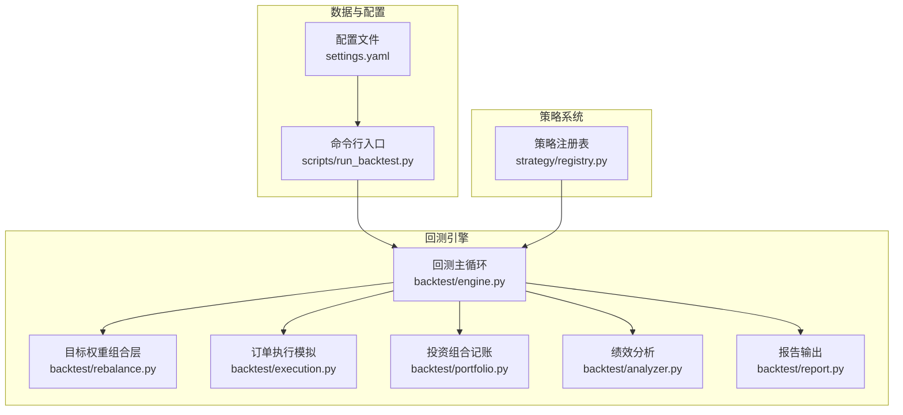
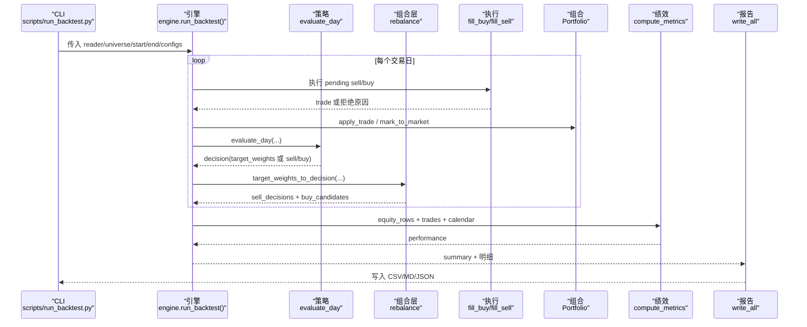
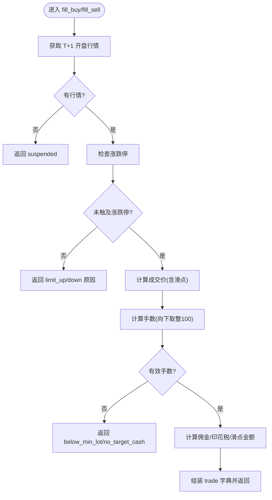
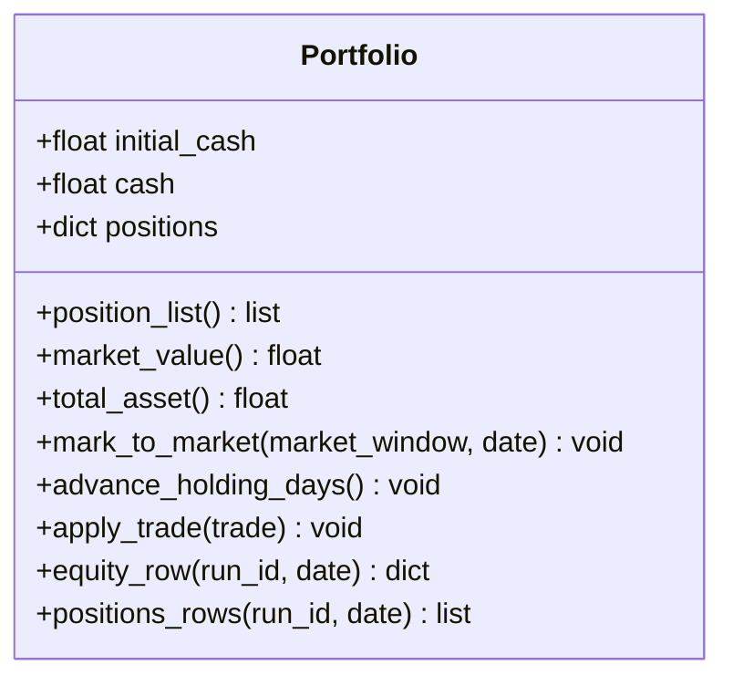
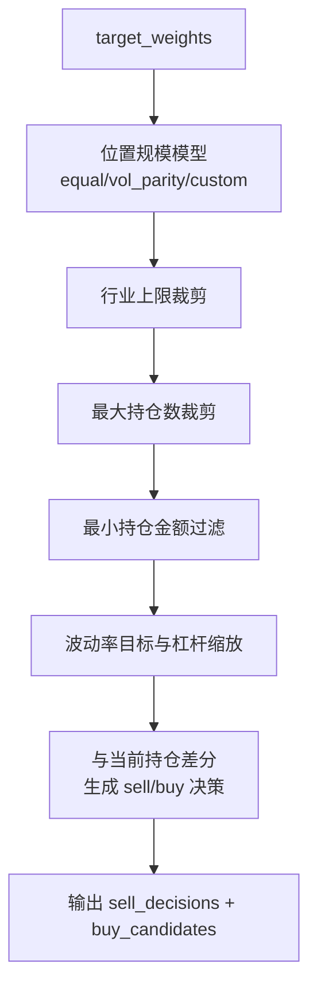
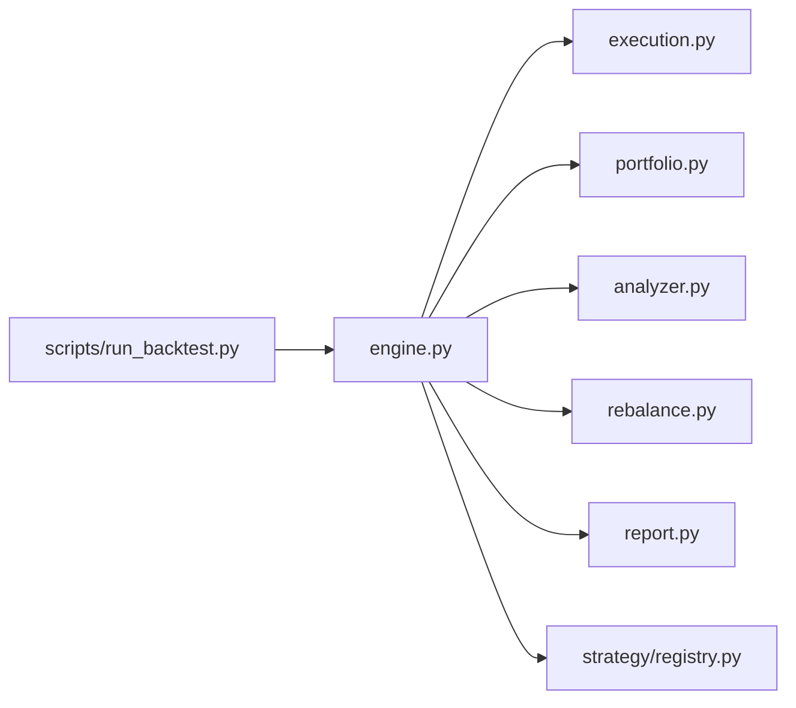

# 回测引擎 API

<cite>
**本文引用的文件**   
- [backtest/engine.py](file://backtest/engine.py)
- [backtest/execution.py](file://backtest/execution.py)
- [backtest/portfolio.py](file://backtest/portfolio.py)
- [backtest/analyzer.py](file://backtest/analyzer.py)
- [backtest/rebalance.py](file://backtest/rebalance.py)
- [backtest/report.py](file://backtest/report.py)
- [strategy/registry.py](file://strategy/registry.py)
- [scripts/run_backtest.py](file://scripts/run_backtest.py)
- [config/settings.yaml](file://config/settings.yaml)
</cite>

## 目录
1. [简介](#简介)
2. [项目结构](#项目结构)
3. [核心组件](#核心组件)
4. [架构总览](#架构总览)
5. [详细组件分析](#详细组件分析)
6. [依赖关系分析](#依赖关系分析)
7. [性能与优化建议](#性能与优化建议)
8. [故障排查指南](#故障排查指南)
9. [结论](#结论)
10. [附录：API 参考与最佳实践](#附录api-参考与最佳实践)

## 简介
本文件为 QuantLab 回测引擎的权威 API 文档，覆盖主回测入口 run_backtest()、订单执行模拟（涨跌停/停牌/滑点/手续费）、投资组合管理接口（持仓更新/仓位控制/资金管理）、绩效分析 API（收益率/风险指标/基准对比）以及报告生成接口（CSV/Markdown/JSON）。同时给出回测配置最佳实践、性能优化建议与常见问题解决方案。

## 项目结构
QuantLab 的回测模块采用“数据源 -> 策略 -> 组合层 -> 执行 -> 组合记账 -> 绩效 -> 报告”的分层设计，核心位于 backtest 包内，策略通过 registry 动态加载，CLI 入口在 scripts.run_backtest。

图表来源
- [scripts/run_backtest.py:1-132](file://scripts/run_backtest.py#L1-L132)
- [backtest/engine.py:1-619](file://backtest/engine.py#L1-L619)
- [backtest/rebalance.py:1-281](file://backtest/rebalance.py#L1-L281)
- [backtest/execution.py:1-204](file://backtest/execution.py#L1-L204)
- [backtest/portfolio.py:1-189](file://backtest/portfolio.py#L1-L189)
- [backtest/analyzer.py:1-176](file://backtest/analyzer.py#L1-L176)
- [backtest/report.py:1-264](file://backtest/report.py#L1-L264)
- [strategy/registry.py:1-115](file://strategy/registry.py#L1-L115)

章节来源
- [scripts/run_backtest.py:1-132](file://scripts/run_backtest.py#L1-L132)
- [config/settings.yaml:1-69](file://config/settings.yaml#L1-L69)

## 核心组件
- 回测主循环 engine.run_backtest(): 串联数据读取、策略评估、组合再平衡、订单撮合、组合记账、绩效计算与结果汇总。
- 执行模拟 execution.fill_buy/fill_sell: 基于 next_open 模型，处理涨跌停、停牌、滑点、佣金与印花税、整数手约束。
- 投资组合 portfolio.Portfolio: 维护现金、持仓、T+1可用规则、逐日盯市与收益曲线。
- 绩效分析 analyzer.compute_metrics: 累计/年化收益、最大回撤、夏普、卡玛、胜率、平均持仓天数、超额收益、信息比率、跟踪误差等。
- 组合再平衡 rebalance.target_weights_to_decision: 将 target_weights 转换为 sell/buy 决策，支持等权/波动率平价/自定义权重、行业上限、波动率目标、杠杆上限、最小持仓金额、最大持仓数。
- 报告输出 report.write_all: 生成 trades.csv、equity_curve.csv、positions.csv、logs.txt、report.md、summary.json。

章节来源
- [backtest/engine.py:237-619](file://backtest/engine.py#L237-L619)
- [backtest/execution.py:95-204](file://backtest/execution.py#L95-L204)
- [backtest/portfolio.py:38-189](file://backtest/portfolio.py#L38-L189)
- [backtest/analyzer.py:96-176](file://backtest/analyzer.py#L96-L176)
- [backtest/rebalance.py:101-281](file://backtest/rebalance.py#L101-L281)
- [backtest/report.py:245-264](file://backtest/report.py#L245-L264)

## 架构总览
下图展示一次完整回测的数据流与控制流：CLI 读取 YAML 配置并构造 reader/universe/执行参数，调用 engine.run_backtest；每日循环中先执行 pending 订单（sell/buy），再进行 mark-to-market 与策略 evaluate_day，随后经 rebalance 层生成 sell_decisions/buy_candidates，交由 execution 撮合，portfolio 记账，最后统一计算绩效并输出报告。

图表来源
- [scripts/run_backtest.py:96-118](file://scripts/run_backtest.py#L96-L118)
- [backtest/engine.py:324-444](file://backtest/engine.py#L324-L444)
- [backtest/rebalance.py:101-281](file://backtest/rebalance.py#L101-L281)
- [backtest/execution.py:95-204](file://backtest/execution.py#L95-L204)
- [backtest/portfolio.py:103-151](file://backtest/portfolio.py#L103-L151)
- [backtest/analyzer.py:96-176](file://backtest/analyzer.py#L96-L176)
- [backtest/report.py:245-264](file://backtest/report.py#L245-L264)

## 详细组件分析

### 主回测引擎 run_backtest()
- 功能概述
  - 解析策略名称与交易模型（next_open），加载交易日历与回测窗口数据，预热历史以支撑长窗口指标。
  - 加载基准序列（可选），构建 Portfolio，按日推进：执行 pending 订单、标记市值、计提两融利息、记录权益与持仓快照。
  - 调用策略 evaluate_day，若返回 target_weights 则经 rebalance 层转为 sell/buy 决策。
  - 计算绩效指标，汇总诊断信息与数据哈希，返回内存结果结构供报告模块序列化。

- 关键参数说明
  - reader: 数据源实例，需提供 coverage/trading_calendar/load_window/db_path/adjustment 等能力。
  - universe: 股票池代码列表。
  - start_date/end_date: 回测起止日期（YYYY-MM-DD）。
  - strategy_config: 策略配置字典（含 position_sizing/target_leverage/vol_target/industry_cap/max_positions/min_position_value 等）。
  - execution_cfg: 执行参数（price/slippage/commission_rate/tax_rate）。
  - initial_cash: 初始资金。
  - aux_data: 辅助数据（可注入 trading_calendar/benchmark_closes/benchmark_code/fundamentals 等）。
  - benchmark_code/benchmark_db_path: 基准代码与基准数据库路径。
  - config_name/config_hash/universe_hash/run_id/now: 运行元数据与复现标识。
  - universe_by_date: PIT 模式下的按日快照股票池映射。
  - strategy_name/trading_model: 策略注册名与交易模型（默认 atr_lowvol/next_open）。
  - fundamentals_reader/industry_map: 基本面读取器与行业映射（用于行业上限与评分）。

- 返回值结构
  - summary: 包含运行元信息、数据覆盖、基准可用性、执行参数、performance、portfolio_end、diagnostics_aggregate、pit_universe 等。
  - trades/equity_rows/positions_rows/logs/trading_calendar: 明细与日志。

- 重要行为
  - 基准缺失或断点时禁用 IR/excess/tracking_error。
  - 短样本期（不足约一年或无基准）会发出警告。
  - 两融利息按日计提（target_leverage > 1 且 cash < 0）。
  - 自动去重与 WAL 检测提示。

章节来源
- [backtest/engine.py:237-619](file://backtest/engine.py#L237-L619)
- [backtest/engine.py:38-99](file://backtest/engine.py#L38-L99)
- [backtest/engine.py:121-147](file://backtest/engine.py#L121-L147)

### 订单执行模拟 API
- 模型约定
  - next_open：买入价 = T+1 开盘价 * (1 + slippage)，卖出价 = T+1 开盘价 * (1 - slippage)。
  - 若 T+1 无行情（停牌）则拒单；若 T+1 开盘涨幅达到涨停阈值则拒绝买入，跌幅达到跌停阈值则拒绝卖出。
  - A 股最小交易单位 100 股，数量向下取整到整手。

- 涨跌停限制
  - 主板/创业板/科创板/北交所/ST 分别适用不同涨跌幅阈值，ST 由 bar.is_st 判定。
  - 买入拒绝条件：开盘涨幅 >= 涨停阈值（含容差）。
  - 卖出拒绝条件：开盘跌幅 <= 跌停阈值（含容差）。

- 滑点与费用
  - 滑点：slippage（默认千分之一级别），影响成交价与 slippage_amt。
  - 佣金：commission_rate（默认万2.5），买卖均收取。
  - 印花税：tax_rate（默认千分之一），仅卖出收取。

- 函数签名与行为
  - fill_sell(decision, position, market_window, fill_date, exec_cfg, run_id): 返回 (trade|None, unfilled_reason|None)。
  - fill_buy(candidate, market_window, fill_date, exec_cfg, run_id): 返回 (trade|None, unfilled_reason|None)。
  - 未成交原因包括：suspended、no_available_volume、invalid_price、limit_up_at_open、limit_down_at_open、below_min_lot、no_target_cash。

图表来源
- [backtest/execution.py:27-93](file://backtest/execution.py#L27-L93)
- [backtest/execution.py:95-204](file://backtest/execution.py#L95-L204)

章节来源
- [backtest/execution.py:1-204](file://backtest/execution.py#L1-L204)

### 投资组合管理接口
- 职责
  - 维护现金与持仓字典，实现 T+1 可用规则（当日买入不可用，次日解冻）。
  - 逐日 mark_to_market：根据收盘价更新 last_price 与 unrealized_pnl，停牌时沿用最近已知收盘价。
  - 提供 position_list/market_value/total_asset 等只读接口。
  - apply_trade 按成交顺序更新现金、持仓成本、可用量与盈亏。
  - equity_row/positions_rows 生成权益曲线与持仓快照行。

- 关键方法
  - advance_holding_days(): 持有天数递增，解冻可用量。
  - apply_trade(trade): 买入扣款并加权成本，卖出加款并扣税佣。
  - equity_row(run_id, date)/positions_rows(run_id, date): 输出标准列结构的行。

图表来源
- [backtest/portfolio.py:38-189](file://backtest/portfolio.py#L38-L189)

章节来源
- [backtest/portfolio.py:1-189](file://backtest/portfolio.py#L1-L189)

### 组合再平衡（目标权重）
- 输入：target_weights（{code: weight}，weight>0 表示持有意愿）
- 处理流程
  - 选择与归一化：equal/vol_parity/custom 三种 sizing。
  - 行业上限：对行业组按比例缩放。
  - 最大持仓数：保留 top-N 后重新归一化。
  - 最小持仓金额：剔除低于阈值的权重后重新归一化。
  - 波动率目标与杠杆：估计组合波动率，计算 vt_scale，最终 scale=min(vt_scale*target_leverage, target_leverage)。
  - 生成 sell_decisions/buy_candidates 与 target_positions，附带诊断信息。

图表来源
- [backtest/rebalance.py:101-281](file://backtest/rebalance.py#L101-L281)

章节来源
- [backtest/rebalance.py:1-281](file://backtest/rebalance.py#L1-L281)

### 绩效分析 API
- compute_metrics(equity_rows, trades, trading_calendar, initial_cash, benchmark_available, benchmark_returns, benchmark_total_return)
- 指标
  - total_return/annual_return：累计与年化收益（252 天基准）。
  - max_drawdown/sharpe/calmar：最大回撤、夏普、卡玛比率。
  - win_rate/n_trades/n_buy/n_sell/avg_holding_days：胜率、交易统计、平均持仓天数。
  - excess_return/information_ratio/tracking_error：超额收益、信息比率、跟踪误差（需基准可用且对齐）。

- 基准处理
  - 当基准数据存在断点或首价为 0 时，禁用 IR/excess/tracking_error。
  - 基准日收益率与累计收益参与对比。

章节来源
- [backtest/analyzer.py:1-176](file://backtest/analyzer.py#L1-L176)

### 报告生成接口
- write_all(result, config_name=None)
- 输出文件
  - trades.csv：交易明细（固定列序）。
  - equity_curve.csv：权益曲线（含基准列占位）。
  - positions.csv：持仓快照。
  - logs.txt：WARN/ERROR 日志与每日日志。
  - report.md：结构化报告（业绩指标、期末持仓、关键日志、数据元信息、复现命令）。
  - summary.json：运行摘要（含 results_dir）。

- 其他
  - set_results_dir(path)：覆盖默认输出目录。
  - make_results_dir(run_id, config_name)：创建子目录。

章节来源
- [backtest/report.py:1-264](file://backtest/report.py#L1-L264)

### 策略注册与加载
- registry.register_strategy(name)：装饰器注册 evaluate_day。
- registry.get_strategy(name)：按扁平名获取策略函数。
- engine.resolve_strategy(strategy_name, trading_model)：校验 ALLOWED_TRADING_MODELS 并返回 evaluate_fn 与模型。

章节来源
- [strategy/registry.py:1-115](file://strategy/registry.py#L1-L115)
- [backtest/engine.py:207-235](file://backtest/engine.py#L207-L235)

## 依赖关系分析
- 模块耦合
  - engine 依赖 execution/portfolio/analyzer/rebalance/report/strategy.registry。
  - execution 不依赖外部 IO，纯函数式撮合。
  - portfolio 仅依赖市场窗口与内部状态。
  - analyzer 仅依赖 equity_rows/trades/calendar 与数学运算。
  - report 仅负责序列化与文件写入。
- 外部依赖
  - data 源 reader（如 AstockParquetReader/DuckDBDailyReader）由 CLI 构造并传入 engine。
  - 基准数据通过 BenchmarkIndexReader 从 DuckDB 读取。

图表来源
- [backtest/engine.py:1-619](file://backtest/engine.py#L1-L619)
- [scripts/run_backtest.py:1-132](file://scripts/run_backtest.py#L1-L132)

章节来源
- [backtest/engine.py:1-619](file://backtest/engine.py#L1-L619)
- [scripts/run_backtest.py:1-132](file://scripts/run_backtest.py#L1-L132)

## 性能与优化建议
- 数据切片优化
  - 使用 _build_cut_index 预计算 cut 索引，_slice_window_fast O(1) 获取每日窗口，避免重复筛选。
- 基准数据加载
  - 提前加载 benchmark 序列并按日历前向填充，减少运行时开销。
- 短样本与缓存
  - 合理设置 warmup 日历天数，确保长窗口指标稳定。
- 并发与 WAL
  - 检测到 .wal 时可能影响读取稳定性，建议在数据同步完成后运行回测。
- 报告与 I/O
  - 批量写入 CSV/MD/JSON，避免频繁磁盘操作；必要时调整 RESULTS_DIR 至高速盘。

[本节为通用指导，无需特定文件引用]

## 故障排查指南
- 常见错误与定位
  - 空交易日历：检查 start_date/end_date 与 reader.trading_calendar 返回。
  - 基准不可用：确认 benchmark_code 与 benchmark_db_path 正确，数据库文件存在且窗口内有数据。
  - 涨停/跌停拒单：检查 open_pct 与 _price_limit 阈值，确认 is_st 字段与板块前缀。
  - 停牌拒单：确认 T+1 有对应 code 的 bar。
  - 不足一手：target_cash/price 过小导致 volume=0，需调高目标金额或降低价格。
  - 两融利息异常：确认 target_leverage > 1 且 cash < 0。
  - 数据去重/WAL：查看 summary.data_dedup_applied 与 data_wal_detected 警告。

- 快速验证
  - 使用模板策略 template_lowvol 进行最小可行回测，逐步引入复杂配置。
  - 通过 logs.txt 中的 [INFO]/[ERROR] 与 WARN 块定位问题。

章节来源
- [backtest/engine.py:267-269](file://backtest/engine.py#L267-L269)
- [backtest/engine.py:446-489](file://backtest/engine.py#L446-L489)
- [backtest/execution.py:102-114](file://backtest/execution.py#L102-L114)
- [backtest/report.py:78-108](file://backtest/report.py#L78-L108)

## 结论
QuantLab 回测引擎以清晰的模块化设计与严格的契约（trades.csv/equity_curve.csv/positions.csv）实现了可扩展的策略回测框架。run_backtest() 作为统一入口，结合 execution/portfolio/analyzer/rebalance/report 形成闭环，既保证真实交易约束（涨跌停/停牌/滑点/费用/整数手），又提供丰富的绩效分析与报告输出。通过合理的配置与优化，可在 MVP 验证与生产级回测之间平滑切换。

[本节为总结性内容，无需特定文件引用]

## 附录：API 参考与最佳实践

### run_backtest() 参数清单与说明
- reader: 数据源对象（coverage/trading_calendar/load_window/db_path/adjustment）
- universe: 股票代码列表
- start_date/end_date: YYYY-MM-DD
- strategy_config: 策略配置（position_sizing/target_leverage/vol_target/industry_cap/max_positions/min_position_value/vol_window 等）
- execution_cfg: price/slippage/commission_rate/tax_rate
- initial_cash: 初始资金
- aux_data: 辅助数据（trading_calendar/benchmark_closes/benchmark_code/fundamentals）
- benchmark_code/benchmark_db_path: 基准代码与数据库路径
- config_name/config_hash/universe_hash/run_id/now: 运行元数据
- universe_by_date: PIT 模式下 {as_of_date_str: [codes]}
- strategy_name/trading_model: 策略注册名与交易模型
- fundamentals_reader/industry_map: 基本面读取器与行业映射

章节来源
- [backtest/engine.py:237-258](file://backtest/engine.py#L237-L258)

### 执行参数最佳实践
- slippage: 建议 0.001~0.003，视流动性调整。
- commission_rate: 默认 0.00025（万2.5），可按券商费率调整。
- tax_rate: 默认 0.0001（千1），卖出收取。
- price: 默认 next_open，符合 T+1 模型。

章节来源
- [backtest/execution.py:115-118](file://backtest/execution.py#L115-L118)
- [config/settings.yaml:22-28](file://config/settings.yaml#L22-L28)

### 组合再平衡配置建议
- position_sizing: equal（简单稳健）/vol_parity（波动率平价）/custom（自定义权重）。
- industry_cap: 控制行业集中度，避免单一行业暴露过大。
- vol_target: 设定目标年化波动率，自动缩放敞口。
- target_leverage: 启用两融，注意利息计提与风险。
- max_positions/min_position_value: 控制换手与最小头寸。

章节来源
- [backtest/rebalance.py:118-196](file://backtest/rebalance.py#L118-L196)

### 绩效指标解读
- total_return/annual_return：衡量绝对收益与年化水平。
- max_drawdown/sharpe/calmar：风险调整后收益与回撤控制。
- win_rate/avg_holding_days：交易风格与持仓周期。
- excess_return/information_ratio/tracking_error：相对基准的主动管理能力。

章节来源
- [backtest/analyzer.py:151-175](file://backtest/analyzer.py#L151-L175)

### 报告输出与复现
- 默认输出目录 E:/QuantLab/reports，可通过 set_results_dir 覆盖。
- 生成的 report.md 包含关键指标、期末持仓、日志摘录与复现命令。
- summary.json 包含运行元数据与数据哈希，便于复现实验。

章节来源
- [backtest/report.py:22-29](file://backtest/report.py#L22-L29)
- [backtest/report.py:138-233](file://backtest/report.py#L138-L233)
- [backtest/report.py:236-243](file://backtest/report.py#L236-L243)

### CLI 使用示例
- python -m scripts.run_backtest --config config/atr_lowvol_fw.yaml
- 支持 --results-dir 指定输出目录。

章节来源
- [scripts/run_backtest.py:4-14](file://scripts/run_backtest.py#L4-L14)
- [scripts/run_backtest.py:42-50](file://scripts/run_backtest.py#L42-L50)