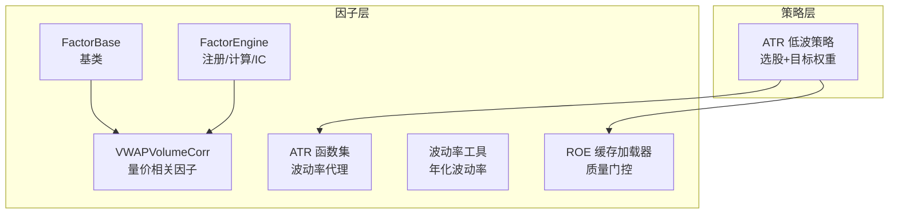
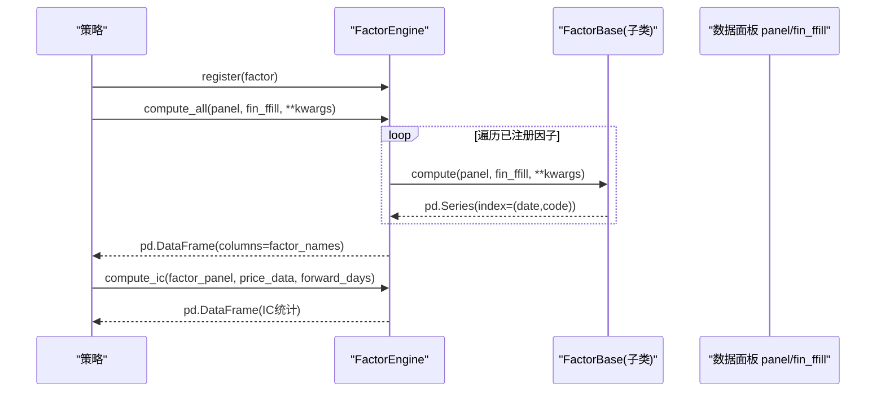
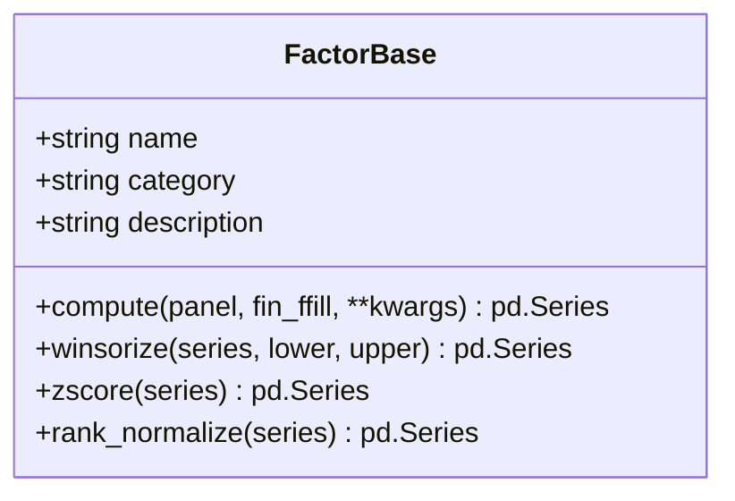
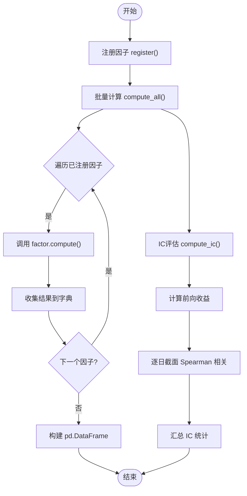
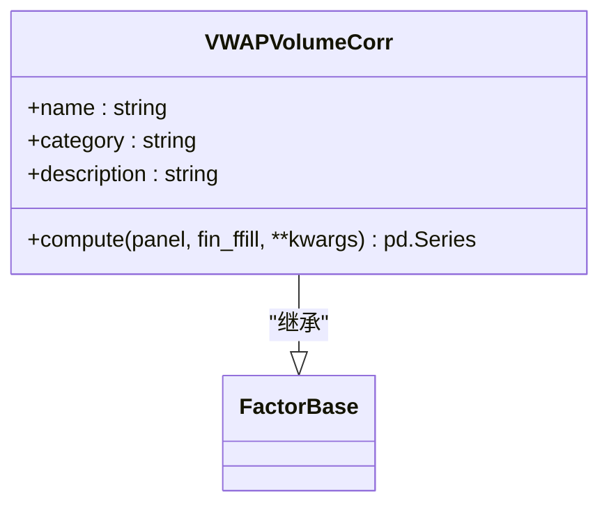
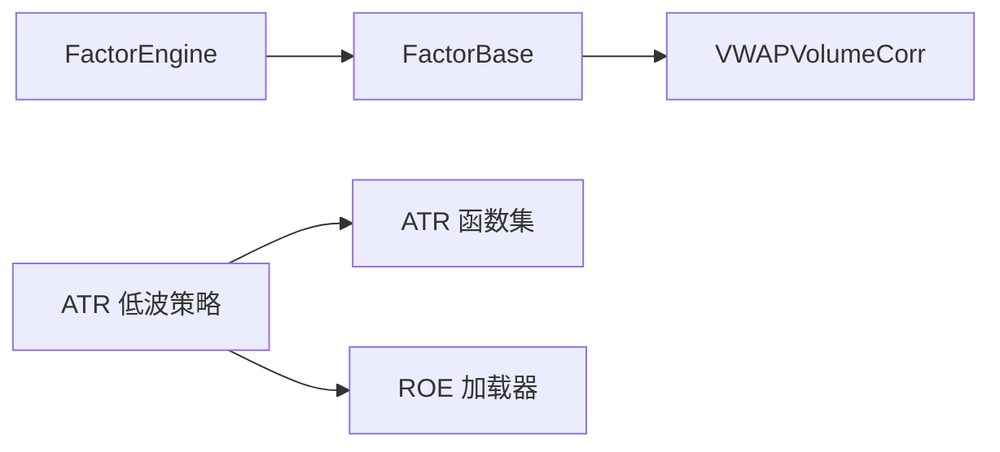

# 因子层 API

<cite>
**本文引用的文件**   
- [factors/base.py](file://factors/base.py)
- [factors/engine.py](file://factors/engine.py)
- [factors/vwap_volume_corr.py](file://factors/vwap_volume_corr.py)
- [factors/atr.py](file://factors/atr.py)
- [factors/volatility.py](file://factors/volatility.py)
- [factors/roe.py](file://factors/roe.py)
- [strategy/atr_lowvol.py](file://strategy/atr_lowvol.py)
- [projects/Project_01_多因子IC小盘Alpha/research/multi_factor_ic/factors.py](file://projects/Project_01_多因子IC小盘Alpha/research/multi_factor_ic/factors.py)
</cite>

## 目录
1. [简介](#简介)
2. [项目结构](#项目结构)
3. [核心组件](#核心组件)
4. [架构总览](#架构总览)
5. [详细组件分析](#详细组件分析)
6. [依赖关系分析](#依赖关系分析)
7. [性能考量](#性能考量)
8. [故障排查指南](#故障排查指南)
9. [结论](#结论)
10. [附录：API 参考与使用示例](#附录api-参考与使用示例)

## 简介
本文件为 QuantLab 因子层的完整 API 文档，覆盖以下要点：
- FactorBase 抽象基类的方法与属性（compute、标准化与去极值工具等）
- FactorEngine 的注册机制、批量计算接口与 IC 评估接口
- 预定义因子的使用方法（ATR 波动率、VWAP 量价相关性等）
- 自定义因子开发指南（实现、参数配置、性能优化）
- 因子面板数据结构、缺失值处理、标准化方法
- IC 分析、因子中性化、多因子组合的高级用法示例

## 项目结构
因子层位于 factors 目录，包含基类、引擎与若干预定义因子；策略层通过函数式因子或继承基类的因子进行选股与评分。

图表来源
- [factors/base.py:9-52](file://factors/base.py#L9-L52)
- [factors/engine.py:9-86](file://factors/engine.py#L9-L86)
- [factors/vwap_volume_corr.py:18-67](file://factors/vwap_volume_corr.py#L18-L67)
- [factors/atr.py:10-43](file://factors/atr.py#L10-L43)
- [factors/volatility.py:6-27](file://factors/volatility.py#L6-L27)
- [factors/roe.py:15-43](file://factors/roe.py#L15-L43)
- [strategy/atr_lowvol.py:78-165](file://strategy/atr_lowvol.py#L78-L165)

章节来源
- [factors/base.py:9-52](file://factors/base.py#L9-L52)
- [factors/engine.py:9-86](file://factors/engine.py#L9-L86)

## 核心组件
- FactorBase：定义因子统一接口 compute(panel, fin_ffill, **kwargs)，并提供常用预处理工具（去极值、Z-score、秩标准化）。
- FactorEngine：维护已注册因子字典，提供批量计算 compute_all 与截面 IC 评估 compute_ic，以及列出已注册因子 list_factors。
- 预定义因子：
  - VWAPVolumeCorr：基于 VWAP 与成交量的滚动 Spearman 相关并取负再排名。
  - ATR 系列：true_range、atr、atr_pct，用于波动率代理。
  - 波动率工具：ann_vol，用于年化波动率估计。
  - ROE 加载器：get_roe_asof，按时间点读取财务指标，避免未来信息泄露。

章节来源
- [factors/base.py:9-52](file://factors/base.py#L9-L52)
- [factors/engine.py:9-86](file://factors/engine.py#L9-L86)
- [factors/vwap_volume_corr.py:18-67](file://factors/vwap_volume_corr.py#L18-L67)
- [factors/atr.py:10-43](file://factors/atr.py#L10-L43)
- [factors/volatility.py:6-27](file://factors/volatility.py#L6-L27)
- [factors/roe.py:15-43](file://factors/roe.py#L15-L43)

## 架构总览
下图展示因子层与策略层的交互方式：策略通过函数式因子或继承基类的因子完成选股与评分；因子引擎负责统一注册与批量计算，并提供 IC 评估能力。

图表来源
- [factors/engine.py:15-32](file://factors/engine.py#L15-L32)
- [factors/engine.py:34-81](file://factors/engine.py#L34-L81)
- [factors/base.py:17-28](file://factors/base.py#L17-L28)

## 详细组件分析

### FactorBase 抽象基类
- 属性
  - name: 因子名称
  - category: 因子分类
  - description: 因子描述
- 方法
  - compute(panel, fin_ffill, **kwargs): 必须实现，返回 MultiIndex Series (date, code) -> 因子值
  - winsorize(series, lower=0.01, upper=0.99): 百分位截尾
  - zscore(series): Z-score 标准化
  - rank_normalize(series): 排序标准化到 [0,1]
- 设计要点
  - 所有因子需遵循统一的输入输出约定，便于批量计算与 IC 评估
  - 预处理工具支持在 compute 内部对序列进行稳健化处理

图表来源
- [factors/base.py:9-52](file://factors/base.py#L9-L52)

章节来源
- [factors/base.py:9-52](file://factors/base.py#L9-L52)

### FactorEngine 因子引擎
- 注册机制
  - register(factor): 将因子实例以 name 为键注册到内部字典
- 批量计算
  - compute_all(panel, fin_ffill, **kwargs): 遍历已注册因子，调用 compute 并汇总为 DataFrame
- IC 评估
  - compute_ic(factor_panel, price_data, forward_days=20): 计算前向收益，逐日截面 Spearman 相关得到每日 IC，汇总均值、标准差、ICIR、正 IC 比例、有效交易日数
- 其他
  - list_factors(): 返回已注册因子名列表

图表来源
- [factors/engine.py:15-32](file://factors/engine.py#L15-L32)
- [factors/engine.py:34-81](file://factors/engine.py#L34-L81)

章节来源
- [factors/engine.py:9-86](file://factors/engine.py#L9-L86)

### 预定义因子：VWAP 量价相关性因子
- 公式说明
  - VWAP = amount / (volume × 100)
  - 对 VWAP 与 volume 分别做截面排名，计算 5 日滚动 Spearman 相关，取负后再做截面排名
- 实现要点
  - 使用 unstack 转为宽表，rolling.corr 沿时间轴计算滚动相关
  - 对缺失值进行填充与重索引，保证输出对齐
- 适用场景
  - 作为量价类因子参与多因子评分或 IC 筛选

图表来源
- [factors/vwap_volume_corr.py:18-67](file://factors/vwap_volume_corr.py#L18-L67)
- [factors/base.py:9-52](file://factors/base.py#L9-L52)

章节来源
- [factors/vwap_volume_corr.py:18-67](file://factors/vwap_volume_corr.py#L18-L67)

### 预定义因子：ATR 波动率因子
- 函数集合
  - true_range(high, low, close): 计算真实波幅
  - atr(df, n=14): Wilder 平滑的 ATR
  - atr_pct(df, n=14): ATR 相对收盘价的百分比
- 用途
  - 作为波动率代理，常用于低波动策略选股过滤

章节来源
- [factors/atr.py:10-43](file://factors/atr.py#L10-L43)

### 预定义因子：波动率工具
- ann_vol(df, n=60): 基于收盘价近 n 日收益率的标准差估算年化波动率
- 用途
  - 风险平价、波动率目标仓位控制

章节来源
- [factors/volatility.py:6-27](file://factors/volatility.py#L6-L27)

### 预定义因子：ROE 质量门控
- get_roe_asof(code, date, parquet_path=None): 按时间点读取 ROE，避免未来信息泄露
- 用途
  - 质量筛选（如 ROE>0）

章节来源
- [factors/roe.py:15-43](file://factors/roe.py#L15-L43)

### 策略中的因子使用示例：ATR 低波策略
- 选股流程
  - 换手率区间过滤、非 ST、ATR% 阈值过滤、ROE>0 质量门控、动量门控
  - 按 ATR% 升序选择前 N 只股票，输出等权 target_weights
- 与因子层的关系
  - 直接调用函数式因子 atr_pct 与 ROE 加载器，不强制继承 FactorBase

章节来源
- [strategy/atr_lowvol.py:78-165](file://strategy/atr_lowvol.py#L78-L165)
- [factors/atr.py:10-43](file://factors/atr.py#L10-L43)
- [factors/roe.py:15-43](file://factors/roe.py#L15-L43)

## 依赖关系分析
- 模块内依赖
  - VWAPVolumeCorr 继承自 FactorBase
  - FactorEngine 依赖 FactorBase 的统一接口
- 外部依赖
  - numpy、pandas 用于数值与面板数据处理
- 耦合与内聚
  - 因子实现与引擎解耦，通过 compute 接口统一
  - 策略可灵活选择函数式因子或继承基类的因子

图表来源
- [factors/base.py:9-52](file://factors/base.py#L9-L52)
- [factors/engine.py:9-86](file://factors/engine.py#L9-L86)
- [factors/vwap_volume_corr.py:18-67](file://factors/vwap_volume_corr.py#L18-L67)
- [factors/atr.py:10-43](file://factors/atr.py#L10-L43)
- [factors/roe.py:15-43](file://factors/roe.py#L15-L43)
- [strategy/atr_lowvol.py:78-165](file://strategy/atr_lowvol.py#L78-L165)

章节来源
- [factors/base.py:9-52](file://factors/base.py#L9-L52)
- [factors/engine.py:9-86](file://factors/engine.py#L9-L86)

## 性能考量
- 面板操作
  - 优先使用 unstack/stack 与 rolling.corr 等向量化操作，避免 groupby-apply
  - 对缺失值与零值进行掩码过滤，减少无效计算
- 内存与速度
  - 宽表计算时注意列数（股票数量）与窗口长度，必要时分块或降采样
  - 财务数据缓存（如 ROE）避免重复 IO
- 鲁棒性
  - 对 std=0 或 NaN 的情况返回安全值，防止崩溃
  - 对不足历史长度的日期返回中性值（如 0），确保后续排序稳定

[本节为通用指导，不直接分析具体文件]

## 故障排查指南
- 常见错误
  - 缺少必要列：如 panel 缺少 vol 或 amount，导致 VWAP 计算失败
  - 数据不足：滚动窗口不足导致 NaN，需填充或跳过
  - 标准差为零：zscore 返回全 NaN，需检查数据分布
- 定位建议
  - 在 compute_all 中捕获异常并打印失败因子名
  - 检查 factor_panel 与 price_data 的索引对齐与缺失情况
  - 确认财务数据路径与缓存是否初始化

章节来源
- [factors/engine.py:27-32](file://factors/engine.py#L27-L32)
- [factors/vwap_volume_corr.py:37-43](file://factors/vwap_volume_corr.py#L37-L43)
- [factors/base.py:40-46](file://factors/base.py#L40-L46)

## 结论
QuantLab 因子层通过 FactorBase 统一接口与 FactorEngine 注册/计算/IC 评估能力，提供了可扩展、高性能的因子开发与评估框架。预定义因子覆盖了波动率、量价与质量维度，策略层可灵活组合函数式因子与基类因子，快速实现选股与评分逻辑。

[本节为总结，不直接分析具体文件]

## 附录：API 参考与使用示例

### FactorBase API
- 属性
  - name, category, description
- 方法
  - compute(panel, fin_ffill, **kwargs) -> pd.Series
  - winsorize(series, lower=0.01, upper=0.99) -> pd.Series
  - zscore(series) -> pd.Series
  - rank_normalize(series) -> pd.Series

章节来源
- [factors/base.py:9-52](file://factors/base.py#L9-L52)

### FactorEngine API
- register(factor) -> self
- compute_all(panel, fin_ffill, **kwargs) -> pd.DataFrame
- compute_ic(factor_panel, price_data, forward_days=20) -> pd.DataFrame
- list_factors() -> List[str]

章节来源
- [factors/engine.py:9-86](file://factors/engine.py#L9-L86)

### 预定义因子 API
- VWAPVolumeCorr.compute(panel, fin_ffill, **kwargs) -> pd.Series
- atr(df, n=14) -> float
- atr_pct(df, n=14) -> float
- ann_vol(df, n=60) -> float
- get_roe_asof(code, date, parquet_path=None) -> float or None

章节来源
- [factors/vwap_volume_corr.py:18-67](file://factors/vwap_volume_corr.py#L18-L67)
- [factors/atr.py:10-43](file://factors/atr.py#L10-L43)
- [factors/volatility.py:6-27](file://factors/volatility.py#L6-L27)
- [factors/roe.py:15-43](file://factors/roe.py#L15-L43)

### 因子面板数据结构
- index: MultiIndex (trade_date, ts_code)
- columns: 各因子名称
- values: 因子值（可能含 NaN）

章节来源
- [factors/engine.py:20-32](file://factors/engine.py#L20-L32)
- [factors/vwap_volume_corr.py:28-67](file://factors/vwap_volume_corr.py#L28-L67)

### 缺失值处理与标准化
- 缺失值
  - 滚动窗口不足导致的 NaN 可通过 fillna(0.0) 或跳过
  - 零值与停牌需掩码排除
- 标准化
  - winsorize: 百分位截尾
  - zscore: 均值方差标准化
  - rank_normalize: 截面秩标准化到 [0,1]

章节来源
- [factors/base.py:30-52](file://factors/base.py#L30-L52)
- [factors/vwap_volume_corr.py:57-67](file://factors/vwap_volume_corr.py#L57-L67)

### IC 分析示例
- 步骤
  - 准备价格面板，计算前向收益
  - 合并因子面板与前向收益
  - 逐日截面 Spearman 相关计算 IC
  - 汇总 IC 均值、标准差、ICIR、正 IC 比例、有效天数

章节来源
- [factors/engine.py:34-81](file://factors/engine.py#L34-L81)

### 因子中性化与多因子组合
- 中性化思路
  - 对因子值进行行业中性化（回归残差）或市值中性化
  - 在截面内进行横截面标准化（zscore/rank）
- 多因子组合
  - 将多个因子标准化后加权求和，得到综合得分
  - 或使用 IC 加权（ICIR 越高权重越大）

章节来源
- [projects/Project_01_多因子IC小盘Alpha/research/multi_factor_ic/factors.py:8-31](file://projects/Project_01_多因子IC小盘Alpha/research/multi_factor_ic/factors.py#L8-L31)

### 自定义因子实现指南
- 继承 FactorBase
  - 实现 compute(panel, fin_ffill, **kwargs)
  - 设置 name、category、description
- 参数配置
  - 通过 __init__ 接收参数，并在 compute 中使用
- 性能优化
  - 使用向量化操作与宽表计算
  - 合理处理缺失值与边界条件

章节来源
- [factors/base.py:9-52](file://factors/base.py#L9-L52)
- [factors/vwap_volume_corr.py:18-67](file://factors/vwap_volume_corr.py#L18-L67)