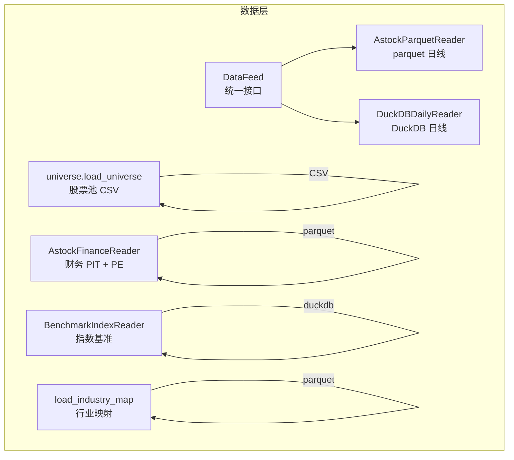
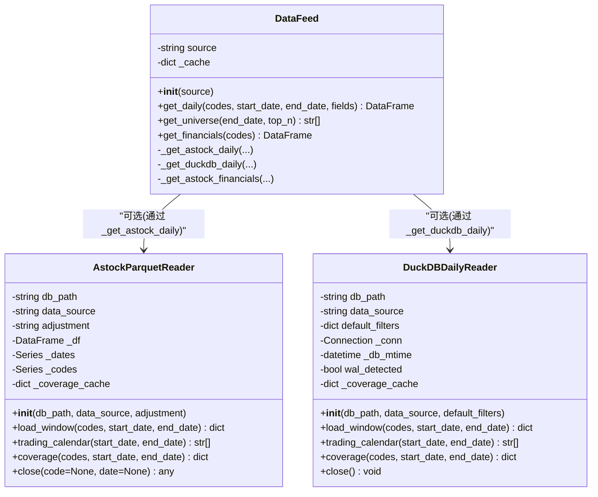
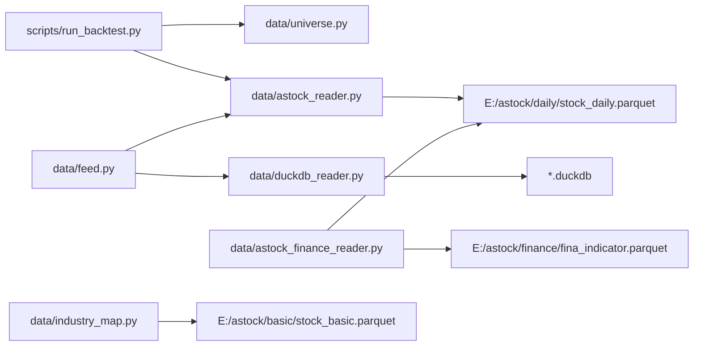

# 数据层 API

<cite>
**本文引用的文件**   
- [data/feed.py](file://data/feed.py)
- [data/astock_reader.py](file://data/astock_reader.py)
- [data/duckdb_reader.py](file://data/duckdb_reader.py)
- [data/universe.py](file://data/universe.py)
- [data/astock_finance_reader.py](file://data/astock_finance_reader.py)
- [data/benchmark_reader.py](file://data/benchmark_reader.py)
- [data/industry_map.py](file://data/industry_map.py)
- [scripts/run_backtest.py](file://scripts/run_backtest.py)
</cite>

## 目录
1. [简介](#简介)
2. [项目结构](#项目结构)
3. [核心组件](#核心组件)
4. [架构总览](#架构总览)
5. [详细组件分析](#详细组件分析)
6. [依赖关系分析](#依赖关系分析)
7. [性能与优化](#性能与优化)
8. [故障排查指南](#故障排查指南)
9. [结论](#结论)
10. [附录：数据类型与字段说明](#附录数据类型与字段说明)

## 简介
本文件为 QuantLab 数据层的 API 文档，聚焦于统一数据接口 DataFeed 以及底层读取器 AstockParquetReader、DuckDBDailyReader，并覆盖股票池管理 universe、财务数据 PIT 查询 astock_finance_reader、指数基准 benchmark_reader 和行业映射 industry_map。文档提供方法签名、参数约定、返回格式、错误处理策略、缓存机制与性能优化建议，并给出完整使用示例路径，帮助快速上手历史行情、财务指标、交易日历等数据的获取与使用。

## 项目结构
数据层位于 data 目录，按职责划分：
- feed.py：统一数据源接口 DataFeed，屏蔽 astock parquet 与 DuckDB 的差异
- astock_reader.py：AstockParquetReader，基于 parquet 的只读日线读取器
- duckdb_reader.py：DuckDBDailyReader，基于 DuckDB 的只读日线读取器（支持多 schema）
- universe.py：CSV 股票池加载与校验
- astock_finance_reader.py：PIT 安全的财务指标与 PE 快照读取
- benchmark_reader.py：指数基准序列读取
- industry_map.py：行业映射加载与进程级缓存

图表来源
- [data/feed.py:17-124](file://data/feed.py#L17-L124)
- [data/astock_reader.py:25-116](file://data/astock_reader.py#L25-L116)
- [data/duckdb_reader.py:35-132](file://data/duckdb_reader.py#L35-L132)
- [data/universe.py:27-61](file://data/universe.py#L27-L61)
- [data/astock_finance_reader.py:26-130](file://data/astock_finance_reader.py#L26-L130)
- [data/benchmark_reader.py:21-63](file://data/benchmark_reader.py#L21-L63)
- [data/industry_map.py:16-36](file://data/industry_map.py#L16-L36)

章节来源
- [data/feed.py:1-197](file://data/feed.py#L1-L197)
- [data/astock_reader.py:1-192](file://data/astock_reader.py#L1-L192)
- [data/duckdb_reader.py:1-215](file://data/duckdb_reader.py#L1-L215)
- [data/universe.py:1-62](file://data/universe.py#L1-L62)
- [data/astock_finance_reader.py:1-200](file://data/astock_finance_reader.py#L1-L200)
- [data/benchmark_reader.py:1-73](file://data/benchmark_reader.py#L1-L73)
- [data/industry_map.py:1-41](file://data/industry_map.py#L1-L41)

## 核心组件
- DataFeed：统一数据源入口，封装 get_daily()、get_universe()、get_financials()；内部根据 source 选择 astock 或 duckdb 实现
- AstockParquetReader：纯内存 parquet 读取，提供 load_window()、trading_calendar()、coverage()、close()
- DuckDBDailyReader：DuckDB 只读连接，提供 load_window()、trading_calendar()、coverage()、close()
- universe.load_universe()：从 CSV 加载并校验股票代码、启用状态、去重与空集检查
- AstockFinanceReader：PIT 安全的基本面与 PE 快照查询
- BenchmarkIndexReader：指数基准序列读取
- industry_map.load_industry_map()：行业映射加载与进程级缓存

章节来源
- [data/feed.py:17-134](file://data/feed.py#L17-L134)
- [data/astock_reader.py:25-116](file://data/astock_reader.py#L25-L116)
- [data/duckdb_reader.py:35-132](file://data/duckdb_reader.py#L35-L132)
- [data/universe.py:27-61](file://data/universe.py#L27-L61)
- [data/astock_finance_reader.py:26-130](file://data/astock_finance_reader.py#L26-L130)
- [data/benchmark_reader.py:21-63](file://data/benchmark_reader.py#L21-L63)
- [data/industry_map.py:16-36](file://data/industry_map.py#L16-L36)

## 架构总览
DataFeed 作为门面，将上层调用解耦到具体 reader。AstockParquetReader 与 DuckDBDailyReader 遵循相同的“鸭式”接口，便于在回测引擎中无缝切换数据源。

图表来源
- [data/feed.py:17-124](file://data/feed.py#L17-L124)
- [data/astock_reader.py:25-116](file://data/astock_reader.py#L25-L116)
- [data/duckdb_reader.py:35-132](file://data/duckdb_reader.py#L35-L132)

## 详细组件分析

### DataFeed 统一数据接口
- 初始化
  - 参数 source：取值 "astock" 或 "duckdb"
  - 内部维护 _cache 用于缓存已读取的 parquet 数据
- 方法
  - get_daily(codes, start_date, end_date, fields)
    - 返回 MultiIndex DataFrame，索引为 (date, code)，列包含 OHLCV 及可选字段
    - source="astock"：从本地 parquet 读取并按 trade_date/ts_code 过滤与重排
    - source="duckdb"：通过 DuckDBDailyReader 拉取窗口数据后拼接为 MultiIndex
  - get_universe(end_date, top_n)
    - 基于最近交易日成交额排序返回 top_n 代码列表
  - get_financials(codes)
    - 当前仅支持 astock parquet 财务表读取，返回原始 DataFrame
- 错误处理
  - 未知 source 抛出 ValueError
  - astock parquet 缺失抛出 FileNotFoundError
  - 日期过滤与字段选择失败时返回空 DataFrame

章节来源
- [data/feed.py:17-134](file://data/feed.py#L17-L134)
- [data/feed.py:71-134](file://data/feed.py#L71-L134)

### AstockParquetReader（astock_reader）
- 初始化
  - 参数
    - db_path：parquet 路径，默认 E:/astock/daily/stock_daily.parquet
    - data_source：固定 "astock"
    - adjustment：raw/qfq/hfq，影响价格复权计算
  - 行为
    - 仅读取必要列以降低内存占用
    - 构建 (trade_date, ts_code) 的 MultiIndex
    - 预计算 _dates/_codes 加速过滤
- 方法
  - load_window(codes, start_date, end_date)
    - 返回 {code: DataFrame}，列对齐为 date/open/high/low/close/vol/amount 及可选衍生字段
    - 支持 qfq/hfq 复权计算（基于 adj_factor）
  - trading_calendar(start_date, end_date)
    - 返回区间内交易日字符串列表
  - coverage(codes, start_date, end_date)
    - 返回数据覆盖信息，含最小/最大日期、代码数量、去重计数、数据库 mtime
    - 若传入 codes，则补充 universe_coverage 明细
  - close(code=None, date=None)
    - 无参清理（兼容外部 finally 调用）
    - 有参时返回指定 code/date 的收盘价（支持复权）
- 性能要点
  - 内存驻留 DataFrame，适合多次查询
  - 列裁剪与 MultiIndex 过滤提升 IO 与 CPU 效率

章节来源
- [data/astock_reader.py:25-116](file://data/astock_reader.py#L25-L116)
- [data/astock_reader.py:118-185](file://data/astock_reader.py#L118-L185)

### DuckDBDailyReader（duckdb_reader）
- 初始化
  - 参数
    - db_path：DuckDB 文件路径
    - data_source：jince_zhisuan 或 qmt_self_owned（必须显式声明）
    - default_filters：qmt_self_owned 默认 {"adjustment":"hfq","source":"xtquant"}
  - 行为
    - 以 read_only=True 打开连接
    - WAL 检测（jince_zhisuan 模式）并发出警告
    - 记录 db_mtime 用于一致性校验
- 方法
  - load_window(codes, start_date, end_date)
    - 校验范围是否在 coverage 内
    - 生成 SQL 拉取 OHLCV，按 code 分组返回 {code: DataFrame}
  - trading_calendar(start_date, end_date)
    - 返回区间交易日字符串列表
  - coverage(codes, start_date, end_date)
    - 统计 min/max 日期、代码数、去重行数、数据库 mtime
    - 若传入 codes，返回 universe_coverage 明细
  - close()
    - 关闭连接
- 性能要点
  - 服务端端聚合与过滤，减少内存传输
  - 去重策略因 schema 不同而异（QUALIFY ROW_NUMBER 或天然唯一）

章节来源
- [data/duckdb_reader.py:35-132](file://data/duckdb_reader.py#L35-L132)
- [data/duckdb_reader.py:134-205](file://data/duckdb_reader.py#L134-L205)

### universe 模块（股票池管理）
- 功能
  - load_universe(path)：从 CSV 加载股票池，校验首列为 code，正则匹配 6 位代码+SZ/SH，处理 enabled 字段、去重、空集检查
- 返回值
  - {"codes": List[str], "records": List[dict], "dropped_codes": List[str]}
  - records 包含 code/name/sector/enabled
- 错误处理
  - 首列非 code 抛 ValueError
  - 无效代码行被丢弃并记录警告
  - 全为空集合抛 ValueError

章节来源
- [data/universe.py:27-61](file://data/universe.py#L27-L61)

### AstockFinanceReader（财务数据与 PIT）
- 功能
  - get_fundamentals_pit(code, asof_date, fields)：按公告日 <= asof_date 可见性规则，选取最新 end_date 的财务字段
  - get_daily_pe(code, asof_date)：从 daily parquet 获取静态/动态 PE（pe/pe_ttm），保证 trade_date <= asof_date
  - get_fundamentals_for_scoring(codes, asof_date)：批量构造评分所需字典
- 数据源
  - fina_indicator.parquet（季度基本面）
  - stock_daily.parquet（每日 PE 快照）
- 错误处理
  - 文件不存在抛 FileNotFoundError
  - 无数据返回空字典

章节来源
- [data/astock_finance_reader.py:26-130](file://data/astock_finance_reader.py#L26-L130)
- [data/astock_finance_reader.py:135-174](file://data/astock_finance_reader.py#L135-L174)

### BenchmarkIndexReader（指数基准）
- 功能
  - coverage(code)：统计某指数的行数与日期范围
  - load_series(code, start_date, end_date)：返回 [(date_str, close)] 升序序列
- 约束
  - 只读，不 ATTACH，不写
  - 文件不存在抛 FileNotFoundError

章节来源
- [data/benchmark_reader.py:21-63](file://data/benchmark_reader.py#L21-L63)

### Industry Map（行业映射）
- 功能
  - load_industry_map(parquet_path=None, refresh=False)：从 stock_basic.parquet 读取 ts_code -> industry 映射，进程级缓存
  - clear_cache()：清空缓存
- 错误处理
  - 文件不存在抛 FileNotFoundError

章节来源
- [data/industry_map.py:16-36](file://data/industry_map.py#L16-L36)

## 依赖关系分析
- DataFeed 依赖 astock parquet 与 DuckDB 两种后端，通过 source 路由
- AstockParquetReader 与 DuckDBDailyReader 遵循相同接口，便于替换
- run_backtest.py 演示了 AstockParquetReader 与 universe.load_universe 的组合使用
- industry_map 按需加载，避免不必要的 I/O

图表来源
- [scripts/run_backtest.py:29-90](file://scripts/run_backtest.py#L29-L90)
- [data/feed.py:17-124](file://data/feed.py#L17-L124)
- [data/astock_reader.py:25-116](file://data/astock_reader.py#L25-L116)
- [data/duckdb_reader.py:35-132](file://data/duckdb_reader.py#L35-L132)
- [data/astock_finance_reader.py:42-60](file://data/astock_finance_reader.py#L42-L60)
- [data/industry_map.py:16-36](file://data/industry_map.py#L16-L36)

章节来源
- [scripts/run_backtest.py:25-132](file://scripts/run_backtest.py#L25-L132)
- [data/feed.py:17-124](file://data/feed.py#L17-L124)

## 性能与优化
- 列裁剪与内存驻留
  - AstockParquetReader 仅读取必要列，降低内存占用
  - 构建 MultiIndex 与预计算 _dates/_codes 加速过滤
- 服务端过滤
  - DuckDBDailyReader 在数据库侧完成 WHERE/BETWEEN/去重，减少数据传输
- 缓存机制
  - DataFeed._cache 缓存 astock parquet 读取结果
  - industry_map 进程级缓存，避免重复 I/O
  - DuckDB/Astock 的 coverage 结果缓存
- 复权计算
  - AstockParquetReader 支持 raw/qfq/hfq，基于 adj_factor 调整价格列
- WAL 检测
  - DuckDB jince_zhisuan 模式检测到 .wal 文件会发出警告，提示数据同步未完成前哈希不稳定

章节来源
- [data/astock_reader.py:47-68](file://data/astock_reader.py#L47-L68)
- [data/duckdb_reader.py:63-75](file://data/duckdb_reader.py#L63-L75)
- [data/feed.py:71-77](file://data/feed.py#L71-L77)
- [data/industry_map.py:23-36](file://data/industry_map.py#L23-L36)

## 故障排查指南
- 常见异常
  - FileNotFoundError：parquet/DuckDB 文件路径错误或未放置
  - ValueError：未知 source、codes 为空、日期范围超出 coverage、adjustment 非法
  - 空结果：请求区间无数据或代码不在覆盖范围内
- 定位步骤
  - 先调用 coverage() 确认数据范围与代码覆盖
  - 检查 adjustement 配置与数据是否一致
  - 对 astock 模式，确认 parquet 存在且包含 trade_date/ts_code
  - 对 duckdb 模式，确认 data_source 与默认过滤器设置正确
- 日志与警告
  - DuckDB WAL 警告：等待同步完成后重试
  - universe CSV 无效代码与重复代码会被丢弃并记录警告

章节来源
- [data/duckdb_reader.py:63-75](file://data/duckdb_reader.py#L63-L75)
- [data/astock_reader.py:71-91](file://data/astock_reader.py#L71-L91)
- [data/universe.py:38-61](file://data/universe.py#L38-L61)

## 结论
QuantLab 数据层通过 DataFeed 统一接口屏蔽底层差异，AstockParquetReader 与 DuckDBDailyReader 提供一致的 load_window/trading_calendar/coverage/close 能力，配合 universe、财务 PIT、行业映射与基准读取，形成完整的数据供给体系。建议在回测中优先使用 coverage 校验数据范围，结合列裁剪与缓存策略提升性能，并通过 WAL 与日志信息进行问题定位。

## 附录：数据类型与字段说明

### DataFeed.get_daily()
- 输入
  - codes：List[str]，tushare 风格代码（如 "000001.SZ"）
  - start_date/end_date：字符串 "YYYY-MM-DD"
  - fields：List[str]，可选字段名
- 输出
  - MultiIndex DataFrame，索引 (date, code)，列包含 open/high/low/close/vol/amount 等
- 注意
  - astock 模式下字段来自 parquet 列；duckdb 模式列固定为 date/open/high/low/close/vol/amount

章节来源
- [data/feed.py:28-41](file://data/feed.py#L28-L41)
- [data/astock_reader.py:71-116](file://data/astock_reader.py#L71-L116)
- [data/duckdb_reader.py:90-132](file://data/duckdb_reader.py#L90-L132)

### DataFeed.get_universe()
- 输入
  - end_date：字符串 "YYYY-MM-DD"
  - top_n：int，默认 500
- 输出
  - List[str]，按成交额降序的前 top_n 代码

章节来源
- [data/feed.py:43-63](file://data/feed.py#L43-L63)

### AstockParquetReader.load_window()
- 输入
  - codes：List[str]
  - start_date/end_date：字符串 "YYYY-MM-DD"
- 输出
  - dict{code: DataFrame}，列 date/open/high/low/close/vol/amount 及可选衍生字段
- 复权
  - adjustment=raw/qfq/hfq，基于 adj_factor 调整价格列

章节来源
- [data/astock_reader.py:71-116](file://data/astock_reader.py#L71-L116)

### AstockParquetReader.trading_calendar()
- 输入
  - start_date/end_date：字符串 "YYYY-MM-DD"
- 输出
  - List[str]，区间内交易日字符串

章节来源
- [data/astock_reader.py:118-126](file://data/astock_reader.py#L118-L126)

### AstockParquetReader.coverage()
- 输入
  - codes：可选 List[str]
  - start_date/end_date：可选字符串
- 输出
  - dict，包含 data_source/min_date/max_date/n_codes/n_rows_after_dedup/dedup_count/db_mtime
  - 若传入 codes，增加 universe_coverage 明细

章节来源
- [data/astock_reader.py:128-161](file://data/astock_reader.py#L128-L161)

### DuckDBDailyReader.load_window()
- 输入
  - codes：List[str]
  - start_date/end_date：字符串 "YYYY-MM-DD"
- 输出
  - dict{code: DataFrame}，列 date/open/high/low/close/vol/amount

章节来源
- [data/duckdb_reader.py:90-132](file://data/duckdb_reader.py#L90-L132)

### DuckDBDailyReader.trading_calendar()
- 输入
  - start_date/end_date：字符串 "YYYY-MM-DD"
- 输出
  - List[str]，区间内交易日字符串

章节来源
- [data/duckdb_reader.py:134-144](file://data/duckdb_reader.py#L134-L144)

### DuckDBDailyReader.coverage()
- 输入
  - codes：可选 List[str]
  - start_date/end_date：可选字符串
- 输出
  - dict，包含 data_source/min_date/max_date/n_codes/n_rows_after_dedup/dedup_count/db_mtime
  - 若传入 codes，增加 universe_coverage 明细

章节来源
- [data/duckdb_reader.py:146-205](file://data/duckdb_reader.py#L146-L205)

### universe.load_universe()
- 输入
  - path：CSV 路径，首列必须为 code
- 输出
  - {"codes": List[str], "records": List[dict], "dropped_codes": List[str]}
  - records 包含 code/name/sector/enabled

章节来源
- [data/universe.py:27-61](file://data/universe.py#L27-L61)

### AstockFinanceReader.get_fundamentals_pit()
- 输入
  - code：tushare 代码
  - asof_date：字符串 "YYYY-MM-DD"
  - fields：可选字段列表
- 输出
  - dict{field: value}，NaN 转为 None；始终包含 end_date

章节来源
- [data/astock_finance_reader.py:66-129](file://data/astock_finance_reader.py#L66-L129)

### AstockFinanceReader.get_daily_pe()
- 输入
  - code：tushare 代码
  - asof_date：字符串 "YYYY-MM-DD"
- 输出
  - dict{"static_pe": float, "dynamic_pe": float}（可能为空）

章节来源
- [data/astock_finance_reader.py:135-174](file://data/astock_finance_reader.py#L135-L174)

### BenchmarkIndexReader.load_series()
- 输入
  - code：指数代码
  - start_date/end_date：字符串 "YYYY-MM-DD"
- 输出
  - List[(date_str, close)]，升序排列

章节来源
- [data/benchmark_reader.py:52-63](file://data/benchmark_reader.py#L52-L63)

### industry_map.load_industry_map()
- 输入
  - parquet_path：可选，默认 E:/astock/basic/stock_basic.parquet
  - refresh：强制重新读取
- 输出
  - dict{ts_code: industry}

章节来源
- [data/industry_map.py:16-36](file://data/industry_map.py#L16-L36)

## 使用示例（路径指引）
- 使用 AstockParquetReader 与 universe 进行回测
  - 参考脚本：scripts/run_backtest.py
  - 关键步骤：加载 universe CSV → 创建 AstockParquetReader → 传入 run_backtest
- 使用 DataFeed 统一接口获取面板数据
  - 参考：data/feed.py 中的 get_panel() 与 __main__ 测试片段
- 使用 DuckDBDailyReader 直接拉取窗口数据
  - 参考：data/duckdb_reader.py 的 load_window()/trading_calendar()/coverage()

章节来源
- [scripts/run_backtest.py:29-90](file://scripts/run_backtest.py#L29-L90)
- [data/feed.py:137-181](file://data/feed.py#L137-L181)
- [data/duckdb_reader.py:90-132](file://data/duckdb_reader.py#L90-L132)