# 策略层 API

<cite>
**本文引用的文件**   
- [strategy/registry.py](file://strategy/registry.py)
- [strategy/schedule.py](file://strategy/schedule.py)
- [strategy/template_lowvol.py](file://strategy/template_lowvol.py)
- [strategy/atr_lowvol.py](file://strategy/atr_lowvol.py)
- [backtest/engine.py](file://backtest/engine.py)
- [backtest/rebalance.py](file://backtest/rebalance.py)
- [backtest/execution.py](file://backtest/execution.py)
- [factors/base.py](file://factors/base.py)
- [factors/engine.py](file://factors/engine.py)
- [config/atr_lowvol_fw.yaml](file://config/atr_lowvol_fw.yaml)
- [scripts/run_backtest.py](file://scripts/run_backtest.py)
</cite>

## 目录
1. [简介](#简介)
2. [项目结构](#项目结构)
3. [核心组件](#核心组件)
4. [架构总览](#架构总览)
5. [详细组件分析](#详细组件分析)
6. [依赖关系分析](#依赖关系分析)
7. [性能与回测特性](#性能与回测特性)
8. [故障排查指南](#故障排查指南)
9. [结论](#结论)
10. [附录：参数与配置速查](#附录参数与配置速查)

## 简介
本文件为 QuantLab 策略层的权威 API 文档，聚焦以下目标：
- 策略注册装饰器 @register_strategy 的使用方式、参数约定与版本管理要点
- 策略开发模板与基类接口：evaluate_day() 的输入输出规范（含 target_weights 模式）
- 调仓时间管理 API：is_rebalance_day() 的频率控制与日历窗口
- 示例策略深度解析：ATR 低波策略选股逻辑、参数调优建议
- 策略与因子系统的数据集成方式、数据获取接口、订单生成格式
- 调试工具、回测入口、性能监控等开发辅助功能的 API 说明

## 项目结构
策略层位于 strategy/ 包内，采用“扁平注册 + 自动发现”的设计：每个策略模块在顶层使用 @register_strategy("name") 装饰 evaluate_day，并在导入时自动注册。引擎通过 registry 查找并调用策略函数，随后由通用组合层将 target_weights 转换为可执行的买卖决策。

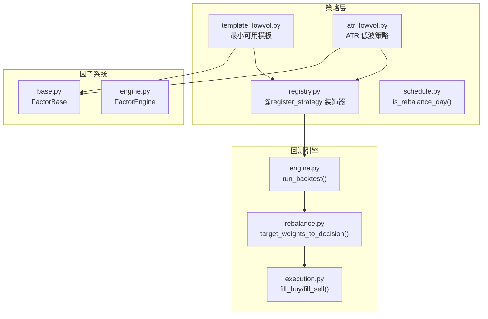

图表来源
- [strategy/registry.py:1-115](file://strategy/registry.py#L1-L115)
- [strategy/schedule.py:1-47](file://strategy/schedule.py#L1-L47)
- [strategy/template_lowvol.py:1-94](file://strategy/template_lowvol.py#L1-L94)
- [strategy/atr_lowvol.py:1-165](file://strategy/atr_lowvol.py#L1-L165)
- [backtest/engine.py:237-619](file://backtest/engine.py#L237-L619)
- [backtest/rebalance.py:101-195](file://backtest/rebalance.py#L101-L195)
- [backtest/execution.py:95-204](file://backtest/execution.py#L95-L204)
- [factors/base.py:1-52](file://factors/base.py#L1-L52)
- [factors/engine.py:1-86](file://factors/engine.py#L1-L86)

章节来源
- [strategy/registry.py:1-115](file://strategy/registry.py#L1-L115)
- [strategy/template_lowvol.py:1-94](file://strategy/template_lowvol.py#L1-L94)
- [strategy/atr_lowvol.py:1-165](file://strategy/atr_lowvol.py#L1-L165)
- [backtest/engine.py:237-619](file://backtest/engine.py#L237-L619)

## 核心组件
- 策略注册中心（StrategyRegistry）
  - 提供 @register_strategy(name) 装饰器，用于在模块顶层注册 evaluate_day 函数
  - 支持 list_strategies()、get_strategy(name)、strategy_spy(name, fn) 测试辅助
  - 自动扫描 strategy/ 包触发所有模块导入，完成注册
- 调仓时间管理（Schedule）
  - is_rebalance_day(current_date, freq, calendar) 统一周/月/季首交易日判定
- 通用组合层（Rebalance Layer）
  - target_weights_to_decision(target_weights, pf, date, config, market_window, industry_map)
  - 将策略的相对权重意图转化为 sell_decisions/buy_candidates/target_positions
  - 内置 equal/vol_parity/custom 仓位模型、行业上限、波动率目标、杠杆上限、最小持仓金额等
- 执行层（Execution）
  - fill_buy()/fill_sell() 实现 next_open 成交模型、涨跌停/停牌/滑点/整数手约束
- 因子系统（Factors）
  - FactorBase 抽象基类与 FactorEngine 注册/计算/IC 统计

章节来源
- [strategy/registry.py:24-44](file://strategy/registry.py#L24-L44)
- [strategy/schedule.py:10-46](file://strategy/schedule.py#L10-L46)
- [backtest/rebalance.py:101-195](file://backtest/rebalance.py#L101-L195)
- [backtest/execution.py:95-204](file://backtest/execution.py#L95-L204)
- [factors/base.py:9-52](file://factors/base.py#L9-L52)
- [factors/engine.py:9-86](file://factors/engine.py#L9-L86)

## 架构总览
下图展示从回测入口到策略评估、组合层转换、执行撮合的完整流程。

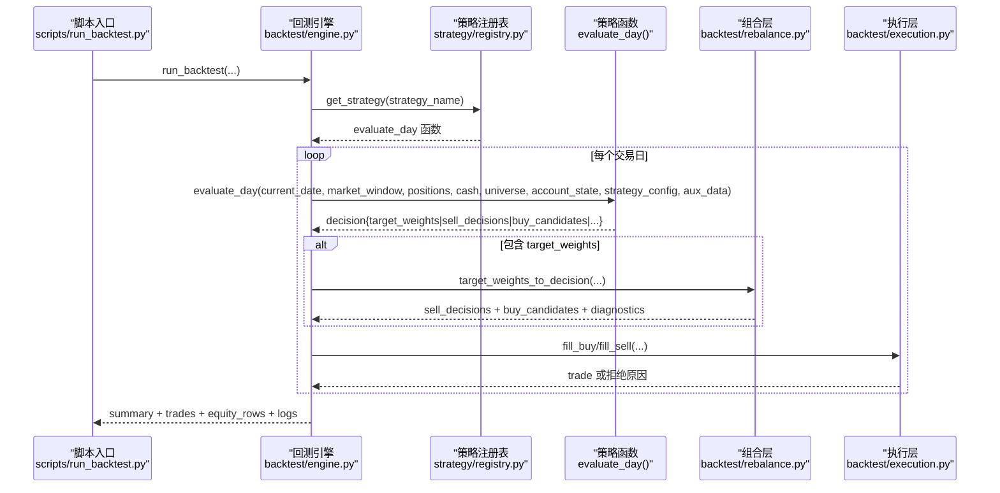

图表来源
- [scripts/run_backtest.py:93-131](file://scripts/run_backtest.py#L93-L131)
- [backtest/engine.py:237-619](file://backtest/engine.py#L237-L619)
- [strategy/registry.py:24-44](file://strategy/registry.py#L24-L44)
- [backtest/rebalance.py:101-195](file://backtest/rebalance.py#L101-L195)
- [backtest/execution.py:95-204](file://backtest/execution.py#L95-L204)

## 详细组件分析

### 策略注册与装饰器 @register_strategy
- 功能
  - 在模块顶层以 @register_strategy("<name>") 装饰 evaluate_day，完成注册
  - 支持 list_strategies() 查看已注册策略名；get_strategy(name) 获取函数引用
  - 提供 strategy_spy(name, fn) 上下文管理器用于替换/注入临时策略进行调试
- 自动发现
  - 模块导入时通过 _autodiscover() 扫描 strategy/ 包，跳过已知非策略模块
  - 单模块导入失败不影响整体运行
- 版本与兼容性
  - 引擎侧维护 _STRATEGY_CORE_VERSION，用于摘要输出与兼容性校验
  - 策略可通过 ALLOWED_TRADING_MODELS 声明支持的交易模型（默认 ["next_open"]）

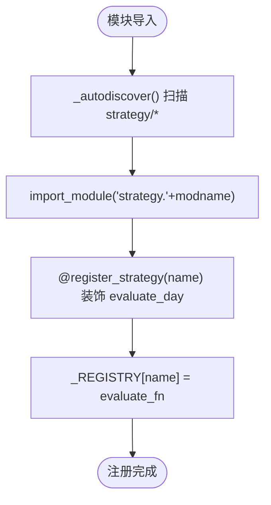

图表来源
- [strategy/registry.py:96-114](file://strategy/registry.py#L96-L114)
- [strategy/registry.py:24-44](file://strategy/registry.py#L24-L44)
- [backtest/engine.py:207-234](file://backtest/engine.py#L207-L234)

章节来源
- [strategy/registry.py:24-44](file://strategy/registry.py#L24-L44)
- [strategy/registry.py:96-114](file://strategy/registry.py#L96-L114)
- [backtest/engine.py:207-234](file://backtest/engine.py#L207-L234)

### 调仓时间管理 API：is_rebalance_day
- 作用
  - 判断当前日期是否为周/月/季的首个交易日
- 参数
  - current_date: 字符串日期
  - freq: 'weekly' | 'monthly' | 'quarterly' | None/''（None 表示每日）
  - calendar: 交易日列表（YYYY-MM-DD），用于精确窗口匹配
- 行为
  - 优先基于 calendar 计算窗口首日；若失败则回退到工作日启发式规则

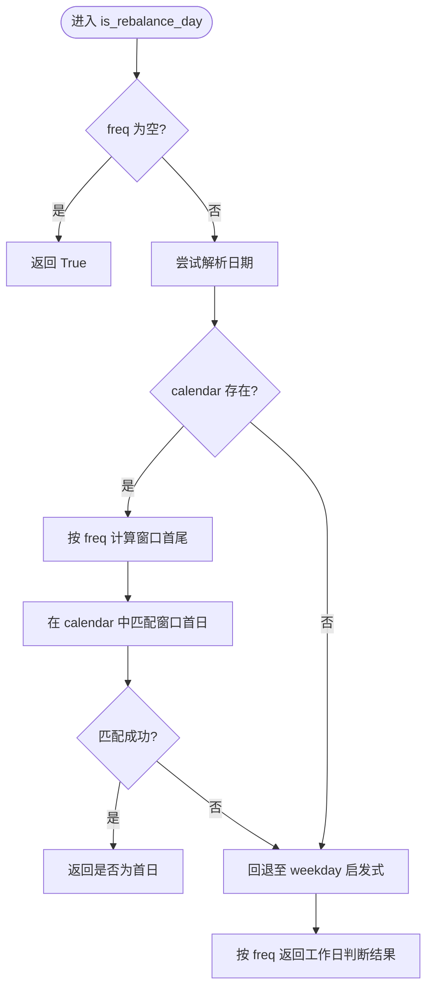

图表来源
- [strategy/schedule.py:10-46](file://strategy/schedule.py#L10-L46)

章节来源
- [strategy/schedule.py:10-46](file://strategy/schedule.py#L10-L46)

### 策略开发模板与 evaluate_day 接口
- 模板策略 template_lowvol
  - 仅负责在调仓日选出 n_hold 只最低波动标的，返回 target_weights={code: 1.0}
  - 其余仓位模型、行业上限、波动率目标、杠杆、真实约束全部交由组合层处理
- evaluate_day 签名与约定
  - 输入：current_date, market_window, positions, cash, universe, account_state, strategy_config, aux_data
  - 输出：decision dict，至少包含 sell_decisions / buy_candidates / target_weights / target_positions / blocked_candidates / diagnostics / logs
  - 当 decision 包含 target_weights 时，引擎会调用组合层将其转为标准决策

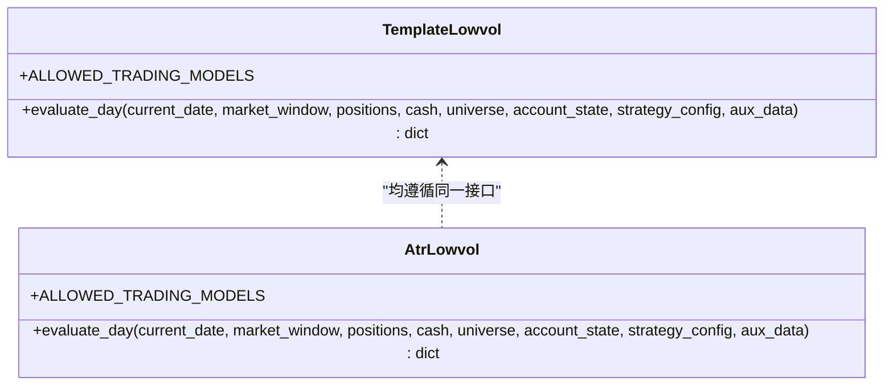

图表来源
- [strategy/template_lowvol.py:27-94](file://strategy/template_lowvol.py#L27-L94)
- [strategy/atr_lowvol.py:29-165](file://strategy/atr_lowvol.py#L29-L165)

章节来源
- [strategy/template_lowvol.py:27-94](file://strategy/template_lowvol.py#L27-L94)
- [strategy/atr_lowvol.py:29-165](file://strategy/atr_lowvol.py#L29-L165)

### 通用组合层：target_weights_to_decision
- 输入
  - target_weights: {code: weight}，weight>0 表示持有意愿
  - pf: Portfolio 实例（当前持仓与总资产）
  - date: 信号日（T），成交发生在 T+1
  - config: strategy_config（position_sizing、target_leverage、vol_target、industry_cap、max_positions、min_position_value、vol_window 等）
  - market_window: {code: DataFrame} 截至当日的行情切片
  - industry_map: 可选 {code: industry} 用于行业上限
- 处理流程
  - 过滤空权重 -> 基础选择 -> 行业上限 -> 最小持仓金额 -> 波动率目标与杠杆缩放 -> 标准化 -> 转换为 sell_decisions/buy_candidates
- 关键约束
  - vol_target 先估算组合波动率 vt_scale，再与 target_leverage 相乘并取硬上限
  - 对极小权重按 min_position_value 裁剪后重新归一化

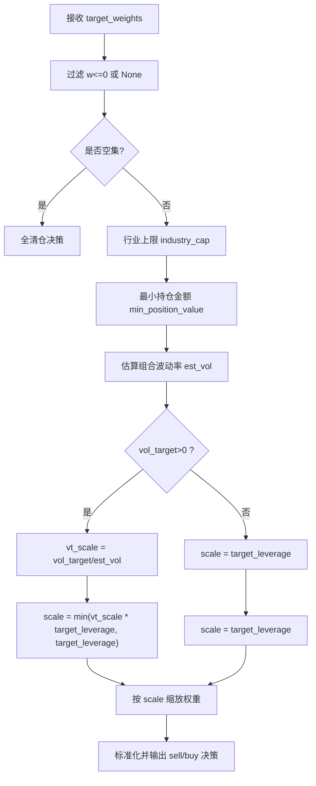

图表来源
- [backtest/rebalance.py:101-195](file://backtest/rebalance.py#L101-L195)

章节来源
- [backtest/rebalance.py:101-195](file://backtest/rebalance.py#L101-L195)

### 执行层：订单生成与撮合
- 成交模型 next_open
  - 买入：T+1 开盘价 × (1+slippage)，涨停拒买
  - 卖出：T+1 开盘价 × (1-slippage)，跌停拒卖
  - 未上市/停牌：拒绝并记录原因
  - 手数：向下取整到 100 股整数倍
- 费用与成本
  - slippage_amt、commission、tax 按配置计算
- 接口
  - fill_buy(candidate, market_window, fill_date, exec_cfg, run_id)
  - fill_sell(decision, position, market_window, fill_date, exec_cfg, run_id)

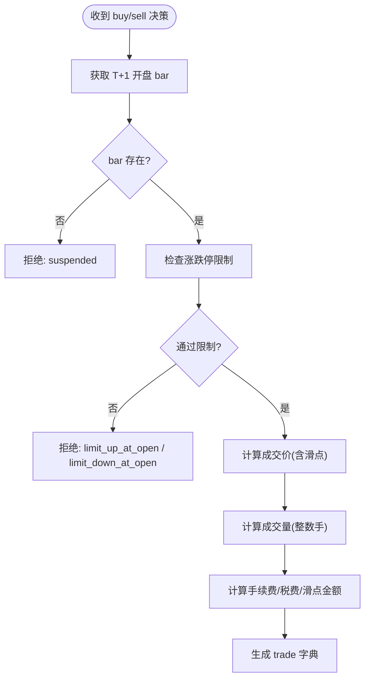

图表来源
- [backtest/execution.py:95-204](file://backtest/execution.py#L95-L204)

章节来源
- [backtest/execution.py:95-204](file://backtest/execution.py#L95-L204)

### 因子系统集成
- 基类 FactorBase
  - compute(panel, fin_ffill, **kwargs) 返回 pd.Series(index=(date, code))
  - 提供 winsorize/zscore/rank_normalize 等常用预处理
- 引擎 FactorEngine
  - register(factor) 注册因子
  - compute_all(panel, fin_ffill, **kwargs) 批量计算
  - compute_ic(factor_panel, price_data, forward_days) 计算 IC/ICIR
- 策略中的因子使用
  - 示例 atr_lowvol 直接调用 factors.atr.atr_pct、factors.roe.get_roe_asof 等函数
  - 也可通过 FactorEngine 批量计算因子面板供策略使用

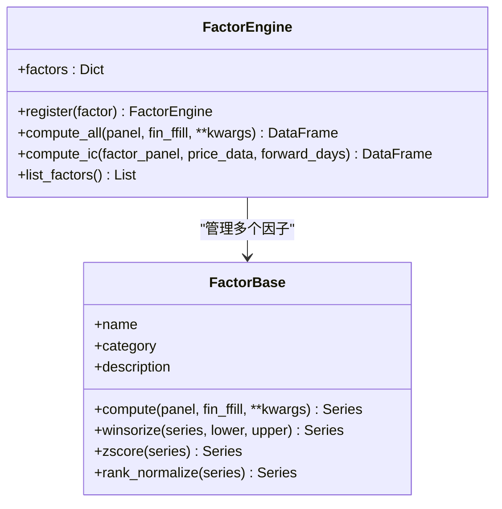

图表来源
- [factors/base.py:9-52](file://factors/base.py#L9-L52)
- [factors/engine.py:9-86](file://factors/engine.py#L9-L86)

章节来源
- [factors/base.py:9-52](file://factors/base.py#L9-L52)
- [factors/engine.py:9-86](file://factors/engine.py#L9-L86)

### 示例策略解析：ATR 低波策略
- 选股逻辑
  - 换手率过滤：turnover_min ~ turnover_max
  - 非 ST 过滤
  - ATR% 过滤：atr_pct(df, atr_win) <= atr_pct_max
  - 质量门控：ROE>0（可开关）
  - 动量门控：12-1 月收益 > 0（可开关）
  - 排序：按 ATR% 升序取前 n_hold
- 调仓频率
  - 通过 rebalance_freq 控制 weekly/monthly/quarterly
- 止损机制
  - 非调仓日根据 stop_loss 触发一次性退出
- 组合层叠加
  - position_sizing=equal/vol_parity/custom
  - vol_target、target_leverage、industry_cap、max_positions、min_position_value

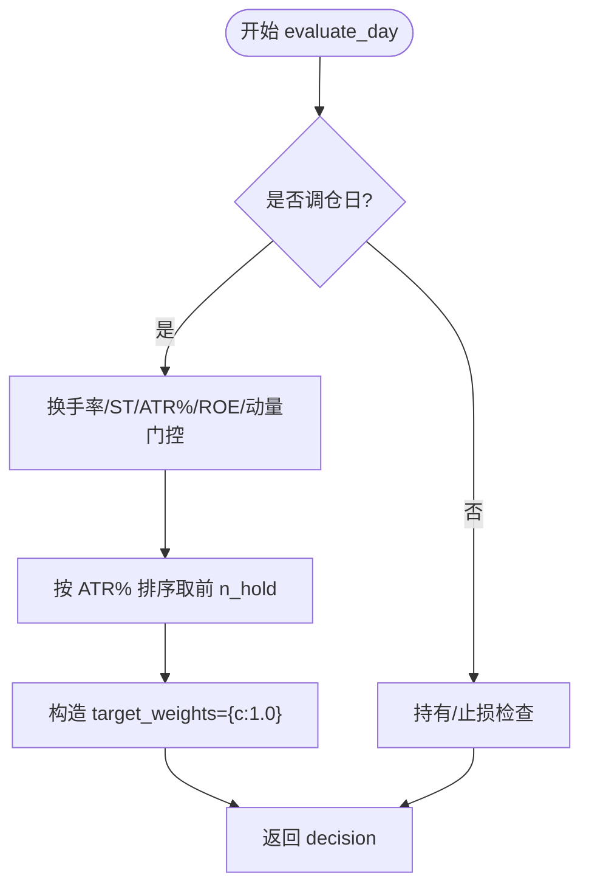

图表来源
- [strategy/atr_lowvol.py:37-165](file://strategy/atr_lowvol.py#L37-L165)

章节来源
- [strategy/atr_lowvol.py:37-165](file://strategy/atr_lowvol.py#L37-L165)

### 回测入口与运行流程
- 入口脚本 scripts/run_backtest.py
  - 读取配置、初始化 reader/universe、调用 backtest.engine.run_backtest
  - 写入报告并打印关键指标
- 引擎 run_backtest
  - 加载市场数据与基准序列
  - 逐日构建 window、调用策略 evaluate_day
  - 若 decision 含 target_weights，转交组合层生成标准决策
  - 执行层撮合成交，更新组合与日志
  - 汇总 performance、diagnostics 与样本期警告

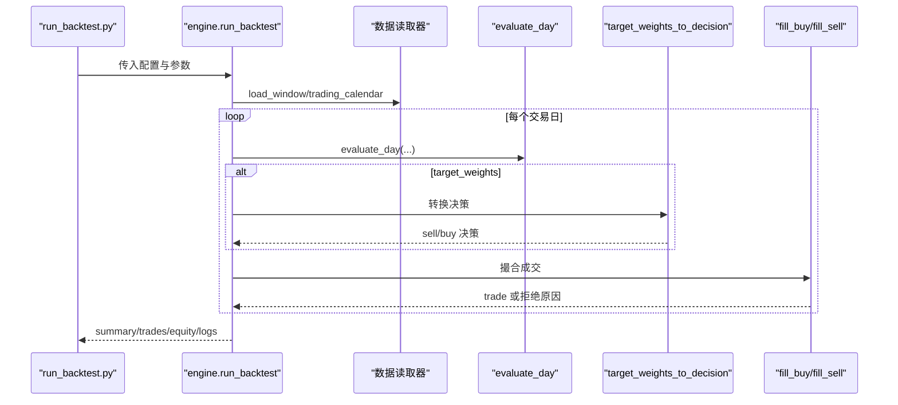

图表来源
- [scripts/run_backtest.py:93-131](file://scripts/run_backtest.py#L93-L131)
- [backtest/engine.py:237-619](file://backtest/engine.py#L237-L619)

章节来源
- [scripts/run_backtest.py:93-131](file://scripts/run_backtest.py#L93-L131)
- [backtest/engine.py:237-619](file://backtest/engine.py#L237-L619)

## 依赖关系分析
- 策略模块依赖
  - 注册：strategy.registry.register_strategy
  - 时间：strategy.schedule.is_rebalance_day
  - 因子：factors.* 提供的函数或 FactorEngine
- 引擎依赖
  - 策略：strategy.registry.get_strategy/list_strategies
  - 组合层：backtest.rebalance.target_weights_to_decision
  - 执行：backtest.execution.fill_buy/fill_sell
  - 组合与指标：backtest.portfolio/backtest.analyzer

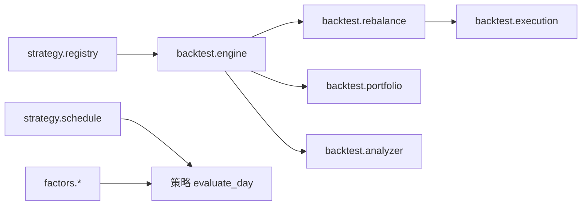

图表来源
- [strategy/registry.py:24-44](file://strategy/registry.py#L24-L44)
- [strategy/schedule.py:10-46](file://strategy/schedule.py#L10-L46)
- [backtest/engine.py:237-619](file://backtest/engine.py#L237-L619)
- [backtest/rebalance.py:101-195](file://backtest/rebalance.py#L101-L195)
- [backtest/execution.py:95-204](file://backtest/execution.py#L95-L204)

章节来源
- [strategy/registry.py:24-44](file://strategy/registry.py#L24-L44)
- [strategy/schedule.py:10-46](file://strategy/schedule.py#L10-L46)
- [backtest/engine.py:237-619](file://backtest/engine.py#L237-L619)

## 性能与回测特性
- 数据窗口切片优化
  - 预计算 cut_index，每日 O(1) 切片避免重复搜索
- 基准序列对齐
  - 向前填充缺失值，确保长窗口指标（如 MA60/MA120）可用
- 两融利息计提
  - 当 target_leverage>1 且现金为负时，按日计提利息
- 诊断与聚合
  - 每日 candidate_total/candidate_passed 与 warnings 聚合
  - strategy_specific 按数值类型平均、按结构类型合并
- 样本期警告
  - 短样本或缺失基准时给出明确提示

章节来源
- [backtest/engine.py:121-147](file://backtest/engine.py#L121-L147)
- [backtest/engine.py:375-380](file://backtest/engine.py#L375-L380)
- [backtest/engine.py:490-522](file://backtest/engine.py#L490-L522)

## 故障排查指南
- 常见错误与定位
  - 策略未注册：KeyError 提示已注册策略名列表
  - trading_model 不被允许：ValueError 列出 ALLOWED_TRADING_MODELS
  - 基准不可用：benchmark_db_path 不存在或数据断点
  - 调仓日判断异常：calendar 缺失或日期格式问题
  - 无法成交：suspended/limit_up_at_open/limit_down_at_open/no_target_cash/below_min_lot
- 调试技巧
  - 使用 strategy_spy(name, fn) 注入临时策略或包装原策略捕获输入
  - 查看 daily_logs 与 diagnostics.warnings 快速定位问题
  - 检查 trades.csv 与 equity_curve.csv 验证成交与净值路径

章节来源
- [strategy/registry.py:34-44](file://strategy/registry.py#L34-L44)
- [strategy/registry.py:66-94](file://strategy/registry.py#L66-L94)
- [backtest/engine.py:207-234](file://backtest/engine.py#L207-L234)
- [backtest/execution.py:95-204](file://backtest/execution.py#L95-L204)

## 结论
QuantLab 的策略层通过“轻量装饰器 + 通用组合层 + 严格执行约束”的设计，实现了“任何策略只需输出 target_weights 即可即插即跑”的目标。开发者专注于选股与信号逻辑，风险与风控由配置驱动的通用层统一管理，显著降低重复实现与维护成本。配合完善的回测入口、诊断与调试工具，能够快速迭代与验证策略。

## 附录：参数与配置速查
- 策略参数（strategy_params）
  - rebalance_freq: weekly|monthly|quarterly
  - n_hold: 目标持仓数量
  - atr_win/atr_pct_max/turnover_min/turnover_max/quality_gate/momentum_gate/stop_loss: ATR 低波策略专用
  - position_sizing: equal|vol_parity|custom
  - target_leverage: >1 启用两融
  - vol_target: >0 启用波动率目标
  - industry_cap: >0 启用行业上限
  - max_positions/min_position_value/vol_window/margin_interest_rate
- 执行参数（execution）
  - price: next_open
  - slippage/commission_rate/tax_rate
- 数据与基准（data/benchmark）
  - source/path/adjustment/fundamentals
  - benchmark_code/benchmark_db_path

章节来源
- [config/atr_lowvol_fw.yaml:1-49](file://config/atr_lowvol_fw.yaml#L1-L49)
- [backtest/engine.py:237-619](file://backtest/engine.py#L237-L619)