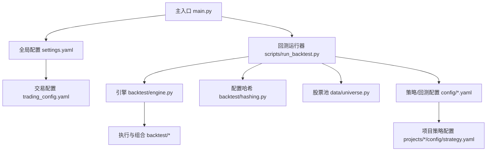
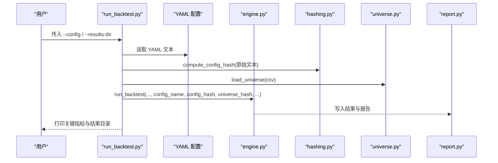
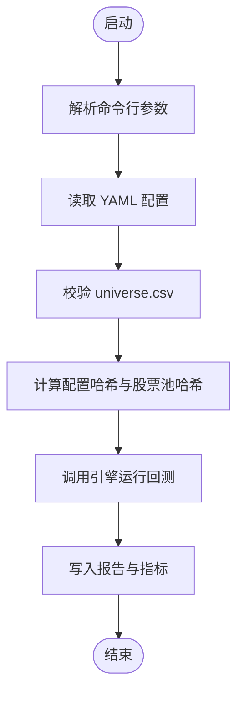
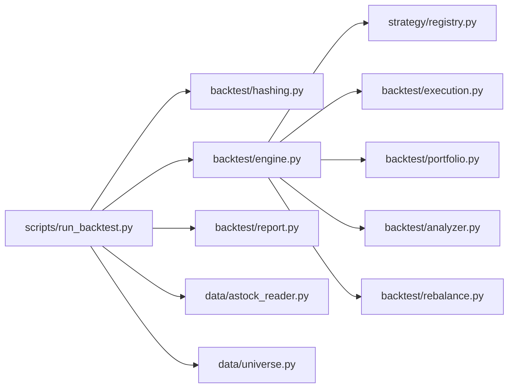

# 配置管理 API

<cite>
**本文引用的文件**   
- [settings.yaml](file://config/settings.yaml)
- [trading_config.yaml](file://config/trading_config.yaml)
- [atr_lowvol_fw.yaml](file://config/atr_lowvol_fw.yaml)
- [atr_lowvol_fw_leverage_only.yaml](file://config/atr_lowvol_fw_leverage_only.yaml)
- [atr_lowvol_fw_leveraged.yaml](file://config/atr_lowvol_fw_leveraged.yaml)
- [main.py](file://main.py)
- [run_backtest.py](file://scripts/run_backtest.py)
- [engine.py](file://backtest/engine.py)
- [hashing.py](file://backtest/hashing.py)
- [universe.py](file://data/universe.py)
- [strategy.yaml（Project_01）](file://projects/Project_01_多因子IC小盘Alpha/config/strategy.yaml)
</cite>

## 目录
1. [简介](#简介)
2. [项目结构](#项目结构)
3. [核心组件](#核心组件)
4. [架构总览](#架构总览)
5. [详细组件分析](#详细组件分析)
6. [依赖关系分析](#依赖关系分析)
7. [性能考虑](#性能考虑)
8. [故障排查指南](#故障排查指南)
9. [结论](#结论)
10. [附录](#附录)

## 简介
本文件为 QuantLab 配置管理系统的完整 API 文档，覆盖：
- 配置文件结构与参数说明：全局 settings.yaml、交易 trading_config.yaml、策略与回测 YAML。
- 层级结构与继承关系：默认值、覆盖机制与组合层叠加。
- 命令行参数：启动参数、策略参数、数据参数等。
- 配置验证与默认值处理：校验规则、错误提示与回退逻辑。
- 高级功能：配置哈希与可追溯性、结果输出组织、可扩展的注册式策略加载。
- 环境最佳实践：开发/测试/生产环境的配置管理与迁移建议。
- 常见场景示例：杠杆、波动率目标、行业上限、基准指数等。

## 项目结构
QuantLab 的配置体系围绕三类 YAML 文件展开：
- 全局设置：config/settings.yaml（路径、缓存、日志、因子预处理、默认股票池、实盘开关）。
- 交易配置：config/trading_config.yaml（账户、风控、订单、调度、通知、数据源、策略权重）。
- 回测/策略配置：config/*.yaml（如 atr_lowvol_fw*.yaml），以及项目级 strategy.yaml（如 Project_01）。

图示来源
- [main.py:21-34](file://main.py#L21-L34)
- [run_backtest.py:42-64](file://scripts/run_backtest.py#L42-L64)
- [engine.py:1-20](file://backtest/engine.py#L1-L20)
- [hashing.py:1-23](file://backtest/hashing.py#L1-L23)
- [universe.py:1-32](file://data/universe.py#L1-L32)

章节来源
- [settings.yaml:1-68](file://config/settings.yaml#L1-L68)
- [trading_config.yaml:1-62](file://config/trading_config.yaml#L1-L62)
- [atr_lowvol_fw.yaml:1-49](file://config/atr_lowvol_fw.yaml#L1-L49)
- [atr_lowvol_fw_leverage_only.yaml:1-48](file://config/atr_lowvol_fw_leverage_only.yaml#L1-L48)
- [atr_lowvol_fw_leveraged.yaml:1-47](file://config/atr_lowvol_fw_leveraged.yaml#L1-L47)
- [strategy.yaml（Project_01）:1-62](file://projects/Project_01_多因子IC小盘Alpha/config/strategy.yaml#L1-L62)

## 核心组件
- 全局配置（settings.yaml）
  - project：项目名称、版本、根路径。
  - data.source：数据源类型（astock）。
  - data.astock.*：日线、财务、基础信息路径。
  - data.cache.*：缓存开关、目录、过期天数。
  - backtest.*：回测起止日期、初始资金、佣金、滑点、基准。
  - logging.*：日志级别、目录、文件大小、备份数量。
  - factors.*：中性化、标准化、去极值方法与阈值。
  - strategy.*：默认股票池与市值区间定义。
  - trading.*：指向交易配置文件与是否启用实盘。

- 交易配置（trading_config.yaml）
  - account.*：账号 ID、QMT 路径、会话 ID。
  - trading.*：初始资金、仓位限制、手续费、印花税、滑点。
  - risk.*：止损比例、最大回撤、最长持有天数、单日换手上限。
  - order.*：委托超时、重试次数、价格容差、未成交自动撤单。
  - schedule.*：盘前、开盘、午后检查、风控间隔、尾盘时间。
  - notification.*：通知开关、方式、webhook URL。
  - data.*：主数据源、astock 路径、缓存目录。
  - strategy.*：策略名、股票池、top_n、调仓频率、因子权重。

- 回测/策略配置（config/*.yaml）
  - backtest.*：名称、起止日期、初始现金、基准代码与数据库路径。
  - data.*：数据源、parquet 路径、复权方式、是否使用基本面。
  - universe.csv：股票池 CSV 路径。
  - execution.*：成交价模型、滑点、佣金、税费。
  - strategy：策略注册名（如 atr_lowvol）。
  - trading_model：交易模型（如 next_open）。
  - strategy_params.*：调仓频率、持仓数、ATR 窗口与上限、换手范围、质量门控、动量门控、止损、组合层（等权/波动率平价、杠杆、波动率目标、行业上限、最大持仓数、最小持仓价值、波动率窗口、两融利率）。

- 项目级策略配置（Project_01 strategy.yaml）
  - strategy.name/version：策略元信息。
  - factors.weights：因子权重字典。
  - factors.market_cap.amount：市值与成交额过滤。
  - backtest.*：top_n、调仓频率、止损、交易成本、动态股票池。
  - results.*：历史回测指标参考。
  - live.*：实盘参数（初始资金、仓位限制、止损、调仓频率、订单超时与重试）。
  - qmt.*：QMT 账号与测试标的。

章节来源
- [settings.yaml:1-68](file://config/settings.yaml#L1-L68)
- [trading_config.yaml:1-62](file://config/trading_config.yaml#L1-L62)
- [atr_lowvol_fw.yaml:1-49](file://config/atr_lowvol_fw.yaml#L1-L49)
- [atr_lowvol_fw_leverage_only.yaml:1-48](file://config/atr_lowvol_fw_leverage_only.yaml#L1-L48)
- [atr_lowvol_fw_leveraged.yaml:1-47](file://config/atr_lowvol_fw_leveraged.yaml#L1-L47)
- [strategy.yaml（Project_01）:1-62](file://projects/Project_01_多因子IC小盘Alpha/config/strategy.yaml#L1-L62)

## 架构总览
配置在系统中的流转与使用如下：
- 主入口 main.py 读取 settings.yaml 作为全局配置。
- 回测运行器 scripts/run_backtest.py 通过 --config 指定具体策略/回测 YAML，解析并校验。
- 引擎 backtest/engine.py 根据配置驱动数据读取、策略计算、执行与组合层约束，生成结果。
- 配置哈希 backtest/hashing.py 对 YAML 文本与股票池进行哈希，用于结果可追溯。
- 股票池 data/universe.py 负责 CSV 加载与字段校验。

图示来源
- [run_backtest.py:42-127](file://scripts/run_backtest.py#L42-L127)
- [engine.py:1-20](file://backtest/engine.py#L1-L20)
- [hashing.py:1-23](file://backtest/hashing.py#L1-L23)
- [universe.py:1-32](file://data/universe.py#L1-L32)

## 详细组件分析

### 全局配置（settings.yaml）API
- 作用域：全局环境与默认值。
- 关键键与含义：
  - project.name/version/root：项目标识与根路径。
  - data.source：数据源类型（当前支持 astock）。
  - data.astock.daily_path/finance_path/basic_path：数据文件路径。
  - data.cache.enabled/dir/expire_days：缓存开关、目录与过期天数。
  - backtest.start_date/end_date/initial_capital/commission/slippage/benchmark：回测基础参数。
  - logging.level/dir/max_file_size/backup_count：日志控制。
  - factors.neutralize/standardize/winsorize/winsorize_limit：因子预处理开关与阈值。
  - factors.neutralize_method/standardize_method：方法选择（industry/market/none；zscore/rank/none）。
  - strategy.default_universe/universes.*：默认股票池与市值区间。
  - trading.config/enabled：交易配置文件路径与开关。

- 默认值与覆盖：
  - 若未显式设置某些字段，系统会在运行时提供合理默认值（例如回测初始资金、调整方式 raw/qfq/hfq 等）。
  - 可通过命令行参数或上层调用覆盖部分行为（如结果目录）。

章节来源
- [settings.yaml:1-68](file://config/settings.yaml#L1-L68)

### 交易配置（trading_config.yaml）API
- 作用域：实盘与交易相关的全局参数。
- 关键键与含义：
  - account.id/path/session_id：账号与 QMT 路径、会话。
  - trading.initial_capital/max_single_position/max_total_position/commission_rate/stamp_tax/slippage：资金与费用、滑点。
  - risk.stop_loss_pct/max_drawdown/max_holding_days/max_daily_turnover：风控阈值。
  - order.timeout_seconds/max_retry/price_tolerance/cancel_unfilled：订单行为。
  - schedule.pre_market/morning_open/afternoon_check/risk_check_interval/end_of_day：调度时间表。
  - notification.enabled/method/webhook_url：通知渠道。
  - data.source/astock_path/cache_dir：数据源与缓存。
  - strategy.name/universe/top_n/rebalance_freq/factors.*：策略名、股票池、选股数量、调仓频率与因子权重。

- 注意事项：
  - 因子权重需与对应策略实现保持一致（见 Project_01 的 FACTOR_WEIGHTS 注释）。
  - 通知 webhook 需按所选 method 正确配置。

章节来源
- [trading_config.yaml:1-62](file://config/trading_config.yaml#L1-L62)

### 回测/策略配置（config/*.yaml）API
- 通用结构（以 atr_lowvol_fw*.yaml 为例）：
  - backtest.name/start_date/end_date/initial_cash/benchmark_code/benchmark_db_path：回测元信息与基准。
  - data.source/path/adjustment/fundamentals：数据源、parquet 路径、复权方式、是否使用基本面。
  - universe.csv：股票池 CSV 路径。
  - execution.price/slippage/commission_rate/tax_rate：成交价模型与交易成本。
  - strategy：策略注册名（如 atr_lowvol）。
  - trading_model：交易模型（如 next_open）。
  - strategy_params.*：策略与组合层参数（详见下方“组合层参数”）。

- 组合层参数（strategy_params）：
  - rebalance_freq：weekly/monthly/quarterly。
  - n_hold：目标持仓数量。
  - atr_win/atrpct_max：ATR 窗口与百分比上限。
  - turnover_min/turnover_max：换手范围。
  - quality_gate/momentum_gate：质量与动量门控开关。
  - stop_loss：止损线。
  - position_sizing：equal|vol_parity|custom。
  - target_leverage：>1 启用两融（自动计提利息）。
  - vol_target：>0 启用波动率目标。
  - industry_cap：>0 启用行业上限。
  - max_positions/min_position_value：持仓数与最小持仓价值限制。
  - vol_window/margin_interest_rate：波动率窗口与两融利率。

- 不同变体：
  - atr_lowvol_fw.yaml：基础配置。
  - atr_lowvol_fw_leverage_only.yaml：纯杠杆验证（关闭其他保守层）。
  - atr_lowvol_fw_leveraged.yaml：全开组合层（波动率目标、行业上限等）。

章节来源
- [atr_lowvol_fw.yaml:1-49](file://config/atr_lowvol_fw.yaml#L1-L49)
- [atr_lowvol_fw_leverage_only.yaml:1-48](file://config/atr_lowvol_fw_leverage_only.yaml#L1-L48)
- [atr_lowvol_fw_leveraged.yaml:1-47](file://config/atr_lowvol_fw_leveraged.yaml#L1-L47)

### 项目级策略配置（Project_01 strategy.yaml）API
- strategy.name/version：策略元信息。
- factors.weights：因子权重字典（BP、reversal_1m、volatility_60d、ROE）。
- factors.market_cap.amount：市值与成交额过滤。
- backtest.top_n/rebalance_freq/stop_loss/tx_cost/dynamic_universe：回测参数。
- results.*：历史回测指标参考。
- live.*：实盘参数（初始资金、仓位限制、止损、调仓频率、订单超时与重试）。
- qmt.*：QMT 账号与测试标的。

章节来源
- [strategy.yaml（Project_01）:1-62](file://projects/Project_01_多因子IC小盘Alpha/config/strategy.yaml#L1-L62)

### 命令行参数与启动流程
- main.py（回测模式）：
  - 参数：--strategy（策略名称）、--start/--end（可选日期覆盖）。
  - 行为：加载 settings.yaml，按策略分支运行回测。

- scripts/run_backtest.py（回测引擎运行器）：
  - 参数：--config（必需，YAML 路径）、--results-dir（可选，覆盖结果目录）。
  - 行为：读取 YAML、校验 universe.csv、加载数据、计算配置哈希、调用 engine.run_backtest、写入报告与指标。

图示来源
- [main.py:95-104](file://main.py#L95-L104)
- [run_backtest.py:42-127](file://scripts/run_backtest.py#L42-L127)

章节来源
- [main.py:21-34](file://main.py#L21-L34)
- [run_backtest.py:42-127](file://scripts/run_backtest.py#L42-L127)

### 配置验证与默认值处理
- 输入校验：
  - universe.csv：首列必须为 code；code 格式正则匹配；重复行保留首次；空集合报错。
  - data.adjustment：仅允许 raw/qfq/hfq，否则抛出 ValueError。
  - 必填项：universe.csv 必须设置，否则报错。

- 默认值与回退：
  - 未设置 adjustment 时默认 raw。
  - 未设置 initial_cash 时回退到默认值。
  - 未设置 strategy/trading_model 时使用默认注册名与 next_open。

- 可追溯性：
  - 配置哈希：基于 YAML 原始文本的 SHA256。
  - 股票池哈希：基于排序后的代码列表。
  - 数据哈希：包含数据库路径、修改时间、复权方式、请求起止与实际起止、去重统计与股票池哈希。

章节来源
- [universe.py:1-32](file://data/universe.py#L1-L32)
- [run_backtest.py:66-80](file://scripts/run_backtest.py#L66-L80)
- [hashing.py:1-23](file://backtest/hashing.py#L1-L23)

### 热重载与动态调整
- 现状：
  - 当前脚本在启动时一次性读取 YAML，并在进程生命周期内使用。
  - 未发现内置的文件监听与热重载机制。

- 建议方案：
  - 在外部封装中引入文件监控（如 watchdog），检测到变更时重新加载配置并刷新引擎上下文。
  - 对于交易配置（trading_config.yaml），可在安全边界内（如非交易时段）动态更新风险与订单参数。
  - 对于回测配置，建议在每次运行前确保配置一致性，避免中途切换导致结果不可比。

[本节为概念性说明，不直接分析具体文件]

### 环境变量覆盖机制
- 现状：
  - 在当前代码中未发现对环境变量的读取与覆盖逻辑。
  - 所有路径与参数均从 YAML 与命令行参数获取。

- 建议方案：
  - 在加载 YAML 后，通过环境变量覆盖敏感路径（如数据路径、缓存目录、日志目录）。
  - 在生产环境中，将密钥与敏感路径放入环境变量，避免硬编码。

[本节为概念性说明，不直接分析具体文件]

### 配置迁移与版本管理
- 配置哈希：
  - 使用 compute_config_hash(yaml_text) 生成唯一标识，便于结果对比与回溯。
  - 结合 run_id（时间戳+短哈希）与 config_hash，确保每次运行可区分。

- 版本兼容：
  - 在 YAML 中维护 name/version 字段，便于识别配置版本。
  - 对破坏性变更，提供迁移脚本或兼容性层，保证旧配置仍可运行。

章节来源
- [hashing.py:1-23](file://backtest/hashing.py#L1-L23)
- [run_backtest.py:63-73](file://scripts/run_backtest.py#L63-L73)

### 不同环境的最佳实践
- 开发环境：
  - 使用较短的回测窗口与较小的 universe，提升迭代速度。
  - 开启详细日志，便于调试。

- 测试环境：
  - 固定数据快照与基准数据库路径，确保回归稳定。
  - 使用自动化脚本批量运行配置矩阵，收集指标。

- 生产环境：
  - 严格限定数据源路径与权限，只读访问数据。
  - 启用风控与通知，配置合理的订单超时与重试。
  - 使用独立的结果目录与命名规范，便于审计与归档。

[本节为概念性说明，不直接分析具体文件]

## 依赖关系分析
- 模块耦合：
  - run_backtest.py 依赖 hashing、engine、report、AstockParquetReader、universe。
  - engine.py 依赖 strategy.registry、execution、portfolio、analyzer、rebalance。
  - universe.py 提供股票池加载与校验。
  - hashing.py 提供配置与数据哈希。

图示来源
- [run_backtest.py:26-30](file://scripts/run_backtest.py#L26-L30)
- [engine.py:20-26](file://backtest/engine.py#L20-L26)
- [universe.py:1-32](file://data/universe.py#L1-L32)
- [hashing.py:1-23](file://backtest/hashing.py#L1-L23)

章节来源
- [run_backtest.py:26-30](file://scripts/run_backtest.py#L26-L30)
- [engine.py:20-26](file://backtest/engine.py#L20-L26)

## 性能考虑
- 数据读取：
  - 使用 parquet 文件与按需切片，减少内存占用。
  - 预计算 cut_index 以 O(1) 获取每日窗口。

- 基准数据：
  - 基准序列使用前向填充补齐缺失，避免中断。

- 日志与报告：
  - 控制日志级别与文件大小，避免磁盘压力。
  - 结果目录按 run_id 与 config_name 组织，便于并行与复用。

[本节为概念性说明，不直接分析具体文件]

## 故障排查指南
- 常见问题：
  - universe.csv 首列不是 code：检查文件格式与编码（支持 UTF-8 BOM）。
  - data.adjustment 非法：仅允许 raw/qfq/hfq。
  - benchmark 数据缺失：检查 benchmark_db_path 与代码是否存在。
  - 股票池为空：CSV 无有效行或格式错误。

- 定位方法：
  - 查看日志中的警告与错误信息。
  - 检查配置哈希与 run_id，确认运行配置一致。
  - 逐步缩小问题范围（先验证 CSV，再验证数据路径，最后验证引擎参数）。

章节来源
- [universe.py:1-32](file://data/universe.py#L1-L32)
- [run_backtest.py:66-80](file://scripts/run_backtest.py#L66-L80)
- [engine.py:38-99](file://backtest/engine.py#L38-L99)

## 结论
QuantLab 的配置管理系统以 YAML 为核心，结合命令行参数与引擎内部默认值，形成清晰的分层与覆盖机制。通过配置哈希与结果目录组织，实现了良好的可追溯性与可重复性。建议在后续版本中引入环境变量覆盖与热重载能力，以提升灵活性与运维效率。

[本节为总结性内容，不直接分析具体文件]

## 附录
- 常用命令示例：
  - python -m scripts.run_backtest --config config/atr_lowvol_fw.yaml
  - python -m scripts.run_backtest --config config/atr_lowvol_fw_leveraged.yaml --results-dir E:/QuantLab/reports/custom

- 典型场景：
  - 杠杆验证：使用 atr_lowvol_fw_leverage_only.yaml，关闭其他保守层。
  - 全开组合层：使用 atr_lowvol_fw_leveraged.yaml，启用波动率目标与行业上限。
  - 多因子策略：在 Project_01 的 strategy.yaml 中配置因子权重与过滤条件。

[本节为补充说明，不直接分析具体文件]