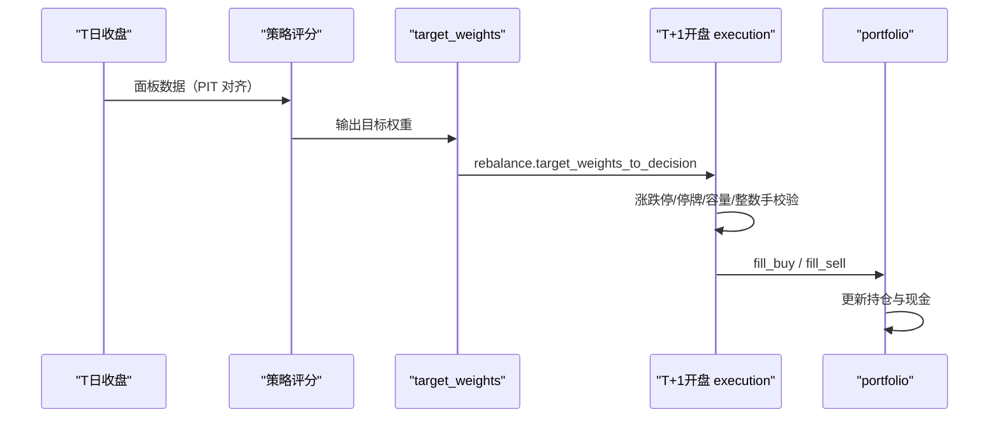

# 引擎核心架构

<cite>
**本文档引用的文件**
- [backtest/engine.py](file://backtest/engine.py) — DailyBacktestEngine 主循环
- [backtest/execution.py](file://backtest/execution.py) — 撮合与真实交易约束
- [backtest/portfolio.py](file://backtest/portfolio.py) — 组合状态
- [backtest/analyzer.py](file://backtest/analyzer.py) — 绩效指标
- [backtest/rebalance.py](file://backtest/rebalance.py) — 目标权重转决策
- [backtest/report.py](file://backtest/report.py) — 产物持久化
- [projects/verification/](file://projects/verification) — B/D/E 验证测试
- [研究总览与路线图.md](file://研究总览与路线图.md) — 引擎机制评估与 6 项修复
</cite>

## 目录
1. [引言](#引言)
2. [交易模型：next_open](#交易模型next_open)
3. [模块构成与数据流](#模块构成与数据流)
4. [真实交易约束](#真实交易约束)
5. [组合管理与调仓](#组合管理与调仓)
6. [绩效分析](#绩效分析)
7. [配置与产物](#配置与产物)
8. [已知陷阱与口径警示](#已知陷阱与口径警示)
9. [引擎修复史](#引擎修复史)
10. [章节来源](#章节来源)

## 引言

`backtest/` 是配置驱动的真实约束回测引擎。任何策略只要输出 `target_weights` 即可即插即跑。设计原则：

- **只输出内存结果**：`engine.py` 不写文件，持久化由 `report.py` 负责。
- **无 xtquant / passorder 依赖**：回测与实盘通道彻底解耦。
- **真实约束优先**：涨停买不进、跌停卖不出、停牌拒单、滑点、佣金、整数手、两融杠杆、vol_target 全部内建。

```python
# engine.py 头部契约
"""Trading model: next_open (T close signal -> T+1 open fill).
The engine writes ONLY an in-memory result struct; file IO is report.py.
No xtquant / passorder."""
```

> **可信度评估（2026-08-11）**：引擎机制可信 **8/10**，短板不在引擎而在**输入侧 PIT 与撮合容量**。

## 交易模型：next_open

T 日收盘产生信号 → **T+1 日开盘**撮合成交。这是防止 look-ahead 的根本设计。



**关键**：撮合时点是策略代码职责，回测工厂只提供 next_open 这一默认模型。

> 🔍 **look-ahead 检测方法**：跑「盘中 vs 尾盘」双版本对照，若差异 >30pp 且方向反转 → look-ahead 风险。该方法在本仓已击中 4 次。

## 模块构成与数据流

```mermaid
graph LR
    R["data/ DataFeed<br/>astock parquet / DuckDB"] -->|panel, fin_ffill| STR["strategy.registry<br/>get_strategy()"]
    STR -->|target_weights| RB["rebalance.py<br/>target_weights_to_decision"]
    RB -->|buy/sell decision| EX["execution.py<br/>fill_buy / fill_sell"]
    EX -->|成交回报| PF["portfolio.py<br/>Portfolio"]
    PF -->|equity_rows, trades| AN["analyzer.py<br/>compute_metrics"]
    AN -->|指标| RP["report.py<br/>落盘产物"]
```



| 模块 | 职责 | 关键函数 |
|---|---|---|
| `engine.py` | 主循环装配 reader → strategy_core → execution → portfolio → metrics | `DailyBacktestEngine` |
| `rebalance.py` | 目标权重 → 买卖决策 | `target_weights_to_decision` |
| `execution.py` | 撮合 + 真实约束 | `fill_buy` / `fill_sell` / `_price_limit` / `_lot_floor` / `_bar_lookup` / `_open_pct` |
| `portfolio.py` | 持仓/现金状态机 | `Portfolio` / `_bar_close` / `_last_known_close` |
| `analyzer.py` | 绩效指标 | `compute_metrics` / `_max_drawdown` / `_sharpe` / `_pair_trades` / `_trading_day_diff` |
| `report.py` | 产物持久化（报告/明细/缓存） | — |
| `hashing.py` | 配置/结果指纹 | — |

**版本号**：`_STRATEGY_CORE_VERSION = "0.2.0"`、`_SUMMARY_SCHEMA_VERSION = "0.2"`。

## 真实交易约束

`execution.py` 内建的完整约束清单：

| 约束 | 实现 | 备注 |
|---|---|---|
| 涨跌停 | `_price_limit(code, bar)` → `_open_pct(bar, prev_bar)` | 涨停买不进、跌停卖不出 |
| 停牌 | 拒单 | — |
| 整数手 | `_lot_floor(volume)` 向下取整到 100 | — |
| 滑点 | 配置项 | 默认 0.1% |
| 佣金 | 配置项 | 卖印另计 |
| **容量约束** | `max_adv_pct` | **默认 0（关闭）**，超前一交易日成交额上限则**整单拒绝**（`capacity_exceeded`） |

### 容量约束（2026-08-11 新增，E-1~E-5 覆盖）

启用后按「前一交易日成交额 × max_adv_pct」封顶，超出即整单拒绝。这是**菜场大妈六步选股被主证伪的关键武器**：

> 实测：max_adv_pct 1%/5%/10% 三档 × 100 万本金，**3840 笔买入尝试 100% 被拒、CAGR 全归零**——可捕获收益 = 精确的 0。压到理论上限 6 万本金 + 10% 参与率，仅 CAGR +5.56% / MDD -13.3% / 494 笔（国债级无超额）。

`_bar_lookup` 用 `searchsorted` 重构，顺带优化性能。

### 两融杠杆与 vol_target

> ⚠️ **语义陷阱**：`scale = min(vt_scale × target_leverage, target_leverage)`。若写成 `min(vt_scale, target_leverage)`，杠杆会**静默失效**。

## 组合管理与调仓

`Portfolio` 维护持仓与现金；`_bar_close` 取当日收盘，`_last_known_close` 处理缺失日（停牌股沿用最后已知价）。

**调仓频率是回测口径的一等公民**——它直接决定风控有效性：

> 📉 **P10 实证（2026-08-14）**：风控从「换仓日检查」改为「每日执行」，年化 15.8% → **7.5%**（-8.3pp）。宣传的 18.0% 是「双月 open 状态机 + 双月才查风控」口径，**实盘预期以 7.5% 为锚**。

同理，双月调仓下**风控分层无增益**：暴跌一步到位直接触发最高档清仓，"避免底部一把清"的翻盘假设不成立（2024-01~02 危机窗口下分层降仓与断路器表现完全相同）。**结论：双月调仓下断路器即最优**。

## 绩效分析

`compute_metrics(equity_rows, trades, trading_calendar, ...)` 输出：

- 收益类：总收益、年化（CAGR）、超额
- 风险类：`_max_drawdown(equity)`、夏普 `_sharpe(returns, trading_days)`
- 交易类：`_pair_trades(trades)` 配对成笔、胜率
- 基准对比：`_benchmark_metrics(...)`

**指标口径要点**：

| 指标 | 口径 |
|---|---|
| 胜率 win_rate | **计入期末未平仓**（`open_positions` + 新指标 `n_open`） |
| 持有期 | `_trading_day_diff` 用交易日历；缺失日期兜底改为「持有整个样本期」 |
| 年化 | `_annualize_factor(trading_days)`；注意区分**线性年化**与 **CAGR**（前者会显著虚高） |
| 数据去重 | `data_dedup_applied` 由硬编码 True 改为 `bool(dedup_count > 0)` |

> ⚠️ **线性年化 vs CAGR**：P13 黄氏 529 早期报告「n16 +82%」是线性年化，真实 CAGR 仅 **8.69%**；「卡玛 1.17→1.65」同口径虚高。**任何对外数字必须标明口径**。

## 配置与产物

回测配置走 YAML（`config/` + `backtest/configs/` 实验配置），支持的关键项：

| 配置 | 说明 |
|---|---|
| `start_date` / `end_date` | 回测区间 |
| `initial_capital` | 初始资金 |
| `commission` / `slippage` | 成本 |
| `max_adv_pct` | 容量约束（默认 0 关闭） |
| `target_leverage` / `vol_target` | 杠杆与波动率目标 |
| `universe` / `universe_by_date` | 静态宇宙 / **PIT 逐日宇宙** |

> **`universe_by_date` 是防幸存者偏差的关键**。ATR 流动性池证伪即用它：静态池 45.49% 的靓丽收益，PIT 逐季截断后仅 16.00% / -27.43% / 0.673，比全 A 基线还差。

**产物目录**：`reports/<时间戳>_<hash>_<策略名>/`，由 `report.py` 落盘（净值曲线、交易明细、指标 summary、配置快照）。

## 已知陷阱与口径警示

### 1. risk_state 文件污染 → 结果非确定性（2026-08-14 修复）

**现象**：P10 `RiskController` 从 `results/risk_state.json` 加载上次运行残留的 `nav_peak=12.7`，而回测起步 `nav=1.0` → 误判回撤 92% → 15% 清仓逻辑失真 → **年化虚高至 35.7%**（真实 18.0%）。

**修复**：所有带 `state_file` 的回测入口必须在 run 前**强制重置** + state 文件**按 run 隔离**（P10 已修：`runner.py` `_reset_risk_state()` + per-pid 文件）。

### 2. strategy_specific 诊断被静默丢弃（2026-08-14 修复）

`backtest/engine.py` 中 `strategy_specific` 诊断在 `target_weights` 转换过程中被静默丢弃，导致价格过滤等增量改动「跑了没生效」。

### 3. 全样本内选优无样本外

P13 的 n_hold 扫描曾踩此坑：n16 在 2023-2026 段 CAGR -2.18%（近 3.5 年亏钱，收益系 2019-2022 前段遗产），且 `max_single_pct` 未按 `1/n` 调整（n16 实为 16 槽 × 12.5% 上限 ≈ 满仓，**非分散**）。

### 4. 回测工厂不适合事件型策略

`next_open` 日频模型对分钟级/事件驱动策略不适用。

### 5. 环境与路径

- 回测工厂用 **Python 3.10**（`C:\Users\Administrator\AppData\Local\Programs\Python\Python310`，有 duckdb）。
- 路径一致性：所有治理文档以 **`D:\QuantLab`** 为准（历史文档中的 `E:\QuantLab` 已失效，E 盘不存在）。
- pandas 3.0 兼容：`datetime64 vs date` 比较需去掉 `.date()`；需 pyarrow / duckdb。

## 引擎修复史

### T-20260811-001：评估 + 6 项修复

| # | 修复项 | 文件 |
|---|---|---|
| ① | 容量约束 `max_adv_pct`（默认 0 关闭，整单拒绝 + `capacity_exceeded`）+ `_bar_lookup` searchsorted 性能优化 | `execution.py` |
| ② | win_rate 计入期末未平仓（`open_positions` + `n_open`） | `analyzer.py` / `engine.py` |
| ③ | 路径一致性 `E:/QuantLab` → `D:/QuantLab` | `report.py` / `run_backtest.py` / verification 4 文件 |
| ④ | `data_dedup_applied` 由硬编码 True 改 `bool(dedup_count>0)` | `analyzer.py` |
| ⑤ | `_trading_day_diff` 缺失日期兜底改「持有整个样本期」 | `analyzer.py` |
| ⑥ | 性能（并入 ①） | `execution.py` |

**交付物**：新增 `projects/verification/execution_tests.py`（E-1~E-5，5/5 PASS）+ 端到端冒烟（n_open=3 / win_rate=1.0 / dedup=False）。

### T-20260811-002：完整回归（2026-08-16 解除）

真实阻塞仅是 2 处 pandas 3.0 的 `datetime64 vs date` 比较（`engine_tests.py:25` / `feasibility_tests.py:59`）+ 缺 pyarrow/duckdb，**无需 py3.11**。在现有 py3.13/pandas3.0 环境全量通过：

```
B-1~B-8 (8/8) + D-1~D-7 + E-1~E-5 (5/5) + feasibility + portfolio  全绿
→ 确认 T-20260811-001 的 6 项修复零回归
```

### 待办（P2）

| ID | 任务 |
|---|---|
| T-20260811-003 | 容量约束落真实策略验证：把 `max_adv_pct`（如 0.10）加进 P10 或 atr_lowvol 回测 config，量化对年化/换手的影响 |
| T-20260811-004 | 静态宇宙前视告警：未传 `universe_by_date` 时对全期静态 universe 在 summary 打显式 WARN |

## 章节来源

- [backtest/engine.py:1-30](file://backtest/engine.py#L1-L30)
- [backtest/execution.py:32-170](file://backtest/execution.py#L32-L170)
- [backtest/analyzer.py:11-110](file://backtest/analyzer.py#L11-L110)
- [研究总览与路线图.md:166-191](file://研究总览与路线图.md#L166-L191)
- [全局控制台.md:200-260](file://全局控制台.md#L200-L260)
