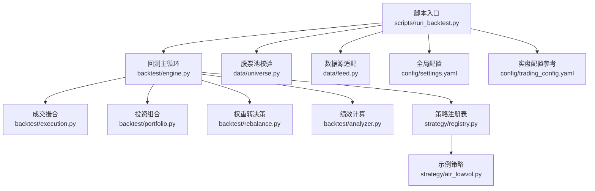
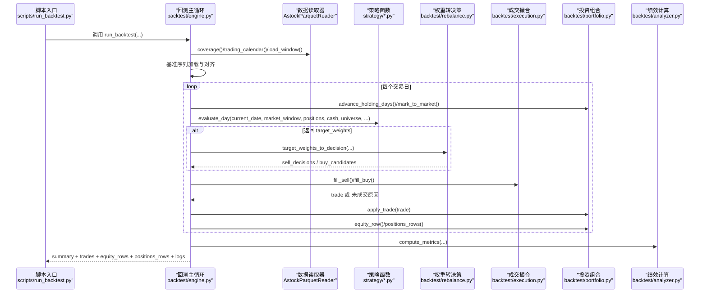
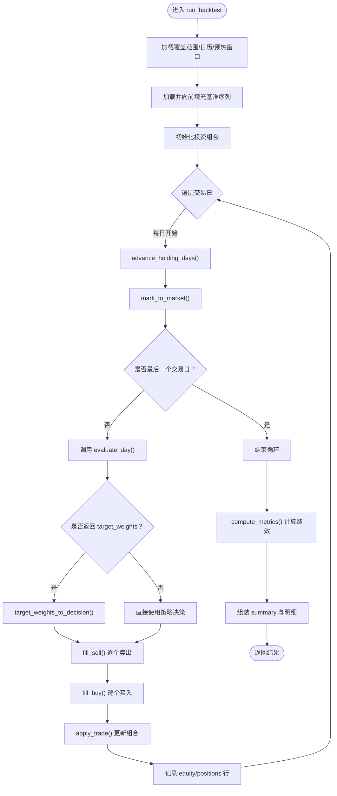
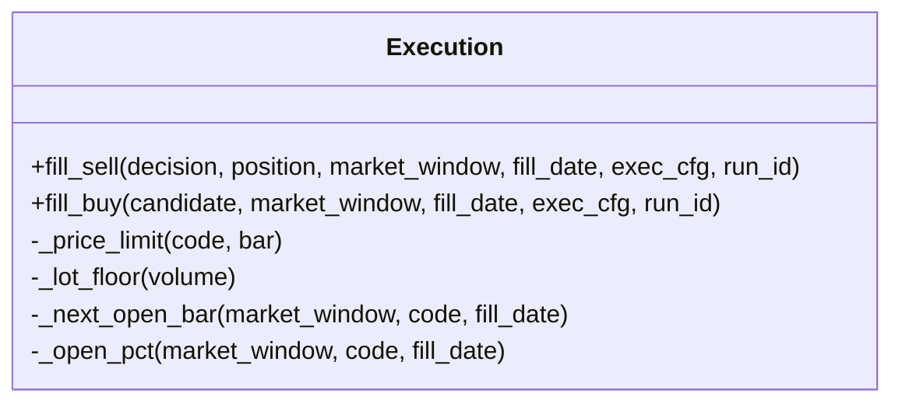
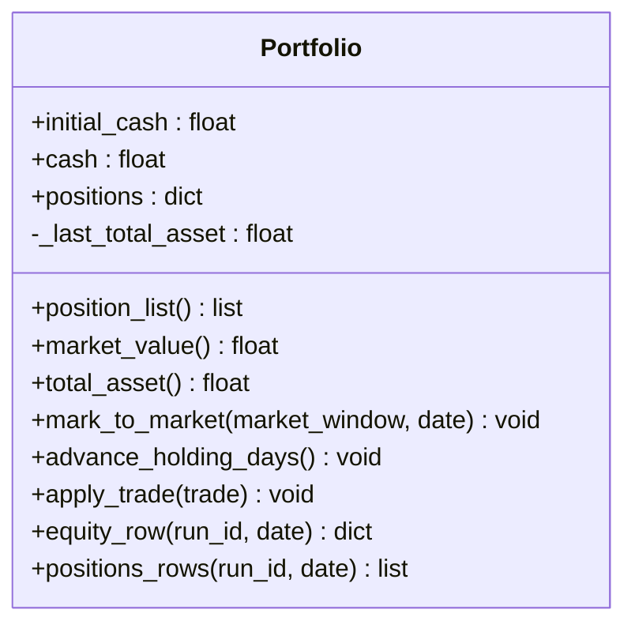
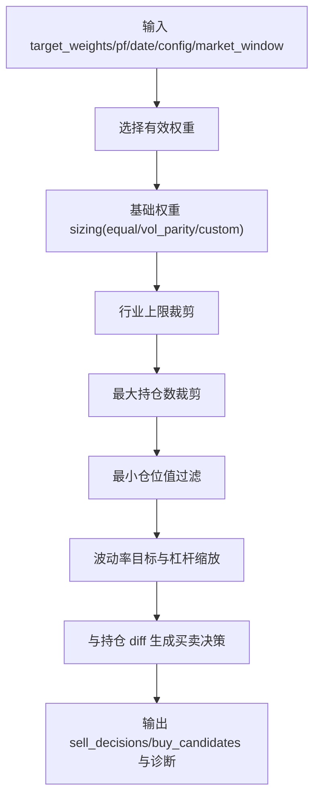
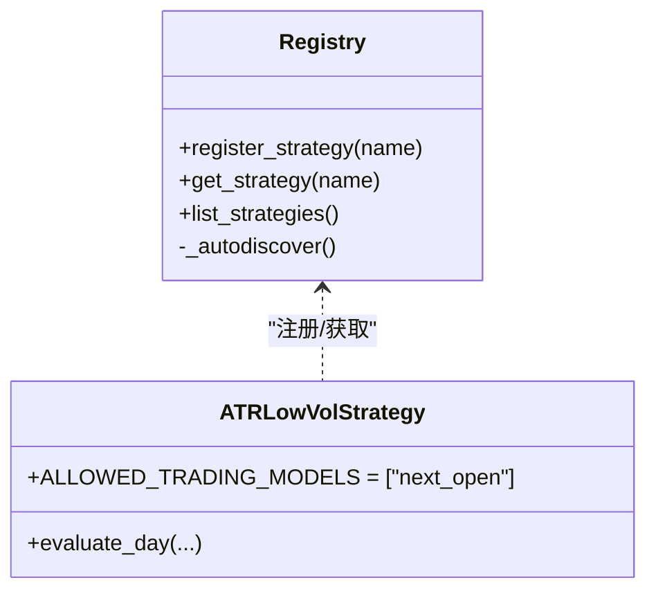
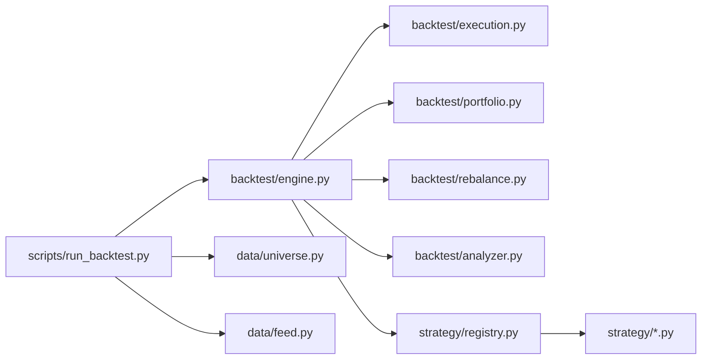

# 回测主循环引擎

<cite>
**本文引用的文件**   
- [engine.py](file://backtest/engine.py)
- [execution.py](file://backtest/execution.py)
- [portfolio.py](file://backtest/portfolio.py)
- [analyzer.py](file://backtest/analyzer.py)
- [rebalance.py](file://backtest/rebalance.py)
- [registry.py](file://strategy/registry.py)
- [atr_lowvol.py](file://strategy/atr_lowvol.py)
- [run_backtest.py](file://scripts/run_backtest.py)
- [settings.yaml](file://config/settings.yaml)
- [trading_config.yaml](file://config/trading_config.yaml)
- [universe.py](file://data/universe.py)
- [feed.py](file://data/feed.py)
</cite>

## 目录
1. [简介](#简介)
2. [项目结构](#项目结构)
3. [核心组件](#核心组件)
4. [架构总览](#架构总览)
5. [详细组件分析](#详细组件分析)
6. [依赖关系分析](#依赖关系分析)
7. [性能考量](#性能考量)
8. [故障排查指南](#故障排查指南)
9. [结论](#结论)
10. [附录：使用示例与配置模式](#附录使用示例与配置模式)

## 简介
本文件面向 QuantLab 回测主循环引擎，系统性解析 run_backtest() 的核心实现原理与数据流控制。内容覆盖事件驱动式日级回测、策略执行接口、订单撮合与成交、投资组合更新、基准对齐与缺失处理、PIT（Point-in-Time）安全机制、运行配置管理与常见用法示例。读者无需深入代码即可理解引擎如何保证前视偏差防护、真实交易约束与可复现性。

## 项目结构
QuantLab 的回测主循环位于 backtest 包中，围绕 engine.py 的 run_backtest() 组织，配合 execution.py（成交）、portfolio.py（组合记账）、analyzer.py（绩效指标）、rebalance.py（目标权重到决策转换），以及 strategy 注册表与具体策略模块。CLI 入口 scripts/run_backtest.py 负责加载 YAML 配置、构建 reader、调用 run_backtest() 并输出报告。

图表来源 
- [engine.py:237-619](file://backtest/engine.py#L237-L619)
- [execution.py:95-204](file://backtest/execution.py#L95-L204)
- [portfolio.py:38-189](file://backtest/portfolio.py#L38-L189)
- [rebalance.py:101-281](file://backtest/rebalance.py#L101-L281)
- [analyzer.py:96-176](file://backtest/analyzer.py#L96-L176)
- [registry.py:24-44](file://strategy/registry.py#L24-L44)
- [atr_lowvol.py:78-165](file://strategy/atr_lowvol.py#L78-L165)
- [run_backtest.py:42-131](file://scripts/run_backtest.py#L42-L131)
- [universe.py:27-62](file://data/universe.py#L27-L62)
- [feed.py:17-124](file://data/feed.py#L17-L124)
- [settings.yaml:21-29](file://config/settings.yaml#L21-L29)
- [trading_config.yaml:10-28](file://config/trading_config.yaml#L10-L28)

章节来源
- [engine.py:237-619](file://backtest/engine.py#L237-L619)
- [run_backtest.py:42-131](file://scripts/run_backtest.py#L42-L131)

## 核心组件
- 回测主循环 engine.run_backtest()
  - 负责日历生成、预热窗口加载、基准序列对齐、每日事件推进、策略 evaluate_day 调用、目标权重转决策、成交撮合、组合更新、日志与诊断聚合、绩效计算与汇总输出。
- 成交撮合 execution.fill_buy/fill_sell
  - 基于 next_open 模型，按次日开盘价加减滑点匹配；处理涨跌停、停牌、最小整手、佣金印花税等真实约束。
- 投资组合 portfolio.Portfolio
  - 维护现金、持仓、T+1可用规则、逐日盯市、净值曲线与持仓快照。
- 权重转决策 rebalance.target_weights_to_decision
  - 将策略输出的 target_weights 转换为 sell_decisions/buy_candidates，内置行业上限、最大持仓数、最小仓位值、波动率目标与杠杆缩放等风控。
- 绩效分析 analyzer.compute_metrics
  - 计算总收益、年化、最大回撤、夏普、Calmar、胜率、平均持有天数，以及与基准的超额收益、信息比率、跟踪误差。
- 策略注册 registry + 示例策略 atr_lowvol
  - 扁平注册策略 evaluate_day，支持 trading_model 白名单校验；示例策略仅输出 target_weights，其余由框架层完成。

章节来源
- [engine.py:237-619](file://backtest/engine.py#L237-L619)
- [execution.py:95-204](file://backtest/execution.py#L95-L204)
- [portfolio.py:38-189](file://backtest/portfolio.py#L38-L189)
- [rebalance.py:101-281](file://backtest/rebalance.py#L101-L281)
- [analyzer.py:96-176](file://backtest/analyzer.py#L96-L176)
- [registry.py:24-44](file://strategy/registry.py#L24-L44)
- [atr_lowvol.py:78-165](file://strategy/atr_lowvol.py#L78-L165)

## 架构总览
下图展示从 CLI 到回测主循环、再到各子系统的调用链与数据流向。

图表来源 
- [run_backtest.py:96-118](file://scripts/run_backtest.py#L96-L118)
- [engine.py:265-511](file://backtest/engine.py#L265-L511)
- [execution.py:95-204](file://backtest/execution.py#L95-L204)
- [portfolio.py:76-189](file://backtest/portfolio.py#L76-L189)
- [rebalance.py:101-281](file://backtest/rebalance.py#L101-L281)
- [analyzer.py:96-176](file://backtest/analyzer.py#L96-L176)

## 详细组件分析

### 回测主循环 run_backtest()
- 数据加载与预处理
  - 通过 reader.coverage/trading_calendar/load_window 获取覆盖范围、交易日历与预热窗口数据；预计算 cut_index 以 O(1) 切片历史窗口，避免每次全量过滤。
- 基准数据加载与对齐
  - _load_benchmark_series 从 DuckDB 读取基准收盘价，按回测日历向前填充缺失；若前期缺失过多则禁用基准相关指标。
- 状态管理
  - Portfolio 实例维护现金、持仓、T+1可用规则；每日先 advance_holding_days 解冻可用，再 mark_to_market 盯市更新未实现盈亏。
- 策略执行接口
  - resolve_strategy 动态导入策略模块并校验 trading_model 白名单；evaluate_day 接收市场窗口、持仓、现金、账户状态与辅助数据（含交易日历与基准收盘）。
- 订单处理逻辑
  - 若策略返回 target_weights，则经 rebalance 转为 sell_decisions/buy_candidates；否则沿用策略直接返回的决策；随后调用 fill_sell/fill_buy 进行成交匹配。
- 投资组合更新
  - apply_trade 按成交方向更新现金与持仓，遵循 A 股 T+1 可用规则；记录 equity_rows/positions_rows 用于后续分析与报告。
- PIT 安全机制
  - universe_by_date 参数提供 {as_of_date_str: [codes]} 快照，按日期滚动构造 per_day_universe，确保当日选股集合不泄露未来成分，防止前视偏差。
- 运行配置管理
  - 解析 strategy_config、execution_cfg、initial_cash、benchmark_code/db_path、industry_map 等；对 adjustment 取值进行校验；生成 data_hash/config_hash/universe_hash 保障可复现。
- 结果汇总
  - 聚合 daily_warnings/diagnostic 指标，计算 performance，写入 summary 与明细行，供 report.write_all 输出。

图表来源 
- [engine.py:265-511](file://backtest/engine.py#L265-L511)
- [execution.py:95-204](file://backtest/execution.py#L95-L204)
- [portfolio.py:76-189](file://backtest/portfolio.py#L76-L189)
- [rebalance.py:101-281](file://backtest/rebalance.py#L101-L281)
- [analyzer.py:96-176](file://backtest/analyzer.py#L96-L176)

章节来源
- [engine.py:237-619](file://backtest/engine.py#L237-L619)

### 成交撮合 execution.fill_buy/fill_sell
- 模型约定
  - next_open：买入在 T+1 开盘价乘以 (1+slippage)，卖出为 (1-slippage)；若 T+1 无行情（停牌）则视为未成交。
- 涨跌停与 ST
  - 根据代码前缀与 is_st 字段判定涨跌停幅度（双创 20%、北交 30%、主板 10%、ST 5%），开盘涨幅超过阈值拒绝买入，跌幅超过阈值拒绝卖出。
- 手数与费用
  - 买入按 100 股整数手向下取整；计算滑点金额、佣金与印花税（卖出时收取印花税）。
- 部分减仓
  - 支持 target_cash 指定卖出金额，不足一手则拒绝；未指定则清仓全部可用数量。

图表来源 
- [execution.py:27-93](file://backtest/execution.py#L27-L93)
- [execution.py:95-204](file://backtest/execution.py#L95-L204)

章节来源
- [execution.py:95-204](file://backtest/execution.py#L95-L204)

### 投资组合 portfolio.Portfolio
- 职责
  - 维护初始现金与当前现金、持仓字典、最后总资产用于日收益率基期；提供 position_list/market_value/total_asset 等只读视图。
- 生命周期
  - advance_holding_days：每日开始时递增 holding_days 并解冻 available_volume（T+1 可用）。
  - mark_to_market：按当日收盘价更新 last_price 与 unrealized_pnl；停牌标的回退至最近已知收盘价。
  - apply_trade：按成交方向更新现金与持仓，遵循 T+1 可用规则；卖出后若持仓归零则删除条目。
- 输出
  - equity_row/positions_rows 生成标准 CSV 行结构，便于报告与分析。

图表来源 
- [portfolio.py:38-189](file://backtest/portfolio.py#L38-L189)

章节来源
- [portfolio.py:38-189](file://backtest/portfolio.py#L38-L189)

### 权重转决策 rebalance.target_weights_to_decision
- 输入
  - 策略输出的 target_weights（{code: weight}，weight>0 表示持有意愿），当前组合 pf，日期 date，策略配置 config，市场窗口 market_window，可选 industry_map。
- 步骤
  - 选择：过滤无效/非正权重。
  - 基础权重：equal/vol_parity/custom 三种 sizing 模型。
  - 行业上限：按比例缩减超限额行业暴露。
  - 最大持仓数：按权重降序保留 top-N 并重新归一化。
  - 最小仓位值：剔除低于阈值的微小权重。
  - 波动率目标与杠杆：保守估计组合波动（对角近似），计算 vt_scale 并与 target_leverage 相乘得到最终 scale。
  - 生成 sell_decisions/buy_candidates：与现有持仓 diff，新增/加仓/减仓/清仓。
- 诊断
  - 输出 target_gross_leverage、候选总数/通过数、预估组合波动等诊断字段。

图表来源 
- [rebalance.py:101-281](file://backtest/rebalance.py#L101-L281)

章节来源
- [rebalance.py:101-281](file://backtest/rebalance.py#L101-L281)

### 策略注册与示例策略 atr_lowvol
- 注册机制
  - @register_strategy(name) 装饰器将 evaluate_day 注册到 registry；autodiscover 扫描 strategy 包触发注册；get_strategy(name) 返回函数。
- 交易模型校验
  - resolve_strategy 读取策略模块 ALLOWED_TRADING_MODELS，默认 ["next_open"]，传入 trading_model 不在白名单则抛出异常。
- 示例策略
  - atr_lowvol 仅负责选股与输出 target_weights（等权），调仓频率、止损、风控与订单簿记均由框架层完成。

图表来源 
- [registry.py:24-44](file://strategy/registry.py#L24-L44)
- [registry.py:96-115](file://strategy/registry.py#L96-L115)
- [atr_lowvol.py:34-165](file://strategy/atr_lowvol.py#L34-L165)

章节来源
- [registry.py:24-44](file://strategy/registry.py#L24-L44)
- [atr_lowvol.py:78-165](file://strategy/atr_lowvol.py#L78-L165)

### 基准数据加载与对齐
- 加载流程
  - 从 DuckDB 读取基准指数收盘价，时间窗口包含回测起始日前推 120 天以保证长窗口指标（如 MA60/MA120）可用。
- 缺失处理
  - 对回测日历中的缺失日期采用向前填充；若前期缺失超过容忍天数（14 天）则禁用基准。
- 指标计算
  - 计算基准日收益率与累计收益；若存在断点或起点价格为 0，则禁用 IR/excess/tracking_error。

章节来源
- [engine.py:38-99](file://backtest/engine.py#L38-L99)
- [engine.py:446-489](file://backtest/engine.py#L446-L489)

### PIT（Point-in-Time）安全机制
- 机制说明
  - universe_by_date 提供 {as_of_date_str: [codes]} 快照，引擎按交易日历滚动构造 per_day_universe，确保 evaluate_day 使用的宇宙不包含未来成分。
- 效果
  - 防止选股集合的前视偏差，使回测更接近真实交易环境。

章节来源
- [engine.py:298-309](file://backtest/engine.py#L298-L309)

### 运行配置管理
- 配置来源
  - scripts/run_backtest.py 从 YAML 读取 backtest/data/universe/execution/strategy_params 等配置；settings.yaml 提供全局默认；trading_config.yaml 为实盘参考。
- 校验与解析
  - 校验 data.adjustment 取值（raw/qfq/hfq）；解析 strategy_name/trading_model；按需加载 industry_map。
- 哈希与可复现
  - 计算 config_hash/universe_hash/data_hash，记录 db_mtime/adjustment 等元数据，确保结果可追溯。

章节来源
- [run_backtest.py:42-118](file://scripts/run_backtest.py#L42-L118)
- [settings.yaml:21-29](file://config/settings.yaml#L21-L29)
- [trading_config.yaml:10-28](file://config/trading_config.yaml#L10-L28)

## 依赖关系分析
- 模块耦合
  - engine 依赖 execution/portfolio/rebalance/analyzer/registry；CLI 依赖 engine/report/universe/feed。
- 外部依赖
  - 数据源通过 reader 抽象（如 AstockParquetReader），基准数据通过 BenchmarkIndexReader；策略通过 registry 动态加载。
- 潜在循环
  - 模块间单向依赖清晰，未见循环引用风险。

图表来源 
- [engine.py:237-619](file://backtest/engine.py#L237-L619)
- [run_backtest.py:42-118](file://scripts/run_backtest.py#L42-L118)

章节来源
- [engine.py:237-619](file://backtest/engine.py#L237-L619)
- [run_backtest.py:42-118](file://scripts/run_backtest.py#L42-L118)

## 性能考量
- 数据切片优化
  - _build_cut_index/_slice_window_fast 利用 searchsorted 预计算索引，每日切片 O(1) per code，显著降低大数据集下的重复过滤开销。
- 内存与 IO
  - 回测仅写内存结果，report.py 负责落盘；reader 关闭释放连接；基准读取使用 try/finally 确保资源释放。
- 指标计算
  - analyzer 使用纯 Python 数学运算，避免重型依赖；短样本下年化因子安全降级。
- 建议
  - 合理设置 warmup_calendar_days 与 vol_window；避免过大的 universe 与过长回测区间；启用缓存与并行读取（若 reader 支持）。

[本节为通用指导，不直接分析具体文件]

## 故障排查指南
- 常见问题定位
  - 基准不可用：检查 benchmark_db_path 是否存在、基准代码是否有数据、前期缺失是否超过容忍天数。
  - 未成交订单：查看 unfilled_order_count 与 daily_logs 中的 reason（suspended/limit_up_at_open/invalid_price/no_available_volume 等）。
  - 策略未注册：确认 strategy_name 是否在 registry 中，ALLOWED_TRADING_MODELS 是否包含 trading_model。
  - 数据路径错误：校验 astock parquet 路径与 adjustment 取值。
- 调试技巧
  - 打印 diagnostics_aggregate 中的 warnings_unique/candidate_total_avg_per_day/candidate_passed_avg_per_day；观察 equity_rows 与 positions_rows 的变化趋势。

章节来源
- [engine.py:446-511](file://backtest/engine.py#L446-L511)
- [execution.py:95-204](file://backtest/execution.py#L95-L204)
- [registry.py:24-44](file://strategy/registry.py#L24-L44)

## 结论
QuantLab 回测主循环以 run_backtest() 为核心，通过事件驱动的日级推进、严格的 next_open 成交模型、稳健的组合记账与丰富的风控层，实现了高保真、可复现且易于扩展的回测框架。PIT 安全机制与前视偏差防护确保策略评估的真实性；基准对齐与缺失处理提升指标可靠性；配置管理与哈希体系保障实验可追踪。结合 CLI 与示例策略，用户可快速接入不同数据源并验证策略有效性。

[本节为总结，不直接分析具体文件]

## 附录：使用示例与配置模式
- 基本用法
  - 通过 scripts/run_backtest.py 指定 --config 指向 YAML 配置文件，自动加载 universe.csv、数据路径、执行参数与策略参数，调用 run_backtest() 并输出报告。
- 不同数据源接入
  - astock parquet：AstockParquetReader 读取日线面板；DuckDB 基准库读取指数序列。
  - feed.py 提供统一 DataFeed 接口，兼容 astock/duckdb 两种数据源。
- 常见配置模式
  - equal 等权、vol_parity 波动率平价、custom 自定义权重；开启 industry_cap/max_positions/min_position_value/vol_target/target_leverage 等风控。
  - 两融利息计提：当 target_leverage>1 且现金为负时按 margin_interest_rate 计提。
- 性能优化建议
  - 合理设置 warmup_calendar_days 与 vol_window；减少不必要的 industry_map 加载；使用 cut_index 加速历史窗口切片。

章节来源
- [run_backtest.py:42-131](file://scripts/run_backtest.py#L42-L131)
- [feed.py:17-124](file://data/feed.py#L17-L124)
- [settings.yaml:21-29](file://config/settings.yaml#L21-L29)
- [trading_config.yaml:10-28](file://config/trading_config.yaml#L10-L28)