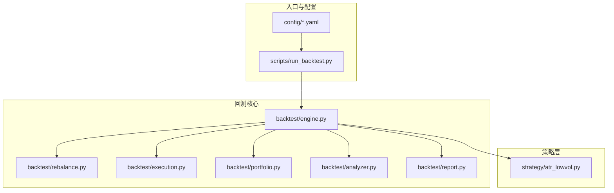
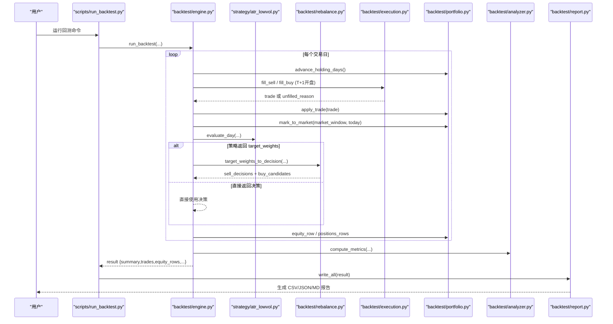
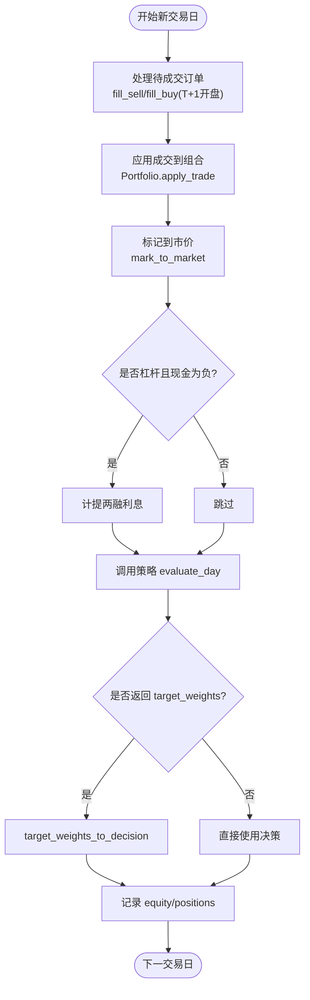
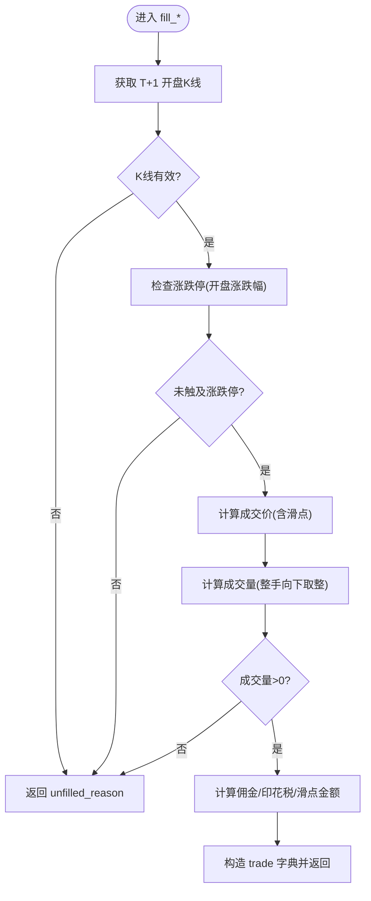
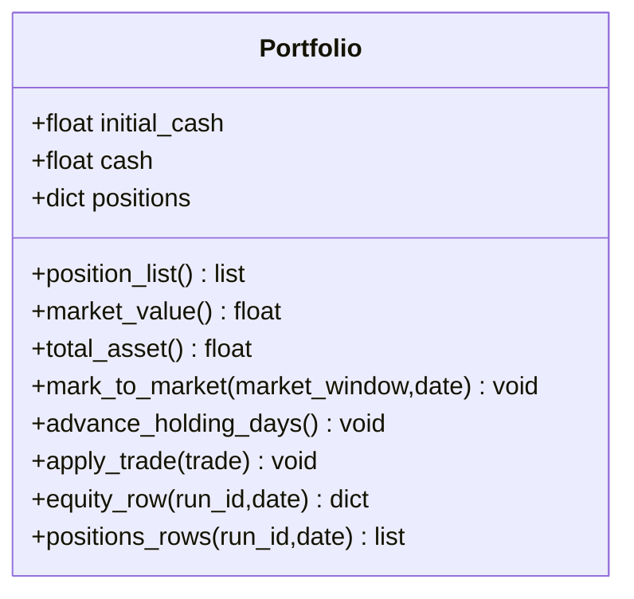
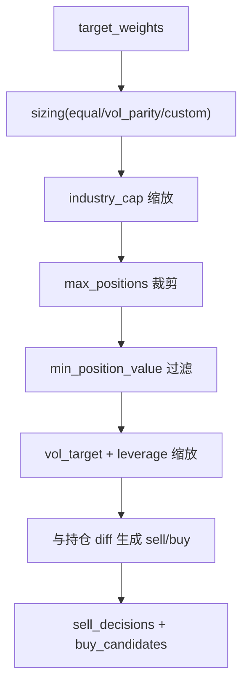
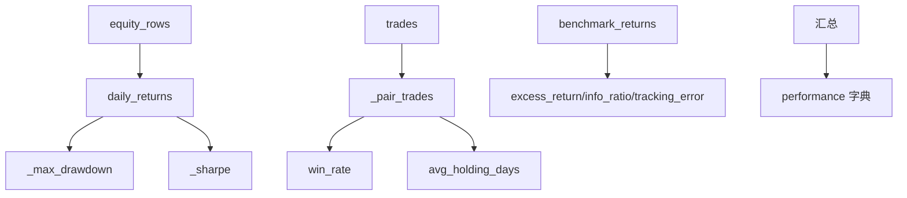
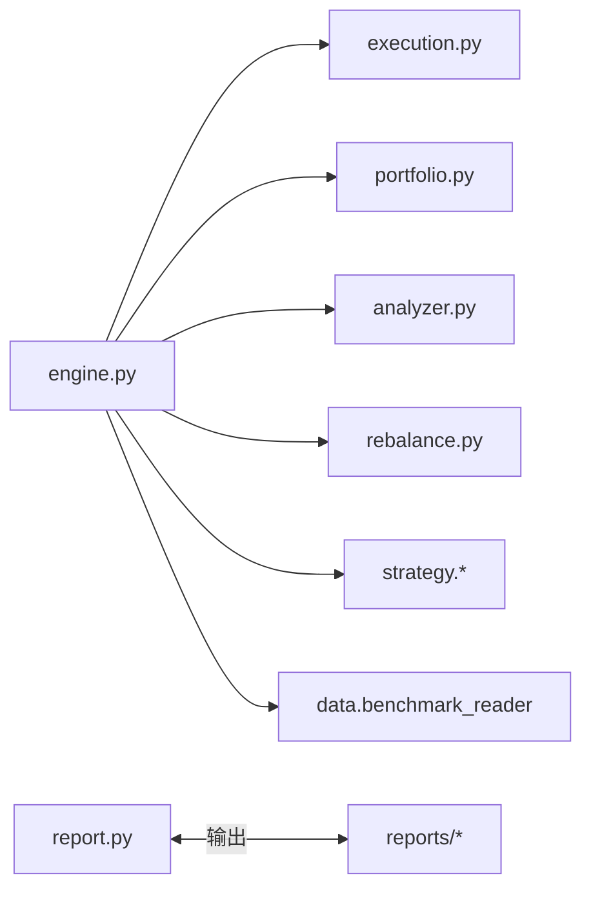

# 回测引擎核心

<cite>
**本文引用的文件**   
- [engine.py](file://backtest/engine.py)
- [execution.py](file://backtest/execution.py)
- [portfolio.py](file://backtest/portfolio.py)
- [analyzer.py](file://backtest/analyzer.py)
- [report.py](file://backtest/report.py)
- [rebalance.py](file://backtest/rebalance.py)
- [atr_lowvol.py](file://strategy/atr_lowvol.py)
- [run_backtest.py](file://scripts/run_backtest.py)
- [settings.yaml](file://config/settings.yaml)
- [trading_config.yaml](file://config/trading_config.yaml)
</cite>

## 目录
1. [引言](#引言)
2. [项目结构](#项目结构)
3. [核心组件](#核心组件)
4. [架构总览](#架构总览)
5. [详细组件分析](#详细组件分析)
6. [依赖关系分析](#依赖关系分析)
7. [性能考量](#性能考量)
8. [故障排查指南](#故障排查指南)
9. [结论](#结论)
10. [附录：使用示例与最佳实践](#附录使用示例与最佳实践)

## 引言
本文件面向 QuantLab 回测引擎的核心实现，系统性阐述事件驱动主循环、数据流控制、状态管理、订单执行模拟（涨跌停限制、T+1、印花税等）、投资组合管理（持仓跟踪、仓位控制、资金管理）、绩效分析引擎（收益、风险、基准对比）以及报告生成系统（CSV/JSON/Markdown）。文档同时给出回测最佳实践、参数设置建议、常见问题解决方案与具体使用示例，帮助读者快速上手并深入理解引擎内部机制。

## 项目结构
QuantLab 的回测核心位于 backtest 包内，围绕“读取数据 -> 策略信号 -> 组合再平衡 -> 成交撮合 -> 组合记账 -> 指标计算 -> 报告输出”的流水线组织。

图表来源
- [run_backtest.py:1-132](file://scripts/run_backtest.py#L1-L132)
- [engine.py:237-619](file://backtest/engine.py#L237-L619)
- [rebalance.py:101-281](file://backtest/rebalance.py#L101-L281)
- [execution.py:95-204](file://backtest/execution.py#L95-L204)
- [portfolio.py:38-189](file://backtest/portfolio.py#L38-L189)
- [analyzer.py:96-176](file://backtest/analyzer.py#L96-L176)
- [report.py:245-264](file://backtest/report.py#L245-L264)
- [atr_lowvol.py:78-165](file://strategy/atr_lowvol.py#L78-L165)

章节来源
- [run_backtest.py:1-132](file://scripts/run_backtest.py#L1-L132)
- [settings.yaml:1-69](file://config/settings.yaml#L1-L69)
- [trading_config.yaml:1-59](file://config/trading_config.yaml#L1-L59)

## 核心组件
- 回测主循环 engine.run_backtest：负责日历切片、基准加载、辅助数据注入、每日事件处理（待成交订单填充、标记到市价、两融利息计提）、调用策略 evaluate_day、将 target_weights 转换为交易决策、记录日志与中间结果，最终汇总性能与元信息。
- 执行撮合 execution.fill_buy/fill_sell：基于 next_open 模型，按次日开盘价加/减滑点成交；校验涨跌停、停牌、最小整手（100股）、买卖费用（佣金、印花税），返回标准 trades.csv 字段。
- 投资组合 portfolio.Portfolio：维护现金、持仓、可用数量（T+1冻结）、未实现盈亏；提供日终 mark_to_market、advance_holding_days、apply_trade、equity_row/positions_rows。
- 绩效分析 analyzer.compute_metrics：计算总收益、年化收益、最大回撤、夏普比率、卡玛比率、胜率、平均持有天数，并在基准可用时计算超额收益、信息比率、跟踪误差。
- 报告输出 report.write_all：生成 trades.csv、equity_curve.csv、positions.csv、logs.txt、report.md、summary.json，固定列顺序与 WARN 块格式。
- 组合再平衡 rebalance.target_weights_to_decision：将策略输出的目标权重转换为 sell_decisions/buy_candidates，内置行业上限、波动率目标、杠杆上限、最大持仓数、最小单仓价值等风控叠加。
- 示例策略 strategy/atr_lowvol：以 ATR 低波选股 + 质量/动量门控，输出等权 target_weights，由框架统一做仓位与风控。

章节来源
- [engine.py:237-619](file://backtest/engine.py#L237-L619)
- [execution.py:95-204](file://backtest/execution.py#L95-L204)
- [portfolio.py:38-189](file://backtest/portfolio.py#L38-L189)
- [analyzer.py:96-176](file://backtest/analyzer.py#L96-L176)
- [report.py:245-264](file://backtest/report.py#L245-L264)
- [rebalance.py:101-281](file://backtest/rebalance.py#L101-L281)
- [atr_lowvol.py:78-165](file://strategy/atr_lowvol.py#L78-L165)

## 架构总览
下图展示从命令行入口到回测主循环、再到执行、组合、分析与报告的完整数据流与控制流。

图表来源
- [run_backtest.py:42-132](file://scripts/run_backtest.py#L42-L132)
- [engine.py:324-444](file://backtest/engine.py#L324-L444)
- [execution.py:95-204](file://backtest/execution.py#L95-L204)
- [portfolio.py:90-151](file://backtest/portfolio.py#L90-L151)
- [analyzer.py:96-176](file://backtest/analyzer.py#L96-L176)
- [report.py:245-264](file://backtest/report.py#L245-L264)
- [atr_lowvol.py:78-165](file://strategy/atr_lowvol.py#L78-L165)
- [rebalance.py:101-281](file://backtest/rebalance.py#L101-L281)

## 详细组件分析

### 回测主循环（engine.run_backtest）
- 事件驱动与数据流
  - 构建交易日历与历史窗口，预计算 cut_index 实现 O(1) 每日切片。
  - 加载基准序列并对齐到回测日历（缺失前向填充）。
  - 每日流程：先处理 pending 订单（T+1 开盘成交），再 mark_to_market，再调用策略 evaluate_day，若返回 target_weights 则经 rebalance 转为 sell/buy 决策，最后记录 equity/positions。
- 状态管理
  - Portfolio 维护 cash、positions、holding_days、available_volume（T+1 冻结）。
  - 两融利息：当 target_leverage > 1 且现金为负时按日计提。
- 诊断与聚合
  - 收集 daily warnings、候选总数/通过数、策略特定指标，最终聚合为 summary.diagnostics_aggregate。
- 基准与样本期警告
  - 计算基准收益率序列，若存在断点或首价为 0 则禁用 IR/excess。
  - 短样本期（<252 天或缺少基准）在 summary.sample_period_warning 中提示不可作为最终定论。

图表来源
- [engine.py:324-444](file://backtest/engine.py#L324-L444)
- [portfolio.py:90-151](file://backtest/portfolio.py#L90-L151)

章节来源
- [engine.py:237-619](file://backtest/engine.py#L237-L619)

### 订单执行模拟（execution.fill_buy/fill_sell）
- 成交模型 next_open
  - 买入：T+1 开盘价 × (1 + slippage)
  - 卖出：T+1 开盘价 × (1 - slippage)
  - 若 T+1 无行情（停牌）则不成交并记录原因。
- 真实市场约束
  - 涨跌停限制：根据板块与 ST 动态确定涨跌幅阈值（双创 20%、北交 30%、主板 10%、ST 5%），开盘涨幅≥涨停拒绝买入，开盘跌幅≤跌停拒绝卖出。
  - 最小整手：A 股 100 股整数倍，不足则放弃。
  - 费用：买入收佣金，卖出收佣金与印花税；滑点金额单独记录。
- 部分减仓：支持 target_cash 指定卖出金额（向下取整至整手），否则默认清仓。

图表来源
- [execution.py:95-204](file://backtest/execution.py#L95-L204)

章节来源
- [execution.py:1-204](file://backtest/execution.py#L1-L204)

### 投资组合管理（portfolio.Portfolio）
- 持仓跟踪
  - 记录每只股票的 volume、available_volume（T+1 冻结）、cost_price、entry_date、holding_days、last_price、unrealized_pnl。
- 资金与市值
  - total_asset = cash + market_value；market_value 按 last_price 计算。
- 日终更新
  - mark_to_market：用当日收盘价更新 last_price 与未实现盈亏；停牌时回退到最近可用收盘价。
  - advance_holding_days：每日递增 holding_days，并将上一日新增持仓解冻为 available_volume。
- 成交应用
  - apply_trade：买入扣款并加权成本，新增头寸 available_volume=0（T+1）；卖出增加现金并扣减可用与持仓，清仓删除条目。

图表来源
- [portfolio.py:38-189](file://backtest/portfolio.py#L38-L189)

章节来源
- [portfolio.py:1-189](file://backtest/portfolio.py#L1-L189)

### 组合再平衡（rebalance.target_weights_to_decision）
- 输入：策略 target_weights（{code: weight}，weight>0 表示持有/选择）
- 步骤
  - 基础权重：equal/vol_parity/custom 三种 sizing 模式。
  - 行业上限：按 industry_map 对行业暴露进行比例缩放。
  - 最大持仓数：按权重降序保留 top-N 并重新归一化。
  - 最小单仓价值：过滤过小权重并重新归一化。
  - 波动率目标与杠杆：保守估计组合波动（对角近似），计算 vt_scale，scale=min(vt_scale*target_leverage, target_leverage)。
  - 生成 sell_decisions/buy_candidates：与当前持仓 diff，不在目标中的全部卖出，目标高于现值的加仓，低于现值的减仓。
- 输出：标准决策结构，包含 diagnostics（候选统计、目标杠杆、估计波动等）与 logs。

图表来源
- [rebalance.py:101-281](file://backtest/rebalance.py#L101-L281)

章节来源
- [rebalance.py:1-281](file://backtest/rebalance.py#L1-L281)

### 绩效分析（analyzer.compute_metrics）
- 收益与风险
  - total_return、annual_return（252 年化处理）、max_drawdown、sharpe、calmar。
- 交易统计
  - n_trades、n_buy、n_sell、win_rate、avg_holding_days（配对买卖）。
- 基准对比
  - 当 benchmark_available 且序列对齐时，计算 excess_return、information_ratio、tracking_error。

图表来源
- [analyzer.py:96-176](file://backtest/analyzer.py#L96-L176)

章节来源
- [analyzer.py:1-176](file://backtest/analyzer.py#L1-L176)

### 报告生成（report.write_all）
- 输出文件
  - trades.csv（13 列固定顺序）
  - equity_curve.csv（8 列）
  - positions.csv（9 列）
  - logs.txt（WARN 块 + 每日日志）
  - report.md（摘要表格、期末持仓、关键日志摘录、数据元信息、复现命令）
  - summary.json（完整元信息与 performance）
- 路径与编码
  - 默认输出目录 E:/QuantLab/reports，UTF-8 写入，兼容 Python 3.6。

章节来源
- [report.py:1-264](file://backtest/report.py#L1-L264)

### 示例策略（strategy/atr_lowvol）
- 选股逻辑：ATR% 低波筛选 + 换手率区间 + 非 ST + 上市时长 + ROE>0 + 12-1 月动量>0。
- 调仓频率：monthly/quarterly 等（由 is_rebalance_day 判定）。
- 输出：target_weights={c: 1.0 for c in selected}，交由框架统一做仓位与风控。
- 止损：非调仓日触发止损时，退出对应标的（通过 target_weights 表达）。

章节来源
- [atr_lowvol.py:1-165](file://strategy/atr_lowvol.py#L1-L165)

## 依赖关系分析
- 模块耦合
  - engine 依赖 execution、portfolio、analyzer、rebalance、strategy.registry、data.benchmark_reader。
  - execution 纯函数，无外部 IO，仅依赖 exec_cfg。
  - portfolio 纯数据结构与工具函数，无 IO。
  - analyzer 纯 numpy/math 计算，无外部依赖。
  - report 仅负责序列化输出，不依赖业务逻辑。
- 外部集成点
  - 数据源 reader（如 AstockParquetReader）通过接口契约被 engine 调用。
  - 基准数据通过 BenchmarkIndexReader 加载 DuckDB 序列。
  - 行业映射可选加载用于 industry_cap。

图表来源
- [engine.py:237-619](file://backtest/engine.py#L237-L619)
- [report.py:245-264](file://backtest/report.py#L245-L264)

章节来源
- [engine.py:237-619](file://backtest/engine.py#L237-L619)
- [report.py:1-264](file://backtest/report.py#L1-L264)

## 性能考量
- 数据切片优化：_build_cut_index 与 _slice_window_fast 将每日切片从 O(N) 降至 O(1)，显著降低大样本回测开销。
- 基准对齐：一次性加载并按日期前向填充，避免重复 I/O。
- 指标计算：analyzer 使用原生 math 与列表推导，避免重型依赖，适合短周期快速迭代。
- 内存占用：所有中间结果以字典/列表形式驻留内存，长样本需关注 trades/equity_rows/positions_rows 规模。

[本节为通用指导，不直接分析具体文件]

## 故障排查指南
- 常见报错与定位
  - 空交易日历：检查 start_date/end_date 与 reader.trading_calendar 返回值。
  - 基准不可用：确认 benchmark_code、benchmark_db_path 与数据完整性；若存在断点或首价为 0，IR/excess 将被禁用。
  - 未成交订单增多：检查 T+1 开盘涨跌停、停牌、滑点过大导致价格无效、target_cash 过小无法成手。
  - 行业上限/最大持仓裁剪：查看 rebalance logs 与 diagnostics 中的 trimmed 信息。
- 日志与诊断
  - logs.txt 中的 [WARN]/[ERROR] 行优先排查；summary.diagnostics_aggregate.warnings_unique 汇总唯一警告。
  - report.md 的“关键日志摘录”便于快速定位问题。

章节来源
- [engine.py:324-444](file://backtest/engine.py#L324-L444)
- [report.py:78-122](file://backtest/report.py#L78-L122)

## 结论
QuantLab 回测引擎以清晰的事件驱动主循环为核心，将策略信号与组合风控解耦，通过标准化的执行撮合与组合记账，确保回测贴近真实市场约束（涨跌停、T+1、费用、整手）。其模块化设计使策略开发聚焦于选股与权重生成，而风险与执行细节由框架统一保障。配合完善的绩效分析与报告输出，形成可复现、可扩展、易调试的回测体系。

[本节为总结性内容，不直接分析具体文件]

## 附录：使用示例与最佳实践

### 使用示例
- 命令行运行
  - python -m scripts.run_backtest --config config/atr_lowvol_fw.yaml
  - 支持 --results-dir 覆盖输出目录。
- 配置文件要点
  - backtest.name：运行名称
  - data.path/adjustment：数据路径与复权方式（raw/qfq/hfq）
  - universe.csv：股票池文件
  - execution.slippage/commission_rate/tax_rate：滑点、佣金、印花税
  - strategy_params.position_sizing/target_leverage/vol_target/industry_cap/max_positions/min_position_value：仓位与风控叠加
- 典型输出
  - reports/<run_id>_<config>/ 下生成 trades.csv、equity_curve.csv、positions.csv、logs.txt、report.md、summary.json

章节来源
- [run_backtest.py:42-132](file://scripts/run_backtest.py#L42-L132)
- [settings.yaml:21-28](file://config/settings.yaml#L21-L28)
- [trading_config.yaml:10-28](file://config/trading_config.yaml#L10-L28)

### 回测最佳实践
- 参数设置
  - 初始资金与手续费：确保与实盘一致，避免虚高收益。
  - 滑点与印花税：合理设置以反映真实摩擦成本。
  - 波动率目标与杠杆：vol_target 打开时需结合 target_leverage 谨慎设定，避免过度放大。
- 数据准备
  - 确保交易日历连续、基准数据完整；必要时延长 warmup 窗口以保证指标稳定。
  - 行业映射仅在 industry_cap>0 时加载，减少不必要开销。
- 结果解读
  - 短样本期不可作为最终定论；关注 sample_period_warning。
  - 若基准禁用，IR/excess/tracking_error 将为 None，应侧重绝对收益与回撤。
  - 未成交订单计数与 warnings_unique 有助于识别流动性与涨跌停影响。

[本节为通用指导，不直接分析具体文件]