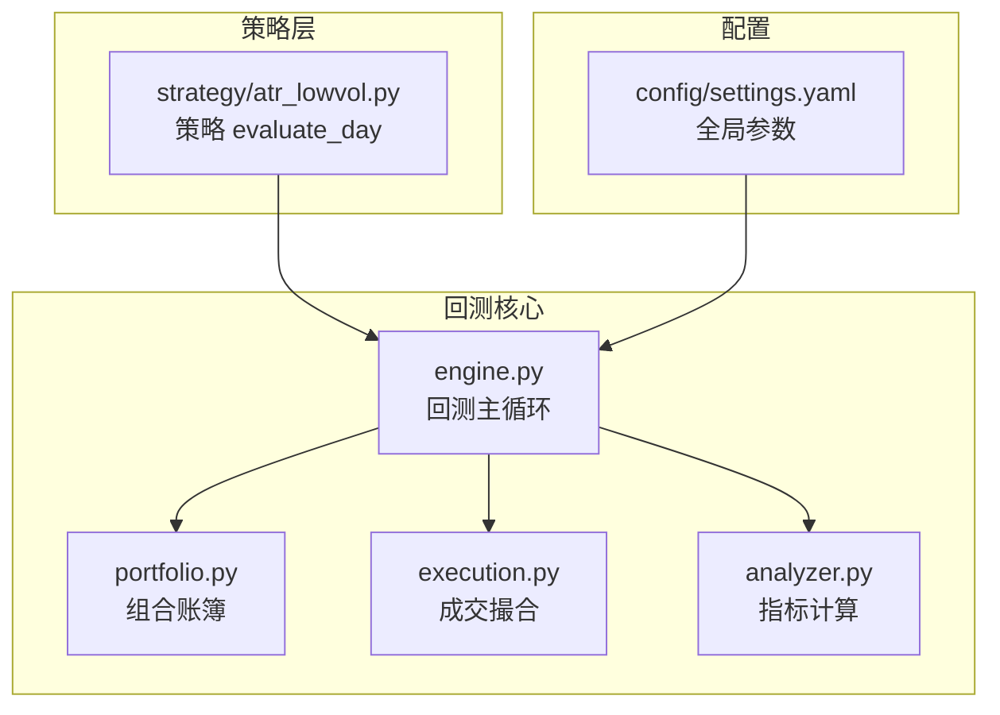
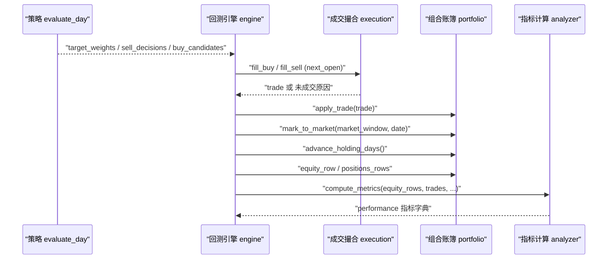
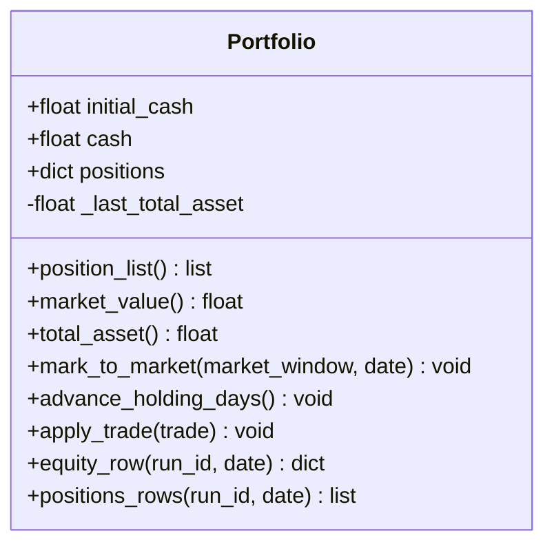
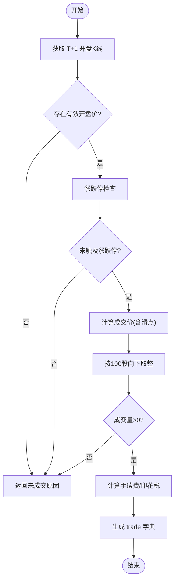
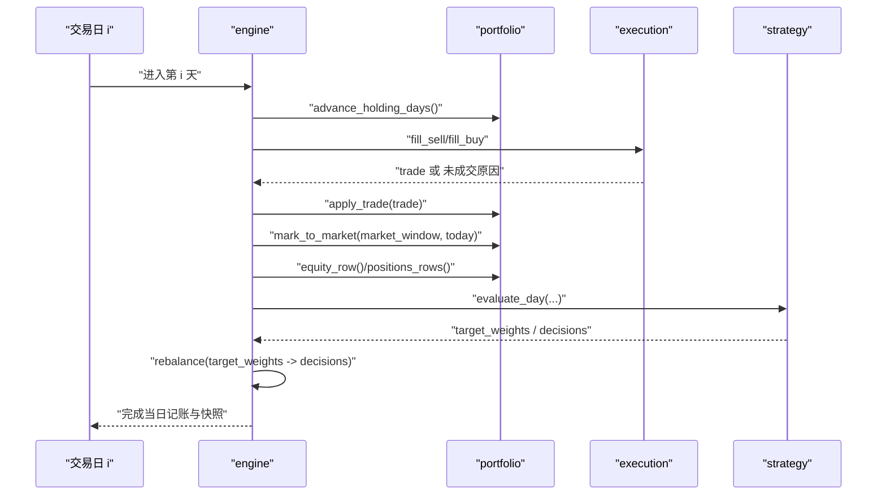
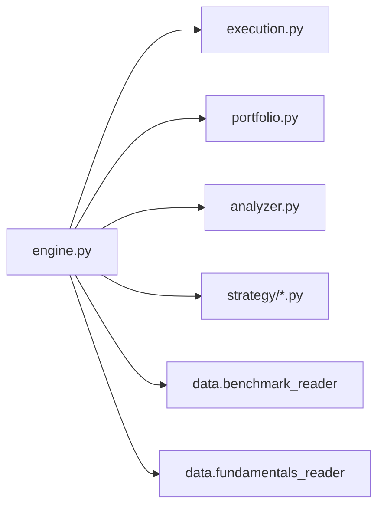

# 投资组合管理器

<cite>
**本文引用的文件**   
- [backtest/portfolio.py](file://backtest/portfolio.py)
- [backtest/engine.py](file://backtest/engine.py)
- [backtest/execution.py](file://backtest/execution.py)
- [backtest/analyzer.py](file://backtest/analyzer.py)
- [strategy/atr_lowvol.py](file://strategy/atr_lowvol.py)
- [config/settings.yaml](file://config/settings.yaml)
</cite>

## 目录
1. [简介](#简介)
2. [项目结构](#项目结构)
3. [核心组件](#核心组件)
4. [架构总览](#架构总览)
5. [详细组件分析](#详细组件分析)
6. [依赖关系分析](#依赖关系分析)
7. [性能与扩展性](#性能与扩展性)
8. [故障排查指南](#故障排查指南)
9. [结论](#结论)
10. [附录：使用示例与最佳实践](#附录使用示例与最佳实践)

## 简介
本文件面向 QuantLab 的投资组合管理器，围绕 Portfolio 类及其在回测引擎中的协作机制，系统阐述持仓跟踪、资金管理、市值计算、T+1 可用股份控制、每日标记到市值、杠杆利息计提等关键能力。同时给出组合状态更新流程、指标计算接口以及在实际策略中的调用方式，帮助读者快速理解并正确使用该模块。

## 项目结构
QuantLab 的回测与组合管理位于 backtest 包内，核心由以下文件组成：
- portfolio.py：组合账簿（现金、持仓、持有天数、未实现盈亏）与日度快照生成
- engine.py：回测主循环，串联数据读取、策略评估、成交撮合、组合记账与指标计算
- execution.py：成交撮合层（涨跌停/停牌/滑点/手续费/印花税/整数手约束）
- analyzer.py：绩效与风险指标计算（夏普、最大回撤、年化收益、基准超额等）
- strategy/*.py：策略入口（如 atr_lowvol），输出目标权重或买卖决策
- config/settings.yaml：全局配置（初始资金、手续费、滑点、基准代码等）

图表来源
- [backtest/engine.py:237-619](file://backtest/engine.py#L237-L619)
- [backtest/portfolio.py:38-188](file://backtest/portfolio.py#L38-L188)
- [backtest/execution.py:95-204](file://backtest/execution.py#L95-L204)
- [backtest/analyzer.py:96-176](file://backtest/analyzer.py#L96-L176)
- [strategy/atr_lowvol.py:78-165](file://strategy/atr_lowvol.py#L78-L165)
- [config/settings.yaml:22-28](file://config/settings.yaml#L22-L28)

章节来源
- [backtest/engine.py:237-619](file://backtest/engine.py#L237-L619)
- [backtest/portfolio.py:38-188](file://backtest/portfolio.py#L38-L188)
- [backtest/execution.py:95-204](file://backtest/execution.py#L95-L204)
- [backtest/analyzer.py:96-176](file://backtest/analyzer.py#L96-L176)
- [strategy/atr_lowvol.py:78-165](file://strategy/atr_lowvol.py#L78-L165)
- [config/settings.yaml:22-28](file://config/settings.yaml#L22-L28)

## 核心组件
- Portfolio：组合账簿，维护现金余额、按股票代码映射的持仓字典、每日总资产与市值、持有天数与未实现盈亏；提供 T+1 可用股份冻结与解冻、每日标记到市值、交易应用、净值曲线与持仓快照生成。
- Execution：基于 next_open 模型的成交撮合，处理涨跌停、停牌、滑点、手续费、印花税与 A 股整手约束，返回标准 trade 字典供组合记账。
- Engine：回测主循环，负责日历切片、基准序列加载、策略 evaluate_day 调用、rebalance 转换、执行撮合、组合记账、日志与诊断聚合、指标计算与汇总。
- Analyzer：纯函数式指标计算，包括总收益、年化收益、最大回撤、夏普比率、Calmar、胜率、平均持有期、基准超额与信息比率等。

章节来源
- [backtest/portfolio.py:38-188](file://backtest/portfolio.py#L38-L188)
- [backtest/execution.py:95-204](file://backtest/execution.py#L95-L204)
- [backtest/engine.py:237-619](file://backtest/engine.py#L237-L619)
- [backtest/analyzer.py:96-176](file://backtest/analyzer.py#L96-L176)

## 架构总览
下图展示回测主循环中各组件的交互顺序：策略输出目标权重 → 转换为买卖决策 → 执行撮合 → 组合记账 → 日度快照与指标计算。

图表来源
- [backtest/engine.py:324-443](file://backtest/engine.py#L324-L443)
- [backtest/execution.py:95-204](file://backtest/execution.py#L95-L204)
- [backtest/portfolio.py:76-151](file://backtest/portfolio.py#L76-L151)
- [backtest/analyzer.py:96-176](file://backtest/analyzer.py#L96-L176)

## 详细组件分析

### Portfolio 类：持仓与资金管理
- 数据结构
  - 现金：initial_cash、cash
  - 持仓：positions[code] = {volume, available_volume, cost_price, entry_date, holding_days, last_price, unrealized_pnl}
  - 日度基线：_last_total_asset（用于计算 daily_return）
- 关键方法
  - position_list()：导出当前持仓快照（供策略 evaluate_day 使用）
  - market_value()：按 volume × last_price 求和得到总市值
  - total_asset()：cash + market_value
  - mark_to_market(market_window, date)：根据当日收盘价更新 last_price 与 unrealized_pnl；若停牌则回退至最近已知收盘价
  - advance_holding_days()：持有天数 +1，并将 T+1 冻结的可用股份解冻为 volume
  - apply_trade(trade)：按 side 更新 cash、positions、available_volume；买入采用加权平均成本法，卖出扣减可用股份；遵循 T+1 规则
  - equity_row(run_id, date)：生成权益曲线行（total_asset、cash、market_value、daily_return）
  - positions_rows(run_id, date)：生成持仓明细行（含未实现盈亏、持有天数）

图表来源
- [backtest/portfolio.py:38-188](file://backtest/portfolio.py#L38-L188)

章节来源
- [backtest/portfolio.py:38-188](file://backtest/portfolio.py#L38-L188)

### 执行撮合：Execution 层
- 模型：next_open（T 收盘信号，T+1 开盘成交）
- 约束：A 股整手（100 股）、涨跌停判定（主板/双创/北交/ST）、滑点、手续费、印花税
- 函数
  - fill_sell(decision, position, market_window, fill_date, exec_cfg, run_id)：按 T+1 开盘价匹配卖出，支持 target_cash 部分减仓
  - fill_buy(candidate, market_window, fill_date, exec_cfg, run_id)：按 T+1 开盘价匹配买入，将 target_cash 转为整手数量

图表来源
- [backtest/execution.py:95-204](file://backtest/execution.py#L95-L204)

章节来源
- [backtest/execution.py:95-204](file://backtest/execution.py#L95-L204)

### 回测主循环：Engine 与组合状态更新
- 每日流程
  - advance_holding_days()：先解冻可用股份并递增持有天数
  - pending 订单处理：依次执行 sell/buy 撮合，成功后 apply_trade()
  - mark_to_market()：更新 last_price 与 unrealized_pnl
  - 两融利息计提：当启用杠杆且现金为负时按日计提（rate/252）
  - 生成 equity_row 与 positions_rows
  - 调用策略 evaluate_day，必要时通过 rebalance 将 target_weights 转换为具体买卖决策
  - 记录日志与诊断信息，累计候选股票统计
- 基准序列：加载并前向填充基准收盘价，计算基准日收益率与总收益

图表来源
- [backtest/engine.py:324-443](file://backtest/engine.py#L324-L443)
- [backtest/portfolio.py:90-151](file://backtest/portfolio.py#L90-L151)
- [backtest/execution.py:95-204](file://backtest/execution.py#L95-L204)

章节来源
- [backtest/engine.py:324-443](file://backtest/engine.py#L324-L443)

### 指标计算：Analyzer
- 输入：equity_rows、trades、trading_calendar、initial_cash、benchmark 相关字段
- 输出：总收益、年化收益、最大回撤、夏普比率、Calmar、胜率、平均持有期、基准超额、信息比率、跟踪误差
- 基准可用性：若无基准或基准数据不完整，超额/IR/TE 返回 None

章节来源
- [backtest/analyzer.py:96-176](file://backtest/analyzer.py#L96-L176)

### 策略集成：以 atr_lowvol 为例
- 策略职责：选股与调仓频率控制，非调仓日可触发止损退出
- 输出：target_weights（等权）或 sell_decisions/buy_candidates
- 框架职责：仓位分配、风控（行业上限、最小头寸、目标波动率、目标杠杆）、执行撮合与组合记账

章节来源
- [strategy/atr_lowvol.py:78-165](file://strategy/atr_lowvol.py#L78-L165)

## 依赖关系分析
- 组件耦合
  - engine 依赖 execution、portfolio、analyzer 与策略注册表
  - portfolio 无外部依赖，仅依赖市场窗口数据（DataFrame）进行价格查找
  - execution 依赖市场窗口与执行配置（滑点、费率、税率）
  - analyzer 纯函数，不依赖其他模块
- 外部依赖
  - 基准数据：通过 benchmark_reader 加载 DuckDB 中的指数序列
  - 基本面数据：可选 fundamentals_reader（用于评分）

图表来源
- [backtest/engine.py:237-619](file://backtest/engine.py#L237-L619)

章节来源
- [backtest/engine.py:237-619](file://backtest/engine.py#L237-L619)

## 性能与扩展性
- 时间复杂度
  - mark_to_market：O(N_positions)，每日一次
  - apply_trade：O(1) 单次交易
  - equity_row/positions_rows：O(1)/O(N_positions)
  - 整体回测：O(Days × (N_positions + N_trades))
- 空间复杂度
  - positions 字典 O(N_positions)
  - 日度快照列表 O(Days × N_positions)
- 优化建议
  - 使用预计算的 cut_index 加速市场窗口切片（已在 engine 中实现）
  - 对高频 tick 级记账可扩展为增量更新（当前为日度快照）
  - 基准序列前向填充避免缺失导致的断点

[本节为通用指导，不直接分析具体文件]

## 故障排查指南
- 常见未成交原因
  - suspended：T+1 无开盘数据（停牌）
  - no_available_volume：可用股份为 0（T+1 限制）
  - limit_up_at_open / limit_down_at_open：开盘触及涨跌停
  - invalid_price：开盘价无效或非正数
  - below_min_lot：不足一手（100 股）
  - no_target_cash：买入候选缺少目标金额
- 调试要点
  - 检查 market_window 是否包含目标 code 与日期
  - 确认执行配置（slippage/commission_rate/tax_rate）合理
  - 关注日志中的 unfilled_order_count 与 reason
  - 验证基准数据路径与代码是否正确

章节来源
- [backtest/execution.py:95-204](file://backtest/execution.py#L95-L204)
- [backtest/engine.py:324-443](file://backtest/engine.py#L324-L443)

## 结论
Portfolio 类在 QuantLab 中承担组合账簿的核心职责，结合 execution 的真实约束与 engine 的主循环调度，实现了稳健的回测记账体系。其设计清晰、接口稳定，便于策略层专注于选股与权重决策，而将仓位、风控与执行细节交由框架处理。配合 analyzer 的指标计算，形成完整的“策略—执行—记账—评估”闭环。

[本节为总结性内容，不直接分析具体文件]

## 附录：使用示例与最佳实践
- 初始化与运行
  - 设置初始资金、手续费、滑点、基准代码（settings.yaml）
  - 选择策略（如 atr_lowvol），传入 strategy_config（目标杠杆、波动目标、行业上限等）
  - 调用 run_backtest(reader, universe, start_date, end_date, strategy_config, execution_cfg, initial_cash, ...)
- 持仓与资金管理要点
  - 买入后当天不可用（available_volume=0），次日解冻
  - 加权平均成本法更新 cost_price
  - 每日 mark_to_market 更新 last_price 与 unrealized_pnl
  - 两融利息仅在现金为负时按日计提
- 组合分析与风控
  - 使用 analyzer 输出风险收益指标
  - 通过 diagnostics 与日志定位未成交与异常
  - 利用 target_weights 模式简化策略开发，聚焦选股逻辑

章节来源
- [config/settings.yaml:22-28](file://config/settings.yaml#L22-L28)
- [backtest/engine.py:237-619](file://backtest/engine.py#L237-L619)
- [backtest/portfolio.py:76-151](file://backtest/portfolio.py#L76-L151)
- [backtest/analyzer.py:96-176](file://backtest/analyzer.py#L96-L176)