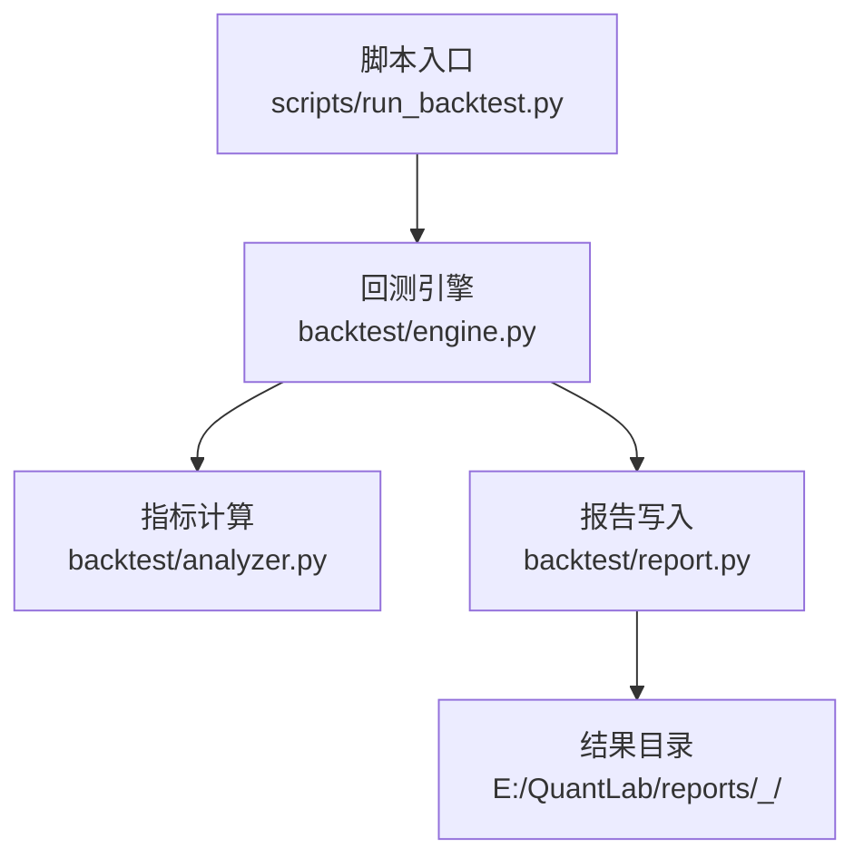
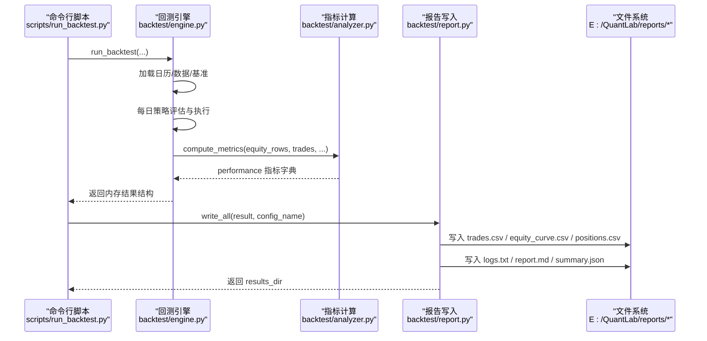
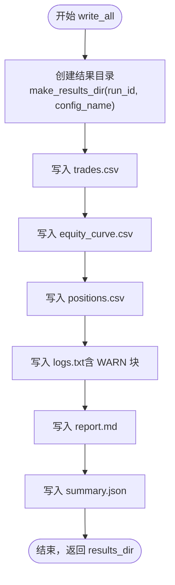
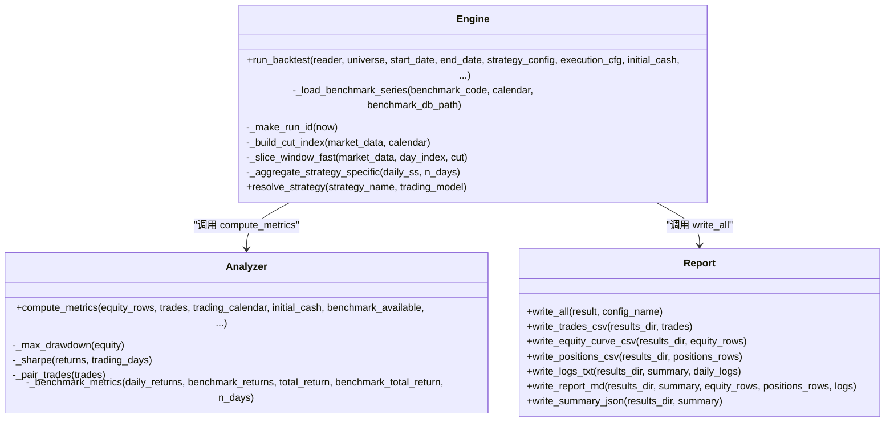
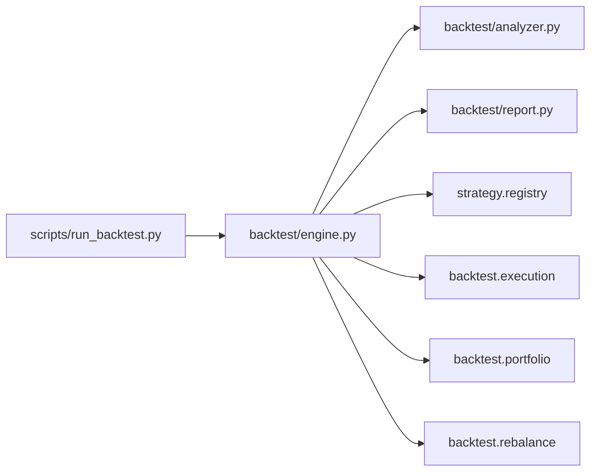

# 报告生成系统

<cite>
**本文引用的文件**   
- [backtest/report.py](file://backtest/report.py)
- [backtest/engine.py](file://backtest/engine.py)
- [backtest/analyzer.py](file://backtest/analyzer.py)
- [scripts/run_backtest.py](file://scripts/run_backtest.py)
- [reports/20260803_204830_513b7f_atr_lowvol_fw/equity_curve.csv](file://reports/20260803_204830_513b7f_atr_lowvol_fw/equity_curve.csv)
- [reports/20260803_205645_a7b4b3_atr_lowvol_fw_leverage_only/equity_curve.csv](file://reports/20260803_205645_a7b4b3_atr_lowvol_fw_leverage_only/equity_curve.csv)
</cite>

## 目录
1. [简介](#简介)
2. [项目结构](#项目结构)
3. [核心组件](#核心组件)
4. [架构总览](#架构总览)
5. [详细组件分析](#详细组件分析)
6. [依赖关系分析](#依赖关系分析)
7. [性能考量](#性能考量)
8. [故障排查指南](#故障排查指南)
9. [结论](#结论)
10. [附录](#附录)

## 简介
本文件为 QuantLab 报告生成系统的完整技术文档，聚焦于回测结果从内存到磁盘的序列化与输出流程。内容涵盖：
- 数据格式化与文件输出（CSV、JSON、Markdown）
- 图表生成能力与可视化集成点
- 报告模板系统与动态内容插入
- 日志记录机制（运行日志、错误追踪、调试信息）
- 报告归档与版本管理（目录结构、命名规范、历史版本）
- 配置选项与使用示例（批量报告生成与自动化工作流）

该文档旨在帮助开发者与使用者快速理解并扩展报告管线，确保可复现、可审计、可扩展。

## 项目结构
QuantLab 的报告生成由“引擎 + 指标计算 + 报告写入”三部分协作完成：
- 引擎负责回测主循环、交易执行、组合状态更新与日志收集
- 指标计算模块对净值曲线与交易明细进行绩效统计
- 报告写入模块将结构化结果持久化为 CSV、JSON、Markdown 与日志文本

**图示来源** 
- [scripts/run_backtest.py:42-127](file://scripts/run_backtest.py#L42-L127)
- [backtest/engine.py:237-618](file://backtest/engine.py#L237-L618)
- [backtest/analyzer.py:96-176](file://backtest/analyzer.py#L96-L176)
- [backtest/report.py:245-263](file://backtest/report.py#L245-L263)

**章节来源**
- [scripts/run_backtest.py:1-132](file://scripts/run_backtest.py#L1-L132)
- [backtest/engine.py:1-619](file://backtest/engine.py#L1-L619)
- [backtest/analyzer.py:1-176](file://backtest/analyzer.py#L1-L176)
- [backtest/report.py:1-264](file://backtest/report.py#L1-L264)

## 核心组件
- 回测引擎（engine.py）
  - 构建交易日历与数据窗口
  - 调用策略 evaluate_day 生成调仓决策
  - 执行买卖、更新组合、记录日志
  - 汇总基准序列与日度收益
  - 输出内存结果结构（summary、trades、equity_rows、positions_rows、logs）
- 指标计算（analyzer.py）
  - 基于 equity_rows 与 trades 计算总收益、年化收益、最大回撤、夏普比率、卡玛比率、胜率、平均持仓天数等
  - 可选基准对比（超额收益、信息比率、跟踪误差）
- 报告写入（report.py）
  - 统一产物目录与命名
  - 输出 trades.csv、equity_curve.csv、positions.csv、logs.txt、report.md、summary.json
  - 提供 write_all 一键式写入接口

**章节来源**
- [backtest/engine.py:237-618](file://backtest/engine.py#L237-L618)
- [backtest/analyzer.py:96-176](file://backtest/analyzer.py#L96-L176)
- [backtest/report.py:245-263](file://backtest/report.py#L245-L263)

## 架构总览
下图展示一次回测从脚本入口到最终报告的端到端流程。

**图示来源** 
- [scripts/run_backtest.py:96-121](file://scripts/run_backtest.py#L96-L121)
- [backtest/engine.py:237-618](file://backtest/engine.py#L237-L618)
- [backtest/analyzer.py:96-176](file://backtest/analyzer.py#L96-L176)
- [backtest/report.py:245-263](file://backtest/report.py#L245-L263)

## 详细组件分析

### 报告写入器（report.py）
- 统一产物目录
  - 默认目录：E:/QuantLab/reports
  - 每个运行生成子目录：<run_id>_<config_name>
- 固定列契约（CSV）
  - trades.csv：run_id、date、code、side、volume、price、amount、slippage_amt、commission、tax、reason、layer、model
  - equity_curve.csv：run_id、date、total_asset、cash、market_value、daily_return、benchmark_close、benchmark_return
  - positions.csv：run_id、date、code、volume、available_volume、cost_price、last_price、unrealized_pnl、holding_days
- 日志与警告
  - logs.txt：包含 WARN 块与每日日志摘录
  - 样本期过短、基准不可用、去重计数、sector_heat_mode=zero、WAL 检测等警告
- Markdown 报告
  - 包含 Run 元信息、业绩指标表、期末持仓概览、关键日志摘录、数据元信息、复现命令
- JSON 摘要
  - summary.json：包含 schema_version、run_id、performance、data_coverage_actual、diagnostics_aggregate、portfolio_end 等

**图示来源** 
- [backtest/report.py:44-49](file://backtest/report.py#L44-L49)
- [backtest/report.py:60-75](file://backtest/report.py#L60-L75)
- [backtest/report.py:111-121](file://backtest/report.py#L111-L121)
- [backtest/report.py:138-233](file://backtest/report.py#L138-L233)
- [backtest/report.py:236-243](file://backtest/report.py#L236-L243)
- [backtest/report.py:245-263](file://backtest/report.py#L245-L263)

**章节来源**
- [backtest/report.py:1-264](file://backtest/report.py#L1-L264)

### 回测引擎（engine.py）
- 交易日历与数据切片
  - 预计算 cut_index 实现 O(1) 每日窗口切片
- 基准序列加载与对齐
  - 支持 DuckDB 基准索引，缺失值前向填充，窗口前期容差处理
- 策略注册与交易模型校验
  - 扁平策略名映射，ALLOWED_TRADING_MODELS 校验
- 每日循环
  - 执行 pending 订单（买入/卖出），记录日志与未成交原因
  - 标记市值、计提两融利息（杠杆场景）
  - 收集 equity_rows、positions_rows、logs
- 指标与诊断聚合
  - 候选数量、通过率、策略特定指标按天聚合
  - 计算 performance 字典（通过 analyzer.compute_metrics）
- 输出内存结构
  - summary（含 data_hash、universe_hash、benchmark_available、sample_period_warning 等）
  - trades、equity_rows、positions_rows、logs、trading_calendar

**图示来源** 
- [backtest/engine.py:237-618](file://backtest/engine.py#L237-L618)
- [backtest/analyzer.py:96-176](file://backtest/analyzer.py#L96-L176)
- [backtest/report.py:245-263](file://backtest/report.py#L245-L263)

**章节来源**
- [backtest/engine.py:1-619](file://backtest/engine.py#L1-L619)
- [backtest/analyzer.py:1-176](file://backtest/analyzer.py#L1-L176)

### 指标计算（analyzer.py）
- 基础指标
  - 总收益、年化收益（252 日年化）、最大回撤、夏普比率、卡玛比率
  - 胜率、交易次数、平均持仓天数
- 基准对比（可选）
  - 超额收益、信息比率、跟踪误差（需基准日收益序列与总收益）
- 输入契约
  - equity_rows：按日期顺序的资产行
  - trades：逐笔交易记录
  - trading_calendar：交易日列表
  - initial_cash：初始资金
  - benchmark_available、benchmark_returns、benchmark_total_return：基准相关

**章节来源**
- [backtest/analyzer.py:96-176](file://backtest/analyzer.py#L96-L176)

### 脚本入口（scripts/run_backtest.py）
- 参数解析
  - --config 指定 YAML 配置文件路径
  - --results-dir 覆盖默认结果目录
- 配置读取
  - backtest、data、universe、execution、strategy_params 等段
- 数据与集合
  - 加载 AstockParquetReader、universe.csv 代码集
  - 可选 industry_map（行业权重叠加）
- 回测执行
  - 调用 engine.run_backtest(...) 获取内存结果
- 报告生成
  - 调用 report.write_all(...) 输出六类文件
  - 打印关键绩效指标

**章节来源**
- [scripts/run_backtest.py:1-132](file://scripts/run_backtest.py#L1-L132)

## 依赖关系分析
- 模块耦合
  - scripts/run_backtest.py 依赖 engine、report、data reader、universe loader
  - engine 依赖 analyzer、execution、portfolio、rebalance、strategy registry
  - report 仅做 IO，不依赖交易执行或外部库
- 外部依赖
  - 基准数据源：DuckDB 基准索引（可配置路径）
  - 行情数据：Astock Parquet（只读）
- 潜在循环依赖
  - 无直接循环；engine 与 report 解耦良好

**图示来源** 
- [scripts/run_backtest.py:26-30](file://scripts/run_backtest.py#L26-L30)
- [backtest/engine.py:20-25](file://backtest/engine.py#L20-L25)

**章节来源**
- [scripts/run_backtest.py:1-132](file://scripts/run_backtest.py#L1-L132)
- [backtest/engine.py:1-619](file://backtest/engine.py#L1-L619)

## 性能考量
- 数据切片优化
  - 预计算 cut_index，每日窗口切片 O(1)，避免重复过滤
- 基准序列对齐
  - 前向填充缺失值，窗口前期容差，减少异常分支
- 指标计算
  - 纯 Python 数学运算，避免重型依赖，适合短样本稳健估计
- I/O 效率
  - CSV 使用 csv.DictWriter，UTF-8-SIG 编码，兼容 Excel
  - JSON 使用 ensure_ascii=False，便于中文可读

[本节为通用指导，无需具体文件引用]

## 故障排查指南
- 常见问题定位
  - 基准不可用：检查 benchmark_db_path 与基准数据存在性
  - 样本期过短：关注 sample_period_warning，建议补全数据后重跑
  - WAL 检测：数据源可能正在同步，等待稳定后再运行
  - 未成交订单：查看 logs.txt 中的 ERROR 行，确认市场流动性与价格限制
- 日志与诊断
  - logs.txt 包含 WARN 块与每日日志，优先检索 [WARN]/[ERROR]
  - report.md 关键日志摘录显示最近 10 条重要日志
  - summary.json 中 diagnostics_aggregate 提供候选数、通过率、未成交计数等

**章节来源**
- [backtest/report.py:78-121](file://backtest/report.py#L78-L121)
- [backtest/report.py:138-233](file://backtest/report.py#L138-L233)
- [backtest/engine.py:328-372](file://backtest/engine.py#L328-L372)

## 结论
QuantLab 的报告生成系统以清晰的职责划分与稳定的数据契约实现了高可复现的回测结果输出。通过统一的 CSV/JSON/Markdown 格式与完善的日志机制，用户可便捷地进行结果审计、可视化分析与自动化集成。建议在扩展时遵循现有列契约与目录规范，保持向后兼容与可追溯性。

[本节为总结，无需具体文件引用]

## 附录

### 报告文件格式说明
- CSV 交易明细（trades.csv）
  - 字段：run_id、date、code、side、volume、price、amount、slippage_amt、commission、tax、reason、layer、model
- CSV 权益曲线（equity_curve.csv）
  - 字段：run_id、date、total_asset、cash、market_value、daily_return、benchmark_close、benchmark_return
- CSV 持仓快照（positions.csv）
  - 字段：run_id、date、code、volume、available_volume、cost_price、last_price、unrealized_pnl、holding_days
- JSON 摘要（summary.json）
  - 包含 schema_version、run_id、performance、data_coverage_actual、diagnostics_aggregate、portfolio_end 等
- Markdown 报告（report.md）
  - 包含 Run 元信息、业绩指标、期末持仓、关键日志、数据元信息、复现命令

**章节来源**
- [backtest/report.py:31-41](file://backtest/report.py#L31-L41)
- [backtest/report.py:138-233](file://backtest/report.py#L138-L233)
- [backtest/report.py:236-243](file://backtest/report.py#L236-L243)

### 图表生成功能与可视化集成
- 当前报告生成不包含内建图表绘制，但提供了可直接用于可视化的结构化数据：
  - 权益曲线图：基于 equity_curve.csv 的 total_asset 与 benchmark_close
  - 收益分布图：基于 equity_curve.csv 的 daily_return
  - 回撤分析图：基于 equity_curve.csv 计算的累计最大值与回撤
- 可视化集成建议
  - 使用 pandas + plotly/matplotlib 读取 CSV 生成交互式图表
  - 结合 Streamlit/Dash 构建监控看板，参考仓库内 dashboard 示例

[本节为概念性说明，无需具体文件引用]

### 报告模板系统与动态内容插入
- 当前模板为程序化拼接 Markdown，字段来自 summary、equity_rows、positions_rows、logs
- 扩展建议
  - 抽取模板字符串至独立模板文件（如 Jinja2）
  - 支持自定义样式与动态章节插入
  - 保留字段契约以确保兼容性

**章节来源**
- [backtest/report.py:138-233](file://backtest/report.py#L138-L233)

### 日志记录机制
- 运行日志
  - logs.txt：包含 WARN 块与每日日志
  - report.md：关键日志摘录（最近 10 条）
- 错误追踪
  - 未成交订单原因、基准不可用、WAL 检测等
- 调试信息
  - diagnostics_aggregate：候选总数、通过率、未成交计数、策略特定指标

**章节来源**
- [backtest/report.py:78-121](file://backtest/report.py#L78-L121)
- [backtest/engine.py:328-372](file://backtest/engine.py#L328-L372)

### 报告归档与版本管理
- 结果目录结构
  - E:/QuantLab/reports/<run_id>_<config_name>/
  - 每个运行包含：trades.csv、equity_curve.csv、positions.csv、logs.txt、report.md、summary.json
- 文件命名规范
  - run_id：YYYYMMDD_HHMMSS_<short_hash>
  - config_name：YAML 中 backtest.name 或默认 baseline
- 历史版本管理
  - 每次运行生成独立目录，便于回溯与对比
  - 可通过 summary.json 的 data_hash/universe_hash/config_hash 进行复现校验

**章节来源**
- [backtest/report.py:44-49](file://backtest/report.py#L44-L49)
- [backtest/engine.py:102-108](file://backtest/engine.py#L102-L108)
- [scripts/run_backtest.py:63-72](file://scripts/run_backtest.py#L63-L72)

### 配置选项与使用示例
- 命令行参数
  - python -m scripts.run_backtest --config config/atr_lowvol_fw.yaml [--results-dir <path>]
- 关键配置项
  - backtest.start_date/end_date：回测区间
  - backtest.initial_cash：初始资金
  - backtest.benchmark_code/benchmark_db_path：基准代码与数据库路径
  - data.path/adjustment：数据路径与复权方式（raw/qfq/hfq）
  - universe.csv：股票集合文件路径
  - strategy/trading_model：策略名与交易模型
- 批量报告生成
  - 通过 shell 脚本或任务调度器遍历多个 YAML 配置，依次调用 run_backtest.py
  - 输出统一至 E:/QuantLab/reports，便于集中管理与对比

**章节来源**
- [scripts/run_backtest.py:42-94](file://scripts/run_backtest.py#L42-L94)

### 示例输出片段（权益曲线）
- equity_curve.csv 示例（节选）
  - 包含 run_id、date、total_asset、cash、market_value、daily_return、benchmark_close、benchmark_return

**章节来源**
- [reports/20260803_204830_513b7f_atr_lowvol_fw/equity_curve.csv:1-14](file://reports/20260803_204830_513b7f_atr_lowvol_fw/equity_curve.csv#L1-L14)
- [reports/20260803_205645_a7b4b3_atr_lowvol_fw_leverage_only/equity_curve.csv:1-14](file://reports/20260803_205645_a7b4b3_atr_lowvol_fw_leverage_only/equity_curve.csv#L1-L14)