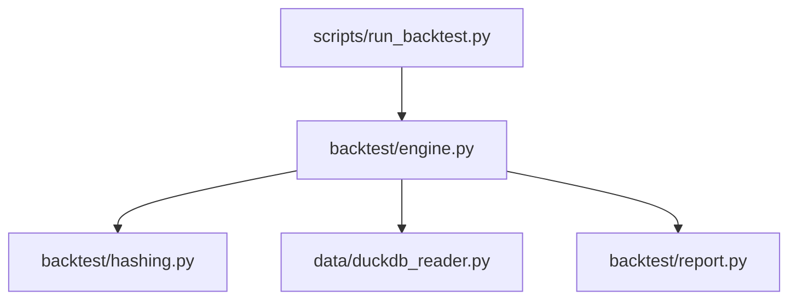
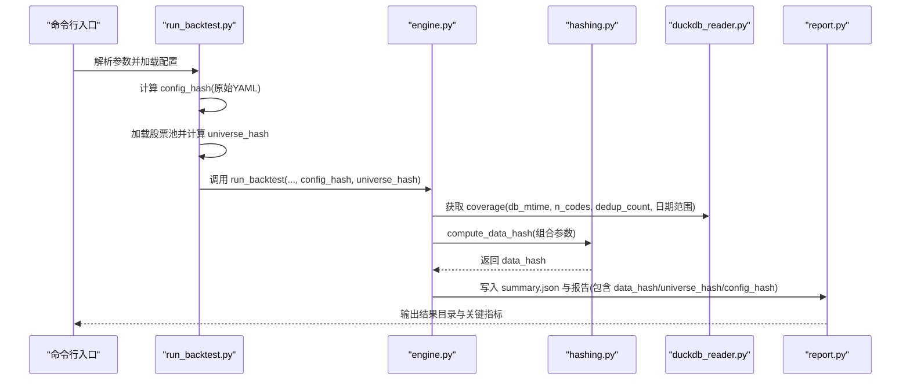
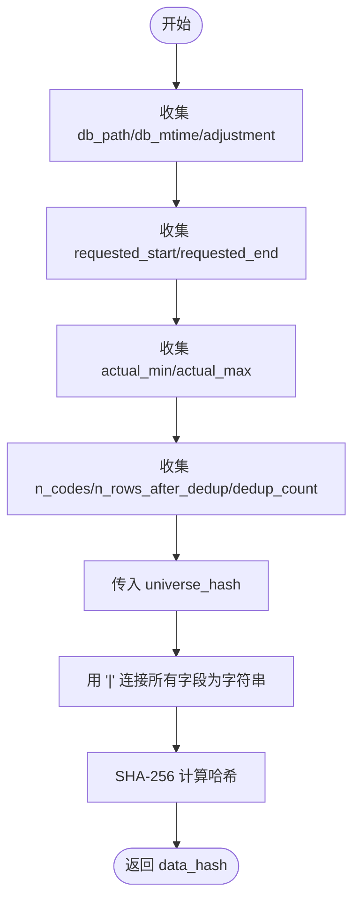
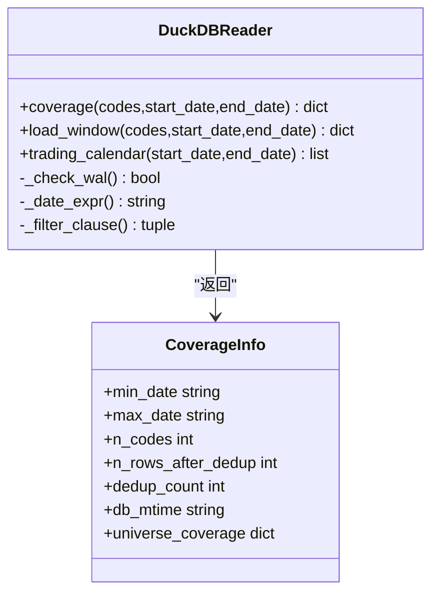
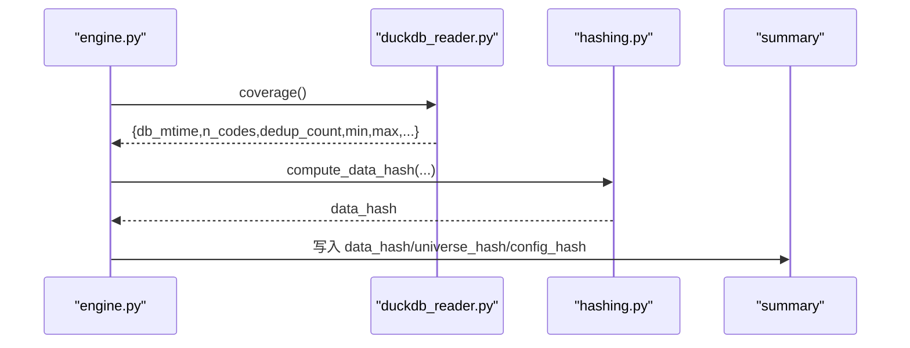
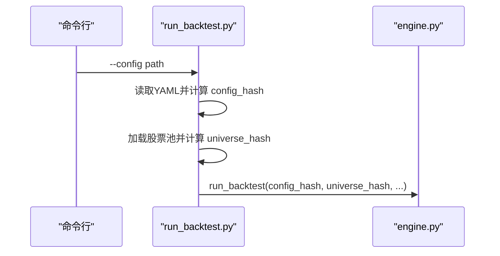
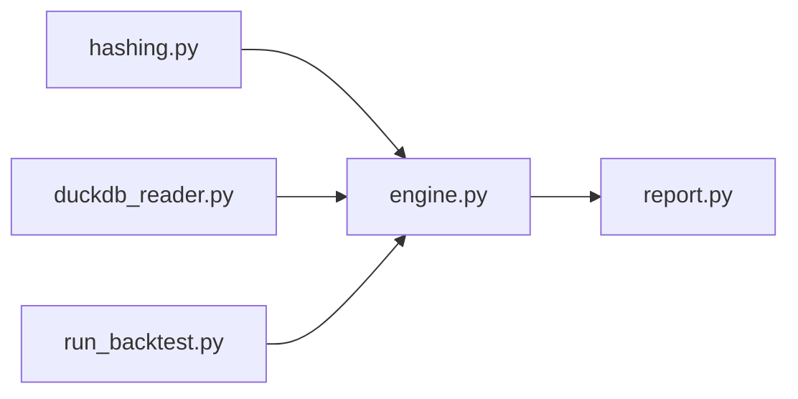

# 数据哈希系统

<cite>
**本文引用的文件**
- [backtest/hashing.py](file://backtest/hashing.py)
- [backtest/engine.py](file://backtest/engine.py)
- [data/duckdb_reader.py](file://data/duckdb_reader.py)
- [scripts/run_backtest.py](file://scripts/run_backtest.py)
- [backtest/report.py](file://backtest/report.py)
</cite>

## 目录
1. [简介](#简介)
2. [项目结构](#项目结构)
3. [核心组件](#核心组件)
4. [架构总览](#架构总览)
5. [详细组件分析](#详细组件分析)
6. [依赖关系分析](#依赖关系分析)
7. [性能考虑](#性能考虑)
8. [故障排查指南](#故障排查指南)
9. [结论](#结论)
10. [附录](#附录)

## 简介
本文件面向 QuantLab 的数据哈希系统，重点解释 compute_data_hash() 的实现原理与使用方式。该机制通过组合数据库路径、修改时间、复权方式、日期范围、去重统计、股票池指纹等关键要素，生成稳定的数据指纹（data_hash），用于：
- 数据版本追踪：同一份数据在不同时间或不同处理流程下产生稳定且可追溯的标识
- 回测结果可重复性保证：当 data_hash 与 config_hash、universe_hash 一致时，可认为回测输入未发生实质性变化
- 数据变更检测：在数据管道或增量更新后，通过 data_hash 的变化判断是否需要重新计算因子或重跑回测

此外，系统还提供 universe_hash（股票池指纹）和 config_hash（配置文本指纹），三者共同构成“输入指纹”体系，支撑缓存、增量更新与并行优化。

## 项目结构
与数据哈希相关的核心代码分布在以下模块：
- backtest/hashing.py：哈希算法实现（data_hash、universe_hash、config_hash）
- backtest/engine.py：回测引擎中组装并写入 summary 的 data_hash、universe_hash、config_hash
- data/duckdb_reader.py：读取 DuckDB 数据源，提供 db_mtime、去重统计、覆盖范围等元信息
- scripts/run_backtest.py：入口脚本，加载配置与股票池，计算 config_hash 与 universe_hash，并传入引擎
- backtest/report.py：报告生成，将 data_hash、universe_hash、config_hash 输出到报告与摘要

图表来源
- [scripts/run_backtest.py:26-110](file://scripts/run_backtest.py#L26-L110)
- [backtest/engine.py:524-556](file://backtest/engine.py#L524-L556)
- [backtest/hashing.py:10-20](file://backtest/hashing.py#L10-L20)
- [data/duckdb_reader.py:146-205](file://data/duckdb_reader.py#L146-L205)
- [backtest/report.py:160-166](file://backtest/report.py#L160-L166)

章节来源
- [scripts/run_backtest.py:26-110](file://scripts/run_backtest.py#L26-L110)
- [backtest/engine.py:524-556](file://backtest/engine.py#L524-L556)
- [backtest/hashing.py:10-20](file://backtest/hashing.py#L10-L20)
- [data/duckdb_reader.py:146-205](file://data/duckdb_reader.py#L146-L205)
- [backtest/report.py:160-166](file://backtest/report.py#L160-L166)

## 核心组件
- compute_universe_hash(codes)：对股票池进行排序后拼接为字符串，再 SHA-256 得到唯一指纹，确保顺序无关性与稳定性
- compute_data_hash(...)：组合以下参数为字符串序列，再用 "|" 连接后进行 SHA-256：
  - 数据库路径 db_path
  - 数据库修改时间 db_mtime
  - 复权方式 adjustment
  - 请求日期范围 requested_start、requested_end
  - 实际可用日期范围 actual_min、actual_max
  - 去重统计 n_codes、n_rows_after_dedup、dedup_count
  - 股票池指纹 universe_hash
- compute_config_hash(yaml_text)：对原始 YAML 文本直接做 SHA-256，用于配置变更检测

这些函数均为纯函数，无副作用，便于单元测试与跨进程复用。

章节来源
- [backtest/hashing.py:7-20](file://backtest/hashing.py#L7-L20)

## 架构总览
下图展示了从入口脚本到回测引擎再到数据源的完整调用链，以及哈希值如何被计算、传递与落盘。

图表来源
- [scripts/run_backtest.py:26-110](file://scripts/run_backtest.py#L26-L110)
- [backtest/engine.py:524-556](file://backtest/engine.py#L524-L556)
- [data/duckdb_reader.py:146-205](file://data/duckdb_reader.py#L146-L205)
- [backtest/report.py:160-166](file://backtest/report.py#L160-L166)

## 详细组件分析

### 哈希计算要素与算法
compute_data_hash() 将多个维度组合成单一指纹，确保任何输入变化都会导致哈希变化：
- 数据库路径 db_path：区分不同数据仓库或本地路径
- 数据库修改时间 db_mtime：反映数据是否被更新（如增量同步）
- 复权方式 adjustment：raw/qfq/hfq 影响价格序列
- 请求日期范围 requested_start/requested_end：回测窗口
- 实际可用日期范围 actual_min/actual_max：数据覆盖范围
- 去重统计 n_codes/n_rows_after_dedup/dedup_count：数据质量与完整性
- 股票池指纹 universe_hash：策略标的集合的唯一标识

图表来源
- [backtest/hashing.py:10-20](file://backtest/hashing.py#L10-L20)

章节来源
- [backtest/hashing.py:10-20](file://backtest/hashing.py#L10-L20)

### 数据源元信息与覆盖范围
duckdb_reader.py 负责从 DuckDB 数据源提取覆盖范围与去重统计，供 compute_data_hash() 使用：
- 通过 SQL 查询 dat_day 表，按 code+date 去重，统计最小/最大日期、去重后行数、去重数量
- 记录 db_mtime（数据库文件的修改时间）
- 可选地统计 universe_coverage（股票池中有多少只具备数据）

图表来源
- [data/duckdb_reader.py:146-205](file://data/duckdb_reader.py#L146-L205)

章节来源
- [data/duckdb_reader.py:146-205](file://data/duckdb_reader.py#L146-L205)

### 回测引擎中的哈希集成
engine.py 在回测结束时汇总 summary，并将 data_hash、universe_hash、config_hash 写入：
- 从 reader.coverage() 获取 db_mtime、n_codes、去重统计、日期范围
- 调用 compute_data_hash() 生成 data_hash
- 将 data_hash、universe_hash、config_hash 放入 summary，供报告与持久化使用

图表来源
- [backtest/engine.py:524-556](file://backtest/engine.py#L524-L556)
- [data/duckdb_reader.py:146-205](file://data/duckdb_reader.py#L146-L205)

章节来源
- [backtest/engine.py:524-556](file://backtest/engine.py#L524-L556)

### 入口脚本与配置/股票池指纹
scripts/run_backtest.py 负责：
- 读取 YAML 配置并计算 config_hash
- 加载股票池 CSV 并计算 universe_hash
- 将两者作为参数传递给 engine.run_backtest()

图表来源
- [scripts/run_backtest.py:26-110](file://scripts/run_backtest.py#L26-L110)

章节来源
- [scripts/run_backtest.py:26-110](file://scripts/run_backtest.py#L26-L110)

### 报告输出与哈希可见性
backtest/report.py 将 data_hash、universe_hash、config_hash 输出到 Markdown 报告与 JSON 摘要，便于审计与复现：
- 在报告中以表格形式展示三个哈希值
- 在 summary.json 中持久化保存，支持后续比对与自动化校验

章节来源
- [backtest/report.py:160-166](file://backtest/report.py#L160-L166)

## 依赖关系分析
- hashing.py 是纯函数库，不依赖其他模块
- engine.py 依赖 hashing.py 与 duckdb_reader.py
- run_backtest.py 依赖 hashing.py 与 engine.py
- report.py 依赖 engine.py 输出的 summary

图表来源
- [backtest/hashing.py:10-20](file://backtest/hashing.py#L10-L20)
- [backtest/engine.py:524-556](file://backtest/engine.py#L524-L556)
- [data/duckdb_reader.py:146-205](file://data/duckdb_reader.py#L146-L205)
- [scripts/run_backtest.py:26-110](file://scripts/run_backtest.py#L26-L110)
- [backtest/report.py:160-166](file://backtest/report.py#L160-L166)

章节来源
- [backtest/hashing.py:10-20](file://backtest/hashing.py#L10-L20)
- [backtest/engine.py:524-556](file://backtest/engine.py#L524-L556)
- [data/duckdb_reader.py:146-205](file://data/duckdb_reader.py#L146-L205)
- [scripts/run_backtest.py:26-110](file://scripts/run_backtest.py#L26-L110)
- [backtest/report.py:160-166](file://backtest/report.py#L160-L166)

## 性能考虑
- 哈希计算复杂度：compute_data_hash() 仅对固定数量的字符串进行拼接与一次 SHA-256，时间复杂度 O(n)，空间复杂度 O(n)，开销极低
- 避免重复计算：建议在数据管道层缓存 data_hash，仅在数据文件 mtime 或内容变化时重新计算
- 增量更新：当 db_mtime 或去重统计发生变化时，触发增量因子计算；若 data_hash 不变，可直接复用历史结果
- 并行优化：在多进程/分布式环境中，可将 data_hash 作为任务键，避免重复计算相同输入的任务

[本节为通用指导，无需引用具体文件]

## 故障排查指南
- WAL 并发写入警告：duckdb_reader.py 检测到 .wal 文件时会发出警告，提示 data_hash 在同步完成前不稳定，建议等待同步结束后重跑确认
- 数据覆盖不足：coverage() 会检查请求日期范围是否在数据覆盖范围内，超出范围将抛出异常
- 缺失股票：universe_coverage 会统计缺失的股票列表，便于定位数据缺口

章节来源
- [data/duckdb_reader.py:60-75](file://data/duckdb_reader.py#L60-L75)
- [data/duckdb_reader.py:90-98](file://data/duckdb_reader.py#L90-L98)
- [data/duckdb_reader.py:186-205](file://data/duckdb_reader.py#L186-L205)

## 结论
QuantLab 的数据哈希系统通过 compute_data_hash()、compute_universe_hash() 与 compute_config_hash() 构建了完整的输入指纹体系，结合数据源元信息与回测引擎，实现了数据版本追踪、结果可重复性与变更检测。其设计简洁、扩展性强，适合在数据管道、因子计算与回测系统中广泛使用。

[本节为总结，无需引用具体文件]

## 附录

### 配置示例与使用场景
- 数据管道集成：在数据更新完成后，读取 db_mtime 与去重统计，计算 data_hash，并与上次运行对比，决定是否触发因子重算
- 自动化测试：在 CI/CD 中比较 summary.json 中的 data_hash/universe_hash/config_hash，确保输入一致性
- 回测结果缓存：以 (config_hash, universe_hash, data_hash) 为键缓存回测结果，避免重复计算

章节来源
- [scripts/run_backtest.py:26-110](file://scripts/run_backtest.py#L26-L110)
- [backtest/engine.py:524-556](file://backtest/engine.py#L524-L556)
- [backtest/report.py:160-166](file://backtest/report.py#L160-L166)