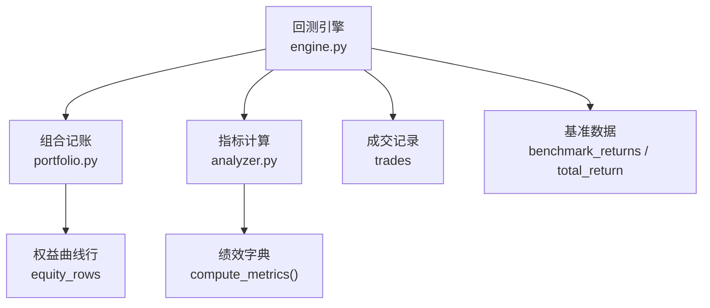
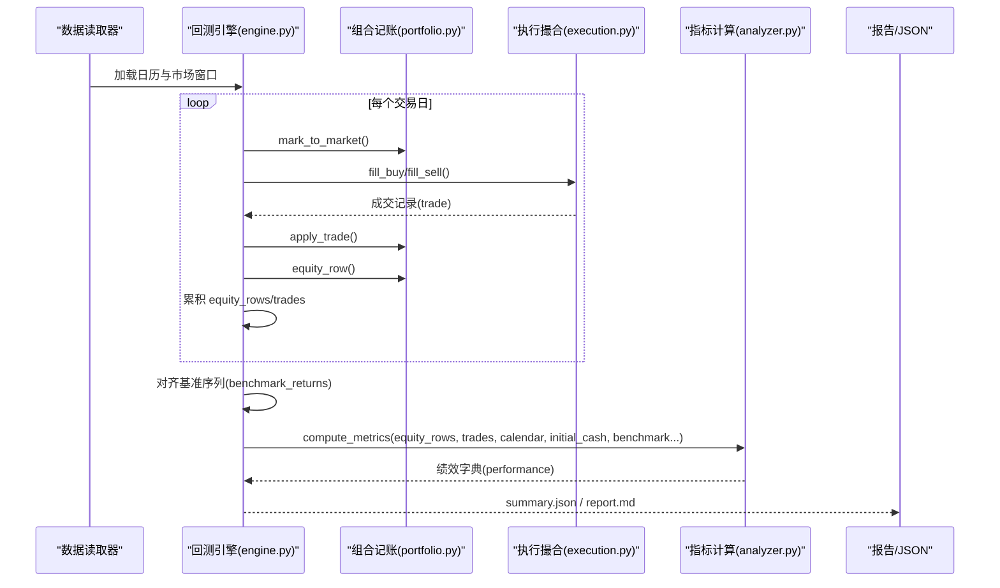
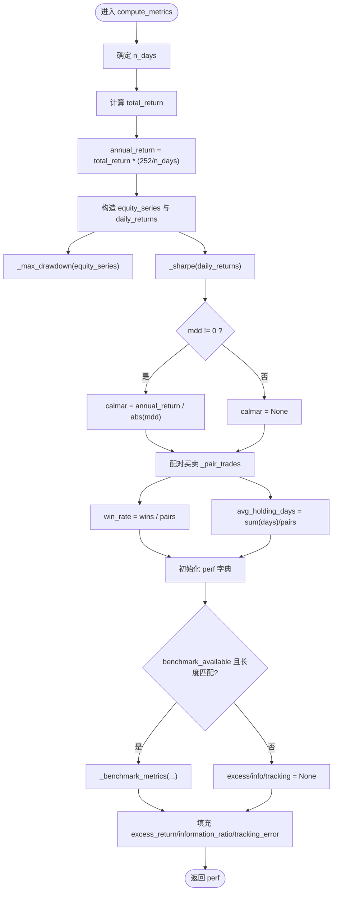
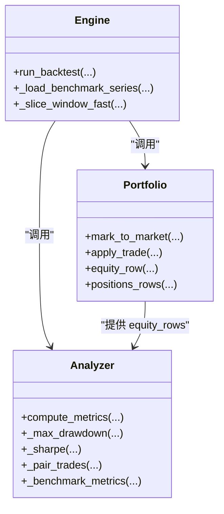

# 绩效分析引擎

<cite>
**本文引用的文件**   
- [analyzer.py](file://backtest/analyzer.py)
- [engine.py](file://backtest/engine.py)
- [portfolio.py](file://backtest/portfolio.py)
- [report.md](file://reports/20260803_204830_513b7f_atr_lowvol_fw/report.md)
- [summary.json](file://reports/20260803_204830_513b7f_atr_lowvol_fw/summary.json)
- [backtest.py](file://projects/Project_01_多因子IC小盘Alpha/research/multi_factor_ic/backtest.py)
- [audit16_归因.py](file://research_audit/audit16_归因.py)
</cite>

## 目录
1. [引言](#引言)
2. [项目结构](#项目结构)
3. [核心组件](#核心组件)
4. [架构总览](#架构总览)
5. [详细组件分析](#详细组件分析)
6. [依赖关系分析](#依赖关系分析)
7. [性能与数值特性](#性能与数值特性)
8. [故障排查指南](#故障排查指南)
9. [结论](#结论)
10. [附录：输出格式与可视化建议](#附录输出格式与可视化建议)

## 引言
本文件面向 QuantLab 绩效分析引擎，围绕 compute_metrics() 的实现原理展开，系统阐述收益计算、风险度量、基准对比与交易统计分析等核心能力。文档同时给出月度收益矩阵、行业归因、因子暴露等高级分析的落地思路与可视化建议，帮助读者快速理解并扩展该引擎的绩效分析能力。

## 项目结构
QuantLab 的回测与绩效分析由“引擎 + 组合记账 + 指标计算”三部分构成：
- 回测引擎负责每日循环、执行撮合、组合净值更新与基准对齐，最终调用 compute_metrics() 生成绩效字典。
- 组合记账模块维护现金、持仓、市值与日收益率序列，为指标计算提供 equity_rows。
- 指标计算模块（analyzer）基于 equity_rows 与 trades 列表，计算收益、风险、基准对比与交易统计等指标。

图表来源
- [engine.py:237-522](file://backtest/engine.py#L237-L522)
- [portfolio.py:155-172](file://backtest/portfolio.py#L155-L172)
- [analyzer.py:96-175](file://backtest/analyzer.py#L96-L175)

章节来源
- [engine.py:237-522](file://backtest/engine.py#L237-L522)
- [portfolio.py:155-172](file://backtest/portfolio.py#L155-L172)
- [analyzer.py:96-175](file://backtest/analyzer.py#L96-L175)

## 核心组件
- 回测引擎（engine.py）
  - 负责加载市场数据、构建交易日日历、加载基准序列、驱动策略决策与执行撮合、累计 equity_rows 与 trades，并在末尾调用 compute_metrics() 生成绩效字典。
- 组合记账（portfolio.py）
  - 维护 cash、positions、market_value、total_asset，按日标记到市价，计算 daily_return，输出 equity_row 与 positions_rows。
- 指标计算（analyzer.py）
  - 实现 compute_metrics()，包括总收益、年化收益、最大回撤、夏普比率、卡玛比率、胜率、平均持有天数、超额收益、信息比率、跟踪误差等。

章节来源
- [engine.py:237-522](file://backtest/engine.py#L237-L522)
- [portfolio.py:155-172](file://backtest/portfolio.py#L155-L172)
- [analyzer.py:96-175](file://backtest/analyzer.py#L96-L175)

## 架构总览
下图展示从数据输入到绩效输出的关键流程，以及基准数据的对齐方式。

图表来源
- [engine.py:237-522](file://backtest/engine.py#L237-L522)
- [portfolio.py:155-172](file://backtest/portfolio.py#L155-L172)
- [analyzer.py:96-175](file://backtest/analyzer.py#L96-L175)

## 详细组件分析

### compute_metrics() 函数详解
compute_metrics() 是绩效分析的核心入口，输入为 equity_rows、trades、trading_calendar、initial_cash 以及可选的基准数据。其内部逻辑如下：

- 收益计算
  - 总收益率：根据初始资金与期末总资产计算。
  - 年化收益率：使用 252 个交易日作为年化的基础，对短样本进行安全缩放。
  - 日收益率序列：从 equity_rows 提取 daily_return（跳过首日）。
  - 累计收益曲线：由 equity_rows 中的 total_asset 序列构成。

- 风险度量
  - 最大回撤：遍历权益序列，维护峰值并计算相对回撤的最小值。
  - 夏普比率：以无风险利率为 0，使用日收益率均值与标准差乘以 sqrt(252)。
  - 卡玛比率：年化收益除以最大回撤绝对值（若最大回撤为 0 则返回 None）。

- 交易统计分析
  - 配对买卖：按代码顺序将买入与卖出配对，用于胜率与平均持有天数的计算。
  - 胜率：配对后盈利次数除以配对总数。
  - 平均持有天数：配对中买入与卖出之间的交易日差之和的平均值。
  - 交易次数：统计买入与卖出的数量。

- 基准对比分析
  - 超额收益：策略总收益减去基准总收益。
  - 信息比率：超额日收益序列的均值与标准差之比，再乘以 sqrt(252)。
  - 跟踪误差：超额日收益序列的标准差乘以 sqrt(252)。
  - 当基准不可用或长度不匹配时，相关字段返回 None。

图表来源
- [analyzer.py:96-175](file://backtest/analyzer.py#L96-L175)

章节来源
- [analyzer.py:11-93](file://backtest/analyzer.py#L11-L93)
- [analyzer.py:96-175](file://backtest/analyzer.py#L96-L175)

### 收益指标计算
- 总收益率：基于期初与期末总资产计算，确保初始资金大于 0。
- 年化收益率：采用线性缩放因子 252/n_days，适用于短样本稳健性。
- 日收益率序列：来自 portfolio.equity_row 的 daily_return，跳过首日。
- 累计收益曲线：由 equity_rows 的 total_asset 序列直接得到。

章节来源
- [analyzer.py:111-124](file://backtest/analyzer.py#L111-L124)
- [portfolio.py:155-172](file://backtest/portfolio.py#L155-L172)

### 风险指标分析
- 波动率：通过 _sharpe 内部使用日收益率的标准差估计；未显式输出波动率字段，但可用于推导。
- 最大回撤：_max_drawdown 遍历权益序列，维护峰值并计算最小回撤。
- 夏普比率：mean(daily)/std(daily)*sqrt(252)，无风险利率设为 0。
- 索提诺比率：当前实现未包含下行波动率与负收益部分，如需可参考项目内其他脚本自行扩展。
- 信息比率：基于超额日收益序列的均值与标准差，乘以 sqrt(252)。
- 跟踪误差：超额日收益序列的标准差乘以 sqrt(252)。

章节来源
- [analyzer.py:18-43](file://backtest/analyzer.py#L18-L43)
- [analyzer.py:78-93](file://backtest/analyzer.py#L78-L93)

### 基准对比分析
- 超额收益：策略总收益减去基准总收益。
- 信息比率：超额日收益序列的均值与标准差之比，乘以 sqrt(252)。
- 跟踪误差：超额日收益序列的标准差乘以 sqrt(252)。
- Beta 系数与 Alpha 值：当前实现未直接计算，可在 engine 层对齐基准序列后扩展回归模型计算。

章节来源
- [analyzer.py:78-93](file://backtest/analyzer.py#L78-L93)
- [engine.py:446-488](file://backtest/engine.py#L446-L488)

### 交易统计分析
- 换手率：可通过 trades 的 amount 与 portfolio 的资产变化估算；当前 compute_metrics 未直接输出换手率，但提供了 n_buy/n_sell 与 avg_holding_days。
- 交易频率：n_trades 统计总成交笔数。
- 单笔收益分布：需结合 trades 明细与配对结果进一步分析；当前仅输出 win_rate 与 avg_holding_days。
- 胜率统计：配对后盈利次数占比。

章节来源
- [analyzer.py:132-149](file://backtest/analyzer.py#L132-L149)

### 高级分析功能
- 月度收益矩阵：可在 engine 层按自然月重采样 equity_rows 的 daily_return，计算月度累计收益，形成矩阵。
- 行业归因：参考 research_audit/audit16_归因.py 的思路，按行业映射分组，计算各行业的贡献与中性化效果。
- 因子暴露分析：参考 multi_factor_ic/backtest.py 的因子评分与权重设计，结合历史截面数据计算因子暴露与 IC/ICIR。

章节来源
- [audit16_归因.py:230-305](file://research_audit/audit16_归因.py#L230-L305)
- [backtest.py:200-399](file://projects/Project_01_多因子IC小盘Alpha/research/multi_factor_ic/backtest.py#L200-L399)

## 依赖关系分析
- engine.py 依赖 portfolio.py 与 analyzer.py，并通过 execution.py 完成成交撮合。
- analyzer.py 为纯函数模块，无外部依赖，仅使用 math 库。
- portfolio.py 为纯数据结构与辅助函数，无 IO 操作。

图表来源
- [engine.py:237-522](file://backtest/engine.py#L237-L522)
- [portfolio.py:155-172](file://backtest/portfolio.py#L155-L172)
- [analyzer.py:96-175](file://backtest/analyzer.py#L96-L175)

章节来源
- [engine.py:237-522](file://backtest/engine.py#L237-L522)
- [portfolio.py:155-172](file://backtest/portfolio.py#L155-L172)
- [analyzer.py:96-175](file://backtest/analyzer.py#L96-L175)

## 性能与数值特性
- 年化因子：使用 252/n_days 的线性缩放，避免短样本年化虚高。
- 夏普比率：基于日收益率的均值与标准差，无风险利率为 0。
- 最大回撤：O(n) 单次遍历，内存占用低。
- 基准对齐：engine 层在 equity_rows 后追加基准 close 与 return，保证长度一致。
- 数值稳定性：当基准存在断点或起点价格为 0 时，禁用 IR/excess/tracking。

章节来源
- [analyzer.py:11-15](file://backtest/analyzer.py#L11-L15)
- [analyzer.py:18-43](file://backtest/analyzer.py#L18-L43)
- [engine.py:446-488](file://backtest/engine.py#L446-L488)

## 故障排查指南
- 基准不可用：检查 benchmark_db_path 是否存在、benchmark_code 是否有效、数据窗口是否覆盖。
- 基准断点：当基准序列存在缺失或起点价格为 0 时，engine 会禁用 IR/excess/tracking，需在日志中确认。
- 样本期过短：当 n_days < 252 或基准不可用时，sample_period_warning 会提示短样本限制。
- 成交失败：unfilled_order_count 统计未成交订单，常见原因为低于最小手数限制。

章节来源
- [engine.py:446-488](file://backtest/engine.py#L446-L488)
- [engine.py:513-522](file://backtest/engine.py#L513-L522)
- [report.md:100-113](file://reports/20260803_204830_513b7f_atr_lowvol_fw/report.md#L100-L113)

## 结论
QuantLab 的绩效分析引擎以 compute_metrics() 为核心，实现了稳健的收益、风险与基准对比指标计算，并提供交易统计与诊断信息。通过 engine 层的基准对齐与 portfolio 的日度记账，形成了完整的回测闭环。对于更高级的分析（如索提诺比率、Beta/Alpha、月度矩阵、行业归因与因子暴露），可在现有基础上扩展实现，以满足研究与生产需求。

## 附录：输出格式与可视化建议
- 输出格式
  - summary.json：包含 run_id、performance、portfolio_end、diagnostics_aggregate 等结构化字段。
  - report.md：人类可读的回测报告，包含业绩指标、持仓概览与关键日志摘录。
- 可视化建议
  - 累计收益曲线：使用 equity_rows 的 total_asset 序列绘制。
  - 回撤曲线：基于 cummax 与 drawdown 序列绘制。
  - 月度收益矩阵：按自然月重采样 daily_return，计算月度累计收益，使用热力图展示。
  - 行业归因：按行业分组，计算各行业的收益贡献与中性化前后对比。
  - 因子暴露：结合因子评分与截面数据，绘制因子暴露随时间变化的轨迹。

章节来源
- [summary.json:188-202](file://reports/20260803_204830_513b7f_atr_lowvol_fw/summary.json#L188-L202)
- [report.md:15-26](file://reports/20260803_204830_513b7f_atr_lowvol_fw/report.md#L15-L26)