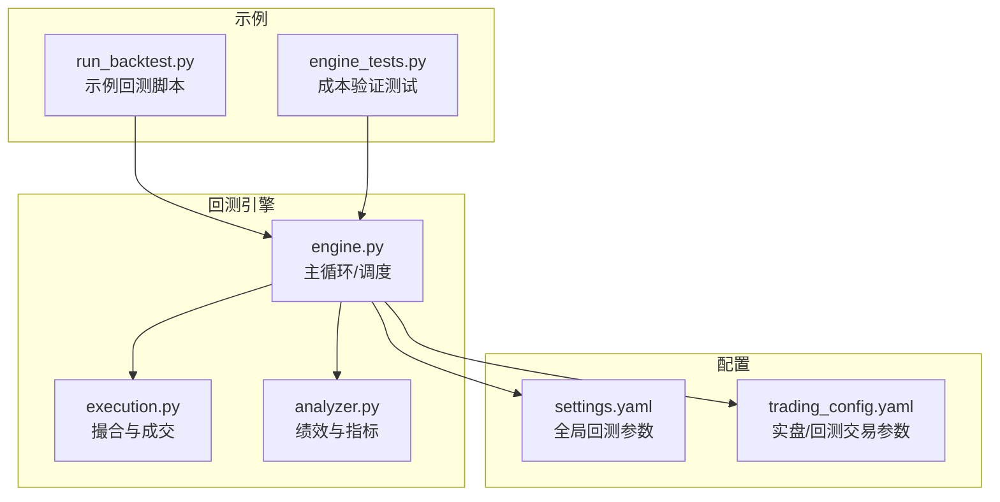
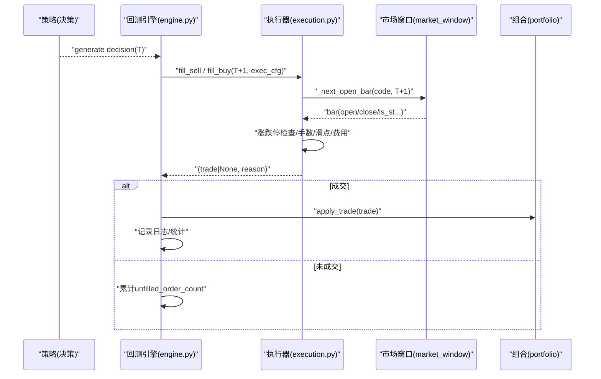
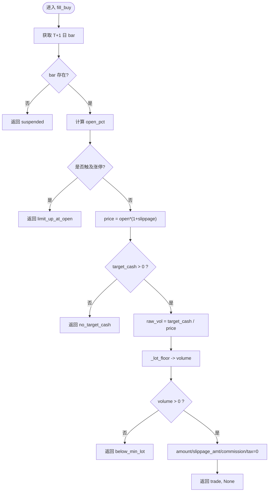
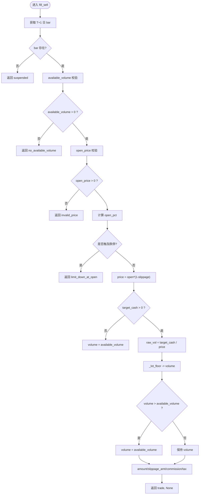
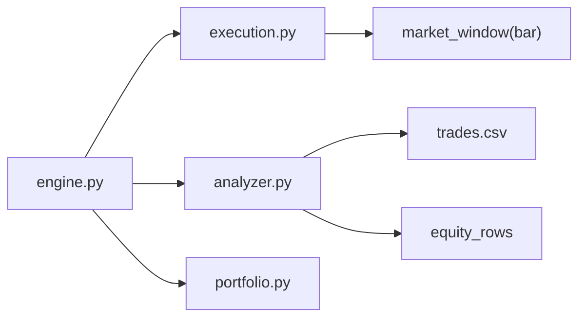

# 订单执行模拟器

<cite>
**本文引用的文件**   
- [execution.py](file://backtest/execution.py)
- [engine.py](file://backtest/engine.py)
- [analyzer.py](file://backtest/analyzer.py)
- [settings.yaml](file://config/settings.yaml)
- [trading_config.yaml](file://config/trading_config.yaml)
- [run_backtest.py](file://projects/Project_02_双均线趋势策略/run_backtest.py)
- [engine_tests.py](file://projects/verification/engine_tests.py)
</cite>

## 目录
1. [简介](#简介)
2. [项目结构](#项目结构)
3. [核心组件](#核心组件)
4. [架构总览](#架构总览)
5. [详细组件分析](#详细组件分析)
6. [依赖关系分析](#依赖关系分析)
7. [性能与执行质量评估](#性能与执行质量评估)
8. [故障排查指南](#故障排查指南)
9. [结论](#结论)
10. [附录：配置参数与使用示例](#附录配置参数与使用示例)

## 简介
本文件面向 QuantLab 的订单执行模拟器，聚焦于 fill_buy() 与 fill_sell() 的实现原理与 A 股特殊规则模拟（涨跌停限制、T+1 交易制度、印花税、佣金费率等），并系统阐述订单成交逻辑（价格滑点、成交量限制、资金约束）、订单状态管理（未成交原因记录、部分成交处理）以及执行质量评估指标（成交率、滑点分析、成本估算）。文档同时提供配置参数说明与不同交易场景下的调优建议。

## 项目结构
QuantLab 的回测执行层位于 backtest 包中，核心由 engine.py（回测主循环）、execution.py（撮合与成交逻辑）、analyzer.py（绩效与执行质量指标计算）组成；配置集中在 config 目录下，示例脚本在 projects 子项目中。

图表来源
- [engine.py:237-619](file://backtest/engine.py#L237-L619)
- [execution.py:95-203](file://backtest/execution.py#L95-L203)
- [analyzer.py:96-176](file://backtest/analyzer.py#L96-L176)
- [settings.yaml:22-28](file://config/settings.yaml#L22-L28)
- [trading_config.yaml:10-16](file://config/trading_config.yaml#L10-L16)
- [run_backtest.py:60-110](file://projects/Project_02_双均线趋势策略/run_backtest.py#L60-L110)
- [engine_tests.py:49-92](file://projects/verification/engine_tests.py#L49-L92)

章节来源
- [engine.py:237-619](file://backtest/engine.py#L237-L619)
- [execution.py:1-204](file://backtest/execution.py#L1-L204)
- [analyzer.py:1-176](file://backtest/analyzer.py#L1-L176)
- [settings.yaml:1-69](file://config/settings.yaml#L1-L69)
- [trading_config.yaml:1-62](file://config/trading_config.yaml#L1-L62)

## 核心组件
- 执行器 execution.py：实现 next_open 模型下的买入/卖出撮合，包含涨跌停检查、A 股手数限制、滑点与费用计算。
- 引擎 engine.py：每日驱动策略生成决策，调用 execution.fill_* 进行撮合，维护持仓与日志，汇总未成交原因。
- 分析器 analyzer.py：基于 trades 与净值序列计算收益、回撤、夏普、胜率、持有期等指标，并在有基准时计算超额与跟踪误差。

章节来源
- [execution.py:27-52](file://backtest/execution.py#L27-L52)
- [execution.py:95-203](file://backtest/execution.py#L95-L203)
- [engine.py:324-371](file://backtest/engine.py#L324-L371)
- [analyzer.py:96-176](file://backtest/analyzer.py#L96-L176)

## 架构总览
next_open 模型下，策略在 T 日收盘后发出买卖信号，执行器在 T+1 日开盘价附近按滑点修正后撮合。若 T+1 无数据（停牌）或开盘涨跌停，则拒绝/挂起订单并记录原因。

图表来源
- [engine.py:324-371](file://backtest/engine.py#L324-L371)
- [execution.py:55-92](file://backtest/execution.py#L55-L92)
- [execution.py:95-203](file://backtest/execution.py#L95-L203)

## 详细组件分析

### 买入撮合 fill_buy()
- 输入：候选项 candidate（含 code、target_cash 等）、market_window、fill_date、exec_cfg、run_id。
- 关键步骤：
  - 获取 T+1 日 bar，缺失则返回“suspended”。
  - 计算开盘相对前收涨跌幅 open_pct，结合板块涨跌停幅度 limit（主板 10%、双创 20%、北交 30%、ST 5%），若达到涨停阈值则拒绝“limit_up_at_open”。
  - 读取滑点 slippage 与佣金 commission_rate，成交价 price = round(open * (1 + slippage), 6)。
  - 将 target_cash 转换为手数：raw_vol = target_cash / price，再按 100 手向下取整 _lot_floor。
  - 若 volume <= 0 返回“below_min_lot”；否则计算 amount、slippage_amt、commission，tax=0。
  - 返回 trade 字典与 None 原因。

图表来源
- [execution.py:155-203](file://backtest/execution.py#L155-L203)
- [execution.py:27-52](file://backtest/execution.py#L27-L52)

章节来源
- [execution.py:155-203](file://backtest/execution.py#L155-L203)

### 卖出撮合 fill_sell()
- 输入：决策 decision（含 code、reason、可选 target_cash）、position（available_volume 等）、market_window、fill_date、exec_cfg、run_id。
- 关键步骤：
  - 获取 T+1 日 bar，缺失则返回“suspended”。
  - 校验可用仓位 available_volume，<=0 则返回“no_available_volume”。
  - 读取 open_price，<=0 则返回“invalid_price”。
  - 计算 open_pct 与 limit，若达到跌停阈值则拒绝“limit_down_at_open”。
  - 读取滑点与佣金/税率，成交价 price = round(open * (1 - slippage), 6)。
  - 若 decision.target_cash > 0，则 raw_vol = target_cash / price，再按 100 手向下取整；若 volume > available_volume 则截断为 available_volume。
  - 计算 amount、slippage_amt、commission、tax（卖出收取印花税）。
  - 返回 trade 字典与 None 原因。

图表来源
- [execution.py:95-152](file://backtest/execution.py#L95-L152)
- [execution.py:27-52](file://backtest/execution.py#L27-L52)

章节来源
- [execution.py:95-152](file://backtest/execution.py#L95-L152)

### A 股特殊规则实现
- 涨跌停限制：根据代码前缀与 is_st 字段确定 limit（主板 10%、双创 20%、北交 30%、ST 5%），在开盘阶段比较 open_pct 与阈值，防止涨停买入与跌停卖出。
- T+1 交易制度：通过 engine 的 pending 机制与 position.holding_days 推进，确保当日买入不可当日卖出；sell 仅对 available_volume 生效。
- 印花税：仅在卖出时按 tax_rate 计算（默认千分之一）。
- 佣金费率：买卖均按 commission_rate 计算（默认万2.5）。
- 手数限制：A 股以 100 股为最小单位，所有成交量经 _lot_floor 向下取整。

章节来源
- [execution.py:27-52](file://backtest/execution.py#L27-L52)
- [execution.py:95-203](file://backtest/execution.py#L95-L203)
- [engine.py:324-371](file://backtest/engine.py#L324-L371)

### 订单成交逻辑细节
- 价格滑点：买入价 = open*(1+slippage)，卖出价 = open*(1-slippage)；滑点金额按 open*slippage*volume 计算。
- 成交量限制：买入按 target_cash 换算后向下取整至 100 倍数；卖出支持 target_cash 指定减仓额，不足一手则失败；最大不超过可用仓位。
- 资金约束：买入需 target_cash > 0；引擎侧在 apply_trade 时扣减现金与更新持仓（见 engine 调用处）。
- 未成交原因：suspended、limit_up_at_open、limit_down_at_open、no_target_cash、below_min_lot、no_available_volume、invalid_price 等。

章节来源
- [execution.py:95-203](file://backtest/execution.py#L95-L203)
- [engine.py:324-371](file://backtest/engine.py#L324-L371)

### 订单状态管理与日志
- 引擎维护 pending 队列，次日优先处理前一日的 sell_decisions 与 buy_candidates。
- 每笔未成交订单计数 unfilled_order_count，并在日志中记录 reason。
- 交易日志包含成交明细与错误原因，便于复盘与诊断。

章节来源
- [engine.py:324-371](file://backtest/engine.py#L324-L371)

## 依赖关系分析
- engine.py 导入 execution.fill_buy/fill_sell 与 portfolio、analyzer 模块，负责每日调度与结果聚合。
- execution.py 依赖 market_window 数据结构（含 date/open/close/is_st 等列）与 exec_cfg（slippage、commission_rate、tax_rate）。
- analyzer.py 依赖 trades 列表与 equity_rows，计算综合绩效与基准对比指标。

图表来源
- [engine.py:237-619](file://backtest/engine.py#L237-L619)
- [execution.py:1-204](file://backtest/execution.py#L1-L204)
- [analyzer.py:1-176](file://backtest/analyzer.py#L1-L176)

章节来源
- [engine.py:237-619](file://backtest/engine.py#L237-L619)
- [execution.py:1-204](file://backtest/execution.py#L1-L204)
- [analyzer.py:1-176](file://backtest/analyzer.py#L1-L176)

## 性能与执行质量评估
- 成交率：可通过 daily_candidate_passed/candidate_total 与 unfilled_order_count 统计；引擎汇总 diagnostics_aggregate.unfilled_order_count。
- 滑点分析：trades 中包含 slippage_amt，可汇总平均滑点金额与占成交额比例。
- 成本估算：trades 包含 commission 与 tax（卖出），可计算单笔与累计交易成本及成本率。
- 胜率与持有期：analyzer._pair_trades 配对买卖，计算 win_rate 与 avg_holding_days。
- 基准对比：当 benchmark_available 为真时，计算 excess_return、information_ratio、tracking_error。

章节来源
- [engine.py:490-501](file://backtest/engine.py#L490-L501)
- [analyzer.py:96-176](file://backtest/analyzer.py#L96-L176)

## 故障排查指南
- 常见未成交原因定位：
  - suspended：T+1 无 bar（停牌或数据缺失）。
  - limit_up_at_open / limit_down_at_open：开盘涨跌停导致拒绝。
  - no_target_cash：买入候选缺少有效 target_cash。
  - below_min_lot：换算后不足 100 股。
  - no_available_volume：无可用持仓。
  - invalid_price：open_price <= 0。
- 日志查看：engine 每日日志包含 “[ERROR] ... reason=...” 行，便于快速定位。
- 成本验证：参考 verification 测试用例中的全成本计算逻辑，核对佣金、印花税与滑点。

章节来源
- [engine.py:324-371](file://backtest/engine.py#L324-L371)
- [engine_tests.py:49-92](file://projects/verification/engine_tests.py#L49-L92)

## 结论
QuantLab 的执行器以 next_open 模型为核心，严格模拟 A 股涨跌停、T+1、印花税与佣金、手数限制等真实约束，并通过清晰的未成交原因与日志体系支撑复盘与优化。配合 analyzer 的指标体系，可量化评估执行质量与交易成本，为策略迭代与参数调优提供可靠依据。

## 附录：配置参数与使用示例

### 执行器配置参数（exec_cfg）
- slippage：滑点比例（默认 0.001）。
- commission_rate：佣金费率（默认 0.00025）。
- tax_rate：印花税（默认 0.0001，卖出收取）。
- price：价格模型（默认 "next_open"）。

章节来源
- [execution.py:115-118](file://backtest/execution.py#L115-L118)
- [execution.py:173-175](file://backtest/execution.py#L173-L175)

### 全局与交易配置
- settings.yaml：
  - backtest.initial_capital：初始资金。
  - backtest.commission：佣金（示例万三）。
  - backtest.slippage：滑点（示例 0.002）。
  - backtest.benchmark：基准代码（如沪深300）。
- trading_config.yaml：
  - trading.initial_capital：初始资金。
  - trading.commission_rate：佣金（万2.5）。
  - trading.stamp_tax：印花税（千1）。
  - trading.slippage：滑点（0.002）。

章节来源
- [settings.yaml:22-28](file://config/settings.yaml#L22-L28)
- [trading_config.yaml:10-16](file://config/trading_config.yaml#L10-L16)

### 使用示例
- 回测入口：engine.run_backtest(reader, universe, start_date, end_date, strategy_config, execution_cfg, initial_cash, ...)。
- 示例脚本：双均线策略 run_backtest.py 展示了参数设置与回测流程（佣金、印花税、滑点等）。
- 成本验证：engine_tests.py 演示了买卖全成本的计算与校验。

章节来源
- [engine.py:237-319](file://backtest/engine.py#L237-L319)
- [run_backtest.py:60-110](file://projects/Project_02_双均线趋势策略/run_backtest.py#L60-L110)
- [engine_tests.py:49-92](file://projects/verification/engine_tests.py#L49-L92)

### 不同交易场景的参数调优建议
- 高流动性大盘股：slippage 可设为较低值（如 0.0005~0.001），commission_rate 按券商实际费率设定。
- 小盘/低流动性股票：适当提高 slippage（如 0.001~0.003），谨慎控制 target_cash 以避免不足一手。
- 高频调仓：关注 commission_rate 与 tax_rate 对净值的侵蚀，必要时降低换手频率。
- 杠杆场景：注意融资利息计提（engine 中对 cash<0 且 leverage>1 的情况计息），合理设置 margin_interest_rate。

章节来源
- [execution.py:115-118](file://backtest/execution.py#L115-L118)
- [engine.py:375-380](file://backtest/engine.py#L375-L380)
- [trading_config.yaml:10-16](file://config/trading_config.yaml#L10-L16)