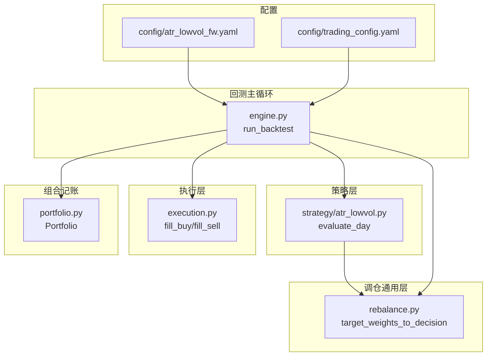
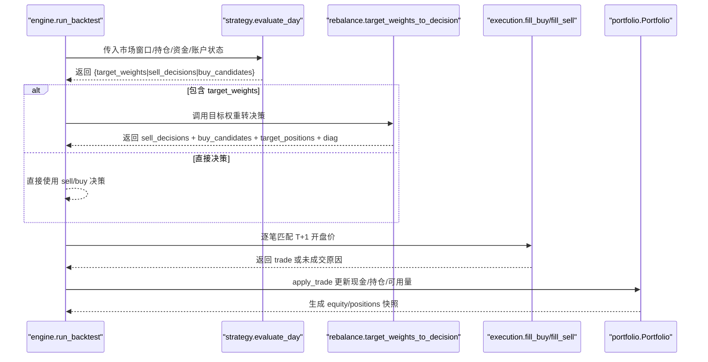
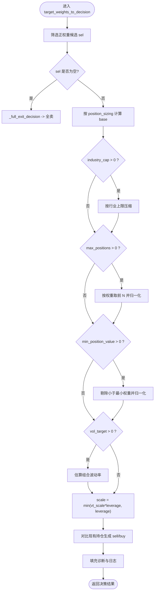
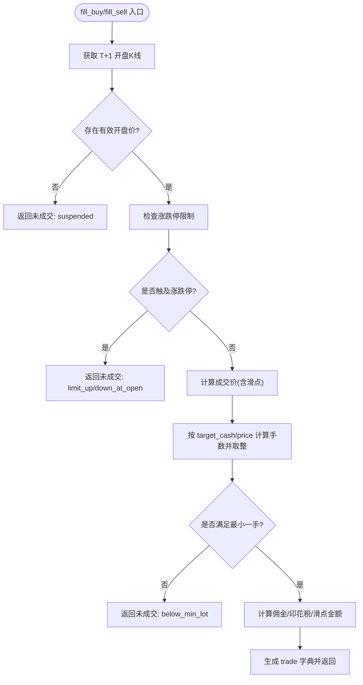
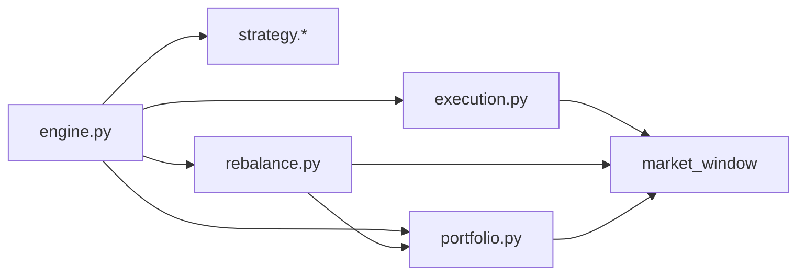

# 调仓引擎

<cite>
**本文引用的文件**   
- [backtest/rebalance.py](file://backtest/rebalance.py)
- [backtest/engine.py](file://backtest/engine.py)
- [backtest/execution.py](file://backtest/execution.py)
- [backtest/portfolio.py](file://backtest/portfolio.py)
- [strategy/atr_lowvol.py](file://strategy/atr_lowvol.py)
- [config/atr_lowvol_fw.yaml](file://config/atr_lowvol_fw.yaml)
- [config/trading_config.yaml](file://config/trading_config.yaml)
</cite>

## 目录
1. [简介](#简介)
2. [项目结构](#项目结构)
3. [核心组件](#核心组件)
4. [架构总览](#架构总览)
5. [详细组件分析](#详细组件分析)
6. [依赖关系分析](#依赖关系分析)
7. [性能与优化](#性能与优化)
8. [故障排查指南](#故障排查指南)
9. [结论](#结论)
10. [附录：使用示例与调参建议](#附录使用示例与调参建议)

## 简介
本文件面向 QuantLab 的“目标权重到交易决策”的调仓引擎，重点解释 target_weights_to_decision() 的实现原理与调仓流程。该引擎将策略输出的目标权重（target_weights）自动转换为可执行的卖出决策与买入候选，内置行业上限、最大持仓数、最小仓位值、波动率目标与杠杆等风控约束，并在执行层完成涨跌停/停牌/滑点/整数手等真实约束匹配。通过统一的配置驱动，任何策略只需输出目标权重即可即插即用。

## 项目结构
QuantLab 的回测主循环位于 backtest/engine.py，策略在 strategy/* 中实现，调仓通用层在 backtest/rebalance.py，执行器在 backtest/execution.py，组合记账在 backtest/portfolio.py。配置文件集中在 config/*。

图表来源
- [backtest/engine.py:237-441](file://backtest/engine.py#L237-L441)
- [strategy/atr_lowvol.py:78-165](file://strategy/atr_lowvol.py#L78-L165)
- [backtest/rebalance.py:101-260](file://backtest/rebalance.py#L101-L260)
- [backtest/execution.py:95-204](file://backtest/execution.py#L95-L204)
- [backtest/portfolio.py:38-189](file://backtest/portfolio.py#L38-L189)
- [config/atr_lowvol_fw.yaml:30-49](file://config/atr_lowvol_fw.yaml#L30-L49)
- [config/trading_config.yaml:10-35](file://config/trading_config.yaml#L10-L35)

章节来源
- [backtest/engine.py:237-441](file://backtest/engine.py#L237-L441)
- [backtest/rebalance.py:101-260](file://backtest/rebalance.py#L101-L260)
- [backtest/execution.py:95-204](file://backtest/execution.py#L95-L204)
- [backtest/portfolio.py:38-189](file://backtest/portfolio.py#L38-L189)
- [strategy/atr_lowvol.py:78-165](file://strategy/atr_lowvol.py#L78-L165)
- [config/atr_lowvol_fw.yaml:30-49](file://config/atr_lowvol_fw.yaml#L30-L49)
- [config/trading_config.yaml:10-35](file://config/trading_config.yaml#L10-L35)

## 核心组件
- 调仓通用层（rebalance.py）
  - 核心函数：target_weights_to_decision(target_weights, pf, date, config, market_window, industry_map)
  - 职责：将策略的目标权重转化为 sell_decisions 与 buy_candidates，并输出 target_positions 与诊断信息；应用行业上限、最大持仓数、最小仓位值、波动率目标与杠杆缩放等约束。
- 执行层（execution.py）
  - 函数：fill_buy/call fill_sell
  - 职责：按 next_open 模型匹配 T+1 开盘价，处理涨跌停/停牌/滑点/佣金/印花税/整数手等真实约束，返回 trades 或失败原因。
- 组合记账（portfolio.py）
  - 类：Portfolio
  - 职责：维护现金、持仓、T+1可用量、逐日盯市、收益曲线与持仓快照。
- 回测主循环（engine.py）
  - 函数：run_backtest
  - 职责：加载数据与基准、调用策略 evaluate_day、若返回 target_weights 则交由 rebalance 转换、执行层成交、更新组合、汇总指标。

章节来源
- [backtest/rebalance.py:101-260](file://backtest/rebalance.py#L101-L260)
- [backtest/execution.py:95-204](file://backtest/execution.py#L95-L204)
- [backtest/portfolio.py:38-189](file://backtest/portfolio.py#L38-L189)
- [backtest/engine.py:237-441](file://backtest/engine.py#L237-L441)

## 架构总览
下图展示从策略到执行的全链路数据流与关键决策点。

图表来源
- [backtest/engine.py:408-441](file://backtest/engine.py#L408-L441)
- [backtest/rebalance.py:101-260](file://backtest/rebalance.py#L101-L260)
- [backtest/execution.py:95-204](file://backtest/execution.py#L95-L204)
- [backtest/portfolio.py:103-151](file://backtest/portfolio.py#L103-L151)

## 详细组件分析

### target_weights_to_decision() 算法详解
该函数是调仓引擎的核心，输入策略的目标权重字典，输出标准化的买卖决策与诊断信息。主要步骤如下：

1) 选择与过滤
- 仅保留正权重标的作为候选集合 sel。
- 若为空，触发全清仓逻辑 _full_exit_decision。

2) 基础权重计算（position_sizing）
- equal：等权分配。
- vol_parity：基于年化波动率的倒数加权，再归一化。
- custom：对原始权重取绝对值后归一化。

3) 行业上限约束（industry_cap）
- 按行业分组求和，超过 cap 的行业按比例压缩，保持组内相对比例。

4) 最大持仓数限制（max_positions）
- 按权重降序截取前 N 只，重新归一化。

5) 最小仓位值过滤（min_position_value）
- 根据总资产换算为最小权重阈值，剔除过小权重后重新归一化。

6) 波动率目标与杠杆缩放（vol_target + target_leverage）
- 估算当前 base 的组合波动率（对角近似，保守估计）。
- 计算达到 vol_target 所需的毛敞口 vt_scale = vol_target / est_vol。
- 最终 scale = min(vt_scale * target_leverage, target_leverage)，确保 gross 不超过 target_leverage。
- 将 base 按 scale 缩放得到最终目标权重。

7) 生成买卖决策
- 遍历 base 中的每个 code：
  - 未持有：构造买入候选，target_cash = weight * total_asset。
  - 已持有：比较目标市值与当前市值，差额为正则买入，为负则卖出。
- 对于不在 base 中的已持标的，构造全卖出的卖出决策。

8) 诊断与日志
- 记录候选总数、通过数、买卖数量、目标毛杠杆、预估组合波动率等。
- 记录行业上限裁剪、最大持仓裁剪、最小仓位过滤、波动率目标缩放等日志。

图表来源
- [backtest/rebalance.py:101-260](file://backtest/rebalance.py#L101-L260)

章节来源
- [backtest/rebalance.py:101-260](file://backtest/rebalance.py#L101-L260)

### 执行层 fill_buy/fill_sell 规则
- 价格模型：next_open，以 T+1 开盘价成交。
- 涨跌停限制：根据板块与 ST 标记判断涨跌停幅度，开盘涨幅/跌幅触及限制则拒绝成交。
- 滑点与费用：买入加滑点，卖出减滑点；佣金与印花税按配置扣除。
- 手数限制：A股以100股为一手，向下取整至整手。
- 部分减仓：卖出决策支持 target_cash 指定卖出金额，不足一手则放弃。

图表来源
- [backtest/execution.py:95-204](file://backtest/execution.py#L95-L204)

章节来源
- [backtest/execution.py:95-204](file://backtest/execution.py#L95-L204)

### 组合记账 Portfolio
- 每日盯市：根据收盘价更新 last_price 与 unrealized_pnl。
- T+1 可用量：新买入当日 available_volume=0，次日 unfreeze。
- 成本均价：加仓时按金额与佣金加权平均更新 cost_price。
- 收益曲线：按总资产变化计算 daily_return。

章节来源
- [backtest/portfolio.py:38-189](file://backtest/portfolio.py#L38-L189)

### 回测主循环 run_backtest
- 数据准备：加载市场数据、基准序列、日历与 universe。
- 策略调用：evaluate_day 返回目标权重或直接决策。
- 调仓转换：若包含 target_weights，调用 rebalance 转换。
- 执行与记账：逐笔执行、更新组合、记录日志与诊断。
- 指标汇总：计算绩效、基准对比、样本期警告、数据哈希等。

章节来源
- [backtest/engine.py:237-441](file://backtest/engine.py#L237-L441)

## 依赖关系分析
- engine.py 依赖 strategy.registry 获取策略函数，依赖 execution.py 进行成交，依赖 portfolio.py 管理组合，依赖 rebalance.py 进行目标权重转换。
- rebalance.py 依赖 Portfolio 提供的持仓与总资产信息，依赖 market_window 计算波动率，依赖 industry_map 进行行业上限控制。
- execution.py 依赖 market_window 获取 T+1 开盘价与涨跌停判定，依赖执行配置 slippage/commission_rate/tax_rate。
- portfolio.py 依赖 market_window 获取收盘价用于盯市。

图表来源
- [backtest/engine.py:237-441](file://backtest/engine.py#L237-L441)
- [backtest/rebalance.py:101-260](file://backtest/rebalance.py#L101-L260)
- [backtest/execution.py:95-204](file://backtest/execution.py#L95-L204)
- [backtest/portfolio.py:38-189](file://backtest/portfolio.py#L38-L189)

章节来源
- [backtest/engine.py:237-441](file://backtest/engine.py#L237-L441)
- [backtest/rebalance.py:101-260](file://backtest/rebalance.py#L101-L260)
- [backtest/execution.py:95-204](file://backtest/execution.py#L95-L204)
- [backtest/portfolio.py:38-189](file://backtest/portfolio.py#L38-L189)

## 性能与优化
- 数据切片优化：engine.py 预计算 cut_index，每日 O(1) 切片 market_window，避免重复搜索。
- 波动率估算：rebalance.py 使用对角近似（忽略相关性），保守估计，适合回测框架安全边界。
- 执行效率：execution.py 纯函数式，无 IO 与随机性，减少开销。
- 内存占用：组合与交易记录以列表/字典为主，注意长周期回测时的内存增长。

[本节为一般性指导，不直接分析具体文件]

## 故障排查指南
- 未成交常见原因
  - suspended：T+1 无 K 线（停牌或超出范围）。
  - limit_up_at_open/limit_down_at_open：开盘触及涨跌停。
  - invalid_price：开盘价为非正数。
  - no_target_cash：买入候选无 target_cash。
  - below_min_lot：计算手数不足一手。
  - no_available_volume：卖出时无可用量（T+1 限制）。
- 日志定位
  - engine.py 每日日志记录每笔成交或未成交原因。
  - rebalance.py 的诊断与 logs 字段记录行业上限裁剪、最大持仓裁剪、最小仓位过滤、波动率目标缩放等信息。
- 常见问题
  - 基准缺失或断点：engine.py 会禁用 IR/excess 并给出提示。
  - 样本期过短：summary.sample_period_warning 提供警告。

章节来源
- [backtest/execution.py:95-204](file://backtest/execution.py#L95-L204)
- [backtest/engine.py:324-441](file://backtest/engine.py#L324-L441)
- [backtest/rebalance.py:101-260](file://backtest/rebalance.py#L101-L260)

## 结论
QuantLab 的调仓引擎通过统一的目标权重接口，将策略与风控解耦，使任何策略只需输出 target_weights 即可获得完整的交易决策与真实约束下的执行。其核心在于稳健的约束处理（行业上限、最大持仓、最小仓位、波动率目标与杠杆）、高效的执行匹配与清晰的诊断日志，便于调试与优化。

[本节为总结性内容，不直接分析具体文件]

## 附录：使用示例与调参建议

### 使用示例
- 策略示例：atr_lowvol 策略输出等权目标权重，由 rebalance 层应用 equal/vol_parity/custom 仓位模型与各项风控约束。
- 配置示例：atr_lowvol_fw.yaml 中 strategy_params 包含 position_sizing、target_leverage、vol_target、industry_cap、max_positions、min_position_value、vol_window、margin_interest_rate 等参数。
- 实盘配置：trading_config.yaml 定义佣金、印花税、滑点、风险阈值、订单超时等。

章节来源
- [strategy/atr_lowvol.py:78-165](file://strategy/atr_lowvol.py#L78-L165)
- [config/atr_lowvol_fw.yaml:30-49](file://config/atr_lowvol_fw.yaml#L30-L49)
- [config/trading_config.yaml:10-35](file://config/trading_config.yaml#L10-L35)

### 调仓频率设置
- 策略侧：rebalance_freq 支持 weekly/monthly/quarterly，结合 schedule.is_rebalance_day 控制调仓日。
- 建议：低频策略（如季度）可降低换手与成本；高频策略需配合更严格的交易成本与流动性约束。

章节来源
- [strategy/atr_lowvol.py:78-165](file://strategy/atr_lowvol.py#L78-L165)

### 阈值控制与平滑处理
- 最小仓位值（min_position_value）：过滤微小权重，降低频繁小单带来的摩擦成本。
- 最大持仓数（max_positions）：限制集中度，提升分散度与稳定性。
- 行业上限（industry_cap）：控制行业暴露，避免集中风险。
- 波动率目标（vol_target）：动态缩放组合波动，稳定风险水平。
- 平滑建议：在信号层面引入移动平均或指数平滑，减少噪声导致的过度调仓。

章节来源
- [backtest/rebalance.py:155-195](file://backtest/rebalance.py#L155-L195)

### 不同市场环境下的策略选择
- 高波动环境：提高 vol_target，降低 scale，控制回撤；适当放宽 max_positions 以提升分散。
- 低流动性环境：提高 min_position_value，避免小票冲击；收紧 industry_cap 防止流动性挤兑。
- 趋势行情：结合动量门控与止损（stop_loss），减少假突破损失。
- 震荡行情：降低 turnover 阈值，增加平滑处理，减少频繁调仓。

[本节为概念性指导，不直接分析具体文件]

### 调仓结果分析指标
- 调仓幅度统计：diagnostics.candidate_total、candidate_passed、buy_count、sell_count。
- 交易成本估算：execution.py 的 slippage_amt、commission、tax；engine.py 汇总未成交次数。
- 组合变化分析：portfolio.py 的 equity_rows 与 positions_rows 提供净值曲线与持仓快照。
- 基准对比：engine.py 计算 benchmark_close、benchmark_return 与 IR/excess（当基准可用）。

章节来源
- [backtest/rebalance.py:245-260](file://backtest/rebalance.py#L245-L260)
- [backtest/execution.py:137-204](file://backtest/execution.py#L137-L204)
- [backtest/portfolio.py:155-189](file://backtest/portfolio.py#L155-L189)
- [backtest/engine.py:445-511](file://backtest/engine.py#L445-L511)