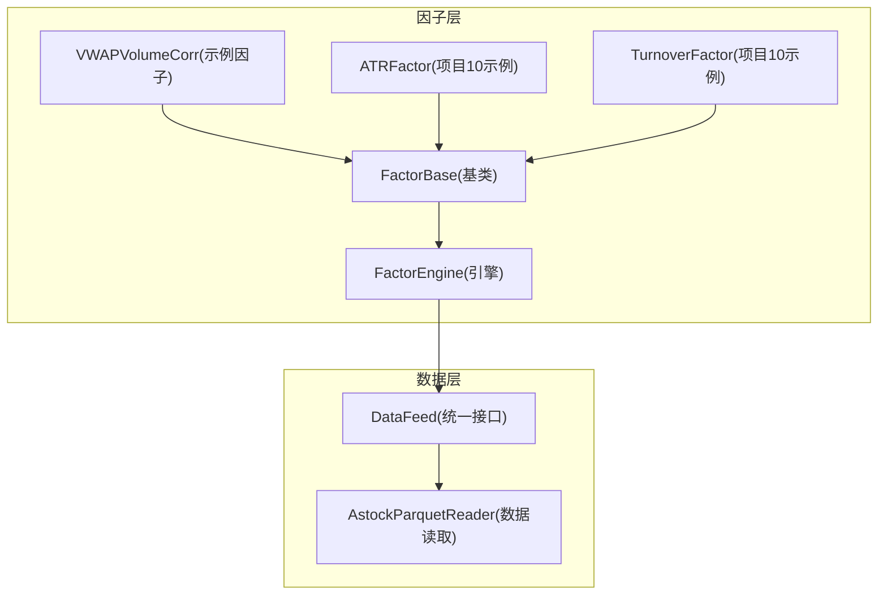
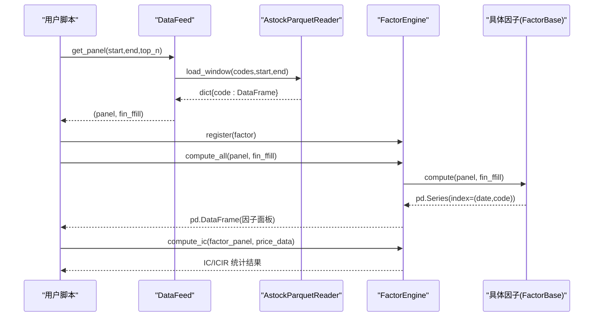
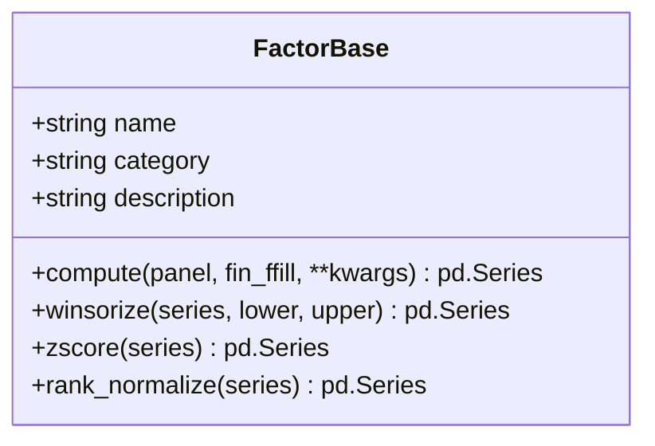
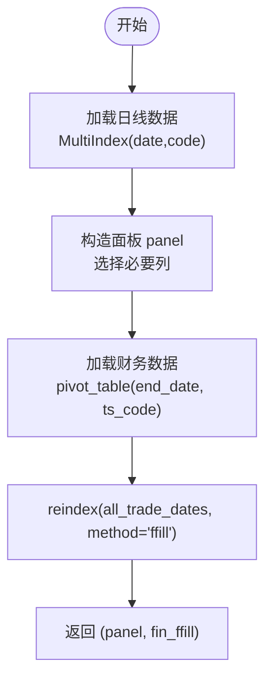
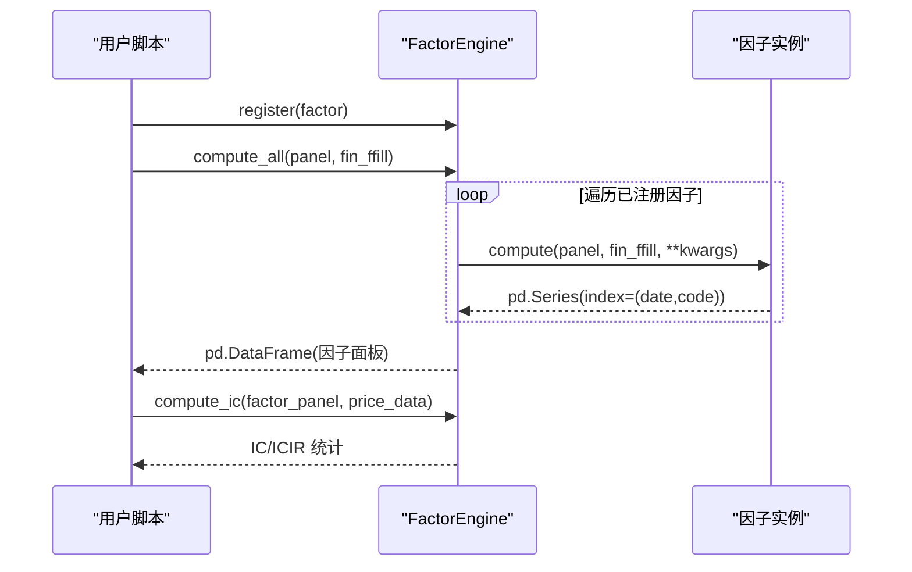
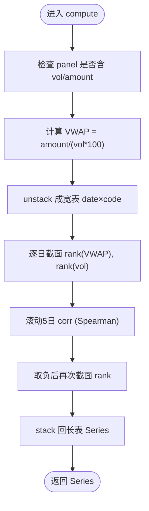
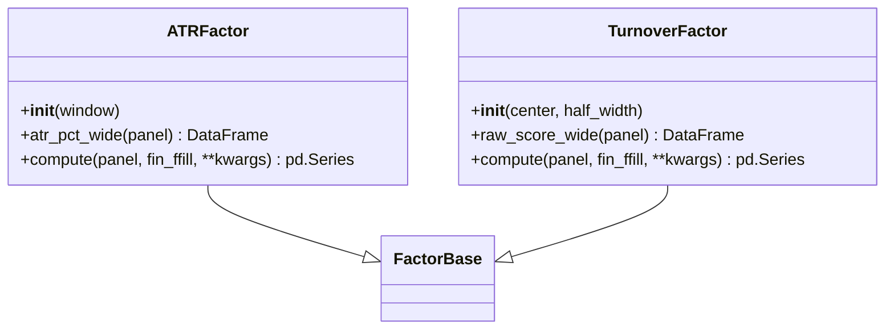
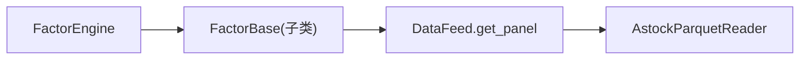

# 因子基类与开发规范

<cite>
**本文引用的文件**   
- [factors/base.py](file://factors/base.py)
- [factors/engine.py](file://factors/engine.py)
- [factors/vwap_volume_corr.py](file://factors/vwap_volume_corr.py)
- [data/feed.py](file://data/feed.py)
- [data/astock_reader.py](file://data/astock_reader.py)
- [projects/Project_10_价值小盘V2/strategy/factors.py](file://projects/Project_10_价值小盘V2/strategy/factors.py)
- [projects/Project_01_多因子IC小盘Alpha/strategy/scoring.py](file://projects/Project_01_多因子IC小盘Alpha/strategy/scoring.py)
</cite>

## 目录
1. [简介](#简介)
2. [项目结构](#项目结构)
3. [核心组件](#核心组件)
4. [架构总览](#架构总览)
5. [详细组件分析](#详细组件分析)
6. [依赖关系分析](#依赖关系分析)
7. [性能考量](#性能考量)
8. [故障排查指南](#故障排查指南)
9. [结论](#结论)
10. [附录](#附录)

## 简介
本文件面向 QuantLab 的因子开发与使用，系统阐述 FactorBase 抽象基类的设计模式、核心方法约定、面板数据与财务宽表格式、内置预处理工具的使用场景与参数配置，并提供完整的自定义因子开发示例与最佳实践。文档同时覆盖常见数据处理陷阱与调试技巧，帮助读者快速构建高质量、可维护、可回测的因子库。

## 项目结构
QuantLab 的因子相关代码主要分布在以下模块：
- factors/base.py：FactorBase 抽象基类与通用预处理方法
- factors/engine.py：因子引擎（注册、批量计算、IC 统计）
- factors/vwap_volume_corr.py：基于 FactorBase 的示例因子实现
- data/feed.py：统一数据接口，提供 get_panel() 生成面板与财务宽表
- data/astock_reader.py：Astock parquet 读取器（与 DuckDB 读取器 duck-typed 兼容）
- projects/*：策略项目中对 FactorBase 的实际使用与扩展

**图表来源** 
- [factors/base.py:9-52](file://factors/base.py#L9-L52)
- [factors/engine.py:9-86](file://factors/engine.py#L9-L86)
- [factors/vwap_volume_corr.py:18-67](file://factors/vwap_volume_corr.py#L18-L67)
- [data/feed.py:17-181](file://data/feed.py#L17-L181)
- [data/astock_reader.py:25-192](file://data/astock_reader.py#L25-L192)
- [projects/Project_10_价值小盘V2/strategy/factors.py:46-101](file://projects/Project_10_价值小盘V2/strategy/factors.py#L46-L101)

**章节来源**
- [factors/base.py:9-52](file://factors/base.py#L9-L52)
- [factors/engine.py:9-86](file://factors/engine.py#L9-L86)
- [data/feed.py:17-181](file://data/feed.py#L17-L181)
- [data/astock_reader.py:25-192](file://data/astock_reader.py#L25-L192)

## 核心组件
- FactorBase：定义因子契约 compute(panel, fin_ffill, **kwargs)，并封装常用预处理 winsorize/zscore/rank_normalize
- FactorEngine：管理因子注册、批量计算、IC/ICIR 统计
- DataFeed.get_panel：生成 MultiIndex(trade_date, ts_code) 的面板与按财报日期前向填充的财务宽表
- AstockParquetReader：从 astock parquet 高效读取日线数据，支持复权与列裁剪

关键要点
- panel 为 MultiIndex DataFrame，行索引为 (date, code)，列包含 OHLCV 及衍生字段
- fin_ffill 为以 end_date 为索引、ts_code 为列的宽表，经 ffill 对齐交易日序列
- compute 必须返回 pd.Series，index=(date, code)，值为因子值

**章节来源**
- [factors/base.py:9-52](file://factors/base.py#L9-L52)
- [factors/engine.py:9-86](file://factors/engine.py#L9-L86)
- [data/feed.py:137-181](file://data/feed.py#L137-L181)
- [data/astock_reader.py:71-116](file://data/astock_reader.py#L71-L116)

## 架构总览
下图展示因子计算与评估的整体流程：数据源 → 面板/财务宽表 → 因子引擎 → 因子计算 → IC 统计。

**图表来源** 
- [data/feed.py:137-181](file://data/feed.py#L137-L181)
- [data/astock_reader.py:71-116](file://data/astock_reader.py#L71-L116)
- [factors/engine.py:20-81](file://factors/engine.py#L20-L81)
- [factors/base.py:17-28](file://factors/base.py#L17-L28)

## 详细组件分析

### FactorBase 抽象基类
- 设计目标：统一因子接口，屏蔽数据获取与预处理细节
- 核心方法
  - compute(panel, fin_ffill, **kwargs)：子类必须实现，输入为面板与财务宽表，输出为 pd.Series，index=(date, code)
- 内置预处理
  - winsorize(series, lower=0.01, upper=0.99)：百分位截尾，降低极端值影响
  - zscore(series)：Z-score 标准化，处理 std=0 或 NaN 情况
  - rank_normalize(series)：排序标准化到 [0,1]

**图表来源** 
- [factors/base.py:9-52](file://factors/base.py#L9-L52)

**章节来源**
- [factors/base.py:9-52](file://factors/base.py#L9-L52)

### 面板数据与财务宽表
- 面板数据 panel
  - 索引：MultiIndex(date, code)
  - 列：close/open/high/low/volume/amount/pe_ttm/pb/circ_mv/pct_chg/turnover_rate 等
- 财务宽表 fin_ffill
  - 索引：end_date（交易日对齐后的时间序列）
  - 列：roe/grossprofit_margin/netprofit_margin/bps/ocfps 等
  - 通过 reindex(method="ffill") 将财报数据对齐至交易日，避免未来函数

**图表来源** 
- [data/feed.py:137-181](file://data/feed.py#L137-L181)

**章节来源**
- [data/feed.py:137-181](file://data/feed.py#L137-L181)

### 因子引擎 FactorEngine
- 功能
  - register(factor)：注册因子实例
  - compute_all(panel, fin_ffill, **kwargs)：批量计算所有已注册因子，返回因子面板
  - compute_ic(factor_panel, price_data, forward_days)：计算截面 IC/ICIR
- 错误处理
  - 单个因子计算异常被捕获并打印，不影响其他因子计算

**图表来源** 
- [factors/engine.py:15-81](file://factors/engine.py#L15-L81)

**章节来源**
- [factors/engine.py:9-86](file://factors/engine.py#L9-L86)

### 示例因子：VWAP量价相关
- 继承 FactorBase，实现 compute
- 逻辑要点
  - 计算 VWAP = amount / (volume × 100)
  - 每日截面 rank(VWAP) 与 rank(volume) 的滚动 Spearman 相关（rolling corr on ranks）
  - 取负再截面 rank，得到 [0,1] 得分
- 返回值：pd.Series，index=(date, code)

**图表来源** 
- [factors/vwap_volume_corr.py:28-67](file://factors/vwap_volume_corr.py#L28-L67)

**章节来源**
- [factors/vwap_volume_corr.py:18-67](file://factors/vwap_volume_corr.py#L18-L67)

### 项目中的因子实现示例（Project_10）
- ATRFactor：ATR%/close 低波动因子，越低越好；截面预处理顺序：winsorize → z-score → rank（方向反转）
- TurnoverFactor：换手率倒U型映射，中枢 4.5%、半宽 4.5%，越高越好；同样遵循 winsorize → z-score → rank
- 两者均继承 FactorBase，compute 返回 pd.Series，index=(date, code)

**图表来源** 
- [projects/Project_10_价值小盘V2/strategy/factors.py:46-101](file://projects/Project_10_价值小盘V2/strategy/factors.py#L46-L101)

**章节来源**
- [projects/Project_10_价值小盘V2/strategy/factors.py:1-117](file://projects/Project_10_价值小盘V2/strategy/factors.py#L1-L117)

### 完整自定义因子开发步骤
- 步骤
  1. 新建因子类继承 FactorBase，在 __init__ 中设置 name/category/description
  2. 实现 compute(panel, fin_ffill, **kwargs)，确保返回 pd.Series，index=(date, code)
  3. 使用内置预处理：winsorize/zscore/rank_normalize，注意方向（低好/高好）
  4. 在策略或工程中注册因子并调用 compute_all 进行批量计算
  5. 如需评估，使用 compute_ic 计算 IC/ICIR

- 命名规范与分类体系
  - name：简洁英文标识，如 atr_pct、turnover_mid、vwap_volume_corr
  - category：合理分类，如 volatility、liquidity、量价、价值、质量、动量、情绪
  - description：简明描述因子含义与方向（越高越好/越低越好）

- 最佳实践
  - 严格遵循面板与财务宽表格式，避免未来函数
  - 对缺失值与零值做安全处理（如加极小常数防除零）
  - 截面处理优先使用向量化操作（unstack/rolling），减少 groupby-apply
  - 在 compute 中保留原始精度，仅在必要时进行标准化/排名

**章节来源**
- [factors/base.py:9-52](file://factors/base.py#L9-L52)
- [factors/engine.py:15-81](file://factors/engine.py#L15-L81)
- [projects/Project_10_价值小盘V2/strategy/factors.py:46-101](file://projects/Project_10_价值小盘V2/strategy/factors.py#L46-L101)

## 依赖关系分析
- 因子层依赖数据层提供的 panel 与 fin_ffill
- FactorEngine 依赖各因子实例的 compute 契约
- DataFeed 依赖 AstockParquetReader/DuckDB 读取器，统一返回一致的数据结构

**图表来源** 
- [factors/engine.py:20-81](file://factors/engine.py#L20-L81)
- [data/feed.py:137-181](file://data/feed.py#L137-L181)
- [data/astock_reader.py:71-116](file://data/astock_reader.py#L71-L116)

**章节来源**
- [factors/engine.py:9-86](file://factors/engine.py#L9-L86)
- [data/feed.py:17-181](file://data/feed.py#L17-L181)
- [data/astock_reader.py:25-192](file://data/astock_reader.py#L25-L192)

## 性能考量
- 面板计算优先使用向量化：unstack/rolling/corr，避免逐股循环
- 财务宽表使用前向填充对齐，减少重复查询
- 仅读取必要列（如 astock reader 的列裁剪），降低内存占用
- 截面标准化与排名尽量在宽表上进行，减少 Python 层循环

[本节为通用指导，不直接分析具体文件]

## 故障排查指南
- 常见问题
  - panel 缺少必要列（如 vol/amount）：在 compute 开头校验并抛出明确错误
  - 除零或无穷：分母加极小常数（如 1e-8），并对结果做 NaN/Inf 清理
  - 截面样本不足：当有效样本少于阈值时返回 NaN 或中性值
  - 财报滞后：使用 end_date <= asof_date 的前向填充，避免未来函数
- 调试技巧
  - 打印中间形状与列名，确认 MultiIndex 与宽表结构
  - 逐步验证 unstack/rolling/corr 的结果是否符合预期
  - 使用 FactorEngine.compute_all 的异常捕获信息定位问题因子

**章节来源**
- [factors/vwap_volume_corr.py:28-67](file://factors/vwap_volume_corr.py#L28-L67)
- [factors/engine.py:27-32](file://factors/engine.py#L27-L32)
- [data/feed.py:137-181](file://data/feed.py#L137-L181)

## 结论
通过 FactorBase 抽象基类与 FactorEngine 的统一契约，QuantLab 实现了可扩展、可评估、易维护的因子开发框架。配合标准化的面板与财务宽表格式，以及内置预处理工具，开发者可以快速构建高质量的因子库，并通过 IC/ICIR 进行稳健评估。遵循命名规范、分类体系与最佳实践，有助于提升因子库的一致性与可复用性。

[本节为总结，不直接分析具体文件]

## 附录
- 预处理方法速查
  - winsorize(series, lower=0.01, upper=0.99)：百分位截尾
  - zscore(series)：Z-score 标准化（std=0 或 NaN 时返回全 NaN）
  - rank_normalize(series)：排序标准化到 [0,1]
- 面板与财务宽表字段建议
  - panel：close/open/high/low/volume/amount/pe_ttm/pb/circ_mv/pct_chg/turnover_rate
  - fin_ffill：roe/grossprofit_margin/netprofit_margin/bps/ocfps

[本节为补充说明，不直接分析具体文件]