# 因子引擎与注册机制

<cite>
**本文引用的文件**   
- [factors/__init__.py](file://factors/__init__.py)
- [factors/base.py](file://factors/base.py)
- [factors/engine.py](file://factors/engine.py)
- [factors/vwap_volume_corr.py](file://factors/vwap_volume_corr.py)
- [factors/atr.py](file://factors/atr.py)
- [factors/volatility.py](file://factors/volatility.py)
- [factors/roe.py](file://factors/roe.py)
- [strategy/registry.py](file://strategy/registry.py)
- [backtest/engine.py](file://backtest/engine.py)
- [projects/Project_01_多因子IC小盘Alpha/research/multi_factor_ic/factors.py](file://projects/Project_01_多因子IC小盘Alpha/research/multi_factor_ic/factors.py)
- [projects/Project_01_多因子IC小盘Alpha/research/multi_factor_ic/ic_test.py](file://projects/Project_01_多因子IC小盘Alpha/research/multi_factor_ic/ic_test.py)
- [scripts/batch_ic_test.py](file://scripts/batch_ic_test.py)
</cite>

## 目录
1. [简介](#简介)
2. [项目结构](#项目结构)
3. [核心组件](#核心组件)
4. [架构总览](#架构总览)
5. [详细组件分析](#详细组件分析)
6. [依赖关系分析](#依赖关系分析)
7. [性能与优化](#性能与优化)
8. [故障排查指南](#故障排查指南)
9. [结论](#结论)
10. [附录：API 参考与使用示例](#附录api-参考与使用示例)

## 简介
本文件面向 QuantLab 的“因子引擎与注册机制”，系统性阐述以下主题：
- 因子引擎的实现原理：注册、批量计算、IC/ICIR 评估
- 装饰器模式与动态加载在策略注册中的应用
- 批量因子计算的优化策略：并行化思路、内存管理与缓存
- 因子评估框架：IC 计算、ICIR、中性化、标准化流程
- 完整 API 参考：register()、compute_all()、评估函数
- 从因子开发到批量计算的实战流程，以及依赖管理与执行顺序控制

## 项目结构
QuantLab 中与因子引擎相关的代码主要分布在 factors 包与 strategy 注册模块中，同时回测与 IC 测试脚本展示了端到端用法。

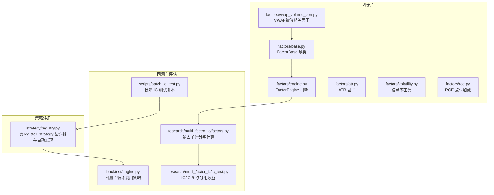

**图表来源** 
- [factors/base.py:1-52](file://factors/base.py#L1-L52)
- [factors/engine.py:1-86](file://factors/engine.py#L1-L86)
- [factors/vwap_volume_corr.py:1-115](file://factors/vwap_volume_corr.py#L1-L115)
- [factors/atr.py:1-43](file://factors/atr.py#L1-L43)
- [factors/volatility.py:1-27](file://factors/volatility.py#L1-L27)
- [factors/roe.py:1-43](file://factors/roe.py#L1-L43)
- [strategy/registry.py:1-115](file://strategy/registry.py#L1-L115)
- [backtest/engine.py:1-619](file://backtest/engine.py#L1-L619)
- [projects/Project_01_多因子IC小盘Alpha/research/multi_factor_ic/factors.py:1-140](file://projects/Project_01_多因子IC小盘Alpha/research/multi_factor_ic/factors.py#L1-L140)
- [projects/Project_01_多因子IC小盘Alpha/research/multi_factor_ic/ic_test.py:1-206](file://projects/Project_01_多因子IC小盘Alpha/research/multi_factor_ic/ic_test.py#L1-L206)
- [scripts/batch_ic_test.py:1-266](file://scripts/batch_ic_test.py#L1-L266)

**章节来源**
- [factors/__init__.py:1-8](file://factors/__init__.py#L1-L8)

## 核心组件
- FactorBase：定义统一因子接口 compute(panel, fin_ffill, **kwargs)，并提供常用预处理工具（截尾、Z-score、秩标准化）。
- FactorEngine：维护已注册因子字典，提供 register()、compute_all()、compute_ic()、list_factors()。
- 具体因子实现：如 VWAPVolumeCorr 继承 FactorBase；ATR/VOL/ROE 为函数式因子，供策略直接调用。
- Strategy Registry：通过 @register_strategy 装饰器将策略 evaluate_day 注册到全局映射，并在导入时自动扫描触发注册。
- 回测引擎：按交易日驱动策略，读取市场数据并生成交易决策，最终汇总绩效。

**章节来源**
- [factors/base.py:1-52](file://factors/base.py#L1-L52)
- [factors/engine.py:1-86](file://factors/engine.py#L1-L86)
- [factors/vwap_volume_corr.py:1-115](file://factors/vwap_volume_corr.py#L1-L115)
- [factors/atr.py:1-43](file://factors/atr.py#L1-L43)
- [factors/volatility.py:1-27](file://factors/volatility.py#L1-L27)
- [factors/roe.py:1-43](file://factors/roe.py#L1-L43)
- [strategy/registry.py:1-115](file://strategy/registry.py#L1-L115)
- [backtest/engine.py:1-619](file://backtest/engine.py#L1-L619)

## 架构总览
下图展示因子引擎与策略注册、回测主循环之间的交互关系。

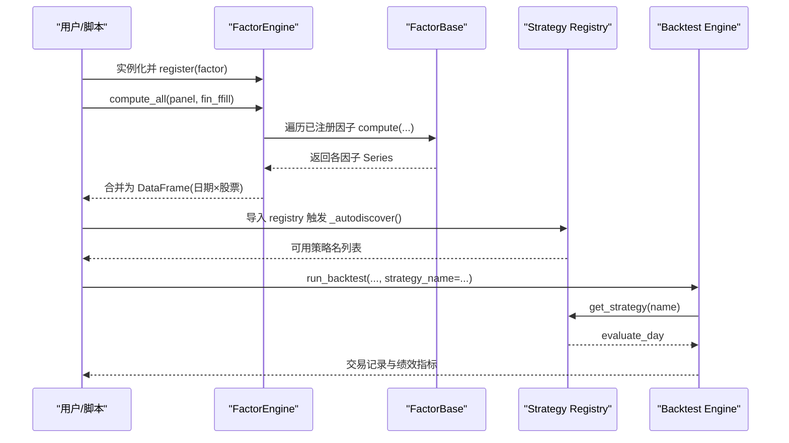

**图表来源** 
- [factors/engine.py:1-86](file://factors/engine.py#L1-L86)
- [factors/base.py:1-52](file://factors/base.py#L1-L52)
- [strategy/registry.py:1-115](file://strategy/registry.py#L1-L115)
- [backtest/engine.py:1-619](file://backtest/engine.py#L1-L619)

## 详细组件分析

### 因子基类与预处理（FactorBase）
- 设计要点
  - 抽象方法 compute(panel, fin_ffill, **kwargs) 强制子类实现。
  - 提供 winsorize、zscore、rank_normalize 等静态方法，便于统一预处理。
- 复杂度与内存
  - 预处理均为向量化操作，时间复杂度 O(N)，空间复杂度取决于输入 Series 大小。
- 错误处理
  - 对空序列或标准差为零的情况进行保护，避免除零或 NaN 传播。

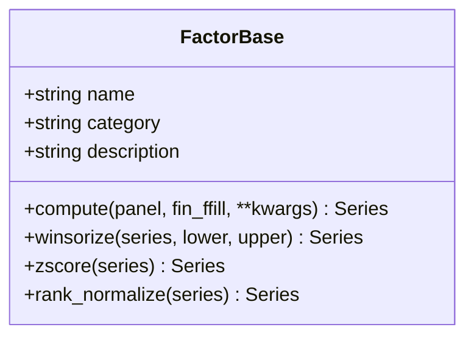

**图表来源** 
- [factors/base.py:1-52](file://factors/base.py#L1-L52)

**章节来源**
- [factors/base.py:1-52](file://factors/base.py#L1-L52)

### 因子引擎（FactorEngine）
- 功能
  - register(factor)：以 factor.name 为键注册因子实例。
  - compute_all(panel, fin_ffill, **kwargs)：串行计算所有已注册因子，异常捕获并打印失败信息，返回 DataFrame。
  - compute_ic(factor_panel, price_data, forward_days)：计算前向收益，逐日截面 Spearman IC，统计均值、标准差、ICIR、IC>0 占比与样本天数。
  - list_factors()：列出已注册因子名称。
- 数据流
  - panel 为 MultiIndex(date, code) 的面板数据；fin_ffill 为财务宽表。
  - 结果 DataFrame 的 index=(date, code)，columns=factor_names。
- 扩展性
  - 可通过传入 kwargs 传递额外参数（如窗口长度、阈值等）。

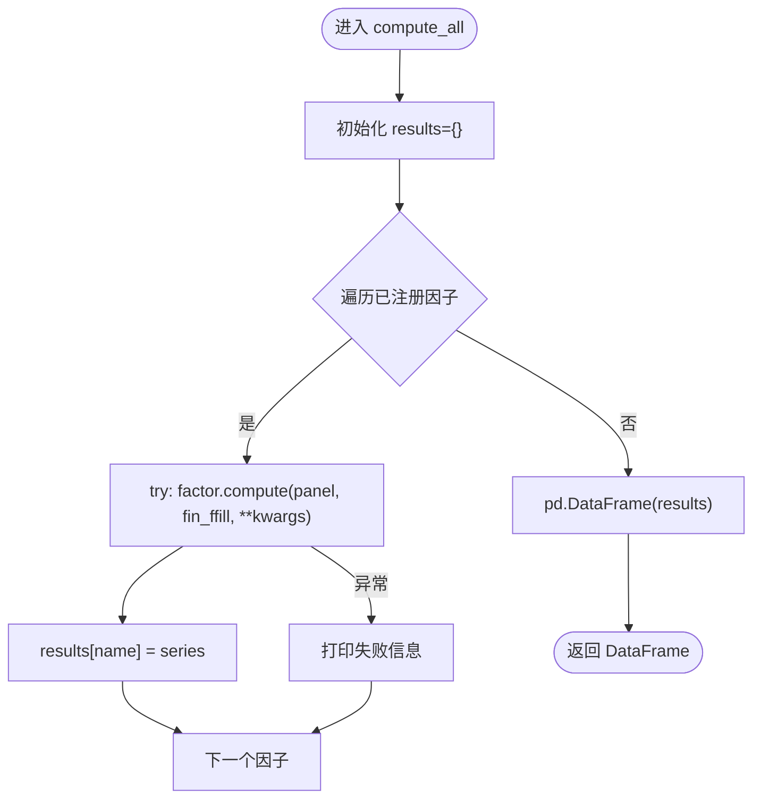

**图表来源** 
- [factors/engine.py:1-86](file://factors/engine.py#L1-L86)

**章节来源**
- [factors/engine.py:1-86](file://factors/engine.py#L1-L86)

### 具体因子实现：VWAP 量价相关（VWAPVolumeCorr）
- 公式与逻辑
  - VWAP = amount / (vol × 100)
  - 对 VWAP 与 volume 分别做截面排名，滚动 5 日相关性（Spearman），取负后再截面排名。
- 实现细节
  - unstack 转为宽表后使用 rolling().corr() 高效计算。
  - 缺失值填充与边界处理（前 4 天不足窗口）。
- 单日版本
  - compute_single(panel, date, trade_dates, date_series) 用于逐日调仓场景。

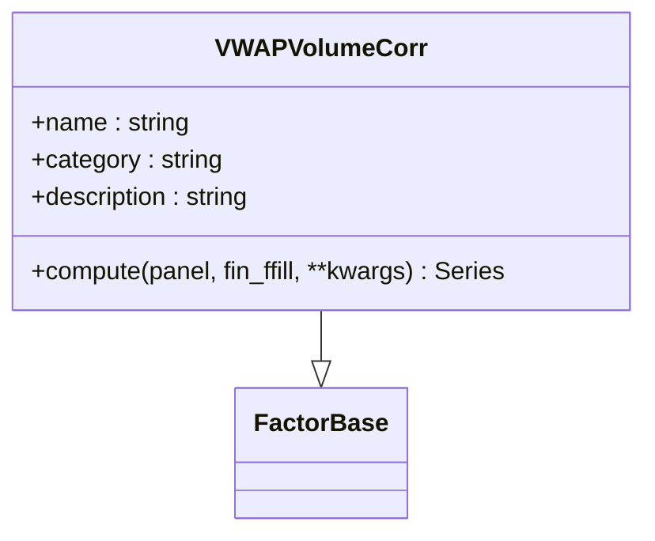

**图表来源** 
- [factors/vwap_volume_corr.py:1-115](file://factors/vwap_volume_corr.py#L1-L115)
- [factors/base.py:1-52](file://factors/base.py#L1-L52)

**章节来源**
- [factors/vwap_volume_corr.py:1-115](file://factors/vwap_volume_corr.py#L1-L115)

### 函数式因子：ATR、波动率、ROE
- ATR/ATR%：基于真实波幅与 Wilder 平滑，最新值作为因子输出。
- 年化波动率：近 n 日收益率标准差乘以 sqrt(252)。
- ROE 点时加载：从 parquet 文件构建 per-code 有序缓存，二分查找最近财报期。

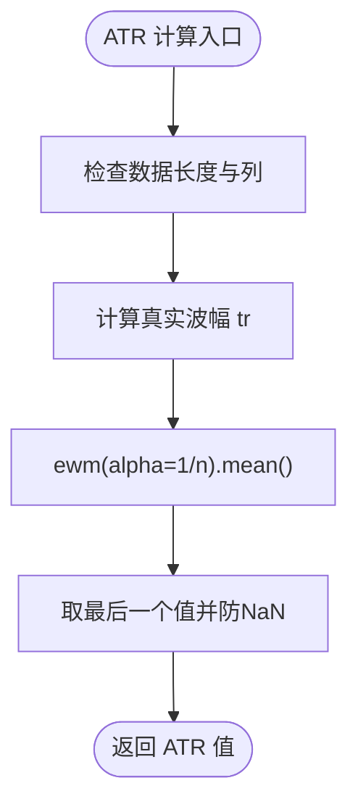

**图表来源** 
- [factors/atr.py:1-43](file://factors/atr.py#L1-L43)

**章节来源**
- [factors/atr.py:1-43](file://factors/atr.py#L1-L43)
- [factors/volatility.py:1-27](file://factors/volatility.py#L1-L27)
- [factors/roe.py:1-43](file://factors/roe.py#L1-L43)

### 策略注册与动态加载（Strategy Registry）
- 装饰器模式
  - @register_strategy(name) 将 evaluate_day 函数注册到全局映射，重复注册抛出异常。
- 自动发现
  - _autodiscover() 扫描 strategy/ 包下模块，跳过已知非目标模块，逐个 import 触发顶层装饰器。
- 测试辅助
  - strategy_spy 上下文管理器支持临时替换策略函数，便于单元测试。

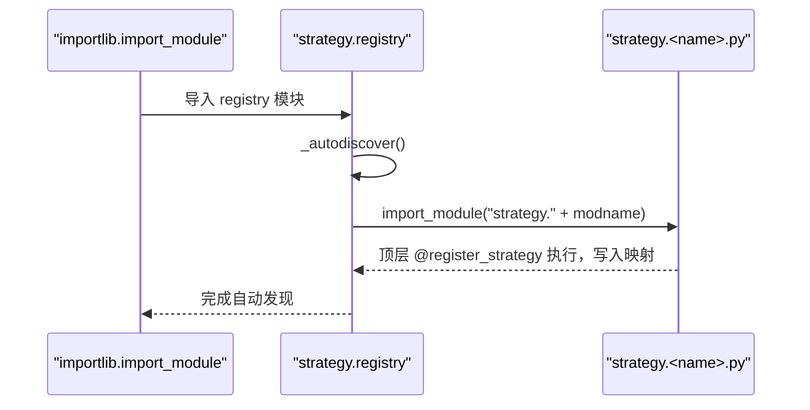

**图表来源** 
- [strategy/registry.py:1-115](file://strategy/registry.py#L1-L115)

**章节来源**
- [strategy/registry.py:1-115](file://strategy/registry.py#L1-L115)

### 回测主循环与策略调用
- 解析策略
  - resolve_strategy(strategy_name, trading_model) 从 registry 获取 evaluate_day，校验交易模型。
- 每日循环
  - 切片历史窗口、准备账户状态、调用 evaluate_day，得到目标权重或买卖决策。
- 执行与聚合
  - fill_buy/fill_sell 成交，Portfolio 更新持仓与净值，analyzer 计算绩效指标。

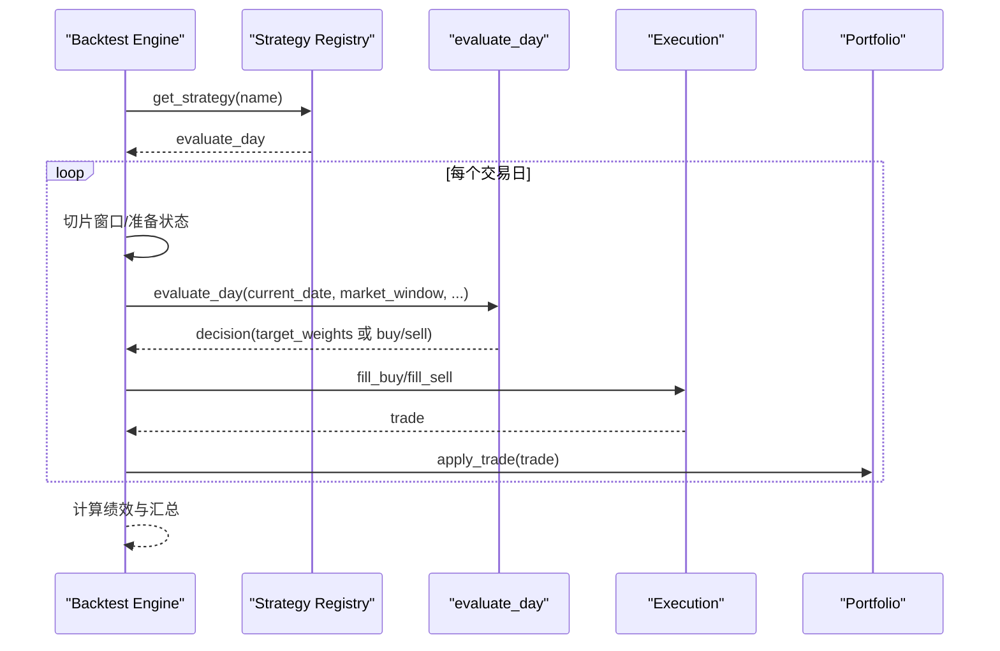

**图表来源** 
- [backtest/engine.py:1-619](file://backtest/engine.py#L1-L619)
- [strategy/registry.py:1-115](file://strategy/registry.py#L1-L115)

**章节来源**
- [backtest/engine.py:1-619](file://backtest/engine.py#L1-L619)

### 多因子评分与 IC 评估
- 评分流程
  - compute_all_factors(panel, fin_ffill, date) 计算当日截面因子值（EP/BP/ROE/动量/换手变化/波动率/流动性/VWAP量价相关）。
  - 使用 winsorize 与 standardize 进行标准化与截尾。
- IC/ICIR
  - calc_forward_return(panel, date, hold_days) 计算前向收益。
  - compute_rank_ic(factor_series, forward_ret) 计算 Spearman IC。
  - get_quantile_returns 分五组计算平均收益。
- 批量 IC 测试脚本
  - scripts/batch_ic_test.py 从 alpha101/gtja191 全量因子中筛选高 ICIR 因子，输出报告与摘要。

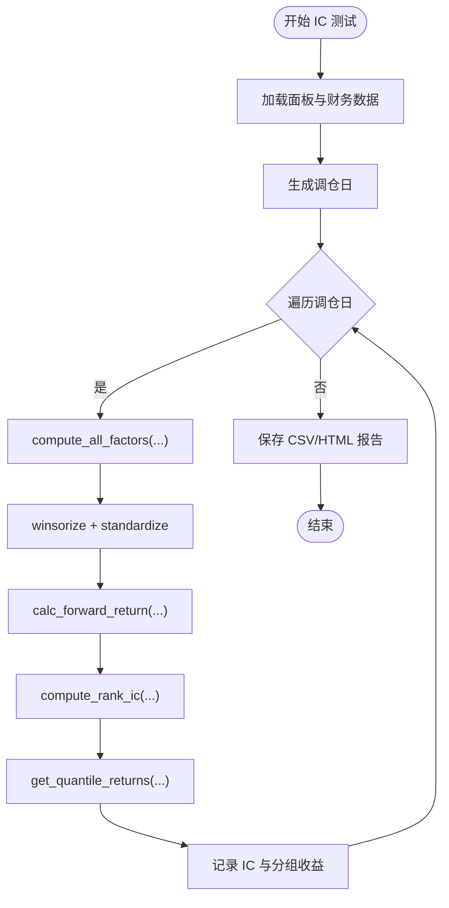

**图表来源** 
- [projects/Project_01_多因子IC小盘Alpha/research/multi_factor_ic/factors.py:1-140](file://projects/Project_01_多因子IC小盘Alpha/research/multi_factor_ic/factors.py#L1-L140)
- [projects/Project_01_多因子IC小盘Alpha/research/multi_factor_ic/ic_test.py:1-206](file://projects/Project_01_多因子IC小盘Alpha/research/multi_factor_ic/ic_test.py#L1-L206)
- [scripts/batch_ic_test.py:1-266](file://scripts/batch_ic_test.py#L1-L266)

**章节来源**
- [projects/Project_01_多因子IC小盘Alpha/research/multi_factor_ic/factors.py:1-140](file://projects/Project_01_多因子IC小盘Alpha/research/multi_factor_ic/factors.py#L1-L140)
- [projects/Project_01_多因子IC小盘Alpha/research/multi_factor_ic/ic_test.py:1-206](file://projects/Project_01_多因子IC小盘Alpha/research/multi_factor_ic/ic_test.py#L1-L206)
- [scripts/batch_ic_test.py:1-266](file://scripts/batch_ic_test.py#L1-L266)

## 依赖关系分析
- 耦合与内聚
  - FactorEngine 与 FactorBase 低耦合，通过 compute 接口解耦具体因子实现。
  - Strategy Registry 与 Backtest Engine 通过 evaluate_day 契约协作，避免强依赖。
- 外部依赖
  - pandas/numpy 用于向量化计算；parquet 用于 ROE 缓存读取。
- 潜在循环依赖
  - factors 与 strategy/backtest 无直接循环引用；IC 测试脚本独立运行。

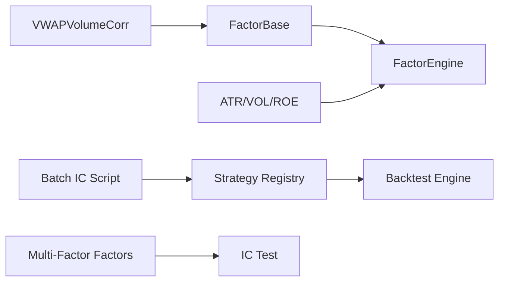

**图表来源** 
- [factors/base.py:1-52](file://factors/base.py#L1-L52)
- [factors/engine.py:1-86](file://factors/engine.py#L1-L86)
- [factors/vwap_volume_corr.py:1-115](file://factors/vwap_volume_corr.py#L1-L115)
- [factors/atr.py:1-43](file://factors/atr.py#L1-L43)
- [factors/volatility.py:1-27](file://factors/volatility.py#L1-L27)
- [factors/roe.py:1-43](file://factors/roe.py#L1-L43)
- [strategy/registry.py:1-115](file://strategy/registry.py#L1-L115)
- [backtest/engine.py:1-619](file://backtest/engine.py#L1-L619)
- [projects/Project_01_多因子IC小盘Alpha/research/multi_factor_ic/factors.py:1-140](file://projects/Project_01_多因子IC小盘Alpha/research/multi_factor_ic/factors.py#L1-L140)
- [projects/Project_01_多因子IC小盘Alpha/research/multi_factor_ic/ic_test.py:1-206](file://projects/Project_01_多因子IC小盘Alpha/research/multi_factor_ic/ic_test.py#L1-L206)
- [scripts/batch_ic_test.py:1-266](file://scripts/batch_ic_test.py#L1-L266)

**章节来源**
- [factors/engine.py:1-86](file://factors/engine.py#L1-L86)
- [strategy/registry.py:1-115](file://strategy/registry.py#L1-L115)
- [backtest/engine.py:1-619](file://backtest/engine.py#L1-L619)

## 性能与优化
- 并行计算
  - 当前 compute_all 为串行遍历；可引入 concurrent.futures.ProcessPoolExecutor 或 ThreadPoolExecutor 并行 compute，注意 GIL 与 I/O 瓶颈。
  - 对于大数据集，建议按日期分块并行计算，减少内存峰值。
- 内存管理
  - 使用 unstack/stack 转换宽窄表时注意内存占用；必要时采用 chunked 处理或增量计算。
  - 对 large panel 可考虑使用 dask/polars 替代 pandas。
- 缓存机制
  - ROE 使用进程级缓存（_CACHE）+ 二分查找提升查询效率。
  - 可将中间结果（如 vwap_rank、vol_rank）持久化至磁盘或内存缓存（LRU）。
- 批处理优化
  - 批量 IC 测试可按因子分片并行，减少单进程耗时。
  - 预计算前向收益与截面 rank，避免重复计算。

[本节为通用指导，不直接分析具体文件]

## 故障排查指南
- 因子计算失败
  - FactorEngine 会捕获异常并打印失败信息；检查 panel 是否包含必要列（如 vol、amount）。
  - 确认因子实现中对缺失值与边界条件的处理。
- 注册冲突
  - Strategy Registry 对同名策略注册会抛出 ValueError；确保策略名唯一。
- 数据缺失
  - 回测引擎在基准数据缺失时会给出警告；检查 benchmark_db_path 与数据路径。
- IC 样本不足
  - compute_ic 要求每日期截面样本数≥30；若不足则跳过该日。

**章节来源**
- [factors/engine.py:1-86](file://factors/engine.py#L1-L86)
- [strategy/registry.py:1-115](file://strategy/registry.py#L1-L115)
- [backtest/engine.py:1-619](file://backtest/engine.py#L1-L619)

## 结论
QuantLab 的因子引擎以 FactorBase/FactorEngine 为核心，提供统一的因子接口与批量计算能力；结合 Strategy Registry 的装饰器与自动发现机制，实现了策略的即插即用。IC/ICIR 评估框架完善，支持标准化、中性化与分组收益分析。通过合理的并行化、内存管理与缓存策略，可在大规模因子实验中显著提升性能。

[本节为总结，不直接分析具体文件]

## 附录：API 参考与使用示例

### FactorEngine API
- register(factor)
  - 作用：注册一个继承自 FactorBase 的因子实例。
  - 参数：factor（FactorBase 子类实例）
  - 返回：self（支持链式调用）
- compute_all(panel, fin_ffill, **kwargs)
  - 作用：计算所有已注册因子的截面值，返回 DataFrame。
  - 参数：panel（MultiIndex 面板）、fin_ffill（财务宽表）、**kwargs（可选参数）
  - 返回：DataFrame(index=(date, code), columns=factor_names)
- compute_ic(factor_panel, price_data, forward_days=20)
  - 作用：计算因子 IC/ICIR 统计。
  - 参数：factor_panel（因子面板）、price_data（价格数据含 close）、forward_days（前向天数）
  - 返回：DataFrame（ic_mean、ic_std、icir、ic_positive_pct、n_dates）
- list_factors()
  - 作用：列出已注册因子名称。

**章节来源**
- [factors/engine.py:1-86](file://factors/engine.py#L1-L86)

### 因子注册与使用示例（端到端流程）
- 步骤
  1) 定义因子：继承 FactorBase，实现 compute 方法（如 VWAPVolumeCorr）。
  2) 创建 FactorEngine 实例，调用 register(factor) 注册。
  3) 准备 panel 与 fin_ffill，调用 compute_all 获取因子面板。
  4) 使用 compute_ic 评估因子有效性。
- 函数式因子
  - ATR/VOL/ROE 可直接在策略中调用，无需继承 FactorBase。
- 策略注册
  - 在 strategy/<name>.py 中使用 @register_strategy("<name>") 装饰 evaluate_day。
  - 导入 strategy.registry 触发自动发现。

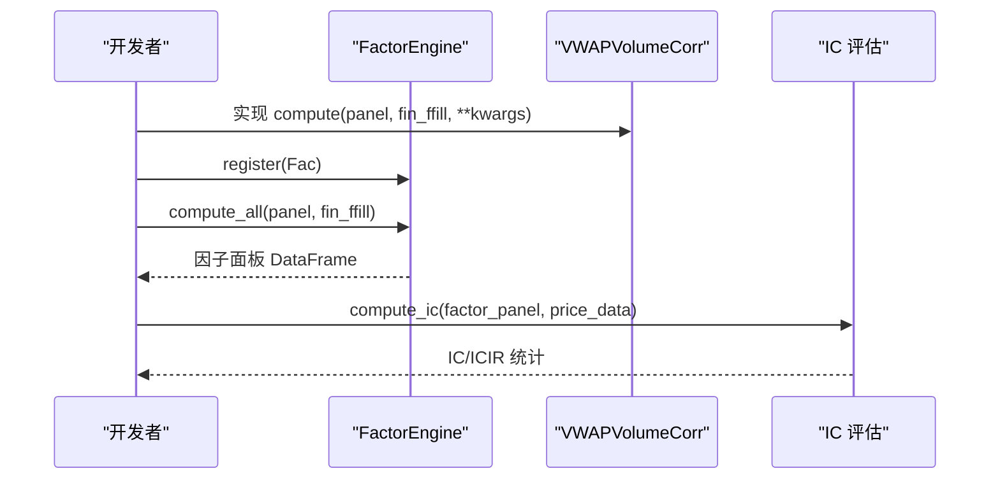

**图表来源** 
- [factors/engine.py:1-86](file://factors/engine.py#L1-L86)
- [factors/vwap_volume_corr.py:1-115](file://factors/vwap_volume_corr.py#L1-L115)

### 依赖管理与执行顺序控制
- 因子依赖
  - 通过 kwargs 传递依赖因子结果（例如先计算 VWAP 再计算相关性）。
- 执行顺序
  - compute_all 按注册顺序执行；如需严格顺序，可在 compute 内部显式依赖其他因子结果。
- 策略依赖
  - 回测引擎按日历顺序驱动 evaluate_day，保证时序一致性。

**章节来源**
- [factors/engine.py:1-86](file://factors/engine.py#L1-L86)
- [backtest/engine.py:1-619](file://backtest/engine.py#L1-L619)