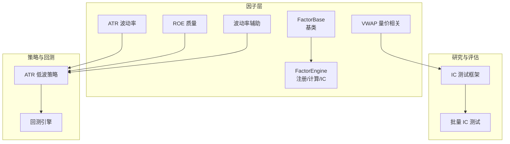
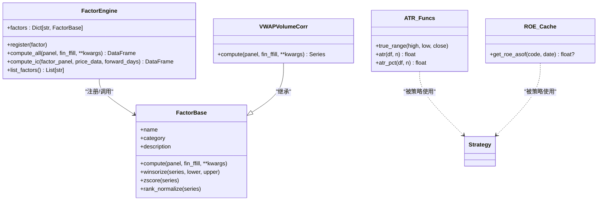
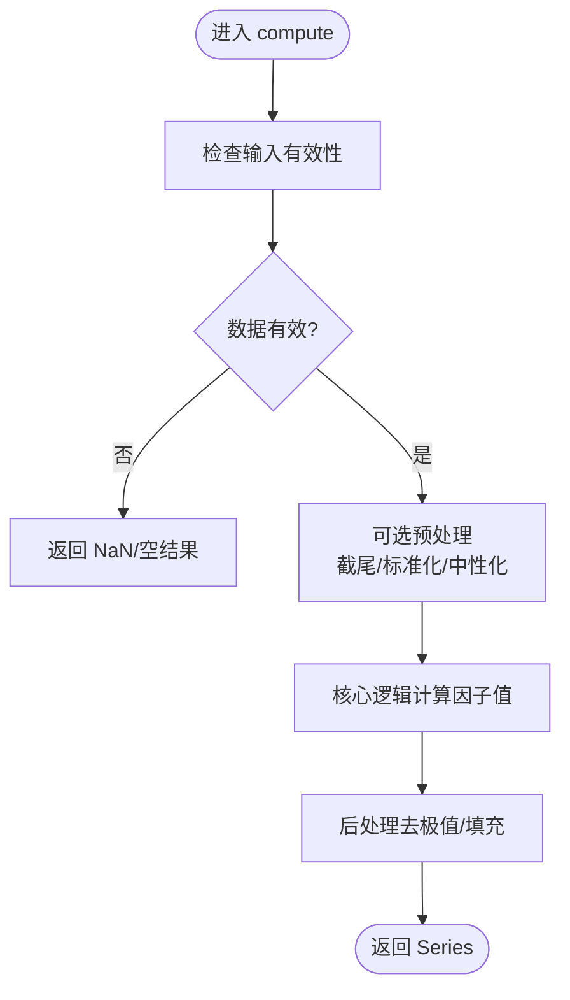
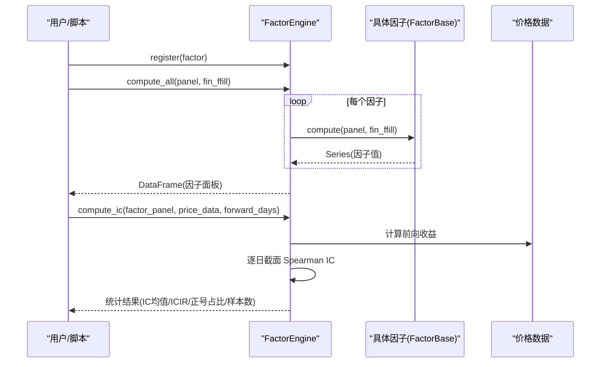
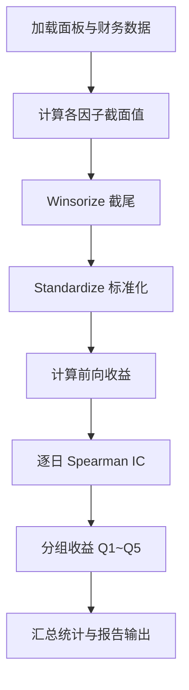
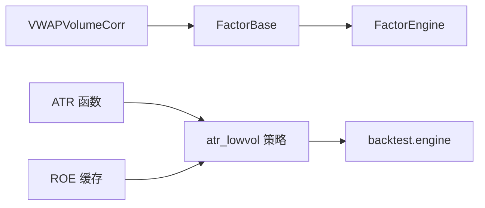

# 因子研究系统

<cite>
**本文引用的文件**   
- [factors/base.py](file://factors/base.py)
- [factors/engine.py](file://factors/engine.py)
- [factors/__init__.py](file://factors/__init__.py)
- [factors/atr.py](file://factors/atr.py)
- [factors/vwap_volume_corr.py](file://factors/vwap_volume_corr.py)
- [factors/roe.py](file://factors/roe.py)
- [factors/volatility.py](file://factors/volatility.py)
- [projects/Project_01_多因子IC小盘Alpha/research/multi_factor_ic/factors.py](file://projects/Project_01_多因子IC小盘Alpha/research/multi_factor_ic/factors.py)
- [projects/Project_01_多因子IC小盘Alpha/research/multi_factor_ic/ic_test.py](file://projects/Project_01_多因子IC小盘Alpha/research/multi_factor_ic/ic_test.py)
- [strategy/atr_lowvol.py](file://strategy/atr_lowvol.py)
- [backtest/engine.py](file://backtest/engine.py)
- [config/settings.yaml](file://config/settings.yaml)
- [scripts/batch_ic_test.py](file://scripts/batch_ic_test.py)
</cite>

## 目录
1. [简介](#简介)
2. [项目结构](#项目结构)
3. [核心组件](#核心组件)
4. [架构总览](#架构总览)
5. [详细组件分析](#详细组件分析)
6. [依赖关系分析](#依赖关系分析)
7. [性能考量](#性能考量)
8. [故障排查指南](#故障排查指南)
9. [结论](#结论)
10. [附录](#附录)

## 简介
本文件面向 QuantLab 因子研究系统，系统性阐述 FactorBase 抽象基类的设计模式与扩展方法、因子引擎的注册与批量计算机制、IC 评估框架，以及预定义因子库（ATR 波动率、VWAP 成交量相关性、ROE 质量）的使用方法。文档同时覆盖因子评估与分析全流程（IC、ICIR、中性化、标准化）、因子组合与权重分配策略、调试与测试最佳实践，并提供从构思到验证的完整开发示例路径。

## 项目结构
QuantLab 的因子相关代码主要位于 factors 目录，配合工程示例与回测引擎形成“数据→因子→评估→策略→回测”的闭环：
- factors：因子基类、引擎、预定义因子实现
- projects/.../research/multi_factor_ic：多因子 IC 测试流程与脚本
- strategy：策略层（如 ATR 低波策略），使用因子函数进行选股
- backtest：回测引擎，串联策略与执行、组合管理
- config：全局配置（含因子预处理开关）
- scripts：批量 IC 测试工具

图表来源
- [factors/base.py:1-52](file://factors/base.py#L1-L52)
- [factors/engine.py:1-86](file://factors/engine.py#L1-L86)
- [factors/atr.py:1-43](file://factors/atr.py#L1-L43)
- [factors/vwap_volume_corr.py:1-115](file://factors/vwap_volume_corr.py#L1-L115)
- [factors/roe.py:1-43](file://factors/roe.py#L1-L43)
- [factors/volatility.py:1-27](file://factors/volatility.py#L1-L27)
- [projects/Project_01_多因子IC小盘Alpha/research/multi_factor_ic/ic_test.py:1-206](file://projects/Project_01_多因子IC小盘Alpha/research/multi_factor_ic/ic_test.py#L1-L206)
- [strategy/atr_lowvol.py:1-165](file://strategy/atr_lowvol.py#L1-L165)
- [backtest/engine.py:1-619](file://backtest/engine.py#L1-L619)

章节来源
- [factors/__init__.py:1-8](file://factors/__init__.py#L1-L8)

## 核心组件
- FactorBase：定义因子统一接口 compute(panel, fin_ffill, **kwargs)，并提供通用预处理工具（截尾、Z-score、秩标准化）。
- FactorEngine：维护因子注册表，支持批量 compute_all 与 compute_ic（截面 Spearman IC、ICIR、正号占比等统计）。
- 预定义因子：
  - ATR 波动率：提供 true_range、atr、atr_pct，用于低波筛选。
  - VWAP 量价相关：基于 amount/volume 计算 VWAP，滚动 5 日 rank(VWAP) 与 rank(volume) 的 Spearman 相关，取负再截面排名。
  - ROE 质量：按 as-of 日期读取财务指标，避免未来信息泄露。
  - 波动率辅助：年化波动率计算，供仓位与目标波动率控制使用。

章节来源
- [factors/base.py:1-52](file://factors/base.py#L1-L52)
- [factors/engine.py:1-86](file://factors/engine.py#L1-L86)
- [factors/atr.py:1-43](file://factors/atr.py#L1-L43)
- [factors/vwap_volume_corr.py:1-115](file://factors/vwap_volume_corr.py#L1-L115)
- [factors/roe.py:1-43](file://factors/roe.py#L1-L43)
- [factors/volatility.py:1-27](file://factors/volatility.py#L1-L27)

## 架构总览
因子研究系统以“基类+引擎”为核心，配合工程化的 IC 测试与回测链路，形成可插拔的因子生态。

图表来源
- [factors/base.py:1-52](file://factors/base.py#L1-L52)
- [factors/engine.py:1-86](file://factors/engine.py#L1-L86)
- [factors/vwap_volume_corr.py:1-115](file://factors/vwap_volume_corr.py#L1-L115)
- [factors/atr.py:1-43](file://factors/atr.py#L1-L43)
- [factors/roe.py:1-43](file://factors/roe.py#L1-L43)

## 详细组件分析

### FactorBase 抽象基类与扩展方法
- 设计要点
  - 统一 compute 接口，输入面板数据 MultiIndex(date, code) 与财务宽表，输出 Series(index=(date, code))。
  - 提供通用预处理：百分位截尾、Z-score、秩标准化，便于跨因子一致处理。
- 复杂度与健壮性
  - 预处理均为 O(N) 操作；对空序列或标准差为 0 的情况有保护。
- 扩展建议
  - 自定义因子应继承 FactorBase，实现 compute；在内部复用 winsorize/zscore/rank_normalize 保证可比性。

图表来源
- [factors/base.py:1-52](file://factors/base.py#L1-L52)

章节来源
- [factors/base.py:1-52](file://factors/base.py#L1-L52)

### 因子引擎：注册、批量计算与 IC 评估
- 注册机制
  - register(factor) 将 name->factor 映射存入字典，支持链式调用。
- 批量计算
  - compute_all 遍历已注册因子，逐个调用 compute，异常捕获并打印失败原因，最终拼接为 DataFrame。
- IC 评估
  - compute_ic 计算前向收益（默认 20 日），逐日截面 Spearman 相关，统计 IC 均值、标准差、ICIR、正号占比与样本天数。

图表来源
- [factors/engine.py:1-86](file://factors/engine.py#L1-L86)

章节来源
- [factors/engine.py:1-86](file://factors/engine.py#L1-L86)

### 预定义因子库使用方法

#### ATR 波动率因子
- 用途：低波动选股的核心代理变量，常用 atr_pct 作为过滤阈值。
- 关键点：Wilder 平滑、NaN 保护、百分比化处理。
- 使用位置：策略层 atr_lowvol 中用于候选池筛选。

章节来源
- [factors/atr.py:1-43](file://factors/atr.py#L1-L43)
- [strategy/atr_lowvol.py:1-165](file://strategy/atr_lowvol.py#L1-L165)

#### VWAP 成交量相关性因子
- 公式：-1 * rank(corr(rank(VWAP), rank(volume), 5))
- 实现：先展开为宽表，逐日截面 rank，滚动 5 日相关，取负再截面排名。
- 兼容：提供单日 compute_single 接口，适配旧版逐日调仓场景。

章节来源
- [factors/vwap_volume_corr.py:1-115](file://factors/vwap_volume_corr.py#L1-L115)

#### ROE 质量因子
- 口径：as-of 读取财报，避免未来信息泄露；进程内缓存提升性能。
- 使用：策略层质量门控（ROE>0）剔除基本面不达标标的。

章节来源
- [factors/roe.py:1-43](file://factors/roe.py#L1-L43)
- [strategy/atr_lowvol.py:1-165](file://strategy/atr_lowvol.py#L1-L165)

#### 波动率辅助
- 功能：年化波动率估计，用于目标波动率仓位控制与回测中的 ex-ante 估计。

章节来源
- [factors/volatility.py:1-27](file://factors/volatility.py#L1-L27)

### 因子评估与分析流程（IC、ICIR、分组收益、中性化与标准化）
- 工程示例：multi_factor_ic 模块提供完整的 IC 测试流程
  - 因子计算：compute_all_factors 生成当日截面因子值
  - 前向收益：calc_forward_return 计算持有期收益
  - IC 计算：Spearman 秩相关，分位数分组收益统计
  - 报告生成：CSV/HTML 输出，包含 IC 统计与最近 24 期 IC
- 预处理：
  - 截尾（winsorize）与标准化（standardize）在 ic_test 中应用
  - 全局配置 settings.yaml 提供 neutralize/standardize/winsorize 开关与方法选择

图表来源
- [projects/Project_01_多因子IC小盘Alpha/research/multi_factor_ic/factors.py:1-140](file://projects/Project_01_多因子IC小盘Alpha/research/multi_factor_ic/factors.py#L1-L140)
- [projects/Project_01_多因子IC小盘Alpha/research/multi_factor_ic/ic_test.py:1-206](file://projects/Project_01_多因子IC小盘Alpha/research/multi_factor_ic/ic_test.py#L1-L206)
- [config/settings.yaml:1-69](file://config/settings.yaml#L1-L69)

章节来源
- [projects/Project_01_多因子IC小盘Alpha/research/multi_factor_ic/factors.py:1-140](file://projects/Project_01_多因子IC小盘Alpha/research/multi_factor_ic/factors.py#L1-L140)
- [projects/Project_01_多因子IC小盘Alpha/research/multi_factor_ic/ic_test.py:1-206](file://projects/Project_01_多因子IC小盘Alpha/research/multi_factor_ic/ic_test.py#L1-L206)
- [config/settings.yaml:1-69](file://config/settings.yaml#L1-L69)

### 因子开发与验证示例（从构思到验证）
- 构思阶段
  - 明确因子逻辑与数据需求（如 VWAP 量价相关、ROE 质量）
- 实现阶段
  - 继承 FactorBase，实现 compute；必要时提供单日版本以兼容历史接口
- 验证阶段
  - 使用 multi_factor_ic 流程进行 IC/ICIR 检验与分组收益分析
  - 结合 batch_ic_test 进行大规模因子扫描与筛选
- 部署阶段
  - 将因子接入策略层（如 atr_lowvol），通过回测引擎验证交易可行性

章节来源
- [factors/vwap_volume_corr.py:1-115](file://factors/vwap_volume_corr.py#L1-L115)
- [factors/roe.py:1-43](file://factors/roe.py#L1-L43)
- [projects/Project_01_多因子IC小盘Alpha/research/multi_factor_ic/ic_test.py:1-206](file://projects/Project_01_多因子IC小盘Alpha/research/multi_factor_ic/ic_test.py#L1-L206)
- [scripts/batch_ic_test.py:1-266](file://scripts/batch_ic_test.py#L1-L266)

### 因子组合与权重分配策略
- 组合构建
  - 多因子评分：对多个因子截面值进行加权合成（工程示例中通过 scoring/backtest 流程完成）
- 权重分配
  - 等权：简单平均（如 atr_lowvol 初始 target_weights 等权）
  - 风险平价/目标波动率：利用 volatility.ann_vol 估计波动率，进行风险预算
  - 行业约束：回测引擎支持 industry_cap 限制单行业暴露
- 回测集成
  - 策略输出 target_weights，由 rebalance 模块转换为买卖决策，执行层考虑涨跌停/停牌/滑点/整数手等真实约束

章节来源
- [strategy/atr_lowvol.py:1-165](file://strategy/atr_lowvol.py#L1-L165)
- [factors/volatility.py:1-27](file://factors/volatility.py#L1-L27)
- [backtest/engine.py:1-619](file://backtest/engine.py#L1-L619)

## 依赖关系分析
- 组件耦合
  - FactorEngine 依赖 FactorBase 接口；VWAPVolumeCorr 继承该接口
  - 策略层 atr_lowvol 依赖 ATR 与 ROE 函数，不强制继承基类（函数式因子）
  - 回测引擎 backtest.engine 负责调度策略、执行与组合管理
- 外部依赖
  - pandas/numpy 用于数据处理与数值计算
  - parquet 文件用于财务数据快速读取（ROE 缓存）

图表来源
- [factors/base.py:1-52](file://factors/base.py#L1-L52)
- [factors/engine.py:1-86](file://factors/engine.py#L1-L86)
- [factors/vwap_volume_corr.py:1-115](file://factors/vwap_volume_corr.py#L1-L115)
- [factors/atr.py:1-43](file://factors/atr.py#L1-L43)
- [factors/roe.py:1-43](file://factors/roe.py#L1-L43)
- [strategy/atr_lowvol.py:1-165](file://strategy/atr_lowvol.py#L1-L165)
- [backtest/engine.py:1-619](file://backtest/engine.py#L1-L619)

章节来源
- [factors/__init__.py:1-8](file://factors/__init__.py#L1-L8)

## 性能考量
- 面板计算优化
  - 使用 unstack/rolling 进行向量化计算，避免慢速 groupby-apply（VWAP 因子实现）
- 数据访问
  - ROE 采用进程级缓存与 searchsorted 定位，减少重复 IO
- 回测窗口切片
  - 预计算 cut_index，O(1) 获取每日窗口，降低内存拷贝与索引开销
- 批处理
  - batch_ic_test 对大量因子进行顺序计算，适合离线扫描

[本节为通用指导，无需引用具体文件]

## 故障排查指南
- 常见错误
  - 面板缺少必要列（如 vol/amount）：VWAP 因子会抛出 ValueError
  - 数据不足导致 IC 样本过少：compute_ic 会跳过不满足最小样本的日期
  - 基准数据缺失或断点：回测引擎会禁用 IR/excess 并记录警告
- 诊断信息
  - FactorEngine 计算失败会打印日志
  - 回测引擎汇总 daily_warnings、candidate_total/passed、unfilled_order_count 等诊断指标
- 建议
  - 在 compute 中加入边界检查与 NaN 填充
  - 使用 settings.yaml 的因子预处理开关确保一致性
  - 通过 HTML/CSV 报告快速定位问题因子与日期

章节来源
- [factors/vwap_volume_corr.py:1-115](file://factors/vwap_volume_corr.py#L1-L115)
- [factors/engine.py:1-86](file://factors/engine.py#L1-L86)
- [backtest/engine.py:1-619](file://backtest/engine.py#L1-L619)
- [config/settings.yaml:1-69](file://config/settings.yaml#L1-L69)

## 结论
QuantLab 因子研究系统以 FactorBase 与 FactorEngine 为核心，提供了可扩展的因子开发范式与高效的批量计算/IC 评估能力。结合 multi_factor_ic 与 batch_ic_test 的工程化流程，可实现从因子构思、实现、验证到策略回测的完整闭环。ATR、VWAP、ROE 等预定义因子覆盖了波动率、量价与质量维度，配合策略层的权重分配与回测引擎的真实约束，形成稳健的研究与生产一体化平台。

[本节为总结性内容，无需引用具体文件]

## 附录

### 因子评估与分析完整流程（步骤清单）
- 准备数据：加载面板与财务数据
- 因子计算：实现 compute 或使用预定义因子
- 预处理：截尾、标准化、中性化（settings.yaml 配置）
- 前向收益：按持有期计算
- IC 计算：Spearman 秩相关，统计 IC/ICIR/正号占比
- 分组收益：按因子值分位数计算各组平均收益
- 报告输出：CSV/HTML 报告，可视化最近 24 期 IC

章节来源
- [projects/Project_01_多因子IC小盘Alpha/research/multi_factor_ic/factors.py:1-140](file://projects/Project_01_多因子IC小盘Alpha/research/multi_factor_ic/factors.py#L1-L140)
- [projects/Project_01_多因子IC小盘Alpha/research/multi_factor_ic/ic_test.py:1-206](file://projects/Project_01_多因子IC小盘Alpha/research/multi_factor_ic/ic_test.py#L1-L206)
- [config/settings.yaml:1-69](file://config/settings.yaml#L1-L69)

### 因子调试与测试最佳实践
- 单元测试
  - 对 compute 的边界条件（空序列、全零、NaN）进行测试
- 回归测试
  - 固定输入输出，确保因子稳定性
- 批量扫描
  - 使用 batch_ic_test 对大量因子进行 IC 筛选
- 可视化
  - 通过 HTML 报告观察 IC 时序与分组收益单调性

章节来源
- [scripts/batch_ic_test.py:1-266](file://scripts/batch_ic_test.py#L1-L266)
- [projects/Project_01_多因子IC小盘Alpha/research/multi_factor_ic/ic_test.py:1-206](file://projects/Project_01_多因子IC小盘Alpha/research/multi_factor_ic/ic_test.py#L1-L206)