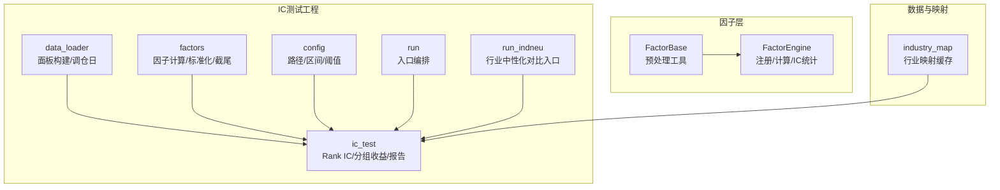
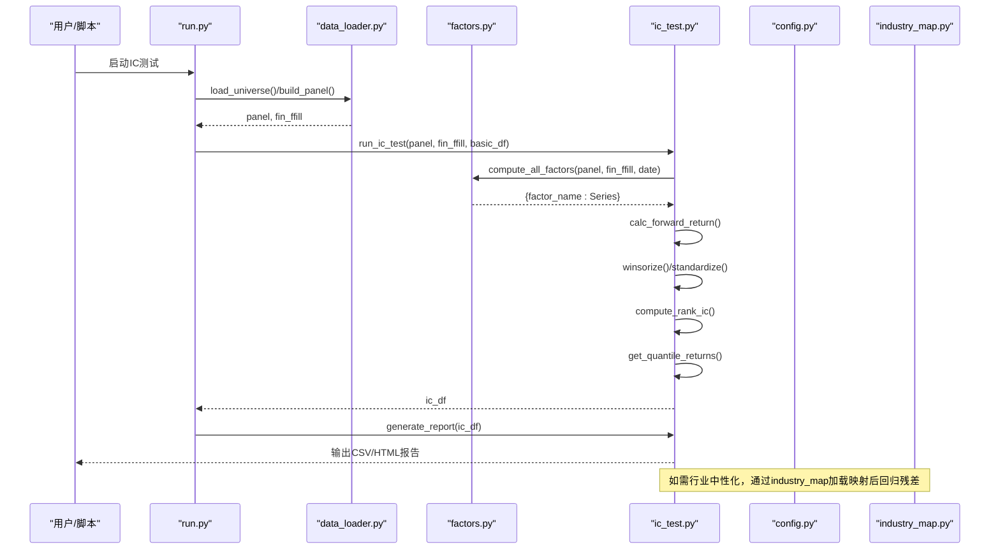
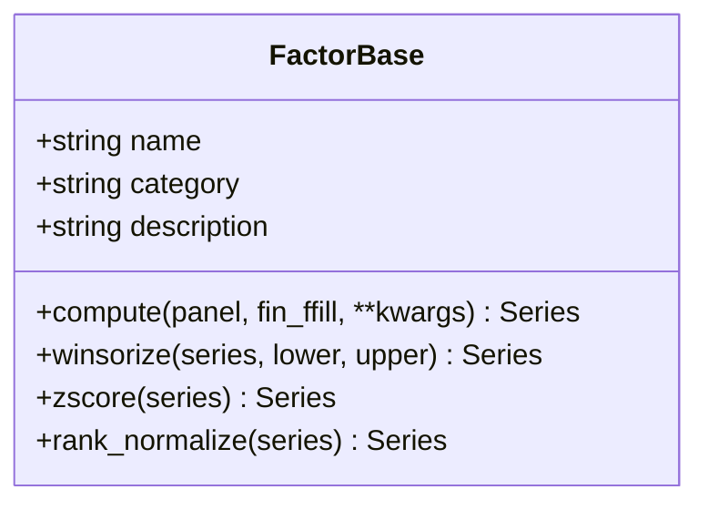
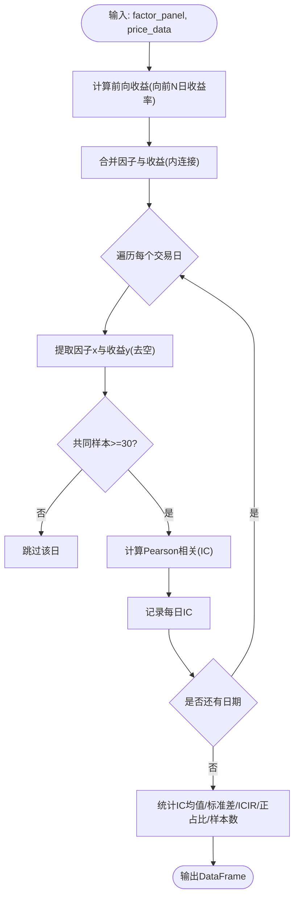
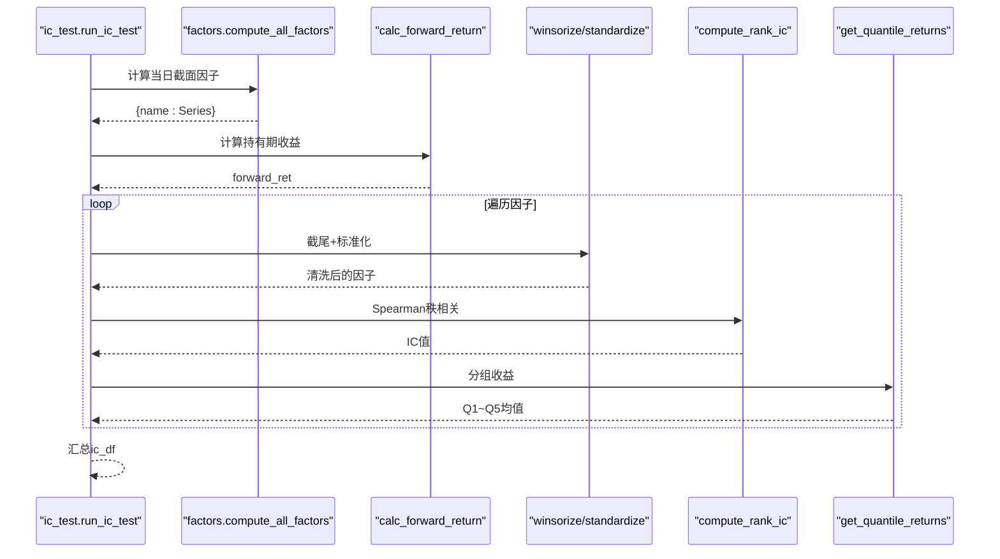
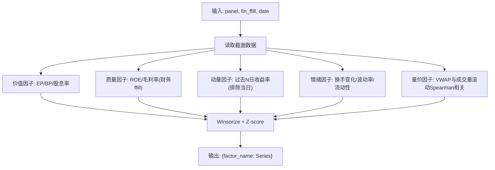
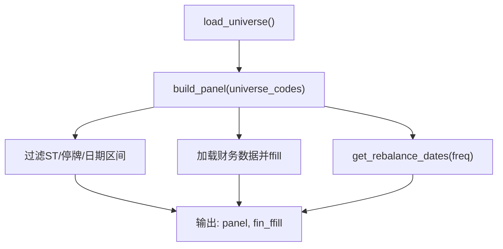
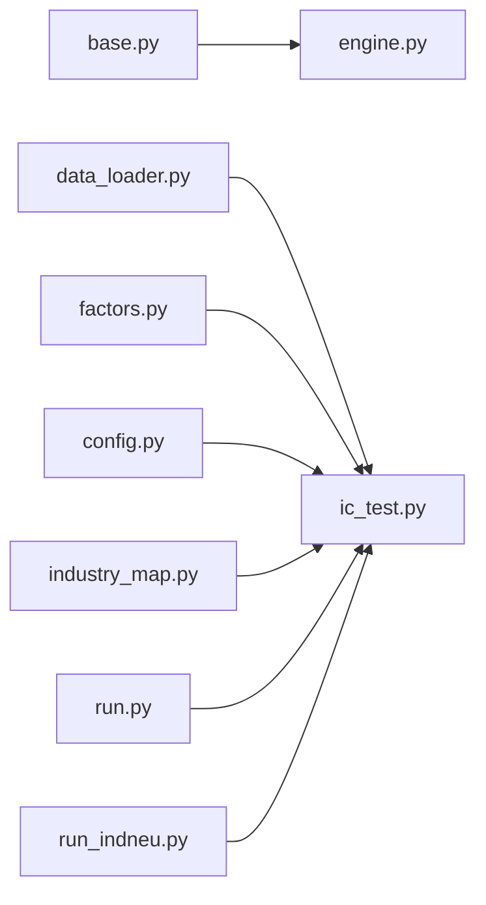

# 因子评估与分析

<cite>
**本文引用的文件**   
- [factors/base.py](file://factors\base.py)
- [factors/engine.py](file://factors\engine.py)
- [projects/Project_01_多因子IC小盘Alpha/research/multi_factor_ic/ic_test.py](file://projects\Project_01_多因子IC小盘Alpha\research\multi_factor_ic\ic_test.py)
- [projects/Project_01_多因子IC小盘Alpha/research/multi_factor_ic/factors.py](file://projects\Project_01_多因子IC小盘Alpha\research\multi_factor_ic\factors.py)
- [projects/Project_01_多因子IC小盘Alpha/research/multi_factor_ic/data_loader.py](file://projects\Project_01_多因子IC小盘Alpha\research\multi_factor_ic\data_loader.py)
- [projects/Project_01_多因子IC小盘Alpha/research/multi_factor_ic/config.py](file://projects\Project_01_多因子IC小盘Alpha\research\multi_factor_ic\config.py)
- [projects/Project_01_多因子IC小盘Alpha/research/multi_factor_ic/run.py](file://projects\Project_01_多因子IC小盘Alpha\research\multi_factor_ic\run.py)
- [projects/Project_01_多因子IC小盘Alpha/research/multi_factor_ic/run_indneu.py](file://projects\Project_01_多因子IC小盘Alpha\research\multi_factor_ic\run_indneu.py)
- [data/industry_map.py](file://data\industry_map.py)
</cite>

## 目录
1. [引言](#引言)
2. [项目结构](#项目结构)
3. [核心组件](#核心组件)
4. [架构总览](#架构总览)
5. [详细组件分析](#详细组件分析)
6. [依赖关系分析](#依赖关系分析)
7. [性能考量](#性能考量)
8. [故障排查指南](#故障排查指南)
9. [结论](#结论)
10. [附录](#附录)

## 引言
本文件面向 QuantLab 的因子评估与分析系统，系统性阐述 IC（信息系数）计算原理与实现、Rank IC 与 Pearson IC 的差异与应用、ICIR 稳定性评估方法、因子中性化（行业/市值）技术细节、因子标准化处理方案、完整因子分析流程（从数据准备到结果解读）、可视化与报告生成、因子衰减分析与时间序列特性研究，以及因子筛选与优化的最佳实践。文档以仓库中实际代码为依据，提供可追溯的文件来源与图示，帮助读者快速理解并落地使用。

## 项目结构
本项目围绕“因子计算—IC测试—回测验证—报告输出”的主线组织：
- 因子基类与引擎：定义因子接口、预处理方法与统一的因子计算与IC统计能力
- 多因子IC测试工程：封装数据加载、因子计算、IC/分组收益统计、HTML报告生成
- 数据与配置：面板数据构建、调仓日选择、路径与参数配置
- 行业映射：用于行业中性化的基础映射表

图表来源
- [factors/base.py:1-52](file://factors\base.py#L1-L52)
- [factors/engine.py:1-86](file://factors\engine.py#L1-L86)
- [projects/Project_01_多因子IC小盘Alpha/research/multi_factor_ic/data_loader.py:1-151](file://projects\Project_01_多因子IC小盘Alpha\research\multi_factor_ic\data_loader.py#L1-L151)
- [projects/Project_01_多因子IC小盘Alpha/research/multi_factor_ic/factors.py:1-140](file://projects\Project_01_多因子IC小盘Alpha\research\multi_factor_ic\factors.py#L1-L140)
- [projects/Project_01_多因子IC小盘Alpha/research/multi_factor_ic/ic_test.py:1-206](file://projects\Project_01_多因子IC小盘Alpha\research\multi_factor_ic\ic_test.py#L1-L206)
- [projects/Project_01_多因子IC小盘Alpha/research/multi_factor_ic/config.py:1-47](file://projects\Project_01_多因子IC小盘Alpha\research\multi_factor_ic\config.py#L1-L47)
- [projects/Project_01_多因子IC小盘Alpha/research/multi_factor_ic/run.py:1-66](file://projects\Project_01_多因子IC小盘Alpha\research\multi_factor_ic\run.py#L1-L66)
- [projects/Project_01_多因子IC小盘Alpha/research/multi_factor_ic/run_indneu.py:1-27](file://projects\Project_01_多因子IC小盘Alpha\research\multi_factor_ic\run_indneu.py#L1-L27)
- [data/industry_map.py:1-41](file://data\industry_map.py#L1-L41)

章节来源
- [factors/base.py:1-52](file://factors\base.py#L1-L52)
- [factors/engine.py:1-86](file://factors\engine.py#L1-L86)
- [projects/Project_01_多因子IC小盘Alpha/research/multi_factor_ic/data_loader.py:1-151](file://projects\Project_01_多因子IC小盘Alpha\research\multi_factor_ic\data_loader.py#L1-L151)
- [projects/Project_01_多因子IC小盘Alpha/research/multi_factor_ic/factors.py:1-140](file://projects\Project_01_多因子IC小盘Alpha\research\multi_factor_ic\factors.py#L1-L140)
- [projects/Project_01_多因子IC小盘Alpha/research/multi_factor_ic/ic_test.py:1-206](file://projects\Project_01_多因子IC小盘Alpha\research\multi_factor_ic\ic_test.py#L1-L206)
- [projects/Project_01_多因子IC小盘Alpha/research/multi_factor_ic/config.py:1-47](file://projects\Project_01_多因子IC小盘Alpha\research\multi_factor_ic\config.py#L1-L47)
- [projects/Project_01_多因子IC小盘Alpha/research/multi_factor_ic/run.py:1-66](file://projects\Project_01_多因子IC小盘Alpha\research\multi_factor_ic\run.py#L1-L66)
- [projects/Project_01_多因子IC小盘Alpha/research/multi_factor_ic/run_indneu.py:1-27](file://projects\Project_01_多因子IC小盘Alpha\research\multi_factor_ic\run_indneu.py#L1-L27)
- [data/industry_map.py:1-41](file://data\industry_map.py#L1-L41)

## 核心组件
- FactorBase：定义因子抽象接口与常用预处理（截尾、Z-score、秩标准化），为统一因子实现提供基座
- FactorEngine：注册因子、批量计算、截面IC与ICIR统计（Pearson相关）
- multi_factor_ic.factors：具体因子计算（价值/质量/动量/情绪/量价等），并提供Winsorize与标准化工具
- multi_factor_ic.data_loader：面板构建、财务数据前向填充、动态选股池与调仓日生成
- multi_factor_ic.ic_test：Rank IC计算、分组收益、IC统计摘要与HTML报告生成
- config：数据路径、回测区间、因子类别、极值处理与中性化开关
- run / run_indneu：端到端执行入口与行业中性化对比入口
- industry_map：行业映射加载与缓存，支撑行业中性化

章节来源
- [factors/base.py:1-52](file://factors\base.py#L1-L52)
- [factors/engine.py:1-86](file://factors\engine.py#L1-L86)
- [projects/Project_01_多因子IC小盘Alpha/research/multi_factor_ic/factors.py:1-140](file://projects\Project_01_多因子IC小盘Alpha\research\multi_factor_ic\factors.py#L1-L140)
- [projects/Project_01_多因子IC小盘Alpha/research/multi_factor_ic/data_loader.py:1-151](file://projects\Project_01_多因子IC小盘Alpha\research\multi_factor_ic\data_loader.py#L1-L151)
- [projects/Project_01_多因子IC小盘Alpha/research/multi_factor_ic/ic_test.py:1-206](file://projects\Project_01_多因子IC小盘Alpha\research\multi_factor_ic\ic_test.py#L1-L206)
- [projects/Project_01_多因子IC小盘Alpha/research/multi_factor_ic/config.py:1-47](file://projects\Project_01_多因子IC小盘Alpha\research\multi_factor_ic\config.py#L1-L47)
- [projects/Project_01_多因子IC小盘Alpha/research/multi_factor_ic/run.py:1-66](file://projects\Project_01_多因子IC小盘Alpha\research\multi_factor_ic\run.py#L1-L66)
- [projects/Project_01_多因子IC小盘Alpha/research/multi_factor_ic/run_indneu.py:1-27](file://projects\Project_01_多因子IC小盘Alpha\research\multi_factor_ic\run_indneu.py#L1-L27)
- [data/industry_map.py:1-41](file://data\industry_map.py#L1-L41)

## 架构总览
下图展示从数据准备到IC测试与报告的端到端流程，以及行业中性化扩展点。

图表来源
- [projects/Project_01_多因子IC小盘Alpha/research/multi_factor_ic/run.py:1-66](file://projects\Project_01_多因子IC小盘Alpha\research\multi_factor_ic\run.py#L1-L66)
- [projects/Project_01_多因子IC小盘Alpha/research/multi_factor_ic/data_loader.py:1-151](file://projects\Project_01_多因子IC小盘Alpha\research\multi_factor_ic\data_loader.py#L1-L151)
- [projects/Project_01_多因子IC小盘Alpha/research/multi_factor_ic/factors.py:1-140](file://projects\Project_01_多因子IC小盘Alpha\research\multi_factor_ic\factors.py#L1-L140)
- [projects/Project_01_多因子IC小盘Alpha/research/multi_factor_ic/ic_test.py:1-206](file://projects\Project_01_多因子IC小盘Alpha\research\multi_factor_ic\ic_test.py#L1-L206)
- [projects/Project_01_多因子IC小盘Alpha/research/multi_factor_ic/config.py:1-47](file://projects\Project_01_多因子IC小盘Alpha\research\multi_factor_ic\config.py#L1-L47)
- [data/industry_map.py:1-41](file://data\industry_map.py#L1-L41)

## 详细组件分析

### 因子基类与预处理（FactorBase）
- 抽象接口：compute(panel, fin_ffill, **kwargs) 返回截面Series
- 预处理工具：
  - 百分位截尾（winsorize）：降低极端值影响
  - Z-score标准化：均值为0、方差为1
  - 秩标准化（rank_normalize）：将因子值映射到[0,1]，对异常值鲁棒

图表来源
- [factors/base.py:1-52](file://factors\base.py#L1-L52)

章节来源
- [factors/base.py:1-52](file://factors\base.py#L1-L52)

### 因子引擎（FactorEngine）与IC统计
- 注册与批量计算：支持多因子并行计算与异常捕获
- 截面IC（Pearson）：逐日期计算因子与未来收益的相关性，统计均值、标准差、ICIR、正IC占比与样本数
- 适用场景：快速评估因子线性预测能力；对分布形态不敏感但受极端值影响较大

图表来源
- [factors/engine.py:34-86](file://factors\engine.py#L34-L86)

章节来源
- [factors/engine.py:1-86](file://factors\engine.py#L1-L86)

### 多因子IC测试框架（ic_test.py）
- Rank IC：基于Spearman秩相关，对非线性单调关系更稳健
- 分组收益：按因子值分位数（Q1~Q5）计算各组平均收益，观察单调性与多空收益
- 报告生成：汇总IC统计（均值、标准差、ICIR、正占比、样本数），导出CSV与HTML报告

图表来源
- [projects/Project_01_多因子IC小盘Alpha/research/multi_factor_ic/ic_test.py:1-206](file://projects\Project_01_多因子IC小盘Alpha\research\multi_factor_ic\ic_test.py#L1-L206)
- [projects/Project_01_多因子IC小盘Alpha/research/multi_factor_ic/factors.py:1-140](file://projects\Project_01_多因子IC小盘Alpha\research\multi_factor_ic\factors.py#L1-L140)

章节来源
- [projects/Project_01_多因子IC小盘Alpha/research/multi_factor_ic/ic_test.py:1-206](file://projects\Project_01_多因子IC小盘Alpha\research\multi_factor_ic\ic_test.py#L1-L206)

### 因子计算与标准化（factors.py）
- 因子族：价值（EP/BP/股息率）、质量（ROE/毛利率）、动量（1/3/6月）、情绪（换手变化/波动率/流动性）、量价（VWAP与成交量相关性）
- 标准化与截尾：Winsorize与Z-score标准化，保证跨因子可比性
- 特殊处理：财务指标滞后对齐（财报披露滞后45天）、停牌/无交易剔除、滚动窗口计算

图表来源
- [projects/Project_01_多因子IC小盘Alpha/research/multi_factor_ic/factors.py:1-140](file://projects\Project_01_多因子IC小盘Alpha\research\multi_factor_ic\factors.py#L1-L140)

章节来源
- [projects/Project_01_多因子IC小盘Alpha/research/multi_factor_ic/factors.py:1-140](file://projects\Project_01_多因子IC小盘Alpha\research\multi_factor_ic\factors.py#L1-L140)

### 数据加载与面板构建（data_loader.py）
- 候选池：按流通市值排名前4000构建宽面板，避免生存偏差
- 动态选股：按日期市值排名区间过滤，实现滚动选股池
- 财务数据：季度指标前向填充，对齐交易日
- 调仓频率：支持周/双周/月/双月/季末等多频调仓日选择

图表来源
- [projects/Project_01_多因子IC小盘Alpha/research/multi_factor_ic/data_loader.py:1-151](file://projects\Project_01_多因子IC小盘Alpha\research\multi_factor_ic\data_loader.py#L1-L151)

章节来源
- [projects/Project_01_多因子IC小盘Alpha/research/multi_factor_ic/data_loader.py:1-151](file://projects\Project_01_多因子IC小盘Alpha\research\multi_factor_ic\data_loader.py#L1-L151)

### 配置与入口（config.py / run.py / run_indneu.py）
- config：数据路径、回测区间、因子类别、极值处理、行业中性化开关、输出目录
- run：端到端编排（数据→IC测试→评分器验证→回测）
- run_indneu：行业中性化对比入口，便于评估中性化前后效果差异

章节来源
- [projects/Project_01_多因子IC小盘Alpha/research/multi_factor_ic/config.py:1-47](file://projects\Project_01_多因子IC小盘Alpha\research\multi_factor_ic\config.py#L1-L47)
- [projects/Project_01_多因子IC小盘Alpha/research/multi_factor_ic/run.py:1-66](file://projects\Project_01_多因子IC小盘Alpha\research\multi_factor_ic\run.py#L1-L66)
- [projects/Project_01_多因子IC小盘Alpha/research/multi_factor_ic/run_indneu.py:1-27](file://projects\Project_01_多因子IC小盘Alpha\research\multi_factor_ic\run_indneu.py#L1-L27)

### 行业映射（industry_map.py）
- 功能：加载stock_basic中的行业字段，构建ts_code→行业的映射字典
- 缓存：进程级缓存，避免重复IO
- 用途：行业中性化时作为分组依据

章节来源
- [data/industry_map.py:1-41](file://data\industry_map.py#L1-L41)

## 依赖关系分析
- 模块耦合：ic_test依赖factors与data_loader；engine独立于ic_test，提供通用IC统计；industry_map为可选依赖（用于行业中性化）
- 外部依赖：pandas/numpy用于数据处理；Parquet存储提升读写效率
- 潜在循环依赖：当前未见循环导入；各模块职责清晰

图表来源
- [factors/base.py:1-52](file://factors\base.py#L1-L52)
- [factors/engine.py:1-86](file://factors\engine.py#L1-L86)
- [projects/Project_01_多因子IC小盘Alpha/research/multi_factor_ic/data_loader.py:1-151](file://projects\Project_01_多因子IC小盘Alpha\research\multi_factor_ic\data_loader.py#L1-L151)
- [projects/Project_01_多因子IC小盘Alpha/research/multi_factor_ic/factors.py:1-140](file://projects\Project_01_多因子IC小盘Alpha\research\multi_factor_ic\factors.py#L1-L140)
- [projects/Project_01_多因子IC小盘Alpha/research/multi_factor_ic/ic_test.py:1-206](file://projects\Project_01_多因子IC小盘Alpha\research\multi_factor_ic\ic_test.py#L1-L206)
- [projects/Project_01_多因子IC小盘Alpha/research/multi_factor_ic/config.py:1-47](file://projects\Project_01_多因子IC小盘Alpha\research\multi_factor_ic\config.py#L1-L47)
- [projects/Project_01_多因子IC小盘Alpha/research/multi_factor_ic/run.py:1-66](file://projects\Project_01_多因子IC小盘Alpha\research\multi_factor_ic\run.py#L1-L66)
- [projects/Project_01_多因子IC小盘Alpha/research/multi_factor_ic/run_indneu.py:1-27](file://projects\Project_01_多因子IC小盘Alpha\research\multi_factor_ic\run_indneu.py#L1-L27)
- [data/industry_map.py:1-41](file://data\industry_map.py#L1-L41)

章节来源
- [factors/base.py:1-52](file://factors\base.py#L1-L52)
- [factors/engine.py:1-86](file://factors\engine.py#L1-L86)
- [projects/Project_01_多因子IC小盘Alpha/research/multi_factor_ic/data_loader.py:1-151](file://projects\Project_01_多因子IC小盘Alpha\research\multi_factor_ic\data_loader.py#L1-L151)
- [projects/Project_01_多因子IC小盘Alpha/research/multi_factor_ic/factors.py:1-140](file://projects\Project_01_多因子IC小盘Alpha\research\multi_factor_ic\factors.py#L1-L140)
- [projects/Project_01_多因子IC小盘Alpha/research/multi_factor_ic/ic_test.py:1-206](file://projects\Project_01_多因子IC小盘Alpha\research\multi_factor_ic\ic_test.py#L1-L206)
- [projects/Project_01_多因子IC小盘Alpha/research/multi_factor_ic/config.py:1-47](file://projects\Project_01_多因子IC小盘Alpha\research\multi_factor_ic\config.py#L1-L47)
- [projects/Project_Project_01_多因子IC小盘Alpha/research/multi_factor_ic/run.py:1-66](file://projects\Project_01_多因子IC小盘Alpha\research\multi_factor_ic\run.py#L1-L66)
- [projects/Project_01_多因子IC小盘Alpha/research/multi_factor_ic/run_indneu.py:1-27](file://projects\Project_01_多因子IC小盘Alpha\research\multi_factor_ic\run_indneu.py#L1-L27)
- [data/industry_map.py:1-41](file://data\industry_map.py#L1-L41)

## 性能考量
- 面板构建：优先使用Parquet与向量化操作，减少groupby-apply；示例中对VWAP与成交量相关性采用unstack+rolling corr以提升性能
- 内存占用：宽面板与财务透视表可能占用较大内存，建议按需切片与增量计算
- 计算复杂度：IC计算为O(T×N)，其中T为交易日数，N为截面股票数；可通过最小样本阈值与提前跳过策略优化
- 缓存机制：行业映射使用进程级缓存，避免重复IO

[本节为通用指导，无需特定文件来源]

## 故障排查指南
- 因子计算失败：检查缺失值与除零（如pe/pb=0的处理）、停牌/ST过滤逻辑
- IC样本不足：确保共同样本≥阈值（例如30只），否则跳过该日或扩大候选池
- 财务数据对齐：财报滞后需正确对齐（如45天），避免未来函数
- 调仓日选择：确认频率参数与交易日序列匹配
- 行业映射缺失：确认stock_basic.parquet存在且包含industry字段

章节来源
- [projects/Project_01_多因子IC小盘Alpha/research/multi_factor_ic/factors.py:1-140](file://projects\Project_01_多因子IC小盘Alpha\research\multi_factor_ic\factors.py#L1-L140)
- [projects/Project_01_多因子IC小盘Alpha/research/multi_factor_ic/data_loader.py:1-151](file://projects\Project_01_多因子IC小盘Alpha\research\multi_factor_ic\data_loader.py#L1-L151)
- [data/industry_map.py:1-41](file://data\industry_map.py#L1-L41)

## 结论
本系统提供了完整的因子评估与分析流水线：从数据准备、因子计算、IC测试（Rank/Pearson）、分组收益、ICIR稳定性评估，到HTML报告与回测验证。通过模块化设计与清晰的预处理/中性化扩展点，用户可便捷地迭代因子、评估稳定性并优化组合。建议在实战中结合行业/市值中性化、多周期IC衰减分析与分层回测，形成稳健的因子筛选与权重分配策略。

[本节为总结，无需特定文件来源]

## 附录

### IC计算原理与实现要点
- Pearson IC（engine.py）：截面线性相关，适合线性关系评估，但对极端值敏感
- Rank IC（ic_test.py）：Spearman秩相关，对非线性单调关系更稳健，抗异常值能力强
- 应用场景：
  - 线性假设较强时使用Pearson IC
  - 非单调或含异常值时使用Rank IC
- 稳定性评估：ICIR=IC均值/IC标准差，越大越稳定；同时关注IC>0占比与样本数

章节来源
- [factors/engine.py:34-86](file://factors\engine.py#L34-L86)
- [projects/Project_01_多因子IC小盘Alpha/research/multi_factor_ic/ic_test.py:1-206](file://projects\Project_01_多因子IC小盘Alpha\research\multi_factor_ic\ic_test.py#L1-L206)

### 因子中性化处理（行业/市值）
- 行业中性化：以行业为分组，对因子值进行组内标准化或回归残差处理，消除行业暴露
- 市值中性化：以市值为协变量，进行横截面回归残差处理，消除规模暴露
- 实现建议：
  - 使用industry_map获取行业标签
  - 在ic_test或factors中加入中性化步骤（先Winsorize，再中性化，最后标准化）
  - 对比中性化前后的ICIR与分组收益，评估有效性

章节来源
- [projects/Project_01_多因子IC小盘Alpha/research/multi_factor_ic/config.py:1-47](file://projects\Project_01_多因子IC小盘Alpha\research\multi_factor_ic\config.py#L1-L47)
- [data/industry_map.py:1-41](file://data\industry_map.py#L1-L41)

### 因子标准化处理方法与适用场景
- Winsorize（百分位截尾）：抑制极端值，适用于所有因子
- Z-score标准化：均值为0、方差为1，适用于线性模型与风险模型
- 秩标准化（rank_normalize）：映射到[0,1]，适用于排序型策略与Rank IC
- 适用场景：
  - 极端值较多：优先Winsorize
  - 需要可比性：Z-score
  - 排序驱动：秩标准化

章节来源
- [factors/base.py:30-52](file://factors\base.py#L30-L52)
- [projects/Project_01_多因子IC小盘Alpha/research/multi_factor_ic/factors.py:8-16](file://projects\Project_01_多因子IC小盘Alpha\research\multi_factor_ic\factors.py#L8-L16)

### 完整因子分析流程（从数据准备到结果解读）
- 数据准备：加载候选池、构建面板、财务数据对齐
- 因子计算：按类别计算截面因子，并进行Winsorize与标准化
- IC测试：计算Rank IC与分组收益，生成统计摘要与HTML报告
- 回测验证：基于Top N选股进行组合回测，评估收益与风险
- 结果解读：关注IC均值、ICIR、IC>0占比、分组单调性与回测夏普/最大回撤

章节来源
- [projects/Project_01_多因子IC小盘Alpha/research/multi_factor_ic/data_loader.py:1-151](file://projects\Project_01_多因子IC小盘Alpha\research\multi_factor_ic\data_loader.py#L1-L151)
- [projects/Project_01_多因子IC小盘Alpha/research/multi_factor_ic/factors.py:1-140](file://projects\Project_01_多因子IC小盘Alpha\research\multi_factor_ic\factors.py#L1-L140)
- [projects/Project_01_多因子IC小盘Alpha/research/multi_factor_ic/ic_test.py:1-206](file://projects\Project_01_多因子IC小盘Alpha\research\multi_factor_ic\ic_test.py#L1-L206)
- [projects/Project_01_多因子IC小盘Alpha/research/multi_factor_ic/run.py:1-66](file://projects\Project_01_多因子IC小盘Alpha\research\multi_factor_ic\run.py#L1-L66)

### 因子衰减分析与时间序列特性
- 衰减分析：对不同持有期（如5/10/20/60日）分别计算IC，观察衰减曲线
- 时间序列特性：分析IC序列的自相关、波动聚集与结构性断点
- 分析方法：
  - 多持有期IC对比
  - IC序列滚动均值/标准差
  - 月度/季度维度归因

[本节为方法论说明，无需特定文件来源]

### 因子筛选与优化策略最佳实践
- 筛选标准：|IC|>0.03、ICIR>0.5、IC>0占比>55%
- 组合优化：多因子加权（ICIR权重或机器学习权重）、约束行业/市值暴露
- 稳健性检验：不同市场状态（牛/熊/震荡）下的IC稳定性、换手与交易成本敏感性

[本节为方法论说明，无需特定文件来源]

### 因子健康监控（factor_health.py，2026-08-05 上线）

> **痛点**：`FactorEngine.compute_ic` / `batch_ic_test.py` 只输出**全期聚合一个 IC/ICIR**，无法前置捕捉因子衰减。实证：Project_01 的 BP 因子 2024+ 衰减、Project_10 的 hp 因子 2026 反转，都全靠事后人工审计（audit14-17）才暴露。

- **定位**：按调仓期输出 IC 时序 + 分段统计 + 衰减告警，作为**运营监控**工具，与一次性 IC 测试互补。
- **口径**：调仓期 Spearman IC；前向收益 = 下一调仓期 T+1 开 → 下下期 T+1 开（与 audit14 结算口径一致）；PIT 安全（财务 ann_date 快照）；`REBAL_FREQ` 默认 **M**（月频，细粒度，业界标准），可切 `2M` 对齐策略。
- **分段**：全期 / 2024+ / 2026 / 近8期（min-3 样本）。
- **衰减等级**：`FAILED`(近8期IC<0) / `DEGRADED`(正值占比<50% 或 近8期IC<全期一半) / `WATCH`(后半段弱或近8期偏弱) / `HEALTHY`。
- **运行**：`python research_audit/factor_health.py`，产物 `research_audit/factor_health_报告.md` + `factor_health_ic.csv`；计划任务 `QuantLab_FactorHealth_Monitor`（每周五 19:30）。
- **扩展**：在 `build_factor_defs()` 加 `{因子名: fn(date, dd, cand, ctx)}` 即纳入监控。
- **首期结论（2018~2026-06，100期）**：BP行业中性z 是唯一 HEALTHY（近8期IC+0.130走强）；BP历史分位 WATCH（近8期0.057走弱，audit16 hp 反向风险印证）；ROE/波动率60d FAILED（全期IC为负）、动量1m/VWAP WATCH（2026转弱或转负）→ 印证 Project_01 "超额仅剩 BP 因子有效"；ROE/动量/波动只宜作排雷/门控，不宜作排序正贡献因子。

章节来源
- [research_audit/factor_health.py](file://research_audit/factor_health.py)
- [research_audit/factor_health_报告.md](file://research_audit/factor_health_报告.md)