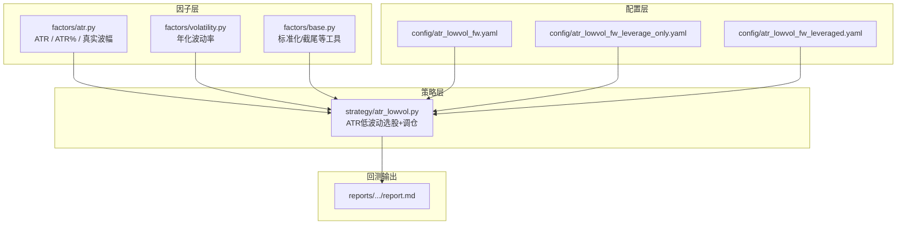
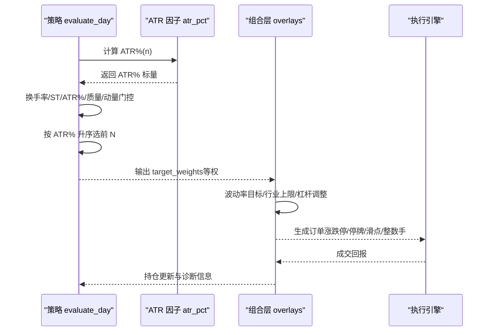
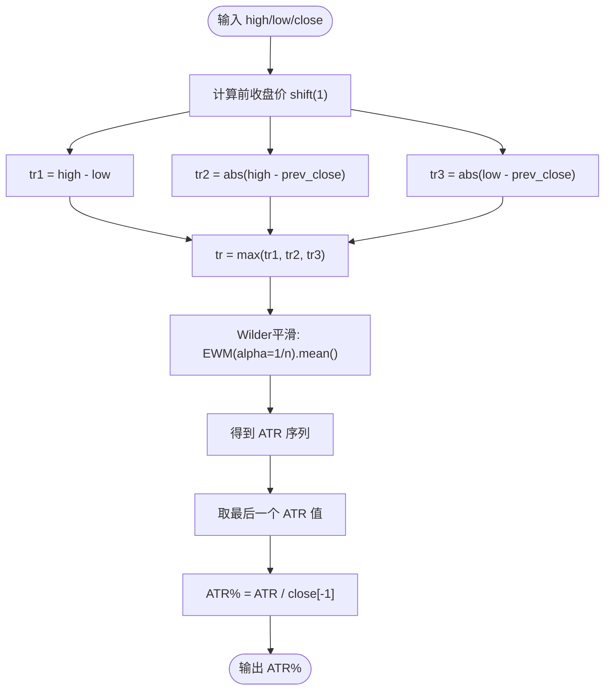
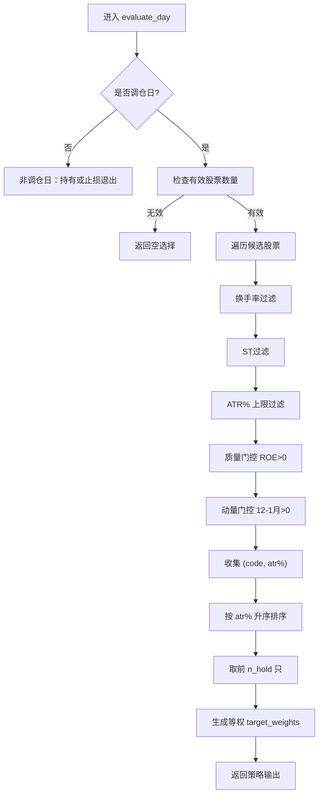
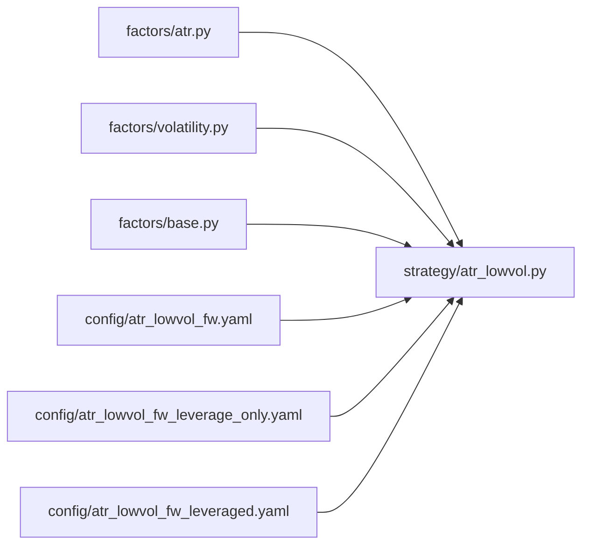

# ATR波动率因子

<cite>
**本文引用的文件**   
- [factors/atr.py](file://factors/atr.py)
- [strategy/atr_lowvol.py](file://strategy/atr_lowvol.py)
- [config/atr_lowvol_fw.yaml](file://config/atr_lowvol_fw.yaml)
- [config/atr_lowvol_fw_leverage_only.yaml](file://config/atr_lowvol_fw_leverage_only.yaml)
- [config/atr_lowvol_fw_leveraged.yaml](file://config/atr_lowvol_fw_leveraged.yaml)
- [factors/base.py](file://factors/base.py)
- [factors/volatility.py](file://factors/volatility.py)
- [reports/20260803_204830_513b7f_atr_lowvol_fw/report.md](file://reports/20260803_204830_513b7f_atr_lowvol_fw/report.md)
- [reports/20260803_205645_a7b4b3_atr_lowvol_fw_leverage_only/report.md](file://reports/20260803_205645_a7b4b3_atr_lowvol_fw_leverage_only/report.md)
</cite>

## 目录
1. [引言](#引言)
2. [项目结构](#项目结构)
3. [核心组件](#核心组件)
4. [架构总览](#架构总览)
5. [详细组件分析](#详细组件分析)
6. [依赖关系分析](#依赖关系分析)
7. [性能与实现特性](#性能与实现特性)
8. [回测结果与参数对比](#回测结果与参数对比)
9. [使用示例与策略集成](#使用示例与策略集成)
10. [参数配置说明](#参数配置说明)
11. [市场环境适用性与表现特征](#市场环境适用性与表现特征)
12. [调优建议与常见问题](#调优建议与常见问题)
13. [结论](#结论)

## 引言
本技术文档围绕 ATR（Average True Range，平均真实波幅）波动率因子展开，系统阐述其数学原理、计算流程、在策略中的标准化与信号生成机制，并结合仓库中“ATR低波动”策略给出完整的参数配置、回测对比与实践建议。读者无需深厚的量化背景即可理解 ATR 因子的设计思想与落地方式。

## 项目结构
与 ATR 因子相关的代码主要分布在以下模块：
- 因子计算：factors/atr.py（ATR、ATR%、真实波幅）
- 策略层：strategy/atr_lowvol.py（基于 ATR% 的低波动选股与调仓逻辑）
- 通用波动率工具：factors/volatility.py（年化波动率，用于组合层波动率目标/风险平价）
- 因子基类：factors/base.py（标准化、截尾等通用方法，供其他因子扩展）
- 回测配置：config/*.yaml（多套 ATR 低波动策略配置，含杠杆与非杠杆场景）
- 回测报告：reports/*（不同配置的业绩与日志摘要）

图表来源
- [factors/atr.py:1-43](file://factors/atr.py#L1-L43)
- [strategy/atr_lowvol.py:1-165](file://strategy/atr_lowvol.py#L1-L165)
- [factors/volatility.py:1-27](file://factors/volatility.py#L1-L27)
- [factors/base.py:1-52](file://factors/base.py#L1-L52)
- [config/atr_lowvol_fw.yaml:1-49](file://config/atr_lowvol_fw.yaml#L1-L49)
- [config/atr_lowvol_fw_leverage_only.yaml:1-48](file://config/atr_lowvol_fw_leverage_only.yaml#L1-L48)
- [config/atr_lowvol_fw_leveraged.yaml:1-47](file://config/atr_lowvol_fw_leveraged.yaml#L1-L47)
- [reports/20260803_204830_513b7f_atr_lowvol_fw/report.md:1-130](file://reports/20260803_204830_513b7f_atr_lowvol_fw/report.md#L1-L130)

章节来源
- [factors/atr.py:1-43](file://factors/atr.py#L1-L43)
- [strategy/atr_lowvol.py:1-165](file://strategy/atr_lowvol.py#L1-L165)
- [factors/volatility.py:1-27](file://factors/volatility.py#L1-L27)
- [factors/base.py:1-52](file://factors/base.py#L1-L52)
- [config/atr_lowvol_fw.yaml:1-49](file://config/atr_lowvol_fw.yaml#L1-L49)
- [config/atr_lowvol_fw_leverage_only.yaml:1-48](file://config/atr_lowvol_fw_leverage_only.yaml#L1-L48)
- [config/atr_lowvol_fw_leveraged.yaml:1-47](file://config/atr_lowvol_fw_leveraged.yaml#L1-L47)

## 核心组件
- ATR 因子计算
  - 真实波幅（True Range, TR）：取当日最高价与最低价之差、以及前收盘价与当日高低价的绝对差的最大值，以捕捉跳空缺口带来的波动。
  - ATR：对 TR 序列采用 Wilder 平滑（等价于指数移动平均，alpha=1/n），得到滚动窗口 n 的 ATR。
  - ATR%：将 ATR 除以最新收盘价，得到相对波动率指标，便于跨标的比较与阈值筛选。
- 策略层 ATR 低波动选股
  - 在调仓日，遍历可交易股票池，依次应用换手率区间过滤、ST 剔除、ATR% 上限过滤、质量门控（ROE>0）、动量门控（12-1月收益>0）。
  - 按 ATR% 升序排序，选取前 N 只作为目标权重（默认等权），交由框架组合层执行订单与风控。
- 通用波动率工具
  - 年化波动率：基于近 n 日收益率标准差乘以 sqrt(252)，用于组合层的波动率目标或风险平价配权。

章节来源
- [factors/atr.py:10-43](file://factors/atr.py#L10-L43)
- [strategy/atr_lowvol.py:78-165](file://strategy/atr_lowvol.py#L78-L165)
- [factors/volatility.py:6-27](file://factors/volatility.py#L6-L27)

## 架构总览
ATR 因子在系统中的角色如下：
- 因子层提供纯函数式计算（无副作用），输入为个股历史 DataFrame，输出为标量（ATR 或 ATR%）。
- 策略层在调仓日调用 atr_pct 进行横截面筛选，并输出 target_weights。
- 组合层根据 position_sizing、target_leverage、vol_target、industry_cap 等 overlay 参数完成最终下单与风控。

图表来源
- [strategy/atr_lowvol.py:78-165](file://strategy/atr_lowvol.py#L78-L165)
- [factors/atr.py:20-43](file://factors/atr.py#L20-L43)
- [factors/volatility.py:6-27](file://factors/volatility.py#L6-L27)

## 详细组件分析

### ATR 因子计算（ATR、ATR%、真实波幅）
- 真实波幅 TR 的计算考虑了跳空缺口，确保波动度量更稳健。
- ATR 采用 Wilder 平滑，等价于 alpha=1/n 的 EMA，具有较好的滞后性与稳定性。
- ATR% 消除了价格水平差异，适合横截面比较与阈值控制。

图表来源
- [factors/atr.py:10-43](file://factors/atr.py#L10-L43)

章节来源
- [factors/atr.py:10-43](file://factors/atr.py#L10-L43)

### 策略层：ATR 低波动选股与调仓
- 非调仓日：保持持仓；若触发止损则退出对应标的。
- 调仓日：
  - 数据有效性检查（市场窗口长度≥min_history）。
  - 逐股过滤：换手率区间、ST、ATR% 上限、质量（ROE>0）、动量（12-1月收益>0）。
  - 按 ATR% 升序选择前 N 只，输出等权 target_weights。
- 止损逻辑：持有期间若浮亏低于阈值（stop_loss），一次性退出该标的。

图表来源
- [strategy/atr_lowvol.py:78-165](file://strategy/atr_lowvol.py#L78-L165)

章节来源
- [strategy/atr_lowvol.py:37-165](file://strategy/atr_lowvol.py#L37-L165)

### 通用波动率工具（年化波动率）
- 基于最近 n 日收益率标准差乘以 sqrt(252) 估算年化波动率。
- 用于组合层的波动率目标（vol_target）与风险平价（vol_parity）配权。

章节来源
- [factors/volatility.py:6-27](file://factors/volatility.py#L6-L27)

## 依赖关系分析
- factors/atr.py 被 strategy/atr_lowvol.py 直接导入并使用 atr_pct。
- strategy/atr_lowvol.py 还依赖 factors.roe（质量门控）与 schedule（调仓频率判断）。
- factors/volatility.py 为组合层提供波动率估计，间接影响仓位与杠杆。
- 配置文件通过 strategy_params 驱动策略与组合层行为。

图表来源
- [strategy/atr_lowvol.py:1-165](file://strategy/atr_lowvol.py#L1-L165)
- [factors/atr.py:1-43](file://factors/atr.py#L1-L43)
- [factors/volatility.py:1-27](file://factors/volatility.py#L1-L27)
- [factors/base.py:1-52](file://factors/base.py#L1-L52)
- [config/atr_lowvol_fw.yaml:1-49](file://config/atr_lowvol_fw.yaml#L1-L49)
- [config/atr_lowvol_fw_leverage_only.yaml:1-48](file://config/atr_lowvol_fw_leverage_only.yaml#L1-L48)
- [config/atr_lowvol_fw_leveraged.yaml:1-47](file://config/atr_lowvol_fw_leveraged.yaml#L1-L47)

章节来源
- [strategy/atr_lowvol.py:1-165](file://strategy/atr_lowvol.py#L1-L165)
- [factors/atr.py:1-43](file://factors/atr.py#L1-L43)
- [factors/volatility.py:1-27](file://factors/volatility.py#L1-L27)
- [factors/base.py:1-52](file://factors/base.py#L1-L52)
- [config/atr_lowvol_fw.yaml:1-49](file://config/atr_lowvol_fw.yaml#L1-L49)
- [config/atr_lowvol_fw_leverage_only.yaml:1-48](file://config/atr_lowvol_fw_leverage_only.yaml#L1-L48)
- [config/atr_lowvol_fw_leveraged.yaml:1-47](file://config/atr_lowvol_fw_leveraged.yaml#L1-L47)

## 性能与实现特性
- 向量化计算：ATR 与 ATR% 使用 pandas/numpy 向量化操作，避免逐行循环，提升计算效率。
- 鲁棒性处理：对缺失值与异常值（如 NaN、close<=0）进行保护，返回 0 或跳过。
- 低延迟：因子计算为纯函数，无状态副作用，便于并行化与批量回测。
- 组合层叠加：position_sizing、vol_target、industry_cap、target_leverage 等 overlay 参数在不改动策略逻辑的前提下增强风险控制与资金利用率。

章节来源
- [factors/atr.py:10-43](file://factors/atr.py#L10-L43)
- [factors/volatility.py:6-27](file://factors/volatility.py#L6-L27)
- [strategy/atr_lowvol.py:78-165](file://strategy/atr_lowvol.py#L78-L165)

## 回测结果与参数对比
- 基准配置（atr_lowvol_fw.yaml）：季度调仓、等权、无杠杆、ATR% 上限 0.06、n_hold=100。
  - 总收益约 63.86%，年化约 18.69%，最大回撤约 -17.68%，夏普约 0.927，胜率约 84.08%。
- 纯杠杆配置（atr_lowvol_fw_leverage_only.yaml）：季度调仓、等权、两融杠杆 1.5x、关闭 vol_target。
  - 总收益约 79.82%，年化约 23.36%，最大回撤约 -26.70%，夏普约 0.799，胜率约 83.00%。
- 全开组合层（atr_lowvol_fw_leveraged.yaml）：季度调仓、vol_parity、两融杠杆 1.5x、vol_target=0.10、industry_cap=0.15、n_hold=50。
  - 该配置演示“任何策略即插即跑 + 真实约束 + 15%+ 路径”，具体业绩见对应报告。

章节来源
- [reports/20260803_204830_513b7f_atr_lowvol_fw/report.md:15-26](file://reports/20260803_204830_513b7f_atr_lowvol_fw/report.md#L15-L26)
- [reports/20260803_205645_a7b4b3_atr_lowvol_fw_leverage_only/report.md:15-26](file://reports/20260803_205645_a7b4b3_atr_lowvol_fw_leverage_only/report.md#L15-L26)
- [config/atr_lowvol_fw.yaml:29-49](file://config/atr_lowvol_fw.yaml#L29-L49)
- [config/atr_lowvol_fw_leverage_only.yaml:29-48](file://config/atr_lowvol_fw_leverage_only.yaml#L29-L48)
- [config/atr_lowvol_fw_leveraged.yaml:28-47](file://config/atr_lowvol_fw_leveraged.yaml#L28-L47)

## 使用示例与策略集成
- 在策略中引入 atr_pct 并进行横截面筛选：
  - 读取 market_window[c] 的 DataFrame，调用 atr_pct(df, atr_win) 得到 ATR%。
  - 结合换手率、ST、质量、动量门控后，按 ATR% 升序选择前 n_hold 只。
  - 输出 target_weights（等权），由组合层执行订单与风控。
- 非调仓日：
  - 若 stop_loss 生效，逐只检查浮亏是否低于阈值，触发则退出该标的。

章节来源
- [strategy/atr_lowvol.py:110-165](file://strategy/atr_lowvol.py#L110-L165)
- [factors/atr.py:34-43](file://factors/atr.py#L34-L43)

## 参数配置说明
- ATR 周期（atr_win）：默认 14，控制 ATR 平滑窗口，越大越平滑但滞后更强。
- ATR% 上限（atr_pct_max）：默认 0.06，用于低波动筛选，越小越保守。
- 换手率区间（turnover_min/max）：默认 1.0%-8.0%，过滤流动性过低的标的。
- 质量门控（quality_gate）：默认开启，要求 ROE>0。
- 动量门控（momentum_gate）：默认开启，要求 12-1 月收益>0。
- 止损阈值（stop_loss）：默认 -0.08，持有期浮亏超过阈值即退出。
- 组合层参数：
  - position_sizing：equal|vol_parity|custom
  - target_leverage：>1 启用两融（自动计提利息）
  - vol_target：>0 启用波动率目标
  - industry_cap：>0 启用行业上限
  - max_positions/min_position_value：头寸数量与最小市值限制
  - vol_window：波动率估计窗口（默认 60）
  - margin_interest_rate：两融利率（默认 0.06）

章节来源
- [config/atr_lowvol_fw.yaml:29-49](file://config/atr_lowvol_fw.yaml#L29-L49)
- [config/atr_lowvol_fw_leverage_only.yaml:29-48](file://config/atr_lowvol_fw_leverage_only.yaml#L29-L48)
- [config/atr_lowvol_fw_leveraged.yaml:28-47](file://config/atr_lowvol_fw_leveraged.yaml#L28-L47)
- [strategy/atr_lowvol.py:81-94](file://strategy/atr_lowvol.py#L81-L94)

## 市场环境适用性与表现特征
- 震荡市与慢牛环境：ATR% 低波动因子通常能捕获稳定上涨的低波动标的，夏普较高、回撤可控。
- 高波动与熊市：ATR% 可能整体抬升，导致可入选标的减少；需适当放宽 atr_pct_max 或缩短 atr_win。
- 流动性不足市场：换手率过滤可有效规避流动性陷阱，但在极端行情下可能错失机会。
- 杠杆环境：两融杠杆放大收益与回撤，需配合 vol_target 与 industry_cap 控制风险。

[本节为概念性内容，不直接分析具体文件]

## 调优建议与常见问题
- 参数调优建议
  - atr_win：短期趋势用较小窗口（如 7-10），长期稳健用较大窗口（如 14-20）。
  - atr_pct_max：根据市场波动中枢动态调整，牛市可适当提高，熊市降低。
  - turnover_min/max：根据市场流动性与交易成本优化，避免过高换手带来摩擦成本。
  - quality_gate/momentum_gate：在基本面恶化或动量反转时关闭或放宽。
  - stop_loss：根据标的波动特性设置，避免频繁止损。
- 常见问题与解决方案
  - 无可选标的：检查 min_history 是否过大、atr_pct_max 是否过小、换手率区间是否过窄。
  - 大量未成交订单（below_min_lot）：降低 n_hold 或提高 min_position_value，避开低价小盘股。
  - 回撤过大：启用 vol_target、industry_cap，或降低 target_leverage。
  - 计算异常（NaN/除零）：确保 close>0 且数据完整，因子已内置保护逻辑。

章节来源
- [strategy/atr_lowvol.py:95-165](file://strategy/atr_lowvol.py#L95-L165)
- [reports/20260803_204830_513b7f_atr_lowvol_fw/report.md:100-113](file://reports/20260803_204830_513b7f_atr_lowvol_fw/report.md#L100-L113)
- [reports/20260803_205645_a7b4b3_atr_lowvol_fw_leverage_only/report.md:105-118](file://reports/20260803_205645_a7b4b3_atr_lowvol_fw_leverage_only/report.md#L105-L118)

## 结论
ATR 波动率因子通过真实波幅与 Wilder 平滑提供了稳健的波动度量，ATR% 使其具备跨标的可比性。在“ATR低波动”策略中，ATR% 作为核心筛选指标，结合换手率、质量与动量门控，形成简洁有效的选股逻辑。配合组合层的波动率目标、行业上限与杠杆控制，可在不同市场环境下取得稳健的风险调整后收益。实践中应根据市场波动与流动性动态调参，并关注止损与未成交订单等细节问题。