# ROE质量因子

<cite>
**本文引用的文件**   
- [factors/roe.py](file://factors/roe.py)
- [factors/base.py](file://factors/base.py)
- [factors/engine.py](file://factors/engine.py)
- [data/astock_finance_reader.py](file://data/astock_finance_reader.py)
- [data/feed.py](file://data/feed.py)
- [data/industry_map.py](file://data/industry_map.py)
- [backtest/rebalance.py](file://backtest/rebalance.py)
- [projects/Project_01_多因子IC小盘Alpha/research/mfic_strategy/strategy_mfic_v2.py](file://projects/Project_01_多因子IC小盘Alpha/research/mfic_strategy/strategy_mfic_v2.py)
</cite>

## 目录
1. [简介](#简介)
2. [项目结构](#项目结构)
3. [核心组件](#核心组件)
4. [架构总览](#架构总览)
5. [详细组件分析](#详细组件分析)
6. [依赖关系分析](#依赖关系分析)
7. [性能考量](#性能考量)
8. [故障排查指南](#故障排查指南)
9. [结论](#结论)
10. [附录](#附录)

## 简介
本技术文档围绕ROE（净资产收益率）质量因子，系统阐述其计算方法、数据清洗与PIT（Point-in-Time）获取流程、标准化与行业中性化策略、评分体系与参数配置，并结合现有代码库给出可落地的实现路径与回测集成方式。文档面向量化研究与工程实现人员，兼顾可读性与可操作性。

## 项目结构
与ROE质量因子相关的核心模块分布如下：
- 因子计算与预处理：factors/*（roe.py、base.py、engine.py）
- 财务数据读取与PIT约束：data/astock_finance_reader.py、data/feed.py
- 行业映射与中性化支撑：data/industry_map.py
- 组合权重与再平衡：backtest/rebalance.py
- 策略层使用示例：projects/.../strategy_mfic_v2.py

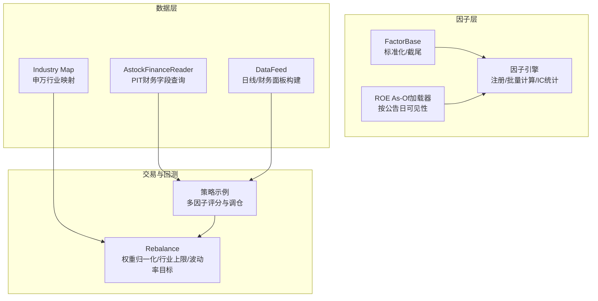

图表来源 
- [factors/base.py:1-52](file://factors/base.py#L1-L52)
- [factors/roe.py:1-43](file://factors/roe.py#L1-L43)
- [factors/engine.py:1-86](file://factors/engine.py#L1-L86)
- [data/astock_finance_reader.py:1-200](file://data/astock_finance_reader.py#L1-L200)
- [data/feed.py:1-197](file://data/feed.py#L1-L197)
- [data/industry_map.py:1-41](file://data/industry_map.py#L1-L41)
- [backtest/rebalance.py:50-249](file://backtest/rebalance.py#L50-L249)
- [projects/Project_01_多因子IC小盘Alpha/research/mfic_strategy/strategy_mfic_v2.py:30-229](file://projects/Project_01_多因子IC小盘Alpha/research/mfic_strategy/strategy_mfic_v2.py#L30-L229)

章节来源
- [factors/base.py:1-52](file://factors/base.py#L1-L52)
- [factors/roe.py:1-43](file://factors/roe.py#L1-L43)
- [factors/engine.py:1-86](file://factors/engine.py#L1-L86)
- [data/astock_finance_reader.py:1-200](file://data/astock_finance_reader.py#L1-L200)
- [data/feed.py:1-197](file://data/feed.py#L1-L197)
- [data/industry_map.py:1-41](file://data/industry_map.py#L1-L41)
- [backtest/rebalance.py:50-249](file://backtest/rebalance.py#L50-L249)
- [projects/Project_01_多因子IC小盘Alpha/research/mfic_strategy/strategy_mfic_v2.py:30-229](file://projects/Project_01_多因子IC小盘Alpha/research/mfic_strategy/strategy_mfic_v2.py#L30-L229)

## 核心组件
- ROE As-Of加载器：从fina_indicator.parquet中按ts_code分组、按end_date排序，基于asof_date取“公告日<=交易日”的最新可用ROE，避免未来函数。
- 因子基类：提供winsorize、zscore、rank_normalize等通用处理工具，便于统一因子口径。
- 因子引擎：负责因子注册、批量计算与截面IC统计，支持前向收益窗口与ICIR评估。
- AstockFinanceReader：PIT安全读取财务字段，优先f_ann_date否则ann_date，选取可见记录中最大end_date对应行。
- DataFeed：统一日线与财务数据接口，构建面板并做财务字段ffill对齐交易日序列。
- Industry Map：加载申万行业映射，用于行业中性化或行业暴露上限控制。
- Rebalance：权重归一化、行业上限裁剪、最小持仓价值过滤、波动率目标与杠杆缩放。
- 策略示例：将ROE与其他因子一起标准化后加权打分，筛选TOP N并执行买卖。

章节来源
- [factors/roe.py:1-43](file://factors/roe.py#L1-L43)
- [factors/base.py:1-52](file://factors/base.py#L1-L52)
- [factors/engine.py:1-86](file://factors/engine.py#L1-L86)
- [data/astock_finance_reader.py:1-200](file://data/astock_finance_reader.py#L1-L200)
- [data/feed.py:1-197](file://data/feed.py#L1-L197)
- [data/industry_map.py:1-41](file://data/industry_map.py#L1-L41)
- [backtest/rebalance.py:50-249](file://backtest/rebalance.py#L50-L249)
- [projects/Project_01_多因子IC小盘Alpha/research/mfic_strategy/strategy_mfic_v2.py:30-229](file://projects/Project_01_多因子IC小盘Alpha/research/mfic_strategy/strategy_mfic_v2.py#L30-L229)

## 架构总览
ROE质量因子的端到端流程如下：
- 数据源：fina_indicator.parquet（季度财务指标）、stock_daily.parquet（日频行情与估值快照）、stock_basic.parquet（行业映射）。
- PIT约束：以公告日为可见性边界，确保asof_date仅能看到已披露的财报信息。
- 因子计算：ROE As-Of读取或从PB/PE推导；标准化（截尾+Z-score或秩标准化）；可选行业中性化。
- 组合构建：多因子打分、权重分配、行业上限与波动率目标控制、最小持仓过滤。
- 回测与评估：截面IC/ICIR统计、前向收益关联、长期回测曲线与归因。

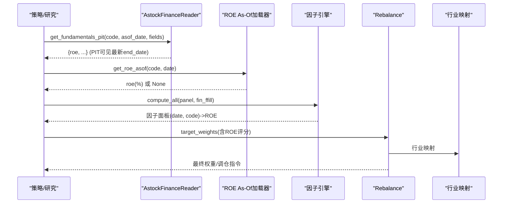

图表来源 
- [data/astock_finance_reader.py:66-129](file://data/astock_finance_reader.py#L66-L129)
- [factors/roe.py:15-43](file://factors/roe.py#L15-L43)
- [factors/engine.py:20-81](file://factors/engine.py#L20-L81)
- [backtest/rebalance.py:101-249](file://backtest/rebalance.py#L101-L249)
- [data/industry_map.py:16-36](file://data/industry_map.py#L16-L36)

## 详细组件分析

### ROE As-Of加载器（factors/roe.py）
- 数据源：fina_indicator.parquet，列包含ts_code、end_date、roe。
- 缓存机制：进程级缓存by_code字典，存储每个股票的(end_date序列, roe序列)。
- PIT逻辑：对asof_date去“-”并截取前8位作为可比字符串，searchsorted在有序ed数组中定位<=asof_date的最大索引，返回对应roe值。
- 异常处理：缺失code或无历史公告则返回None。

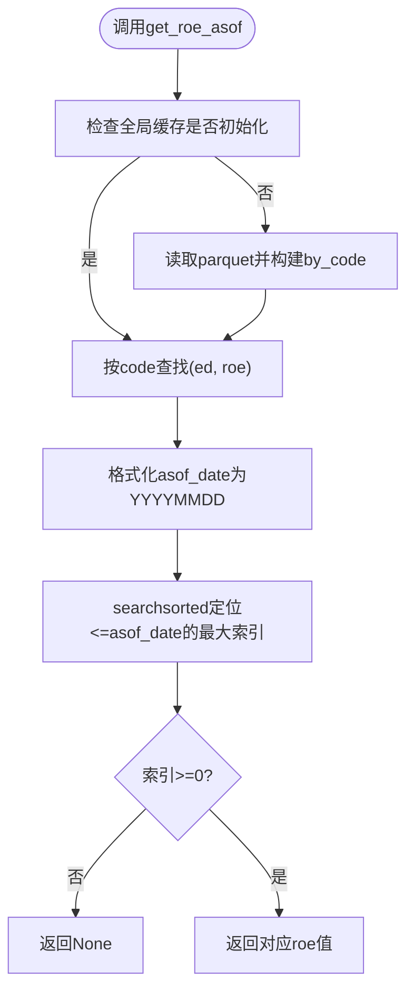

图表来源 
- [factors/roe.py:15-43](file://factors/roe.py#L15-L43)

章节来源
- [factors/roe.py:1-43](file://factors/roe.py#L1-43)

### 因子基类与标准化（factors/base.py）
- winsorize：按分位数截尾，默认1%~99%，防止极端值干扰。
- zscore：均值方差标准化，std为0或NaN时返回全NaN序列。
- rank_normalize：百分位排名标准化到[0,1]。

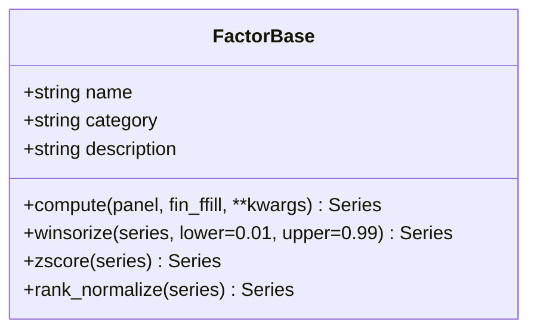

图表来源 
- [factors/base.py:9-52](file://factors/base.py#L9-L52)

章节来源
- [factors/base.py:1-52](file://factors/base.py#L1-52)

### 因子引擎（factors/engine.py）
- register：注册因子实例，维护name->factor映射。
- compute_all：遍历已注册因子，依次调用compute，捕获异常并打印失败信息，返回DataFrame。
- compute_ic：计算前向收益（close.pct_change(forward_days).shift(-forward_days)），逐日期截面计算因子与前向收益的相关系数（IC），汇总ic_mean、ic_std、icir、正IC比例与有效日期数。

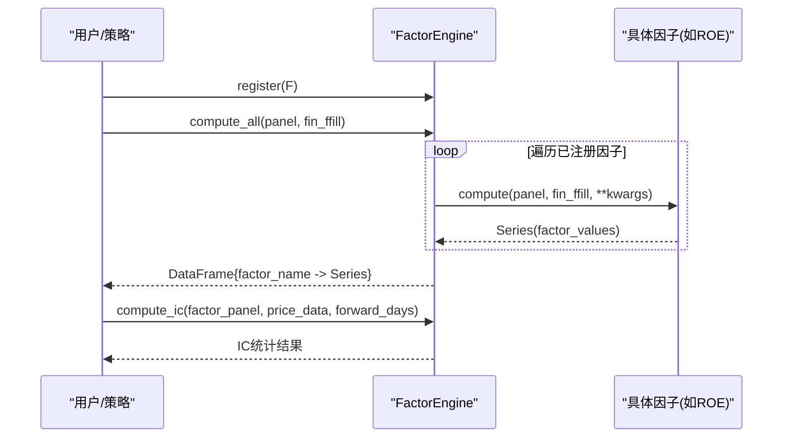

图表来源 
- [factors/engine.py:9-86](file://factors/engine.py#L9-L86)

章节来源
- [factors/engine.py:1-86](file://factors/engine.py#L1-86)

### 财务数据读取与PIT约束（data/astock_finance_reader.py）
- get_fundamentals_pit：按ts_code过滤，确定公告日列（优先f_ann_date，否则ann_date），保留announcement_date<=asof_date的记录，选择其中最大end_date的行，返回请求字段（NaN转为None）。
- get_daily_pe：从stock_daily.parquet按trade_date<=asof_date取最近交易日快照，返回静态PE与动态PE（pe_ttm）。
- get_fundamentals_for_scoring：批量构造评分所需fundamentals字典。

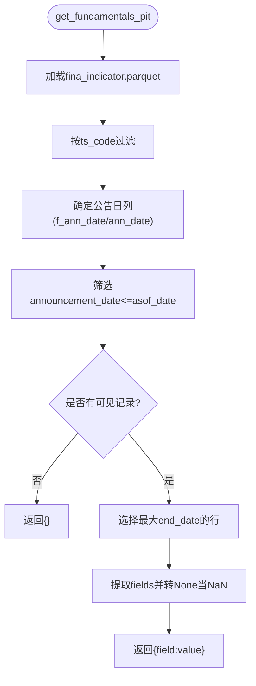

图表来源 
- [data/astock_finance_reader.py:66-129](file://data/astock_finance_reader.py#L66-L129)

章节来源
- [data/astock_finance_reader.py:1-200](file://data/astock_finance_reader.py#L1-L200)

### 面板与财务对齐（data/feed.py）
- get_universe：按成交额排序选取股票池。
- get_daily：从astock parquet读取日线，支持codes与日期范围过滤，输出MultiIndex DataFrame。
- get_financials：读取fina_indicator.parquet并按end_date透视，再按交易日序列ffill对齐。
- get_panel：便捷构建面板（含close、open、volume、amount、pe_ttm、pb、circ_mv、pct_chg、turnover_rate）与财务宽表fin_ffill。

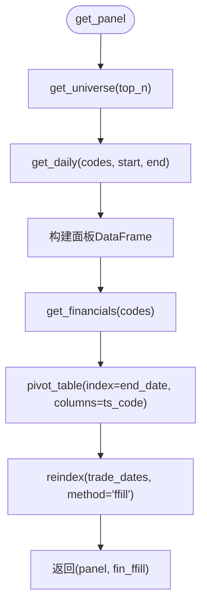

图表来源 
- [data/feed.py:137-181](file://data/feed.py#L137-L181)

章节来源
- [data/feed.py:1-197](file://data/feed.py#L1-L197)

### 行业映射（data/industry_map.py）
- load_industry_map：读取stock_basic.parquet的ts_code与industry列，构建ts_code->industry映射，进程级缓存。
- clear_cache：清空缓存。

章节来源
- [data/industry_map.py:1-41](file://data/industry_map.py#L1-L41)

### 权重与再平衡（backtest/rebalance.py）
- _normalize：对正权重进行归一化，负值置零。
- _apply_industry_cap：按行业组限制总权重，超限时按比例缩放。
- target_weights_to_decision：根据position_sizing（equal/vol_parity/custom）生成基础权重，应用行业上限、max_positions、min_position_value过滤，结合vol_target与target_leverage进行缩放，最终生成买卖决策。

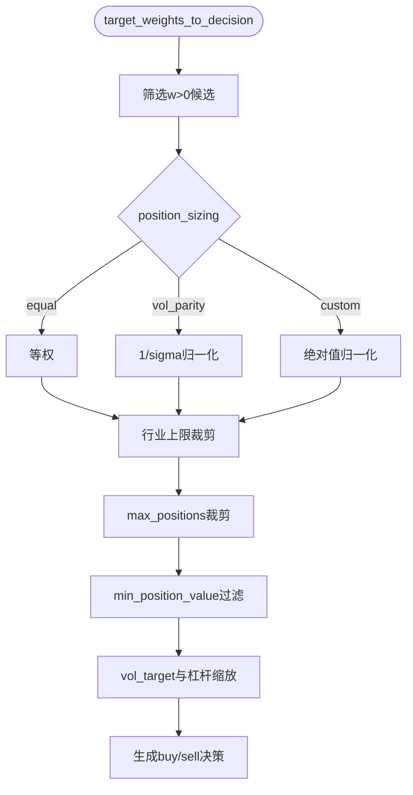

图表来源 
- [backtest/rebalance.py:57-249](file://backtest/rebalance.py#L57-L249)

章节来源
- [backtest/rebalance.py:50-249](file://backtest/rebalance.py#L50-L249)

### 策略层使用示例（strategy_mfic_v2.py）
- _normalize：先1%~99%截尾，再Z-score标准化，reverse=True表示反向（如低波、反转因子）。
- 多因子评分：BP、reversal_1m、volatility_60d、ROE分别标准化后按权重加权求和，选TOP N构建持仓。
- 调仓逻辑：卖出不在新池中的持仓，买入新标的，均分资金下单。

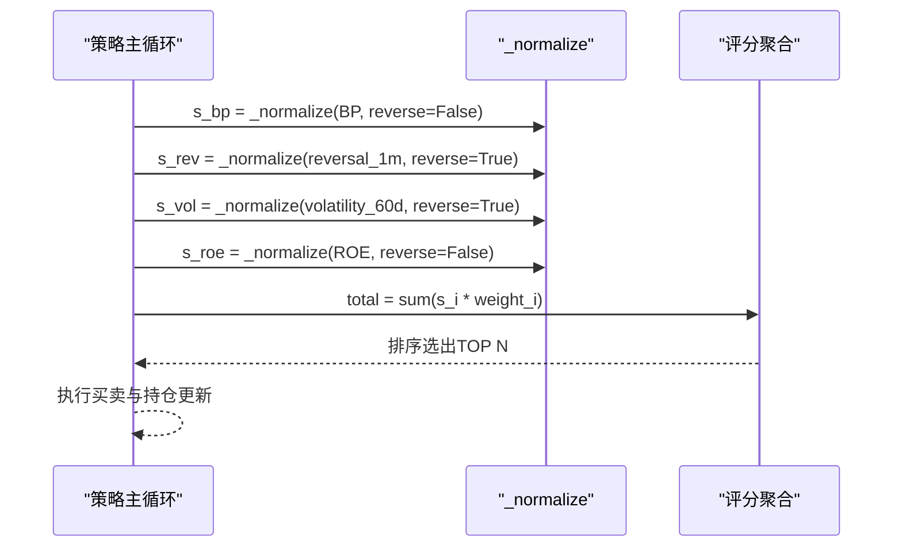

图表来源 
- [projects/Project_01_多因子IC小盘Alpha/research/mfic_strategy/strategy_mfic_v2.py:37-44](file://projects/Project_01_多因子IC小盘Alpha/research/mfic_strategy/strategy_mfic_v2.py#L37-L44)
- [projects/Project_01_多因子IC小盘Alpha/research/mfic_strategy/strategy_mfic_v2.py:350-416](file://projects/Project_01_多因子IC小盘Alpha/research/mfic_strategy/strategy_mfic_v2.py#L350-L416)

章节来源
- [projects/Project_01_多因子IC小盘Alpha/research/mfic_strategy/strategy_mfic_v2.py:30-229](file://projects/Project_01_多因子IC小盘Alpha/research/mfic_strategy/strategy_mfic_v2.py#L30-L229)
- [projects/Project_01_多因子IC小盘Alpha/research/mfic_strategy/strategy_mfic_v2.py:350-416](file://projects/Project_01_多因子IC小盘Alpha/research/mfic_strategy/strategy_mfic_v2.py#L350-L416)

## 依赖关系分析
- 因子层依赖数据层提供的panel与fin_ffill，以及行业映射用于中性化或上限控制。
- ROE As-Of加载器与AstockFinanceReader共同保证PIT正确性，避免未来函数。
- 因子引擎与策略层解耦，便于扩展更多因子与评估方法。
- Rebalance模块独立于因子计算，专注于权重落地与风险控制。

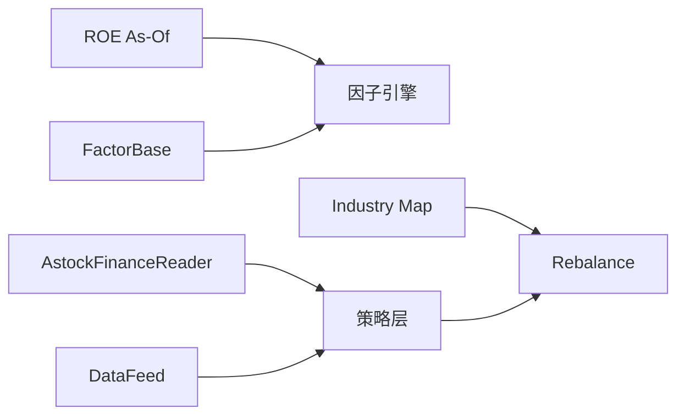

图表来源 
- [factors/roe.py:1-43](file://factors/roe.py#L1-L43)
- [factors/base.py:1-52](file://factors/base.py#L1-L52)
- [factors/engine.py:1-86](file://factors/engine.py#L1-L86)
- [data/astock_finance_reader.py:1-200](file://data/astock_finance_reader.py#L1-L200)
- [data/feed.py:1-197](file://data/feed.py#L1-L197)
- [data/industry_map.py:1-41](file://data/industry_map.py#L1-L41)
- [backtest/rebalance.py:50-249](file://backtest/rebalance.py#L50-L249)
- [projects/Project_01_多因子IC小盘Alpha/research/mfic_strategy/strategy_mfic_v2.py:30-229](file://projects/Project_01_多因子IC小盘Alpha/research/mfic_strategy/strategy_mfic_v2.py#L30-L229)

章节来源
- [factors/roe.py:1-43](file://factors/roe.py#L1-L43)
- [factors/base.py:1-52](file://factors/base.py#L1-L52)
- [factors/engine.py:1-86](file://factors/engine.py#L1-L86)
- [data/astock_finance_reader.py:1-200](file://data/astock_finance_reader.py#L1-L200)
- [data/feed.py:1-197](file://data/feed.py#L1-L197)
- [data/industry_map.py:1-41](file://data/industry_map.py#L1-L41)
- [backtest/rebalance.py:50-249](file://backtest/rebalance.py#L50-L249)
- [projects/Project_01_多因子IC小盘Alpha/research/mfic_strategy/strategy_mfic_v2.py:30-229](file://projects/Project_01_多因子IC小盘Alpha/research/mfic_strategy/strategy_mfic_v2.py#L30-L229)

## 性能考量
- 缓存优化：ROE As-Of加载器与行业映射均采用进程级缓存，减少重复IO。
- 列裁剪：读取parquet时仅选择必要列，降低内存占用。
- 时间复杂度：ROE As-Of通过searchsorted在有序end_date上二分查找，近似O(logN)；截面IC计算为每日截面相关，复杂度与股票数量线性相关。
- 内存管理：DataFeed与AstockFinanceReader在必要时释放缓存，避免长时间运行导致内存膨胀。

章节来源
- [factors/roe.py:15-43](file://factors/roe.py#L15-L43)
- [data/industry_map.py:16-36](file://data/industry_map.py#L16-L36)
- [data/feed.py:71-104](file://data/feed.py#L71-L104)
- [factors/engine.py:34-81](file://factors/engine.py#L34-L81)

## 故障排查指南
- 财务数据缺失：若asof_date早于任何公告日，ROE As-Of返回None；需检查数据覆盖区间与asof_date设置。
- 字段不存在：AstockFinanceReader在fields不在row.index时返回None；确认fina_indicator.parquet字段名一致。
- 行业映射缺失：stock_basic.parquet缺少industry列或路径错误会抛出FileNotFoundError；检查路径与文件完整性。
- 因子计算异常：FactorEngine.compute_all捕获异常并打印失败信息；建议逐个因子调试compute实现。
- 权重为空：Rebalance._normalize在sum<=0时返回全零权重；检查候选集与过滤条件是否过严。

章节来源
- [factors/roe.py:26-34](file://factors/roe.py#L26-L34)
- [data/astock_finance_reader.py:84-129](file://data/astock_finance_reader.py#L84-L129)
- [data/industry_map.py:25-26](file://data/industry_map.py#L25-L26)
- [factors/engine.py:27-32](file://factors/engine.py#L27-L32)
- [backtest/rebalance.py:57-61](file://backtest/rebalance.py#L57-L61)

## 结论
ROE质量因子在本框架中具备完整的数据PIT保障、稳健的标准化与行业中性化能力，并与多因子评分、权重再平衡及回测评估无缝衔接。通过合理的参数配置与异常处理，可在价值投资场景中稳定发挥选股与组合增强作用。

## 附录

### ROE计算方法与质量评估标准
- 数学公式：ROE = 净利润 / 净资产 × 100%（百分比形式）。
- 数据源：fina_indicator.parquet中的roe字段；或在缺乏直接ROE时，可通过PB/PE推导：ROE ≈ PB / PE × 100。
- 质量评估：截面IC/ICIR为正且稳定、长期回测夏普比率与最大回撤表现良好、行业中性后仍保持显著Alpha。

章节来源
- [data/astock_finance_reader.py:22-23](file://data/astock_finance_reader.py#L22-L23)
- [projects/Project_01_多因子IC小盘Alpha/research/mfic_strategy/strategy_mfic_v2.py:144-147](file://projects/Project_01_多因子IC小盘Alpha/research/mfic_strategy/strategy_mfic_v2.py#L144-L147)
- [factors/engine.py:34-81](file://factors/engine.py#L34-L81)

### 财务数据清洗规则
- 缺失值处理：NaN转为None，不可用字段返回空字典；面板构建时对财务字段进行ffill对齐交易日序列。
- 异常值处理：采用1%~99%分位数截尾，避免极端值影响标准化与评分。
- PIT约束：仅使用announcement_date<=asof_date的记录，并选择最大end_date，确保不引入未来信息。

章节来源
- [data/astock_finance_reader.py:93-129](file://data/astock_finance_reader.py#L93-L129)
- [data/feed.py:168-179](file://data/feed.py#L168-L179)
- [factors/base.py:31-37](file://factors/base.py#L31-L37)

### ROE数据处理流程
- 读取：从fina_indicator.parquet按ts_code分组，构建end_date与roe序列。
- 排序与缓存：end_date升序排序，缓存by_code字典。
- 查询：对asof_date进行格式转换与二分查找，返回最新可用ROE。
- 替代方案：若无直接ROE，使用PB/PE推导。

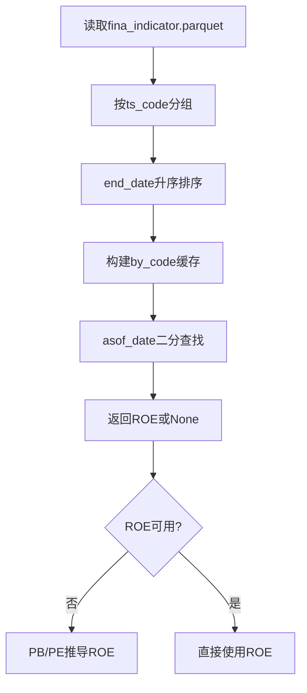

图表来源 
- [factors/roe.py:15-43](file://factors/roe.py#L15-L43)
- [projects/Project_01_多因子IC小盘Alpha/research/mfic_strategy/strategy_mfic_v2.py:144-147](file://projects/Project_01_多因子IC小盘Alpha/research/mfic_strategy/strategy_mfic_v2.py#L144-L147)

### 质量因子构建逻辑
- 标准化：截尾+Z-score或秩标准化，确保跨期可比性。
- 行业中性化：利用行业映射进行行业暴露上限控制或残差回归中性化（框架内提供上限裁剪）。
- 评分体系：多因子加权求和，方向由reverse参数控制（ROE通常正向）。

章节来源
- [factors/base.py:31-52](file://factors/base.py#L31-L52)
- [backtest/rebalance.py:64-82](file://backtest/rebalance.py#L64-L82)
- [projects/Project_01_多因子IC小盘Alpha/research/mfic_strategy/strategy_mfic_v2.py:37-44](file://projects/Project_01_多因子IC小盘Alpha/research/mfic_strategy/strategy_mfic_v2.py#L37-L44)

### 参数配置说明
- 财务数据周期：quarterly（fina_indicator.parquet），滚动ffill对齐交易日。
- 筛选条件：成交额top_n、市值区间、换手率阈值、最小持仓价值。
- 权重分配：equal/vol_parity/custom，行业上限industry_cap、目标波动率vol_target、目标杠杆target_leverage。
- 评分权重：各因子权重（如ROE权重）与方向（reverse=False表示正向）。

章节来源
- [data/feed.py:43-63](file://data/feed.py#L43-L63)
- [backtest/rebalance.py:118-196](file://backtest/rebalance.py#L118-L196)
- [projects/Project_01_多因子IC小盘Alpha/research/mfic_strategy/strategy_mfic_v2.py:350-362](file://projects/Project_01_多因子IC小盘Alpha/research/mfic_strategy/strategy_mfic_v2.py#L350-L362)

### 代码示例与使用指引
- 获取ROE As-Of：调用get_roe_asof(code, date)，返回百分比值或None。
- 获取PIT财务字段：调用get_fundamentals_pit(code, asof_date, fields=["roe", ...])。
- 构建面板：调用get_panel(start_date, end_date, top_n)获取panel与fin_ffill。
- 多因子评分：参考strategy_mfic_v2.py中的_normalize与加权求和逻辑。

章节来源
- [factors/roe.py:37-43](file://factors/roe.py#L37-L43)
- [data/astock_finance_reader.py:66-129](file://data/astock_finance_reader.py#L66-L129)
- [data/feed.py:137-181](file://data/feed.py#L137-L181)
- [projects/Project_01_多因子IC小盘Alpha/research/mfic_strategy/strategy_mfic_v2.py:37-44](file://projects/Project_01_多因子IC小盘Alpha/research/mfic_strategy/strategy_mfic_v2.py#L37-L44)

### 回测与评估
- IC/ICIR：使用FactorEngine.compute_ic计算截面相关与稳定性。
- 前向收益：默认20日窗口，可根据策略调整。
- 长期回测：结合Rebalance生成调仓指令，输出权益曲线与交易明细。

章节来源
- [factors/engine.py:34-81](file://factors/engine.py#L34-L81)
- [backtest/rebalance.py:101-249](file://backtest/rebalance.py#L101-L249)

### 优化建议与注意事项
- 数据质量：确保fina_indicator.parquet与stock_basic.parquet路径正确、字段完整。
- 参数敏感性：截尾分位数、标准化方法、行业上限与波动率目标需联合调优。
- 过拟合防范：控制因子数量与权重复杂度，使用IC稳定性与样本外验证。
- 实盘注意：订单滑点、流动性约束与交易成本需在回测中纳入评估。

章节来源
- [data/industry_map.py:25-26](file://data/industry_map.py#L25-L26)
- [backtest/rebalance.py:118-196](file://backtest/rebalance.py#L118-L196)
- [factors/engine.py:34-81](file://factors/engine.py#L34-L81)