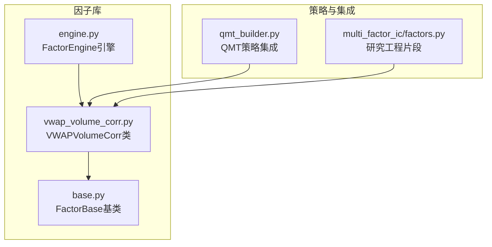
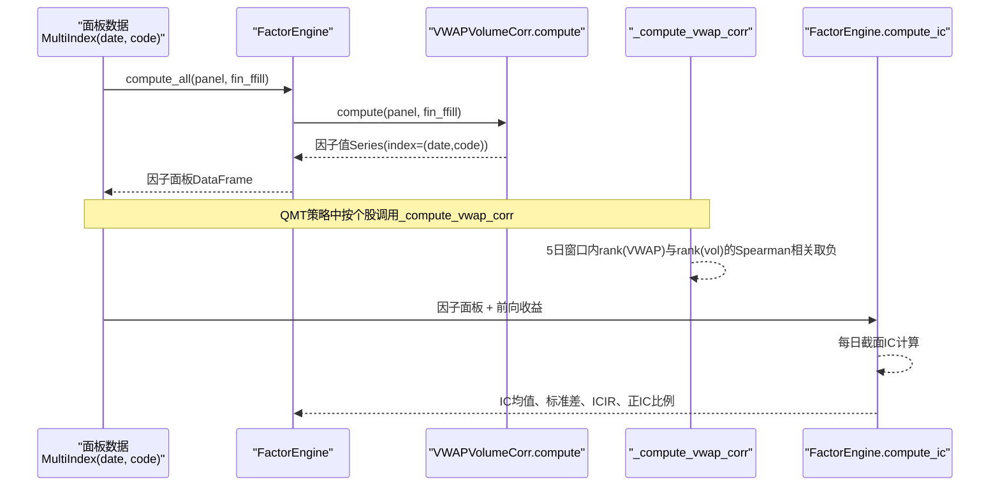
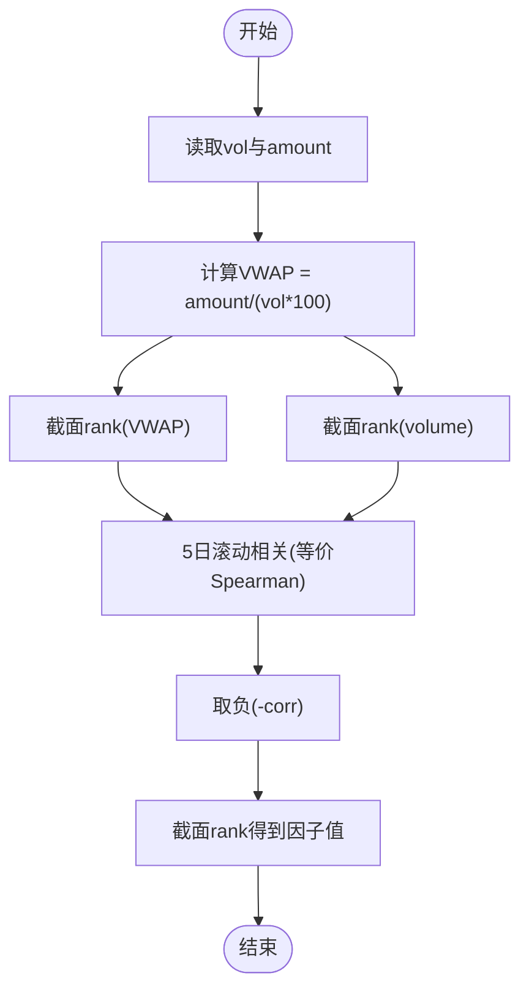
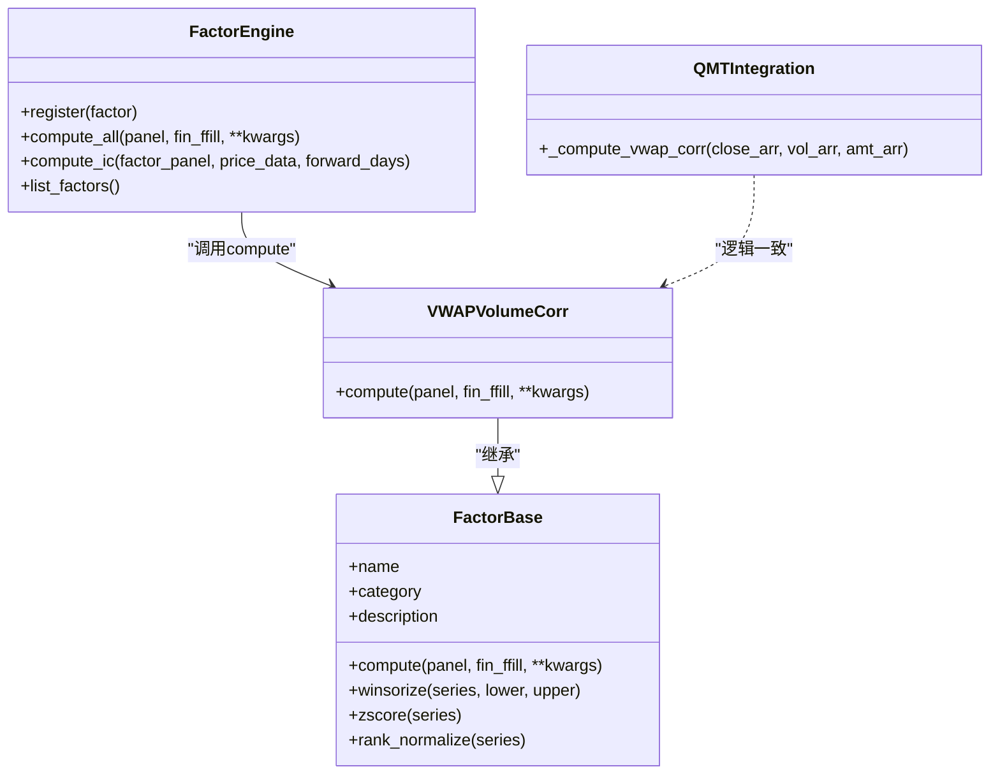

# VWAP成交量相关性因子

<cite>
**本文引用的文件**   
- [factors/vwap_volume_corr.py](file://factors/vwap_volume_corr.py)
- [factors/base.py](file://factors/base.py)
- [factors/engine.py](file://factors/engine.py)
- [broker/qmt_builder.py](file://broker/qmt_builder.py)
- [projects/Project_01_多因子IC小盘Alpha/research/multi_factor_ic/factors.py](file://projects/Project_01_多因子IC小盘Alpha/research/multi_factor_ic/factors.py)
</cite>

## 目录
1. [简介](#简介)
2. [项目结构](#项目结构)
3. [核心组件](#核心组件)
4. [架构总览](#架构总览)
5. [详细组件分析](#详细组件分析)
6. [依赖关系分析](#依赖关系分析)
7. [性能考量](#性能考量)
8. [故障排查指南](#故障排查指南)
9. [结论](#结论)
10. [附录：参数配置与使用示例](#附录参数配置与使用示例)

## 简介
本技术文档围绕“VWAP成交量相关性因子”展开，系统阐述其计算方法、金融意义、实现原理、信号生成逻辑、参数配置与调优建议，并结合代码仓库中的实际实现进行说明。该因子基于成交均价（VWAP）与成交量的时序相关性，通过Spearman秩相关捕捉量价联动特征，并在截面维度进行标准化排名，用于多因子选股或策略评分。

## 项目结构
与VWAP成交量相关性因子相关的代码主要分布在以下模块：
- 因子定义与计算：factors/vwap_volume_corr.py
- 因子基类与通用工具：factors/base.py
- 因子引擎（注册、批量计算、IC统计）：factors/engine.py
- QMT策略集成与单只股票计算：broker/qmt_builder.py
- 多因子研究工程中的因子计算片段：projects/.../multi_factor_ic/factors.py

图表来源
- [factors/vwap_volume_corr.py:18-67](file://factors/vwap_volume_corr.py#L18-L67)
- [factors/base.py:9-52](file://factors/base.py#L9-L52)
- [factors/engine.py:9-86](file://factors/engine.py#L9-L86)
- [broker/qmt_builder.py:143-161](file://broker/qmt_builder.py#L143-L161)
- [projects/Project_01_多因子IC小盘Alpha/research/multi_factor_ic/factors.py:104-139](file://projects/Project_01_多因子IC小盘Alpha/research/multi_factor_ic/factors.py#L104-L139)

章节来源
- [factors/vwap_volume_corr.py:1-115](file://factors/vwap_volume_corr.py#L1-L115)
- [factors/base.py:1-52](file://factors/base.py#L1-L52)
- [factors/engine.py:1-86](file://factors/engine.py#L1-L86)
- [broker/qmt_builder.py:140-339](file://broker/qmt_builder.py#L140-339)
- [projects/Project_01_多因子IC小盘Alpha/research/multi_factor_ic/factors.py:100-140](file://projects/Project_01_多因子IC小盘Alpha/research/multi_factor_ic/factors.py#L100-L140)

## 核心组件
- VWAPVolumeCorr类：继承自FactorBase，提供全时段面板数据上的VWAP量价相关性计算接口。
- FactorBase基类：抽象出compute接口及常用标准化方法（如zscore、rank_normalize等）。
- FactorEngine：负责因子注册、批量计算以及IC/ICIR统计。
- QMT集成函数_compute_vwap_corr：面向单只股票的向量化实现，便于实盘或回测中逐股快速计算。
- 研究工程片段：展示在研究流程中如何以宽表+滚动相关的方式高效计算该因子。

章节来源
- [factors/vwap_volume_corr.py:18-67](file://factors/vwap_volume_corr.py#L18-L67)
- [factors/base.py:9-52](file://factors/base.py#L9-L52)
- [factors/engine.py:9-86](file://factors/engine.py#L9-L86)
- [broker/qmt_builder.py:143-161](file://broker/qmt_builder.py#L143-L161)
- [projects/Project_01_多因子IC小盘Alpha/research/multi_factor_ic/factors.py:104-139](file://projects/Project_01_多因子IC小盘Alpha/research/multi_factor_ic/factors.py#L104-L139)

## 架构总览
下图展示了从数据输入到因子输出、再到IC评估的整体流程，以及QMT策略中的集成点。

图表来源
- [factors/engine.py:20-81](file://factors/engine.py#L20-L81)
- [factors/vwap_volume_corr.py:28-67](file://factors/vwap_volume_corr.py#L28-L67)
- [broker/qmt_builder.py:143-161](file://broker/qmt_builder.py#L143-L161)

## 详细组件分析

### VWAP计算公式与金融意义
- VWAP（成交量加权平均价格）= amount / (volume × 100)，单位元/股。其中amount为成交额（元），volume为成交量（手），乘以100转换为股数。
- 金融意义：VWAP反映当日资金驱动的平均成交价格，结合成交量可衡量资金流入/流出对价格的影响强度。将VWAP与成交量做相关性分析，有助于识别“价格上涨伴随放量”或“上涨缩量”等量价行为模式。

章节来源
- [factors/vwap_volume_corr.py:41-42](file://factors/vwap_volume_corr.py#L41-L42)
- [broker/qmt_builder.py:151](file://broker/qmt_builder.py#L151)
- [projects/Project_01_多因子IC小盘Alpha/research/multi_factor_ic/factors.py:106](file://projects/Project_01_多因子IC小盘Alpha/research/multi_factor_ic/factors.py#L106)

### 相关性分析与时间序列处理
- 截面排名：对每个交易日内的所有股票，分别对VWAP和成交量进行截面排名（rank），得到两列秩序列。
- Spearman秩相关：由于对原始序列进行了排名，Pearson相关等价于Spearman秩相关。采用5日滚动窗口计算VWAP秩与成交量秩的相关系数，得到时序相关序列。
- 取负与截面排名：对滚动相关结果取负后，再进行截面排名，得到最终的因子值（越大表示相对更强的“负相关”特征）。

图表来源
- [factors/vwap_volume_corr.py:48-62](file://factors/vwap_volume_corr.py#L48-L62)
- [projects/Project_01_多因子IC小盘Alpha/research/multi_factor_ic/factors.py:122-129](file://projects/Project_01_多因子IC小盘Alpha/research/multi_factor_ic/factors.py#L122-L129)

章节来源
- [factors/vwap_volume_corr.py:48-67](file://factors/vwap_volume_corr.py#L48-L67)
- [projects/Project_01_多因子IC小盘Alpha/research/multi_factor_ic/factors.py:122-134](file://projects/Project_01_多因子IC小盘Alpha/research/multi_factor_ic/factors.py#L122-L134)

### 信号生成逻辑与交易信号转换
- 相关性系数计算：5日滚动窗口内，对VWAP秩与成交量秩计算相关系数，缺失值填充为0。
- 信号强度评估：对负相关系数进行截面排名，排名越高代表该股票在当前市场截面中具备更强的“负相关”特征。
- 交易信号转换：在多因子评分体系中，可将该因子作为子因子之一，参与权重合成；或在阈值筛选时，依据因子排名或绝对值设定买入/卖出条件。

章节来源
- [factors/vwap_volume_corr.py:55-62](file://factors/vwap_volume_corr.py#L55-L62)
- [broker/qmt_builder.py:297-300](file://broker/qmt_builder.py#L297-L300)

### 单日计算版本（兼容旧接口）
- compute_single函数：针对逐日调仓场景，返回目标日的截面因子值。包含边界处理（不足5日返回0）、停牌与无交易过滤（vol/amount>0）、缺失值填充等。

章节来源
- [factors/vwap_volume_corr.py:73-114](file://factors/vwap_volume_corr.py#L73-L114)

### QMT集成与单只股票实现
- _compute_vwap_corr：面向单只股票，使用最近5日数据计算VWAP与成交量的Spearman相关并取负。适用于QMT策略中逐股快速计算。

章节来源
- [broker/qmt_builder.py:143-161](file://broker/qmt_builder.py#L143-L161)

### 研究工程中的因子计算片段
- multi_factor_ic/factors.py：展示在研究流程中以宽表+rolling corr方式高效计算该因子，包含安全掩码（排除停牌/无交易）、缺失值填充等细节。

章节来源
- [projects/Project_01_多因子IC小盘Alpha/research/multi_factor_ic/factors.py:104-139](file://projects/Project_01_多因子IC小盘Alpha/research/multi_factor_ic/factors.py#L104-L139)

## 依赖关系分析
- VWAPVolumeCorr依赖FactorBase提供的抽象接口与标准化方法。
- FactorEngine依赖具体因子实现进行批量计算与IC统计。
- QMT策略直接调用_compute_vwap_corr进行单只股票计算。
- 研究工程片段复用相同的计算逻辑，确保一致性。

图表来源
- [factors/base.py:9-52](file://factors/base.py#L9-L52)
- [factors/vwap_volume_corr.py:18-67](file://factors/vwap_volume_corr.py#L18-L67)
- [factors/engine.py:9-86](file://factors/engine.py#L9-L86)
- [broker/qmt_builder.py:143-161](file://broker/qmt_builder.py#L143-L161)

章节来源
- [factors/base.py:9-52](file://factors/base.py#L9-L52)
- [factors/vwap_volume_corr.py:18-67](file://factors/vwap_volume_corr.py#L18-L67)
- [factors/engine.py:9-86](file://factors/engine.py#L9-L86)
- [broker/qmt_builder.py:143-161](file://broker/qmt_builder.py#L143-L161)

## 性能考量
- 向量化计算：使用pandas的unstack与rolling.corr进行向量化操作，避免慢速groupby-apply，提升计算效率。
- 缺失值处理：前4天数据不足时填充0，减少异常分支开销。
- 内存占用：宽表操作需考虑股票数量与时间跨度，必要时分块计算或限制窗口长度。
- 单只股票实现：QMT中的_compute_vwap_corr面向逐股计算，适合低延迟场景。

章节来源
- [factors/vwap_volume_corr.py:44-58](file://factors/vwap_volume_corr.py#L44-L58)
- [projects/Project_01_多因子IC小盘Alpha/research/multi_factor_ic/factors.py:107-126](file://projects/Project_01_多因子IC小盘Alpha/research/multi_factor_ic/factors.py#L107-L126)
- [broker/qmt_builder.py:143-161](file://broker/qmt_builder.py#L143-L161)

## 故障排查指南
- 缺少必要字段：若panel缺少vol或amount列，将抛出ValueError。检查数据源并确保字段完整。
- 数据不足：前4个交易日无法计算相关系数，默认返回0。确认时间窗口与起始日期。
- 停牌与无交易：当vol或amount为0或NaN时，整只股票被排除。检查数据质量与清洗逻辑。
- 缺失值填充：最终结果可能包含NaN，统一填充为0以保证稳定性。

章节来源
- [factors/vwap_volume_corr.py:38-42](file://factors/vwap_volume_corr.py#L38-L42)
- [factors/vwap_volume_corr.py:85-98](file://factors/vwap_volume_corr.py#L85-L98)
- [projects/Project_01_多因子IC小盘Alpha/research/multi_factor_ic/factors.py:112-116](file://projects/Project_01_多因子IC小盘Alpha/research/multi_factor_ic/factors.py#L112-L116)

## 结论
VWAP成交量相关性因子通过量价联动的Spearman秩相关捕捉市场微观结构特征，具有明确的金融意义与稳健的计算流程。其在多因子体系中的表现可通过IC统计进行评估，且在QMT策略与研究工程中均有成熟实现。合理设置参数与边界处理，可进一步提升因子的有效性与鲁棒性。

## 附录：参数配置与使用示例
- 计算周期：默认使用5日滚动窗口，保证足够的样本量同时保持敏感性。
- 相关性窗口：Spearman秩相关通过排名后的Pearson相关实现，无需额外参数。
- 阈值设置：可在多因子评分中进行归一化与权重分配，或在选股时依据因子排名设定阈值。
- 使用示例：
  - 全时段计算：通过FactorEngine.compute_all调用VWAPVolumeCorr.compute，返回因子面板。
  - 单日计算：使用compute_single获取目标日截面因子值，适用于逐日调仓。
  - QMT集成：在策略中调用_compute_vwap_corr进行单只股票计算，并参与评分合成。

章节来源
- [factors/engine.py:20-32](file://factors/engine.py#L20-L32)
- [factors/vwap_volume_corr.py:28-67](file://factors/vwap_volume_corr.py#L28-L67)
- [broker/qmt_builder.py:297-300](file://broker/qmt_builder.py#L297-L300)
- [projects/Project_01_多因子IC小盘Alpha/research/multi_factor_ic/factors.py:104-139](file://projects/Project_01_多因子IC小盘Alpha/research/multi_factor_ic/factors.py#L104-L139)