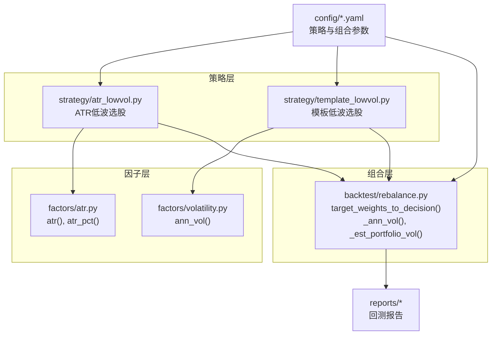
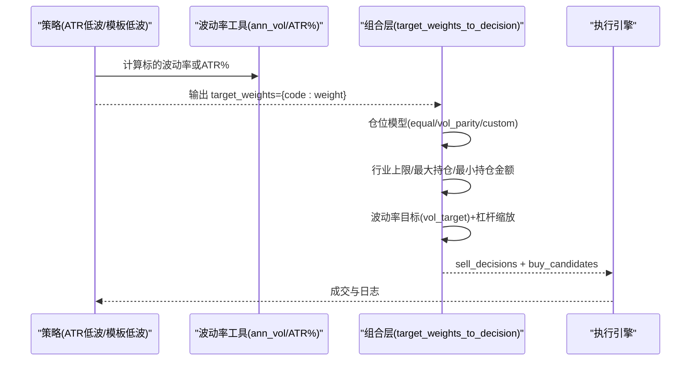
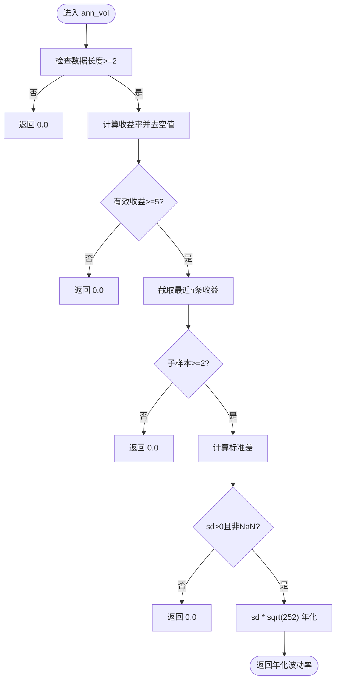
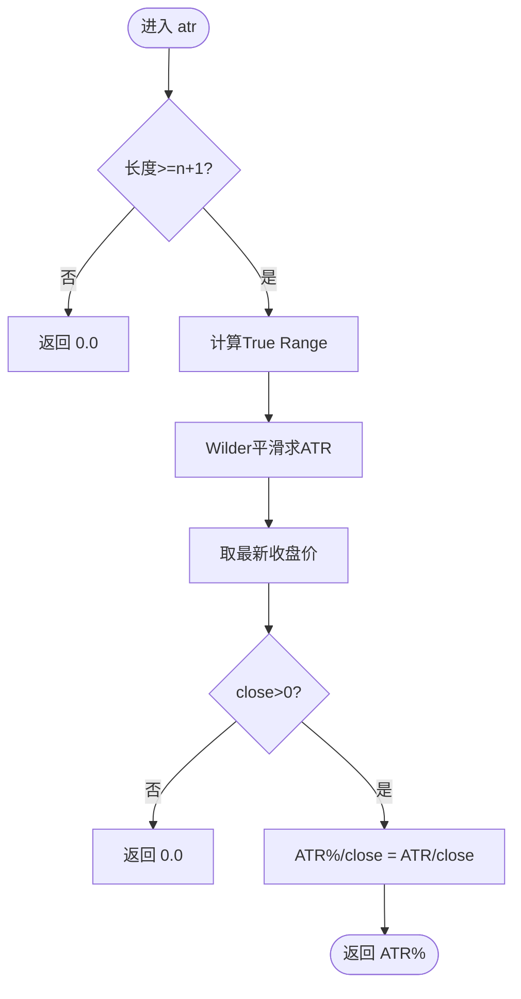
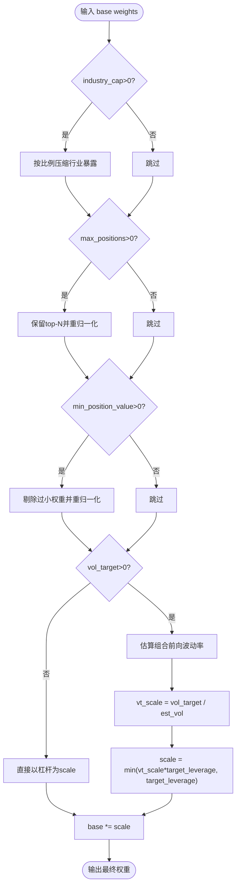
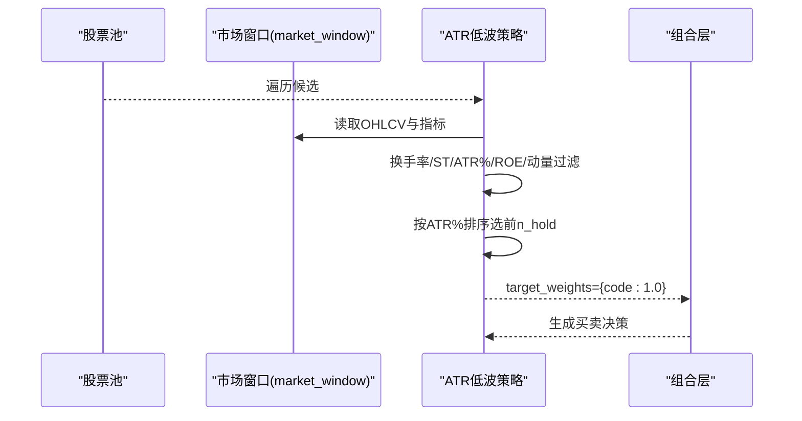
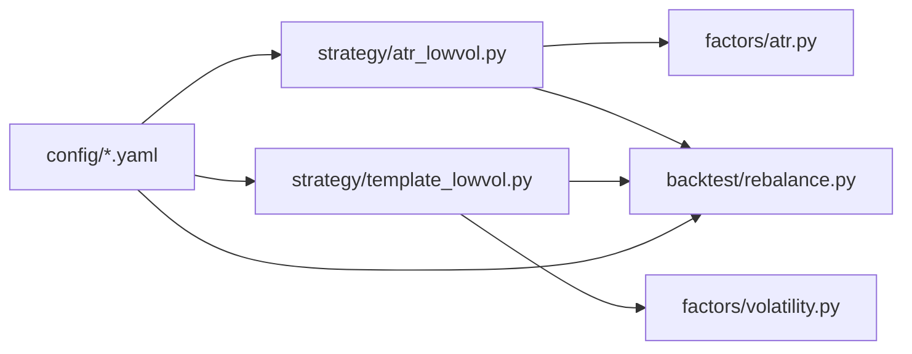

# 波动率因子

<cite>
**本文引用的文件**   
- [factors/volatility.py](file://factors/volatility.py)
- [factors/atr.py](file://factors/atr.py)
- [backtest/rebalance.py](file://backtest/rebalance.py)
- [strategy/atr_lowvol.py](file://strategy/atr_lowvol.py)
- [strategy/template_lowvol.py](file://strategy/template_lowvol.py)
- [config/atr_lowvol_fw.yaml](file://config/atr_lowvol_fw.yaml)
- [config/atr_lowvol_fw_leverage_only.yaml](file://config/atr_lowvol_fw_leverage_only.yaml)
- [reports/20260803_204830_513b7f_atr_lowvol_fw/report.md](file://reports/20260803_204830_513b7f_atr_lowvol_fw/report.md)
</cite>

## 目录
1. [引言](#引言)
2. [项目结构](#项目结构)
3. [核心组件](#核心组件)
4. [架构总览](#架构总览)
5. [详细组件分析](#详细组件分析)
6. [依赖关系分析](#依赖关系分析)
7. [性能与数值稳定性](#性能与数值稳定性)
8. [参数配置指南](#参数配置指南)
9. [实战示例与集成方式](#实战示例与集成方式)
10. [市场周期表现与有效性分析](#市场周期表现与有效性分析)
11. [调优策略与实战建议](#调优策略与实战建议)
12. [故障排查](#故障排查)
13. [结论](#结论)

## 引言
本技术文档围绕“波动率因子”在量化框架中的实现与应用展开，系统阐述历史波动率、ATR低波代理以及组合层波动率目标（vol-target）的计算方法、数据流与工程实现。同时给出参数配置、回测集成、风险控制与资产配置的应用要点，并结合实际回测报告总结在不同市场环境下的表现特征与优化方向。

## 项目结构
本项目将波动率相关能力分布在以下模块：
- 因子计算工具：factors/volatility.py（年化波动率）、factors/atr.py（ATR与ATR%）
- 策略层：strategy/atr_lowvol.py（ATR低波选股）、strategy/template_lowvol.py（模板低波选股）
- 组合风控层：backtest/rebalance.py（等权/波动率平价/行业上限/波动率目标/杠杆缩放）
- 配置与回测：config/*.yaml（策略与组合层参数），reports/*（回测结果）

图表来源 
- [factors/volatility.py:6-26](file://factors/volatility.py#L6-L26)
- [factors/atr.py:20-43](file://factors/atr.py#L20-L43)
- [backtest/rebalance.py:31-47](file://backtest/rebalance.py#L31-L47)
- [strategy/atr_lowvol.py:110-141](file://strategy/atr_lowvol.py#L110-L141)
- [strategy/template_lowvol.py:66-79](file://strategy/template_lowvol.py#L66-L79)

章节来源
- [factors/volatility.py:1-27](file://factors/volatility.py#L1-L27)
- [factors/atr.py:1-43](file://factors/atr.py#L1-L43)
- [backtest/rebalance.py:1-281](file://backtest/rebalance.py#L1-L281)
- [strategy/atr_lowvol.py:1-165](file://strategy/atr_lowvol.py#L1-L165)
- [strategy/template_lowvol.py:1-94](file://strategy/template_lowvol.py#L1-L94)
- [config/atr_lowvol_fw.yaml:1-49](file://config/atr_lowvol_fw.yaml#L1-L49)
- [config/atr_lowvol_fw_leverage_only.yaml:1-48](file://config/atr_lowvol_fw_leverage_only.yaml#L1-L48)
- [reports/20260803_204830_513b7f_atr_lowvol_fw/report.md:1-130](file://reports/20260803_204830_513b7f_atr_lowvol_fw/report.md#L1-L130)

## 核心组件
- 历史波动率估计（年化）：基于收盘价收益率序列的滚动标准差乘以年化处理系数
- ATR低波代理：ATR（Wilder平滑）除以最新收盘价得到ATR%，作为波动率代理用于选股
- 组合层波动率目标：根据个股波动率估计聚合为组合前向波动率估计，按目标波动率缩放权重，并与杠杆上限联合约束

章节来源
- [factors/volatility.py:6-26](file://factors/volatility.py#L6-L26)
- [factors/atr.py:20-43](file://factors/atr.py#L20-L43)
- [backtest/rebalance.py:31-47](file://backtest/rebalance.py#L31-L47)
- [backtest/rebalance.py:85-98](file://backtest/rebalance.py#L85-L98)
- [backtest/rebalance.py:179-195](file://backtest/rebalance.py#L179-L195)

## 架构总览
下图展示从策略信号到组合风控再到交易执行的完整流程，突出波动率在其中的作用位置。

图表来源 
- [strategy/atr_lowvol.py:110-141](file://strategy/atr_lowvol.py#L110-L141)
- [strategy/template_lowvol.py:66-79](file://strategy/template_lowvol.py#L66-L79)
- [backtest/rebalance.py:101-260](file://backtest/rebalance.py#L101-L260)

## 详细组件分析

### 历史波动率（年化）
- 输入：最近n个交易日的收盘价序列
- 步骤：计算对数或简单收益率序列→去空值→取最近n条→计算标准差→乘以sqrt(252)年化
- 边界处理：数据不足或标准差非正/NaN时返回0.0，保证下游稳健

图表来源 
- [factors/volatility.py:6-26](file://factors/volatility.py#L6-L26)

章节来源
- [factors/volatility.py:6-26](file://factors/volatility.py#L6-L26)

### ATR与ATR%（低波代理）
- True Range：max(H-L, |H-Cp|, |L-Cp|)
- ATR：Wilder平滑（等价于alpha=1/n的EMA）
- ATR%：ATR / 最新收盘价，作为无量纲波动率代理

图表来源 
- [factors/atr.py:20-43](file://factors/atr.py#L20-L43)

章节来源
- [factors/atr.py:10-43](file://factors/atr.py#L10-L43)

### 组合层波动率目标与风险叠加
- 波动率目标估计：对每个标的用滚动窗口估计年化波动率，按权重绝对值加权求和得到组合前向波动率估计（对角近似，保守估计）
- 缩放逻辑：vt_scale = vol_target / est_vol；最终scale = min(vt_scale * target_leverage, target_leverage)，确保不突破杠杆硬上限
- 其他叠加：等权/波动率平价/自定义权重→行业上限→最大持仓数→最小持仓金额→波动率目标+杠杆缩放

图表来源 
- [backtest/rebalance.py:101-260](file://backtest/rebalance.py#L101-L260)
- [backtest/rebalance.py:85-98](file://backtest/rebalance.py#L85-L98)
- [backtest/rebalance.py:179-195](file://backtest/rebalance.py#L179-L195)

章节来源
- [backtest/rebalance.py:31-47](file://backtest/rebalance.py#L31-L47)
- [backtest/rebalance.py:85-98](file://backtest/rebalance.py#L85-L98)
- [backtest/rebalance.py:179-195](file://backtest/rebalance.py#L179-L195)

### 策略：ATR低波选股
- 选股过滤：换手率区间、非ST、ATR%阈值、ROE>0（质量门控）、12-1月动量>0（动量门控）
- 排序与选择：按ATR%升序选取前n_hold只，返回等权意愿
- 调仓频率：由rebalance_freq控制（周/月/季）

图表来源 
- [strategy/atr_lowvol.py:99-141](file://strategy/atr_lowvol.py#L99-L141)
- [strategy/atr_lowvol.py:110-141](file://strategy/atr_lowvol.py#L110-L141)

章节来源
- [strategy/atr_lowvol.py:78-165](file://strategy/atr_lowvol.py#L78-L165)

### 策略：模板低波选股（基于ann_vol）
- 信号：使用ann_vol计算最近vol_window日波动率，选最低的前n_hold只
- 输出：等权意愿，交由组合层施加仓位模型与风险叠加

章节来源
- [strategy/template_lowvol.py:46-94](file://strategy/template_lowvol.py#L46-L94)
- [factors/volatility.py:6-26](file://factors/volatility.py#L6-L26)

## 依赖关系分析
- 策略依赖波动率工具：ATR低波策略依赖ATR%；模板低波策略依赖ann_vol
- 组合层独立实现波动率估计（_ann_vol）与组合波动率估计（_est_portfolio_vol），不依赖外部因子库
- 配置驱动：所有关键参数（窗口、频率、杠杆、行业上限、波动率目标等）来自yaml

图表来源 
- [strategy/atr_lowvol.py:110-141](file://strategy/atr_lowvol.py#L110-L141)
- [strategy/template_lowvol.py:66-79](file://strategy/template_lowvol.py#L66-L79)
- [backtest/rebalance.py:101-260](file://backtest/rebalance.py#L101-L260)
- [config/atr_lowvol_fw.yaml:29-49](file://config/atr_lowvol_fw.yaml#L29-L49)

章节来源
- [strategy/atr_lowvol.py:1-165](file://strategy/atr_lowvol.py#L1-L165)
- [strategy/template_lowvol.py:1-94](file://strategy/template_lowvol.py#L1-L94)
- [backtest/rebalance.py:1-281](file://backtest/rebalance.py#L1-L281)
- [config/atr_lowvol_fw.yaml:1-49](file://config/atr_lowvol_fw.yaml#L1-L49)
- [config/atr_lowvol_fw_leverage_only.yaml:1-48](file://config/atr_lowvol_fw_leverage_only.yaml#L1-L48)

## 性能与数值稳定性
- 时间复杂度：ann_vol与ATR均为O(n)滑动计算，适合逐股向量化实现
- 数值鲁棒性：对数据不足、收益率空值、标准差非正/NaN进行保护，避免传播异常
- 组合波动率估计采用对角近似，忽略相关性，保守估计有利于回测安全
- 建议：长窗口（如≥60）提升估计稳定性但降低灵敏度；短窗口更灵敏但噪声更大

章节来源
- [factors/volatility.py:6-26](file://factors/volatility.py#L6-L26)
- [factors/atr.py:20-43](file://factors/atr.py#L20-L43)
- [backtest/rebalance.py:85-98](file://backtest/rebalance.py#L85-L98)

## 参数配置指南
- 波动率估计窗口
  - ann_vol默认n=60（交易日）
  - atr默认n=14（交易日）
- 调仓频率
  - weekly/monthly/quarterly（通过rebalance_freq控制）
- 仓位模型
  - equal（等权）、vol_parity（波动率平价）、custom（自定义权重）
- 风险叠加
  - industry_cap：行业暴露上限
  - max_positions：最大持仓数
  - min_position_value：最小持仓金额
- 波动率目标与杠杆
  - vol_target：目标年化波动率（>0启用）
  - target_leverage：杠杆上限（>1启用两融计息）
  - margin_interest_rate：两融利率
- 示例配置路径
  - 基础配置：[config/atr_lowvol_fw.yaml:29-49](file://config/atr_lowvol_fw.yaml#L29-L49)
  - 纯杠杆验证：[config/atr_lowvol_fw_leverage_only.yaml:29-48](file://config/atr_lowvol_fw_leverage_only.yaml#L29-L48)

章节来源
- [config/atr_lowvol_fw.yaml:29-49](file://config/atr_lowvol_fw.yaml#L29-L49)
- [config/atr_lowvol_fw_leverage_only.yaml:29-48](file://config/atr_lowvol_fw_leverage_only.yaml#L29-L48)
- [backtest/rebalance.py:118-126](file://backtest/rebalance.py#L118-L126)

## 实战示例与集成方式
- 使用ATR低波策略
  - 选股逻辑：ATR%阈值+换手率+质量+动量门控
  - 输出：等权意愿，组合层自动完成下单与风控
  - 参考实现：[strategy/atr_lowvol.py:78-165](file://strategy/atr_lowvol.py#L78-L165)
- 使用模板低波策略
  - 信号：ann_vol最低的前n_hold只
  - 输出：等权意愿，组合层施加仓位模型与风险叠加
  - 参考实现：[strategy/template_lowvol.py:46-94](file://strategy/template_lowvol.py#L46-L94)
- 组合层关键函数
  - target_weights_to_decision：将策略意愿转换为可执行的买卖决策
  - _ann_vol/_est_portfolio_vol：波动率估计与组合前向波动率估计
  - 参考实现：[backtest/rebalance.py:101-260](file://backtest/rebalance.py#L101-L260)

章节来源
- [strategy/atr_lowvol.py:78-165](file://strategy/atr_lowvol.py#L78-L165)
- [strategy/template_lowvol.py:46-94](file://strategy/template_lowvol.py#L46-L94)
- [backtest/rebalance.py:101-260](file://backtest/rebalance.py#L101-L260)

## 市场周期表现与有效性分析
- 低波因子的典型特征
  - 震荡市：低波因子通常表现较好，回撤相对可控
  - 趋势牛市：低波可能跑输高动量因子
  - 危机期：低波具备一定防御属性，但需结合止损与流动性管理
- 回测参考
  - 基准回测报告显示年化约18.69%，最大回撤约-17.68%，夏普约0.927
  - 交易统计与持仓明细见报告文件
- 建议
  - 结合动量门控与质量筛选提升胜率
  - 在极端行情中引入动态止损与波动率目标调节仓位

章节来源
- [reports/20260803_204830_513b7f_atr_lowvol_fw/report.md:15-26](file://reports/20260803_204830_513b7f_atr_lowvol_fw/report.md#L15-L26)
- [strategy/atr_lowvol.py:125-137](file://strategy/atr_lowvol.py#L125-L137)

## 调优策略与实战建议
- 参数调优
  - 波动率窗口：60日较稳健，短窗口（如20-30）更灵敏但噪声大
  - ATR窗口：14日为常用，可根据品种波动特性调整
  - 换手率区间：过滤流动性陷阱，避免极端值
- 信号增强
  - 加入质量门控（ROE>0）与动量门控（12-1月收益>0）
  - 结合行业中性或行业上限控制集中度
- 风险控制
  - 启用vol_target稳定组合波动率
  - 设置止损（如ATR%触发）与最小持仓金额过滤
- 实战落地
  - 先用等权验证信号有效性，再切换vol_parity或custom
  - 逐步开启行业上限、max_positions、min_position_value等约束

章节来源
- [strategy/atr_lowvol.py:110-141](file://strategy/atr_lowvol.py#L110-L141)
- [backtest/rebalance.py:155-177](file://backtest/rebalance.py#L155-L177)
- [config/atr_lowvol_fw.yaml:29-49](file://config/atr_lowvol_fw.yaml#L29-L49)

## 故障排查
- 常见错误
  - 数据不足导致波动率为0：检查历史长度与窗口设置
  - 收益率空值过多：确认价格序列是否含停牌/缺失
  - 标准差非正/NaN：检查收益率计算与数据类型转换
  - 未成交订单（below_min_lot）：检查最小手数与资金分配
- 定位方法
  - 查看回测日志与诊断字段（candidate_total/candidate_passed/buy_count/sell_count）
  - 核对配置项（vol_window、position_sizing、target_leverage、vol_target）

章节来源
- [factors/volatility.py:12-26](file://factors/volatility.py#L12-L26)
- [factors/atr.py:22-43](file://factors/atr.py#L22-L43)
- [backtest/rebalance.py:245-260](file://backtest/rebalance.py#L245-L260)
- [reports/20260803_204830_513b7f_atr_lowvol_fw/report.md:100-113](file://reports/20260803_204830_513b7f_atr_lowvol_fw/report.md#L100-L113)

## 结论
本框架将波动率因子以模块化方式嵌入策略与组合层：策略层提供低波信号（ATR%或ann_vol），组合层负责波动率目标、杠杆与行业约束等风险叠加。该设计使波动率因子易于扩展与复用，既能支撑低波选股策略，也能作为通用风险度量工具服务于多策略组合。通过合理参数配置与风控叠加，可在不同市场环境中取得稳健的风险调整后收益。