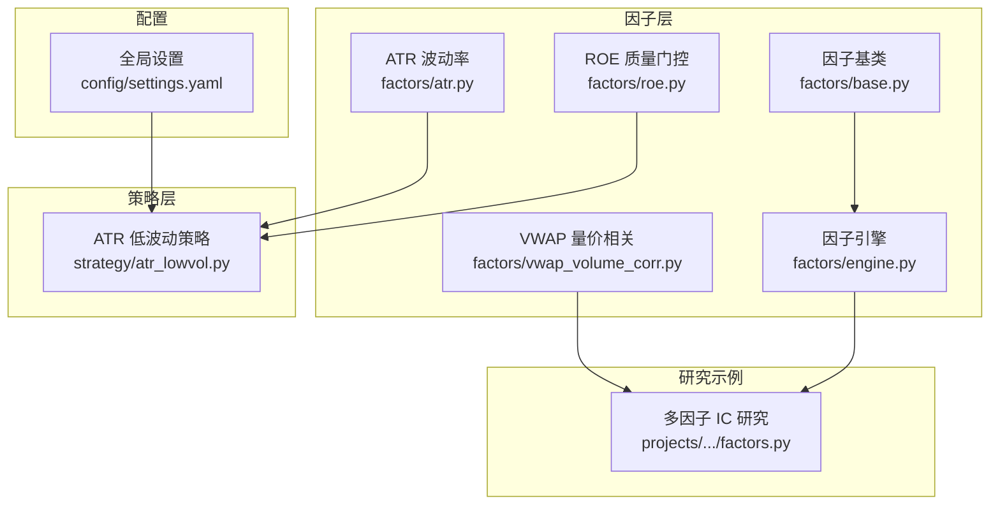
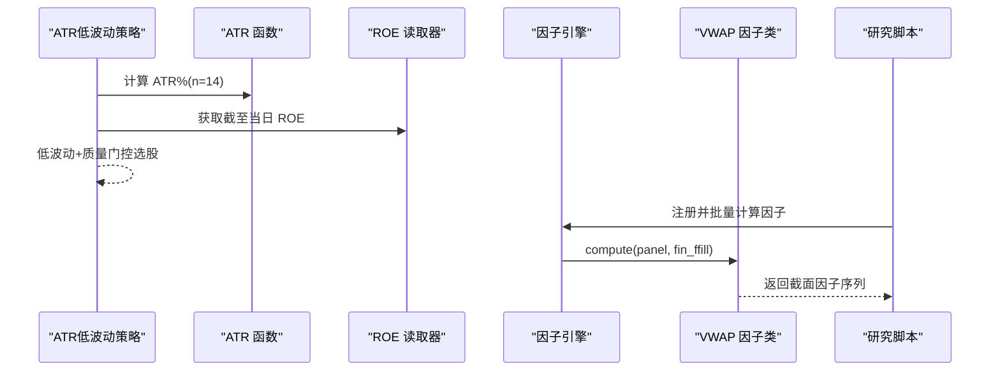
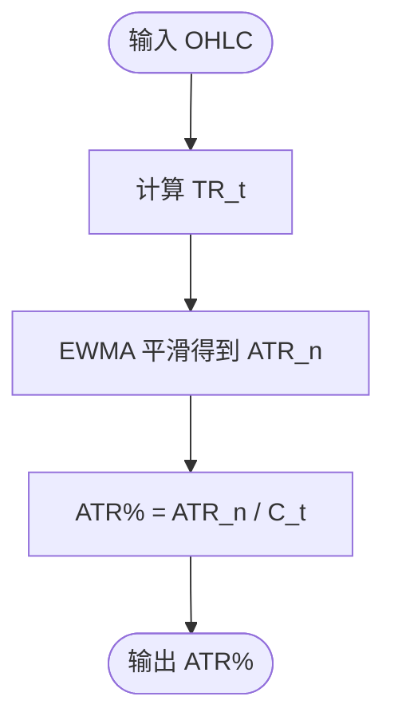
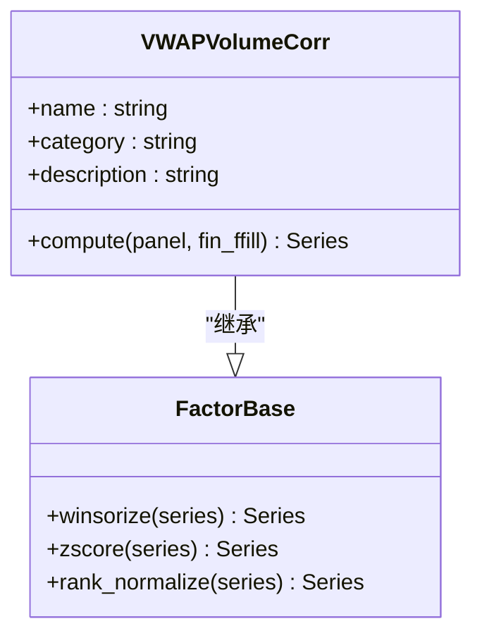
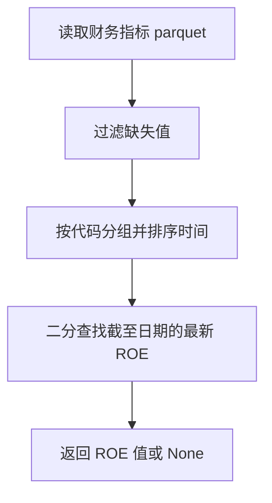
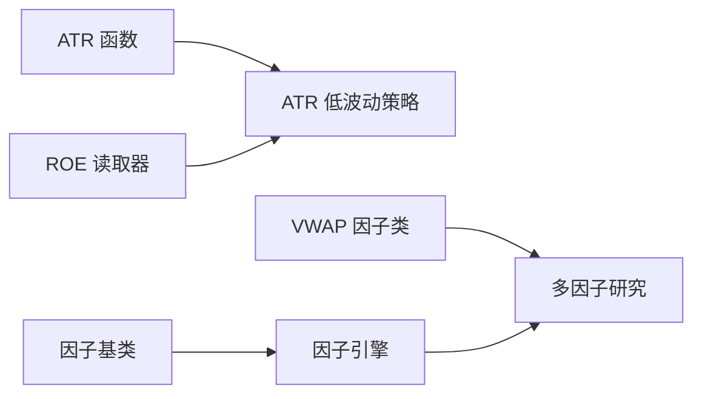

# 预定义因子库

<cite>
**本文引用的文件**   
- [factors/atr.py](file://factors/atr.py)
- [factors/vwap_volume_corr.py](file://factors/vwap_volume_corr.py)
- [factors/roe.py](file://factors/roe.py)
- [factors/base.py](file://factors/base.py)
- [factors/engine.py](file://factors/engine.py)
- [factors/__init__.py](file://factors/__init__.py)
- [strategy/atr_lowvol.py](file://strategy/atr_lowvol.py)
- [projects/Project_01_多因子IC小盘Alpha/research/multi_factor_ic/factors.py](file://projects/Project_01_多因子IC小盘Alpha/research/multi_factor_ic/factors.py)
- [config/settings.yaml](file://config/settings.yaml)
</cite>

## 目录
1. [引言](#引言)
2. [项目结构](#项目结构)
3. [核心组件](#核心组件)
4. [架构总览](#架构总览)
5. [详细组件分析](#详细组件分析)
6. [依赖关系分析](#依赖关系分析)
7. [性能考量](#性能考量)
8. [故障排查指南](#故障排查指南)
9. [结论](#结论)
10. [附录](#附录)

## 引言
本文件为 QuantLab 预定义因子库的权威文档，聚焦三大因子：ATR 波动率因子、VWAP 成交量相关性因子与 ROE 质量因子。内容涵盖计算逻辑、参数说明、使用示例、效果分析与组合策略建议，并给出回测要点与常见问题解决方案，帮助读者快速理解与落地应用。

## 项目结构
QuantLab 的因子模块位于 factors 目录，提供面向策略的函数式因子实现（如 ATR%）与面向框架的类式因子实现（如 VWAP 量价相关）。ROE 作为财务质量门控，通过点-in-time 读取最新可用财报数据。策略层 atr_lowvol 将 ATR% 与 ROE 门控结合，形成低波动选股策略。

图表来源 
- [factors/atr.py:1-43](file://factors/atr.py#L1-L43)
- [factors/vwap_volume_corr.py:1-115](file://factors/vwap_volume_corr.py#L1-L115)
- [factors/roe.py:1-43](file://factors/roe.py#L1-L43)
- [factors/base.py:1-52](file://factors/base.py#L1-L52)
- [factors/engine.py:1-86](file://factors/engine.py#L1-L86)
- [strategy/atr_lowvol.py:1-165](file://strategy/atr_lowvol.py#L1-L165)
- [projects/Project_01_多因子IC小盘Alpha/research/multi_factor_ic/factors.py:1-140](file://projects/Project_01_多因子IC小盘Alpha/research/multi_factor_ic/factors.py#L1-L140)
- [config/settings.yaml:1-69](file://config/settings.yaml#L1-L69)

章节来源
- [factors/__init__.py:1-8](file://factors/__init__.py#L1-L8)

## 核心组件
- ATR 波动率因子：基于真实波幅（True Range）与 Wilder 平滑，输出绝对 ATR 与相对 ATR%（ATR/close），用于波动率代理与低波动筛选。
- VWAP 量价相关性因子：以成交额/成交量计算 VWAP，对 VWAP 与成交量分别做截面排名后计算 5 日滚动 Spearman 相关，取负再截面排名，得到量价背离信号。
- ROE 质量因子：从财务指标文件中按“截至日期”加载最新可用 ROE，支持点-in-time 无未来信息泄露的质量门控。
- 因子基类与引擎：提供标准化、截尾、排序等工具方法；注册与批量计算因子，并提供 IC/ICIR 统计能力。

章节来源
- [factors/atr.py:10-43](file://factors/atr.py#L10-L43)
- [factors/vwap_volume_corr.py:18-67](file://factors/vwap_volume_corr.py#L18-L67)
- [factors/roe.py:15-43](file://factors/roe.py#L15-L43)
- [factors/base.py:9-52](file://factors/base.py#L9-L52)
- [factors/engine.py:9-86](file://factors/engine.py#L9-L86)

## 架构总览
下图展示因子在策略与研究中的调用路径：策略直接调用 ATR% 与 ROE 门控；研究示例中通过统一接口计算 VWAP 量价相关因子；因子引擎负责注册与批量计算及 IC 评估。

图表来源 
- [strategy/atr_lowvol.py:78-165](file://strategy/atr_lowvol.py#L78-L165)
- [factors/atr.py:20-43](file://factors/atr.py#L20-L43)
- [factors/roe.py:37-43](file://factors/roe.py#L37-L43)
- [factors/engine.py:20-32](file://factors/engine.py#L20-L32)
- [factors/vwap_volume_corr.py:28-67](file://factors/vwap_volume_corr.py#L28-L67)

## 详细组件分析

### ATR 波动率因子
- 计算逻辑
  - 真实波幅 TR = max(H-L, |H-Cp|, |L-Cp|)，其中 Cp 为前一日收盘。
  - ATR 采用 Wilder 平滑（等价于 EMA，alpha=1/n）。
  - ATR% = ATR / 收盘价，作为波动率代理。
- 关键参数
  - n：平滑窗口（默认 14）。
- 使用示例
  - 在 atr_lowvol 策略中，按 ATR% 升序选择低波动标的，并结合换手率、ST 过滤与 ROE>0 质量门控。
- 效果分析
  - ATR% 能稳健刻画短期波动水平，适合低波动策略的初筛；配合动量门控可剔除近期输家。
- 数学公式
  - TR_t = max(H_t - L_t, |H_t - C_{t-1}|, |L_t - C_{t-1}|)
  - ATR_n = EWMA(TR; alpha=1/n)
  - ATR% = ATR_n / C_t

图表来源 
- [factors/atr.py:10-43](file://factors/atr.py#L10-L43)

章节来源
- [factors/atr.py:10-43](file://factors/atr.py#L10-L43)
- [strategy/atr_lowvol.py:110-141](file://strategy/atr_lowvol.py#L110-L141)

### VWAP 成交量相关性因子
- 计算逻辑
  - VWAP = amount / (volume × 100)，单位元/股。
  - 对 VWAP 与 volume 分别做截面排名（Spearman 秩）。
  - 5 日滚动 Pearson 相关（在秩上等价 Spearman），取负后再做截面排名。
- 关键参数
  - window=5：滚动窗口长度。
- 使用示例
  - 在多因子研究中，作为量价类因子参与截面评分与 IC 测试。
- 效果分析
  - 该因子捕捉价格与成交量的短期背离，历史 ICIR 约 0.5，IC 均值约 0.033，稳定性约 70%（参考注释）。
- 数学公式
  - VWAP_t = Amount_t / (Volume_t × 100)
  - ρ_t = Corr(rank(VWAP_{t-4:t}), rank(Volume_{t-4:t}))
  - Factor_t = -rank(ρ_t)

图表来源 
- [factors/vwap_volume_corr.py:18-67](file://factors/vwap_volume_corr.py#L18-L67)
- [factors/base.py:9-52](file://factors/base.py#L9-L52)

章节来源
- [factors/vwap_volume_corr.py:18-67](file://factors/vwap_volume_corr.py#L18-L67)
- [projects/Project_01_多因子IC小盘Alpha/research/multi_factor_ic/factors.py:104-137](file://projects/Project_01_多因子IC小盘Alpha/research/multi_factor_ic/factors.py#L104-L137)

### ROE 质量因子
- 数据来源与处理
  - 从 parquet 文件读取 ts_code、end_date、roe，仅保留非空值。
  - 将 end_date 转为字符串格式并按代码分组排序，构建二分查找索引。
  - get_roe_asof(code, date) 返回截至 date 的最新可用 ROE（点-in-time，避免未来信息泄露）。
- 使用示例
  - 在 atr_lowvol 策略中作为质量门控：若 quality_gate 开启，则要求 ROE>0。
- 效果分析
  - 作为质量筛选，能有效剔除基本面较差标的，提升组合稳健性。
- 数学口径
  - ROE 为百分比口径（来自财务指标），作为阈值门控或排序因子使用。

图表来源 
- [factors/roe.py:15-43](file://factors/roe.py#L15-L43)

章节来源
- [factors/roe.py:15-43](file://factors/roe.py#L15-L43)
- [strategy/atr_lowvol.py:125-130](file://strategy/atr_lowvol.py#L125-L130)

### 因子预处理与评估
- 预处理工具
  - 截尾 winsorize、Z-score 标准化、百分位排名 rank_normalize。
- 因子引擎
  - register 注册因子，compute_all 批量计算，compute_ic 计算截面 IC/ICIR。
- 使用示例
  - 研究脚本中通过 compute_all_factors 计算多因子截面值，并进行 IC 分析。

章节来源
- [factors/base.py:30-52](file://factors/base.py#L30-L52)
- [factors/engine.py:20-86](file://factors/engine.py#L20-L86)
- [projects/Project_01_多因子IC小盘Alpha/research/multi_factor_ic/factors.py:34-140](file://projects/Project_01_多因子IC小盘Alpha/research/multi_factor_ic/factors.py#L34-L140)

## 依赖关系分析
- 策略依赖
  - atr_lowvol 依赖 atr_pct 与 get_roe_asof，进行低波动与质量门控。
- 研究依赖
  - multi_factor_ic 研究脚本依赖 vwap_volume_corr 的计算逻辑（独立实现）。
- 框架依赖
  - 因子基类与引擎为通用基础设施，供类式因子与批量计算使用。

图表来源 
- [strategy/atr_lowvol.py:31-32](file://strategy/atr_lowvol.py#L31-L32)
- [factors/engine.py:9-32](file://factors/engine.py#L9-L32)
- [factors/base.py:9-28](file://factors/base.py#L9-L28)
- [projects/Project_01_多因子IC小盘Alpha/research/multi_factor_ic/factors.py:104-137](file://projects/Project_01_多因子IC小盘Alpha/research/multi_factor_ic/factors.py#L104-L137)

章节来源
- [strategy/atr_lowvol.py:78-165](file://strategy/atr_lowvol.py#L78-L165)
- [factors/engine.py:9-86](file://factors/engine.py#L9-L86)

## 性能考量
- ATR% 计算
  - 向量化计算 TR 与 EWMA，复杂度 O(n)，内存占用低，适合逐股 DataFrame。
- VWAP 量价相关
  - 使用 unstack 宽表与 rolling corr，避免慢速 groupby-apply；需关注内存峰值（全市场横截面展开）。
- ROE 读取
  - 进程级缓存 _CACHE，按代码分组建立索引，二分查找 O(logN)，减少重复 IO。
- 因子引擎
  - 批量计算时注意异常捕获与失败因子隔离，避免阻塞整体流程。

[本节为通用指导，不直接分析具体文件]

## 故障排查指南
- ATR% 为 0 或 NaN
  - 检查输入数据是否包含 high/low/close，且长度满足 n+1；确保收盘价 > 0。
- VWAP 量价相关全为 0
  - 检查 panel 是否包含 vol 与 amount；确认 5 日内存在有效交易（volume>0, amount>0）。
- ROE 读取为空
  - 确认 parquet 路径正确、字段名一致；确保 code 与 date 格式匹配；检查是否存在截至日期的报告。
- 因子引擎计算失败
  - 查看日志输出，定位失败因子；检查输入面板列名与数据类型。

章节来源
- [factors/atr.py:20-43](file://factors/atr.py#L20-L43)
- [factors/vwap_volume_corr.py:37-43](file://factors/vwap_volume_corr.py#L37-L43)
- [factors/roe.py:37-43](file://factors/roe.py#L37-L43)
- [factors/engine.py:27-32](file://factors/engine.py#L27-L32)

## 结论
ATR 波动率因子、VWAP 量价相关性因子与 ROE 质量因子在 QuantLab 中分别承担波动代理、量价背离信号与基本面质量门控角色。三者可组合形成稳健的低波动选股策略：以 ATR% 筛选低波动标的，辅以 ROE>0 质量门槛，并在研究中引入 VWAP 量价相关因子增强截面区分度。通过因子引擎与预处理工具，可实现高效、可扩展的多因子研究与回测。

[本节为总结性内容，不直接分析具体文件]

## 附录

### 参数与配置建议
- ATR 窗口 n：常用 14；可根据市场波动特征调整至 10–20。
- VWAP 滚动窗口：默认 5；短周期更敏感，长周期更稳定。
- ROE 门控：quality_gate=1 时要求 ROE>0；可按行业设定差异化阈值。
- 因子预处理：settings.yaml 中启用 neutralize/standardize/winsorize，推荐 industry 中性化与 zscore 标准化。

章节来源
- [strategy/atr_lowvol.py:82-93](file://strategy/atr_lowvol.py#L82-L93)
- [config/settings.yaml:37-50](file://config/settings.yaml#L37-L50)

### 回测与效果要点
- 回测区间与基准：settings.yaml 中配置起止日期、初始资金、手续费与滑点，基准默认为沪深 300。
- IC 评估：使用因子引擎 compute_ic 计算各因子的 IC 均值、标准差与 ICIR，筛选稳定因子。
- 组合策略：ATR 低波动策略输出等权目标权重，由组合层执行仓位管理与风控约束。

章节来源
- [config/settings.yaml:21-28](file://config/settings.yaml#L21-L28)
- [factors/engine.py:34-81](file://factors/engine.py#L34-L81)
- [strategy/atr_lowvol.py:152-165](file://strategy/atr_lowvol.py#L152-L165)

### 因子相关性与组合思路
- ATR% 与 VWAP 量价相关：前者表征波动，后者表征量价背离，二者相关性较低，适合作为互补信号。
- ROE 与 ATR%：质量与波动维度正交，组合可降低尾部风险。
- 组合方式：等权合成或基于 ICIR 的动态加权；可叠加行业中性与市值中性。

[本节为概念性内容，不直接分析具体文件]