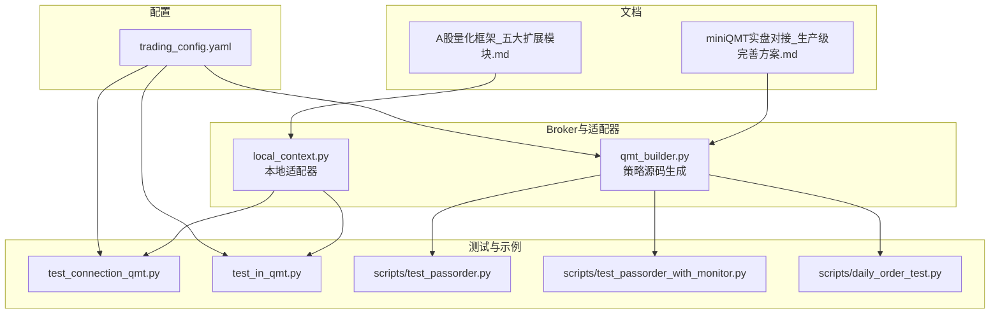
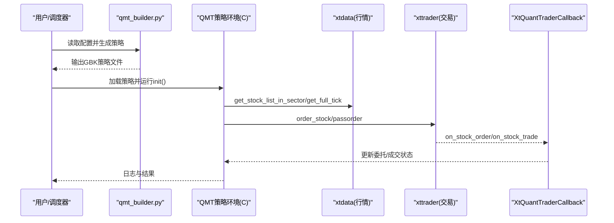
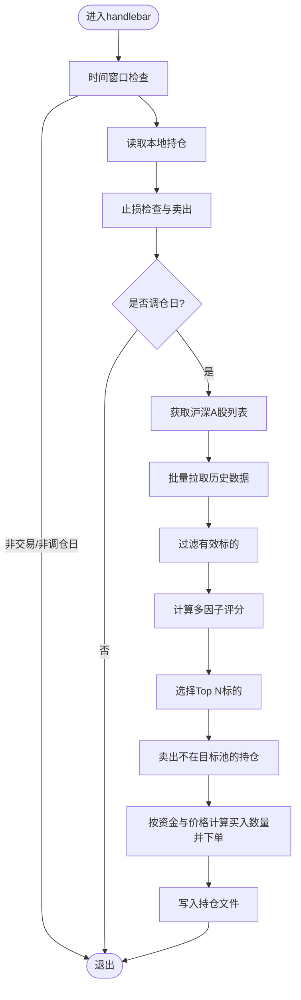
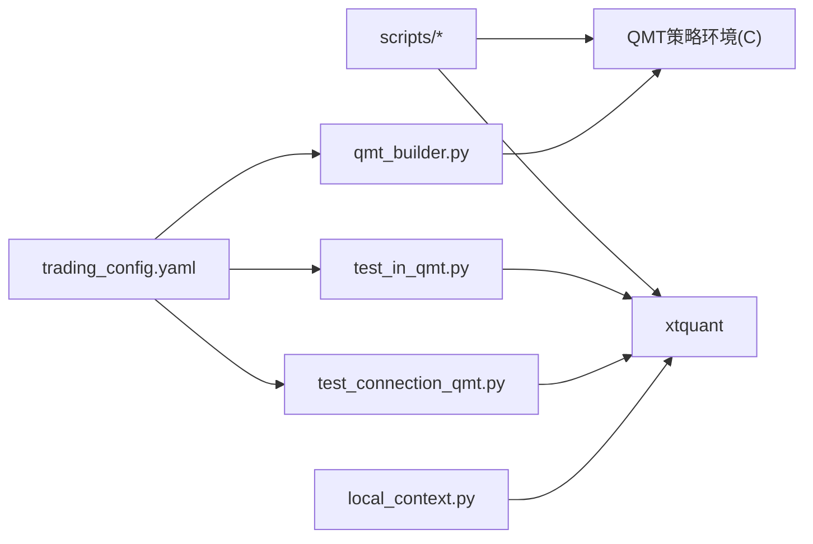

# QMT 接口集成

<cite>
**本文引用的文件**   
- [broker/qmt_builder.py](file://broker/qmt_builder.py)
- [config/trading_config.yaml](file://config/trading_config.yaml)
- [scripts/test_passorder.py](file://scripts/test_passorder.py)
- [scripts/test_passorder_with_monitor.py](file://scripts/test_passorder_with_monitor.py)
- [scripts/daily_order_test.py](file://scripts/daily_order_test.py)
- [test_connection_qmt.py](file://test_connection_qmt.py)
- [test_in_qmt.py](file://test_in_qmt.py)
- [broker/local_context.py](file://broker/local_context.py)
- [miniQMT实盘对接_生产级完善方案.md](file://miniQMT实盘对接_生产级完善方案.md)
- [A股量化框架_五大扩展模块.md](file://A股量化框架_五大扩展模块.md)
</cite>

## 目录
1. [简介](#简介)
2. [项目结构](#项目结构)
3. [核心组件](#核心组件)
4. [架构总览](#架构总览)
5. [详细组件分析](#详细组件分析)
6. [依赖关系分析](#依赖关系分析)
7. [性能与稳定性](#性能与稳定性)
8. [故障排查指南](#故障排查指南)
9. [结论](#结论)
10. [附录：常用API与示例路径](#附录常用api与示例路径)

## 简介
本技术文档面向 QuantLab 的 QMT 接口集成，系统性阐述 xtquant 接口的封装与适配机制，覆盖账户连接、市场数据获取、订单执行等关键能力；并详细说明 QMT 平台生命周期函数 init、handlebar、exit 的实现原理与最佳实践。文档同时给出股票列表获取、行情数据处理、交易指令发送等 API 的使用方式，解释错误处理与异常恢复策略，并提供完整代码示例路径与连接配置、参数设置、性能优化等实用技巧，帮助读者快速搭建稳定可靠的 QMT 实盘或模拟环境。

## 项目结构
QuantLab 中与 QMT 相关的代码主要分布在以下位置：
- broker: QMT 策略生成器与本地适配器
- scripts: QMT 委托测试与监控脚本
- config: 实盘与策略配置
- 根目录测试脚本：连接与在 QMT 内运行的验证脚本
- 文档：生产级完善方案与通用 Broker 抽象

图表来源
- [config/trading_config.yaml:1-59](file://config/trading_config.yaml#L1-L59)
- [broker/qmt_builder.py:1-386](file://broker/qmt_builder.py#L1-L386)
- [broker/local_context.py:1-50](file://broker/local_context.py#L1-L50)
- [test_connection_qmt.py:1-117](file://test_connection_qmt.py#L1-L117)
- [test_in_qmt.py:1-53](file://test_in_qmt.py#L1-L53)
- [scripts/test_passorder.py:1-48](file://scripts/test_passorder.py#L1-L48)
- [scripts/test_passorder_with_monitor.py:1-75](file://scripts/test_passorder_with_monitor.py#L1-L75)
- [scripts/daily_order_test.py:1-227](file://scripts/daily_order_test.py#L1-L227)
- [miniQMT实盘对接_生产级完善方案.md:73-756](file://miniQMT实盘对接_生产级完善方案.md#L73-L756)
- [A股量化框架_五大扩展模块.md:971-1701](file://A股量化框架_五大扩展模块.md#L971-L1701)

章节来源
- [config/trading_config.yaml:1-59](file://config/trading_config.yaml#L1-L59)
- [broker/qmt_builder.py:1-386](file://broker/qmt_builder.py#L1-L386)
- [broker/local_context.py:1-50](file://broker/local_context.py#L1-L50)

## 核心组件
- QMT 策略生成器（qmt_builder.py）
  - 读取配置，组装 QMT 生命周期与策略逻辑，输出 GBK 编码的单文件策略，供 QMT 策略编辑器运行。
- 本地上下文适配器（local_context.py）
  - 将 QMT 策略中的 C.* 调用映射到本地 xtdata/xttrader，便于本地快速验证。
- 连接与测试脚本
  - test_connection_qmt.py、test_in_qmt.py：验证 xtquant 连接、账户与持仓查询。
- 委托测试与监控脚本
  - test_passorder.py、test_passorder_with_monitor.py、daily_order_test.py：演示 passorder 下单、状态监控、自动撤单与市价追单。
- 生产级完善方案与 Broker 抽象
  - miniQMT实盘对接_生产级完善方案.md：回调、断线重连、超时撤单、部分成交、持仓对账、通知等生产特性。
  - A股量化框架_五大扩展模块.md：Broker 抽象类与 MiniQMTBroker 实现，统一接口。

章节来源
- [broker/qmt_builder.py:1-386](file://broker/qmt_builder.py#L1-L386)
- [broker/local_context.py:1-50](file://broker/local_context.py#L1-L50)
- [test_connection_qmt.py:1-117](file://test_connection_qmt.py#L1-L117)
- [test_in_qmt.py:1-53](file://test_in_qmt.py#L1-L53)
- [scripts/test_passorder.py:1-48](file://scripts/test_passorder.py#L1-L48)
- [scripts/test_passorder_with_monitor.py:1-75](file://scripts/test_passorder_with_monitor.py#L1-L75)
- [scripts/daily_order_test.py:1-227](file://scripts/daily_order_test.py#L1-L227)
- [miniQMT实盘对接_生产级完善方案.md:73-756](file://miniQMT实盘对接_生产级完善方案.md#L73-L756)
- [A股量化框架_五大扩展模块.md:971-1701](file://A股量化框架_五大扩展模块.md#L971-L1701)

## 架构总览
QMT 集成整体由“配置驱动 + 策略生成 + 本地适配 + 实盘/模拟执行”构成。策略通过 QMT 生命周期函数 init/handlebar/exit 组织，使用 C 对象获取市场数据与账户信息，并通过 passorder 提交委托；xtquant 提供底层交易与行情通道，配合回调与监控线程实现稳健的异步事件处理。

图表来源
- [broker/qmt_builder.py:1-386](file://broker/qmt_builder.py#L1-L386)
- [test_connection_qmt.py:1-117](file://test_connection_qmt.py#L1-L117)
- [scripts/test_passorder.py:1-48](file://scripts/test_passorder.py#L1-L48)
- [miniQMT实盘对接_生产级完善方案.md:73-756](file://miniQMT实盘对接_生产级完善方案.md#L73-L756)

## 详细组件分析

### QMT 策略生成器（qmt_builder.py）
- 功能要点
  - 从 settings.yaml 读取策略参数（资金、权重、市值过滤、调仓频率等）。
  - 生成包含 init/handlebar/exit 的完整策略源码，采用 GBK 编码保存，便于 QMT 策略编辑器直接运行。
  - handlebar 中实现选股、因子计算、止损检查、买卖下单与持仓持久化。
- 关键流程
  - init：设置账户、初始化状态。
  - handlebar：时间窗口控制、获取全市场股票、拉取历史数据、计算多因子评分、按阈值筛选标的、卖出不在目标池的持仓、买入新标的、写入本地持仓文件。
  - exit：清理资源（当前为空实现）。
- 注意事项
  - 价格与数量安全处理（空值、非数值、不足1手）。
  - 交易时段判断与调仓日判断（双月末）。
  - 使用 C.get_full_tick 获取实时价格，passorder 提交委托。

图表来源
- [broker/qmt_builder.py:164-369](file://broker/qmt_builder.py#L164-L369)

章节来源
- [broker/qmt_builder.py:1-386](file://broker/qmt_builder.py#L1-L386)

### 本地上下文适配器（local_context.py）
- 功能要点
  - connect_data：连接 xtdata 行情服务。
  - connect_trader：创建 XtQuantTrader，注册最小化回调，启动并连接，订阅账户，返回 trader 与 account。
- 用途
  - 在本地环境中模拟 QMT 的 C.* 调用，便于离线验证策略逻辑。

章节来源
- [broker/local_context.py:1-50](file://broker/local_context.py#L1-L50)

### 连接与测试脚本
- test_connection_qmt.py
  - 检查 Python 环境与 xtquant 库可用性。
  - 读取 trading_config.yaml 中的账号、路径与会话ID。
  - 创建 XtQuantTrader，start/connect，订阅账户，查询资产与持仓，打印结果。
- test_in_qmt.py
  - 在 QMT 策略研究环境中直接运行，验证连接与账户/持仓查询。

章节来源
- [test_connection_qmt.py:1-117](file://test_connection_qmt.py#L1-L117)
- [test_in_qmt.py:1-53](file://test_in_qmt.py#L1-L53)
- [config/trading_config.yaml:1-59](file://config/trading_config.yaml#L1-L59)

### 委托测试与监控脚本
- scripts/test_passorder.py
  - 获取股票列表与实时价格，使用 passorder 进行限价买入测试。
- scripts/test_passorder_with_monitor.py
  - 下单后每根K线查询委托状态，打印状态码映射（未报/已报/部成/已成/废单等）。
- scripts/daily_order_test.py
  - 每日定时限价下单，若超时未成交则自动撤单并以卖一价市价追单，收盘汇总当日成交。

章节来源
- [scripts/test_passorder.py:1-48](file://scripts/test_passorder.py#L1-L48)
- [scripts/test_passorder_with_monitor.py:1-75](file://scripts/test_passorder_with_monitor.py#L1-L75)
- [scripts/daily_order_test.py:1-227](file://scripts/daily_order_test.py#L1-L227)

### 生产级完善方案与 Broker 抽象
- miniQMT实盘对接_生产级完善方案.md
  - 定义 QMTCallback 回调类，处理断线、委托回报、成交回报、错误等。
  - 实现指数退避自动重连、委托超时监控与自动撤单、部分成交记录、持仓对账、状态持久化、通知推送。
  - 提供 MiniQMTBrokerPro 类，封装 connect/disconnect、账户/持仓/委托查询、下单/撤单、实时价格与历史数据下载。
- A股量化框架_五大扩展模块.md
  - 定义 Broker 抽象基类，统一 connect/disconnect、get_account/get_positions/get_orders/place_order/cancel_order 等接口。
  - 提供 MiniQMTBroker 实现，封装 xtquant 调用与状态映射。

章节来源
- [miniQMT实盘对接_生产级完善方案.md:73-756](file://miniQMT实盘对接_生产级完善方案.md#L73-L756)
- [A股量化框架_五大扩展模块.md:971-1701](file://A股量化框架_五大扩展模块.md#L971-L1701)

## 依赖关系分析
- 配置依赖
  - trading_config.yaml 提供账号、路径、会话ID、风控与调度参数，被测试脚本与生成器读取。
- 运行时依赖
  - xtquant（xttrader、xtdata、xtconstant、xttype）为底层交易与行情通道。
  - QMT 策略环境提供 C 对象与 passorder 等全局函数。
- 组件耦合
  - qmt_builder.py 依赖配置与 QMT 生命周期约定。
  - local_context.py 依赖 xtquant 以桥接本地与 QMT 调用。
  - 测试脚本依赖 trading_config.yaml 与 xtquant。

图表来源
- [config/trading_config.yaml:1-59](file://config/trading_config.yaml#L1-L59)
- [broker/qmt_builder.py:1-386](file://broker/qmt_builder.py#L1-L386)
- [broker/local_context.py:1-50](file://broker/local_context.py#L1-L50)
- [test_connection_qmt.py:1-117](file://test_connection_qmt.py#L1-L117)
- [test_in_qmt.py:1-53](file://test_in_qmt.py#L1-L53)
- [scripts/test_passorder.py:1-48](file://scripts/test_passorder.py#L1-L48)
- [scripts/test_passorder_with_monitor.py:1-75](file://scripts/test_passorder_with_monitor.py#L1-L75)
- [scripts/daily_order_test.py:1-227](file://scripts/daily_order_test.py#L1-L227)

章节来源
- [config/trading_config.yaml:1-59](file://config/trading_config.yaml#L1-L59)
- [broker/qmt_builder.py:1-386](file://broker/qmt_builder.py#L1-L386)
- [broker/local_context.py:1-50](file://broker/local_context.py#L1-L50)

## 性能与稳定性
- 连接与重连
  - 使用 XtQuantTrader.start/connect 建立连接，失败时指数退避重试，避免雪崩。
- 委托监控
  - 独立监控线程定期检查未完成委托，超时自动撤单，防止挂单堆积。
- 数据获取
  - 批量拉取历史数据（get_market_data_ex），减少网络往返；实时价格使用 get_full_tick 批量获取。
- 并发与锁
  - 委托状态更新使用线程锁保护共享字典，避免竞态条件。
- 状态持久化
  - 定期保存订单与成交快照，崩溃后可恢复。
- 通知与告警
  - 通过 webhook 推送异常与重要事件，降低人工干预成本。

章节来源
- [miniQMT实盘对接_生产级完善方案.md:73-756](file://miniQMT实盘对接_生产级完善方案.md#L73-L756)
- [A股量化框架_五大扩展模块.md:971-1701](file://A股量化框架_五大扩展模块.md#L971-L1701)

## 故障排查指南
- 连接失败
  - 检查 QMT 客户端是否启动、账号是否登录、路径与会话ID是否正确。
  - 确认 xtquant 库可用（需在 QMT 内置 Python 中运行或使用正确环境）。
- 委托失败
  - 检查交易时段、价格类型、数量是否为100整数倍、资金/持仓是否充足。
  - 查看委托状态码映射（未报/已报/部成/已成/废单等）。
- 断线与重连
  - 观察 on_disconnected 回调，确认指数退避重连是否生效。
- 数据异常
  - 校验历史数据有效性（close/pb/pe_ttm 等字段），过滤无效标的。
- 持仓不一致
  - 执行持仓对账，差异处优先以券商为准并告警。

章节来源
- [test_connection_qmt.py:1-117](file://test_connection_qmt.py#L1-L117)
- [scripts/test_passorder_with_monitor.py:1-75](file://scripts/test_passorder_with_monitor.py#L1-L75)
- [scripts/daily_order_test.py:1-227](file://scripts/daily_order_test.py#L1-L227)
- [miniQMT实盘对接_生产级完善方案.md:73-756](file://miniQMT实盘对接_生产级完善方案.md#L73-L756)

## 结论
QuantLab 的 QMT 接口集成通过配置驱动的 QMT 策略生成、本地适配器与 xtquant 底层通道，实现了从数据获取、因子计算到委托执行的完整闭环。结合生产级完善方案中的回调、重连、超时与对账机制，系统具备较强的鲁棒性与可维护性。建议在生产部署中启用通知与状态持久化，严格遵循交易时段与风控规则，确保交易安全与一致性。

## 附录：常用API与示例路径
- 账户连接与查询
  - 连接与订阅账户：[test_connection_qmt.py:52-76](file://test_connection_qmt.py#L52-L76)、[test_in_qmt.py:23-36](file://test_in_qmt.py#L23-L36)
  - 查询资产与持仓：[test_connection_qmt.py:74-96](file://test_connection_qmt.py#L74-L96)
- 市场数据获取
  - 获取股票列表：[scripts/test_passorder.py:19-24](file://scripts/test_passorder.py#L19-L24)
  - 获取实时价格：[scripts/test_passorder.py:27-33](file://scripts/test_passorder.py#L27-L33)
  - 批量历史数据：[broker/qmt_builder.py:228-234](file://broker/qmt_builder.py#L228-L234)
- 交易指令发送
  - passorder 限价买入：[scripts/test_passorder.py:38-43](file://scripts/test_passorder.py#L38-L43)
  - 委托状态监控：[scripts/test_passorder_with_monitor.py:42-74](file://scripts/test_passorder_with_monitor.py#L42-L74)
  - 自动撤单与市价追单：[scripts/daily_order_test.py:163-197](file://scripts/daily_order_test.py#L163-L197)
- 生命周期函数
  - init/handlebar/exit：[broker/qmt_builder.py:164-369](file://broker/qmt_builder.py#L164-L369)
- 配置与参数
  - 账号、路径、会话ID、风控与调度：[config/trading_config.yaml:1-59](file://config/trading_config.yaml#L1-L59)

章节来源
- [test_connection_qmt.py:1-117](file://test_connection_qmt.py#L1-L117)
- [test_in_qmt.py:1-53](file://test_in_qmt.py#L1-L53)
- [scripts/test_passorder.py:1-48](file://scripts/test_passorder.py#L1-L48)
- [scripts/test_passorder_with_monitor.py:1-75](file://scripts/test_passorder_with_monitor.py#L1-L75)
- [scripts/daily_order_test.py:1-227](file://scripts/daily_order_test.py#L1-L227)
- [broker/qmt_builder.py:1-386](file://broker/qmt_builder.py#L1-L386)
- [config/trading_config.yaml:1-59](file://config/trading_config.yaml#L1-L59)