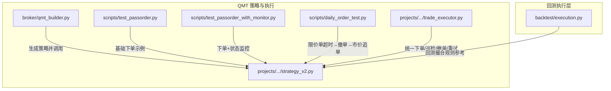
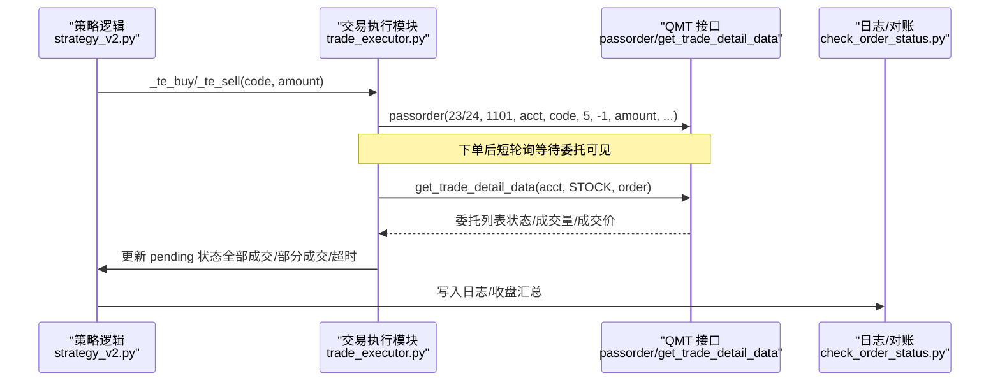
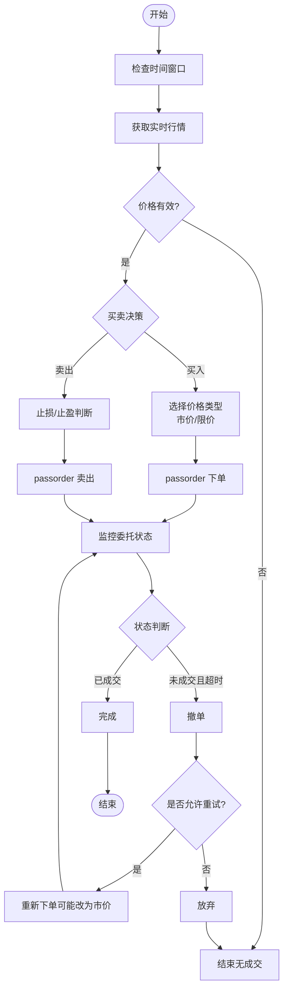
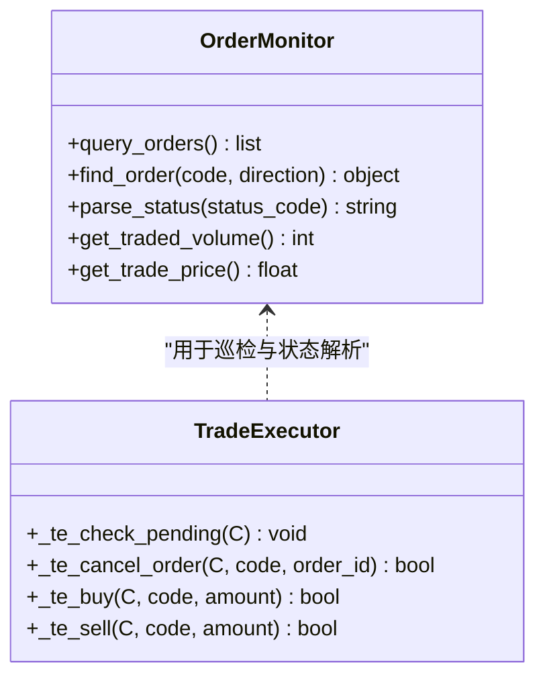
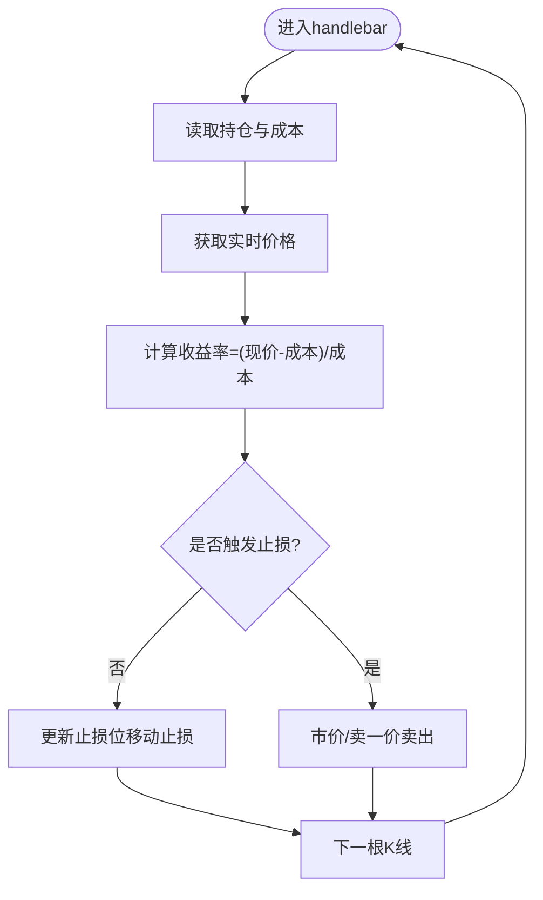
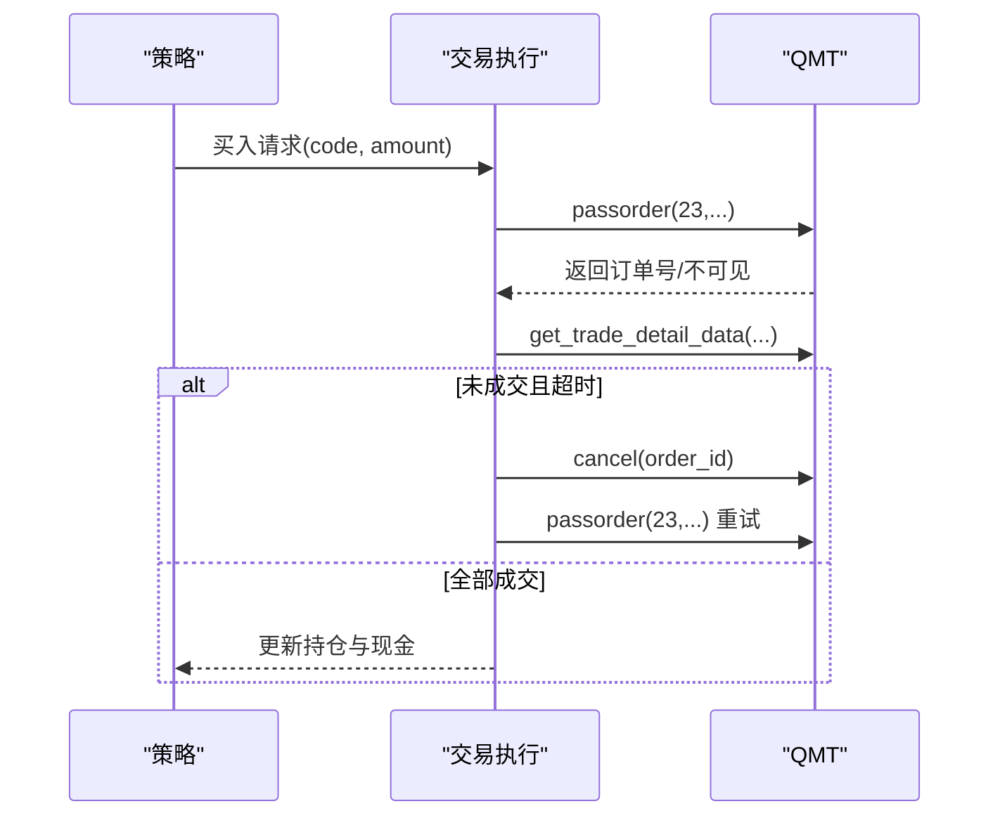

# 交易执行接口

<cite>
**本文引用的文件**   
- [qmt_builder.py](file://broker/qmt_builder.py)
- [test_passorder.py](file://scripts/test_passorder.py)
- [test_passorder_with_monitor.py](file://scripts/test_passorder_with_monitor.py)
- [daily_order_test.py](file://scripts/daily_order_test.py)
- [check_order_status.py](file://scripts/check_order_status.py)
- [trade_executor.py](file://projects/Project_10_价值小盘V2/trade_executor.py)
- [strategy_v2.py](file://projects/Project_10_价值小盘V2/strategy_v2.py)
- [execution.py](file://backtest/execution.py)
</cite>

## 目录
1. [简介](#简介)
2. [项目结构](#项目结构)
3. [核心组件](#核心组件)
4. [架构总览](#架构总览)
5. [详细组件分析](#详细组件分析)
6. [依赖关系分析](#依赖关系分析)
7. [性能与稳定性](#性能与稳定性)
8. [故障排查指南](#故障排查指南)
9. [结论](#结论)
10. [附录：参数与状态速查](#附录参数与状态速查)

## 简介
本技术文档面向 QuantLab 的 QMT 交易执行接口，聚焦 passorder() 方法在实盘与模拟环境中的完整使用方式。内容涵盖订单类型、价格类型、数量计算、买入卖出流程、条件单配置、订单状态跟踪、成交回报处理、撤单操作、止损止盈机制（含动态止损与移动止损）、失败重试与风险控制策略等。文档同时提供可落地的代码示例路径，帮助读者快速构建交易信号、执行订单与管理持仓。

## 项目结构
围绕 QMT 交易执行的相关代码主要分布在以下位置：
- broker/qmt_builder.py：生成 QMT 策略源码（GBK），内置 passorder 调用、止损逻辑与调仓流程
- scripts/*：多份测试脚本，演示 passorder 下单、委托状态监控、自动撤单与市价追单
- projects/Project_10_价值小盘V2/trade_executor.py：生产级交易执行模块（内嵌模板），封装下单、巡检、撤单与重试
- projects/Project_10_价值小盘V2/strategy_v2.py：策略主逻辑，集成买入/卖出执行与待成交订单管理
- backtest/execution.py：回测引擎的执行层，定义 next_open 模型下的涨跌停、滑点、手续费与整数手约束

图表来源 
- [qmt_builder.py:1-386](file://broker/qmt_builder.py#L1-L386)
- [test_passorder.py:1-48](file://scripts/test_passorder.py#L1-L48)
- [test_passorder_with_monitor.py:1-75](file://scripts/test_passorder_with_monitor.py#L1-L75)
- [daily_order_test.py:1-227](file://scripts/daily_order_test.py#L1-L227)
- [trade_executor.py:1-295](file://projects/Project_10_价值小盘V2/trade_executor.py#L1-L295)
- [strategy_v2.py:740-837](file://projects/Project_10_价值小盘V2/strategy_v2.py#L740-L837)
- [execution.py:1-204](file://backtest/execution.py#L1-L204)

章节来源
- [qmt_builder.py:1-386](file://broker/qmt_builder.py#L1-L386)
- [test_passorder.py:1-48](file://scripts/test_passorder.py#L1-L48)
- [test_passorder_with_monitor.py:1-75](file://scripts/test_passorder_with_monitor.py#L1-L75)
- [daily_order_test.py:1-227](file://scripts/daily_order_test.py#L1-L227)
- [trade_executor.py:1-295](file://projects/Project_10_价值小盘V2/trade_executor.py#L1-L295)
- [strategy_v2.py:740-837](file://projects/Project_10_价值小盘V2/strategy_v2.py#L740-L837)
- [execution.py:1-204](file://backtest/execution.py#L1-L204)

## 核心组件
- passorder() 下单入口
  - 常用参数：操作类型(opType)、下单方式(orderType)、账号(accountid)、代码(orderCode)、选价类型(prType)、模型价格(modelprice)、数量(volume)、备注(remark)、快速交易标志(quickTrade)、扩展字段(extra)、上下文(ContextInfo)
  - 常见 opType：23=买入，24=卖出
  - 常见 prType：5=最新价（市价），11=指定价（限价）
  - 数量计算需按 A 股“整手”约束（100 股为最小单位）
- 委托查询与状态跟踪
  - get_trade_detail_data(account, 'STOCK', 'order') 获取当日委托列表
  - 关键字段：m_strInstrumentID、m_nOrderStatus、m_nOrderVolume、m_nTradedVolume、m_dOrderPrice、m_dTradePrice、m_strOrderSysID、m_nOrderID
- 撤单
  - 通过 passorder(24, 1101, account, code, 5, order_id, 0, remark, 2, "", C) 实现按订单号撤单
- 成交回报
  - 通过 m_nTradedVolume 与 m_dTradePrice 判断部分成交与成交价
- 止损止盈
  - 基于实时行情与持仓成本计算收益率，触发阈值后以市价或卖一价卖出
- 重试与风控
  - 超时未成交→撤单重下；最大重试次数耗尽→放弃或切换替补标的
  - 资金池与仓位上限控制，避免过度集中

章节来源
- [test_passorder.py:1-48](file://scripts/test_passorder.py#L1-L48)
- [test_passorder_with_monitor.py:1-75](file://scripts/test_passorder_with_monitor.py#L1-L75)
- [daily_order_test.py:1-227](file://scripts/daily_order_test.py#L1-L227)
- [trade_executor.py:1-295](file://projects/Project_10_价值小盘V2/trade_executor.py#L1-L295)
- [strategy_v2.py:740-837](file://projects/Project_10_价值小盘V2/strategy_v2.py#L740-L837)

## 架构总览
下图展示从策略到 QMT 执行层的调用链路与数据流：

图表来源 
- [strategy_v2.py:740-837](file://projects/Project_10_价值小盘V2/strategy_v2.py#L740-L837)
- [trade_executor.py:1-295](file://projects/Project_10_价值小盘V2/trade_executor.py#L1-L295)
- [check_order_status.py:1-50](file://scripts/check_order_status.py#L1-L50)

## 详细组件分析

### passorder() 方法与参数详解
- 操作类型(opType)
  - 23：股票买入
  - 24：股票卖出
- 下单方式(orderType)
  - 1101：单股单账号按股数
- 选价类型(prType)
  - 5：最新价（市价）
  - 11：指定价（限价）
- 模型价格(modelprice)
  - 市价单通常传入 -1
  - 限价单传入具体价格
- 数量(volume)
  - 必须为 100 的整数倍（A 股整手）
- 其他
  - remark：备注（便于追踪）
  - quickTrade：快速交易标志
  - extra：扩展字段
  - C：ContextInfo（必需）

章节来源
- [test_passorder.py:1-48](file://scripts/test_passorder.py#L1-L48)
- [trade_executor.py:134-137](file://projects/Project_10_价值小盘V2/trade_executor.py#L134-L137)
- [strategy_v2.py:763-766](file://projects/Project_10_价值小盘V2/strategy_v2.py#L763-L766)

### 买入与卖出流程（限价单、市价单、条件单）
- 市价单买入
  - 使用 prType=5，modelprice=-1，确保快速成交
  - 适用于流动性较好的标的
- 限价单买入
  - 使用 prType=11，modelprice=指定价
  - 结合超时与撤单改市价的策略提升成交概率
- 条件单（止损/止盈）
  - 在 handlebar 中根据实时价格与持仓成本计算收益率
  - 达到阈值后以市价或卖一价触发卖出

图表来源 
- [daily_order_test.py:106-227](file://scripts/daily_order_test.py#L106-L227)
- [trade_executor.py:205-279](file://projects/Project_10_价值小盘V2/trade_executor.py#L205-L279)
- [strategy_v2.py:740-837](file://projects/Project_10_价值小盘V2/strategy_v2.py#L740-L837)

章节来源
- [daily_order_test.py:1-227](file://scripts/daily_order_test.py#L1-L227)
- [trade_executor.py:1-295](file://projects/Project_10_价值小盘V2/trade_executor.py#L1-L295)
- [strategy_v2.py:740-837](file://projects/Project_10_价值小盘V2/strategy_v2.py#L740-L837)

### 订单状态跟踪与成交回报处理
- 委托查询
  - 使用 get_trade_detail_data(account, 'STOCK', 'order') 获取当日委托
  - 关键字段包括：m_strInstrumentID、m_nOrderStatus、m_nOrderVolume、m_nTradedVolume、m_dOrderPrice、m_dTradePrice、m_strOrderSysID、m_nOrderID
- 状态映射
  - 48=未报，49=待报，50=已报，51=已报待撤，52=部成，53=部撤，54=已撤，55=已成，56=废单
- 成交回报
  - 当 m_nTradedVolume > 0 时视为部分或全部成交
  - 成交价由 m_dTradePrice 提供

图表来源 
- [test_passorder_with_monitor.py:42-75](file://scripts/test_passorder_with_monitor.py#L42-L75)
- [trade_executor.py:77-132](file://projects/Project_10_价值小盘V2/trade_executor.py#L77-L132)

章节来源
- [test_passorder_with_monitor.py:1-75](file://scripts/test_passorder_with_monitor.py#L1-L75)
- [trade_executor.py:77-132](file://projects/Project_10_价值小盘V2/trade_executor.py#L77-L132)

### 止损止盈机制（静态与动态）
- 静态止损
  - 固定比例阈值（如 -12%），达到即卖出
- 动态止损/移动止损
  - 基于最高价回撤或波动率指标（ATR）动态调整止损位
  - 在 handlebar 中持续评估，触发后以市价或卖一价卖出

图表来源 
- [qmt_builder.py:183-213](file://broker/qmt_builder.py#L183-L213)
- [strategy_v2.py:794-832](file://projects/Project_10_价值小盘V2/strategy_v2.py#L794-L832)

章节来源
- [qmt_builder.py:183-213](file://broker/qmt_builder.py#L183-L213)
- [strategy_v2.py:794-832](file://projects/Project_10_价值小盘V2/strategy_v2.py#L794-L832)

### 订单失败处理、重试机制与风险控制
- 失败处理
  - 捕获异常并记录日志
  - 区分废单、已撤、未报等状态，采取不同恢复策略
- 重试机制
  - 超时未成交→撤单→重下（可改为市价提高成交概率）
  - 最大重试次数耗尽→放弃或切换到备选标的
- 风险控制
  - 资金池分配（等权/目标金额）
  - 整手约束与最低手数校验
  - 涨跌停限制（回测执行层提供参考）

图表来源 
- [daily_order_test.py:163-227](file://scripts/daily_order_test.py#L163-L227)
- [trade_executor.py:205-279](file://projects/Project_10_价值小盘V2/trade_executor.py#L205-L279)
- [execution.py:27-45](file://backtest/execution.py#L27-L45)

章节来源
- [daily_order_test.py:1-227](file://scripts/daily_order_test.py#L1-L227)
- [trade_executor.py:205-279](file://projects/Project_10_价值小盘V2/trade_executor.py#L205-L279)
- [execution.py:27-45](file://backtest/execution.py#L27-L45)

### 完整的交易信号、执行与持仓管理示例路径
- 信号生成与调仓日判断
  - 参考 qmt_builder.py 中的选股与评分逻辑
- 执行下单与持仓记账
  - 参考 strategy_v2.py 的 _execute_buy/_execute_sell
- 委托状态巡检与成交回报
  - 参考 trade_executor.py 的 _te_check_pending
- 日志与对账
  - 参考 check_order_status.py 的日志解析

章节来源
- [qmt_builder.py:221-366](file://broker/qmt_builder.py#L221-L366)
- [strategy_v2.py:740-837](file://projects/Project_10_价值小盘V2/strategy_v2.py#L740-L837)
- [trade_executor.py:205-279](file://projects/Project_10_价值小盘V2/trade_executor.py#L205-L279)
- [check_order_status.py:1-50](file://scripts/check_order_status.py#L1-L50)

## 依赖关系分析
- 策略层依赖交易执行模块进行下单与状态巡检
- 交易执行模块依赖 QMT 接口（passorder、get_trade_detail_data）
- 回测执行层提供撮合规则参考（涨跌停、滑点、手续费、整手）

图表来源 
- [strategy_v2.py:740-837](file://projects/Project_10_价值小盘V2/strategy_v2.py#L740-L837)
- [trade_executor.py:1-295](file://projects/Project_10_价值小盘V2/trade_executor.py#L1-L295)
- [execution.py:1-204](file://backtest/execution.py#L1-L204)

章节来源
- [strategy_v2.py:740-837](file://projects/Project_10_价值小盘V2/strategy_v2.py#L740-L837)
- [trade_executor.py:1-295](file://projects/Project_10_价值小盘V2/trade_executor.py#L1-L295)
- [execution.py:1-204](file://backtest/execution.py#L1-L204)

## 性能与稳定性
- 短轮询优化
  - passorder 后短轮询等待委托可见，避免异步延迟导致的漏检
- 分钟级节流
  - 巡检函数按分钟节流，降低频繁查询带来的开销
- 涨跌停与流动性保护
  - 参考回测执行层的涨跌停判定，避免无效下单
- 日志与可观测性
  - 增量写入日志文件，便于复盘与问题定位

章节来源
- [trade_executor.py:38-42](file://projects/Project_10_价值小盘V2/trade_executor.py#L38-L42)
- [trade_executor.py:205-216](file://projects/Project_10_价值小盘V2/trade_executor.py#L205-L216)
- [execution.py:27-45](file://backtest/execution.py#L27-L45)

## 故障排查指南
- 常见问题
  - 委托不可见：下单后委托尚未写入，需短轮询等待
  - 订单号为空：模拟端可能返回 None，需兜底逻辑
  - 价格无效：tick 缺失或价格为 0，需跳过或重试
  - 涨跌停限制：开盘涨停/跌停导致无法成交
- 排查步骤
  - 打印委托状态与关键字段
  - 检查时间窗口与行情有效性
  - 查看日志与对账结果

章节来源
- [test_passorder_with_monitor.py:42-75](file://scripts/test_passorder_with_monitor.py#L42-L75)
- [check_order_status.py:1-50](file://scripts/check_order_status.py#L1-L50)
- [trade_executor.py:90-132](file://projects/Project_10_价值小盘V2/trade_executor.py#L90-L132)

## 结论
QuantLab 的 QMT 交易执行接口通过 passorder() 提供了灵活的下单能力，配合委托状态监控、撤单与重试机制，能够构建稳健的交易执行系统。结合止损止盈、资金池与整手约束，可实现从信号到成交的全链路闭环。建议在生产环境中强化日志与对账，确保可观测性与可追溯性。

## 附录：参数与状态速查
- passorder 关键参数
  - opType：23=买入，24=卖出
  - orderType：1101=单股单账号按股数
  - prType：5=最新价（市价），11=指定价（限价）
  - modelprice：市价单=-1，限价单=具体价格
  - volume：整手（100 的倍数）
- 委托状态码
  - 48=未报，49=待报，50=已报，51=已报待撤，52=部成，53=部撤，54=已撤，55=已成，56=废单
- 关键字段
  - m_strInstrumentID：标的代码
  - m_nOrderStatus：委托状态
  - m_nOrderVolume：委托量
  - m_nTradedVolume：成交量
  - m_dOrderPrice：委托价
  - m_dTradePrice：成交价
  - m_strOrderSysID：系统订单号
  - m_nOrderID：订单号（模拟端可能为 None）

章节来源
- [test_passorder.py:1-48](file://scripts/test_passorder.py#L1-L48)
- [test_passorder_with_monitor.py:42-75](file://scripts/test_passorder_with_monitor.py#L42-L75)
- [trade_executor.py:77-132](file://projects/Project_10_价值小盘V2/trade_executor.py#L77-L132)