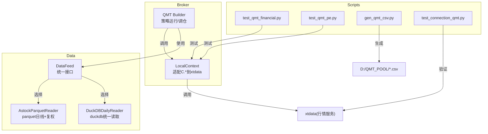
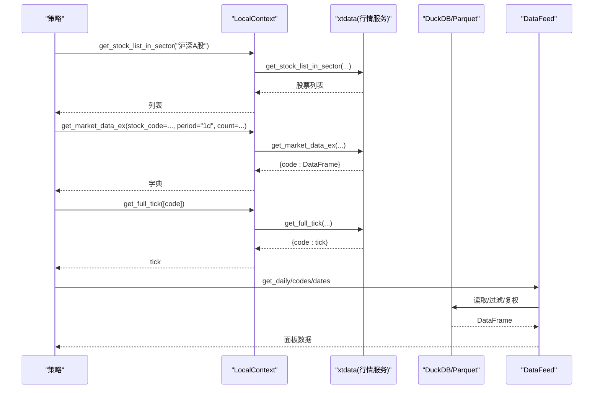
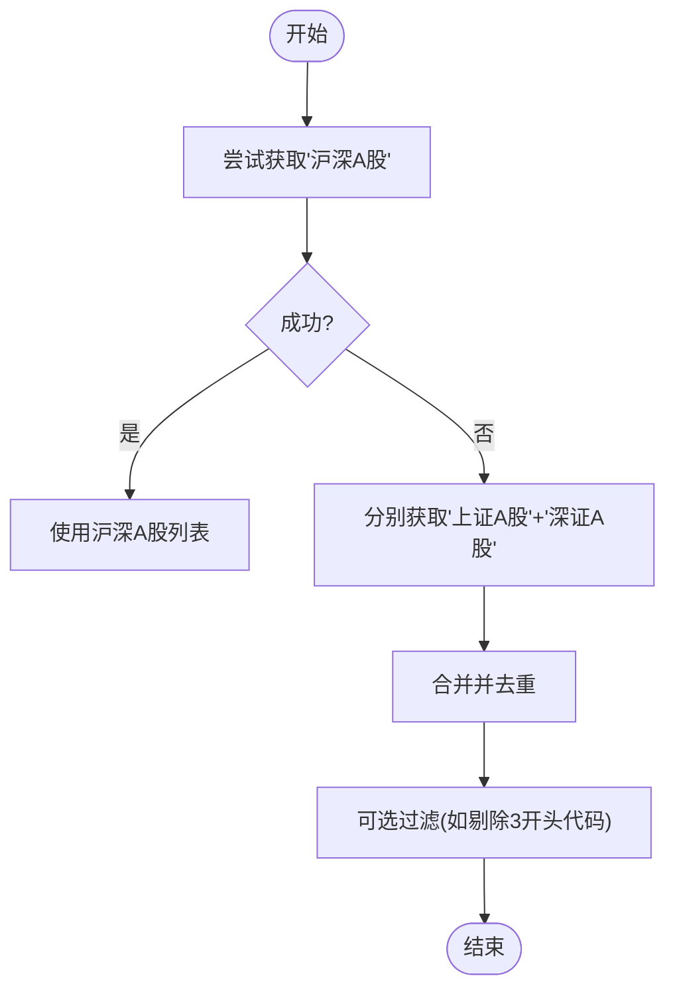
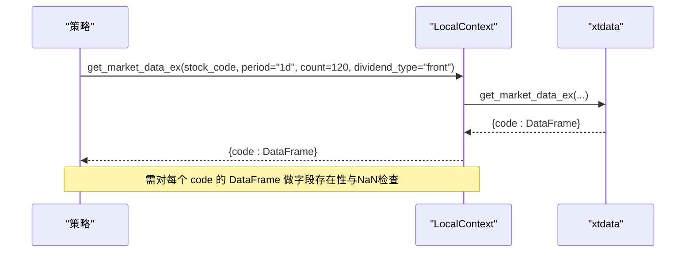
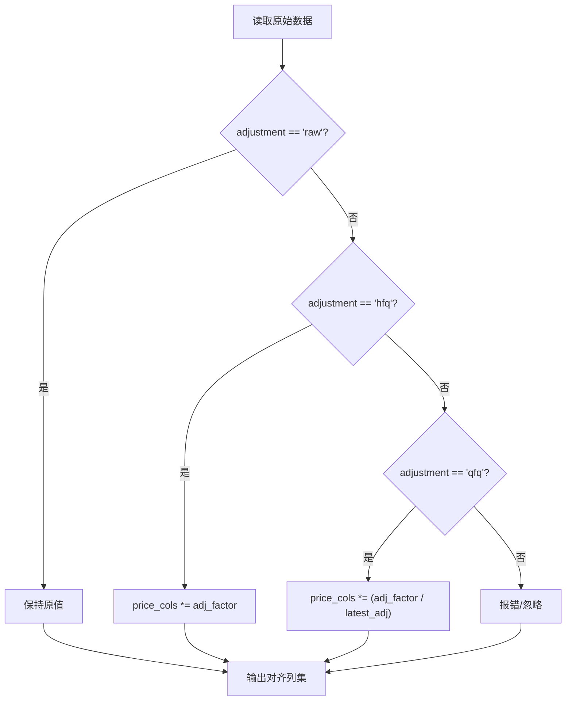
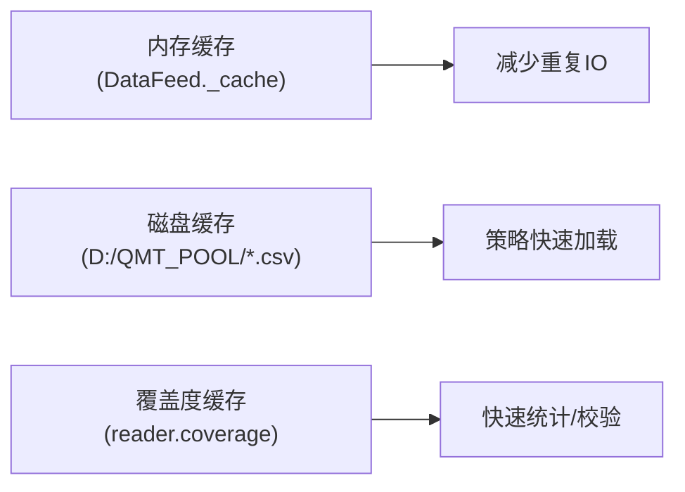
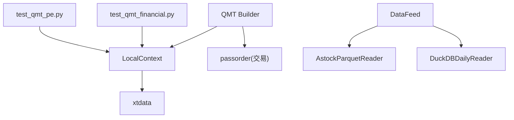

# 市场数据接口

<cite>
**本文引用的文件**   
- [local_context.py](file://broker/local_context.py)
- [qmt_builder.py](file://broker/qmt_builder.py)
- [test_qmt_financial.py](file://scripts/test_qmt_financial.py)
- [test_qmt_pe.py](file://scripts/test_qmt_pe.py)
- [astock_reader.py](file://data/astock_reader.py)
- [duckdb_reader.py](file://data/duckdb_reader.py)
- [feed.py](file://data/feed.py)
- [gen_qmt_csv.py](file://scripts/gen_qmt_csv.py)
- [test_connection_qmt.py](file://test_connection_qmt.py)
</cite>

## 目录
1. [简介](#简介)
2. [项目结构](#项目结构)
3. [核心组件](#核心组件)
4. [架构总览](#架构总览)
5. [详细组件分析](#详细组件分析)
6. [依赖关系分析](#依赖关系分析)
7. [性能考虑](#性能考虑)
8. [故障排查指南](#故障排查指南)
9. [结论](#结论)
10. [附录](#附录)

## 简介
本技术文档面向 QuantLab 的 QMT 市场数据接口，聚焦以下能力与最佳实践：
- 股票列表获取 API：get_stock_list_in_sector() 的使用与板块筛选
- 行情数据获取接口：get_market_data_ex() 的参数配置、字段与返回格式
- 实时行情数据：get_full_tick() 方法与 tick 数据结构要点
- 历史数据处理：除权除息处理（前复权/后复权）、缺失数据处理
- 数据缓存机制：本地内存缓存与磁盘缓存策略
- 完整示例路径：A 股全市场数据获取、异常处理与性能优化建议

## 项目结构
与 QMT 市场数据相关的关键模块分布如下：
- broker/local_context.py：本地 miniQMT 上下文适配器，将策略中的 C.* 调用映射到 xtdata
- broker/qmt_builder.py：策略构建与运行流程，包含全市场数据拉取、因子计算与交易执行
- scripts/test_qmt_*.py：针对 QMT 接口的测试脚本（财务字段、pe/pb、tick）
- data/astock_reader.py：基于 parquet 的历史日线读取器，支持复权与覆盖度检查
- data/duckdb_reader.py：基于 DuckDB 的统一读取器，支持多 schema 与去重
- data/feed.py：统一数据源接口，封装 astock/duckdb 访问
- scripts/gen_qmt_csv.py：生成 QMT 运行所需的预生成 CSV（估值、行业、BP 历史、股票池）
- test_connection_qmt.py：QMT 连接与账户信息验证脚本



**图表来源** 
- [local_context.py:53-89](file://broker/local_context.py#L53-L89)
- [qmt_builder.py:222-234](file://broker/qmt_builder.py#L222-L234)
- [astock_reader.py:25-70](file://data/astock_reader.py#L25-L70)
- [duckdb_reader.py:35-57](file://data/duckdb_reader.py#L35-L57)
- [feed.py:17-41](file://data/feed.py#L17-L41)
- [test_qmt_financial.py:1-20](file://scripts/test_qmt_financial.py#L1-L20)
- [test_qmt_pe.py:1-20](file://scripts/test_qmt_pe.py#L1-L20)
- [gen_qmt_csv.py:1-30](file://scripts/gen_qmt_csv.py#L1-L30)
- [test_connection_qmt.py:1-30](file://test_connection_qmt.py#L1-L30)

**章节来源**
- [local_context.py:53-89](file://broker/local_context.py#L53-L89)
- [qmt_builder.py:222-234](file://broker/qmt_builder.py#L222-L234)
- [astock_reader.py:25-70](file://data/astock_reader.py#L25-L70)
- [duckdb_reader.py:35-57](file://data/duckdb_reader.py#L35-L57)
- [feed.py:17-41](file://data/feed.py#L17-L41)
- [test_qmt_financial.py:1-20](file://scripts/test_qmt_financial.py#L1-L20)
- [test_qmt_pe.py:1-20](file://scripts/test_qmt_pe.py#L1-L20)
- [gen_qmt_csv.py:1-30](file://scripts/gen_qmt_csv.py#L1-L30)
- [test_connection_qmt.py:1-30](file://test_connection_qmt.py#L1-L30)

## 核心组件
- LocalContext（本地 miniQMT 上下文）
  - get_stock_list_in_sector(sector)：按板块获取股票列表
  - get_market_data_ex(stock_code, period, count, start_time, end_time, **kwargs)：批量拉取历史行情，返回 {code: DataFrame}
  - get_instrument_detail(code)、get_stock_name(code)、get_stock_basic_info(code)：合约与名称查询
  - 对未实现方法抛出 NotImplementedError，触发 fail-open

- AstockParquetReader（parquet 日线读取器）
  - load_window(codes, start_date, end_date)：按代码与日期窗口加载 OHLCV 等字段
  - trading_calendar(start_date, end_date)：交易日序列
  - coverage(codes, start_date, end_date)：数据覆盖度统计
  - close(code, date)：单点收盘价读取，支持 qfq/hfq 复权

- DuckDBDailyReader（DuckDB 统一读取器）
  - load_window(codes, start_date, end_date)：SQL 过滤 + 去重（不同 schema）
  - trading_calendar/start-end 查询
  - coverage：统计最小/最大日期、去重行数、缺失代码集合

- DataFeed（统一数据源接口）
  - get_daily/get_universe/get_financials：根据 source 切换 astock/duckdb

**章节来源**
- [local_context.py:53-89](file://broker/local_context.py#L53-L89)
- [astock_reader.py:71-116](file://data/astock_reader.py#L71-L116)
- [duckdb_reader.py:90-132](file://data/duckdb_reader.py#L90-L132)
- [feed.py:17-41](file://data/feed.py#L17-L41)

## 架构总览
QMT 市场数据在策略中的调用链路如下：
- 策略通过 C.get_stock_list_in_sector() 获取板块股票池
- 使用 C.get_market_data_ex() 批量拉取历史行情（含 pe_ttm、pb、circ_mv、pct_chg 等）
- 实时场景使用 C.get_full_tick() 获取最新 tick（lastPrice、amount、pe 等）
- 历史回测/研究通过 DataFeed 或 Reader 直接读取 parquet/DuckDB，并做复权与覆盖度校验



**图表来源** 
- [local_context.py:65-75](file://broker/local_context.py#L65-L75)
- [qmt_builder.py:222-234](file://broker/qmt_builder.py#L222-L234)
- [test_qmt_financial.py:21-41](file://scripts/test_qmt_financial.py#L21-L41)
- [test_qmt_pe.py:19-38](file://scripts/test_qmt_pe.py#L19-L38)
- [feed.py:28-41](file://data/feed.py#L28-L41)

## 详细组件分析

### 股票列表获取 API：get_stock_list_in_sector()
- 功能：按板块名称获取股票列表，如“沪深A股”、“上证A股”、“深证A股”
- 用法要点：
  - 优先尝试“沪深A股”，失败时回退为“上证A股”+“深证A股”拼接
  - 可结合过滤条件（如剔除创业板 3xxxxx）缩小范围
- 典型调用位置：
  - 策略构建中全市场扫描与因子计算前获取候选池
  - 本地验证脚本中快速拉取样本进行连通性测试



**图表来源** 
- [qmt_builder.py:222-226](file://broker/qmt_builder.py#L222-L226)
- [local_context.py:65-67](file://broker/local_context.py#L65-L67)

**章节来源**
- [qmt_builder.py:222-226](file://broker/qmt_builder.py#L222-L226)
- [local_context.py:65-67](file://broker/local_context.py#L65-L67)

### 行情数据获取接口：get_market_data_ex()
- 参数说明：
  - stock_code：股票代码列表
  - period：周期，如 "1d"
  - count：最近 N 根K线
  - start_time/end_time：时间范围（可选）
  - dividend_type：复权类型（如 "front" 前复权）
- 返回格式：{code: DataFrame}，DataFrame 中包含 open/high/low/close/volume/amount 及扩展字段（pe_ttm、pb、circ_mv、pct_chg 等）
- 使用要点：
  - 批量拉取时注意空值与 NaN 处理
  - 对 close_series 末尾值进行有效性校验后再参与因子计算
  - 可通过 dividend_type 控制复权口径



**图表来源** 
- [local_context.py:69-75](file://broker/local_context.py#L69-L75)
- [qmt_builder.py:228-234](file://broker/qmt_builder.py#L228-L234)
- [test_qmt_financial.py:21-41](file://scripts/test_qmt_financial.py#L21-L41)

**章节来源**
- [local_context.py:69-75](file://broker/local_context.py#L69-L75)
- [qmt_builder.py:228-234](file://broker/qmt_builder.py#L228-L234)
- [test_qmt_financial.py:21-41](file://scripts/test_qmt_financial.py#L21-L41)

### 实时行情数据：get_full_tick() 与 tick 结构
- 用途：获取标的最新 tick，常用于止损/止盈判断、即时价格获取
- 常用字段：lastPrice、amount、askPrice1、pe（部分版本/环境可能提供）
- 注意事项：
  - 单次请求代码数量受限，建议分批或抽样
  - 字段名大小写敏感（如 lastPrice），需严格匹配
  - 若字段缺失应降级处理（如用 get_market_data_ex 的最新 bar 替代）

```mermaid
classDiagram
class Tick {
+lastPrice : float
+amount : float
+askPrice1 : float
+pe : float?
+... : dict
}
class Context {
+get_full_tick(codes) : dict
}
Context --> Tick : "返回 {code : Tick}"
```

**图表来源** 
- [test_qmt_pe.py:40-50](file://scripts/test_qmt_pe.py#L40-L50)
- [test_qmt_financial.py:69-80](file://scripts/test_qmt_financial.py#L69-L80)
- [qmt_builder.py:187-203](file://broker/qmt_builder.py#L187-L203)

**章节来源**
- [test_qmt_pe.py:40-50](file://scripts/test_qmt_pe.py#L40-L50)
- [test_qmt_financial.py:69-80](file://scripts/test_qmt_financial.py#L69-L80)
- [qmt_builder.py:187-203](file://broker/qmt_builder.py#L187-L203)

### 历史数据处理与除权除息
- 复权方式：
  - hfq（后复权）：close/open/high/low 乘以 adj_factor
  - qfq（前复权）：close/open/high/low 乘以 (adj_factor / latest_adj)
- 数据源：
  - astock parquet：load_window 输出对齐列集，支持 is_st、turnover_rate 等
  - duckdb：默认过滤 adjustment='hfq', source='xtquant'，可按需调整
- 缺失数据：
  - 对 close_series 末尾值进行 NaN 检查
  - 对 pe_ttm/pb/circ_mv 等扩展字段做存在性与有效性校验



**图表来源** 
- [astock_reader.py:98-116](file://data/astock_reader.py#L98-L116)
- [duckdb_reader.py:51-53](file://data/duckdb_reader.py#L51-L53)

**章节来源**
- [astock_reader.py:98-116](file://data/astock_reader.py#L98-L116)
- [duckdb_reader.py:51-53](file://data/duckdb_reader.py#L51-L53)

### 数据缓存机制
- 内存缓存：
  - DataFeed 内部 _cache 缓存已读取的 parquet DataFrame，避免重复 IO
- 磁盘缓存：
  - gen_qmt_csv.py 生成 D:/QMT_POOL/*.csv（估值快照、行业映射、BP 历史、股票池）
  - 策略运行时可直接读取这些 CSV，降低对实时接口的依赖
- 覆盖度缓存：
  - AstockParquetReader 与 DuckDBDailyReader 均维护 coverage 缓存，加速统计



**图表来源** 
- [feed.py:20-27](file://data/feed.py#L20-L27)
- [gen_qmt_csv.py:44-70](file://scripts/gen_qmt_csv.py#L44-L70)
- [astock_reader.py:128-161](file://data/astock_reader.py#L128-L161)
- [duckdb_reader.py:146-205](file://data/duckdb_reader.py#L146-L205)

**章节来源**
- [feed.py:20-27](file://data/feed.py#L20-L27)
- [gen_qmt_csv.py:44-70](file://scripts/gen_qmt_csv.py#L44-L70)
- [astock_reader.py:128-161](file://data/astock_reader.py#L128-L161)
- [duckdb_reader.py:146-205](file://data/duckdb_reader.py#L146-L205)

### 完整示例路径（不展示具体代码）
- 获取 A 股全市场数据：
  - 参考：[qmt_builder.py:222-234](file://broker/qmt_builder.py#L222-L234)
- 处理缺失数据：
  - 参考：[qmt_builder.py:238-250](file://broker/qmt_builder.py#L238-L250)
- 优化数据访问性能：
  - 参考：[feed.py:71-104](file://data/feed.py#L71-L104)
  - 参考：[astock_reader.py:47-56](file://data/astock_reader.py#L47-L56)

**章节来源**
- [qmt_builder.py:222-250](file://broker/qmt_builder.py#L222-L250)
- [feed.py:71-104](file://data/feed.py#L71-L104)
- [astock_reader.py:47-56](file://data/astock_reader.py#L47-L56)

## 依赖关系分析
- LocalContext 依赖 xtdata 提供行情与基础信息
- QMT Builder 依赖 LocalContext 与 passorder 完成交易
- DataFeed 依赖 astock parquet 与 DuckDB 作为底层数据源
- 测试脚本依赖 LocalContext 验证接口可用性



**图表来源** 
- [local_context.py:61-67](file://broker/local_context.py#L61-L67)
- [qmt_builder.py:187-203](file://broker/qmt_builder.py#L187-L203)
- [feed.py:20-41](file://data/feed.py#L20-L41)
- [test_qmt_financial.py:1-20](file://scripts/test_qmt_financial.py#L1-L20)
- [test_qmt_pe.py:1-20](file://scripts/test_qmt_pe.py#L1-L20)

**章节来源**
- [local_context.py:61-67](file://broker/local_context.py#L61-L67)
- [qmt_builder.py:187-203](file://broker/qmt_builder.py#L187-L203)
- [feed.py:20-41](file://data/feed.py#L20-L41)
- [test_qmt_financial.py:1-20](file://scripts/test_qmt_financial.py#L1-L20)
- [test_qmt_pe.py:1-20](file://scripts/test_qmt_pe.py#L1-L20)

## 性能考虑
- 批量拉取限制：
  - get_full_tick 有代码数限制，建议分批或抽样
- 字段裁剪：
  - astock parquet 仅读取必要列，降低内存占用
- 缓存复用：
  - DataFeed._cache 避免重复读取 parquet
  - reader.coverage 缓存减少重复统计
- 复权计算：
  - 仅在需要时应用 qfq/hfq，避免不必要的计算
- SQL 优化：
  - DuckDB 使用 IN 占位符与 BETWEEN 区间过滤，减少扫描

**章节来源**
- [astock_reader.py:47-56](file://data/astock_reader.py#L47-L56)
- [feed.py:71-104](file://data/feed.py#L71-L104)
- [duckdb_reader.py:103-124](file://data/duckdb_reader.py#L103-L124)

## 故障排查指南
- QMT 连接问题：
  - 使用 test_connection_qmt.py 验证 xtquant 库与 QMT 进程连接
  - 确认 account.path、session_id、account.id 配置正确
- 接口不可用：
  - LocalContext 对未实现方法抛 NotImplementedError，策略应捕获并 fail-open
- 数据缺失：
  - 检查 coverage 与 missing codes
  - 对 close_series 末尾值进行 NaN 检查
- 字段不一致：
  - pe vs pe_ttm：不同环境/版本字段名可能不同，需兼容处理
  - tick 字段名大小写敏感（如 lastPrice）

**章节来源**
- [test_connection_qmt.py:14-30](file://test_connection_qmt.py#L14-L30)
- [local_context.py:101-106](file://broker/local_context.py#L101-L106)
- [test_qmt_pe.py:19-38](file://scripts/test_qmt_pe.py#L19-L38)
- [test_qmt_financial.py:21-41](file://scripts/test_qmt_financial.py#L21-L41)

## 结论
QuantLab 的 QMT 市场数据接口通过 LocalContext 抽象了 xtdata 调用，配合 DataFeed 与 Reader 实现了历史与实时数据的统一接入。实践中应重视：
- 板块筛选与全市场拉取的容错与回退
- 字段存在性与 NaN 检查
- 复权口径一致性与性能优化
- 缓存与覆盖度校验提升稳定性

## 附录
- 常用字段参考：
  - 日线：open/high/low/close/volume/amount/pe_ttm/pb/circ_mv/pct_chg/turnover_rate/is_st
  - tick：lastPrice/amount/askPrice1/pe（视环境）
- 推荐实践：
  - 先拉取板块列表，再分批拉取行情
  - 对 close_series 末尾值进行有效性校验
  - 使用 DataFeed._cache 与 reader.coverage 缓存
  - 生成 D:/QMT_POOL/*.csv 作为离线支撑

**章节来源**
- [astock_reader.py:111-116](file://data/astock_reader.py#L111-L116)
- [test_qmt_pe.py:40-50](file://scripts/test_qmt_pe.py#L40-L50)
- [gen_qmt_csv.py:44-70](file://scripts/gen_qmt_csv.py#L44-L70)