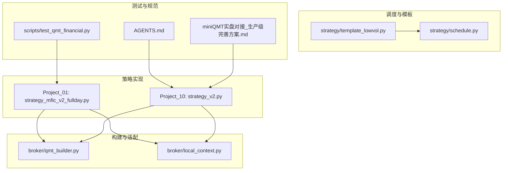
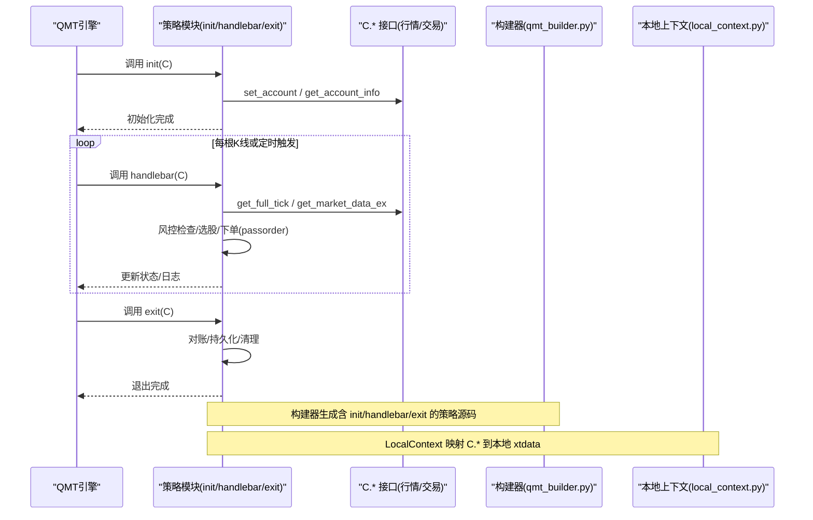
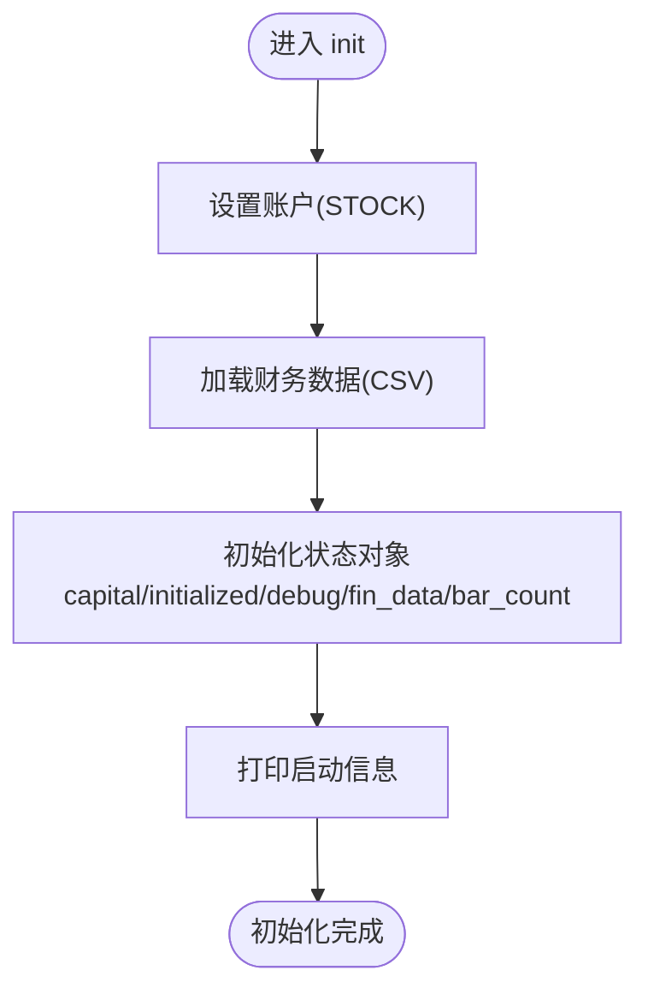
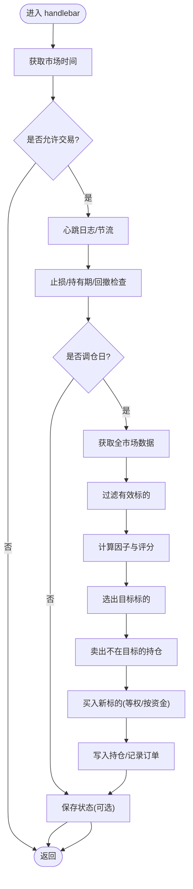
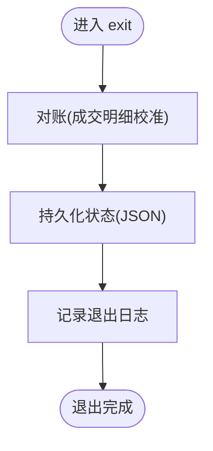
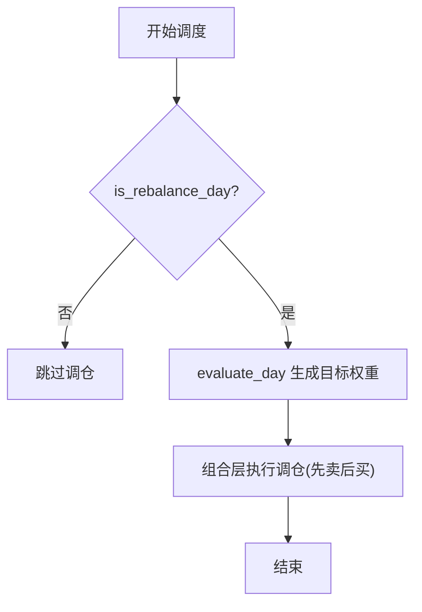
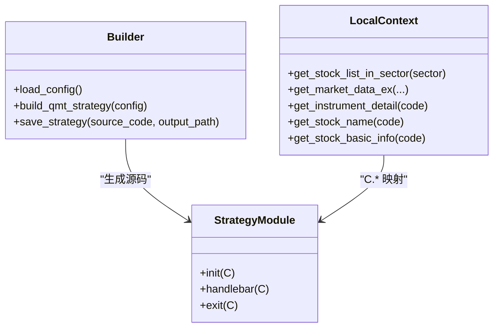
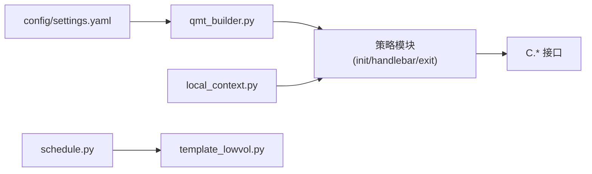

# 策略生命周期管理

<cite>
**本文引用的文件**   
- [strategy_mfic_v2_fullday.py](file://projects/Project_01_多因子IC小盘Alpha/research/mfic_strategy/strategy_mfic_v2_fullday.py)
- [strategy_v2.py](file://projects/Project_10_价值小盘V2/strategy_v2.py)
- [qmt_builder.py](file://broker/qmt_builder.py)
- [local_context.py](file://broker/local_context.py)
- [schedule.py](file://strategy/schedule.py)
- [template_lowvol.py](file://strategy/template_lowvol.py)
- [test_qmt_financial.py](file://scripts/test_qmt_financial.py)
- [AGENTS.md](file://AGENTS.md)
- [miniQMT实盘对接_生产级完善方案.md](file://miniQMT实盘对接_生产级完善方案.md)
</cite>

## 目录
1. [引言](#引言)
2. [项目结构](#项目结构)
3. [核心组件](#核心组件)
4. [架构总览](#架构总览)
5. [详细组件分析](#详细组件分析)
6. [依赖关系分析](#依赖关系分析)
7. [性能与稳定性考虑](#性能与稳定性考虑)
8. [故障排查指南](#故障排查指南)
9. [结论](#结论)
10. [附录：最佳实践清单](#附录最佳实践清单)

## 引言
本技术文档聚焦于 QuantLab 在 QMT 环境下的策略生命周期管理，围绕三个核心函数 init()、handlebar() 和 exit() 的作用与执行时机展开。结合仓库中的多份 QMT 策略实现与构建器，系统阐述策略初始化（参数加载、资源分配、状态设置）、盘中执行（时间判断、数据获取、交易决策）以及退出清理（资源释放、状态保存）的完整流程，并给出调度、定时任务与事件驱动交易的工程化实践建议。

## 项目结构
QuantLab 中与 QMT 策略生命周期相关的代码主要分布在以下位置：
- 策略实现：各项目的 QMT 单文件策略（如 Project_01 与 Project_10），包含 init/handlebar/exit 的具体逻辑
- 构建器：broker/qmt_builder.py 负责将配置与策略逻辑组装为 QMT 可执行的 GBK 编码单文件
- 本地适配：broker/local_context.py 提供 LocalContext，使 C.* 调用在本地可用
- 调度辅助：strategy/schedule.py 提供调仓日判定等通用工具
- 模板与示例：strategy/template_lowvol.py 展示“目标权重”模式的最小实现；scripts/test_qmt_financial.py 用于验证 QMT 财务数据接口

**图表来源** 
- [strategy_mfic_v2_fullday.py:125-374](file://projects/Project_01_多因子IC小盘Alpha/research/mfic_strategy/strategy_mfic_v2_fullday.py#L125-L374)
- [strategy_v2.py:487-837](file://projects/Project_10_价值小盘V2/strategy_v2.py#L487-L837)
- [qmt_builder.py:33-386](file://broker/qmt_builder.py#L33-L386)
- [local_context.py:54-137](file://broker/local_context.py#L54-L137)
- [schedule.py:10-47](file://strategy/schedule.py#L10-L47)
- [template_lowvol.py:46-94](file://strategy/template_lowvol.py#L46-L94)
- [test_qmt_financial.py:9-83](file://scripts/test_qmt_financial.py#L9-L83)
- [AGENTS.md:157-183](file://AGENTS.md#L157-L183)
- [miniQMT实盘对接_生产级完善方案.md:1-25](file://miniQMT实盘对接_生产级完善方案.md#L1-L25)

**章节来源**
- [strategy_mfic_v2_fullday.py:125-374](file://projects/Project_01_多因子IC小盘Alpha/research/mfic_strategy/strategy_mfic_v2_fullday.py#L125-L374)
- [strategy_v2.py:487-837](file://projects/Project_10_价值小盘V2/strategy_v2.py#L487-L837)
- [qmt_builder.py:33-386](file://broker/qmt_builder.py#L33-L386)
- [local_context.py:54-137](file://broker/local_context.py#L54-L137)
- [schedule.py:10-47](file://strategy/schedule.py#L10-L47)
- [template_lowvol.py:46-94](file://strategy/template_lowvol.py#L46-L94)
- [test_qmt_financial.py:9-83](file://scripts/test_qmt_financial.py#L9-L83)
- [AGENTS.md:157-183](file://AGENTS.md#L157-L183)
- [miniQMT实盘对接_生产级完善方案.md:1-25](file://miniQMT实盘对接_生产级完善方案.md#L1-L25)

## 核心组件
- QMT 策略生命周期三件套
  - init(): 策略初始化，完成账户设置、参数加载、状态对象创建与持久化路径准备
  - handlebar(): 每根K线或指定时点触发，执行时间过滤、风控检查、选股与下单、日志与心跳
  - exit(): 策略退出时的收尾工作，包括对账、状态持久化、资源释放
- 构建器与适配器
  - qmt_builder.py：根据配置生成含 init/handlebar/exit 的单文件策略（GBK 编码）
  - local_context.py：LocalContext 将 C.* 方法映射到本地 xtdata，便于离线验证
- 调度与模板
  - schedule.py：统一的调仓日判定（周/月/季度首交易日）
  - template_lowvol.py：以 evaluate_day 返回 target_weights 的最小范例，配合组合层自动调仓

**章节来源**
- [strategy_mfic_v2_fullday.py:125-374](file://projects/Project_01_多因子IC小盘Alpha/research/mfic_strategy/strategy_mfic_v2_fullday.py#L125-L374)
- [strategy_v2.py:487-837](file://projects/Project_10_价值小盘V2/strategy_v2.py#L487-L837)
- [qmt_builder.py:33-386](file://broker/qmt_builder.py#L33-L386)
- [local_context.py:54-137](file://broker/local_context.py#L54-L137)
- [schedule.py:10-47](file://strategy/schedule.py#L10-L47)
- [template_lowvol.py:46-94](file://strategy/template_lowvol.py#L46-L94)

## 架构总览
下图展示了 QMT 策略在运行期的关键交互：QMT 引擎调用策略的 init/handlebar/exit；策略通过 C.* 接口访问行情与交易；构建器负责生成策略源码；本地上下文用于离线验证。

**图表来源** 
- [strategy_mfic_v2_fullday.py:125-374](file://projects/Project_01_多因子IC小盘Alpha/research/mfic_strategy/strategy_mfic_v2_fullday.py#L125-L374)
- [strategy_v2.py:487-837](file://projects/Project_10_价值小盘V2/strategy_v2.py#L487-L837)
- [qmt_builder.py:33-386](file://broker/qmt_builder.py#L33-L386)
- [local_context.py:54-137](file://broker/local_context.py#L54-L137)

## 详细组件分析

### 组件A：init() 初始化流程
- 职责
  - 设置账户（如 STOCK）
  - 加载外部数据（财务CSV、持仓JSON等）
  - 初始化全局状态对象（资金、标志位、计数器、缓存）
  - 打印启动信息，便于定位问题
- 关键点
  - 异常容错：set_account 可能失败需捕获
  - 数据源选择：优先使用本地 CSV（兼容 Python 3.6）
  - 状态持久化路径准备：确保写入目录存在

**图表来源** 
- [strategy_mfic_v2_fullday.py:129-148](file://projects/Project_01_多因子IC小盘Alpha/research/mfic_strategy/strategy_mfic_v2_fullday.py#L129-L148)
- [strategy_v2.py:487-491](file://projects/Project_10_价值小盘V2/strategy_v2.py#L487-L491)
- [qmt_builder.py:164-169](file://broker/qmt_builder.py#L164-L169)

**章节来源**
- [strategy_mfic_v2_fullday.py:129-148](file://projects/Project_01_多因子IC小盘Alpha/research/mfic_strategy/strategy_mfic_v2_fullday.py#L129-L148)
- [strategy_v2.py:487-491](file://projects/Project_10_价值小盘V2/strategy_v2.py#L487-L491)
- [qmt_builder.py:164-169](file://broker/qmt_builder.py#L164-L169)

### 组件B：handlebar() 执行逻辑
- 职责
  - 获取当前市场时间，进行时间过滤（交易时段/调仓时刻）
  - 心跳日志与节流（避免刷屏）
  - 风控巡检：止损、持有期、组合回撤
  - 选股与调仓：获取全市场数据、计算因子、评分、筛选标的
  - 下单执行：先卖后买，处理涨停/跌停/停牌等边界情况
  - 状态持久化：写入持仓 JSON、记录当日订单
- 关键点
  - 时间判断：区分交易时间与保存时间，支持调试模式解锁
  - 数据获取：get_full_tick、get_market_data_ex、get_trading_dates
  - 下单接口：passorder 的参数顺序与类型（市价/限价、方向、数量）
  - 异常处理：逐只股票 try/except，保证整体健壮性

**图表来源** 
- [strategy_mfic_v2_fullday.py:150-374](file://projects/Project_01_多因子IC小盘Alpha/research/mfic_strategy/strategy_mfic_v2_fullday.py#L150-L374)
- [strategy_v2.py:493-639](file://projects/Project_10_价值小盘V2/strategy_v2.py#L493-L639)
- [qmt_builder.py:171-366](file://broker/qmt_builder.py#L171-L366)

**章节来源**
- [strategy_mfic_v2_fullday.py:150-374](file://projects/Project_01_多因子IC小盘Alpha/research/mfic_strategy/strategy_mfic_v2_fullday.py#L150-L374)
- [strategy_v2.py:493-639](file://projects/Project_10_价值小盘V2/strategy_v2.py#L493-L639)
- [qmt_builder.py:171-366](file://broker/qmt_builder.py#L171-L366)

### 组件C：exit() 退出清理
- 职责
  - 收盘对账：用成交明细校准虚拟记账（现金/持仓/成本）
  - 状态持久化：保存持仓、现金、净值峰值等
  - 日志输出：记录退出时的关键指标
- 关键点
  - 对账逻辑：区分买入/卖出、部分成交、未成交回滚
  - 异常保护：对账过程 try/except，避免崩溃
  - 资源释放：关闭连接（如有）、清理临时变量

**图表来源** 
- [strategy_v2.py:833-837](file://projects/Project_10_价值小盘V2/strategy_v2.py#L833-L837)
- [strategy_v2.py:655-739](file://projects/Project_10_价值小盘V2/strategy_v2.py#L655-L739)

**章节来源**
- [strategy_v2.py:833-837](file://projects/Project_10_价值小盘V2/strategy_v2.py#L833-L837)
- [strategy_v2.py:655-739](file://projects/Project_10_价值小盘V2/strategy_v2.py#L655-L739)

### 组件D：调度与定时任务
- 调仓日判定：strategy/schedule.py 提供 is_rebalance_day，支持 weekly/monthly/quarterly
- 模板策略：strategy/template_lowvol.py 通过 evaluate_day 返回 target_weights，由组合层自动执行买卖差
- 实盘调度：AGENTS.md 给出盘前/开盘/盘中/尾盘的时间表

**图表来源** 
- [schedule.py:10-47](file://strategy/schedule.py#L10-L47)
- [template_lowvol.py:46-94](file://strategy/template_lowvol.py#L46-L94)
- [AGENTS.md:157-165](file://AGENTS.md#L157-L165)

**章节来源**
- [schedule.py:10-47](file://strategy/schedule.py#L10-L47)
- [template_lowvol.py:46-94](file://strategy/template_lowvol.py#L46-L94)
- [AGENTS.md:157-165](file://AGENTS.md#L157-L165)

### 组件E：构建器与本地适配
- 构建器：qmt_builder.py 读取配置，生成含 init/handlebar/exit 的单文件策略（GBK 编码），注入常量与逻辑
- 本地适配：local_context.py 的 LocalContext 将 C.* 映射到 xtdata，支持离线验证；load_strategy_source 动态加载策略源码

**图表来源** 
- [qmt_builder.py:33-386](file://broker/qmt_builder.py#L33-L386)
- [local_context.py:54-137](file://broker/local_context.py#L54-L137)

**章节来源**
- [qmt_builder.py:33-386](file://broker/qmt_builder.py#L33-L386)
- [local_context.py:54-137](file://broker/local_context.py#L54-L137)

## 依赖关系分析
- 策略模块依赖 C.* 接口（行情与交易），通过 passorder 下单
- 构建器依赖配置文件（settings.yaml）与因子权重，生成策略源码
- 本地适配依赖 xtquant/xtdata，提供离线能力
- 调度模块依赖 pandas 时间工具，统一调仓日判定

**图表来源** 
- [qmt_builder.py:21-24](file://broker/qmt_builder.py#L21-L24)
- [local_context.py:54-137](file://broker/local_context.py#L54-L137)
- [schedule.py:10-47](file://strategy/schedule.py#L10-L47)
- [template_lowvol.py:46-94](file://strategy/template_lowvol.py#L46-L94)

**章节来源**
- [qmt_builder.py:21-24](file://broker/qmt_builder.py#L21-L24)
- [local_context.py:54-137](file://broker/local_context.py#L54-L137)
- [schedule.py:10-47](file://strategy/schedule.py#L10-L47)
- [template_lowvol.py:46-94](file://strategy/template_lowvol.py#L46-L94)

## 性能与稳定性考虑
- 数据获取优化
  - 批量获取历史数据（get_market_data_ex），减少网络往返
  - 预计算均线/因子（如双均线策略的 _ma_cache）
- 日志与节流
  - 每分钟限流一次换仓/补仓日志，避免刷屏
  - 心跳日志确认 handlebar 正常运行
- 异常与边界
  - 涨停买不进/跌停卖不出：跳过或暂缓，次日优先处理
  - 部分成交：记录已成交量，不追单
  - 非交易时段下单：拒绝执行并记录日志
- 状态持久化
  - 定期写入持仓 JSON，程序崩溃后可恢复
  - 收盘对账校准虚拟记账，确保一致性

[本节为通用指导，不直接分析具体文件]

## 故障排查指南
- 常见问题定位
  - 连接失败：检查 miniQMT 路径与 session_id，参考 test_connection_qmt.py
  - 财务数据为空：使用 test_qmt_financial.py 验证 get_market_data_ex/get_financial_data
  - 委托超时：实现自动撤单重下，避免错过交易窗口
  - 断线重连：指数退避重试，最多10次，失败则停止交易等待人工介入
- 日志与监控
  - 关键节点打印：init/handlebar/exit、下单/撤单、对账结果
  - 异常堆栈：捕获并记录，便于快速定位
- 对账不一致
  - 以券商为准，告警并记录差异
  - 检查虚拟记账逻辑与成交明细匹配

**章节来源**
- [test_qmt_financial.py:9-83](file://scripts/test_qmt_financial.py#L9-L83)
- [miniQMT实盘对接_生产级完善方案.md:1415-1434](file://miniQMT实盘对接_生产级完善方案.md#L1415-L1434)
- [strategy_v2.py:655-739](file://projects/Project_10_价值小盘V2/strategy_v2.py#L655-L739)

## 结论
QuantLab 的 QMT 策略生命周期管理以 init/handlebar/exit 为核心，结合构建器与本地适配，实现了从配置到部署、从离线验证到实盘运行的完整闭环。通过严格的时序控制、稳健的风控逻辑、完善的对账机制与日志监控，保障了策略在生产环境的稳定运行。建议在后续迭代中持续优化数据获取效率、增强异常恢复能力，并完善可视化监控面板。

[本节为总结性内容，不直接分析具体文件]

## 附录：最佳实践清单
- 初始化阶段
  - 安全设置账户，捕获异常
  - 加载财务数据与持仓状态，准备持久化路径
  - 打印启动信息，便于问题定位
- 盘中执行
  - 严格时间过滤，避免非交易时段下单
  - 心跳日志与节流，确保 handlebar 正常运行
  - 风控先行：止损/持有期/回撤检查
  - 批量获取数据，预计算因子，提升性能
  - 下单前检查涨停/跌停/停牌，处理边界情况
  - 记录订单与状态，支持对账与恢复
- 退出清理
  - 收盘对账，校准虚拟记账
  - 持久化状态，确保崩溃可恢复
  - 记录退出日志，汇总关键指标
- 调度与监控
  - 使用 schedule.py 统一调仓日判定
  - 遵循 AGENTS.md 的实盘时间表
  - 建立异常矩阵与通知机制

[本节为通用指导，不直接分析具体文件]