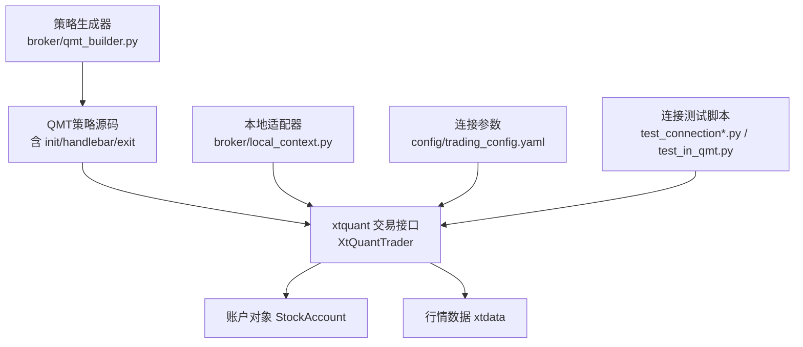
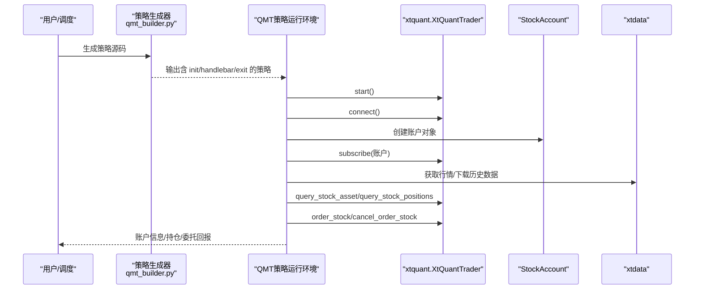
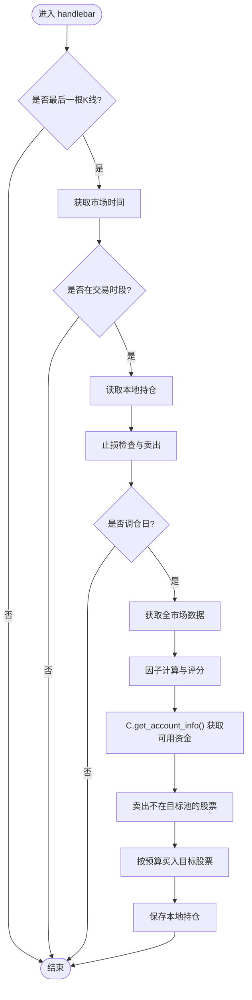
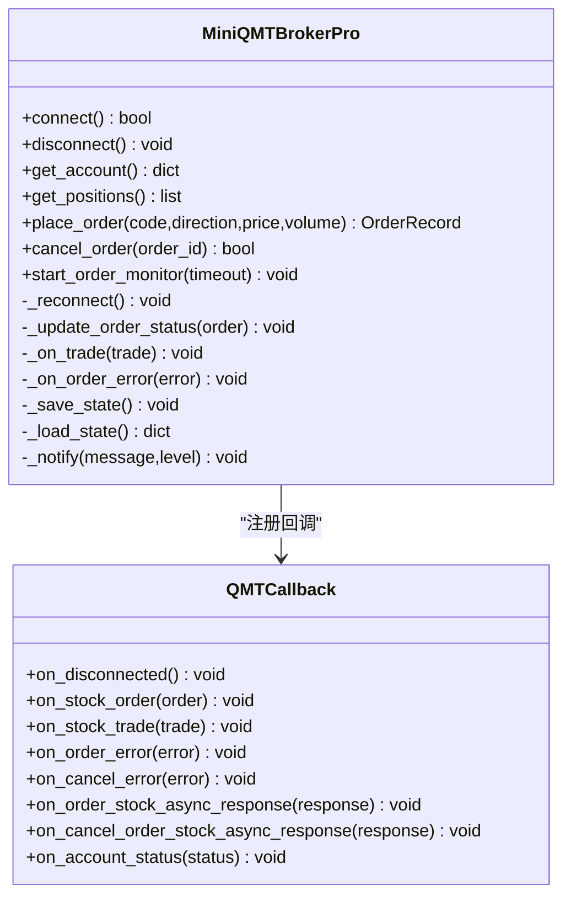
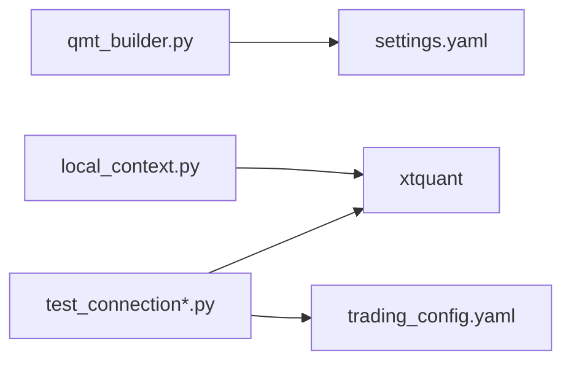

# 账户管理与连接

<cite>
**本文引用的文件**   
- [qmt_builder.py](file://broker/qmt_builder.py)
- [local_context.py](file://broker/local_context.py)
- [trading_config.yaml](file://config/trading_config.yaml)
- [test_connection.py](file://test_connection.py)
- [test_connection_qmt.py](file://test_connection_qmt.py)
- [test_in_qmt.py](file://test_in_qmt.py)
- [miniQMT实盘对接_生产级完善方案.md](file://miniQMT实盘对接_生产级完善方案.md)
</cite>

## 目录
1. [简介](#简介)
2. [项目结构](#项目结构)
3. [核心组件](#核心组件)
4. [架构总览](#架构总览)
5. [详细组件分析](#详细组件分析)
6. [依赖关系分析](#依赖关系分析)
7. [性能与稳定性考量](#性能与稳定性考量)
8. [故障排查指南](#故障排查指南)
9. [结论](#结论)
10. [附录：完整示例与最佳实践](#附录完整示例与最佳实践)

## 简介
本技术文档聚焦 QuantLab 的 QMT 账户管理与连接能力，围绕 xtquant 接口展开，覆盖以下关键主题：
- xtquant 账户初始化流程与 set_account() 的使用、账户类型配置
- 账户连接生命周期管理（init、handlebar、exit）在 QMT 策略中的实现原理
- 账户信息查询 API（如 get_account_info()）的使用方法
- 账户状态监控、连接异常处理与自动重连机制
- 权限验证、资金查询、持仓查询等实用功能的落地细节
- 提供可操作的代码示例路径与最佳实践

## 项目结构
与 QMT 账户管理与连接相关的核心文件分布如下：
- broker/qmt_builder.py：生成 QMT 策略源码，包含 init/handlebar/exit 生命周期与 C.set_account("STOCK") 调用
- broker/local_context.py：本地 miniQMT 适配器，封装 XtQuantTrader 连接、账户订阅与基础数据访问
- config/trading_config.yaml：账号、会话ID、QMT路径等连接参数
- test_connection*.py / test_in_qmt.py：连接测试脚本，演示 xttrader.connect、StockAccount.subscribe、query_stock_asset/query_stock_positions
- miniQMT实盘对接_生产级完善方案.md：生产级 Broker 设计（回调、断线重连、委托超时监控、状态持久化、通知）

图表来源
- [qmt_builder.py:164-170](file://broker/qmt_builder.py#L164-L170)
- [local_context.py:27-50](file://broker/local_context.py#L27-L50)
- [trading_config.yaml:4-8](file://config/trading_config.yaml#L4-L8)
- [test_connection.py:55-80](file://test_connection.py#L55-L80)
- [test_connection_qmt.py:52-75](file://test_connection_qmt.py#L52-L75)
- [test_in_qmt.py:23-38](file://test_in_qmt.py#L23-L38)

章节来源
- [qmt_builder.py:1-386](file://broker/qmt_builder.py#L1-L386)
- [local_context.py:1-137](file://broker/local_context.py#L1-L137)
- [trading_config.yaml:1-62](file://config/trading_config.yaml#L1-L62)
- [test_connection.py:1-117](file://test_connection.py#L1-L117)
- [test_connection_qmt.py:1-117](file://test_connection_qmt.py#L1-L117)
- [test_in_qmt.py:1-54](file://test_in_qmt.py#L1-L54)

## 核心组件
- QMT 策略生命周期（init/handlebar/exit）
  - init：设置账户类型为股票账户（C.set_account("STOCK")），初始化策略上下文
  - handlebar：盘中逻辑执行（调仓、止损、下单、查询）
  - exit：退出清理（当前为空实现）
- xtquant 交易接口
  - XtQuantTrader：创建、启动、连接、订阅账户、查询资产/持仓/委托、下单/撤单
  - StockAccount：账户标识对象
  - xtdata：行情数据服务（get_full_tick、download_history_data2 等）
- 本地适配器 LocalContext
  - connect_trader：建立 XtQuantTrader 连接并返回 trader 与 account
  - 封装常用 C.* 方法到 xtdata，便于本地快速验证
- 连接参数配置
  - account.id、account.path、account.session_id 等

章节来源
- [qmt_builder.py:164-170](file://broker/qmt_builder.py#L164-L170)
- [qmt_builder.py:171-369](file://broker/qmt_builder.py#L171-L369)
- [local_context.py:27-50](file://broker/local_context.py#L27-L50)
- [trading_config.yaml:4-8](file://config/trading_config.yaml#L4-L8)

## 架构总览
下图展示 QMT 账户管理与连接的整体架构与交互流程。

图表来源
- [qmt_builder.py:164-170](file://broker/qmt_builder.py#L164-L170)
- [qmt_builder.py:171-369](file://broker/qmt_builder.py#L171-L369)
- [local_context.py:27-50](file://broker/local_context.py#L27-L50)
- [test_connection.py:55-80](file://test_connection.py#L55-L80)
- [test_connection_qmt.py:52-75](file://test_connection_qmt.py#L52-L75)
- [test_in_qmt.py:23-38](file://test_in_qmt.py#L23-L38)

## 详细组件分析

### xtquant 账户初始化与 set_account()
- 账户类型配置
  - 在 QMT 策略 init 中通过 C.set_account("STOCK") 指定账户类型为股票账户
  - 该步骤确保后续 passorder、查询等操作使用正确的账户上下文
- 账户对象与订阅
  - 使用 StockAccount(account_id) 创建账户对象
  - 通过 XtQuantTrader.subscribe(account) 订阅账户，以接收委托/成交回报
- 连接流程
  - XtQuantTrader(path, session_id) → start() → connect()
  - 成功后进行账户订阅与资产/持仓查询验证

章节来源
- [qmt_builder.py:164-170](file://broker/qmt_builder.py#L164-L170)
- [test_connection.py:55-80](file://test_connection.py#L55-L80)
- [test_connection_qmt.py:52-75](file://test_connection_qmt.py#L52-L75)
- [test_in_qmt.py:23-38](file://test_in_qmt.py#L23-L38)

### 账户连接生命周期（init/handlebar/exit）
- init
  - 设置账户类型（C.set_account("STOCK")）
  - 初始化策略上下文（如资金、标志位）
- handlebar
  - 判断是否为最后一根K线，避免重复执行
  - 获取市场时间，过滤非交易时段
  - 读取本地持仓状态，执行止损检查与调仓逻辑
  - 调用 C.get_account_info() 获取可用资金，结合价格计算下单数量
  - 使用 passorder 下单（买入/卖出），记录或更新本地持仓
- exit
  - 当前为空实现，可用于资源释放或日志落盘

图表来源
- [qmt_builder.py:171-369](file://broker/qmt_builder.py#L171-L369)

章节来源
- [qmt_builder.py:164-170](file://broker/qmt_builder.py#L164-L170)
- [qmt_builder.py:171-369](file://broker/qmt_builder.py#L171-L369)

### 账户信息查询 API（get_account_info）
- 在 QMT 策略中通过 C.get_account_info() 获取账户信息字典
- 典型字段包括 cash（可用资金）、总资产、冻结资金等（具体字段由 QMT 返回）
- 用于资金约束与下单数量计算

章节来源
- [qmt_builder.py:312-318](file://broker/qmt_builder.py#L312-L318)

### 账户状态监控、异常处理与自动重连
- 回调类（XtQuantTraderCallback）
  - on_disconnected：触发自动重连
  - on_stock_order/on_stock_trade/on_order_error：委托/成交/错误回调
- 自动重连机制
  - 指数退避重试，限制最大重试次数
  - 重连成功恢复订阅与状态
- 委托超时监控
  - 后台线程定时检查未成交委托，超时自动撤单
- 状态持久化
  - 将连接状态、委托记录、成交记录保存到磁盘，崩溃恢复用
- 通知告警
  - 通过 webhook 发送企业微信/钉钉消息

图表来源
- [miniQMT实盘对接_生产级完善方案.md:129-193](file://miniQMT实盘对接_生产级完善方案.md#L129-L193)
- [miniQMT实盘对接_生产级完善方案.md:199-321](file://miniQMT实盘对接_生产级完善方案.md#L199-L321)
- [miniQMT实盘对接_生产级完善方案.md:357-402](file://miniQMT实盘对接_生产级完善方案.md#L357-L402)
- [miniQMT实盘对接_生产级完善方案.md:407-505](file://miniQMT实盘对接_生产级完善方案.md#L407-L505)
- [miniQMT实盘对接_生产级完善方案.md:510-546](file://miniQMT实盘对接_生产级完善方案.md#L510-L546)
- [miniQMT实盘对接_生产级完善方案.md:551-598](file://miniQMT实盘对接_生产级完善方案.md#L551-L598)
- [miniQMT实盘对接_生产级完善方案.md:603-645](file://miniQMT实盘对接_生产级完善方案.md#L603-L645)
- [miniQMT实盘对接_生产级完善方案.md:650-687](file://miniQMT实盘对接_生产级完善方案.md#L650-L687)
- [miniQMT实盘对接_生产级完善方案.md:692-714](file://miniQMT实盘对接_生产级完善方案.md#L692-L714)

章节来源
- [miniQMT实盘对接_生产级完善方案.md:129-193](file://miniQMT实盘对接_生产级完善方案.md#L129-L193)
- [miniQMT实盘对接_生产级完善方案.md:199-321](file://miniQMT实盘对接_生产级完善方案.md#L199-L321)
- [miniQMT实盘对接_生产级完善方案.md:357-402](file://miniQMT实盘对接_生产级完善方案.md#L357-L402)
- [miniQMT实盘对接_生产级完善方案.md:407-505](file://miniQMT实盘对接_生产级完善方案.md#L407-L505)
- [miniQMT实盘对接_生产级完善方案.md:510-546](file://miniQMT实盘对接_生产级完善方案.md#L510-L546)
- [miniQMT实盘对接_生产级完善方案.md:551-598](file://miniQMT实盘对接_生产级完善方案.md#L551-L598)
- [miniQMT实盘对接_生产级完善方案.md:603-645](file://miniQMT实盘对接_生产级完善方案.md#L603-L645)
- [miniQMT实盘对接_生产级完善方案.md:650-687](file://miniQMT实盘对接_生产级完善方案.md#L650-L687)
- [miniQMT实盘对接_生产级完善方案.md:692-714](file://miniQMT实盘对接_生产级完善方案.md#L692-L714)

### 本地适配器 LocalContext
- connect_trader：创建 XtQuantTrader、注册回调、启动、连接、订阅账户
- 提供 LocalContext 类，映射 C.* 调用到 xtdata，便于本地快速验证
- 对不支持的方法抛出 NotImplementedError，触发 fail-open 行为

章节来源
- [local_context.py:27-50](file://broker/local_context.py#L27-L50)
- [local_context.py:54-107](file://broker/local_context.py#L54-L107)

## 依赖关系分析
- 模块耦合
  - qmt_builder.py 生成策略源码，依赖配置文件 settings.yaml（内部使用）
  - local_context.py 依赖 xtquant（xttrader、xtdata、StockAccount）
  - 测试脚本依赖 trading_config.yaml 的连接参数
- 外部依赖
  - xtquant：交易与行情接口
  - QMT客户端：XtMiniQmt.exe 进程需启动并登录账户
- 潜在循环依赖
  - 无直接循环；策略生成器与本地适配器职责分离

图表来源
- [qmt_builder.py:21-24](file://broker/qmt_builder.py#L21-L24)
- [local_context.py:21-24](file://broker/local_context.py#L21-L24)
- [test_connection.py:34-42](file://test_connection.py#L34-L42)
- [test_connection_qmt.py:33-41](file://test_connection_qmt.py#L33-L41)

章节来源
- [qmt_builder.py:21-24](file://broker/qmt_builder.py#L21-L24)
- [local_context.py:21-24](file://broker/local_context.py#L21-L24)
- [test_connection.py:34-42](file://test_connection.py#L34-L42)
- [test_connection_qmt.py:33-41](file://test_connection_qmt.py#L33-L41)

## 性能与稳定性考量
- 连接与订阅
  - 先 start() 再 connect()，确保底层线程就绪
  - 订阅账户后验证资产查询，确认通道正常
- 回调与异步
  - 使用 XtQuantTraderCallback 处理委托/成交/错误，避免阻塞主流程
- 重连与超时
  - 指数退避重连，限制最大次数，防止雪崩
  - 委托超时监控，自动撤单，避免挂单堆积
- 状态持久化
  - 定期保存连接状态、委托与成交记录，支持崩溃恢复
- 并发安全
  - 使用锁保护订单字典与交易记录，避免竞态条件

[本节为通用指导，不直接分析具体文件]

## 故障排查指南
- 常见连接失败原因
  - QMT 客户端未启动或未登录账户
  - userdata_mini 路径不正确
  - session_id 冲突或被占用
- 账户查询失败
  - 未正确订阅账户（subscribe）
  - 账户类型设置错误（set_account）
- 委托失败
  - 非交易时段下单
  - 资金不足或持仓不足
  - 价格类型或数量不符合规则（如必须100股整数倍）
- 断线与重连
  - 观察 on_disconnected 回调，检查重连日志
  - 确认网络与 QMT 进程状态

章节来源
- [test_connection.py:64-71](file://test_connection.py#L64-L71)
- [test_connection_qmt.py:58-65](file://test_connection_qmt.py#L58-L65)
- [miniQMT实盘对接_生产级完善方案.md:290-312](file://miniQMT实盘对接_生产级完善方案.md#L290-L312)

## 结论
QuantLab 的 QMT 账户管理与连接功能基于 xtquant 接口，提供了从账户初始化、连接生命周期管理到状态监控与自动重连的完整能力。通过策略生成器与本地适配器的配合，既可在 QMT 环境中稳定运行，也可在本地快速验证。生产级方案进一步增强了回调处理、超时监控、状态持久化与通知告警，满足实盘交易的可靠性要求。

[本节为总结性内容，不直接分析具体文件]

## 附录：完整示例与最佳实践

### 账户初始化与连接示例
- 在 QMT 策略 init 中设置账户类型
  - 参考路径：[qmt_builder.py:164-170](file://broker/qmt_builder.py#L164-L170)
- 使用 xttrader.connect 与 StockAccount.subscribe
  - 参考路径：[test_connection.py:55-80](file://test_connection.py#L55-L80)、[test_connection_qmt.py:52-75](file://test_connection_qmt.py#L52-L75)、[test_in_qmt.py:23-38](file://test_in_qmt.py#L23-L38)

### 账户信息查询与持仓查询示例
- 使用 C.get_account_info() 获取可用资金
  - 参考路径：[qmt_builder.py:312-318](file://broker/qmt_builder.py#L312-L318)
- 使用 xttrader.query_stock_asset/query_stock_positions
  - 参考路径：[test_connection.py:75-100](file://test_connection.py#L75-L100)、[test_connection_qmt.py:73-98](file://test_connection_qmt.py#L73-L98)

### 下单与撤单示例
- 使用 passorder 下单（QMT 策略内）
  - 参考路径：[qmt_builder.py:320-365](file://broker/qmt_builder.py#L320-L365)
- 使用 xttrader.order_stock/cancel_order_stock（外部程序）
  - 参考路径：[miniQMT实盘对接_生产级完善方案.md:457-505](file://miniQMT实盘对接_生产级完善方案.md#L457-L505)

### 账户状态监控与自动重连示例
- 注册 XtQuantTraderCallback 处理断线与委托回报
  - 参考路径：[miniQMT实盘对接_生产级完善方案.md:129-193](file://miniQMT实盘对接_生产级完善方案.md#L129-L193)
- 指数退避重连与委托超时监控
  - 参考路径：[miniQMT实盘对接_生产级完善方案.md:290-312](file://miniQMT实盘对接_生产级完善方案.md#L290-L312)、[miniQMT实盘对接_生产级完善方案.md:510-546](file://miniQMT实盘对接_生产级完善方案.md#L510-L546)

### 配置与权限验证
- 连接参数配置（account.id/path/session_id）
  - 参考路径：[trading_config.yaml:4-8](file://config/trading_config.yaml#L4-L8)
- 权限验证建议
  - 连接成功后立即查询资产与持仓，确认账户权限与通道正常
  - 参考路径：[test_connection.py:75-100](file://test_connection.py#L75-L100)

章节来源
- [qmt_builder.py:164-170](file://broker/qmt_builder.py#L164-L170)
- [qmt_builder.py:312-365](file://broker/qmt_builder.py#L312-L365)
- [test_connection.py:55-100](file://test_connection.py#L55-L100)
- [test_connection_qmt.py:52-98](file://test_connection_qmt.py#L52-L98)
- [test_in_qmt.py:23-38](file://test_in_qmt.py#L23-L38)
- [trading_config.yaml:4-8](file://config/trading_config.yaml#L4-L8)
- [miniQMT实盘对接_生产级完善方案.md:129-193](file://miniQMT实盘对接_生产级完善方案.md#L129-L193)
- [miniQMT实盘对接_生产级完善方案.md:290-312](file://miniQMT实盘对接_生产级完善方案.md#L290-L312)
- [miniQMT实盘对接_生产级完善方案.md:457-505](file://miniQMT实盘对接_生产级完善方案.md#L457-L505)
- [miniQMT实盘对接_生产级完善方案.md:510-546](file://miniQMT实盘对接_生产级完善方案.md#L510-L546)