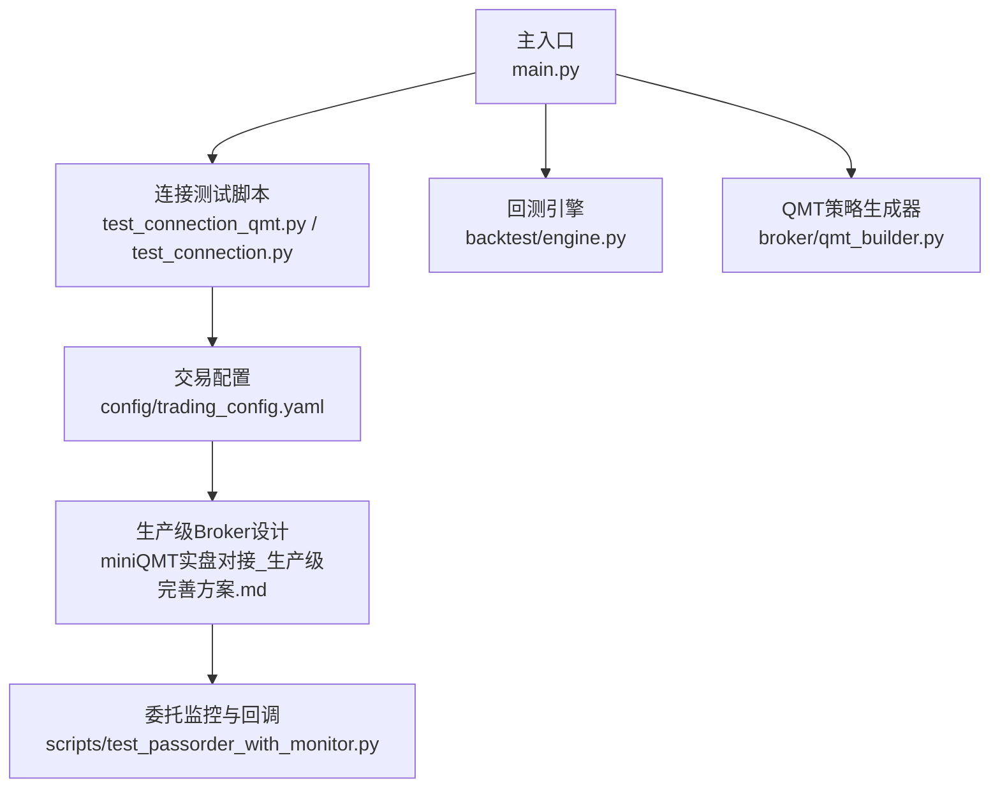
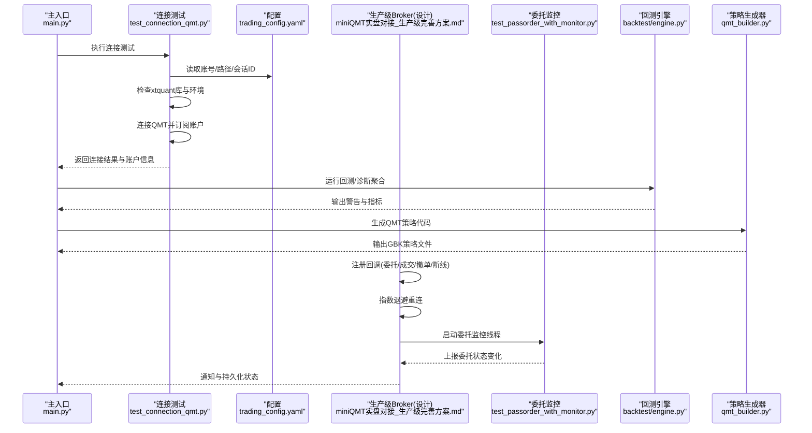
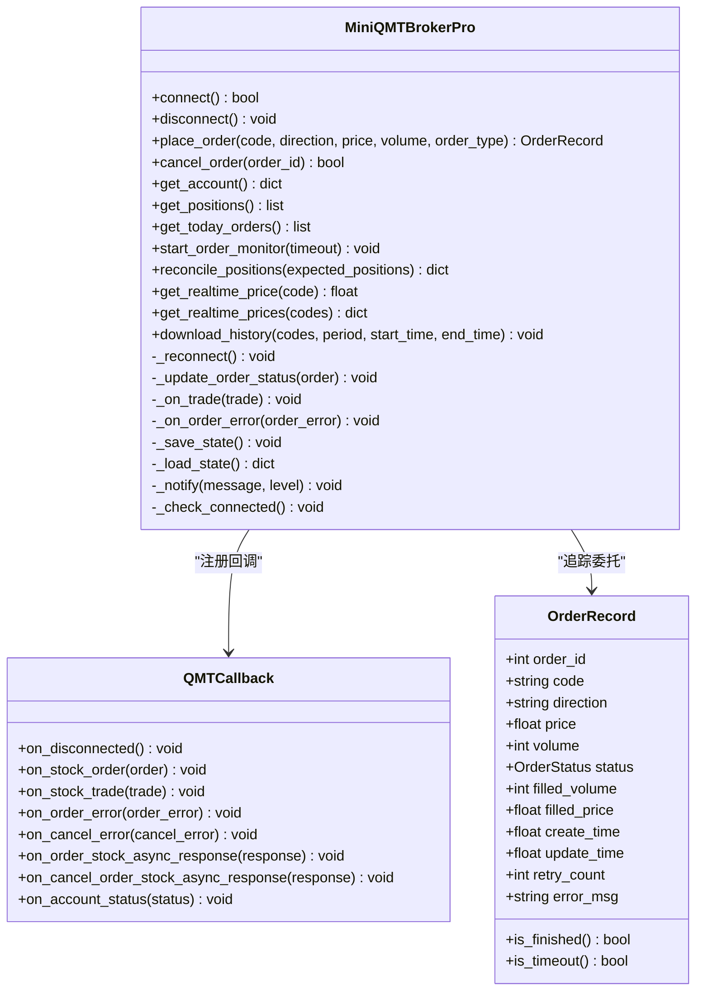
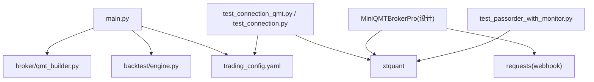

# 错误处理与异常恢复

<cite>
**本文引用的文件**   
- [main.py](file://main.py)
- [test_connection_qmt.py](file://test_connection_qmt.py)
- [test_connection.py](file://test_connection.py)
- [config/trading_config.yaml](file://config/trading_config.yaml)
- [miniQMT实盘对接_生产级完善方案.md](file://miniQMT实盘对接_生产级完善方案.md)
- [scripts/test_passorder_with_monitor.py](file://scripts/test_passorder_with_monitor.py)
- [backtest/engine.py](file://backtest/engine.py)
- [broker/qmt_builder.py](file://broker/qmt_builder.py)
</cite>

## 目录
1. [引言](#引言)
2. [项目结构](#项目结构)
3. [核心组件](#核心组件)
4. [架构总览](#架构总览)
5. [详细组件分析](#详细组件分析)
6. [依赖关系分析](#依赖关系分析)
7. [性能考量](#性能考量)
8. [故障排查指南](#故障排查指南)
9. [结论](#结论)
10. [附录](#附录)

## 引言
本技术文档聚焦 QuantLab 在 QMT 实盘对接中的错误处理与异常恢复机制，覆盖网络异常、API 调用错误、数据解析错误的捕获与分类；详述日志记录、自动重试、降级处理与熔断策略；并给出连接断开后的重连与数据同步流程。文档同时提供常见错误场景的处理方案、性能影响分析与排障指引，帮助读者构建健壮的异常处理与系统监控体系。

## 项目结构
QuantLab 的错误处理与异常恢复主要分布在以下位置：
- 连接测试与诊断脚本：用于环境检查、连接验证与基础错误定位
- 配置中心：集中管理交易参数、风控阈值、订单超时与通知渠道
- 生产级 Broker 设计与实现（文档化）：包含回调、断线重连、委托监控、状态持久化与通知
- 回测引擎：负责日志聚合与诊断指标汇总
- QMT 策略生成器：在策略层内嵌异常捕获与容错逻辑

**图表来源** 
- [main.py:1-104](file://main.py#L1-L104)
- [test_connection_qmt.py:1-117](file://test_connection_qmt.py#L1-L117)
- [test_connection.py:1-117](file://test_connection.py#L1-L117)
- [config/trading_config.yaml:1-62](file://config/trading_config.yaml#L1-L62)
- [miniQMT实盘对接_生产级完善方案.md:73-756](file://miniQMT实盘对接_生产级完善方案.md#L73-L756)
- [scripts/test_passorder_with_monitor.py:1-75](file://scripts/test_passorder_with_monitor.py#L1-L75)
- [backtest/engine.py:1-200](file://backtest/engine.py#L1-L200)
- [broker/qmt_builder.py:1-386](file://broker/qmt_builder.py#L1-L386)

**章节来源**
- [main.py:1-104](file://main.py#L1-L104)
- [config/trading_config.yaml:1-62](file://config/trading_config.yaml#L1-L62)

## 核心组件
- 连接测试与诊断
  - 通过独立脚本进行 xtquant 库检查、路径校验、连接与账户查询，快速定位环境问题与配置错误
- 配置中心
  - 统一维护账号、会话ID、交易参数、风控阈值、订单超时、重试次数、价格容差、通知 webhook 等关键参数
- 生产级 Broker（设计）
  - 基于回调的异步事件驱动：委托回报、成交回报、撤单回报、断线通知
  - 指数退避自动重连、委托超时监控、部分成交处理、持仓对账、状态持久化、通知告警
- 回测引擎
  - 收集每日警告、候选股票统计、未成交订单计数、策略特定指标，形成诊断聚合
- QMT 策略生成器
  - 在生成的 GBK 策略中内置异常捕获、止损卖出、调仓下单与失败回退逻辑

**章节来源**
- [test_connection_qmt.py:1-117](file://test_connection_qmt.py#L1-L117)
- [test_connection.py:1-117](file://test_connection.py#L1-L117)
- [config/trading_config.yaml:1-62](file://config/trading_config.yaml#L1-L62)
- [miniQMT实盘对接_生产级完善方案.md:73-756](file://miniQMT实盘对接_生产级完善方案.md#L73-L756)
- [backtest/engine.py:1-200](file://backtest/engine.py#L1-L200)
- [broker/qmt_builder.py:1-386](file://broker/qmt_builder.py#L1-L386)

## 架构总览
下图展示从主入口到连接测试、配置加载、Broker 设计与策略执行的端到端错误处理与异常恢复流程。

**图表来源** 
- [main.py:1-104](file://main.py#L1-L104)
- [test_connection_qmt.py:1-117](file://test_connection_qmt.py#L1-L117)
- [config/trading_config.yaml:1-62](file://config/trading_config.yaml#L1-L62)
- [miniQMT实盘对接_生产级完善方案.md:73-756](file://miniQMT实盘对接_生产级完善方案.md#L73-L756)
- [scripts/test_passorder_with_monitor.py:1-75](file://scripts/test_passorder_with_monitor.py#L1-L75)
- [backtest/engine.py:1-200](file://backtest/engine.py#L1-L200)
- [broker/qmt_builder.py:1-386](file://broker/qmt_builder.py#L1-L386)

## 详细组件分析

### 连接测试与诊断（test_connection_qmt.py / test_connection.py）
- 功能要点
  - 检查 Python 环境与 xtquant 库可用性
  - 读取 trading_config.yaml 中的 account.path、session_id、account.id
  - 创建 XtQuantTrader、start、connect、subscribe、query_stock_asset、query_stock_positions
  - 打印账户信息与持仓明细，最终 stop 释放资源
- 错误处理
  - ImportError 捕获并提示安装或切换至 QMT 内置 Python
  - connect 非零错误码时输出可能原因（QMT未启动、账号未登录、路径错误）
  - 通用异常捕获并打印堆栈，退出码非零
- 建议改进
  - 增加连接健康检查（如心跳或最小数据拉取）
  - 将错误码映射为可操作修复建议
  - 支持重试与指数退避（可在上层封装）

**章节来源**
- [test_connection_qmt.py:1-117](file://test_connection_qmt.py#L1-L117)
- [test_connection.py:1-117](file://test_connection.py#L1-L117)
- [config/trading_config.yaml:1-62](file://config/trading_config.yaml#L1-L62)

### 配置中心（config/trading_config.yaml）
- 关键键值
  - account.id/path/session_id：账号与连接参数
  - order.timeout_seconds/max_retry/price_tolerance/cancel_unfilled：订单超时、重试、价格容差、超时未成交自动撤单
  - risk.stop_loss_pct/max_drawdown/max_holding_days/max_daily_turnover：风控阈值
  - notification.enabled/method/webhook_url：通知开关、方式与 webhook
- 使用建议
  - 将重连上限、退避间隔、通知 webhook 等敏感参数外置
  - 结合环境变量区分 dev/staging/prod 配置
  - 定期审计风控阈值与交易时段配置一致性

**章节来源**
- [config/trading_config.yaml:1-62](file://config/trading_config.yaml#L1-L62)

### 生产级 Broker 设计与实现（miniQMT实盘对接_生产级完善方案.md）
- 回调与事件驱动
  - on_disconnected：触发指数退避重连
  - on_stock_order/on_stock_trade/on_cancel_error/on_order_error：更新委托状态、记录成交、处理失败
- 自动重连
  - _reconnect：指数退避（最大尝试次数、间隔翻倍、上限保护），成功/失败均通知
- 委托监控
  - start_order_monitor：每10秒扫描未完成委托，超时则按配置自动撤单并标记 TIMEOUT
- 资金/持仓检查
  - place_order：交易时段判断、数量取整、资金不足自动缩减、无持仓拒绝卖出
- 状态持久化
  - _save_state/_load_state：保存订单与最近成交，崩溃后可恢复
- 通知告警
  - _notify：通过 webhook 发送企业微信/钉钉消息，失败不影响主流程
- 工具方法
  - _check_connected：未连接抛出 ConnectionError
  - get_realtime_price/get_realtime_prices/download_history：数据获取封装

**图表来源** 
- [miniQMT实盘对接_生产级完善方案.md:73-756](file://miniQMT实盘对接_生产级完善方案.md#L73-L756)

**章节来源**
- [miniQMT实盘对接_生产级完善方案.md:73-756](file://miniQMT实盘对接_生产级完善方案.md#L73-L756)

### 委托监控与状态跟踪（scripts/test_passorder_with_monitor.py）
- 功能要点
  - 首次下单后，每根 K 线查询委托详情
  - 打印委托状态映射（未报/待报/已报/部成/已成/废单等）
  - 显示成交价与成交数量，便于定位问题
- 错误处理
  - 下单与查询过程均包裹 try/except，避免中断策略循环
- 建议改进
  - 增加超时判定与自动撤单逻辑
  - 将状态变化写入本地日志或数据库，便于回溯

**章节来源**
- [scripts/test_passorder_with_monitor.py:1-75](file://scripts/test_passorder_with_monitor.py#L1-L75)

### 回测引擎的诊断聚合（backtest/engine.py）
- 功能要点
  - 收集 daily_warnings、candidate_total/passed、unfilled_order_count、strategy_specific
  - 计算基准收益与样本期警告，输出诊断摘要
- 错误处理
  - 基准数据缺失或格式异常时降级处理（禁用 IR/excess 等指标）
- 建议改进
  - 将诊断指标暴露为监控面板（Prometheus/Grafana）
  - 增加异常分类与严重级别，便于告警路由

**章节来源**
- [backtest/engine.py:1-200](file://backtest/engine.py#L1-L200)
- [backtest/engine.py:434-443](file://backtest/engine.py#L434-L443)
- [backtest/engine.py:479-522](file://backtest/engine.py#L479-L522)

### QMT 策略生成器的容错逻辑（broker/qmt_builder.py）
- 功能要点
  - init/handlebar/exit 生命周期中嵌入 try/except
  - 止损卖出失败时记录日志并继续
  - 调仓日获取市场数据失败时跳过当日调仓
  - 买入/卖出 passorder 失败时记录日志，不中断策略
- 错误处理
  - 广泛使用 try/except 捕获异常，保证策略鲁棒性
- 建议改进
  - 将失败次数与连续失败阈值纳入风控
  - 增加幂等性与去重逻辑，防止重复下单

**章节来源**
- [broker/qmt_builder.py:1-386](file://broker/qmt_builder.py#L1-L386)

## 依赖关系分析
- 模块耦合
  - main.py 作为入口，依赖配置与回测引擎、策略生成器
  - 连接测试脚本依赖 trading_config.yaml 与 xtquant
  - 生产级 Broker 设计依赖回调机制与通知服务
  - 委托监控脚本依赖 QMT 接口与状态查询
- 外部依赖
  - xtquant（QMT Python SDK）
  - requests（通知 webhook）
  - yaml（配置解析）
- 潜在风险
  - 第三方库版本不一致导致导入失败
  - QMT 客户端未启动或账号未登录导致连接失败
  - 通知 webhook 不可用导致告警丢失

**图表来源** 
- [main.py:1-104](file://main.py#L1-L104)
- [config/trading_config.yaml:1-62](file://config/trading_config.yaml#L1-L62)
- [backtest/engine.py:1-200](file://backtest/engine.py#L1-L200)
- [broker/qmt_builder.py:1-386](file://broker/qmt_builder.py#L1-L386)
- [test_connection_qmt.py:1-117](file://test_connection_qmt.py#L1-L117)
- [test_connection.py:1-117](file://test_connection.py#L1-L117)
- [miniQMT实盘对接_生产级完善方案.md:73-756](file://miniQMT实盘对接_生产级完善方案.md#L73-L756)
- [scripts/test_passorder_with_monitor.py:1-75](file://scripts/test_passorder_with_monitor.py#L1-L75)

**章节来源**
- [main.py:1-104](file://main.py#L1-L104)
- [config/trading_config.yaml:1-62](file://config/trading_config.yaml#L1-L62)

## 性能考量
- 重连策略
  - 指数退避降低服务器压力，避免雪崩效应
  - 设置最大尝试次数与上限等待时间，防止无限重试
- 委托监控
  - 轮询间隔（如10秒）需权衡实时性与 CPU 占用
  - 批量查询与缓存可减少 API 调用频率
- 数据获取
  - 历史数据下载应在盘前执行，避免盘中阻塞
  - 使用分页与增量更新减少带宽与延迟
- 通知服务
  - 异步发送且失败静默，避免阻塞主流程
  - 限制频率与合并消息，降低 webhook 负载

[本节为通用指导，无需具体文件引用]

## 故障排查指南
- 常见问题与处理
  - 连接失败（错误码非零）
    - 检查 QMT 客户端是否启动、账号是否登录、路径是否正确
    - 确认 xtquant 库可用（Python 环境或 QMT 内置 Python）
  - 委托超时未成交
    - 启用自动撤单，记录超时委托并通知
    - 检查价格容差与市场流动性
  - 部分成交
    - 记录已成交量，不追单；必要时调整后续下单量
  - 资金不足/无持仓
    - 自动缩减数量或拒绝下单，记录警告
  - 程序崩溃
    - 利用状态持久化恢复订单与成交记录
  - 持仓对账不一致
    - 以券商为准，告警并人工介入
- 日志与监控
  - 统一日志级别（info/warning/error/critical）
  - 关键事件（连接、下单、成交、撤单、断线、重连）必须记录
  - 将诊断指标接入监控系统，设置阈值告警
- 排障步骤
  - 运行连接测试脚本，逐步定位问题环节
  - 查看委托监控输出，核对状态映射与成交细节
  - 检查配置文件与通知 webhook 有效性
  - 分析回测引擎的诊断聚合，识别系统性问题

**章节来源**
- [test_connection_qmt.py:1-117](file://test_connection_qmt.py#L1-L117)
- [test_connection.py:1-117](file://test_connection.py#L1-L117)
- [miniQMT实盘对接_生产级完善方案.md:73-756](file://miniQMT实盘对接_生产级完善方案.md#L73-L756)
- [scripts/test_passorder_with_monitor.py:1-75](file://scripts/test_passorder_with_monitor.py#L1-L75)
- [backtest/engine.py:1-200](file://backtest/engine.py#L1-L200)

## 结论
QuantLab 在 QMT 实盘对接中构建了较为完善的错误处理与异常恢复体系：通过连接测试与诊断脚本快速定位环境问题；以配置中心统一管理关键参数；在生产级 Broker 设计中实现回调驱动、指数退避重连、委托监控、状态持久化与通知告警；在回测引擎与策略生成器中嵌入诊断聚合与容错逻辑。建议进一步将诊断指标接入监控系统，完善熔断与降级策略，提升系统在复杂市场环境下的鲁棒性与可观测性。

[本节为总结性内容，无需具体文件引用]

## 附录
- 常见错误场景处理矩阵（摘自设计文档）
  - miniQMT 断线：指数退避自动重连（最多10次），通知
  - 委托超时（5分钟）：自动撤单，通知
  - 部分成交：记录已成交量，不追单，通知
  - 资金不足：自动缩减数量或跳过，日志
  - 涨停买不进：跳过该标的，日志
  - 跌停卖不出：标记，次日优先处理，通知
  - 程序崩溃：重启后从磁盘恢复状态，通知
  - 持仓对账不一致：以券商为准，告警
  - 非交易时段下单：拒绝执行，日志
  - 重连10次失败：停止交易，等待人工介入，通知

**章节来源**
- [miniQMT实盘对接_生产级完善方案.md:1418-1434](file://miniQMT实盘对接_生产级完善方案.md#L1418-L1434)