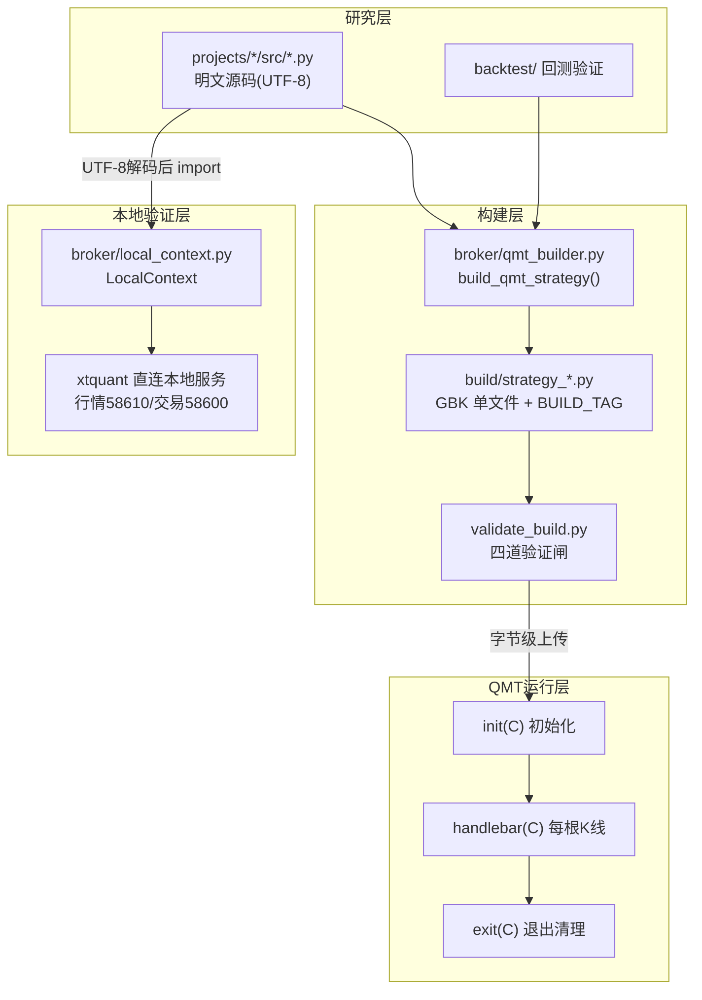
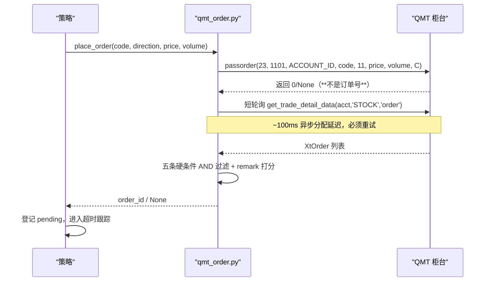
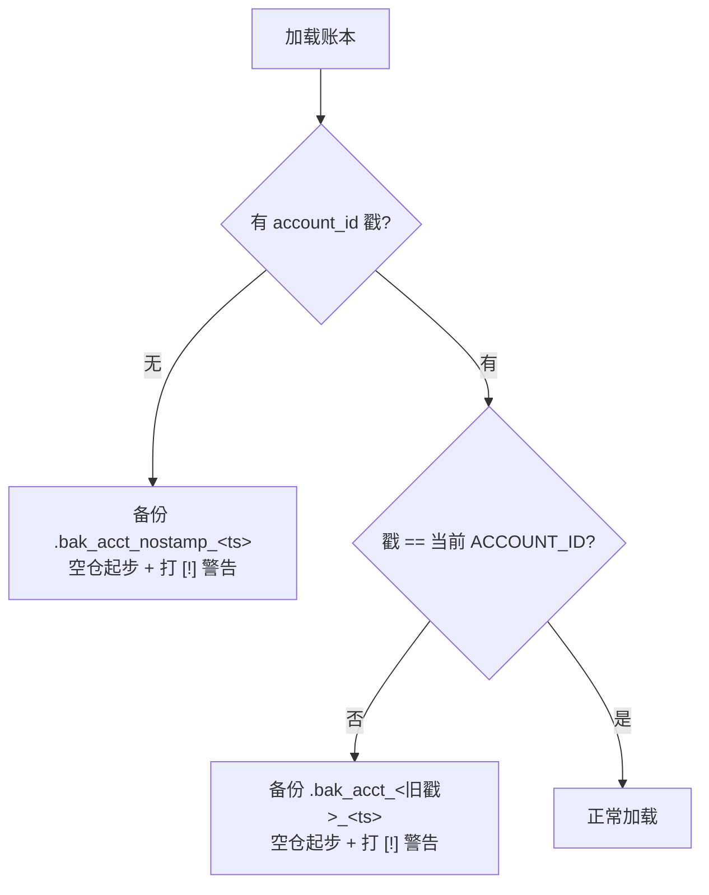
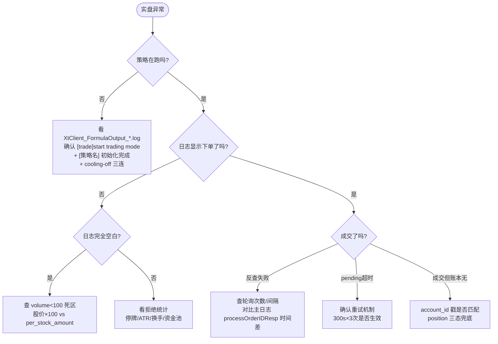

# QMT架构集成

<cite>
**本文档引用的文件**
- [AGENTS.md](file://AGENTS.md) — QMT 红线与实盘执行红线
- [全局复利与踩坑日志.md](file://全局复利与踩坑日志.md) — 跨项目踩坑经验（60+ 条）
- [broker/qmt_order.py](file://broker/qmt_order.py) — 防坑版委托模块
- [broker/QMT委托买卖防坑指南.md](file://broker/QMT委托买卖防坑指南.md)
- [broker/qmt_builder.py](file://broker/qmt_builder.py) — QMT 单文件策略生成器
- [broker/local_context.py](file://broker/local_context.py) — 本地验证适配器
- [资金分配总表与约束.md](file://资金分配总表与约束.md)
</cite>

## 目录
1. [引言](#引言)
2. [架构总览](#架构总览)
3. [QMT 策略生命周期](#qmt-策略生命周期)
4. [编码与语法红线](#编码与语法红线)
5. [委托下单链路](#委托下单链路)
6. [订单反查与 pending 跟踪](#订单反查与-pending-跟踪)
7. [持仓与状态同步](#持仓与状态同步)
8. [时间与调度](#时间与调度)
9. [数据与接口限制](#数据与接口限制)
10. [多策略共存与资金分配](#多策略共存与资金分配)
11. [本地 miniQMT 验证](#本地-miniqmt-验证)
12. [故障排查决策树](#故障排查决策树)
13. [章节来源](#章节来源)

## 引言

QuantLab 的生产通道是国金 QMT（迅投 QMT），分两条腿：**纯 QMT 端策略**（ATR 低波 / 价值小盘 V2 / 黄氏 529，账号 `70180771`）与 **miniQMT（xtquant）策略**（Project_16 LightGBM，账号 `67014907`）。两者共用同一套红线纪律。

> ⚠️ **先看这里**：QMT 实盘 90% 的事故不是策略逻辑错，而是**异步接口误用 + 状态同步断链 + 编码/语法不兼容**。本文档把已付过学费的坑全部固化。

**三条铁律**：

1. 一律复用 `broker/qmt_order.py`（防坑版），**禁止裸调 `passorder`**。
2. 所有 QMT 运行产物必须 GBK 编码，首行 `# coding=gbk`，Python 3.6.8 兼容。
3. 持票账本必须内嵌 `account_id` 戳，不匹配则备份旧档并空仓起步。

## 架构总览



**构建产物纪律**：

- 每个 QMT 构建产物**必须带 `BUILD_TAG`**（格式 `YYYYmmdd-HHMMSS`），`build.py` 每次构建自动替换时间戳；`init(C)` 与每日日志/日终报告都要输出该标记，用于核对「本地构建版本 = 模拟盘实际运行版本」。缺版本标记的构建视为未完成。
- 修改源模块后通过构建脚本重新生成产物，**不要手工长期维护产物中的重复逻辑**。
- 生产版不得混入 mock 或测试代码。

**验证四道闸**（`validate_build.py` 固化）：

| 闸 | 检查项 |
|---|---|
| 静态 | GBK 可解码、首行 `# coding=gbk`、`ast.parse(..., feature_version=(3,6))`、无 f-string/walrus/`match`/新式类型标注 |
| 关键标记 | 关键字符串全在（策略名、账号、BUILD_TAG、风控阈值） |
| 腐蚀 | `?` 乱码计数（曾出现 4168 个 U+FFFD 导致「沪深A股」→「????A??」） |
| 功能 | 模块整体 exec + 核心函数单测 |

章节来源
- [AGENTS.md:92-105](file://AGENTS.md#L92-L105)
- [broker/qmt_builder.py:33-120](file://broker/qmt_builder.py#L33-L120)

## QMT 策略生命周期

```python
# coding=gbk
def init(C):
    # 1. 加载 config（不得依赖 __file__）
    # 2. 加载持票账本（校验 account_id 戳）
    # 3. 打印 BUILD_TAG + 生效账号
    # 4. 「启动时执行一次」的盘后任务放这里末尾
    pass

def handlebar(C):
    # 每根 K 线触发；15:00 后不再触发
    pass

def exit(C):
    pass
```

**关键约束**：

- **收盘（15:00）后 handlebar 不再触发**，最后一帧是 15:00。把导出/收盘任务绑在 `now >= '1505'` 会**永不触发** → 改 1500。
- 「策略启动时执行一次」的任务放 `init` 末尾，「盘中定时」放 `handlebar`，两者用标志联动防重复。
- 策略代码粘到 QMT 终端运行后会**自动加密成密文** `STRATEGY.py`，本地改代码必须**重新粘**才生效。
- `_load_config()` **不得用 `__file__` 算路径**（QMT exec 环境 `__file__` 指向运行设备）→ 用候选路径 + 完整 `_DEFAULT_CONFIG` fallback，保证自包含。

## 编码与语法红线

| 类别 | 规则 | 原因 |
|---|---|---|
| 编码 | 首行必须 `# coding=gbk` | QMT 内部文件读写默认 GBK，`# coding=utf-8` 报红线 |
| 类型标注 | 禁止 `dict[str,...]` / `list[str]` / `str \| None` | Python 3.6.8 |
| 表达式 | 禁止 `:=` 海象运算符 | 同上 |
| 语法 | 禁止 `match/case`、f-string | 同上 |
| 函数 | `passorder()` 是**全局函数**，不是 `C.passorder()` | 报 `'__PyContext' object has no attribute` |
| 账号 | 硬编码 `ACCOUNT_ID`，`C.accountid` 不存在 | ContextInfo 无该属性 |
| 依赖 | 只依赖 xtquant/pandas/numpy；第三方 import 必须 try/except fallback | 重装后 `import yaml` 直接崩、策略未初始化却无显眼报错（曾导致 600641 当日跌 8.41% 也未触发硬止损） |
| 变量 | 函数内给全局变量赋值必须先 `global` 声明 | 否则 `UnboundLocalError` |

> ⚠️ **编码腐蚀事故（2026-08-19）**：修复脚本用 `open("w")` + GBK 编码异常，把 ATR build 截断为 0 字节 / 或产生 4168 个 `?`。已改为**原子写入** + pyc 校验 + 字节级 identical 校验。任何部署前必须以 git HEAD 为准。

## 委托下单链路



### 参数与返回

`passorder(opType, orderType, accountid, orderCode, prType, modelprice, volume, ContextInfo)`

- 示例：`passorder(23, 1101, ACCOUNT_ID, code, 11, price, volume, C)`
- `prType=5` 为**最新价**（非对手价，2026-08-27 注释修正）
- **异步接口，正常返回 `0` 或 `None`，不是订单号**。把返回值当 order_id → 0 流进跟踪字典 → 孤儿委托。

### pending 超时策略（2026-08-25 修订）

| 阶段 | 行为 |
|---|---|
| 超时阈值 | **300 秒**（原 30 秒，浙能电力 600023 实盘痛点） |
| 重试次数 | 最多 **3 次** |
| 重试动作 | 撤单 → 按最新价重新 passorder → 更新 `pending['time']` + `pending['retry']` → 继续跟踪 |
| 彻底放弃 | 3 次重试（约 15 分钟）仍不成交，打印「pending放弃」 |

> 🔴 **禁止**出现「30 秒超时即撤单删 pending、永不补单」的写法。

## 订单反查与 pending 跟踪

**反查硬条件只保留五条 AND**：`code / volume / status / direction / time`。

> ⚠️ **`remark` 只能作候选优先级信号，不能硬过滤**。QMT 版本/字段格式一变，硬卡 remark 会让全部委托被误判失败。唯一候选即使 remark 空也返回。

### XtOrder 字段速查

| 字段 | 说明 |
|---|---|
| `m_nOrderID` / `m_strInstrumentID` / `m_strExchangeID` | 订单号 / 代码 / 交易所 |
| `m_nOrderVolume` / `m_nVolumeTraded` | 委托量 / 已成交量 |
| `m_strRemark` | 备注（**仅作打分，不硬过滤**） |
| `m_nOrderStatus` | 54/55/57 = 已撤 / 已废 / 已拒；50 = 未申报 |
| `m_strOptName` | **判方向优先用此字段**（含中文「买入」/「卖出」） |
| `m_strInsertTime` | HHMMSS 字符串 |

- **避免主用**：`m_nOffsetFlag` / `m_nDirection` / `m_strOpType`（未实测）。
- 时间换算：`time.time()` epoch → localtime → `hour*10000+min*100+sec`，与 `int(m_strInsertTime[-6:])` 比较，**-1 秒容差**。
- 待报单（status=50、`m_nOrderVolume` 空）**不能**被 `vol != expected_vol` 误 continue。

### 短轮询参数

`SELL_LOOKUP_RETRIES` / `INTERVAL`（初版 4/0.2s 实测不够，已加到 15/3s）。

> 🔗 **静默断链机理**：设计「限价不成交→撤单→市价重试」，但触发前提是首次限价单反查成功并登记 pending。**反查失败断在最前** → 后续撤单/市价重试分支永不触发。表象「限价单不成交也不换市价」的根因不是缺机制，是反查断链。

### 账户资金字段映射（国金 QMT）

| 语义 | 字段 |
|---|---|
| 总资产 | **`m_dAssetBalance`**（`m_dTotalAsset`/`totalAsset`/`m_dTotal` 均不存在） |
| 可用资金 | `m_dAvailable` |
| 持仓市值 | `m_dStockValue` / `m_dInstrumentValue` |

> ⚠️ `m_strStatus` 实测显示「登录失败」但通道正常，**不要据此判断通道状态**。fallback 链写错会把可用资金误当总资产。

## 持仓与状态同步

### 孤儿持仓（最危险）

**定义**：账户有票、但持仓文件没记录 → 卖出引擎不评估这只票 → **止损/止盈永不触发**（603283 -7.7% 硬止损当天没卖）。

**修复**：从账户全量持仓纳管（`get_holdings()` 取 volume>0 且不在 `_g_my_codes` 的票，成本取 `m_dOpenPrice`）；卖出评估每轮前补一次 sync（幂等）。

> 坑：init 首帧调 sync 时 QMT 交易通道未就绪可能空返 → 需要后续轮次兜底补纳管。

### 清仓票当天赖在持仓表

**根因**：成交确认后 pop 被 `if pos.volume <= 0` 卡住——`get_position` 读 QMT 端缓存，卖出成交后缓存刷新延迟（秒~分钟级），当天 volume 仍是旧值。

**修复**：pop 改**无条件** + 成交确认后立即写持仓文件 + 缓存仍显量时打 warning。

### 持票账本 account_id 戳（2026-08-23 立红线）



**覆盖范围**：ATR EW build、V2 源+build、P13 源+build、Project_16（2026-08-28 补齐，逻辑集中在 `qmt_config.py` 的 `append_trade_rows` / `load_trade_log_rows` / `load_capital_pool`，7 个调用方接入）。

> 起因：远程 config 里 `account_id` 未随迁号同步 → 八笔买入零成交、账本出现 8 只幻影持仓、季度键被锁死整季不再建仓。

### 账户 position 是唯一真相

QMT 远程 position 可能是 `CPositionDetail` 对象，字段是 `m_strInstrumentID` / `m_strSecurityCode`（**非 `m_strCode`，且无 `.get()` 方法**）。曾出现 `'CPositionDetail' object has no attribute 'get'`。

> 对账纪律：**deal 反查空不再等于未成交**。买入/卖出撤销前查账户 position 兜底（三态：有货保留 / 无货才撤销 / 查询失败保守保留）。

## 时间与调度

| 规则 | 说明 |
|---|---|
| **必须用 `C.get_current_time()`** | 设备 CMOS 电池没电、断电后时钟错乱，`datetime.now()` 会按错时钟触发尾盘 |
| 三级兜底 | 行情时间 year>=2020 → K线末根日期 → 设备时间 + 警告 |
| 相对计时 | 冷却/耗时用 `time.time()`，不受设备时钟影响 |
| 启动日志 | 打 `[时间校验] 行情时间=... 设备时间=...` |
| 15:00 后 | handlebar 不再触发，收盘任务改绑 1500 |

## 数据与接口限制

| 限制 | 事实 | 应对 |
|---|---|---|
| 财务字段 | `C.get_market_data_ex` **不支持** pe_ttm/pb/circ_mv（返回 NaN） | 从 astock parquet 预生成 CSV，策略 `pd.read_csv` |
| parquet | QMT Python 3.6.8 **无 pyarrow** | 数据源用 CSV |
| 换手率 | `C.get_turnover_rate()` **不存在** | 捕获 AttributeError 后跳过换手率过滤（fail-open） |
| 成交/委托 | 模拟端 `get_trade_detail_data` **只保留当日**，隔日查不到 | 每日收盘导出 CSV 到 `D:/QMT_POOL/` 是**刚需不是便利** |
| 分钟线 | 1min/5min 历史深度仅近 1 年（服务器端硬上限，与 start_time 无关） | 日线可到 2010；分钟级任务用 astock（1min 从 2009-01-05） |
| 单位 | `circ_mv` 单位是**万元**，30 亿 = 300000 | 换算时注意 |
| 新设备 | 解释器在 `bin.x64\pythonw.exe`（非 python 目录），自带 numpy/pandas/xtquant，**唯一缺 pyyaml** | 必拷 `strategy_main.py`（GBK，二进制拷）+ config；历史 K 线需补 ≥120 交易日 |

### 导出逻辑独立部署

主策略只做交易 + 日志/对账/SAFEMODE；导出成交/持仓/资金 CSV **独立成可部署文件**（`数据导出.py`，K线1分钟，init 即导出）。Why：导出 bug 会牵连主策略；独立部署可单独更新/重启不影响交易。

### 日志排查

| 项目 | 位置 |
|---|---|
| 业务日志（策略 print） | `XtClient_FormulaOutput_YYYYMMDD.log` |
| 引擎层 INFO | `XtClient_Formula_*.log`（**不含业务 print**） |
| 编码 | FormulaOutput 是 **UTF-8**（源码 GBK 但落盘 UTF-8），用 GBK 解会乱码 |
| 日期可信度 | CMOS 错乱时 `strategy_log_*.txt` 文件名不可信，看内容 `today=`（行情时间） |

> 「卖出只在 10 点触发」是**静默假象**——卖出评估全天有效，`[卖出评估]` 每票每天首次去重打印造成错觉。排查「没卖出」要看心跳行/每个操作点日志。

## 多策略共存与资金分配

### 虚拟子账户模型

同一共享账号下各策略**不是物理隔离**，靠约定 + 代码纪律实现逻辑隔离：

- **各策略只认自己的钱**：买入规模 = `本策略 NAV / n_target`，`NAV = 本策略持仓当前市值（含浮盈）`，与账户里别人占了多少现金无关。
- **账户现金只是结算介质**：买时若账户现金不足（被别的策略用了），订单失败 → 下根 K 线重试，**不抢占别人的钱**。
- **各策略只动自己的票**：再平衡只买目标里自己没有/不足量的票、只卖自己 ledger 里不再在目标中的票（且只卖自己记录的量）。

> ⚠️ **唯一无法靠代码根治的限制**：虚拟子账户能防止本策略去抢别人的钱，但**同一共享账户无法物理阻止别的策略花掉「你的 10 万」**。要真物理隔离必须开子账户/多模拟账号。

### 三条硬规则

1. 每个策略锁定独立 `capital_base`，绝不抢占他人资金、绝不纳管/卖出他人持仓。
2. **`Σ 各策略 capital_base ≤ 账户实际总资产`**（最重要）。超额 = 多策略互相抢现金、买入普遍失败。
3. 改了分配必须跑 `python scripts/check_capital_allocation.py`，**退出码 0 才许部署**。

### 双账号并存（2026-08-25 用户确认）

| 账号 | 用途 | 通道 |
|---|---|---|
| `67014907` | Project_16 LightGBM（**仍在用**） | miniQMT / xtquant |
| `70180771` | ATR低波 / 价值小盘V2 / 黄氏529 | 纯 QMT 端 |

> ⚠️ 此前「67014907 已停用、全策略换号 70180771」的说法**已被推翻**。哪个策略用哪个号必须严格对应，**引用错号会废单**。Project_16 的 build/脚本引用 `67014907` 属正常。

## 本地 miniQMT 验证

用 `xtquant` SDK 在外部 Python 直接驱动策略的真实选股/评分函数，免去「改完→部署远程→等交易日」的长周期（远程一天只能验证一次，本地 10 秒一次）。

**三步**：

1. **只读探针**：验证行情/交易链路、账户、样本行情（**绝不下单**）。
2. **本地实跑**：`LocalContext` 适配器把策略 `C.*` 映射到 `xtdata`，UTF-8 解码源文件后 `import`，调策略真实选股函数实跑。
3. **判读**：`筛选完成: X只` 与拒绝统计（数据不足 / ATR过高 / 换手越界 / 换手未知）。

> 🔴 **必踩坑**：源文件头标 `# coding=gbk` 但**实为 UTF-8**（部署时才由构建脚本转 GBK）。本地 import 必须 `_raw.decode('utf-8')` 并改文件头，否则中文 `'沪深A股'` 字面量被改坏 → 返回 0 只，误判成「0 候选」。

**能力边界**：

| 本地能验证 | 必须上远程 |
|---|---|
| 选股/评分管线是否通 | `is_last_bar()` 守卫（依赖历史 K 线回放） |
| 换手率 fail-open 是否生效 | 真实换手率 1–8% 过滤（xtdata 无 `get_turnover_rate`，本地只触发 fail-open） |
| ATR/成交额/数据过滤 | 真实下单 / SAFEMODE |
| 参数调整后候选数量与排序 | 持仓纳管反查、全天调度/心跳节奏 |
| 编码/导入/适配器问题 | — |

**实测（ATR 低波）**：全市场 5206 只实时数据，9.9s 扫完，`筛选完成: 3 只`；换手越界 0、换手未知 3337（本地无换手 API，fail-open 放行）。

## 故障排查决策树



**通用排查顺序（下单类）**：策略没下单 → 先确认策略在跑 → 再看持仓可卖量（老挂单占 `enableAmount=0`）→ 最后看触发逻辑。

**事故模式速查**：

| 表象 | 根因 |
|---|---|
| 「订单号无效(0)，清理」循环挂死 | 把 passorder 返回值当 order_id |
| 买卖反查失败但 QMT 实际成交 | ~100ms 异步延迟，轮询不足 |
| 限价单不成交也不撤单换市价 | 反查断链，pending 无对象 |
| 止损/止盈永不触发 | 孤儿持仓（账户有票、账本无记录） |
| 全天零委托但日志显示「再平衡完成」 | 盘前空 bar 误判停牌 + 季度键死守卫 |
| 账本幻影持仓 | account_id 戳不匹配 / 远程 config 未同步 |
| 中文显示 `????A??` | 编码腐蚀，禁止部署，回退 git HEAD |

## 章节来源

- [AGENTS.md:92-160](file://AGENTS.md#L92-L160)
- [全局复利与踩坑日志.md:9-167](file://全局复利与踩坑日志.md#L9-L167)
- [broker/QMT委托买卖防坑指南.md](file://broker/QMT委托买卖防坑指南.md)
- [资金分配总表与约束.md:1-45](file://资金分配总表与约束.md#L1-L45)
