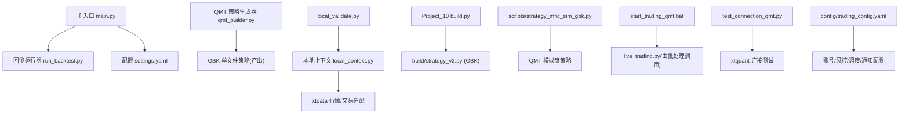
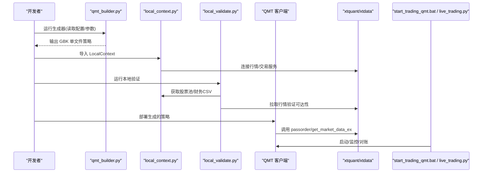
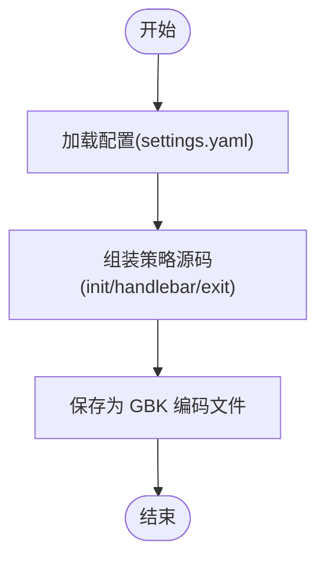
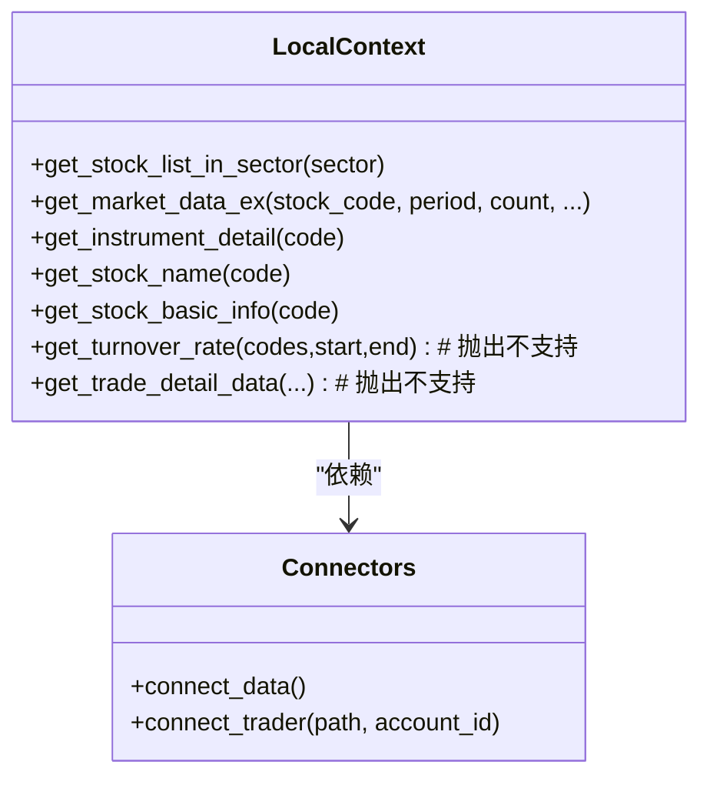
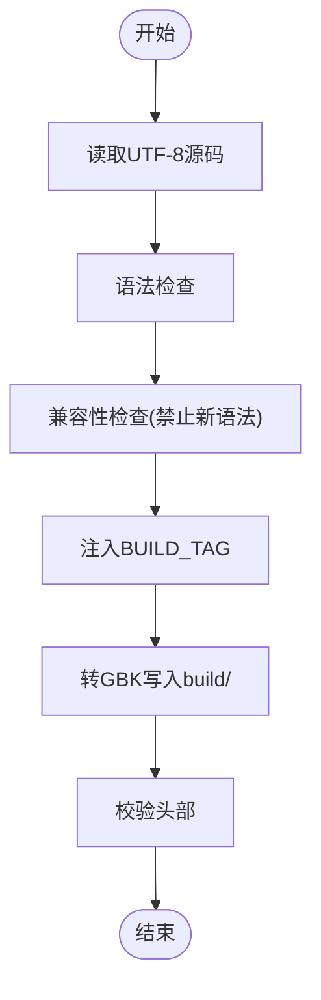
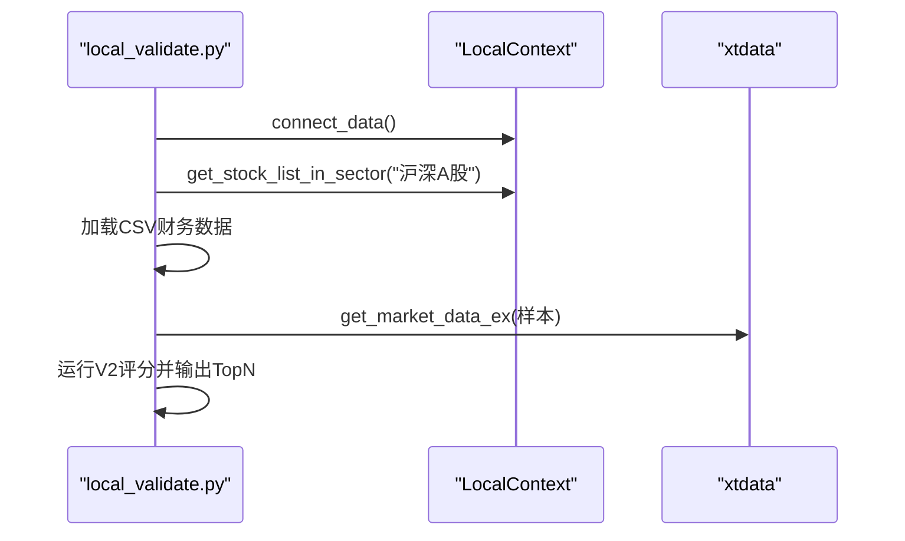
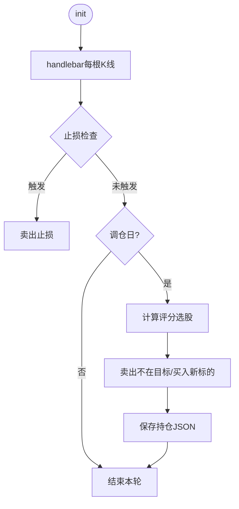
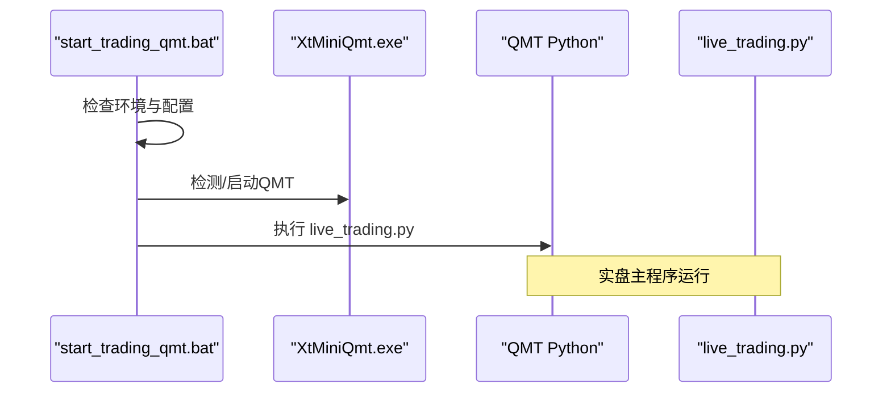
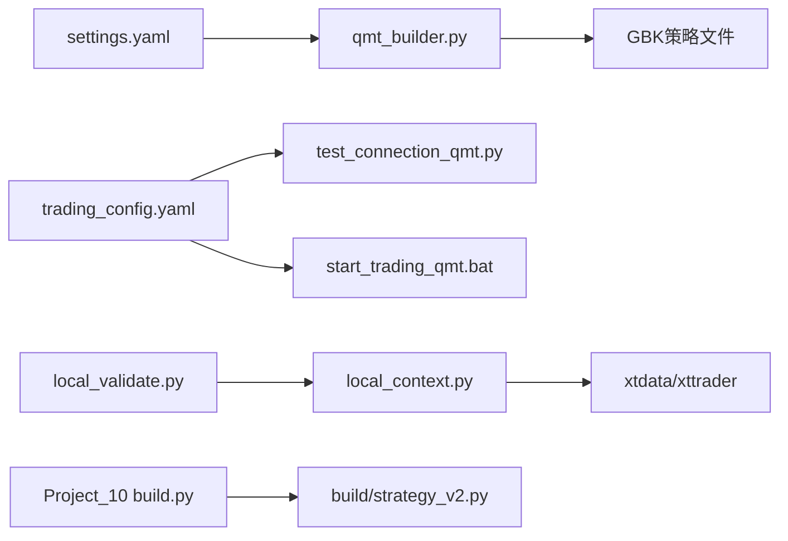

# 实盘交易系统

<cite>
**本文引用的文件**   
- [main.py](file://main.py)
- [broker/qmt_builder.py](file://broker/qmt_builder.py)
- [broker/local_context.py](file://broker/local_context.py)
- [config/settings.yaml](file://config/settings.yaml)
- [config/trading_config.yaml](file://config/trading_config.yaml)
- [projects/Project_10_价值小盘V2/build.py](file://projects/Project_10_价值小盘V2/build.py)
- [projects/Project_10_价值小盘V2/local_validate.py](file://projects/Project_10_价值小盘V2/local_validate.py)
- [scripts/strategy_mfic_sim_gbk.py](file://scripts/strategy_mfic_sim_gbk.py)
- [start_trading_qmt.bat](file://start_trading_qmt.bat)
- [test_connection_qmt.py](file://test_connection_qmt.py)
- [A股量化框架_五大扩展模块.md](file://A股量化框架_五大扩展模块.md)
- [miniQMT实盘对接_生产级完善方案.md](file://miniQMT实盘对接_生产级完善方案.md)
- [实盘配置指南.md](file://实盘配置指南.md)
</cite>

## 目录
1. [简介](#简介)
2. [项目结构](#项目结构)
3. [核心组件](#核心组件)
4. [架构总览](#架构总览)
5. [详细组件分析](#详细组件分析)
6. [依赖关系分析](#依赖关系分析)
7. [性能与稳定性](#性能与稳定性)
8. [故障排查指南](#故障排查指南)
9. [结论](#结论)
10. [附录：部署与最佳实践](#附录部署与最佳实践)

## 简介
本文件系统性地梳理 QuantLab 的实盘交易体系，重点覆盖以下方面：
- QMT 平台集成原理与 xtquant 接口封装适配
- 策略生成器机制：将本地策略转换为 QMT 兼容的 GBK 编码单文件策略
- 本地验证适配器：在模拟环境下进行策略测试与调试
- 实盘配置管理：账户、风控、调度计划等关键配置项
- 风险控制机制：仓位限制、止损止盈、异常处理与对账
- 完整部署流程：从构建、部署到监控与排障
- 实盘交易最佳实践与安全注意事项

## 项目结构
QuantLab 采用“研究-回测-实盘”分层组织，核心目录职责如下：
- backtest：回测引擎、执行、组合、报告等
- broker：QMT 策略生成器与本地 miniQMT 上下文适配
- config：全局与实盘配置文件（settings.yaml、trading_config.yaml）
- data：数据读取与行情获取
- factors：因子计算与引擎
- projects：各策略项目（含 QMT 构建脚本与本地验证脚本）
- scripts：批量任务、示例策略与工具脚本
- reports：回测结果输出
- 根目录入口与批处理脚本：main.py、start_trading_qmt.bat、test_connection_qmt.py

图表来源
- [main.py:1-104](file://main.py#L1-L104)
- [broker/qmt_builder.py:1-386](file://broker/qmt_builder.py#L1-L386)
- [broker/local_context.py:1-137](file://broker/local_context.py#L1-L137)
- [projects/Project_10_价值小盘V2/build.py:1-69](file://projects/Project_10_价值小盘V2/build.py#L1-L69)
- [projects/Project_10_价值小盘V2/local_validate.py:1-151](file://projects/Project_10_价值小盘V2/local_validate.py#L1-L151)
- [scripts/strategy_mfic_sim_gbk.py:1-340](file://scripts/strategy_mfic_sim_gbk.py#L1-L340)
- [start_trading_qmt.bat:1-66](file://start_trading_qmt.bat#L1-L66)
- [test_connection_qmt.py:1-117](file://test_connection_qmt.py#L1-L117)
- [config/settings.yaml:1-69](file://config/settings.yaml#L1-L69)
- [config/trading_config.yaml:1-59](file://config/trading_config.yaml#L1-L59)

章节来源
- [main.py:1-104](file://main.py#L1-L104)
- [config/settings.yaml:1-69](file://config/settings.yaml#L1-L69)

## 核心组件
- QMT 策略生成器（broker/qmt_builder.py）
  - 作用：读取配置与策略参数，组装 QMT 生命周期 + 策略逻辑 + 因子计算，输出 GBK 编码的单文件策略。
  - 关键点：内置时间判断、调仓日判定、止损检查、选股评分、下单 passorder 调用、持仓持久化。
- 本地上下文适配（broker/local_context.py）
  - 作用：LocalContext 将 QMT 策略中的 C.* 调用映射到本地 xtdata，用于快速验证；提供 connect_data/connect_trader 与 load_strategy_source 工具。
  - 关键点：未实现接口抛出不支持异常以触发 fail-open；加载策略源码时自动修正编码头。
- Project_10 构建器（projects/Project_10_价值小盘V2/build.py）
  - 作用：对 UTF-8 源码进行语法检查、禁止不兼容语法、注入构建标签、转 GBK 写入 build 目录并校验头部。
- 本地验证脚本（projects/Project_10_价值小盘V2/local_validate.py）
  - 作用：连接 miniQMT，拉取股票池与财务CSV，运行 V2 评分管线，验证 xtdata 行情可达性。
- 模拟盘策略（scripts/strategy_mfic_sim_gbk.py）
  - 作用：多因子IC小盘Alpha 的 QMT 模拟盘策略，包含止损、双月调仓、评分选股、日志记录等。
- 启动与连接测试
  - start_trading_qmt.bat：检查环境、启动 QMT、使用 QMT Python 运行 live_trading.py。
  - test_connection_qmt.py：使用 QMT Python 测试 xtquant 连接、账户查询与持仓打印。

章节来源
- [broker/qmt_builder.py:1-386](file://broker/qmt_builder.py#L1-L386)
- [broker/local_context.py:1-137](file://broker/local_context.py#L1-L137)
- [projects/Project_10_价值小盘V2/build.py:1-69](file://projects/Project_10_价值小盘V2/build.py#L1-L69)
- [projects/Project_10_价值小盘V2/local_validate.py:1-151](file://projects/Project_10_价值小盘V2/local_validate.py#L1-L151)
- [scripts/strategy_mfic_sim_gbk.py:1-340](file://scripts/strategy_mfic_sim_gbk.py#L1-L340)
- [start_trading_qmt.bat:1-66](file://start_trading_qmt.bat#L1-L66)
- [test_connection_qmt.py:1-117](file://test_connection_qmt.py#L1-L117)

## 架构总览
系统围绕“策略生成 → 本地验证 → QMT 部署 → 实时监控 → 风控对账”的主线展开。

图表来源
- [broker/qmt_builder.py:1-386](file://broker/qmt_builder.py#L1-L386)
- [broker/local_context.py:1-137](file://broker/local_context.py#L1-L137)
- [projects/Project_10_价值小盘V2/local_validate.py:1-151](file://projects/Project_10_价值小盘V2/local_validate.py#L1-L151)
- [scripts/strategy_mfic_sim_gbk.py:1-340](file://scripts/strategy_mfic_sim_gbk.py#L1-L340)
- [start_trading_qmt.bat:1-66](file://start_trading_qmt.bat#L1-L66)

## 详细组件分析

### QMT 策略生成器（broker/qmt_builder.py）
- 功能要点
  - 读取 settings.yaml 中 project_01/live/market_cap/factors 等配置
  - 生成 init/handlebar/exit 生命周期函数
  - 内置调仓日判断、止损检查、全市场选股、评分加权、passorder 下单、持仓 JSON 持久化
  - 输出 GBK 编码单文件策略，便于粘贴至 QMT 编辑器或部署
- 复杂度与优化
  - 全市场数据拉取与因子计算为 O(N)，建议分批拉取与缓存
  - 评分标准化与加权可考虑向量化与增量更新
- 错误处理
  - 数据获取失败、tick 为空、价格非法等均有 try/except 保护
  - 写入失败会打印日志但不中断流程

图表来源
- [broker/qmt_builder.py:1-386](file://broker/qmt_builder.py#L1-L386)

章节来源
- [broker/qmt_builder.py:1-386](file://broker/qmt_builder.py#L1-L386)

### 本地上下文适配（broker/local_context.py）
- 功能要点
  - LocalContext 类将 C.get_stock_list_in_sector、C.get_market_data_ex 等映射到 xtdata
  - connect_data/connect_trader 负责 xtdata 与 XtQuantTrader 的连接与订阅
  - load_strategy_source 动态加载策略源码，修正编码头避免告警
- 设计模式
  - 适配器模式：屏蔽 QMT 与本地差异，使策略代码无需改动即可在本地验证
- 未实现接口
  - 对不支持的方法抛出 NotImplementedError，触发 fail-open，保证安全

图表来源
- [broker/local_context.py:1-137](file://broker/local_context.py#L1-L137)

章节来源
- [broker/local_context.py:1-137](file://broker/local_context.py#L1-L137)

### Project_10 构建器（projects/Project_10_价值小盘V2/build.py）
- 功能要点
  - 读取 UTF-8 源码，编译检查语法
  - 禁止 Python 3.6+ 新语法（:=、类型注解、match/case）
  - 注入 BUILD_TAG 时间戳，转 GBK 写入 build/ 目录并校验头部
- 适用场景
  - 将项目内 UTF-8 策略源码转换为 QMT 可执行的 GBK 单文件

图表来源
- [projects/Project_10_价值小盘V2/build.py:1-69](file://projects/Project_10_价值小盘V2/build.py#L1-L69)

章节来源
- [projects/Project_10_价值小盘V2/build.py:1-69](file://projects/Project_10_价值小盘V2/build.py#L1-L69)

### 本地验证脚本（projects/Project_10_价值小盘V2/local_validate.py）
- 功能要点
  - 连接 miniQMT，获取沪深A股列表
  - 加载 CSV 财务数据（PB/PE/市值/行业）
  - 运行 V2 评分（行业中性 z-score），输出 Top N 候选
  - 验证 xtdata 行情可达性（拉取样本行情）
- 使用方式
  - 通过本地 Python 环境运行，依赖 xtdata 与 LocalContext

图表来源
- [projects/Project_10_价值小盘V2/local_validate.py:1-151](file://projects/Project_10_价值小盘V2/local_validate.py#L1-L151)
- [broker/local_context.py:1-137](file://broker/local_context.py#L1-L137)

章节来源
- [projects/Project_10_价值小盘V2/local_validate.py:1-151](file://projects/Project_10_价值小盘V2/local_validate.py#L1-L151)

### 模拟盘策略（scripts/strategy_mfic_sim_gbk.py）
- 功能要点
  - 初始化账户、加载财务CSV、计算四因子评分（BP/反转/低波/ROE）
  - 双月调仓、止损检查、买入卖出 passorder 调用、日志与持仓持久化
  - 适用于 QMT 模拟盘全天运行
- 风险与健壮性
  - 财务数据缺失、行情不可用、价格非法等均有异常保护
  - 日志写入失败不影响主流程

图表来源
- [scripts/strategy_mfic_sim_gbk.py:1-340](file://scripts/strategy_mfic_sim_gbk.py#L1-L340)

章节来源
- [scripts/strategy_mfic_sim_gbk.py:1-340](file://scripts/strategy_mfic_sim_gbk.py#L1-L340)

### 启动与连接测试
- start_trading_qmt.bat
  - 检查 QMT Python 路径、QMT 进程、配置文件存在性
  - 自动启动 QMT（可选）、创建日志/数据目录、调用 live_trading.py
- test_connection_qmt.py
  - 检查 Python 环境与 xtquant 库
  - 加载 trading_config.yaml，连接 QMT，查询账户与持仓信息

图表来源
- [start_trading_qmt.bat:1-66](file://start_trading_qmt.bat#L1-L66)
- [test_connection_qmt.py:1-117](file://test_connection_qmt.py#L1-L117)

章节来源
- [start_trading_qmt.bat:1-66](file://start_trading_qmt.bat#L1-L66)
- [test_connection_qmt.py:1-117](file://test_connection_qmt.py#L1-L117)

## 依赖关系分析
- 配置依赖
  - settings.yaml：全局数据、回测、因子、策略默认值
  - trading_config.yaml：账号、交易、风控、订单、调度、通知、数据源
- 运行时依赖
  - xtquant：xttrader（交易）、xtdata（行情）
  - QMT 客户端：XtMiniQmt.exe
- 模块耦合
  - qmt_builder.py 依赖 settings.yaml 与策略参数
  - local_context.py 依赖 xtdata/xttrader
  - Project_10 build.py 仅依赖标准库与字符串处理
  - local_validate.py 依赖 LocalContext 与 pandas/numpy

图表来源
- [config/settings.yaml:1-69](file://config/settings.yaml#L1-L69)
- [config/trading_config.yaml:1-59](file://config/trading_config.yaml#L1-L59)
- [broker/qmt_builder.py:1-386](file://broker/qmt_builder.py#L1-L386)
- [broker/local_context.py:1-137](file://broker/local_context.py#L1-L137)
- [projects/Project_10_价值小盘V2/build.py:1-69](file://projects/Project_10_价值小盘V2/build.py#L1-L69)
- [projects/Project_10_价值小盘V2/local_validate.py:1-151](file://projects/Project_10_价值小盘V2/local_validate.py#L1-L151)
- [test_connection_qmt.py:1-117](file://test_connection_qmt.py#L1-L117)
- [start_trading_qmt.bat:1-66](file://start_trading_qmt.bat#L1-L66)

章节来源
- [config/settings.yaml:1-69](file://config/settings.yaml#L1-L69)
- [config/trading_config.yaml:1-59](file://config/trading_config.yaml#L1-L59)

## 性能与稳定性
- 性能关注点
  - 全市场数据拉取与因子计算：建议分批、缓存、增量更新
  - 评分标准化与加权：尽量使用向量化操作，减少循环
  - 日志与状态写入：异步或缓冲，避免阻塞主流程
- 稳定性措施
  - 异常捕获与降级：数据不可用时跳过或返回默认值
  - 委托超时与部分成交：撤单重下、重试封顶、收盘对账校准
  - 断线重连：指数退避重连，回调驱动状态更新
  - 状态持久化：崩溃后恢复委托与成交记录

[本节为通用指导，不直接分析具体文件]

## 故障排查指南
- 常见问题定位
  - xtquant 导入失败：确认使用 QMT 内置 Python 或正确复制 xtquant 包
  - 连接失败（错误码非0）：检查 QMT 是否启动、账号是否登录、account.path 是否正确
  - 查询账户返回0：核对 account.id 是否与 QMT 一致
  - 程序崩溃恢复：检查 data/broker_state.json 是否存在，重启后自动加载
- 排查步骤
  - 运行 test_connection_qmt.py 验证连接与账户信息
  - 查看 logs 目录日志与策略输出窗口
  - 检查 trading_config.yaml 配置项（path/session_id/id）
  - 若需后台运行，使用 pythonw 启动避免控制台弹窗

章节来源
- [test_connection_qmt.py:1-117](file://test_connection_qmt.py#L1-L117)
- [实盘配置指南.md:1-258](file://实盘配置指南.md#L1-L258)

## 结论
QuantLab 的实盘交易系统通过“策略生成器 + 本地验证 + QMT 部署 + 风控对账”的闭环，实现了从研发到生产的平滑过渡。其核心优势在于：
- 统一的配置管理与清晰的职责划分
- 本地与实盘的无缝切换（LocalContext 适配）
- 生产级的风险控制与异常处理（止损、回撤、委托监控、对账）
- 完善的部署与监控脚本（批处理、连接测试、日志）

建议在上线前充分进行模拟盘验证，严格遵循风控阈值与对账流程，确保资金与持仓一致性。

[本节为总结，不直接分析具体文件]

## 附录：部署与最佳实践
- 部署流程
  - 安装 xtquant（复制到系统 Python 或使用 QMT 内置 Python）
  - 启动 QMT 客户端并登录账号
  - 运行连接测试脚本
  - 生成 GBK 策略文件（qmt_builder.py 或 Project_10 build.py）
  - 部署到 QMT 策略编辑器或运行 live_trading.py
  - 监控日志与持仓，定期对账
- 最佳实践
  - 先模拟盘验证至少一周，再切换实盘
  - 设置合理的个股止损与组合回撤阈值
  - 启用通知 webhook，异常第一时间告警
  - 每日盘后对账，发现差异立即处理
  - 备份配置与数据，记录参数调整历史

章节来源
- [实盘配置指南.md:1-258](file://实盘配置指南.md#L1-L258)
- [miniQMT实盘对接_生产级完善方案.md:1-800](file://miniQMT实盘对接_生产级完善方案.md#L1-L800)
- [A股量化框架_五大扩展模块.md:971-1701](file://A股量化框架_五大扩展模块.md#L971-L1701)