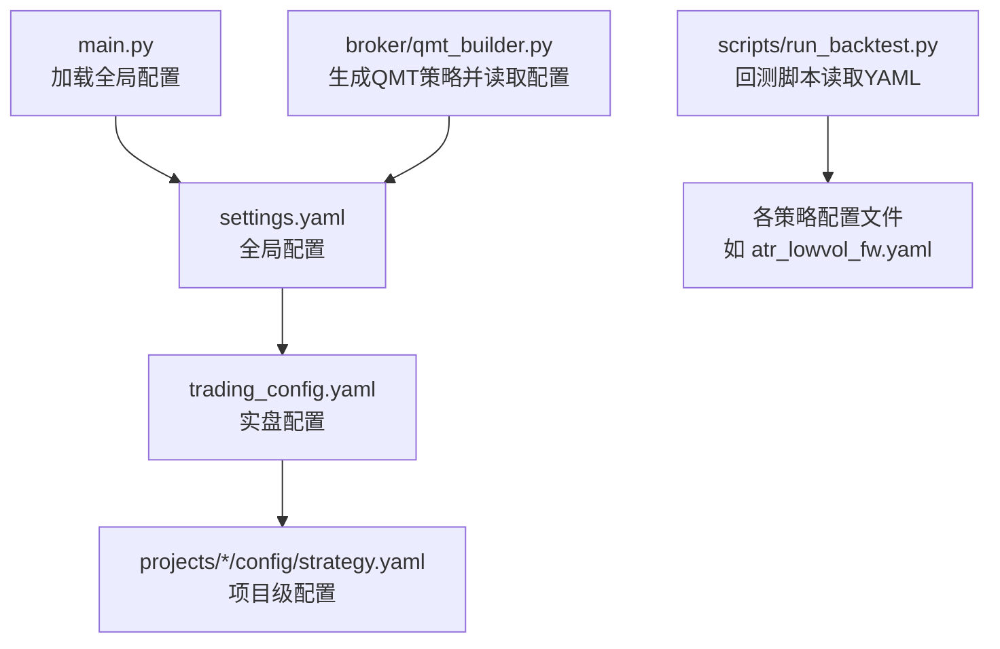
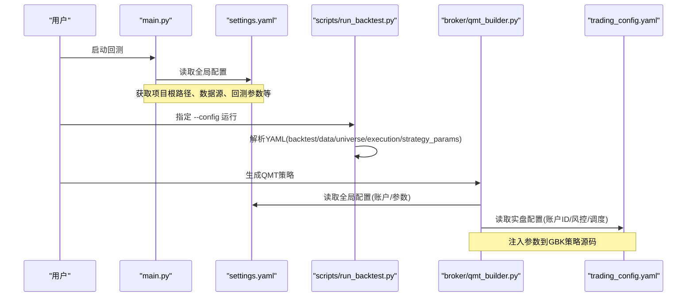
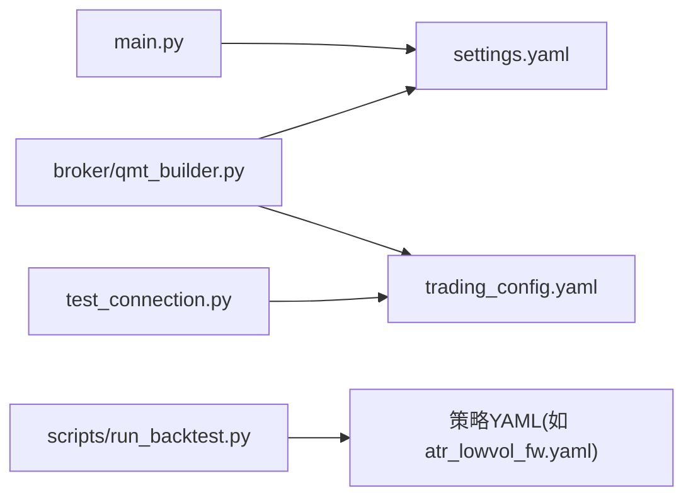

# 实盘配置管理

<cite>
**本文引用的文件**   
- [config/trading_config.yaml](file://config/trading_config.yaml)
- [config/settings.yaml](file://config/settings.yaml)
- [main.py](file://main.py)
- [broker/qmt_builder.py](file://broker/qmt_builder.py)
- [test_connection.py](file://test_connection.py)
- [scripts/run_backtest.py](file://scripts/run_backtest.py)
- [strategy/schedule.py](file://strategy/schedule.py)
- [AGENTS.md](file://AGENTS.md)
</cite>

## 目录
1. [简介](#简介)
2. [项目结构](#项目结构)
3. [核心组件](#核心组件)
4. [架构总览](#架构总览)
5. [详细组件分析](#详细组件分析)
6. [依赖关系分析](#依赖关系分析)
7. [性能考虑](#性能考虑)
8. [故障排查指南](#故障排查指南)
9. [结论](#结论)
10. [附录](#附录)

## 简介
本文件为 QuantLab 的实盘配置管理系统提供完整、可操作的配置文档。重点覆盖：
- trading_config.yaml 的完整结构与字段含义（账户信息、交易参数、风控阈值、委托与调度、通知、数据源等）
- settings.yaml 全局配置的作用与选项（数据源、回测参数、因子预处理、策略默认股票池、日志、实盘开关）
- 配置层次结构与优先级规则（三级级联：全局 → 实盘 → 项目级）
- 风控参数的含义与推荐设置（仓位限制、止损止盈、最大回撤、持有期、换手率等）
- 配置验证与错误检查机制的使用指南
- 最佳实践与安全注意事项（敏感信息加密、环境隔离、路径校验、最小权限）

## 项目结构
QuantLab 的配置体系采用“三级级联”的组织方式，便于在统一基线之上进行环境与项目级定制：
- 全局配置：config/settings.yaml（项目信息、数据源、回测参数、因子预处理、策略默认股票池、日志、实盘开关）
- 实盘配置：config/trading_config.yaml（账号、交易参数、风控阈值、委托管理、调度计划、通知、数据源）
- 项目级配置：projects/Project_XX_*/config/strategy.yaml（项目独立参数）

图表来源 
- [config/settings.yaml:1-69](file://config/settings.yaml#L1-L69)
- [config/trading_config.yaml:1-62](file://config/trading_config.yaml#L1-L62)
- [main.py:21-35](file://main.py#L21-L35)
- [broker/qmt_builder.py:21-24](file://broker/qmt_builder.py#L21-L24)
- [scripts/run_backtest.py:35-64](file://scripts/run_backtest.py#L35-L64)

章节来源
- [AGENTS.md:90-94](file://AGENTS.md#L90-L94)
- [config/settings.yaml:1-69](file://config/settings.yaml#L1-L69)
- [config/trading_config.yaml:1-62](file://config/trading_config.yaml#L1-L62)

## 核心组件
- 全局配置（settings.yaml）
  - 作用：定义项目根路径、数据源路径、缓存、回测时间范围与费用、因子预处理方法、策略默认股票池、日志级别与落点、以及是否启用实盘及指向的实盘配置文件。
  - 关键段：project、data、backtest、logging、factors、strategy、trading。
- 实盘配置（trading_config.yaml）
  - 作用：定义 QMT 账户连接信息、初始资金与交易成本、风控阈值、委托超时与重试、盘中调度时间点、通知渠道与 webhook、数据源路径等。
  - 关键段：account、trading、risk、order、schedule、notification、data、strategy。
- 主入口与构建器
  - main.py：加载 settings.yaml 作为全局配置，驱动回测流程。
  - broker/qmt_builder.py：读取 settings.yaml，组装 QMT 策略源码并注入参数（如账户ID、止损、权重等）。
- 回测脚本
  - scripts/run_backtest.py：从命令行指定 YAML 配置文件，解析 backtest/data/universe/execution/strategy_params 等段，运行回测。

章节来源
- [config/settings.yaml:1-69](file://config/settings.yaml#L1-L69)
- [config/trading_config.yaml:1-62](file://config/trading_config.yaml#L1-L62)
- [main.py:21-35](file://main.py#L21-L35)
- [broker/qmt_builder.py:21-24](file://broker/qmt_builder.py#L21-L24)
- [scripts/run_backtest.py:35-64](file://scripts/run_backtest.py#L35-L64)

## 架构总览
下图展示了配置加载与使用的主干流程：主程序加载全局配置，回测脚本按指定 YAML 运行，QMT 构建器基于全局配置生成生产策略代码，测试脚本校验实盘配置有效性。

图表来源 
- [main.py:21-35](file://main.py#L21-L35)
- [scripts/run_backtest.py:35-64](file://scripts/run_backtest.py#L35-L64)
- [broker/qmt_builder.py:21-24](file://broker/qmt_builder.py#L21-L24)
- [config/settings.yaml:1-69](file://config/settings.yaml#L1-L69)
- [config/trading_config.yaml:1-62](file://config/trading_config.yaml#L1-L62)

## 详细组件分析

### trading_config.yaml 详解
该文件是实盘运行的核心配置，包含以下段落：
- account：QMT 账户标识、安装路径、会话ID
- trading：初始资金、单股/总仓位上限、佣金、印花税、滑点
- risk：个股止损比例、组合最大回撤、最长持有天数、单日最大换手
- order：委托超时、最大重试次数、价格容差、未成交自动撤单
- schedule：盘前准备、开盘执行、午后检查、风控检查间隔、尾盘处理
- notification：通知开关、渠道（企业微信/钉钉/邮件）、webhook地址
- data：数据源类型与路径（astock）、缓存目录
- strategy：策略名称、股票池、选股数量、调仓频率、因子权重

建议设置参考（结合 AGENTS.md 的风控红线）：
- 止损：stop_loss_pct=0.08（8%）
- 最大回撤：max_drawdown=0.15（15%）
- 最长持有：max_holding_days=60
- 单日换手：max_daily_turnover=0.30（30%）
- 单股仓位：max_single_position=0.05（5%）
- 总仓位：max_total_position=0.80（80%）

章节来源
- [config/trading_config.yaml:1-62](file://config/trading_config.yaml#L1-L62)
- [AGENTS.md:83-88](file://AGENTS.md#L83-L88)

### settings.yaml 详解
该文件为全局配置，涵盖：
- project：项目名称、版本、根路径
- data：数据源选择与路径（astock daily/finance/basic），缓存开关与过期天数
- backtest：回测起止日期、初始资金、手续费与滑点、基准指数
- logging：日志级别、目录、文件大小与备份数
- factors：因子预处理（中性化、标准化、去极值）与方法选择
- strategy：默认股票池与市值区间（small_cap/mid_cap/large_cap）
- trading：指向 trading_config.yaml 的路径与是否启用实盘

章节来源
- [config/settings.yaml:1-69](file://config/settings.yaml#L1-L69)

### 配置层次结构与优先级规则
- 层级顺序（由低到高覆盖）：
  1) 全局配置：config/settings.yaml
  2) 实盘配置：config/trading_config.yaml
  3) 项目级配置：projects/Project_XX_*/config/strategy.yaml
- 覆盖原则：高层级配置对低层级同名项进行覆盖；不同段之间不互相覆盖，仅同名字段生效。
- 典型用法：
  - 在 settings.yaml 中设定通用数据源与因子预处理；
  - 在 trading_config.yaml 中针对实盘环境调整账户、风控与调度；
  - 在项目级 strategy.yaml 中微调策略参数（如 top_n、rebalance_freq、因子权重）。

章节来源
- [AGENTS.md:90-94](file://AGENTS.md#L90-L94)

### 风控参数含义与推荐设置
- 个股止损（stop_loss_pct）：触发卖出以限制单笔亏损，建议 8%
- 组合最大回撤（max_drawdown）：触发减仓或清仓保护，建议 15%
- 最长持有天数（max_holding_days）：避免长期套牢，建议 60 天
- 单日最大换手（max_daily_turnover）：控制交易冲击与成本，建议 30%
- 单股仓位上限（max_single_position）：分散风险，建议 5%
- 总仓位上限（max_total_position）：保留现金缓冲，建议 80%

章节来源
- [config/trading_config.yaml:18-22](file://config/trading_config.yaml#L18-L22)
- [AGENTS.md:83-88](file://AGENTS.md#L83-L88)

### 调度计划与执行时序
- pre_market：盘前准备（检查连接、下载数据、撤销遗留委托）
- morning_open：开盘执行（避开集合竞价，计算因子→目标组合→先卖后买）
- afternoon_check：午后检查（验证持仓与订单状态）
- risk_check_interval：风控巡检周期（分钟），用于止损与回撤检查
- end_of_day：日终处理（对账、保存状态、发送日报）

章节来源
- [config/trading_config.yaml:30-35](file://config/trading_config.yaml#L30-L35)
- [strategy/schedule.py:10-47](file://strategy/schedule.py#L10-L47)

### 数据源与缓存
- 主数据源：astock（daily parquet、finance、basic）
- 缓存：开启后可减少重复读取，设置缓存目录与过期天数
- 回测与实盘数据路径需一致，避免路径不一致导致的数据缺失

章节来源
- [config/settings.yaml:10-19](file://config/settings.yaml#L10-L19)
- [config/trading_config.yaml:43-46](file://config/trading_config.yaml#L43-L46)

### 通知与告警
- enabled：是否启用通知
- method：渠道（wechat/dingtalk/email）
- webhook_url：企业微信/钉钉 webhook 地址（需提前配置）

章节来源
- [config/trading_config.yaml:37-40](file://config/trading_config.yaml#L37-L40)

### 回测配置（scripts/run_backtest.py）
- 通过 --config 指定 YAML 配置文件
- 解析 backtest/data/universe/execution/strategy_params 等段
- 支持多种策略与交易模型（如 atr_lowvol、next_open）

章节来源
- [scripts/run_backtest.py:35-64](file://scripts/run_backtest.py#L35-L64)

## 依赖关系分析
- main.py 依赖 settings.yaml 作为全局配置入口
- broker/qmt_builder.py 依赖 settings.yaml 与 trading_config.yaml，生成 QMT 策略源码并注入参数
- test_connection.py 依赖 trading_config.yaml 校验 QMT 路径与连接
- scripts/run_backtest.py 依赖具体策略 YAML（如 atr_lowvol_fw.yaml）

图表来源 
- [main.py:21-35](file://main.py#L21-L35)
- [broker/qmt_builder.py:21-24](file://broker/qmt_builder.py#L21-L24)
- [test_connection.py:30-117](file://test_connection.py#L30-L117)
- [scripts/run_backtest.py:35-64](file://scripts/run_backtest.py#L35-L64)

章节来源
- [main.py:21-35](file://main.py#L21-L35)
- [broker/qmt_builder.py:21-24](file://broker/qmt_builder.py#L21-L24)
- [test_connection.py:30-117](file://test_connection.py#L30-L117)
- [scripts/run_backtest.py:35-64](file://scripts/run_backtest.py#L35-L64)

## 性能考虑
- 数据缓存：开启 cache.enabled 并合理设置 expire_days，降低重复 I/O
- 因子预处理：winsorize/neutralize/standardize 会引入计算开销，建议在回测阶段评估收益与成本的平衡
- 调度频率：risk_check_interval 不宜过短，避免频繁风控检查影响执行效率
- 委托重试：max_retry 过大可能导致延迟累积，需结合 price_tolerance 与 timeout_seconds 综合权衡

[本节为通用指导，无需引用具体文件]

## 故障排查指南
- 配置文件不存在或路径错误
  - 现象：test_connection.py 报错找不到 trading_config.yaml 或 account.path 无效
  - 处理：确认 config/trading_config.yaml 存在且 account.path 指向正确的 miniQMT userdata_mini 目录
- QMT 连接失败
  - 现象：连接返回非零错误码
  - 处理：确保 miniQMT 已启动、账号已登录、session_id 与 account.id 匹配
- 数据源不可用
  - 现象：回测或实盘无法读取 astock 数据
  - 处理：核对 settings.yaml 与 trading_config.yaml 中的 data 路径与缓存目录
- 因子预处理异常
  - 现象：中性化/标准化失败或结果异常
  - 处理：检查 factors.neutralize_method 与 standardize_method 的设置，确认数据完整性

章节来源
- [test_connection.py:30-117](file://test_connection.py#L30-L117)
- [config/settings.yaml:10-19](file://config/settings.yaml#L10-L19)
- [config/trading_config.yaml:43-46](file://config/trading_config.yaml#L43-L46)

## 结论
QuantLab 的实盘配置管理通过“三级级联”实现了灵活而稳健的配置体系。settings.yaml 提供全局基线，trading_config.yaml 聚焦实盘细节，项目级配置则满足差异化需求。配合严格的参数校验与连接测试，可有效降低上线风险。建议在生产环境中遵循安全最佳实践，确保敏感信息与路径的正确性，并通过合理的调度与风控参数保障系统稳定运行。

[本节为总结，无需引用具体文件]

## 附录

### 配置验证与错误检查机制使用指南
- 使用 test_connection.py 校验 trading_config.yaml 的有效性与 QMT 连接
- 在回测阶段使用 scripts/run_backtest.py 指定 YAML 配置文件，验证数据与策略参数
- 在构建 QMT 策略时，broker/qmt_builder.py 会读取 settings.yaml 与 trading_config.yaml 并注入参数，确保一致性

章节来源
- [test_connection.py:30-117](file://test_connection.py#L30-L117)
- [scripts/run_backtest.py:35-64](file://scripts/run_backtest.py#L35-L64)
- [broker/qmt_builder.py:21-24](file://broker/qmt_builder.py#L21-L24)

### 安全注意事项与最佳实践
- 敏感信息加密存储：将账户 ID、session_id、webhook_url 等敏感字段纳入密钥管理服务或环境变量，避免明文写入配置文件
- 环境隔离：开发、模拟、生产环境分别维护独立的 settings.yaml 与 trading_config.yaml，禁止跨环境混用
- 路径校验：所有外部路径（数据源、缓存、QMT 安装路径）需在启动时校验存在性
- 最小权限：运行账户仅授予必要文件系统与网络访问权限
- 审计与日志：开启 logging 并设置合适的 level 与轮转策略，便于问题定位与合规审计

[本节为通用指导，无需引用具体文件]