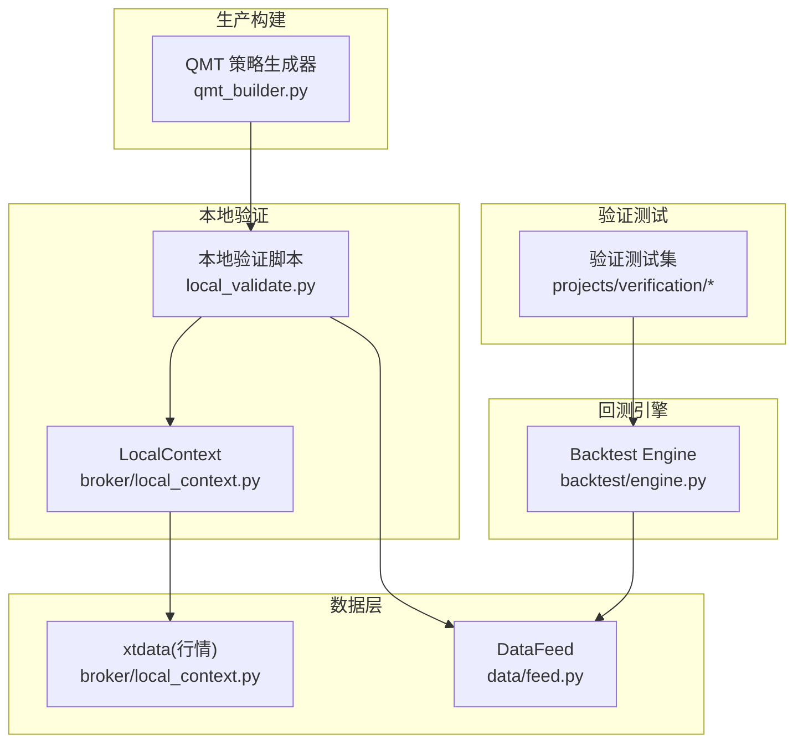
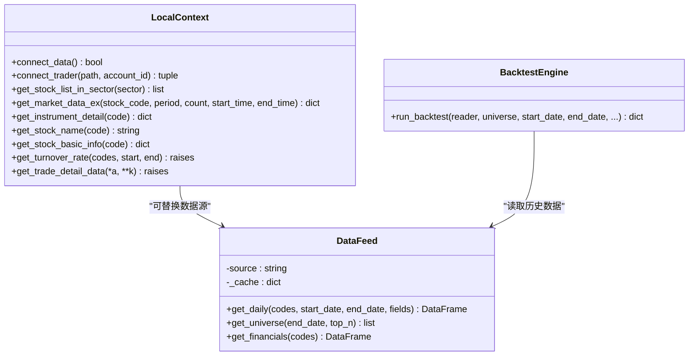
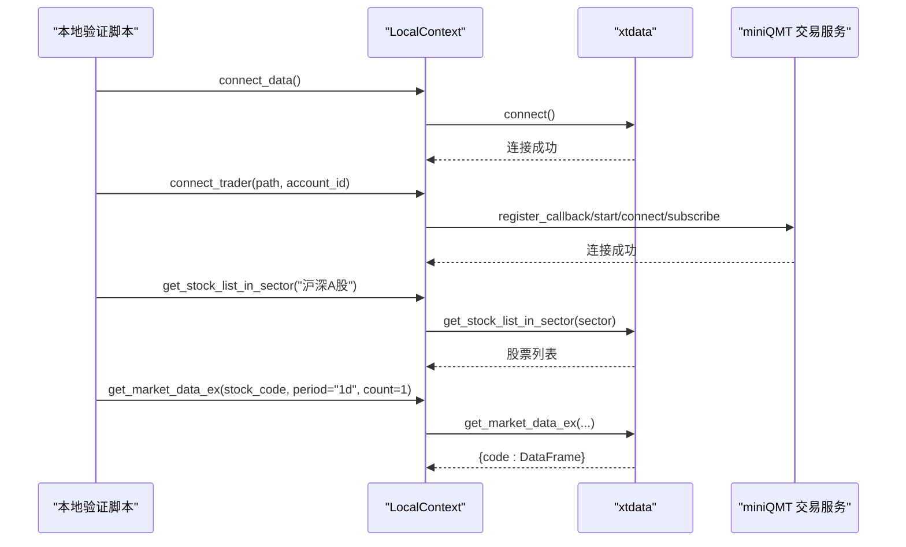
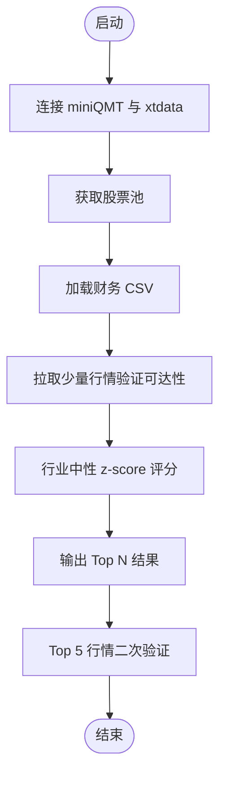
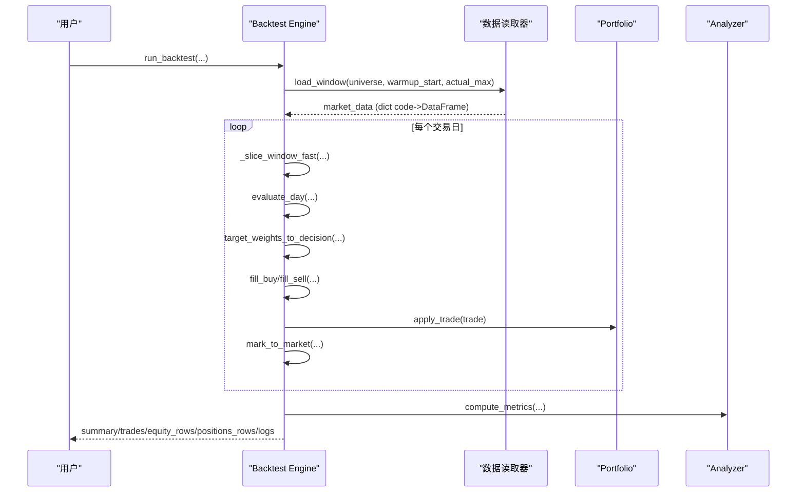
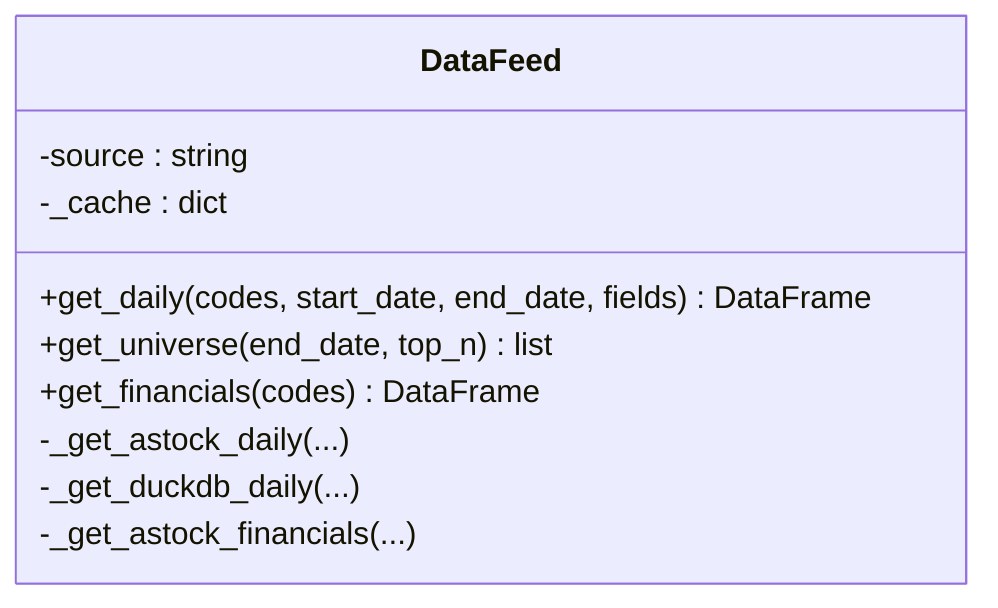
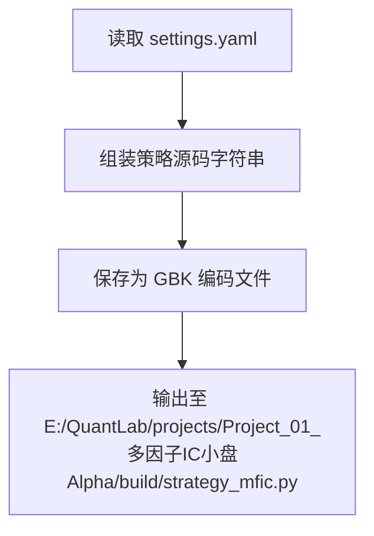
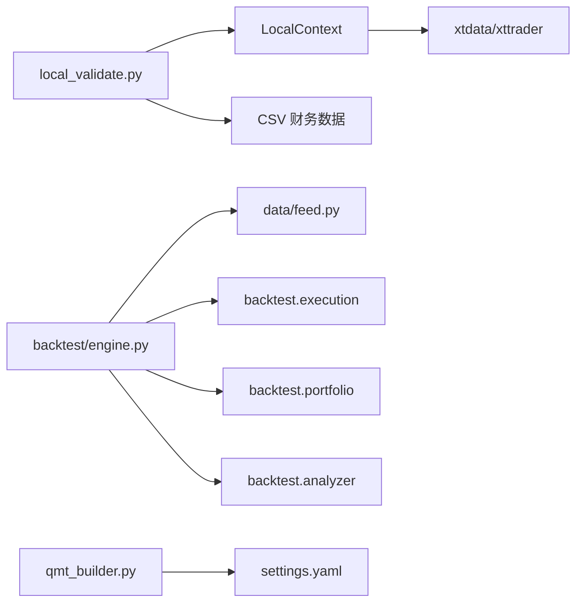
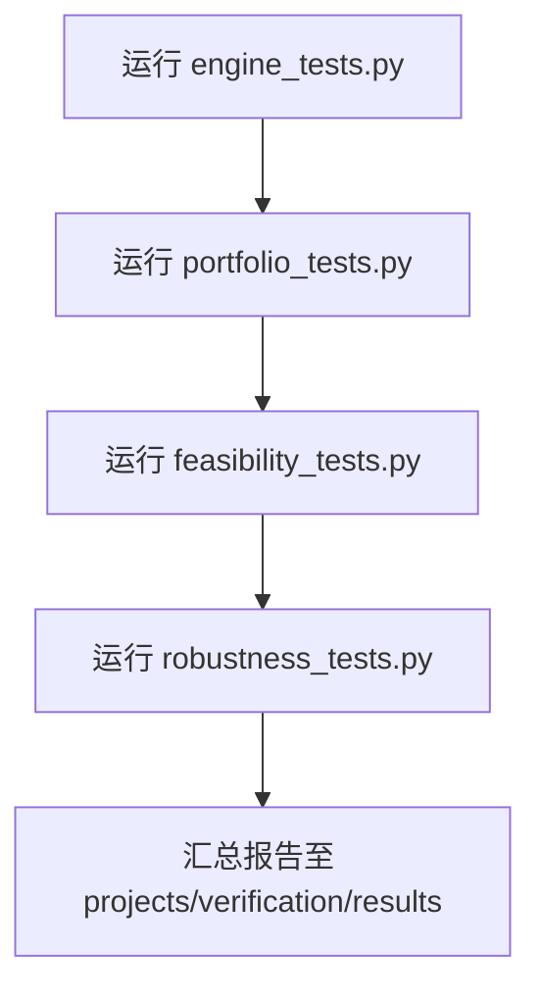

# 本地验证适配器

<cite>
**本文引用的文件**   
- [broker/local_context.py](file://broker/local_context.py)
- [projects/Project_10_价值小盘V2/local_validate.py](file://projects/Project_10_价值小盘V2/local_validate.py)
- [backtest/engine.py](file://backtest/engine.py)
- [data/feed.py](file://data/feed.py)
- [broker/qmt_builder.py](file://broker/qmt_builder.py)
- [projects/verification/engine_tests.py](file://projects/verification/engine_tests.py)
- [projects/verification/portfolio_tests.py](file://projects/verification/portfolio_tests.py)
- [projects/verification/feasibility_tests.py](file://projects/verification/feasibility_tests.py)
- [projects/verification/robustness_tests.py](file://projects/verification/robustness_tests.py)
</cite>

## 目录
1. [简介](#简介)
2. [项目结构](#项目结构)
3. [核心组件](#核心组件)
4. [架构总览](#架构总览)
5. [详细组件分析](#详细组件分析)
6. [依赖关系分析](#依赖关系分析)
7. [性能考量](#性能考量)
8. [故障排查指南](#故障排查指南)
9. [结论](#结论)
10. [附录](#附录)

## 简介
本技术文档围绕 QuantLab 的“本地验证适配器”展开，重点解释如何通过 LocalContext 将 QMT 策略中的 C.* 调用映射到本地 xtdata，从而在离线环境下模拟 QMT 接口行为，支持策略开发与调试。文档涵盖：
- 本地模拟环境的设计原理与数据流
- LocalContext 类的实现要点（账户状态、行情数据、订单管理）
- 适配器模式的应用与本地/实盘切换机制
- 模拟数据的生成与管理（历史数据回放与实时数据模拟）
- 完整的测试用例与使用方式
- 性能对比分析与内存优化建议

## 项目结构
与本地验证适配器直接相关的代码主要分布在以下模块：
- broker/local_context.py：LocalContext 类与连接管理、策略源码加载工具
- projects/Project_10_价值小盘V2/local_validate.py：本地验证脚本示例
- backtest/engine.py：回测引擎主循环（用于对比本地验证与回测差异）
- data/feed.py：统一数据源接口（astock/duckdb）
- broker/qmt_builder.py：QMT 策略生成器（生产打包）
- projects/verification/*：多模块验证测试（引擎、组合、可行性、稳健性）

**图表来源** 
- [broker/local_context.py:1-137](file://broker/local_context.py#L1-L137)
- [projects/Project_10_价值小盘V2/local_validate.py:1-151](file://projects/Project_10_价值小盘V2/local_validate.py#L1-L151)
- [backtest/engine.py:1-619](file://backtest/engine.py#L1-L619)
- [data/feed.py:1-197](file://data/feed.py#L1-L197)
- [broker/qmt_builder.py:1-386](file://broker/qmt_builder.py#L1-L386)

**章节来源**
- [broker/local_context.py:1-137](file://broker/local_context.py#L1-L137)
- [projects/Project_10_价值小盘V2/local_validate.py:1-151](file://projects/Project_10_价值小盘V2/local_validate.py#L1-L151)
- [backtest/engine.py:1-619](file://backtest/engine.py#L1-L619)
- [data/feed.py:1-197](file://data/feed.py#L1-L197)
- [broker/qmt_builder.py:1-386](file://broker/qmt_builder.py#L1-L386)

## 核心组件
- LocalContext：提供 get_stock_list_in_sector、get_market_data_ex、get_instrument_detail、get_stock_name、get_stock_basic_info 等接口，内部委托给 xtdata；对不支持的接口抛出 NotImplementedError 以触发 fail-open。
- connect_data/connect_trader：分别负责连接 xtdata 行情服务与 miniQMT 交易服务（模拟端），并维护全局连接状态。
- load_strategy_source：动态加载 QMT 策略源码（处理 GBK/UTF-8 编码兼容）。
- DataFeed：统一数据源接口，支持 astock parquet 与 duckdb 两种后端，提供日线与财务数据读取。
- Backtest Engine：完整回测主循环，包含日历切片、基准对齐、执行填充、组合更新与指标计算。
- QMT Builder：将策略逻辑与生命周期组装为单文件 GBK 策略，便于生产部署。

**章节来源**
- [broker/local_context.py:1-137](file://broker/local_context.py#L1-L137)
- [data/feed.py:1-197](file://data/feed.py#L1-L197)
- [backtest/engine.py:1-619](file://backtest/engine.py#L1-L619)
- [broker/qmt_builder.py:1-386](file://broker/qmt_builder.py#L1-L386)

## 架构总览
本地验证适配器的整体架构采用“适配器模式”，通过 LocalContext 屏蔽底层数据源差异，使策略代码无需关心是本地 xtdata 还是真实 QMT 环境。同时，DataFeed 作为数据层抽象，统一回测与本地验证的数据获取路径。

**图表来源** 
- [broker/local_context.py:1-137](file://broker/local_context.py#L1-L137)
- [data/feed.py:1-197](file://data/feed.py#L1-L197)
- [backtest/engine.py:1-619](file://backtest/engine.py#L1-L619)

**章节来源**
- [broker/local_context.py:1-137](file://broker/local_context.py#L1-L137)
- [data/feed.py:1-197](file://data/feed.py#L1-L197)
- [backtest/engine.py:1-619](file://backtest/engine.py#L1-L619)

## 详细组件分析

### LocalContext 类详解
- 设计目标：将 QMT 策略中的 C.* 调用映射到本地 xtdata，保证策略在本地可运行且与实盘一致。
- 关键方法：
  - get_stock_list_in_sector：返回板块股票列表
  - get_market_data_ex：按周期与时间范围拉取行情，返回 {code: DataFrame}
  - get_instrument_detail/get_stock_name/get_stock_basic_info：合约与基本信息查询
  - 未实现接口：get_turnover_rate、get_trade_detail_data 抛出异常，触发 fail-open 策略
- 连接管理：
  - connect_data：连接 xtdata 行情服务（端口 58610）
  - connect_trader：连接 miniQMT 交易服务（端口 58600），注册回调，订阅账户

**图表来源** 
- [broker/local_context.py:1-137](file://broker/local_context.py#L1-L137)
- [projects/Project_10_价值小盘V2/local_validate.py:1-151](file://projects/Project_10_价值小盘V2/local_validate.py#L1-L151)

**章节来源**
- [broker/local_context.py:1-137](file://broker/local_context.py#L1-L137)
- [projects/Project_10_价值小盘V2/local_validate.py:1-151](file://projects/Project_10_价值小盘V2/local_validate.py#L1-L151)

### 本地验证脚本（local_validate.py）
- 功能流程：
  1. 连接 miniQMT 与 xtdata
  2. 获取全市场股票池
  3. 加载 CSV 财务数据（PB/PE/市值/行业映射）
  4. 从 xtdata 拉取最新行情进行可达性验证
  5. 运行 V2 评分管线（行业中性 z-score）
  6. 输出 Top N 结果与行情验证
- 关键点：
  - 使用 LocalContext.get_stock_list_in_sector 与 get_market_data_ex
  - 通过 CSV 字典快速注入财务因子
  - 简化版评分仅用 z-score，跳过 hp 分量（需历史数据）

**图表来源** 
- [projects/Project_10_价值小盘V2/local_validate.py:1-151](file://projects/Project_10_价值小盘V2/local_validate.py#L1-L151)

**章节来源**
- [projects/Project_10_价值小盘V2/local_validate.py:1-151](file://projects/Project_10_价值小盘V2/local_validate.py#L1-L151)

### 回测引擎（engine.py）与本地验证的差异
- 回测引擎特点：
  - 基于 reader.load_window 加载历史窗口，按交易日推进
  - 内置执行填充（fill_buy/fill_sell）、组合更新、基准对齐与指标计算
  - 不依赖 xtquant/passorder，纯内存结果
- 本地验证特点：
  - 直接调用 xtdata 获取实时或近实时行情
  - 通过 LocalContext 暴露 QMT 风格接口
  - 适合快速验证策略逻辑与数据可达性

**图表来源** 
- [backtest/engine.py:1-619](file://backtest/engine.py#L1-L619)

**章节来源**
- [backtest/engine.py:1-619](file://backtest/engine.py#L1-L619)

### 数据源抽象（DataFeed）
- 支持 astock parquet 与 duckdb 两种后端
- 提供 get_daily、get_universe、get_financials 等统一接口
- 缓存机制减少重复 IO

**图表来源** 
- [data/feed.py:1-197](file://data/feed.py#L1-L197)

**章节来源**
- [data/feed.py:1-197](file://data/feed.py#L1-L197)

### QMT 策略生成器（qmt_builder.py）
- 作用：将策略逻辑与生命周期组装为单文件 GBK 策略，便于生产部署
- 内容：配置注入、因子计算、止损逻辑、调仓日判断、持仓持久化等

**图表来源** 
- [broker/qmt_builder.py:1-386](file://broker/qmt_builder.py#L1-L386)

**章节来源**
- [broker/qmt_builder.py:1-386](file://broker/qmt_builder.py#L1-L386)

## 依赖关系分析
- LocalContext 依赖 xtdata（行情）与 xttrader（交易）
- local_validate.py 依赖 LocalContext 与外部 CSV 财务数据
- backtest/engine.py 依赖 data.feed 与 backtest.execution/portfolio/analyzer
- qmt_builder.py 依赖 yaml 与 numpy/pandas（用于参数与数据处理）

**图表来源** 
- [broker/local_context.py:1-137](file://broker/local_context.py#L1-L137)
- [projects/Project_10_价值小盘V2/local_validate.py:1-151](file://projects/Project_10_价值小盘V2/local_validate.py#L1-L151)
- [backtest/engine.py:1-619](file://backtest/engine.py#L1-L619)
- [data/feed.py:1-197](file://data/feed.py#L1-L197)
- [broker/qmt_builder.py:1-386](file://broker/qmt_builder.py#L1-L386)

**章节来源**
- [broker/local_context.py:1-137](file://broker/local_context.py#L1-L137)
- [projects/Project_10_价值小盘V2/local_validate.py:1-151](file://projects/Project_10_价值小盘V2/local_validate.py#L1-L151)
- [backtest/engine.py:1-619](file://backtest/engine.py#L1-L619)
- [data/feed.py:1-197](file://data/feed.py#L1-L197)
- [broker/qmt_builder.py:1-386](file://broker/qmt_builder.py#L1-L386)

## 性能考量
- 本地验证 vs 回测：
  - 本地验证依赖 xtdata 实时/近实时数据，网络延迟与服务器响应影响较大
  - 回测引擎基于本地 parquet/DuckDB，IO 与内存占用可控，适合大规模历史扫描
- 内存优化建议：
  - 使用 DataFeed 的缓存机制避免重复读取
  - 在 LocalContext 中按需拉取字段，减少 DataFrame 体积
  - 回测中使用 _slice_window_fast 预计算 cut_index，O(1) 切片
- 执行频率与成本：
  - 本地验证脚本可通过限制 sample 数量降低开销
  - 回测引擎已内置交易成本与滑点模型，便于成本敏感性分析

[本节为通用指导，不直接分析具体文件]

## 故障排查指南
- 连接失败：
  - connect_data/connect_trader 返回 None 时检查端口与客户端路径
  - 确认 xtdata.connect() 与 XtQuantTrader.connect() 返回值
- 数据不可达：
  - get_market_data_ex 返回空字典时检查 stock_code 格式与 period/count
  - 使用 local_validate.py 的 sample 拉取验证
- 策略加载错误：
  - load_strategy_source 处理 GBK/UTF-8 编码问题，必要时清理临时文件
- 回测异常：
  - 检查 calendar 是否为空、benchmark 数据是否可用
  - 查看 daily_logs 与 diagnostics_aggregate 中的 warnings

**章节来源**
- [broker/local_context.py:1-137](file://broker/local_context.py#L1-L137)
- [projects/Project_10_价值小盘V2/local_validate.py:1-151](file://projects/Project_10_价值小盘V2/local_validate.py#L1-L151)
- [backtest/engine.py:1-619](file://backtest/engine.py#L1-L619)

## 结论
LocalContext 作为本地验证适配器的核心，成功将 QMT 策略接口映射到本地 xtdata，实现了离线开发与调试能力。结合 DataFeed 的统一数据抽象与 backtest/engine 的回测引擎，QuantLab 提供了从本地验证到回测再到生产部署的完整链路。通过完善的测试套件（engine_tests、portfolio_tests、feasibility_tests、robustness_tests），可确保策略在不同环境下的稳健性与一致性。

[本节为总结，不直接分析具体文件]

## 附录

### 完整测试用例与使用方式
- 引擎验证（engine_tests.py）：8项基础测试（已知结果、交易成本、涨跌停、停牌、资金约束、持仓一致性、先卖后买、止损）
- 组合优化（portfolio_tests.py）：横向对比、相关性、风险平价权重、组合回测、滚动夏普
- 实盘可行性（feasibility_tests.py）：滑点评估、流动性、执行频率、miniQMT 兼容性、资金需求、偏差预估
- 稳健性（robustness_tests.py）：子样本检验、牛熊市分拆、极端事件压力、交易成本压力、容量估算、未来函数排查、幸存者偏差排查

**图表来源** 
- [projects/verification/engine_tests.py:1-309](file://projects/verification/engine_tests.py#L1-L309)
- [projects/verification/portfolio_tests.py:1-232](file://projects/verification/portfolio_tests.py#L1-L232)
- [projects/verification/feasibility_tests.py:1-178](file://projects/verification/feasibility_tests.py#L1-L178)
- [projects/verification/robustness_tests.py:1-267](file://projects/verification/robustness_tests.py#L1-L267)

**章节来源**
- [projects/verification/engine_tests.py:1-309](file://projects/verification/engine_tests.py#L1-L309)
- [projects/verification/portfolio_tests.py:1-232](file://projects/verification/portfolio_tests.py#L1-L232)
- [projects/verification/feasibility_tests.py:1-178](file://projects/verification/feasibility_tests.py#L1-L178)
- [projects/verification/robustness_tests.py:1-267](file://projects/verification/robustness_tests.py#L1-L267)