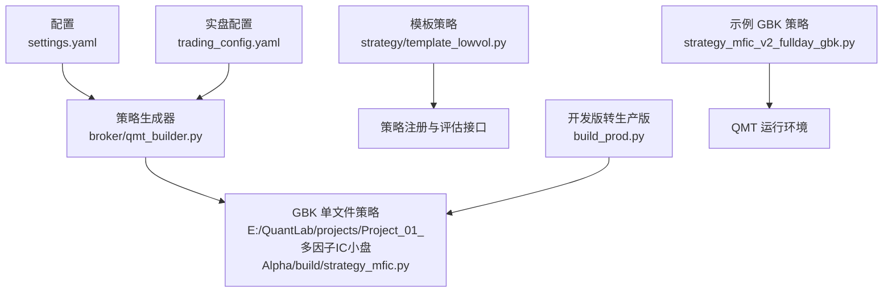
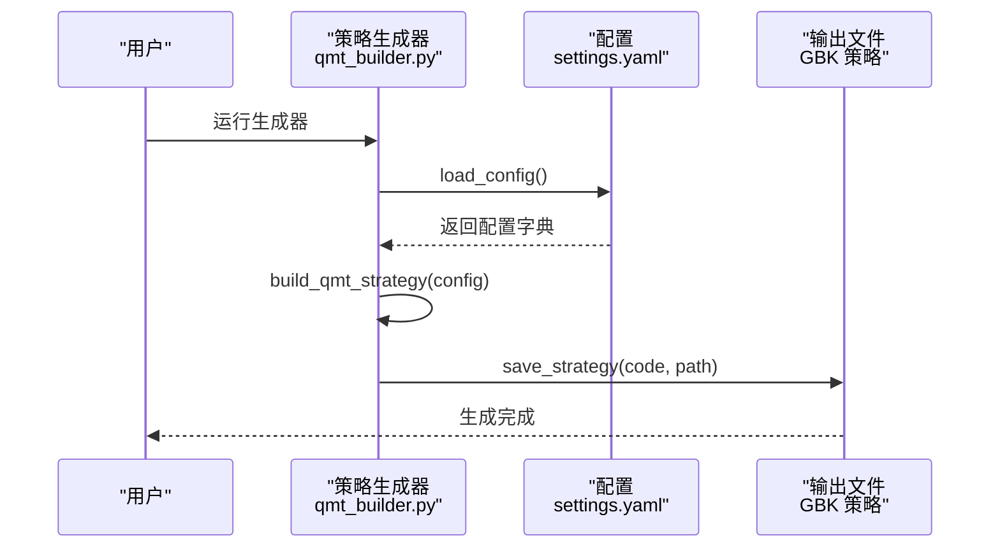
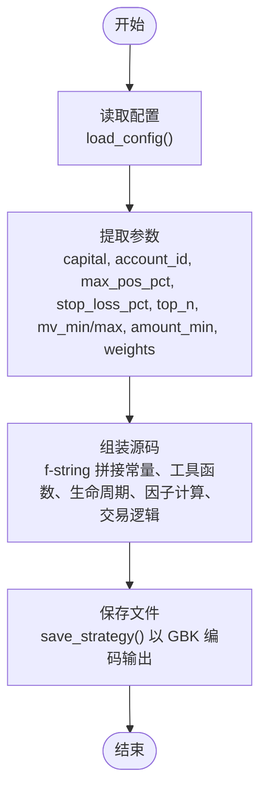
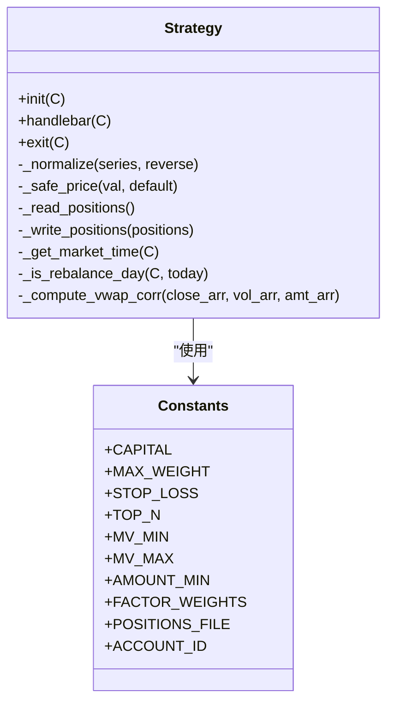
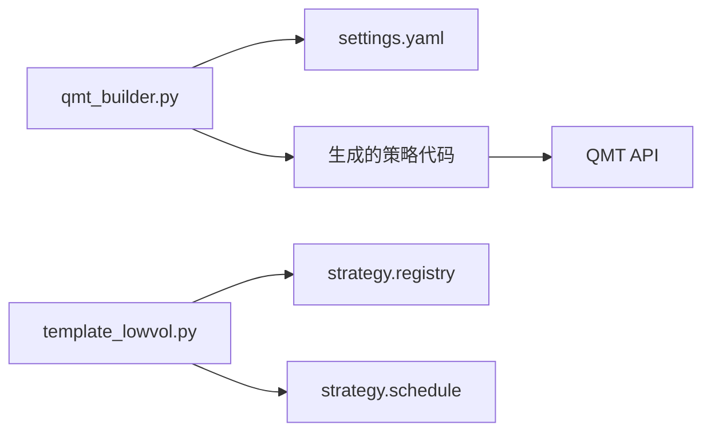

# 策略生成器

<cite>
**本文引用的文件**   
- [qmt_builder.py](file://broker/qmt_builder.py)
- [settings.yaml](file://config/settings.yaml)
- [trading_config.yaml](file://config/trading_config.yaml)
- [template_lowvol.py](file://strategy/template_lowvol.py)
- [build_prod.py](file://projects/Project_01_多因子IC小盘Alpha/research/mfic_strategy/build_prod.py)
- [strategy_mfic_v2_fullday_gbk.py](file://projects/Project_01_多因子IC小盘Alpha/research/mfic_strategy/strategy_mfic_v2_fullday_gbk.py)
</cite>

## 目录
1. [简介](#简介)
2. [项目结构](#项目结构)
3. [核心组件](#核心组件)
4. [架构总览](#架构总览)
5. [详细组件分析](#详细组件分析)
6. [依赖关系分析](#依赖关系分析)
7. [性能考量](#性能考量)
8. [故障排查指南](#故障排查指南)
9. [结论](#结论)
10. [附录](#附录)

## 简介
本技术文档面向 QuantLab 的策略生成器，目标是说明如何将本地 Python 策略转换为 QMT 兼容的 GBK 编码单文件策略。重点解析 build_qmt_strategy() 函数的工作原理（配置读取、代码组装、参数注入），并详细说明生成的策略代码结构（生命周期函数、因子计算、交易逻辑组织）。同时给出配置文件结构与风控参数说明、自定义策略模板开发指南，以及生成过程的调试方法与常见问题解决方案。

## 项目结构
与策略生成器直接相关的目录与文件如下：
- broker/qmt_builder.py：QMT 策略生成器主程序，负责读取配置、组装源码、输出 GBK 单文件策略
- config/settings.yaml：全局配置（数据、回测、因子、策略等）
- config/trading_config.yaml：实盘交易配置（账号、资金、风控、下单、调度等）
- strategy/template_lowvol.py：即插即跑的目标权重策略模板，展示如何扩展新策略类型
- projects/.../research/mfic_strategy/build_prod.py：将开发版转为 GBK 生产版的辅助脚本
- projects/.../research/mfic_strategy/strategy_mfic_v2_fullday_gbk.py：已生成的 GBK 单文件策略示例（全天模式）

图表来源
- [qmt_builder.py:1-386](file://broker/qmt_builder.py#L1-L386)
- [settings.yaml:1-69](file://config/settings.yaml#L1-L69)
- [trading_config.yaml:1-35](file://config/trading_config.yaml#L1-L35)
- [build_prod.py:1-14](file://projects/Project_01_多因子IC小盘Alpha/research/mfic_strategy/build_prod.py#L1-L14)
- [strategy_mfic_v2_fullday_gbk.py:1-374](file://projects/Project_01_多因子IC小盘Alpha/research/mfic_strategy/strategy_mfic_v2_fullday_gbk.py#L1-L374)

章节来源
- [qmt_builder.py:1-386](file://broker/qmt_builder.py#L1-L386)
- [settings.yaml:1-69](file://config/settings.yaml#L1-L69)
- [trading_config.yaml:1-35](file://config/trading_config.yaml#L1-L35)
- [template_lowvol.py:1-94](file://strategy/template_lowvol.py#L1-L94)
- [build_prod.py:1-14](file://projects/Project_01_多因子IC小盘Alpha/research/mfic_strategy/build_prod.py#L1-L14)
- [strategy_mfic_v2_fulldday_gbk.py:1-374](file://projects/Project_01_多因子IC小盘Alpha/research/mfic_strategy/strategy_mfic_v2_fullday_gbk.py#L1-L374)

## 核心组件
- 配置加载模块：从 settings.yaml 读取全局配置，包括项目信息、数据路径、回测参数、因子处理、策略默认集合等
- 策略生成器：build_qmt_strategy(config) 根据配置动态拼装 QMT 策略源码字符串，包含常量注入、工具函数、生命周期函数、因子计算、交易执行与状态持久化
- 保存模块：save_strategy(source_code, output_path) 以 GBK 编码写入目标路径
- 模板策略：template_lowvol.py 提供最小可运行的“目标权重”策略模板，便于扩展新策略类型

章节来源
- [qmt_builder.py:21-386](file://broker/qmt_builder.py#L21-L386)
- [settings.yaml:1-69](file://config/settings.yaml#L1-L69)
- [template_lowvol.py:1-94](file://strategy/template_lowvol.py#L1-L94)

## 架构总览
策略生成器的整体流程如下：
- 读取配置：load_config() 从 settings.yaml 获取项目与策略相关参数
- 组装源码：build_qmt_strategy(config) 将配置参数注入到模板化的 Python 源码中，形成完整的 QMT 单文件策略
- 输出文件：save_strategy() 以 GBK 编码保存到指定路径，供 QMT 运行环境加载执行

图表来源
- [qmt_builder.py:21-386](file://broker/qmt_builder.py#L21-L386)
- [settings.yaml:1-69](file://config/settings.yaml#L1-L69)

## 详细组件分析

### build_qmt_strategy() 工作原理
该函数是策略生成的核心，主要职责包括：
- 配置读取与参数提取：从 project_01.live、project_01.market_cap、project_01.backtest、project_01.factors 等节点中提取初始资金、账户ID、仓位限制、止损比例、选股数量、市值范围、成交额下限、因子权重等
- 源码组装：使用 f-string 拼接出完整的 Python 源码，包含：
  - 常量定义：CAPITAL、MAX_WEIGHT、STOP_LOSS、TOP_N、MV_MIN/MV_MAX、AMOUNT_MIN、FACTOR_WEIGHTS、POSITIONS_FILE、ACCOUNT_ID
  - 工具函数：标准化、价格安全转换、持仓读写、市场时间获取、调仓日判断、VWAP量价相关性计算
  - 生命周期函数：init(C)、handlebar(C)、exit(C)
  - 因子计算：BP、反转收益、波动率、ROE、VWAP量价相关性
  - 交易逻辑：止损检查、调仓日筛选、全市场数据获取、评分排序、卖出不在目标中的持仓、买入新标的
- 参数注入：所有配置值通过 f-string 替换为具体数值或 JSON 字符串，确保生成的策略可直接运行

图表来源
- [qmt_builder.py:33-370](file://broker/qmt_builder.py#L33-L370)

章节来源
- [qmt_builder.py:33-370](file://broker/qmt_builder.py#L33-L370)

### 生成的策略代码结构
生成的单文件策略包含以下关键部分：
- 初始化 init(C)：设置账户类型、初始化状态（本金、是否已初始化、调试开关、财务数据、上次调仓日期、K线计数等）
- 主循环 handlebar(C)：每根K线执行，包含：
  - 市场时间获取与交易日判断
  - 止损检查：逐只股票计算收益率并与止损阈值比较，触发卖出
  - 调仓日判断：双月调仓（偶数月份最后一个交易日）或强制调仓（调试模式）
  - 全市场数据获取：C.get_stock_list_in_sector、C.get_market_data_ex
  - 因子计算：BP、反转收益、波动率、ROE、VWAP量价相关性
  - 评分与选股：标准化后加权求和，按分数降序取 TOP_N
  - 卖出逻辑：不在目标中的持仓全部卖出
  - 买入逻辑：按可用资金分配，计算买入数量并下单
  - 状态持久化：持仓写入 JSON 文件
- 退出 exit(C)：预留清理逻辑

图表来源
- [qmt_builder.py:54-370](file://broker/qmt_builder.py#L54-L370)
- [strategy_mfic_v2_fullday_gbk.py:129-374](file://projects/Project_01_多因子IC小盘Alpha/research/mfic_strategy/strategy_mfic_v2_fullday_gbk.py#L129-L374)

章节来源
- [qmt_builder.py:54-370](file://broker/qmt_builder.py#L54-L370)
- [strategy_mfic_v2_fullday_gbk.py:129-374](file://projects/Project_01_多因子IC小盘Alpha/research/mfic_strategy/strategy_mfic_v2_fullday_gbk.py#L129-L374)

### 配置文件结构与参数含义
- settings.yaml：全局配置，包含项目信息、数据源、回测参数、日志、因子处理、策略默认集合等
- trading_config.yaml：实盘交易配置，包含：
  - account：账号ID、QMT路径、会话ID
  - trading：初始资金、单股最大仓位、总仓位上限、佣金、印花税、滑点
  - risk：个股止损比例、组合最大回撤、最长持有天数、单日最大换手
  - order：委托超时、重试次数、价格容差、自动撤单
  - schedule：盘前准备、开盘执行、午后检查、风控检查间隔、尾盘处理
  - notification：通知方式、Webhook地址

章节来源
- [settings.yaml:1-69](file://config/settings.yaml#L1-L69)
- [trading_config.yaml:1-35](file://config/trading_config.yaml#L1-L35)

### 自定义策略模板开发指南
- 扩展现有模板：基于 template_lowvol.py 的 evaluate_day 接口，实现信号生成与目标权重返回
- 创建新策略类型：在 registry 中注册新策略，遵循统一的输入输出格式（sell_decisions、buy_candidates、target_weights、diagnostics、logs）
- 框架自动处理：组合层自动计算买卖差、仓位模型（equal/vol_parity/custom）、行业上限、波动率目标、杠杆上限、最大持仓数、最小持仓金额、真实约束（涨停买不进/跌停卖不出/停牌拒单/滑点/整数手/ST±5%涨跌停）

章节来源
- [template_lowvol.py:1-94](file://strategy/template_lowvol.py#L1-L94)

## 依赖关系分析
策略生成器与配置文件之间的依赖关系如下：
- qmt_builder.py 依赖 settings.yaml 获取项目与策略参数
- 生成的策略代码依赖 QMT API（C.get_stock_list_in_sector、C.get_market_data_ex、C.get_full_tick、passorder 等）
- 模板策略依赖 strategy.registry 和 strategy.schedule 进行注册与调仓日判断

图表来源
- [qmt_builder.py:21-386](file://broker/qmt_builder.py#L21-L386)
- [template_lowvol.py:27-28](file://strategy/template_lowvol.py#L27-L28)

章节来源
- [qmt_builder.py:21-386](file://broker/qmt_builder.py#L21-L386)
- [template_lowvol.py:1-94](file://strategy/template_lowvol.py#L1-L94)

## 性能考量
- 数据获取优化：批量获取全市场数据（C.get_market_data_ex），减少网络往返
- 因子计算效率：使用 numpy/pandas 向量化计算，避免逐条循环
- 状态持久化：JSON 文件读写采用 try-except 保护，避免异常中断
- 调仓频率控制：双月调仓降低交易成本与计算开销
- 内存管理：及时释放中间变量，避免大对象驻留

[本节为通用指导，不直接分析具体文件]

## 故障排查指南
常见问题与解决方案：
- 编码错误：确保生成的策略文件头为 # coding=gbk，保存时使用 encoding='gbk'
- 配置缺失：检查 settings.yaml 中 project_01 节点是否存在，确保 live、market_cap、backtest、factors 子节点完整
- QMT API 调用失败：检查网络连接、账户权限、数据权限，添加 try-except 捕获异常
- 持仓文件损坏：检查 D:/QMT_POOL/mfic_positions.json 是否存在且格式正确，提供降级逻辑返回空字典
- 调仓日判断错误：确认 get_trading_dates 返回值是否正确，调试模式下可使用 DEBUG_FORCE_REBAL 强制调仓
- 因子计算异常：检查数据有效性（close、volume、amount、pb、pe_ttm、roe），对 NaN 值进行处理

章节来源
- [qmt_builder.py:27-31](file://broker/qmt_builder.py#L27-L31)
- [qmt_builder.py:107-141](file://broker/qmt_builder.py#L107-L141)
- [strategy_mfic_v2_fullday_gbk.py:95-123](file://projects/Project_01_多因子IC小盘Alpha/research/mfic_strategy/strategy_mfic_v2_fullday_gbk.py#L95-L123)

## 结论
QuantLab 的策略生成器通过 build_qmt_strategy() 函数实现了从配置到 GBK 单文件策略的自动化转换。该方案具备高内聚、低耦合的特点，支持灵活的参数配置与策略扩展。通过模板化设计与标准化的生命周期函数，用户可以快速开发新的策略类型。在实际部署中，建议结合 trading_config.yaml 进行精细化风控配置，并通过调试方法验证策略逻辑的正确性。

[本节为总结性内容，不直接分析具体文件]

## 附录
- 生成过程调试方法：
  - 使用 build_prod.py 将开发版转为生产版，检查编码与打印语句
  - 在策略中添加心跳打印，监控执行状态
  - 启用 DEBUG_FORCE_REBAL 强制调仓，验证选股与交易逻辑
- 常见问题解决方案：
  - 编码问题：确保文件头与保存编码一致
  - 配置问题：检查 YAML 语法与路径正确性
  - API 问题：添加异常捕获与日志记录
  - 数据问题：验证数据完整性与有效性

章节来源
- [build_prod.py:1-14](file://projects/Project_01_多因子IC小盘Alpha/research/mfic_strategy/build_prod.py#L1-L14)
- [strategy_mfic_v2_fullday_gbk.py:161-165](file://projects/Project_01_多因子IC小盘Alpha/research/mfic_strategy/strategy_mfic_v2_fullday_gbk.py#L161-L165)