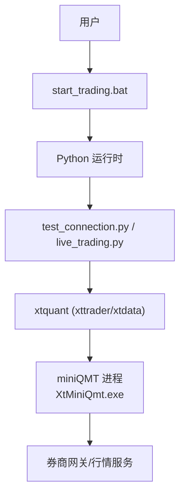
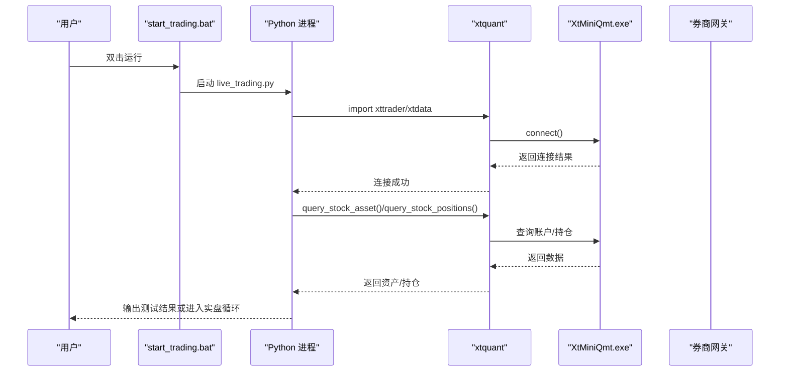
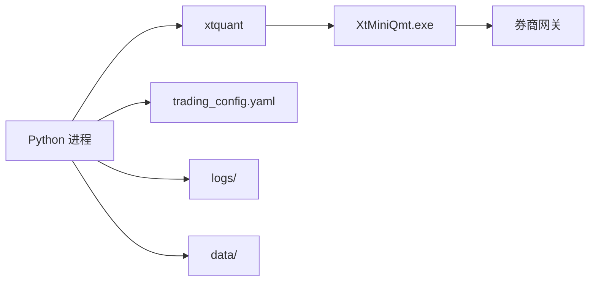

# QMT客户端安装与配置

<cite>
**本文引用的文件**
- [README.md](file://README.md)
- [实盘配置指南.md](file://实盘配置指南.md)
- [快速启动.md](file://快速启动.md)
- [miniQMT实盘对接_生产级完善方案.md](file://miniQMT实盘对接_生产级完善方案.md)
- [config/settings.yaml](file://config/settings.yaml)
- [config/trading_config.yaml](file://config/trading_config.yaml)
- [test_connection.py](file://test_connection.py)
- [start_trading.bat](file://start_trading.bat)
- [broker/local_context.py](file://broker/local_context.py)
- [scripts/gen_qmt_csv.py](file://scripts/gen_qmt_csv.py)
</cite>

## 目录
1. [简介](#简介)
2. [项目结构](#项目结构)
3. [核心组件](#核心组件)
4. [架构总览](#架构总览)
5. [详细组件分析](#详细组件分析)
6. [依赖关系分析](#依赖关系分析)
7. [性能与稳定性建议](#性能与稳定性建议)
8. [故障排查指南](#故障排查指南)
9. [结论](#结论)
10. [附录](#附录)

## 简介
本指南面向使用 QMT（含 miniQMT）进行A股量化交易的开发者，提供从客户端下载、安装、环境准备到账户注册、网络连接配置、权限与安全设置、连接测试与常见问题的完整操作说明。文档基于仓库内现有配置与脚本，确保落地可执行。

## 项目结构
- 根目录包含策略工程、回测引擎、数据层、券商接口层、配置文件与运行脚本等。
- 关键路径：
  - 配置：config/settings.yaml（全局）、config/trading_config.yaml（实盘）
  - 连接测试：test_connection.py
  - 启动脚本：start_trading.bat
  - 本地适配：broker/local_context.py
  - 预生成CSV工具：scripts/gen_qmt_csv.py

图表来源
- [start_trading.bat:1-51](file://start_trading.bat#L1-L51)
- [test_connection.py:1-117](file://test_connection.py#L1-L117)
- [broker/local_context.py:16-50](file://broker/local_context.py#L16-L50)

章节来源
- [README.md:15-55](file://README.md#L15-L55)

## 核心组件
- 配置中心
  - settings.yaml：全局数据源、回测参数、日志、因子处理等
  - trading_config.yaml：账号ID、QMT路径、风控阈值、下单超时、调度时间、通知Webhook等
- 连接与交易
  - xtquant库：通过 XtQuantTrader 与 xtdata 连接 miniQMT 进程
  - test_connection.py：一键检查库、路径、连接、账户与持仓
  - start_trading.bat：前置检查并启动实盘主程序
- 本地验证
  - broker/local_context.py：将 QMT 策略的 C.* 调用映射到本地 xtdata，便于离线验证

章节来源
- [config/settings.yaml:1-69](file://config/settings.yaml#L1-L69)
- [config/trading_config.yaml:1-62](file://config/trading_config.yaml#L1-L62)
- [test_connection.py:1-117](file://test_connection.py#L1-L117)
- [start_trading.bat:1-51](file://start_trading.bat#L1-L51)
- [broker/local_context.py:1-137](file://broker/local_context.py#L1-L137)

## 架构总览
QMT 客户端与 Python 侧通过 xtquant 通信，Python 侧负责策略计算、风控与订单管理；QMT 端负责行情与委托撮合。

图表来源
- [test_connection.py:54-106](file://test_connection.py#L54-L106)
- [broker/local_context.py:27-50](file://broker/local_context.py#L27-L50)

## 详细组件分析

### 系统要求与环境准备
- 操作系统：Windows（QMT 客户端为 Windows 应用）
- Python 版本：
  - 研究/回测：Python 3.11（pandas>=2.0 / numpy / pyyaml / pyarrow）
  - 回测工具链：Python 3.10（含 duckdb）
  - QMT 生产：Python 3.6.8（GBK 产物、无 f-string、无新式类型标注）
- QMT 客户端：E:\国金QMT交易端模拟\bin.x64\XtMiniQmt.exe
- 依赖库：xtquant（需从 QMT 安装目录复制到系统 Python 或使用 QMT 内置 Python）

章节来源
- [README.md:92-100](file://README.md#L92-L100)
- [实盘配置指南.md:12-43](file://实盘配置指南.md#L12-L43)

### 客户端下载与安装步骤
- 安装 QMT 客户端
  - 从券商提供的安装包获取 QMT 客户端，安装至 E:\国金QMT交易端模拟
  - 确认可执行文件路径：E:\国金QMT交易端模拟\bin.x64\XtMiniQmt.exe
- 安装 xtquant 库（二选一）
  - 方案A：复制到系统 Python 的 site-packages
  - 方案B：使用 QMT 内置 Python 3.6.8（兼容性最好）
- 启动 QMT 客户端并登录账号

章节来源
- [实盘配置指南.md:12-56](file://实盘配置指南.md#L12-L56)
- [快速启动.md:5-26](file://快速启动.md#L5-L26)

### 模拟账户与实盘账户注册流程
- 账号信息
  - 账号ID：67014907
  - 模拟端路径：E:\国金QMT交易端模拟
- 注册材料（通用建议）
  - 个人投资者：身份证、银行卡、手机号、邮箱
  - 机构投资者：营业执照、法人身份证、授权书、对公账户
- 审核流程（通用建议）
  - 在线开户 → 视频见证 → 风险测评 → 协议签署 → 审核通过 → 激活交易权限
- 注意
  - 本项目已配置账号ID与路径，实际以券商开通为准

章节来源
- [实盘配置指南.md:3-7](file://实盘配置指南.md#L3-L7)
- [config/trading_config.yaml:4-8](file://config/trading_config.yaml#L4-L8)

### 网络连接配置
- 端口与服务
  - 行情数据服务：58610（xtdata.connect）
  - 交易服务：58600（XtQuantTrader.connect）
- 防火墙规则
  - 放行本机 Python 进程与 XtMiniQmt.exe 的出站/入站访问
  - 允许 58610、58600 端口在本机回环或局域网内通信
- 服务器地址设置
  - 本地部署时，xtdata.connect() 默认连接本地 miniQMT 进程
  - 若跨机部署，需在 xtdata.connect(host, port) 中指定远端主机与端口
- 代理与网络限制
  - 企业网络可能限制端口，需向IT申请放行
  - VPN/代理可能导致端口被拦截，建议直连

章节来源
- [broker/local_context.py:16-24](file://broker/local_context.py#L16-L24)
- [broker/local_context.py:27-50](file://broker/local_context.py#L27-L50)

### 账户权限配置与安全设置最佳实践
- 权限最小化
  - 仅授予必要交易权限（如A股现货），关闭融资融券、期权等高权限
- 风控阈值
  - 个股止损：8%
  - 组合最大回撤：15%
  - 单日最大换手：30%
  - 单股最大仓位：5%，总仓位上限：80%
- 委托安全
  - 委托超时：300秒，未成交自动撤单
  - 价格容差：0.5%，超出范围不追单
- 通知告警
  - 配置企业微信/钉钉 Webhook，异常第一时间通知
- 备份与审计
  - 定期备份 config/ 与 data/ 目录
  - 记录每次参数调整与交易日志

章节来源
- [config/trading_config.yaml:10-41](file://config/trading_config.yaml#L10-L41)
- [实盘配置指南.md:211-233](file://实盘配置指南.md#L211-L233)

### 连接测试方法与常见问题
- 一键测试
  - 运行 test_connection.py，检查 xtquant 库、QMT 路径、连接、账户与持仓
- 预期输出
  - 显示总资产、可用资金、持仓市值、持仓数量等
- 常见问题
  - xtquant导入失败：检查路径或复制库
  - 连接失败（错误码非0）：确认 QMT 已启动且账号已登录
  - 查询账户返回0：核对账号ID
  - 程序崩溃恢复：状态持久化到 data/broker_state.json，重启后自动加载

章节来源
- [test_connection.py:18-117](file://test_connection.py#L18-L117)
- [实盘配置指南.md:154-208](file://实盘配置指南.md#L154-L208)

### 启动与运行流程
- 批处理启动
  - 运行 start_trading.bat，自动检查 Python、QMT 进程、配置文件，然后启动 live_trading.py
- 命令行启动
  - python live_trading.py
- 后台运行（生产推荐）
  - 使用 pythonw 隐藏控制台窗口

章节来源
- [start_trading.bat:1-51](file://start_trading.bat#L1-L51)
- [快速启动.md:23-26](file://快速启动.md#L23-L26)

### 预生成数据与CSV
- 用途
  - 为 QMT 策略提供预生成的估值、行业映射、BP历史与股票池
- 生成工具
  - scripts/gen_qmt_csv.py，读取 astock parquet 数据，输出到 D:/QMT_POOL
- 产物
  - financial_pb.csv、financial_pe_ttm.csv、financial_circ_mv.csv、industry_map.csv、bp_hist_pct.csv、selected.txt

章节来源
- [scripts/gen_qmt_csv.py:1-151](file://scripts/gen_qmt_csv.py#L1-L151)

## 依赖关系分析
- Python 依赖
  - pandas、numpy、pyyaml、pyarrow（研究与回测）
  - xtquant（QMT 连接）
- 外部依赖
  - QMT 客户端（XtMiniQmt.exe）
  - 券商网关（通过 miniQMT 进程）

图表来源
- [config/trading_config.yaml:1-62](file://config/trading_config.yaml#L1-L62)
- [broker/local_context.py:16-50](file://broker/local_context.py#L16-L50)

章节来源
- [README.md:92-100](file://README.md#L92-L100)

## 性能与稳定性建议
- 连接稳定性
  - 启用断线重连（指数退避），避免网络抖动导致丢失连接
- 委托可靠性
  - 监控委托超时与部分成交，自动撤单与重试
- 数据一致性
  - 每日盘后对账，发现差异立即告警
- 资源占用
  - 合理控制数据下载与缓存过期（默认1天）
  - 日志滚动与保留策略（默认10份，每份10MB）

章节来源
- [miniQMT实盘对接_生产级完善方案.md:26-72](file://miniQMT实盘对接_生产级完善方案.md#L26-L72)
- [config/settings.yaml:30-36](file://config/settings.yaml#L30-L36)

## 故障排查指南
- xtquant导入失败
  - 检查 QMT 安装路径与 Python site-packages 路径是否一致
  - 使用 QMT 内置 Python 运行
- 连接失败（错误码非0）
  - 确认 QMT 已启动并登录账号
  - 核对 trading_config.yaml 中的 account.path 与 session_id
- 查询账户返回0
  - 核对账号ID是否正确
- 程序崩溃恢复
  - 查看 data/broker_state.json 的状态文件
  - 重启后自动加载上次状态并对账持仓
- 停止程序
  - 优雅退出：Ctrl+C 或任务管理器结束 pythonw.exe
  - 退出时自动撤销未完成委托、保存状态、断开连接

章节来源
- [实盘配置指南.md:154-208](file://实盘配置指南.md#L154-L208)

## 结论
通过本指南，您可以完成 QMT 客户端的安装与配置，建立稳定的连接通道，并实现安全的账户权限管理与自动化交易流程。建议在模拟盘充分验证后再切换至实盘，配合风控与告警机制保障生产稳定。

## 附录
- 快速启动清单
  - 安装 xtquant
  - 启动 QMT 并登录
  - 运行 test_connection.py
  - 启动 start_trading.bat
- 常用命令
  - 连接测试：python test_connection.py
  - 生成CSV：python scripts/gen_qmt_csv.py
  - 启动实盘：.\start_trading.bat

章节来源
- [快速启动.md:30-36](file://快速启动.md#L30-L36)
- [scripts/gen_qmt_csv.py:140-151](file://scripts/gen_qmt_csv.py#L140-L151)