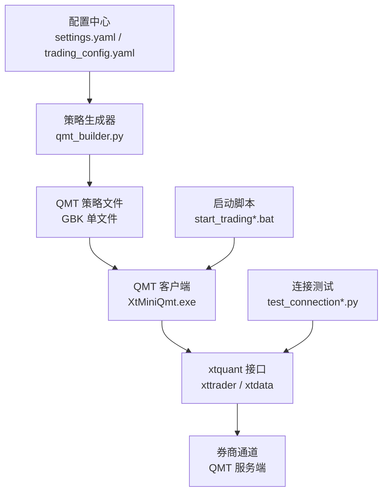
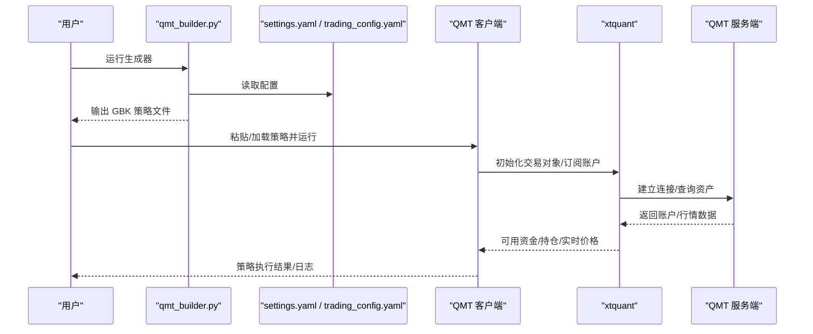
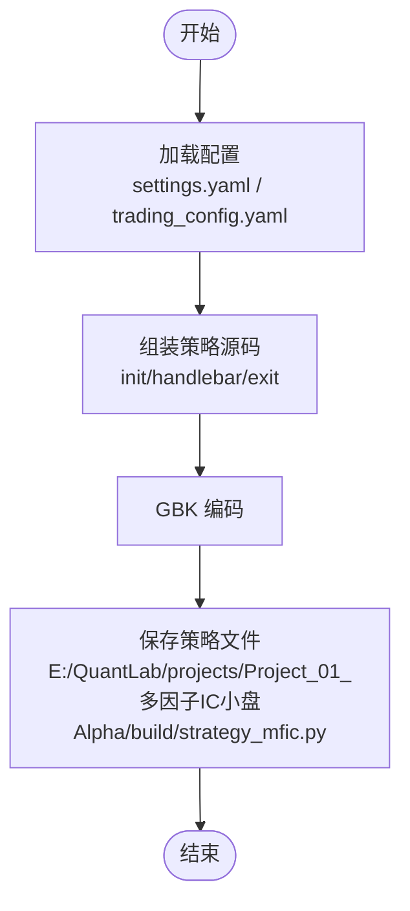
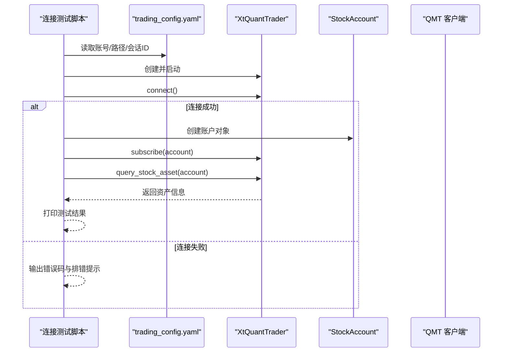
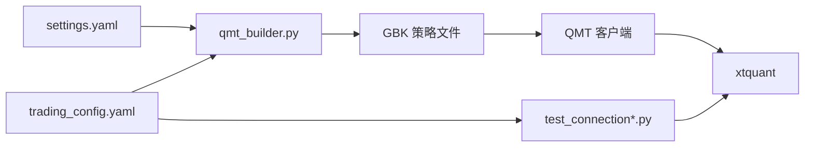

# QMT平台部署

<cite>
**本文引用的文件**   
- [broker/qmt_builder.py](file://broker/qmt_builder.py)
- [config/settings.yaml](file://config/settings.yaml)
- [config/trading_config.yaml](file://config/trading_config.yaml)
- [test_connection_qmt.py](file://test_connection_qmt.py)
- [test_connection.py](file://test_connection.py)
- [start_trading_qmt.bat](file://start_trading_qmt.bat)
- [start_trading.bat](file://start_trading.bat)
- [scripts/strategy_mfic_sim.py](file://scripts/strategy_mfic_sim.py)
- [test_in_qmt.py](file://test_in_qmt.py)
- [miniQMT实盘对接_生产级完善方案.md](file://miniQMT实盘对接_生产级完善方案.md)
- [全局复利与踩坑日志.md](file://全局复利与踩坑日志.md)
</cite>

## 目录
1. [简介](#简介)
2. [项目结构](#项目结构)
3. [核心组件](#核心组件)
4. [架构总览](#架构总览)
5. [详细组件分析](#详细组件分析)
6. [依赖关系分析](#依赖关系分析)
7. [性能考虑](#性能考虑)
8. [故障排查指南](#故障排查指南)
9. [结论](#结论)
10. [附录](#附录)

## 简介
本指南面向在本地环境部署并运行 QMT（miniQMT）量化交易平台的用户，覆盖以下内容：
- QMT 客户端安装与配置（模拟账户与实盘账户）
- 策略生成器 qmt_builder.py 的参数与输出文件结构
- 本地验证适配器的配置与使用
- 网络连接配置（服务器地址、端口、防火墙等）
- QMT 权限管理与安全配置最佳实践（API 密钥管理、访问控制）
- 连接测试与故障排查方法

本指南基于仓库中的配置文件、脚本与文档进行说明，确保可操作性和一致性。

## 项目结构
本项目围绕“策略生成—本地验证—QMT 实盘”的链路组织：
- 配置层：settings.yaml（回测/数据/因子）、trading_config.yaml（账号、风控、下单、调度、通知）
- 生成层：broker/qmt_builder.py（将策略逻辑打包为 GBK 编码的单文件策略）
- 验证层：test_connection.py / test_connection_qmt.py（本地/QMT Python 环境连接测试）
- 启动层：start_trading.bat / start_trading_qmt.bat（Windows 批处理一键启动）
- 示例策略：scripts/strategy_mfic_sim.py（QMT 模拟盘策略示例）
- 参考文档：miniQMT实盘对接_生产级完善方案.md、全局复利与踩坑日志.md

图表来源
- [config/settings.yaml:1-69](file://config/settings.yaml#L1-L69)
- [config/trading_config.yaml:1-62](file://config/trading_config.yaml#L1-L62)
- [broker/qmt_builder.py:1-386](file://broker/qmt_builder.py#L1-L386)
- [test_connection_qmt.py:1-117](file://test_connection_qmt.py#L1-L117)
- [start_trading_qmt.bat:1-66](file://start_trading_qmt.bat#L1-L66)

章节来源
- [config/settings.yaml:1-69](file://config/settings.yaml#L1-L69)
- [config/trading_config.yaml:1-62](file://config/trading_config.yaml#L1-L62)
- [broker/qmt_builder.py:1-386](file://broker/qmt_builder.py#L1-L386)

## 核心组件
- 配置中心
  - settings.yaml：回测参数、数据路径、因子预处理、策略默认池等
  - trading_config.yaml：账号信息、资金与风控、下单超时与重试、调度时间、通知 webhook、数据源路径
- 策略生成器
  - qmt_builder.py：读取配置，组装 QMT 生命周期 + 策略逻辑 + 因子计算，输出 GBK 编码的单文件策略
- 连接测试
  - test_connection.py：本地 Python 环境检查 xtquant、QMT 路径、连接与账户查询
  - test_connection_qmt.py：使用 QMT 内置 Python 执行连接测试
- 启动脚本
  - start_trading.bat：通用 Python 启动（需自行准备 xtquant）
  - start_trading_qmt.bat：使用 QMT 内置 Python 启动，自动检测 QMT 进程
- 示例策略
  - scripts/strategy_mfic_sim.py：QMT 模拟盘多因子策略示例（含止损、调仓、持仓持久化）

章节来源
- [config/settings.yaml:1-69](file://config/settings.yaml#L1-L69)
- [config/trading_config.yaml:1-62](file://config/trading_config.yaml#L1-L62)
- [broker/qmt_builder.py:1-386](file://broker/qmt_builder.py#L1-L386)
- [test_connection.py:1-117](file://test_connection.py#L1-L117)
- [test_connection_qmt.py:1-117](file://test_connection_qmt.py#L1-L117)
- [start_trading.bat:1-51](file://start_trading.bat#L1-L51)
- [start_trading_qmt.bat:1-66](file://start_trading_qmt.bat#L1-L66)
- [scripts/strategy_mfic_sim.py:1-340](file://scripts/strategy_mfic_sim.py#L1-L340)

## 架构总览
下图展示从配置到策略生成、再到 QMT 客户端运行的整体流程。

图表来源
- [broker/qmt_builder.py:1-386](file://broker/qmt_builder.py#L1-L386)
- [config/settings.yaml:1-69](file://config/settings.yaml#L1-L69)
- [config/trading_config.yaml:1-62](file://config/trading_config.yaml#L1-L62)
- [test_connection_qmt.py:1-117](file://test_connection_qmt.py#L1-L117)

## 详细组件分析

### 策略生成器 qmt_builder.py
- 功能要点
  - 读取 settings.yaml 与 trading_config.yaml 中的关键参数（初始资金、账号、仓位上限、止损、因子权重等）
  - 组装 QMT 生命周期函数（init/handlebar/exit），包含：
    - 账户设置、市场时间判断、调仓日判定
    - 全市场行情获取、因子计算（BP、反转、波动率、ROE、VWAP-成交量相关）
    - 评分排序、买入卖出委托（passorder）、止损触发
    - 持仓状态持久化（JSON）
  - 以 GBK 编码输出单文件策略，便于粘贴至 QMT 策略编辑器
- 输出文件结构
  - 固定常量：CAPITAL、MAX_WEIGHT、STOP_LOSS、TOP_N、MV_MIN/MAX、AMOUNT_MIN、FACTOR_WEIGHTS、ACCOUNT_ID
  - 工具函数：标准化、价格安全转换、持仓读写、市场时间获取、调仓日判断、VWAP 量价相关计算
  - 生命周期：init（账户设置）、handlebar（止损+调仓）、exit（清理）
- 注意事项
  - 输出路径默认指向 E:/QuantLab/projects/Project_01_多因子IC小盘Alpha/build/strategy_mfic.py（可按需修改）
  - 策略内硬编码了 ACCOUNT_ID，建议通过配置注入或环境变量管理敏感信息

图表来源
- [broker/qmt_builder.py:1-386](file://broker/qmt_builder.py#L1-L386)

章节来源
- [broker/qmt_builder.py:1-386](file://broker/qmt_builder.py#L1-L386)

### 连接测试与本地验证适配器
- test_connection.py（本地 Python）
  - 检查 xtquant 库是否可用
  - 读取 trading_config.yaml 中的 account.path、session_id、account.id
  - 创建 XtQuantTrader、启动、连接、订阅账户、查询资产与持仓
- test_connection_qmt.py（QMT 内置 Python）
  - 强调必须使用 QMT 内置 Python 运行
  - 打印 Python 版本与路径，校验 xtquant 导入
  - 连接 QMT、查询账户信息、打印总资产/可用资金/持仓市值
- 本地验证适配器
  - 若需在本地非 QMT Python 环境运行，需确保 xtquant 已安装且路径正确
  - 建议使用 QMT 内置 Python 以避免兼容性问题

图表来源
- [test_connection.py:1-117](file://test_connection.py#L1-L117)
- [test_connection_qmt.py:1-117](file://test_connection_qmt.py#L1-L117)
- [config/trading_config.yaml:1-62](file://config/trading_config.yaml#L1-L62)

章节来源
- [test_connection.py:1-117](file://test_connection.py#L1-L117)
- [test_connection_qmt.py:1-117](file://test_connection_qmt.py#L1-L117)
- [config/trading_config.yaml:1-62](file://config/trading_config.yaml#L1-L62)

### 启动脚本与运行方式
- start_trading.bat
  - 检查 Python 环境、QMT 进程、配置文件
  - 使用系统 Python 运行 live_trading.py（需自行准备 xtquant）
- start_trading_qmt.bat
  - 强制使用 QMT 内置 Python（bin.x64/python3/python.exe）
  - 自动检测 QMT 进程，未运行时可提示或自动启动
  - 创建日志与数据目录，运行 live_trading.py

章节来源
- [start_trading.bat:1-51](file://start_trading.bat#L1-L51)
- [start_trading_qmt.bat:1-66](file://start_trading_qmt.bat#L1-L66)

### 示例策略（模拟盘）
- scripts/strategy_mfic_sim.py
  - 多因子 IC 小盘 Alpha 策略（BP、反转、低波、ROE）
  - 双月调仓、TOP N 选股、止损触发、持仓 JSON 持久化
  - 适用于 QMT 模拟盘验证策略逻辑与执行流程

章节来源
- [scripts/strategy_mfic_sim.py:1-340](file://scripts/strategy_mfic_sim.py#L1-L340)

## 依赖关系分析
- 外部依赖
  - xtquant：QMT Python 接口（xttrader、xtdata、xttype）
  - yaml：解析 YAML 配置
  - numpy/pandas：因子计算与数据处理
- 内部模块
  - broker/qmt_builder.py 依赖 config/settings.yaml 与 config/trading_config.yaml
  - 连接测试脚本依赖 trading_config.yaml 中的账号与路径
  - 启动脚本依赖 QMT 客户端进程与 Python 环境

图表来源
- [config/settings.yaml:1-69](file://config/settings.yaml#L1-L69)
- [config/trading_config.yaml:1-62](file://config/trading_config.yaml#L1-L62)
- [broker/qmt_builder.py:1-386](file://broker/qmt_builder.py#L1-L386)
- [test_connection.py:1-117](file://test_connection.py#L1-L117)
- [test_connection_qmt.py:1-117](file://test_connection_qmt.py#L1-L117)

章节来源
- [config/settings.yaml:1-69](file://config/settings.yaml#L1-L69)
- [config/trading_config.yaml:1-62](file://config/trading_config.yaml#L1-L62)
- [broker/qmt_builder.py:1-386](file://broker/qmt_builder.py#L1-L386)

## 性能考虑
- 因子计算优化
  - 批量获取行情（get_market_data_ex）减少网络往返
  - 对无效数据快速过滤（close_series 长度、PB 有效性）
- 委托与风控
  - 止损检查在 handlebar 中尽早执行，避免亏损扩大
  - 调仓日限制降低频繁交易带来的滑点与手续费
- 资源占用
  - 合理设置 TOP_N 与 MV 范围，控制候选股票数量
  - 使用缓存（如 data.cache.dir）减少重复 I/O

[本节为通用指导，不直接分析具体文件]

## 故障排查指南
- 常见连接问题
  - xtquant 导入失败：确认使用 QMT 内置 Python 或正确安装 xtquant
  - 连接错误码非 0：检查 QMT 是否启动、账号是否登录、account.path 是否正确
  - 账户订阅失败：确认 session_id 与 account.id 匹配
- 策略执行异常
  - 非交易时段下单被拒绝：检查 is_trading_time 逻辑与调度时间
  - 委托超时未成交：启用 order.timeout_seconds 与 cancel_unfilled
  - 收盘后任务不触发：注意 QMT 最后一帧为 15:00，避免绑定 15:05 及之后
- 日志与诊断
  - 查看 QMT 日志目录（局域网共享路径或本机日志）
  - 使用 test_connection*.py 逐步定位问题环节

章节来源
- [test_connection.py:1-117](file://test_connection.py#L1-L117)
- [test_connection_qmt.py:1-117](file://test_connection_qmt.py#L1-L117)
- [全局复利与踩坑日志.md:132-145](file://全局复利与踩坑日志.md#L132-L145)

## 结论
通过本指南，您可以完成 QMT 客户端的安装与配置、策略生成器的使用、本地验证适配器的配置、网络连接与安全配置的最佳实践，以及连接测试与故障排查。建议在正式上实盘前，先在模拟端完整跑通一个交易日，并通过 checklist 验证所有关键环节。

[本节为总结性内容，不直接分析具体文件]

## 附录

### QMT 客户端安装与配置（模拟账户与实盘账户）
- 安装 QMT 客户端（XtMiniQmt.exe）
- 登录模拟账户或实盘账户（账号：67014907）
- 在 trading_config.yaml 中配置 account.path、session_id、account.id
- 使用 start_trading_qmt.bat 启动，确保 QMT 进程已运行

章节来源
- [config/trading_config.yaml:1-62](file://config/trading_config.yaml#L1-L62)
- [start_trading_qmt.bat:1-66](file://start_trading_qmt.bat#L1-L66)

### 策略生成器 qmt_builder.py 使用方法
- 运行 python broker/qmt_builder.py
- 读取 settings.yaml 与 trading_config.yaml 中的参数
- 输出 GBK 编码策略文件至 E:/QuantLab/projects/Project_01_多因子IC小盘Alpha/build/strategy_mfic.py
- 将生成的策略粘贴至 QMT 策略编辑器并运行

章节来源
- [broker/qmt_builder.py:1-386](file://broker/qmt_builder.py#L1-L386)

### 网络连接配置（服务器地址、端口、防火墙）
- 服务器地址与端口：由 QMT 客户端内部管理，通常无需手动配置
- 防火墙：确保允许 QMT 客户端与券商服务器的通信（TCP 端口由 QMT 决定）
- 代理与网络：如需代理，请在操作系统或浏览器层面配置，不影响 QMT 底层通信

[本节为通用指导，不直接分析具体文件]

### QMT 权限管理与安全配置最佳实践
- API 密钥管理
  - 避免在代码中硬编码账号与密钥，优先使用配置文件或环境变量
  - 定期轮换密钥，限制最小权限原则
- 访问控制
  - 仅授权必要人员访问 QMT 客户端与配置文件
  - 使用操作系统级权限控制敏感目录（如 userdata_mini）
- 审计与告警
  - 启用通知 webhook（企业微信/钉钉）接收异常与成交回报
  - 记录关键操作日志，便于事后审计

章节来源
- [config/trading_config.yaml:1-62](file://config/trading_config.yaml#L1-L62)
- [miniQMT实盘对接_生产级完善方案.md:26-72](file://miniQMT实盘对接_生产级完善方案.md#L26-L72)

### 连接测试与故障排查步骤
- 使用 test_connection_qmt.py（QMT 内置 Python）进行连接测试
- 检查 xtquant 导入、QMT 路径、账号登录状态
- 若失败，根据错误码与提示信息逐项排查
- 查看 QMT 日志与本地日志，定位问题根因

章节来源
- [test_connection_qmt.py:1-117](file://test_connection_qmt.py#L1-L117)
- [test_connection.py:1-117](file://test_connection.py#L1-L117)
- [全局复利与踩坑日志.md:132-145](file://全局复利与踩坑日志.md#L132-L145)