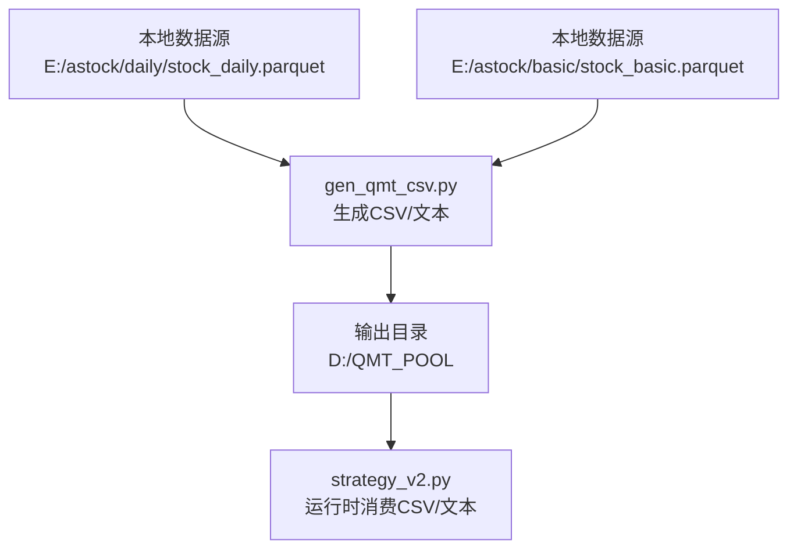
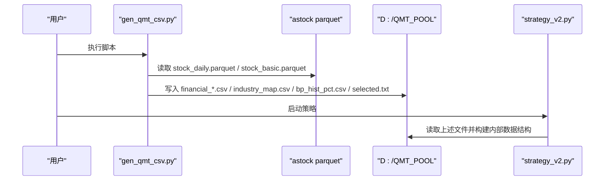
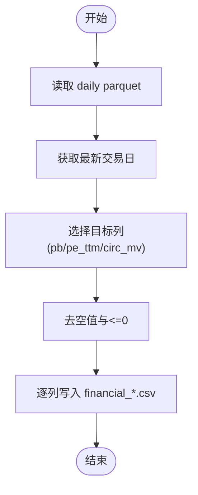
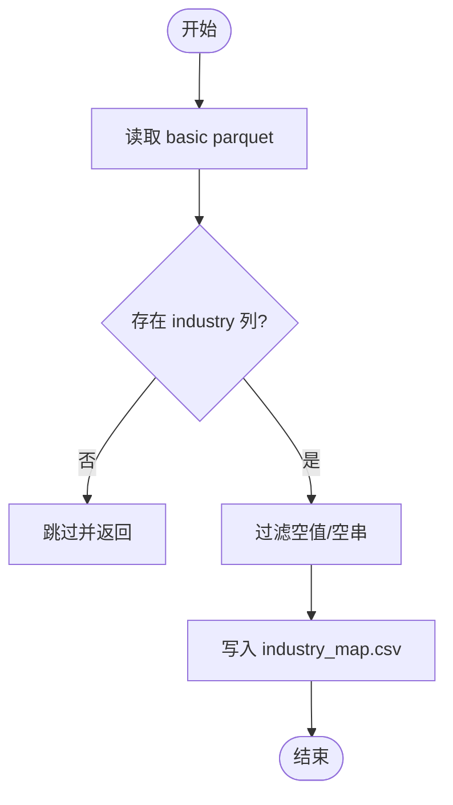
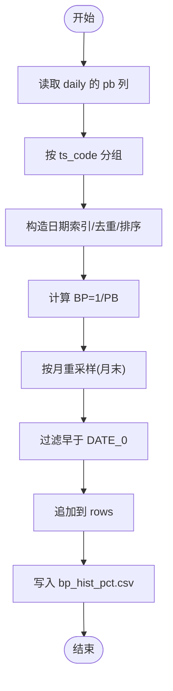
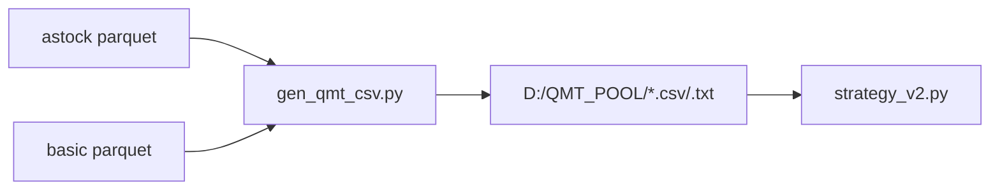

# 数据文件生成

<cite>
**本文引用的文件**   
- [scripts/gen_qmt_csv.py](file://scripts/gen_qmt_csv.py)
- [data/astock_reader.py](file://data/astock_reader.py)
- [data/universe.py](file://data/universe.py)
- [data/industry_map.py](file://data/industry_map.py)
- [projects/Project_10_价值小盘V2/strategy_v2.py](file://projects/Project_10_价值小盘V2/strategy_v2.py)
- [config/settings.yaml](file://config/settings.yaml)
- [scripts/update_data.bat](file://scripts/update_data.bat)
- [scripts/run_batch_ic_test.bat](file://scripts/run_batch_ic_test.bat)
</cite>

## 目录
1. [简介](#简介)
2. [项目结构](#项目结构)
3. [核心组件](#核心组件)
4. [架构总览](#架构总览)
5. [详细组件分析](#详细组件分析)
6. [依赖关系分析](#依赖关系分析)
7. [性能与内存考量](#性能与内存考量)
8. [故障排查指南](#故障排查指南)
9. [结论](#结论)
10. [附录：批量处理与定时任务示例](#附录批量处理与定时任务示例)

## 简介
本文件为 QMT 数据文件生成工具的使用文档，聚焦于 scripts/gen_qmt_csv.py 脚本的功能、输入输出格式、处理逻辑以及在生产环境中的批量与定时使用方式。该脚本从本地 astock parquet 数据源读取股票日行情与基础信息，生成 V2 策略在 QMT 运行所需的预生成 CSV 与文本文件，供 strategy_v2.py 消费。

主要产出（位于 D:\QMT_POOL）：
- financial_pb.csv：最新交易日 PB（ts_code, value）
- financial_pe_ttm.csv：最新交易日 PE_TTM（ts_code, value）
- financial_circ_mv.csv：最新交易日流通市值（万元）（ts_code, value）
- industry_map.csv：行业映射（ts_code, industry）
- bp_hist_pct.csv：月度 BP 值历史（ts_code, date, hp_pct），注意字段含义是“BP值”而非分位
- selected.txt：全部A股代码列表（用于 QMT 实时接口的 fallback）

## 项目结构
与数据生成相关的核心位置如下：
- 脚本入口：scripts/gen_qmt_csv.py
- 数据源路径（由配置与脚本共同约定）：E:/astock/daily/stock_daily.parquet、E:/astock/basic/stock_basic.parquet
- 输出目录：D:\QMT_POOL
- 消费者：projects/Project_10_价值小盘V2/strategy_v2.py（按固定文件名与字段加载）

图表来源
- [scripts/gen_qmt_csv.py:32-34](file://scripts/gen_qmt_csv.py#L32-L34)
- [projects/Project_10_价值小盘V2/strategy_v2.py:30](file://projects/Project_10_价值小盘V2/strategy_v2.py#L30)

章节来源
- [scripts/gen_qmt_csv.py:1-21](file://scripts/gen_qmt_csv.py#L1-L21)
- [config/settings.yaml:10-18](file://config/settings.yaml#L10-L18)

## 核心组件
- 估值快照生成：从 daily parquet 提取最新交易日的 pb、pe_ttm、circ_mv，过滤无效值后写入对应 CSV。
- 行业映射生成：从 basic parquet 提取 ts_code 与 industry，清洗空值后写入 industry_map.csv。
- BP 历史序列生成：基于 daily 的 pb 全历史，计算 1/PB 得到 BP，按月重采样取月末值，保留自 DATE_0 以来的序列，写入 bp_hist_pct.csv。
- 股票池生成：从 basic parquet 提取所有 ts_code，排序后写入 selected.txt。

章节来源
- [scripts/gen_qmt_csv.py:44-71](file://scripts/gen_qmt_csv.py#L44-L71)
- [scripts/gen_qmt_csv.py:73-88](file://scripts/gen_qmt_csv.py#L73-L88)
- [scripts/gen_qmt_csv.py:91-126](file://scripts/gen_qmt_csv.py#L91-L126)
- [scripts/gen_qmt_csv.py:129-137](file://scripts/gen_qmt_csv.py#L129-L137)

## 架构总览
gen_qmt_csv.py 作为数据准备阶段的核心，将 astock parquet 转换为 QMT 运行时可直接消费的轻量 CSV/文本。strategy_v2.py 通过固定的 _load_* 函数读取这些文件，形成“生成-消费”的稳定契约。

图表来源
- [scripts/gen_qmt_csv.py:140-146](file://scripts/gen_qmt_csv.py#L140-L146)
- [projects/Project_10_价值小盘V2/strategy_v2.py:113-177](file://projects/Project_10_价值小盘V2/strategy_v2.py#L113-L177)

## 详细组件分析

### 估值快照生成（financial_pb / pe_ttm / circ_mv）
- 输入：stock_daily.parquet（MultiIndex: trade_date, ts_code）
- 处理：
  - 定位最新交易日
  - 筛选目标列（pb、pe_ttm、circ_mv）
  - 去除 NaN 与 <=0 的值
  - 以 ts_code,value 写入 CSV
- 复杂度：O(N) 行扫描；内存占用取决于单交易日切片大小
- 错误处理：若列缺失则跳过并记录日志

图表来源
- [scripts/gen_qmt_csv.py:44-71](file://scripts/gen_qmt_csv.py#L44-L71)

章节来源
- [scripts/gen_qmt_csv.py:44-71](file://scripts/gen_qmt_csv.py#L44-L71)

### 行业映射生成（industry_map.csv）
- 输入：stock_basic.parquet
- 处理：
  - 检查 industry 列是否存在
  - 过滤空值与空字符串
  - 写入 ts_code, industry
- 复杂度：O(N) 行扫描
- 错误处理：无 industry 列时直接跳过

图表来源
- [scripts/gen_qmt_csv.py:73-88](file://scripts/gen_qmt_csv.py#L73-L88)

章节来源
- [scripts/gen_qmt_csv.py:73-88](file://scripts/gen_qmt_csv.py#L73-L88)

### BP 历史序列生成（bp_hist_pct.csv）
- 输入：stock_daily.parquet 的 pb 列
- 处理：
  - 按 ts_code 分组
  - 构造日期索引，去重并按时间排序
  - 计算 BP = 1/PB，按月重采样取月末值
  - 过滤早于 DATE_0 的数据
  - 追加到 rows 列表并写入 CSV
- 复杂度：按 code 分组聚合，整体 O(N)；内存友好（逐 code 处理）
- 错误处理：无有效 pb 序列或无月末值时跳过

图表来源
- [scripts/gen_qmt_csv.py:91-126](file://scripts/gen_qmt_csv.py#L91-L126)

章节来源
- [scripts/gen_qmt_csv.py:91-126](file://scripts/gen_qmt_csv.py#L91-L126)

### 股票池生成（selected.txt）
- 输入：stock_basic.parquet
- 处理：提取 ts_code，排序后每行一个代码写入 selected.txt
- 用途：QMT 实时接口不可用时的回退股票池

章节来源
- [scripts/gen_qmt_csv.py:129-137](file://scripts/gen_qmt_csv.py#L129-L137)

### 消费者对接（strategy_v2.py）
- 读取 selected.txt 作为股票池 fallback
- 读取 financial_{pe_ttm,pb,circ_mv}.csv 构建 {code:{field:value}}
- 读取 industry_map.csv 构建 {code:industry}
- 读取 bp_hist_pct.csv 构建 {code:[(date,bp)]}
- 字段名与顺序严格匹配生成脚本的输出

章节来源
- [projects/Project_10_价值小盘V2/strategy_v2.py:95-177](file://projects/Project_10_价值小盘V2/strategy_v2.py#L95-L177)

## 依赖关系分析
- 数据源依赖：
  - astock parquet 读取器（data/astock_reader.py）定义了 MultiIndex 结构与列集合，确保 daily 包含 pb、pe_ttm、circ_mv 等必要列
  - industry_map 读取器（data/industry_map.py）提供 industry 映射的缓存读取能力
- 配置依赖：
  - settings.yaml 中 data.astock.* 路径与脚本常量保持一致（E:/astock/...）
- 消费者依赖：
  - strategy_v2.py 对输出文件的字段名与命名有强约定

图表来源
- [data/astock_reader.py:22-56](file://data/astock_reader.py#L22-L56)
- [data/industry_map.py:11-36](file://data/industry_map.py#L11-L36)
- [config/settings.yaml:10-18](file://config/settings.yaml#L10-L18)
- [scripts/gen_qmt_csv.py:32-34](file://scripts/gen_qmt_csv.py#L32-L34)
- [projects/Project_10_价值小盘V2/strategy_v2.py:113-177](file://projects/Project_10_价值小盘V2/strategy_v2.py#L113-L177)

章节来源
- [data/astock_reader.py:25-69](file://data/astock_reader.py#L25-L69)
- [data/industry_map.py:16-36](file://data/industry_map.py#L16-L36)
- [config/settings.yaml:10-18](file://config/settings.yaml#L10-L18)

## 性能与内存考量
- 全量 daily 读取：gen_bp_hist 会读取 pb 列的全历史，建议仅在数据更新后执行一次
- 逐 code 处理：避免一次性加载全表到内存，降低峰值内存
- 列裁剪：astock_reader 仅读取必要列，减少 I/O 与内存占用
- 输出写入：使用 csv.writer 流式写入，避免中间大对象

优化建议
- 在数据更新完成后统一执行 gen_qmt_csv.py，避免重复计算
- 若磁盘 IO 成为瓶颈，可将输出目录置于 SSD
- 对于超大 parquet，可考虑分区存储或增量更新

[本节为通用指导，不直接分析具体文件]

## 故障排查指南
常见问题与处理方法：
- 找不到 parquet 文件
  - 现象：FileNotFoundError
  - 处理：确认 E:/astock 路径正确，settings.yaml 与脚本常量一致
- daily 缺少必要列
  - 现象：估值快照生成跳过某列
  - 处理：检查 astock 数据更新是否完整，确保包含 pb、pe_ttm、circ_mv
- industry 列缺失
  - 现象：industry_map 生成被跳过
  - 处理：确认 stock_basic.parquet 包含 industry 列
- 输出目录权限不足
  - 现象：写入失败
  - 处理：确保 D:\QMT_POOL 存在且可写
- 消费者无法读取文件
  - 现象：strategy_v2 读取为空或异常
  - 处理：核对文件名与字段名是否与生成脚本一致

章节来源
- [scripts/gen_qmt_csv.py:44-71](file://scripts/gen_qmt_csv.py#L44-L71)
- [scripts/gen_qmt_csv.py:73-88](file://scripts/gen_qmt_csv.py#L73-L88)
- [scripts/gen_qmt_csv.py:91-126](file://scripts/gen_qmt_csv.py#L91-L126)
- [data/astock_reader.py:35-42](file://data/astock_reader.py#L35-L42)

## 结论
gen_qmt_csv.py 提供了稳定、可复现的 QMT 数据准备流程，将 astock parquet 转换为 strategy_v2.py 可直接消费的轻量文件。通过严格的字段约定与容错处理，保证了生产环境的可靠性与可维护性。建议在数据更新后统一执行该脚本，并结合批处理与定时任务实现自动化。

[本节为总结，不直接分析具体文件]

## 附录：批量处理与定时任务示例
- 手动执行
  - 命令：python scripts/gen_qmt_csv.py
  - 说明：生成 D:\QMT_POOL 下的所有 CSV/文本文件
- 批处理脚本
  - update_data.bat：封装数据更新流程（可结合 gen_qmt_csv.py 调用）
  - run_batch_ic_test.bat：展示批处理模板，可用于扩展为数据生成任务
- 定时任务（Windows）
  - 使用任务计划程序创建每日任务，触发 python scripts/gen_qmt_csv.py
  - 建议在收盘后执行，确保 daily 数据已更新至最新交易日
- 定时任务（Linux/macOS）
  - 使用 crontab 添加条目，例如：0 18 * * 1-5 cd /path/to/QuantLab && python scripts/gen_qmt_csv.py >> logs/gen_qmt.log 2>&1

章节来源
- [scripts/gen_qmt_csv.py:20-21](file://scripts/gen_qmt_csv.py#L20-L21)
- [scripts/update_data.bat:1-15](file://scripts/update_data.bat#L1-L15)
- [scripts/run_batch_ic_test.bat:1-17](file://scripts/run_batch_ic_test.bat#L1-L17)