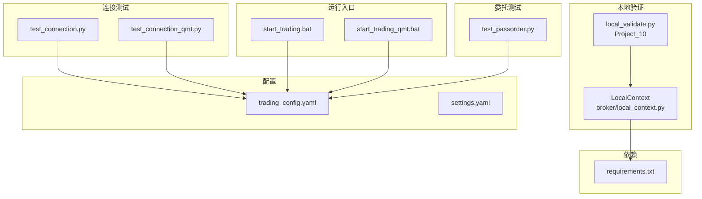
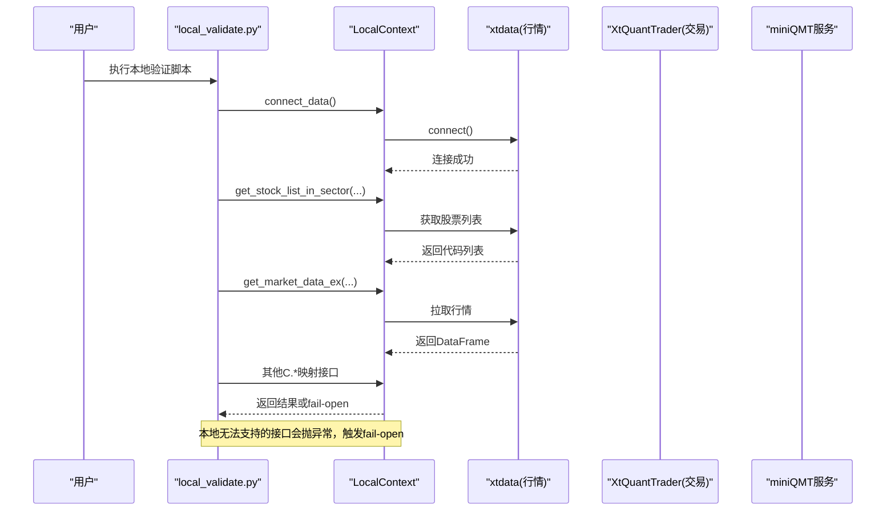
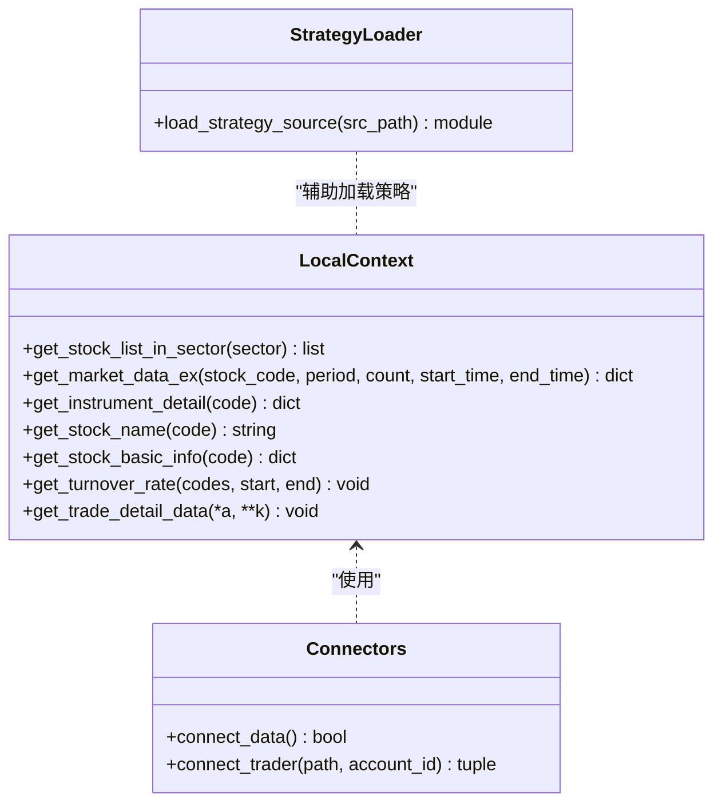
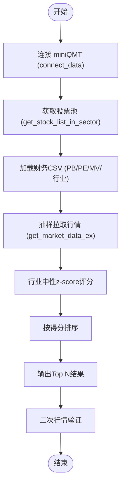
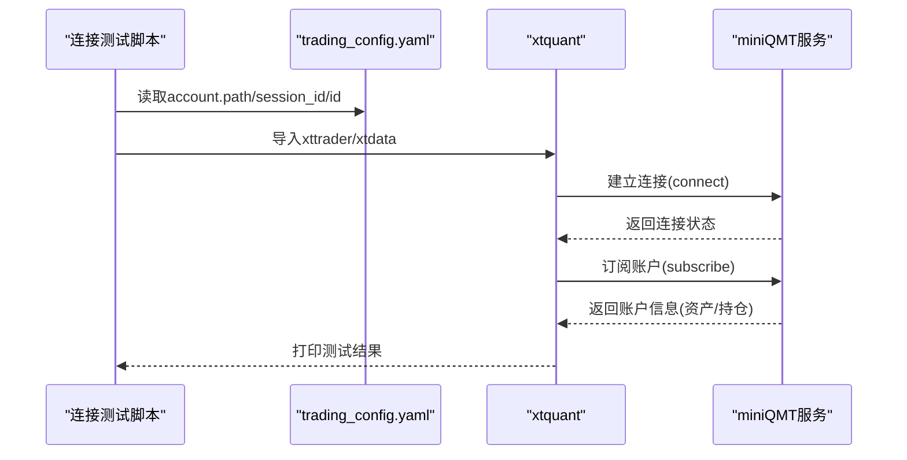
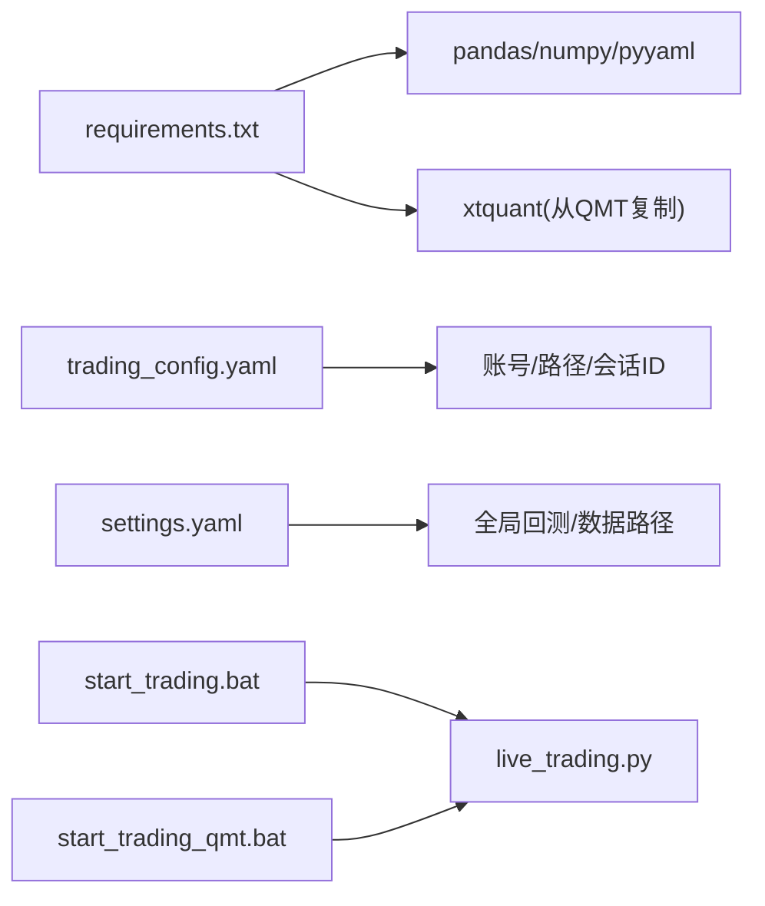

# 本地验证适配器

<cite>
**本文引用的文件**   
- [broker/local_context.py](file://broker/local_context.py)
- [projects/Project_10_价值小盘V2/local_validate.py](file://projects/Project_10_价值小盘V2/local_validate.py)
- [test_connection.py](file://test_connection.py)
- [test_connection_qmt.py](file://test_connection_qmt.py)
- [config/trading_config.yaml](file://config/trading_config.yaml)
- [config/settings.yaml](file://config/settings.yaml)
- [requirements.txt](file://requirements.txt)
- [start_trading.bat](file://start_trading.bat)
- [start_trading_qmt.bat](file://start_trading_qmt.bat)
- [scripts/test_passorder.py](file://scripts/test_passorder.py)
- [AGENTS.md](file://AGENTS.md)
</cite>

## 目录
1. [简介](#简介)
2. [项目结构](#项目结构)
3. [核心组件](#核心组件)
4. [架构总览](#架构总览)
5. [详细组件分析](#详细组件分析)
6. [依赖关系分析](#依赖关系分析)
7. [性能与压力测试指南](#性能与压力测试指南)
8. [故障排查指南](#故障排查指南)
9. [结论](#结论)
10. [附录：配置与使用清单](#附录配置与使用清单)

## 简介
本指南面向 QMT 本地验证适配器的配置与使用，重点说明 broker/local_context.py 的作用与工作原理，以及如何通过它模拟 QMT 环境进行本地快速验证。文档还涵盖连接测试脚本的使用方法（网络连通性与 API 接口验证）、本地调试环境的搭建步骤（依赖安装与配置）、常见本地测试场景与断言方法，以及性能与压力测试的指导。

## 项目结构
与本地验证适配器相关的核心文件分布如下：
- 适配器与工具：broker/local_context.py
- 项目级本地验证示例：projects/Project_10_价值小盘V2/local_validate.py
- 连接测试脚本：test_connection.py、test_connection_qmt.py
- 配置文件：config/trading_config.yaml、config/settings.yaml
- 依赖清单：requirements.txt
- 启动脚本：start_trading.bat、start_trading_qmt.bat
- 委托测试样例：scripts/test_passorder.py
- 流程与规范参考：AGENTS.md

图表来源 
- [broker/local_context.py:1-137](file://broker/local_context.py#L1-L137)
- [projects/Project_10_价值小盘V2/local_validate.py:1-151](file://projects/Project_10_价值小盘V2/local_validate.py#L1-L151)
- [test_connection.py:1-117](file://test_connection.py#L1-L117)
- [test_connection_qmt.py:1-117](file://test_connection_qmt.py#L1-L117)
- [config/trading_config.yaml:1-62](file://config/trading_config.yaml#L1-L62)
- [config/settings.yaml:1-69](file://config/settings.yaml#L1-L69)
- [requirements.txt:1-29](file://requirements.txt#L1-L29)
- [start_trading.bat:1-51](file://start_trading.bat#L1-L51)
- [start_trading_qmt.bat:1-66](file://start_trading_qmt.bat#L1-L66)
- [scripts/test_passorder.py:1-48](file://scripts/test_passorder.py#L1-L48)

章节来源
- [broker/local_context.py:1-137](file://broker/local_context.py#L1-L137)
- [projects/Project_10_价值小盘V2/local_validate.py:1-151](file://projects/Project_10_价值小盘V2/local_validate.py#L1-L151)
- [test_connection.py:1-117](file://test_connection.py#L1-L117)
- [test_connection_qmt.py:1-117](file://test_connection_qmt.py#L1-L117)
- [config/trading_config.yaml:1-62](file://config/trading_config.yaml#L1-L62)
- [config/settings.yaml:1-69](file://config/settings.yaml#L1-L69)
- [requirements.txt:1-29](file://requirements.txt#L1-L29)
- [start_trading.bat:1-51](file://start_trading.bat#L1-L51)
- [start_trading_qmt.bat:1-66](file://start_trading_qmt.bat#L1-L66)
- [scripts/test_passorder.py:1-48](file://scripts/test_passorder.py#L1-L48)

## 核心组件
- LocalContext：将策略中的 C.* 调用映射到本地 xtdata，提供行情与基础信息读取能力；对本地不支持的接口抛出异常以触发 fail-open 行为。
- connect_data/connect_trader：管理 miniQMT 数据服务与交易服务的连接状态，避免重复连接。
- load_strategy_source：加载 QMT 策略源码并处理编码问题，便于在本地 import 执行。
- local_validate.py：项目级本地验证脚本，演示如何连接 miniQMT、拉取行情、构造候选股并进行评分与输出。
- test_connection.py / test_connection_qmt.py：分别用于外部 Python 环境与 QMT 内置 Python 的连接测试与账户/持仓查询。

章节来源
- [broker/local_context.py:1-137](file://broker/local_context.py#L1-L137)
- [projects/Project_10_价值小盘V2/local_validate.py:1-151](file://projects/Project_10_价值小盘V2/local_validate.py#L1-L151)
- [test_connection.py:1-117](file://test_connection.py#L1-L117)
- [test_connection_qmt.py:1-117](file://test_connection_qmt.py#L1-L117)

## 架构总览
下图展示了本地验证的整体交互：本地 Python 通过 xtquant 连接 miniQMT 的数据与交易服务，LocalContext 屏蔽底层差异，使策略代码无需修改即可在本地运行。

图表来源 
- [broker/local_context.py:1-137](file://broker/local_context.py#L1-L137)
- [projects/Project_10_价值小盘V2/local_validate.py:1-151](file://projects/Project_10_价值小盘V2/local_validate.py#L1-L151)

## 详细组件分析

### LocalContext 类与连接管理
- 连接管理：connect_data 负责连接行情服务（端口 58610），connect_trader 负责连接交易服务（端口 58600），内部维护全局状态避免重复连接。
- 接口映射：get_stock_list_in_sector、get_market_data_ex、get_instrument_detail、get_stock_name、get_stock_basic_info 等直接转发至 xtdata。
- Fail-open 机制：get_turnover_rate、get_trade_detail_data 等本地不支持的接口抛出 NotImplementedError，由上层策略捕获后走 fail-open 逻辑。
- 策略加载：load_strategy_source 读取源文件、修正编码头、动态导入模块，解决“声明 GBK 但实际 UTF-8”的问题。

图表来源 
- [broker/local_context.py:1-137](file://broker/local_context.py#L1-L137)

章节来源
- [broker/local_context.py:1-137](file://broker/local_context.py#L1-L137)

### 本地验证脚本 local_validate.py
- 连接 miniQMT：调用 connect_data() 建立 xtdata 连接，随后创建 LocalContext 实例。
- 获取全市场股票列表：通过 ctx.get_stock_list_in_sector("沪深A股") 获取候选池。
- 加载 CSV 财务数据：从 POOL_DIR 读取 PB/PE/市值/行业映射，构建评分输入。
- 行情验证：抽样拉取少量股票的最近 K 线，确认 xtdata 可用。
- 评分管线：基于 z-score 行业中性化计算得分，排序输出 Top N。
- 二次行情校验：对 Top 股票再次拉取近 3 日数据，打印收盘价与成交量。

图表来源 
- [projects/Project_10_价值小盘V2/local_validate.py:1-151](file://projects/Project_10_价值小盘V2/local_validate.py#L1-L151)

章节来源
- [projects/Project_10_价值小盘V2/local_validate.py:1-151](file://projects/Project_10_价值小盘V2/local_validate.py#L1-L151)

### 连接测试脚本
- test_connection.py（外部 Python）：检查 xtquant 库、读取 trading_config.yaml、连接 miniQMT、查询账户资产与持仓，最后断开服务。
- test_connection_qmt.py（QMT 内置 Python）：检查 Python 环境、加载配置、连接 QMT、订阅账户、打印资产与持仓明细。

图表来源 
- [test_connection.py:1-117](file://test_connection.py#L1-L117)
- [test_connection_qmt.py:1-117](file://test_connection_qmt.py#L1-L117)
- [config/trading_config.yaml:1-62](file://config/trading_config.yaml#L1-L62)

章节来源
- [test_connection.py:1-117](file://test_connection.py#L1-L117)
- [test_connection_qmt.py:1-117](file://test_connection_qmt.py#L1-L117)
- [config/trading_config.yaml:1-62](file://config/trading_config.yaml#L1-L62)

### 委托测试样例
- scripts/test_passorder.py：在 QMT 中粘贴执行，获取第一只股票实时价格并尝试买入 100 股，验证 passorder 调用链路。

章节来源
- [scripts/test_passorder.py:1-48](file://scripts/test_passorder.py#L1-L48)

## 依赖关系分析
- 运行时依赖：pandas、numpy、pyyaml 为核心；xtquant 需从 QMT 安装目录复制或使用 QMT 内置 Python。
- 配置依赖：trading_config.yaml 指定账号、路径、会话 ID 等；settings.yaml 提供全局回测与数据路径。
- 启动脚本：start_trading.bat 与 start_trading_qmt.bat 分别用于外部 Python 与 QMT 内置 Python 启动实盘流程。

图表来源 
- [requirements.txt:1-29](file://requirements.txt#L1-L29)
- [config/trading_config.yaml:1-62](file://config/trading_config.yaml#L1-L62)
- [config/settings.yaml:1-69](file://config/settings.yaml#L1-L69)
- [start_trading.bat:1-51](file://start_trading.bat#L1-L51)
- [start_trading_qmt.bat:1-66](file://start_trading_qmt.bat#L1-L66)

章节来源
- [requirements.txt:1-29](file://requirements.txt#L1-L29)
- [config/trading_config.yaml:1-62](file://config/trading_config.yaml#L1-L62)
- [config/settings.yaml:1-69](file://config/settings.yaml#L1-L69)
- [start_trading.bat:1-51](file://start_trading.bat#L1-L51)
- [start_trading_qmt.bat:1-66](file://start_trading_qmt.bat#L1-L66)

## 性能与压力测试指南
- 本地性能基准：
  - 全市场扫描耗时：参考 Project_10 本地验证脚本，通常数秒内完成全市场股票列表与样本行情拉取。
  - 行情拉取优化：先抽样验证（如前 500 只），再批量拉取；必要时限制 count 与 period。
- 压力测试建议：
  - 极端事件回测：参考 robustness_tests.py 的压力测试思路，选取历史极端时段评估策略稳健性。
  - 交易成本压力：提高佣金与滑点参数，观察策略收益衰减与换手变化。
  - 容量估算：根据平均成交额与持仓数量估算可承载资金规模。
- 指标记录：
  - 记录筛选完成数量、拒绝统计（数据不足/ATR过高/换手越界/换手未知）。
  - 输出 Top N 候选与关键因子值，便于对比不同参数下的排序稳定性。

章节来源
- [projects/Project_10_价值小盘V2/local_validate.py:1-151](file://projects/Project_10_价值小盘V2/local_validate.py#L1-L151)
- [AGENTS.md:142-155](file://AGENTS.md#L142-L155)

## 故障排查指南
- 连接失败：
  - 检查 miniQMT 是否已启动（XtMiniQMT.exe、miniquote.exe、XtItClient.exe）。
  - 核对 trading_config.yaml 中的 account.path、session_id、id 是否正确。
  - 外部 Python 需确保 xtquant 库可用；QMT 内置 Python 需使用其自带解释器。
- 行情为空：
  - 确认 xtdata.connect() 成功；抽样拉取少量代码验证。
  - 注意股票代码格式与板块名称（如“沪深A股”）。
- 编码问题：
  - 策略源码可能声明 GBK 但实际为 UTF-8，本地 import 需修正文件头后再执行。
- 委托测试：
  - 使用 scripts/test_passorder.py 在 QMT 中执行，确认 passorder 调用链路正常。

章节来源
- [test_connection.py:1-117](file://test_connection.py#L1-L117)
- [test_connection_qmt.py:1-117](file://test_connection_qmt.py#L1-L117)
- [config/trading_config.yaml:1-62](file://config/trading_config.yaml#L1-L62)
- [scripts/test_passorder.py:1-48](file://scripts/test_passorder.py#L1-L48)
- [AGENTS.md:142-155](file://AGENTS.md#L142-L155)

## 结论
通过 LocalContext 适配器与本地验证脚本，可在不改动策略代码的前提下，利用 miniQMT 的实时行情与交易服务进行本地快速验证。配合连接测试脚本与启动脚本，能够高效完成环境搭建、连通性检查与接口验证。结合性能与压力测试指导，可进一步提升策略的稳健性与可部署性。

## 附录：配置与使用清单
- 环境准备
  - 安装依赖：pandas、numpy、pyyaml；xtquant 从 QMT 安装目录复制或使用 QMT 内置 Python。
  - 启动 miniQMT：确保 XtMiniQMT.exe、miniquote.exe、XtItClient.exe 正常运行。
- 配置设置
  - 编辑 config/trading_config.yaml：填写 account.path、session_id、id 等。
  - 如需调整全局回测与数据路径，编辑 config/settings.yaml。
- 本地验证流程
  - 在项目目录下运行 local_validate.py，验证选股与评分管线。
  - 使用 test_connection.py 或 test_connection_qmt.py 进行连接与账户/持仓查询。
- 常见问题
  - 若选股结果为 0 只，优先检查编码与板块名称；若行情为空，检查 xtdata 连接与样本代码。
  - 委托测试使用 scripts/test_passorder.py 在 QMT 中执行。

章节来源
- [config/trading_config.yaml:1-62](file://config/trading_config.yaml#L1-L62)
- [config/settings.yaml:1-69](file://config/settings.yaml#L1-L69)
- [requirements.txt:1-29](file://requirements.txt#L1-L29)
- [test_connection.py:1-117](file://test_connection.py#L1-L117)
- [test_connection_qmt.py:1-117](file://test_connection_qmt.py#L1-L117)
- [scripts/test_passorder.py:1-48](file://scripts/test_passorder.py#L1-L48)
- [AGENTS.md:142-155](file://AGENTS.md#L142-L155)