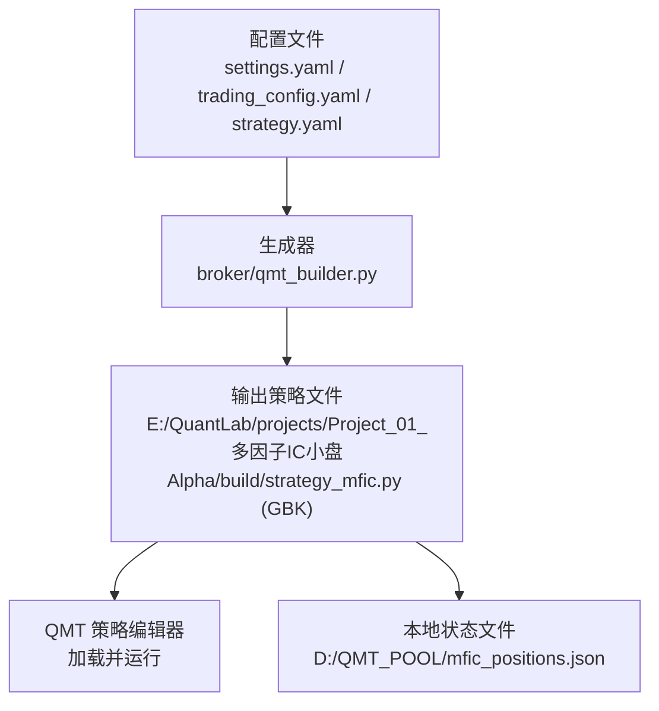
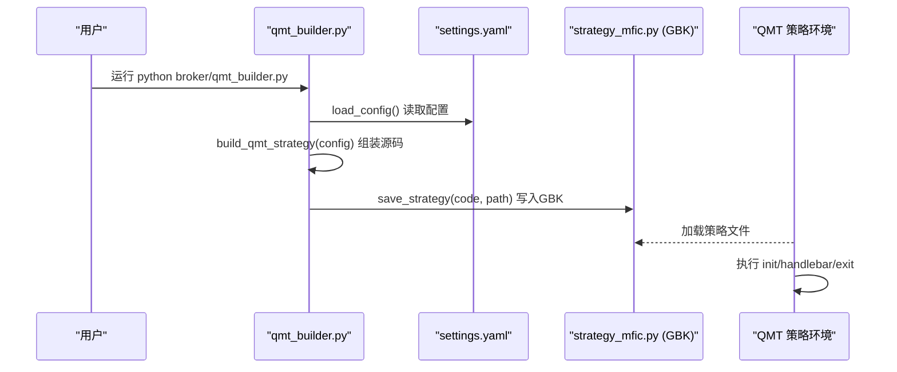
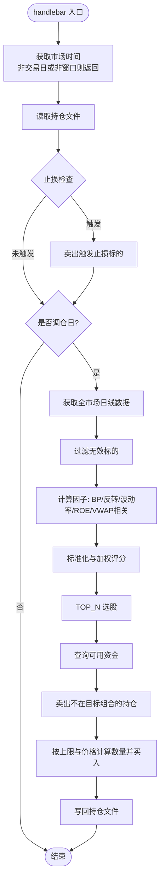
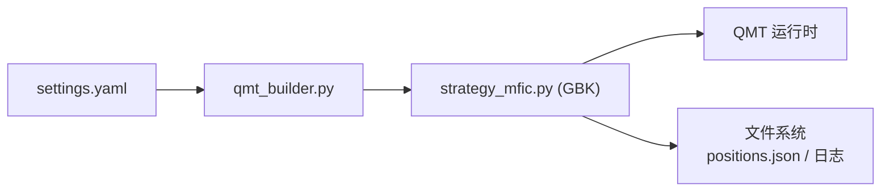

# 策略生成器使用

<cite>
**本文引用的文件**
- [qmt_builder.py](file://broker/qmt_builder.py)
- [settings.yaml](file://config/settings.yaml)
- [trading_config.yaml](file://config/trading_config.yaml)
- [strategy.yaml（Project_01）](file://projects/Project_01_多因子IC小盘Alpha/config/strategy.yaml)
- [build_prod.py（Project_01）](file://projects/Project_01_多因子IC小盘Alpha/research/mfic_strategy/build_prod.py)
- [strategy_mfic_v2.py（示例策略）](file://projects/Project_01_多因子IC小盘Alpha/research/mfic_strategy/strategy_mfic_v2.py)
- [test_passorder.py（委托测试）](file://scripts/test_passorder.py)
- [AGENTS.md（QMT注意事项）](file://AGENTS.md)
- [快速启动.md](file://快速启动.md)
- [实盘配置指南.md](file://实盘配置指南.md)
</cite>

## 目录
1. [简介](#简介)
2. [项目结构](#项目结构)
3. [核心组件](#核心组件)
4. [架构总览](#架构总览)
5. [详细组件分析](#详细组件分析)
6. [依赖关系分析](#依赖关系分析)
7. [性能与稳定性考虑](#性能与稳定性考虑)
8. [故障排查指南](#故障排查指南)
9. [结论](#结论)
10. [附录：参数与最佳实践](#附录参数与最佳实践)

## 简介
本文件为 QMT 策略生成器的使用文档，聚焦于 broker/qmt_builder.py 的工作原理、使用方法与输出产物。该生成器从配置中读取策略参数，自动组装 QMT 生命周期函数、因子计算逻辑与交易信号生成、订单执行代码，并以 GBK 编码输出单文件策略，便于在 QMT 环境中直接运行。

## 项目结构
- 生成器入口位于 broker/qmt_builder.py，负责加载配置、拼接源码并保存为 GBK 编码的 Python 文件。
- 配置来源包括全局 settings.yaml、实盘 trading_config.yaml 以及项目级 strategy.yaml（以 Project_01 为例）。
- 生成的策略文件默认输出到 E:/QuantLab/projects/Project_01_多因子IC小盘Alpha/build/strategy_mfic.py，供 QMT 策略编辑器加载运行。
- 辅助脚本 build_prod.py 可将开发版策略转换为生产版（GBK 编码），用于部署。

**图表来源**
- [qmt_builder.py:21-24](file://broker/qmt_builder.py#L21-L24)
- [qmt_builder.py:372-379](file://broker/qmt_builder.py#L372-L379)
- [build_prod.py:1-13](file://projects/Project_01_多因子IC小盘Alpha/research/mfic_strategy/build_prod.py#L1-L13)

**章节来源**
- [qmt_builder.py:1-12](file://broker/qmt_builder.py#L1-L12)
- [settings.yaml:1-69](file://config/settings.yaml#L1-L69)
- [trading_config.yaml:1-62](file://config/trading_config.yaml#L1-L62)
- [strategy.yaml（Project_01）:1-62](file://projects/Project_01_多因子IC小盘Alpha/config/strategy.yaml#L1-L62)

## 核心组件
- 配置加载：load_config() 读取 settings.yaml，作为生成器主配置源。
- 源码组装：build_qmt_strategy(config) 根据配置拼装 QMT 生命周期 init/handlebar/exit、因子计算、评分与下单逻辑。
- 编码输出：save_strategy(source_code, output_path) 以 GBK 编码写入目标路径。

关键要点
- 生成器默认读取 project_01 下的 live/backtest/market_cap/factors 等键，若不存在则回退到内置默认值。
- 生成的策略包含常量注入（资金、账户ID、权重、阈值）、工具函数（标准化、价格安全转换、时间获取、调仓日判断）、因子计算（BP、反转、波动率、ROE、VWAP量价相关）、评分合成、止损检查与买卖下单。

**章节来源**
- [qmt_builder.py:21-24](file://broker/qmt_builder.py#L21-L24)
- [qmt_builder.py:33-53](file://broker/qmt_builder.py#L33-L53)
- [qmt_builder.py:372-379](file://broker/qmt_builder.py#L372-L379)

## 架构总览
生成器将“配置 → 源码拼接 → GBK 输出”的流程封装为三步，最终产出可在 QMT 中运行的单文件策略。

**图表来源**
- [qmt_builder.py:21-24](file://broker/qmt_builder.py#L21-L24)
- [qmt_builder.py:33-53](file://broker/qmt_builder.py#L33-L53)
- [qmt_builder.py:372-379](file://broker/qmt_builder.py#L372-L379)

## 详细组件分析

### 配置结构与参数映射
- settings.yaml：提供全局数据源、回测参数、因子预处理、策略默认股票池等。
- trading_config.yaml：账号、交易参数、风控阈值、委托管理、调度计划、通知等。
- strategy.yaml（Project_01）：因子权重、市值过滤、成交额过滤、回测与实盘参数、QMT 账号等。

生成器对配置的读取与回退
- 优先读取 config.get("project_01", {}) 下的 live/backtest/market_cap/factors；若无则使用内置默认值。
- 账户ID来自 config.get("qmt", {}).get("account_id", "67014907")。

建议
- 保持 factor weights 与 scoring 实现一致（见 AGENTS.md 口径统一说明）。
- 实盘参数需与回测口径对齐，避免偏差。

**章节来源**
- [settings.yaml:1-69](file://config/settings.yaml#L1-L69)
- [trading_config.yaml:1-62](file://config/trading_config.yaml#L1-L62)
- [strategy.yaml（Project_01）:1-62](file://projects/Project_01_多因子IC小盘Alpha/config/strategy.yaml#L1-L62)
- [AGENTS.md:83-109](file://AGENTS.md#L83-L109)

### 策略源码生成过程
- init(C)：设置账户、初始化状态（本金、标志位等）。
- handlebar(C)：每根K线执行，仅最后一根处理；获取市场时间、判断调仓日、读取持仓、止损检查、全市场数据获取、因子计算、评分排序、选股、卖出不在目标组合的股票、买入新标的、写回持仓。
- exit(C)：退出钩子（当前为空实现）。

因子计算逻辑
- BP = 1 / PB（最新PB）
- reversal_1m = close[-2]/close[-22] - 1（近1月反转）
- volatility_60d = pct_chg 最近60日标准差
- ROE ≈ PE/PB × 0.01（或按财务数据推导）
- vwap_volume_corr：基于最近5日 VWAP 与成交量秩的相关性（取负号）

评分与合成
- 各因子经 _normalize 标准化（含去极值、Z-score，可按 reverse 翻转方向）
- 加权求和并按权重归一化，得到总分
- 选择 TOP_N 只股票作为目标组合

交易信号与下单
- 卖出：不在目标组合的持仓，按卖一价市价卖出
- 买入：按可用资金与单票上限计算数量，指定价买入
- 止损：逐只检查收益率是否低于 STOP_LOSS，触发卖出

**图表来源**
- [qmt_builder.py:164-369](file://broker/qmt_builder.py#L164-L369)

**章节来源**
- [qmt_builder.py:164-369](file://broker/qmt_builder.py#L164-L369)

### 输出文件结构与编码要求
- 输出路径：E:/QuantLab/projects/Project_01_多因子IC小盘Alpha/build/strategy_mfic.py
- 编码：GBK（首行声明 # coding=gbk）
- 内容：包含常量注入、工具函数、QMT 生命周期、因子计算、评分、下单逻辑
- 运行时文件：D:/QMT_POOL/mfic_positions.json（UTF-8 JSON，记录持仓）

验证与调试
- 可使用 scripts/test_passorder.py 进行委托测试，确保 passorder 调用正确
- 观察 QMT 日志与 D:/QMT_POOL 下文件变化

**章节来源**
- [qmt_builder.py:372-379](file://broker/qmt_builder.py#L372-L379)
- [test_passorder.py:1-47](file://scripts/test_passorder.py#L1-L47)

### 自定义策略参数的配置示例与最佳实践
- 因子权重：在 strategy.yaml 的 factors.weights 中定义，需与 scoring 实现保持一致
- 市值过滤：market_cap.min/max（万元单位）
- 成交额过滤：amount.min（千元单位）
- 回测与实盘参数：top_n、rebalance_freq、stop_loss_pct、initial_capital、max_position_pct
- 账户与路径：qmt.account_id、trading_config.yaml 中的 account.path/session_id

最佳实践
- 权重总和不必强制为1，生成器会按权重和归一化
- 止损阈值与仓位上限需结合历史回撤与流动性评估
- 调仓频率与 TOP_N 影响换手与滑点成本，需平衡收益与成本

**章节来源**
- [strategy.yaml（Project_01）:1-62](file://projects/Project_01_多因子IC小盘Alpha/config/strategy.yaml#L1-L62)
- [trading_config.yaml:1-62](file://config/trading_config.yaml#L1-L62)

### 生成策略的验证与调试方法
- 连接测试：python test_connection.py 确认 xtquant 与 QMT 连通
- 委托测试：粘贴 test_passorder.py 到 QMT 策略编辑器，验证 passorder 行为
- 日志观察：查看 QMT 控制台输出与 D:/QMT_POOL 文件更新
- 构建生产版：使用 build_prod.py 将开发版转为 GBK 生产版，校验文件头与大小

**章节来源**
- [快速启动.md:1-67](file://快速启动.md#L1-L67)
- [test_passorder.py:1-47](file://scripts/test_passorder.py#L1-L47)
- [build_prod.py:1-13](file://projects/Project_01_多因子IC小盘Alpha/research/mfic_strategy/build_prod.py#L1-L13)

## 依赖关系分析
- qmt_builder.py 依赖 yaml 解析 settings.yaml
- 生成的策略依赖 numpy/pandas/json/os/datetime 等标准库与第三方库
- QMT 环境提供 C API（如 get_full_tick、passorder、get_trading_dates）

**图表来源**
- [qmt_builder.py:21-24](file://broker/qmt_builder.py#L21-L24)
- [qmt_builder.py:372-379](file://broker/qmt_builder.py#L372-L379)

**章节来源**
- [qmt_builder.py:14-16](file://broker/qmt_builder.py#L14-L16)

## 性能与稳定性考虑
- 数据获取：一次性拉取全市场日线数据，注意网络与API限流
- 因子计算：向量化操作（numpy/pandas）提升效率
- 止损检查：逐只实时tick查询，避免频繁IO
- 文件读写：positions.json 采用 UTF-8 JSON，减少编码问题
- 异常处理：多处 try/except 保证鲁棒性

[本节为通用指导，不直接分析具体文件]

## 故障排查指南
常见问题与定位
- xtquant导入失败：检查安装路径与环境变量
- 连接失败：确认 QMT 已登录且路径正确
- 账户查询返回0：核对账号ID
- 委托无响应：passorder 异步接口，需轮询反查订单状态
- 策略崩溃后恢复：检查 data/broker_state.json 与持仓对账

参考要点
- passorder 正常返回 0/None，真实订单号需通过 get_trade_detail_data 反查
- 订单反查需等待约 100ms 延迟，短轮询避免断链
- 时间必须用 QMT 行情时间，避免系统时钟误差
- QMT 模拟端仅保留当日成交/委托，隔日需导出 CSV 持久化

**章节来源**
- [AGENTS.md:69-81](file://AGENTS.md#L69-L81)
- [实盘配置指南.md:154-200](file://实盘配置指南.md#L154-L200)

## 结论
qmt_builder.py 提供了从配置到可部署策略的一体化生成流程，覆盖因子计算、评分合成与下单执行，输出符合 QMT 要求的 GBK 编码单文件策略。通过合理的参数配置与严格的验证调试，可实现稳定可靠的自动化交易策略部署。

[本节为总结，不直接分析具体文件]

## 附录：参数与最佳实践
- 因子权重：保持与 scoring 实现一致，避免口径差异
- 止损与仓位：结合历史回撤与流动性设定合理阈值
- 调仓频率：双月调仓适合低换手策略，需评估交易成本
- 账户与路径：确保 trading_config.yaml 中的 account.path/session_id 与实际一致
- 生产部署：使用 build_prod.py 生成 GBK 生产版，校验文件头与大小

**章节来源**
- [strategy.yaml（Project_01）:1-62](file://projects/Project_01_多因子IC小盘Alpha/config/strategy.yaml#L1-L62)
- [trading_config.yaml:1-62](file://config/trading_config.yaml#L1-L62)
- [build_prod.py:1-13](file://projects/Project_01_多因子IC小盘Alpha/research/mfic_strategy/build_prod.py#L1-L13)