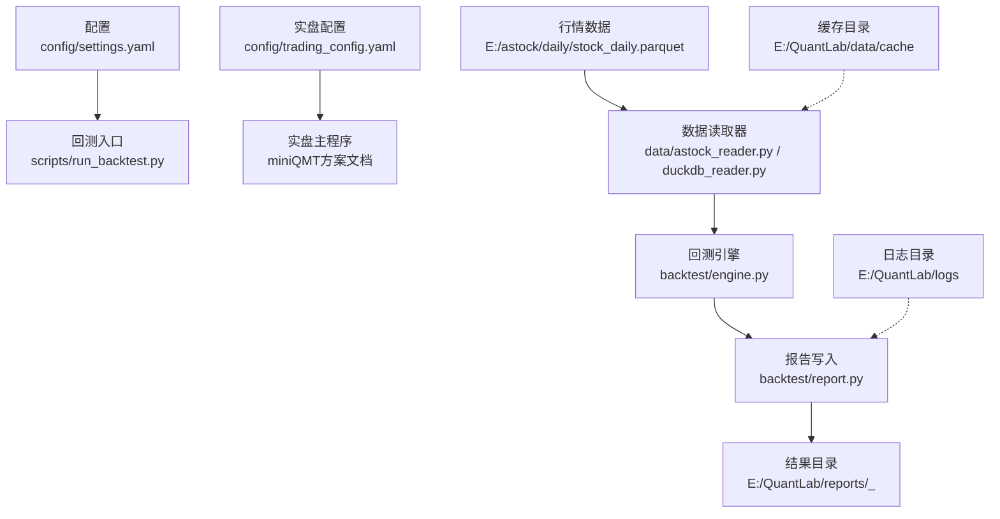
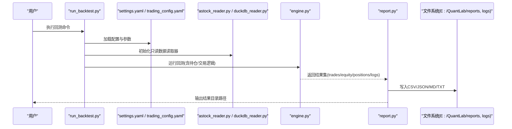
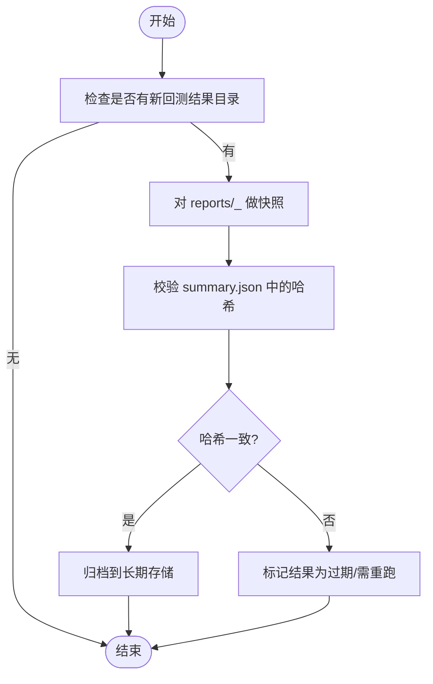
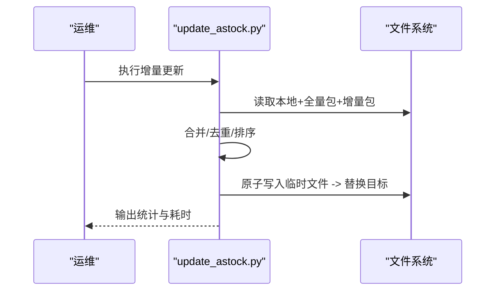
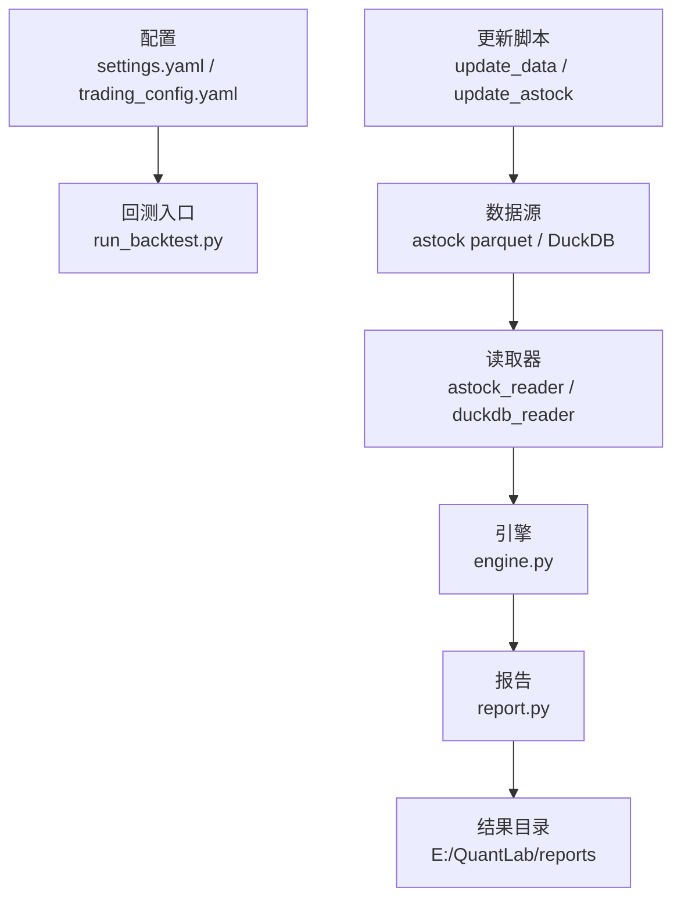

# 备份与恢复策略

<cite>
**本文引用的文件**   
- [main.py](file://main.py)
- [settings.yaml](file://config\settings.yaml)
- [trading_config.yaml](file://config\trading_config.yaml)
- [astock_reader.py](file://data\astock_reader.py)
- [duckdb_reader.py](file://data\duckdb_reader.py)
- [astock_finance_reader.py](file://data\astock_finance_reader.py)
- [run_backtest.py](file://scripts\run_backtest.py)
- [update_data.py](file://scripts\update_data.py)
- [update_astock.py](file://scripts\update_astock.py)
- [report.py](file://backtest\report.py)
- [hashing.py](file://backtest\hashing.py)
- [portfolio.py](file://backtest\portfolio.py)
- [engine.py](file://backtest\engine.py)
- [.gitignore](file://.gitignore)
- [全局复利与踩坑日志.md](file://全局复利与踩坑日志.md)
- [miniQMT实盘对接_生产级完善方案.md](file://miniQMT实盘对接_生产级完善方案.md)
</cite>

## 目录
1. [引言](#引言)
2. [项目结构](#项目结构)
3. [核心组件](#核心组件)
4. [架构总览](#架构总览)
5. [详细组件分析](#详细组件分析)
6. [依赖关系分析](#依赖关系分析)
7. [性能考虑](#性能考虑)
8. [故障排查指南](#故障排查指南)
9. [结论](#结论)
10. [附录](#附录)

## 引言
本指南为 QuantLab 提供完整的备份与恢复策略，覆盖配置文件、持仓数据、交易记录、交易日志的备份方法，以及增量/全量备份最佳实践、灾难恢复流程、完整性校验与恢复测试。目标是确保在数据源更新、回测执行、实盘运行等关键场景下，所有关键资产可被安全、一致地备份与快速恢复。

## 项目结构
QuantLab 的关键数据与配置分布如下：
- 配置中心：config/settings.yaml（全局）、config/trading_config.yaml（实盘）
- 行情与财务数据：E:/astock/daily/stock_daily.parquet、E:/astock/finance/*（由 data 模块读取）
- 回测产物：E:/QuantLab/reports/<run_id>_<config>/（包含 trades.csv、equity_curve.csv、positions.csv、logs.txt、report.md、summary.json）
- 日志：E:/QuantLab/logs（由 settings.yaml 控制）
- 缓存：E:/QuantLab/data/cache（忽略版本控制）
- 数据更新脚本：scripts/update_data.py、scripts/update_astock.py

图表来源 
- [settings.yaml:1-69](file://config\settings.yaml#L1-L69)
- [trading_config.yaml:1-62](file://config\trading_config.yaml#L1-L62)
- [astock_reader.py:1-192](file://data\astock_reader.py#L1-L192)
- [duckdb_reader.py:1-215](file://data\duckdb_reader.py#L1-L215)
- [run_backtest.py:1-132](file://scripts\run_backtest.py#L1-L132)
- [report.py:1-264](file://backtest\report.py#L1-L264)

章节来源
- [settings.yaml:1-69](file://config\settings.yaml#L1-L69)
- [trading_config.yaml:1-62](file://config\trading_config.yaml#L1-L62)
- [run_backtest.py:1-132](file://scripts\run_backtest.py#L1-L132)
- [report.py:1-264](file://backtest\report.py#L1-L264)

## 核心组件
- 配置管理
  - 全局配置：settings.yaml 定义数据路径、日志目录、回测参数、因子与策略默认值等
  - 实盘配置：trading_config.yaml 定义账户、风控、订单、调度、数据源与策略参数
- 数据读取
  - astock_reader.py：只读 Parquet 读取，支持调整因子 raw/qfq/hfq，输出统一列
  - duckdb_reader.py：DuckDB 只读读取，支持两种 schema，WAL 检测
  - astock_finance_reader.py：PIT 安全的财务指标读取
- 回测与报告
  - run_backtest.py：CLI 入口，加载配置、构建 reader、执行回测、生成报告
  - report.py：固定格式输出 trades/equity/positions/logs/report/summary
  - hashing.py：计算配置/数据/股票池哈希，用于一致性校验
- 数据更新
  - update_data.py：一键更新 astock parquet 并重新生成 CSV
  - update_astock.py：原子写入、并行处理、增量合并

章节来源
- [settings.yaml:1-69](file://config\settings.yaml#L1-L69)
- [trading_config.yaml:1-62](file://config\trading_config.yaml#L1-L62)
- [astock_reader.py:1-192](file://data\astock_reader.py#L1-L192)
- [duckdb_reader.py:1-215](file://data\duckdb_reader.py#L1-L215)
- [astock_finance_reader.py:1-40](file://data\astock_finance_reader.py#L1-L40)
- [run_backtest.py:1-132](file://scripts\run_backtest.py#L1-L132)
- [report.py:1-264](file://backtest\report.py#L1-L264)
- [hashing.py:1-23](file://backtest\hashing.py#L1-L23)
- [update_data.py:1-135](file://scripts\update_data.py#L1-L135)
- [update_astock.py:38-178](file://scripts\update_astock.py#L38-L178)

## 架构总览
下图展示从配置到数据读取、回测执行、报告落盘的完整链路，以及日志与缓存的位置。

图表来源 
- [run_backtest.py:1-132](file://scripts\run_backtest.py#L1-L132)
- [astock_reader.py:1-192](file://data\astock_reader.py#L1-L192)
- [duckdb_reader.py:1-215](file://data\duckdb_reader.py#L1-L215)
- [engine.py:328-353](file://backtest\engine.py#L328-L353)
- [report.py:1-264](file://backtest\report.py#L1-L264)

## 详细组件分析

### 配置文件备份策略
- 备份范围
  - 全局配置：config/settings.yaml
  - 实盘配置：config/trading_config.yaml
  - 策略相关 YAML（如 projects/*/config/*.yaml）
- 备份频率与自动化
  - 每日定时任务（cron/systemd timer）在收盘后或凌晨执行
  - 变更触发备份（Git hook 或文件监控）
- 存储与加密
  - 本地归档至独立磁盘/NAS，保留多版本（至少最近30天）
  - 使用系统级加密（如 Windows BitLocker、Linux LUKS）或对象存储服务端加密
- 验证与恢复演练
  - 每次备份后校验文件完整性（SHA256）
  - 定期恢复演练，确认配置可被正确加载

章节来源
- [settings.yaml:1-69](file://config\settings.yaml#L1-L69)
- [trading_config.yaml:1-62](file://config\trading_config.yaml#L1-L62)

### 持仓数据与交易记录备份
- 数据来源与格式
  - 回测交易记录：reports/<run_id>_<config>/trades.csv（固定列顺序）
  - 权益曲线：equity_curve.csv
  - 期末持仓快照：positions.csv
  - 摘要元信息：summary.json（含 config_hash、data_hash、universe_hash）
- 备份策略
  - 全量备份：每次回测完成后对 reports 目录进行快照
  - 增量备份：仅备份新增/变更的 run_id 子目录
  - 持久化：异地副本（云存储/磁带库），保留周期按合规要求设定
- 一致性保障
  - 利用 hashing.py 生成的 config_hash/data_hash/universe_hash 校验一致性
  - 若 data_hash 变化，需重新回测或标记旧结果为过期

章节来源
- [report.py:1-264](file://backtest\report.py#L1-L264)
- [hashing.py:1-23](file://backtest\hashing.py#L1-L23)

### 交易日志归档与管理
- 日志位置与编码
  - 回测日志：reports/<run_id>_<config>/logs.txt（WARN/ERROR 块固定格式）
  - 应用日志：E:/QuantLab/logs（由 settings.yaml 控制）
  - QMT 策略日志：局域网机器路径（见踩坑日志说明），注意编码 UTF-8
- 归档策略
  - 按日期滚动压缩（zip/tar.gz），保留历史（如 90 天）
  - 将 logs.txt 与 report.md、summary.json 一并归档，便于审计
- 清理规则
  - 超过保留期的日志自动清理
  - 大文件（如 parquet）不在 Git 中，避免仓库膨胀

章节来源
- [report.py:111-122](file://backtest\report.py#L111-L122)
- [settings.yaml:31-35](file://config\settings.yaml#L31-L35)
- [全局复利与踩坑日志.md:147-168](file://全局复利与踩坑日志.md#L147-L168)

### 数据源备份与增量更新
- 数据源
  - astock daily：E:/astock/daily/stock_daily.parquet（只读）
  - DuckDB 数据：可选，read_only 模式
  - 财务数据：E:/astock/finance/*（PIT 安全）
- 增量更新
  - scripts/update_data.py：增量合并 parquet，重新生成 CSV
  - scripts/update_astock.py：原子写入、并行处理、去重合并
- 备份建议
  - 每日增量更新前对原 parquet 做快照
  - 更新成功后校验行数与时间范围，再替换原文件

图表来源 
- [update_astock.py:38-178](file://scripts\update_astock.py#L38-L178)
- [update_data.py:1-135](file://scripts\update_data.py#L1-L135)

### 灾难恢复流程
- 恢复步骤
  1) 恢复配置（settings.yaml、trading_config.yaml）
  2) 恢复数据（parquet/DuckDB/CSV）
  3) 恢复回测产物（reports 目录）
  4) 恢复日志（logs 与各 run 的 logs.txt）
  5) 重启服务（先数据服务，再回测/实盘）
- 完整性验证
  - 校验 summary.json 中的 config_hash/data_hash/universe_hash
  - 抽样核对 trades.csv 与 positions.csv 的一致性
  - 运行最小化回测用例验证 pipeline
- 服务重启顺序
  - 数据源就绪 → 回测引擎 → 实盘 Broker/策略

章节来源
- [report.py:236-243](file://backtest\report.py#L236-L243)
- [miniQMT实盘对接_生产级完善方案.md:1131-1344](file://miniQMT实盘对接_生产级完善方案.md#L1131-L1344)

### 增量备份与全量备份最佳实践
- 全量备份
  - 每周一次全量快照（配置、数据、回测产物、日志）
  - 全量备份后进行完整性校验与恢复演练
- 增量备份
  - 每日增量（仅变更文件/目录）
  - 增量更新数据前先快照原文件
- 一致性保证
  - 使用原子写入（update_astock.py 已实现）
  - 通过哈希校验确保数据未损坏
- 保留策略
  - 近热（7天）、温（30天）、冷（90天+）分层存储

章节来源
- [update_astock.py:42-50](file://scripts\update_astock.py#L42-L50)
- [hashing.py:10-23](file://backtest\hashing.py#L10-L23)

### 备份验证与恢复测试操作指南
- 备份验证
  - 校验和：对备份文件计算 SHA256 并保存清单
  - 元数据校验：比对 summary.json 中的哈希与当前数据
- 恢复测试
  - 选择最近一次备份，恢复到隔离环境
  - 执行最小化回测（短区间、小样本）验证 pipeline
  - 核对关键指标（total_return、max_drawdown、n_trades）与预期一致

章节来源
- [report.py:236-243](file://backtest\report.py#L236-L243)
- [run_backtest.py:96-121](file://scripts\run_backtest.py#L96-L121)

## 依赖关系分析
QuantLab 的备份与恢复涉及以下关键依赖：
- 配置依赖：settings.yaml、trading_config.yaml
- 数据依赖：astock parquet、DuckDB（可选）、财务数据
- 执行依赖：run_backtest.py、engine.py、report.py
- 工具依赖：update_data.py、update_astock.py

图表来源 
- [settings.yaml:1-69](file://config\settings.yaml#L1-L69)
- [trading_config.yaml:1-62](file://config\trading_config.yaml#L1-L62)
- [astock_reader.py:1-192](file://data\astock_reader.py#L1-L192)
- [duckdb_reader.py:1-215](file://data\duckdb_reader.py#L1-L215)
- [run_backtest.py:1-132](file://scripts\run_backtest.py#L1-L132)
- [report.py:1-264](file://backtest\report.py#L1-L264)
- [update_data.py:1-135](file://scripts\update_data.py#L1-L135)
- [update_astock.py:38-178](file://scripts\update_astock.py#L38-L178)

## 性能考虑
- 只读访问：数据读取器均为 read_only，避免并发写冲突
- 内存优化：astock_reader 仅读取必要列，降低内存占用
- 原子写入：update_astock.py 使用临时文件 + os.replace，确保一致性
- WAL 检测：duckdb_reader 检测 .wal 并给出警告，避免同步中数据不一致

[本节为通用指导，不直接分析具体文件]

## 故障排查指南
- 常见问题
  - 数据源不可用：检查 astock parquet 路径与权限
  - WAL 同步中：等待同步完成后再回测
  - 编码问题：QMT 日志编码 UTF-8，避免 GBK 解码导致乱码
- 定位方法
  - 查看 logs.txt 的 WARN/ERROR 块
  - 校验 summary.json 中的哈希是否匹配
  - 使用 update_astock.py 的 dry 模式验证更新流程

章节来源
- [duckdb_reader.py:63-75](file://data\duckdb_reader.py#L63-L75)
- [全局复利与踩坑日志.md:147-168](file://全局复利与踩坑日志.md#L147-L168)
- [report.py:78-108](file://backtest\report.py#L78-L108)

## 结论
通过统一的配置管理、只读数据访问、原子写入与哈希校验，QuantLab 的备份与恢复策略能够确保数据一致性与完整性。结合全量/增量备份、日志归档与恢复演练，可在灾难发生时快速恢复服务并验证结果可靠性。

[本节为总结性内容，不直接分析具体文件]

## 附录
- 备份清单建议
  - 配置：config/*.yaml
  - 数据：E:/astock/*（parquet/finance）
  - 产物：E:/QuantLab/reports/*
  - 日志：E:/QuantLab/logs/* 与 reports/*/logs.txt
- 自动化建议
  - 使用 cron/systemd timer 定时执行备份脚本
  - 结合 Git 钩子触发配置变更备份
- 安全建议
  - 启用磁盘/对象存储加密
  - 限制备份目录访问权限

[本节为补充信息，不直接分析具体文件]