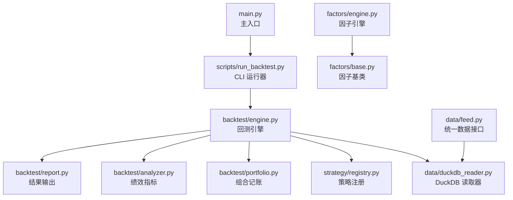
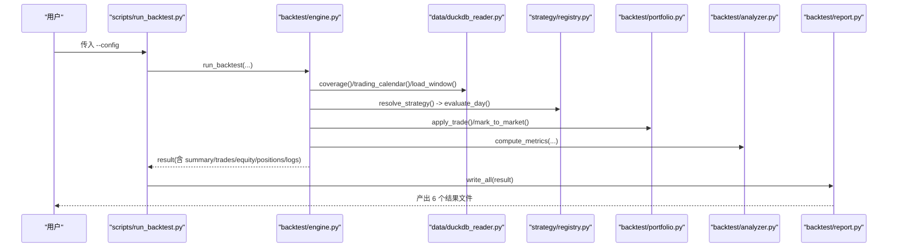
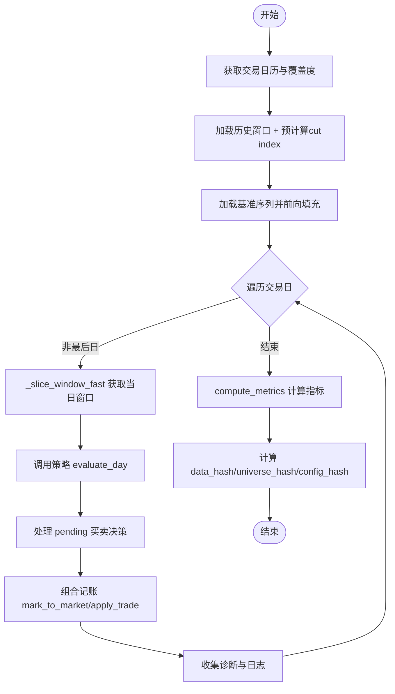
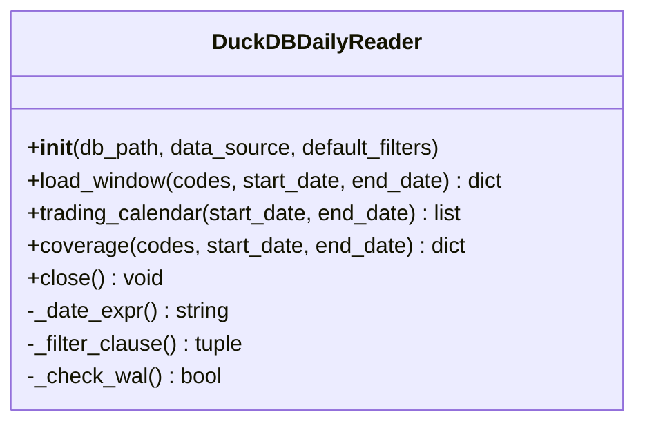
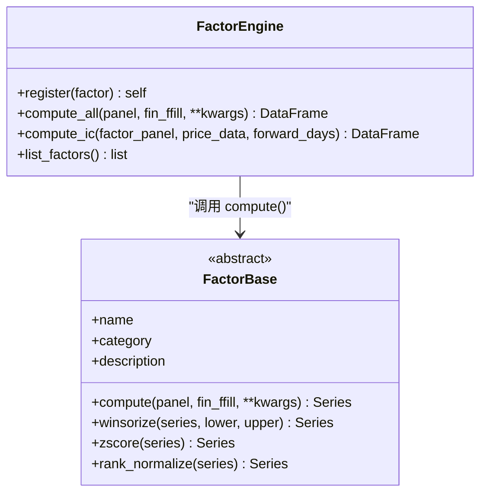
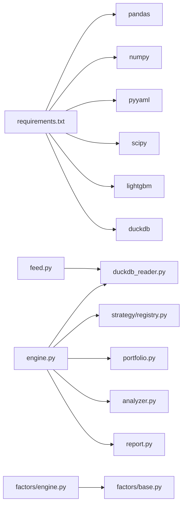
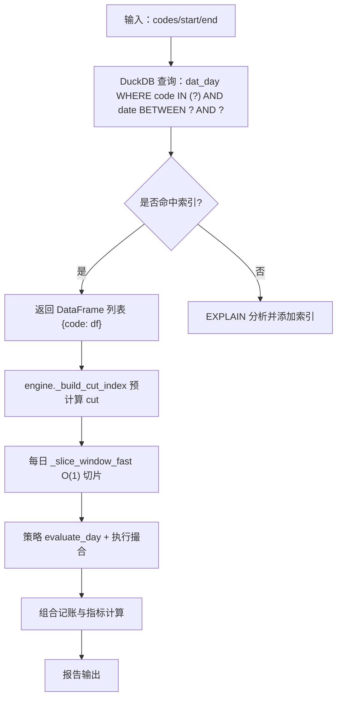

# 性能优化与扩容

<cite>
**本文引用的文件**   
- [main.py](file://main.py)
- [backtest/engine.py](file://backtest/engine.py)
- [data/duckdb_reader.py](file://data/duckdb_reader.py)
- [data/feed.py](file://data/feed.py)
- [factors/engine.py](file://factors/engine.py)
- [factors/base.py](file://factors/base.py)
- [strategy/registry.py](file://strategy/registry.py)
- [scripts/run_backtest.py](file://scripts/run_backtest.py)
- [config/settings.yaml](file://config/settings.yaml)
- [backtest/analyzer.py](file://backtest/analyzer.py)
- [backtest/report.py](file://backtest/report.py)
- [requirements.txt](file://requirements.txt)
</cite>

## 目录
1. [引言](#引言)
2. [项目结构](#项目结构)
3. [核心组件](#核心组件)
4. [架构总览](#架构总览)
5. [详细组件分析](#详细组件分析)
6. [依赖关系分析](#依赖关系分析)
7. [性能考虑](#性能考虑)
8. [故障排查指南](#故障排查指南)
9. [结论](#结论)
10. [附录](#附录)

## 引言
本指南面向 QuantLab 的性能优化与系统扩容，覆盖回测引擎、数据处理（DuckDB）、因子计算、以及生产环境监控与基准测试。目标是在不改变现有接口契约的前提下，通过并行化、内存管理、缓存策略、查询优化、索引设计、向量化与分布式/GPU 加速等手段提升吞吐与降低延迟；同时给出水平/垂直扩展与负载均衡的架构方案，并提供压力/负载测试与容量规划方法。

## 项目结构
QuantLab 采用“扁平策略注册 + 模块化数据/回测/报告”的结构：
- 入口与配置：main.py、scripts/run_backtest.py、config/settings.yaml
- 回测引擎：backtest/engine.py、portfolio.py、analyzer.py、report.py
- 数据层：data/duckdb_reader.py、data/feed.py、data/benchmark_reader.py
- 因子层：factors/engine.py、factors/base.py
- 策略注册：strategy/registry.py
- 依赖：requirements.txt

**图示来源** 
- [main.py:1-104](file://main.py#L1-L104)
- [scripts/run_backtest.py:1-132](file://scripts/run_backtest.py#L1-L132)
- [backtest/engine.py:1-619](file://backtest/engine.py#L1-L619)
- [data/duckdb_reader.py:1-215](file://data/duckdb_reader.py#L1-L215)
- [data/feed.py:1-197](file://data/feed.py#L1-L197)
- [factors/engine.py:1-86](file://factors/engine.py#L1-L86)
- [factors/base.py:1-52](file://factors/base.py#L1-L52)
- [strategy/registry.py:1-115](file://strategy/registry.py#L1-L115)
- [backtest/analyzer.py:1-176](file://backtest/analyzer.py#L1-L176)
- [backtest/report.py:1-264](file://backtest/report.py#L1-L264)

**章节来源**
- [main.py:1-104](file://main.py#L1-L104)
- [scripts/run_backtest.py:1-132](file://scripts/run_backtest.py#L1-L132)
- [config/settings.yaml:1-69](file://config/settings.yaml#L1-L69)

## 核心组件
- 回测引擎：按交易日推进，窗口切片、执行撮合、组合记账、指标计算与报告生成。
- 数据读取：DuckDB 只读 reader，支持两种 schema，提供交易日历、覆盖度统计、窗口加载。
- 因子引擎：注册/计算面板因子，IC 测试流程。
- 策略注册：自动发现 strategy 模块并注册 evaluate_day。
- 报告与指标：固定列契约，生成 summary.json、trades.csv、equity_curve.csv、positions.csv、logs.txt、report.md。

**章节来源**
- [backtest/engine.py:1-619](file://backtest/engine.py#L1-L619)
- [data/duckdb_reader.py:1-215](file://data/duckdb_reader.py#L1-L215)
- [factors/engine.py:1-86](file://factors/engine.py#L1-L86)
- [strategy/registry.py:1-115](file://strategy/registry.py#L1-L115)
- [backtest/analyzer.py:1-176](file://backtest/analyzer.py#L1-L176)
- [backtest/report.py:1-264](file://backtest/report.py#L1-L264)

## 架构总览
下图展示一次回测从 CLI 到数据读取、策略评估、执行撮合、组合记账、指标计算与报告输出的完整调用链。

**图示来源** 
- [scripts/run_backtest.py:1-132](file://scripts/run_backtest.py#L1-L132)
- [backtest/engine.py:1-619](file://backtest/engine.py#L1-L619)
- [data/duckdb_reader.py:1-215](file://data/duckdb_reader.py#L1-L215)
- [strategy/registry.py:1-115](file://strategy/registry.py#L1-L115)
- [backtest/analyzer.py:1-176](file://backtest/analyzer.py#L1-L176)
- [backtest/report.py:1-264](file://backtest/report.py#L1-L264)

## 详细组件分析

### 回测引擎（backtest/engine.py）
- 关键路径
  - 交易日历与覆盖度：reader.trading_calendar / reader.coverage
  - 历史窗口加载：reader.load_window，配合 _build_cut_index/_slice_window_fast 实现 O(1) 每日切片
  - 基准序列：_load_benchmark_series 前向填充缺失日
  - 策略解析：resolve_strategy 校验 trading_model
  - 逐日循环：pending 订单处理、组合记账、基准收益回填、诊断聚合
  - 指标计算：compute_metrics
  - 数据哈希：compute_data_hash 用于可复现性
- 性能要点
  - 使用 numpy searchsorted 预计算 cut index，避免每日重复过滤
  - 基准序列一次性构建字典映射，O(n) 遍历填充
  - 日志与诊断聚合在循环外批量处理
- 可扩展点
  - 将 _evaluate_day 替换为多进程/多线程封装（注意 GIL 与共享状态）
  - 对 window 切片进行内存池复用，减少 DataFrame 拷贝
  - 基准读取改为流式或分区读取，避免大表全量加载

**图示来源** 
- [backtest/engine.py:110-147](file://backtest/engine.py#L110-L147)
- [backtest/engine.py:237-619](file://backtest/engine.py#L237-L619)

**章节来源**
- [backtest/engine.py:1-619](file://backtest/engine.py#L1-L619)

### 数据读取（data/duckdb_reader.py）
- 能力
  - 只读连接 DuckDB，支持 jince_zhisuan 与 qmt_self_owned 两套 schema
  - load_window 返回 {code: DataFrame} 视图，便于引擎快速切片
  - trading_calendar 与 coverage 提供日期与覆盖度统计
  - WAL 检测与警告，防止同步中数据不一致
- 优化建议
  - 在 dat_day 上建立 (code, trade_date) 复合索引（若未由上游保证）
  - 对常用 filter 字段（adjustment/source）建索引
  - 使用 EXPLAIN ANALYZE 验证 SQL 计划，确保 IN 列表与 BETWEEN 走索引
  - 控制参数绑定数量，避免超长 IN (...) 导致计划退化

**图示来源** 
- [data/duckdb_reader.py:35-215](file://data/duckdb_reader.py#L35-L215)

**章节来源**
- [data/duckdb_reader.py:1-215](file://data/duckdb_reader.py#L1-L215)

### 统一数据接口（data/feed.py）
- 作用
  - 抽象 astock parquet 与 duckdb 两种数据源
  - get_universe 基于成交额排序选取股票池
  - get_panel 兼容旧接口，构造面板与财务 ffill
- 优化建议
  - 引入 LRU 缓存（按 codes+日期范围 key），避免重复 IO
  - 对 parquet 使用列裁剪与谓词下推（pyarrow/pandas 读取时指定 columns）
  - 将 get_daily 返回 MultiIndex 改为按需转换，减少中间对象

**章节来源**
- [data/feed.py:1-197](file://data/feed.py#L1-L197)

### 因子引擎（factors/engine.py）与基类（factors/base.py）
- 能力
  - register/compute_all：注册因子并批量计算面板
  - compute_ic：截面 IC/ICIR 统计
  - base：提供 winsorize/zscore/rank_normalize 等预处理
- 优化建议
  - 将 compute_all 改为并行（按因子分片），结合 pandas 向量化
  - IC 计算使用 groupby('date') 的向量化 corr，避免 Python 级循环
  - 对 panel 做内存布局优化（C-contiguous），减少跨步访问

**图示来源** 
- [factors/engine.py:1-86](file://factors/engine.py#L1-L86)
- [factors/base.py:1-52](file://factors/base.py#L1-L52)

**章节来源**
- [factors/engine.py:1-86](file://factors/engine.py#L1-L86)
- [factors/base.py:1-52](file://factors/base.py#L1-L52)

### 策略注册（strategy/registry.py）
- 机制
  - @register_strategy 装饰器注册 evaluate_day
  - autodiscover 扫描 strategy 包，跳过无关模块
- 优化建议
  - 懒加载策略模块，仅在首次使用时 import
  - 对 evaluate_day 增加计时钩子，便于定位慢策略

**章节来源**
- [strategy/registry.py:1-115](file://strategy/registry.py#L1-L115)

### 指标与报告（backtest/analyzer.py、backtest/report.py）
- analyzer
  - 纯数学函数计算年化、最大回撤、夏普、胜率、平均持仓天数、超额/信息比率/跟踪误差
- report
  - 固定列契约写入 trades/equity/positions CSV、summary.json、logs.txt、report.md
- 优化建议
  - 指标计算尽量使用 numpy 向量化，避免 Python 循环
  - 报告写入采用缓冲写与异步落盘（可选）

**章节来源**
- [backtest/analyzer.py:1-176](file://backtest/analyzer.py#L1-L176)
- [backtest/report.py:1-264](file://backtest/report.py#L1-L264)

## 依赖关系分析
- 外部库
  - pandas/numpy/pyyaml/scipy/lightgbm（可选）
  - duckdb（数据层）
- 内部依赖
  - engine 依赖 reader、strategy registry、portfolio、analyzer、report
  - feed 抽象底层 reader
  - factors 独立于 engine，但可与 engine 的 aux_data 集成

**图示来源** 
- [requirements.txt:1-29](file://requirements.txt#L1-L29)
- [backtest/engine.py:1-619](file://backtest/engine.py#L1-L619)
- [data/duckdb_reader.py:1-215](file://data/duckdb_reader.py#L1-L215)
- [strategy/registry.py:1-115](file://strategy/registry.py#L1-L115)
- [backtest/analyzer.py:1-176](file://backtest/analyzer.py#L1-L176)
- [backtest/report.py:1-264](file://backtest/report.py#L1-L264)
- [data/feed.py:1-197](file://data/feed.py#L1-L197)
- [factors/engine.py:1-86](file://factors/engine.py#L1-L86)
- [factors/base.py:1-52](file://factors/base.py#L1-L52)

**章节来源**
- [requirements.txt:1-29](file://requirements.txt#L1-L29)

## 性能考虑

### 回测引擎并行化与内存管理
- 并行化
  - 因子计算：按因子分片并行 compute_all，合并结果
  - 多策略批跑：不同策略/参数组合并行，进程间隔离
  - 数据加载：按 code 分片并发读取（需避免 DuckDB 并发写冲突，保持只读）
- 内存管理
  - 使用 _slice_window_fast 的 iloc 视图，避免复制
  - 对 panel 使用 float32 降精度（必要时）
  - 及时释放中间 DataFrame，避免引用累积
- 调度
  - 使用 concurrent.futures.ProcessPoolExecutor 或 Ray/Dask 进行任务分发

### 数据处理与 DuckDB 优化
- 查询优化
  - 使用 EXPLAIN ANALYZE 检查计划，确保 (code, trade_date) 复合索引命中
  - 限制 IN 列表长度，分批查询
  - 仅选择必要列，减少网络与内存开销
- 数据预加载
  - 交易日历与覆盖度缓存（已在 reader 内缓存）
  - 基准序列按窗口预取，避免重复 IO
- 索引设计
  - 推荐索引：dat_day(code, trade_date)、dat_day(adjustment)、dat_day(source)
  - 对频繁过滤字段建立单列索引

### 因子计算加速
- 向量化
  - 使用 pandas/numpy 向量化替代 Python 循环
  - 对截面标准化/中性化使用 groupby 的 transform
- 分布式/GPU
  - 使用 Dask/Ray 将 panel 分块并行计算
  - 对数值密集型因子使用 cuDF/cuML（GPU）或 numba JIT

### 系统扩容策略
- 垂直扩展
  - 提升 CPU 核数与内存，优先影响因子计算与指标计算
  - 使用 SSD/NVMe 提升 DuckDB 读取吞吐
- 水平扩展
  - 无状态回测实例横向扩展，按策略/参数分片
  - 数据层：DuckDB 只读副本，多实例并发读取
- 负载均衡
  - 任务队列（如 Celery/RQ）分发回测任务
  - 结果存储集中化（S3/NAS），避免热点

### 基准测试与容量规划
- 压力/负载测试
  - 固定 universe 与时间窗口，逐步增大代码数/因子数/策略数
  - 记录端到端耗时、峰值内存、CPU/IO 利用率
- 容量规划
  - 以单次回测为基本单元，估算集群规模与队列长度
  - 设定 SLO：例如 1000 支股票 × 5 年 × 10 因子 ≤ X 分钟

### 生产环境调优与监控
- 调优
  - DuckDB 连接池与只读模式
  - 日志级别动态调整，关闭冗余打印
  - 结果落盘异步化
- 监控指标
  - 回测时长、吞吐（天×代码/秒）、内存峰值、GC 次数
  - DuckDB 查询延迟、缓存命中率、WAL 告警
  - 策略 evaluate_day 耗时分布、失败率

[本节为通用指导，不直接分析具体文件]

## 故障排查指南
- WAL 检测与数据同步
  - 当检测到 .wal 文件时，提示数据可能正在同步，data_hash 不稳定，应等待同步完成后重跑
- 基准不可用
  - 基准文件不存在或窗口内无数据时，禁用 IR/excess，并在 logs.txt 中输出 WARN
- 短样本期
  - 交易日不足或基准不可用时，报告包含样本期警告，强调 MVP 用途
- 常见错误
  - 数据范围越界、空 universe、策略未注册、trading_model 不被允许

**章节来源**
- [data/duckdb_reader.py:63-75](file://data/duckdb_reader.py#L63-L75)
- [backtest/engine.py:445-489](file://backtest/engine.py#L445-L489)
- [backtest/report.py:78-108](file://backtest/report.py#L78-L108)

## 结论
通过上述并行化、内存优化、DuckDB 查询与索引优化、因子向量化与分布式/GPU 加速，以及水平/垂直扩展与负载均衡策略，QuantLab 可在大规模回测与因子研究中显著提升性能与稳定性。配合完善的基准测试与监控体系，可实现生产级的稳定交付与持续优化。

[本节为总结，不直接分析具体文件]

## 附录

### 关键流程图（算法视角）

**图示来源** 
- [data/duckdb_reader.py:90-132](file://data/duckdb_reader.py#L90-L132)
- [backtest/engine.py:121-147](file://backtest/engine.py#L121-L147)
- [backtest/engine.py:237-619](file://backtest/engine.py#L237-L619)