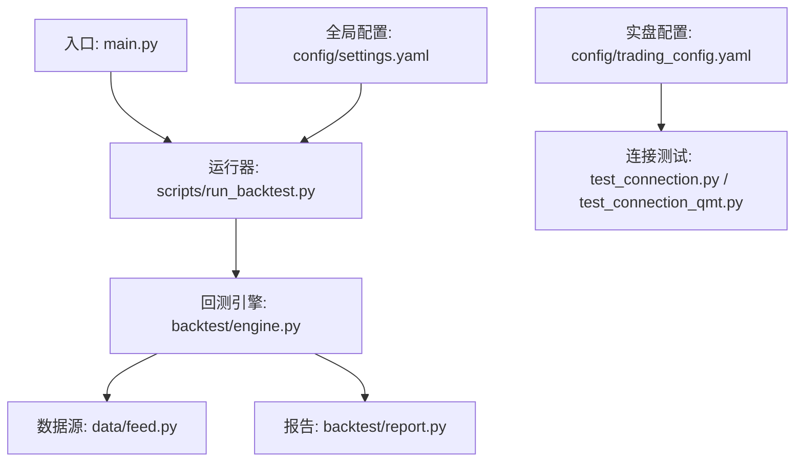
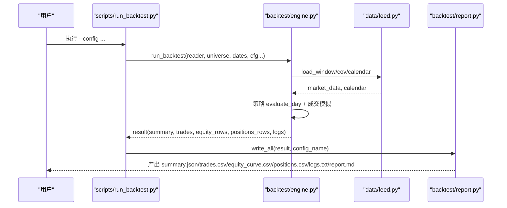
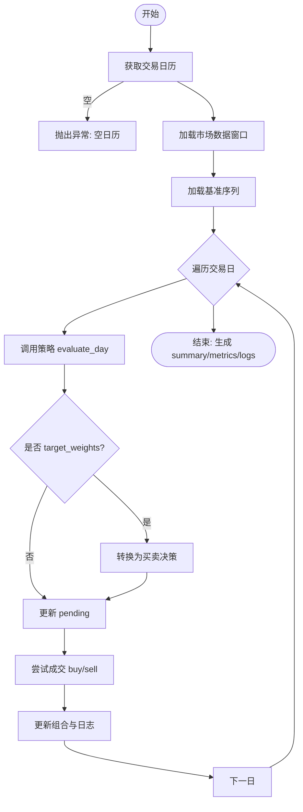
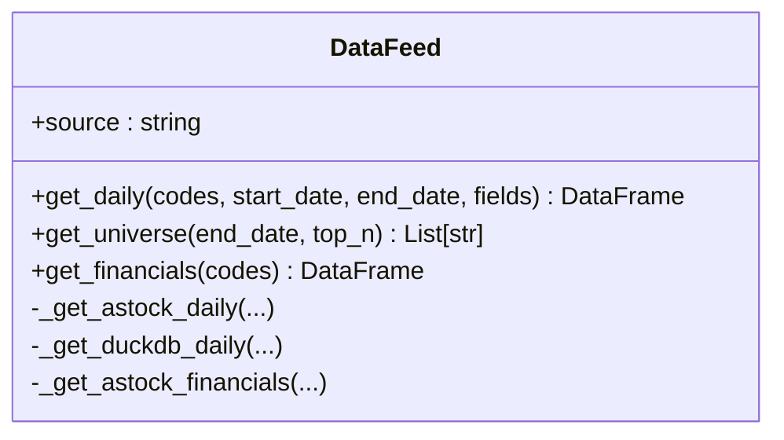
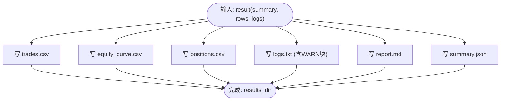
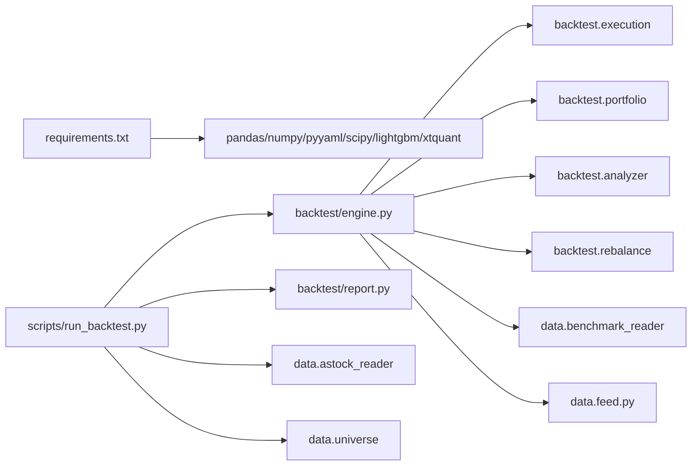

# 故障排查指南

<cite>
**本文引用的文件**
- [main.py](file://main.py)
- [requirements.txt](file://requirements.txt)
- [config/settings.yaml](file://config/settings.yaml)
- [config/trading_config.yaml](file://config/trading_config.yaml)
- [test_connection.py](file://test_connection.py)
- [test_connection_qmt.py](file://test_connection_qmt.py)
- [backtest/engine.py](file://backtest/engine.py)
- [backtest/report.py](file://backtest/report.py)
- [data/feed.py](file://data/feed.py)
- [scripts/run_backtest.py](file://scripts/run_backtest.py)
</cite>

## 目录
1. [简介](#简介)
2. [项目结构](#项目结构)
3. [核心组件](#核心组件)
4. [架构总览](#架构总览)
5. [详细组件分析](#详细组件分析)
6. [依赖关系分析](#依赖关系分析)
7. [性能注意事项](#性能注意事项)
8. [故障排查指南](#故障排查指南)
9. [结论](#结论)
10. [附录](#附录)

## 简介
本指南面向 QuantLab 的运维与研发人员，系统化梳理回测与实盘链路中的常见问题、日志分析方法、调试技巧、性能优化与应急流程。内容覆盖网络连接问题（QMT/miniQMT）、数据加载错误、策略执行异常、日志定位、堆栈跟踪、性能瓶颈定位与优化、健康检查脚本与清单、以及紧急情况处理预案。

## 项目结构
QuantLab 采用“回测引擎 + 数据源抽象 + 报告输出 + 配置中心”的分层设计：
- 入口与运行器：主入口 main.py 提供回测模式；scripts/run_backtest.py 提供命令行运行器
- 回测引擎：backtest/engine.py 负责日级循环、策略调用、成交模拟、组合记账与指标计算
- 数据层：data/feed.py 统一接口，支持 astock parquet 与 duckdb 两种数据源
- 报告层：backtest/report.py 将内存结果持久化为标准产物（summary.json、trades.csv、equity_curve.csv、positions.csv、logs.txt、report.md）
- 配置：config/settings.yaml 全局配置；config/trading_config.yaml 实盘账户与风控参数
- 连接测试：test_connection.py、test_connection_qmt.py 用于 QMT/miniQMT 连通性验证

**图表来源**
- [main.py:1-104](file://main.py#L1-L104)
- [scripts/run_backtest.py:1-132](file://scripts/run_backtest.py#L1-L132)
- [backtest/engine.py:1-619](file://backtest/engine.py#L1-L619)
- [data/feed.py:1-197](file://data/feed.py#L1-L197)
- [backtest/report.py:1-264](file://backtest/report.py#L1-L264)
- [config/settings.yaml:1-69](file://config/settings.yaml#L1-L69)
- [config/trading_config.yaml:1-62](file://config/trading_config.yaml#L1-L62)

**章节来源**
- [main.py:1-104](file://main.py#L1-L104)
- [scripts/run_backtest.py:1-132](file://scripts/run_backtest.py#L1-L132)
- [backtest/engine.py:1-619](file://backtest/engine.py#L1-L619)
- [data/feed.py:1-197](file://data/feed.py#L1-L197)
- [backtest/report.py:1-264](file://backtest/report.py#L1-L264)
- [config/settings.yaml:1-69](file://config/settings.yaml#L1-L69)
- [config/trading_config.yaml:1-62](file://config/trading_config.yaml#L1-L62)

## 核心组件
- 回测引擎（engine.py）
  - 交易日历与窗口切片：预构建 cut_index 实现 O(1) 每日切片
  - 基准序列加载：DuckDB 读取并前向填充缺失值
  - 策略解析与交易模型校验：扁平注册名与 ALLOWED_TRADING_MODELS 校验
  - 订单挂单与成交：pending 机制记录未成交委托，逐日尝试成交
  - 指标与诊断：聚合候选数量、警告、策略特定指标，生成 summary
- 数据源（feed.py）
  - 统一 DataFeed 接口，astock parquet 与 duckdb 双通道
  - 面板构建与财务数据透视，返回 MultiIndex DataFrame
- 报告（report.py）
  - 固定列序 CSV 写入、日志 WARN 块组装、Markdown 报告生成
  - 产物目录 per-run 隔离，便于回溯与对比
- 配置（settings.yaml, trading_config.yaml）
  - 回测参数、日志路径、因子预处理、策略默认池、实盘账户与风控

**章节来源**
- [backtest/engine.py:237-619](file://backtest/engine.py#L237-L619)
- [data/feed.py:17-135](file://data/feed.py#L17-L135)
- [backtest/report.py:44-122](file://backtest/report.py#L44-L122)
- [config/settings.yaml:1-69](file://config/settings.yaml#L1-L69)
- [config/trading_config.yaml:1-62](file://config/trading_config.yaml#L1-L62)

## 架构总览
下图展示从 CLI 到回测引擎、数据源、报告的完整调用链，以及日志与产物的落盘位置。

**图表来源**
- [scripts/run_backtest.py:42-127](file://scripts/run_backtest.py#L42-L127)
- [backtest/engine.py:237-619](file://backtest/engine.py#L237-L619)
- [data/feed.py:106-124](file://data/feed.py#L106-L124)
- [backtest/report.py:245-264](file://backtest/report.py#L245-L264)

## 详细组件分析

### 回测引擎（engine.py）关键流程与异常点
- 交易日历与窗口切片
  - _build_cut_index/_slice_window_fast 通过 searchsorted 预计算索引，避免每日全量过滤
  - 若日历为空会抛出 ValueError，需检查数据覆盖与日期范围
- 基准序列加载
  - 使用 BenchmarkIndexReader 加载 DuckDB 基准收盘价，缺失前向填充
  - 若基准不可用或存在断点，会在 summary 中禁用 IR/excess 并记录原因
- 策略解析
  - resolve_strategy 根据扁平注册名导入 strategy.<name>.py，校验 trading_model 是否在 ALLOWED_TRADING_MODELS
  - 不匹配将抛出 ValueError
- 订单挂单与成交
  - pending 保存当日买卖决策，次日尝试 fill_buy/fill_sell
  - 未成交会累积 unfilled_order_count，并在日志中记录 reason
- 指标与诊断聚合
  - 聚合 daily_warnings、candidate_total/passed、strategy_specific
  - compute_metrics 基于 equity_rows/trades/calendar 计算业绩指标

**图表来源**
- [backtest/engine.py:265-322](file://backtest/engine.py#L265-L322)
- [backtest/engine.py:324-443](file://backtest/engine.py#L324-L443)
- [backtest/engine.py:445-511](file://backtest/engine.py#L445-L511)

**章节来源**
- [backtest/engine.py:121-146](file://backtest/engine.py#L121-L146)
- [backtest/engine.py:38-99](file://backtest/engine.py#L38-L99)
- [backtest/engine.py:207-234](file://backtest/engine.py#L207-L234)
- [backtest/engine.py:324-443](file://backtest/engine.py#L324-L443)
- [backtest/engine.py:445-511](file://backtest/engine.py#L445-L511)

### 数据源（feed.py）与面板构建
- DataFeed.get_daily 支持 astock parquet 与 duckdb 两种后端
- get_universe 按成交额排序选取股票池
- get_panel 构建面板与财务透视，返回 (panel, fin_ffill)

**图表来源**
- [data/feed.py:17-135](file://data/feed.py#L17-L135)

**章节来源**
- [data/feed.py:17-135](file://data/feed.py#L17-L135)
- [data/feed.py:137-181](file://data/feed.py#L137-L181)

### 报告（report.py）与日志 WARN 块
- 固定列序 CSV 写入（trades/equity/positions）
- _build_warn_block 汇总样本期、基准、去重、行业热度、WAL 等关键警告
- write_logs_txt 将 WARN 块与每日日志写入 logs.txt
- write_report_md 生成可读报告，包含业绩、持仓、关键日志摘录与复现命令

**图表来源**
- [backtest/report.py:44-122](file://backtest/report.py#L44-L122)
- [backtest/report.py:245-264](file://backtest/report.py#L245-L264)

**章节来源**
- [backtest/report.py:78-108](file://backtest/report.py#L78-L108)
- [backtest/report.py:111-122](file://backtest/report.py#L111-L122)
- [backtest/report.py:138-233](file://backtest/report.py#L138-L233)

## 依赖关系分析
- 外部依赖：pandas、numpy、pyyaml、scipy、lightgbm（可选）、xtquant（QMT 实盘）
- 模块耦合：
  - scripts/run_backtest.py 依赖 engine、report、astock_reader、universe
  - engine 依赖 execution/portfolio/analyzer/rebalance、benchmark_reader
  - feed 依赖 astock parquet 或 duckdb reader
- 潜在环依赖：无直接环依赖；注意动态 import 策略模块时的命名约定

**图表来源**
- [requirements.txt:1-29](file://requirements.txt#L1-L29)
- [scripts/run_backtest.py:26-31](file://scripts/run_backtest.py#L26-L31)
- [backtest/engine.py:20-26](file://backtest/engine.py#L20-L26)
- [data/feed.py:106-124](file://data/feed.py#L106-L124)

**章节来源**
- [requirements.txt:1-29](file://requirements.txt#L1-L29)
- [scripts/run_backtest.py:26-31](file://scripts/run_backtest.py#L26-L31)
- [backtest/engine.py:20-26](file://backtest/engine.py#L20-L26)

## 性能注意事项
- 数据切片优化：engine.py 使用 searchsorted 预计算 cut_index，每日切片为 O(1)，避免重复过滤
- 基准序列前向填充：减少缺失导致的指标计算中断
- 并发与 WAL：当检测到 .wal 时，说明数据源可能正在同步，应避免并发读写导致不一致
- I/O 优化：CSV/JSON 写入采用 UTF-8 编码与固定列序，减少解析开销
- 内存占用：面板数据较大时建议分批加载或使用 duckdb 查询裁剪字段

[本节为通用指导，不直接分析具体文件]

## 故障排查指南

### 一、网络连接问题（QMT/miniQMT）
常见症状
- xtquant 导入失败或版本不匹配
- QMT 路径不正确或未启动
- 账号未登录或会话 ID 错误
- 连接成功但无法订阅账户或查询资产

诊断步骤
- 环境检查
  - 确认 Python 环境与 xtquant 库可用（test_connection_qmt.py 会打印 Python 版本与路径）
  - 确认 QMT 安装路径与 userdata_mini 目录存在
- 配置文件核对
  - 检查 config/trading_config.yaml 中 account.path、session_id、account.id
- 连接测试
  - 运行 test_connection.py（miniQMT）或 test_connection_qmt.py（QMT 内置 Python）
  - 观察连接结果码与账户查询响应

快速修复
- 若 xtquant 未安装：从 QMT 安装目录复制至 Python site-packages，或使用 QMT 内置 Python
- 若路径错误：修正 account.path 指向实际 userdata_mini 目录
- 若连接失败：确保 miniQMT/QMT 已启动且账号已登录

**章节来源**
- [test_connection.py:1-117](file://test_connection.py#L1-L117)
- [test_connection_qmt.py:1-117](file://test_connection_qmt.py#L1-L117)
- [config/trading_config.yaml:1-62](file://config/trading_config.yaml#L1-L62)

### 二、数据加载错误
常见症状
- astock parquet 文件不存在或路径错误
- DuckDB 基准数据库缺失或路径错误
- 交易日历为空导致回测中止
- 基准收盘价缺失或起点为 0

诊断步骤
- 路径与权限
  - 检查 settings.yaml 中 data.astock.* 路径是否存在
  - 检查 benchmark_db_path 是否指向有效的 DuckDB 文件
- 数据覆盖与去重
  - 查看 summary.data_coverage_actual 与 data_dedup_applied/dedup_count
  - 关注 data_wal_detected 与 wal_warning_message
- 基准可用性
  - 若 benchmark_available=False，查看 benchmark_note 原因

快速修复
- 补齐 astock 日线与财务数据，确保 parquet 可读取
- 重建或更新 benchmark_index.duckdb，确保时间窗口覆盖
- 避免在数据同步期间并发读取（检测 .wal 时暂停任务）

**章节来源**
- [data/feed.py:71-104](file://data/feed.py#L71-L104)
- [backtest/engine.py:38-99](file://backtest/engine.py#L38-L99)
- [backtest/engine.py:558-578](file://backtest/engine.py#L558-L578)
- [backtest/report.py:78-108](file://backtest/report.py#L78-L108)

### 三、策略执行异常
常见症状
- 策略模块导入失败或注册名不匹配
- trading_model 不在 ALLOWED_TRADING_MODELS
- target_weights 转换失败导致决策为空
- 未成交订单累积（unfilled_order_count > 0）

诊断步骤
- 策略注册与模型校验
  - 确认 strategy_name 对应 strategy/<name>.py 存在
  - 检查 ALLOWED_TRADING_MODELS 是否包含当前 trading_model
- 决策转换与日志
  - 查看 decision.logs 与 diagnostics.warnings
  - 关注 candidate_total/passed 变化趋势
- 成交失败原因
  - 检查 unfilled_order_count 与日志中的 reason（如 position_gone、资金不足等）

快速修复
- 修正策略文件名与注册名，确保模块可导入
- 调整 trading_model 以匹配策略允许列表
- 检查执行参数（滑点、佣金、价格容差）与组合状态（现金、持仓）

**章节来源**
- [backtest/engine.py:207-234](file://backtest/engine.py#L207-L234)
- [backtest/engine.py:408-443](file://backtest/engine.py#L408-L443)
- [backtest/engine.py:324-371](file://backtest/engine.py#L324-L371)

### 四、日志分析方法
关键信息识别
- logs.txt 首行为固定顺序的 WARN 块，优先关注 SHORT_SAMPLE_PERIOD、BENCHMARK_DISABLED、DATA_DEDUP_APPLIED、SECTOR_HEAT_MODE_ZERO、DATA_WAL_DETECTED
- 每日日志以 [INFO]/[ERROR] 开头，重点关注 unfilled_order 与 reason
- report.md 中的“关键日志摘录”汇总最近 WARN/ERROR

堆栈跟踪分析
- 遇到异常时，捕获 traceback 并定位到具体函数（如 _load_benchmark_series、target_weights_to_decision）
- 结合 summary.data_coverage_actual 与 data_wal_detected 判断数据一致性

性能瓶颈定位
- 关注 runtime_seconds 与 n_days，评估数据加载与策略计算耗时
- 若 candidate_total/passed 异常低，检查选股逻辑与过滤条件

**章节来源**
- [backtest/report.py:78-108](file://backtest/report.py#L78-L108)
- [backtest/report.py:111-122](file://backtest/report.py#L111-L122)
- [backtest/report.py:138-233](file://backtest/report.py#L138-L233)
- [backtest/engine.py:490-511](file://backtest/engine.py#L490-L511)

### 五、调试工具与技巧
- 断点调试
  - 在 engine.py 的 _evaluate_day 与 fill_buy/fill_sell 处设置断点，观察 decision 与 trade
- 变量检查
  - 打印 pending、daily_logs、diagnostics_aggregate，确认未成交与警告来源
- 状态监控
  - 监控 portfolio_end 与 positions_rows，确认期末持仓与市值
- 最小化复现
  - 缩小 universe 与时间窗口，快速定位问题

**章节来源**
- [backtest/engine.py:324-443](file://backtest/engine.py#L324-L443)
- [backtest/engine.py:490-511](file://backtest/engine.py#L490-L511)

### 六、性能问题排查与优化
- 内存泄漏检测
  - 观察进程内存增长，避免在循环中创建大对象；利用 _slice_window_fast 视图而非拷贝
- CPU 使用率分析
  - 热点集中在策略 evaluate_day 与指标计算；必要时对因子计算进行向量化或并行
- I/O 性能优化
  - 使用 parquet/DuckDB 分区与列裁剪；避免重复读取同一文件
  - 控制 CSV/JSON 写入频率，批量落盘

[本节为通用指导，不直接分析具体文件]

### 七、系统健康检查自动化脚本与定期检查清单
健康检查要点
- 数据完整性：astock parquet 与 DuckDB 基准文件存在且可读
- 配置有效性：settings.yaml 与 trading_config.yaml 路径正确
- 连接可用性：QMT/miniQMT 连接成功并可查询资产与持仓
- 回测产物：summary.json、logs.txt、report.md 正常生成且 WARN 块无严重告警

定期检查清单
- 数据源路径与权限校验
- 基准数据库时间与覆盖度校验
- 策略注册名与交易模型校验
- 日志 WARN 块扫描（SHORT_SAMPLE_PERIOD、BENCHMARK_DISABLED、DATA_WAL_DETECTED）
- 回测运行时与指标合理性（runtime_seconds、total_return、max_drawdown）

[本节为通用指导，不直接分析具体文件]

### 八、紧急情况处理流程与应急预案
触发条件
- 实盘连接失败或账户不可用
- 数据同步中（.wal 检测）导致回测异常
- 大量未成交订单或策略崩溃

处置流程
- 立即停止任务，保留现场日志与快照
- 检查 QMT/miniQMT 状态与账号登录情况
- 暂停数据同步，等待 .wal 消失后重试
- 恢复最小可行回测（缩短窗口、缩小池），验证策略与执行链路
- 逐步恢复生产任务，持续监控日志与指标

[本节为通用指导，不直接分析具体文件]

## 结论
QuantLab 的故障排查应围绕“数据—策略—执行—报告”的主链路展开。通过标准化日志与固定列序产物，能够快速定位数据覆盖、基准可用性、策略注册与交易模型、订单成交与组合状态等关键问题。配合连接测试脚本与健康检查清单，可有效提升稳定性与可观测性。

[本节为总结性内容，不直接分析具体文件]

## 附录
- 常用命令
  - 回测运行：python -m scripts.run_backtest --config config/atr_lowvol_fw.yaml
  - 连接测试：python test_connection.py 或 QMT 内置 Python 运行 test_connection_qmt.py
- 产物目录
  - reports/<run_id>_<config>/ 下包含 summary.json、trades.csv、equity_curve.csv、positions.csv、logs.txt、report.md

[本节为补充信息，不直接分析具体文件]