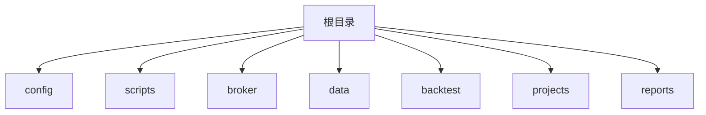
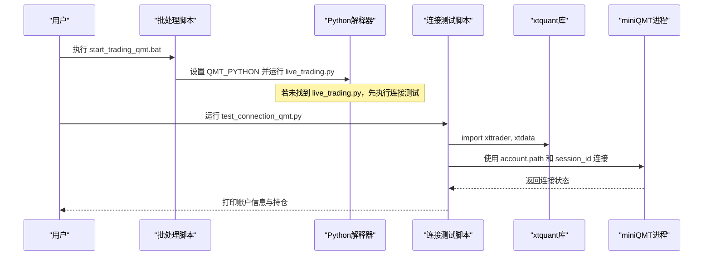
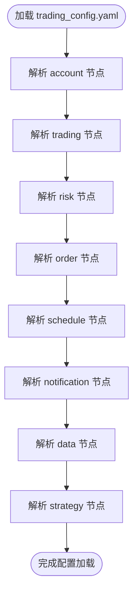
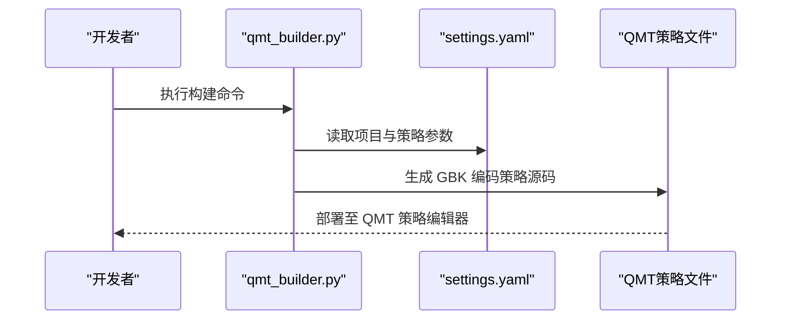
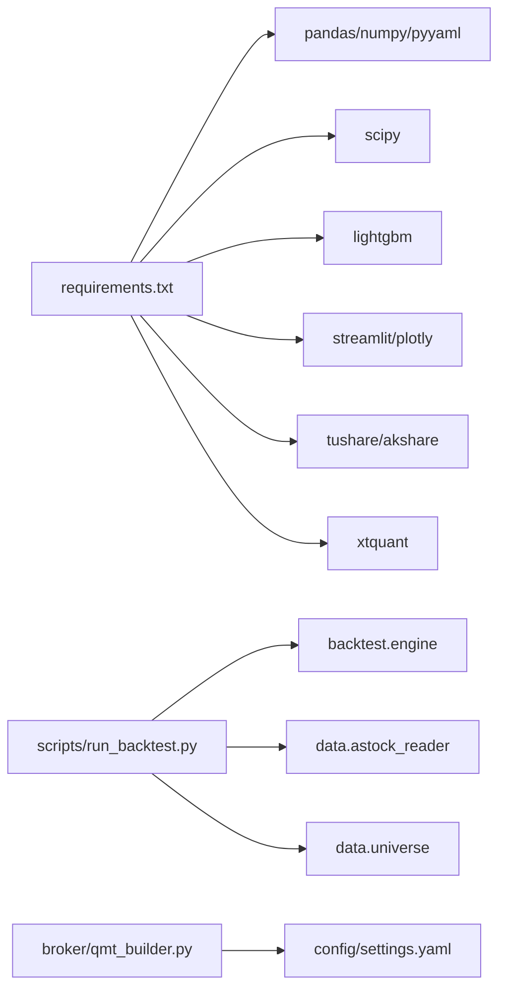

# 环境搭建与配置

<cite>
**本文引用的文件**   
- [config/trading_config.yaml](file://config/trading_config.yaml)
- [config/settings.yaml](file://config/settings.yaml)
- [requirements.txt](file://requirements.txt)
- [setup.py](file://setup.py)
- [start_trading.bat](file://start_trading.bat)
- [start_trading_qmt.bat](file://start_trading_qmt.bat)
- [test_connection.py](file://test_connection.py)
- [test_connection_qmt.py](file://test_connection_qmt.py)
- [scripts/run_backtest.py](file://scripts/run_backtest.py)
- [broker/qmt_builder.py](file://broker/qmt_builder.py)
- [broker/local_context.py](file://broker/local_context.py)
</cite>

## 目录
1. [简介](#简介)
2. [项目结构](#项目结构)
3. [核心组件](#核心组件)
4. [架构总览](#架构总览)
5. [详细组件分析](#详细组件分析)
6. [依赖关系分析](#依赖关系分析)
7. [性能注意事项](#性能注意事项)
8. [故障排查指南](#故障排查指南)
9. [结论](#结论)
10. [附录](#附录)

## 简介
本指南面向 QuantLab 量化交易框架的环境搭建与配置，覆盖系统要求、Python 版本、QMT 客户端安装、网络与环境变量配置、配置文件结构与参数说明（重点为 trading_config.yaml）、常见问题排查以及生产环境最佳实践。文档内容基于仓库中的脚本与配置文件进行梳理，确保可操作性和可追溯性。

## 项目结构
QuantLab 采用“策略/回测/数据/实盘”分层组织：
- config：全局与实盘配置（settings.yaml、trading_config.yaml）
- scripts：回测与测试脚本入口
- broker：QMT 策略生成器与本地适配上下文
- data：数据读取与缓存
- backtest：回测引擎与报告
- projects：各策略项目示例
- reports：运行结果输出

本节为概览性描述，不直接分析具体文件，故不列出章节来源。

## 核心组件
- 配置中心
  - settings.yaml：全局配置（项目路径、数据源、回测参数、日志、因子处理、策略默认股票池、实盘开关等）
  - trading_config.yaml：实盘关键配置（账户、交易风控、委托、调度、通知、数据源、策略权重等）
- 启动与连接
  - start_trading.bat / start_trading_qmt.bat：一键启动实盘（支持系统 Python 或 QMT 内置 Python）
  - test_connection.py / test_connection_qmt.py：连接测试（xtquant 导入、QMT 路径校验、会话连接、账户查询）
- 依赖与安装
  - requirements.txt：Python 依赖清单（pandas、numpy、pyyaml、scipy、lightgbm 等）
  - setup.py：一键复制 xtquant 到当前 Python 环境并创建必要目录
- 回测与策略
  - scripts/run_backtest.py：回测 CLI 入口，读取 YAML 配置，调用 backtest 引擎
  - broker/qmt_builder.py：将策略逻辑与因子计算打包为 QMT 单文件策略（GBK 编码）
  - broker/local_context.py：本地 miniQMT 适配器，映射 C.* 接口到 xtdata，便于本地验证

**章节来源**
- [config/settings.yaml:1-69](file://config/settings.yaml#L1-L69)
- [config/trading_config.yaml:1-62](file://config/trading_config.yaml#L1-L62)
- [requirements.txt:1-29](file://requirements.txt#L1-L29)
- [setup.py:1-82](file://setup.py#L1-L82)
- [start_trading.bat:1-51](file://start_trading.bat#L1-L51)
- [start_trading_qmt.bat:1-66](file://start_trading_qmt.bat#L1-L66)
- [test_connection.py:1-117](file://test_connection.py#L1-L117)
- [test_connection_qmt.py:1-117](file://test_connection_qmt.py#L1-L117)
- [scripts/run_backtest.py:1-132](file://scripts/run_backtest.py#L1-L132)
- [broker/qmt_builder.py:1-386](file://broker/qmt_builder.py#L1-L386)
- [broker/local_context.py:1-137](file://broker/local_context.py#L1-L137)

## 架构总览
QuantLab 的实盘与回测通过统一的配置驱动，结合 QMT 客户端提供行情与交易通道。下图展示从启动到连接的端到端流程。

**图表来源**
- [start_trading_qmt.bat:1-66](file://start_trading_qmt.bat#L1-L66)
- [test_connection_qmt.py:1-117](file://test_connection_qmt.py#L1-L117)

**章节来源**
- [start_trading_qmt.bat:1-66](file://start_trading_qmt.bat#L1-L66)
- [test_connection_qmt.py:1-117](file://test_connection_qmt.py#L1-L117)

## 详细组件分析

### 系统要求与依赖安装
- Python 版本
  - 建议使用 Python 3.10+（与 requirements.txt 中 pandas>=2.0、numpy>=1.24 兼容）
  - 若使用 QMT 内置 Python（3.6.8），需通过 start_trading_qmt.bat 指定其解释器路径
- 依赖安装
  - 使用 pip 安装 requirements.txt 所列依赖
  - 对于 xtquant：可从 QMT 安装目录复制到系统 Python 的 site-packages，或使用 QMT 内置 Python
- 一键安装脚本
  - setup.py 自动查找 xtquant 源路径、复制到当前 Python、验证导入、创建日志与缓存目录

**章节来源**
- [requirements.txt:1-29](file://requirements.txt#L1-L29)
- [setup.py:1-82](file://setup.py#L1-L82)

### QMT 客户端安装与网络环境
- 安装步骤
  - 安装 QMT 客户端（如“国金QMT交易端模拟”）
  - 确认 userdata_mini 路径与 XMiniQmt.exe 位置
- 网络环境
  - 确保 miniQMT 进程已启动并可被 xtquant 访问
  - 防火墙允许本地端口通信（xtdata 默认 58610，xttrader 默认 58600）
- 路径与账号
  - 在 trading_config.yaml 的 account.path 与 account.session_id、account.id 中正确填写

**章节来源**
- [config/trading_config.yaml:1-62](file://config/trading_config.yaml#L1-L62)
- [test_connection.py:1-117](file://test_connection.py#L1-L117)

### 环境变量与路径设置
- 系统 PATH
  - 将 Python 加入 PATH，以便批处理脚本可直接调用 python
- QMT Python 路径
  - start_trading_qmt.bat 中设置 QMT_PYTHON 指向 QMT 内置 Python 解释器
- 项目根目录
  - settings.yaml 的 project.root 应指向 QuantLab 根目录
- 数据路径
  - settings.yaml 与 trading_config.yaml 中 astock 相关路径需与实际一致

**章节来源**
- [start_trading_qmt.bat:1-66](file://start_trading_qmt.bat#L1-L66)
- [config/settings.yaml:1-69](file://config/settings.yaml#L1-L69)
- [config/trading_config.yaml:1-62](file://config/trading_config.yaml#L1-L62)

### 配置文件结构与参数说明（trading_config.yaml）
- account：账户信息
  - id：QMT 账号
  - path：userdata_mini 路径
  - session_id：会话 ID
- trading：交易参数
  - initial_capital：初始资金
  - max_single_position：单股最大仓位比例
  - max_total_position：总仓位上限
  - commission_rate：佣金率
  - stamp_tax：印花税
  - slippage：滑点
- risk：风控参数
  - stop_loss_pct：个股止损比例
  - max_drawdown：组合最大回撤
  - max_holding_days：最长持有天数
  - max_daily_turnover：单日最大换手
- order：委托参数
  - timeout_seconds：委托超时时间
  - max_retry：最大重试次数
  - price_tolerance：价格容差
  - cancel_unfilled：超时未成交是否自动撤单
- schedule：调度时间
  - pre_market/morning_open/afternoon_check/end_of_day：盘中关键时间点
  - risk_check_interval：风控检查间隔（分钟）
- notification：通知
  - enabled：是否启用
  - method：通知方式（wechat/dingtalk/email）
  - webhook_url：Webhook 地址
- data：数据源
  - source：主数据源（astock）
  - astock_path：astock 数据路径
  - cache_dir：缓存目录
- strategy：策略配置
  - name：策略名称
  - universe：股票池（small_cap）
  - top_n：选股数量
  - rebalance_freq：调仓频率
  - factors：因子权重（BP、reversal_1m、volatility_60d、ROE、vwap_volume_corr）

**图表来源**
- [config/trading_config.yaml:1-62](file://config/trading_config.yaml#L1-L62)

**章节来源**
- [config/trading_config.yaml:1-62](file://config/trading_config.yaml#L1-L62)

### 回测与策略运行
- 回测入口
  - scripts/run_backtest.py：通过 --config 指定 YAML 配置，读取 astock parquet 数据，运行 backtest 引擎，输出报告
- 策略生成
  - broker/qmt_builder.py：根据 settings.yaml 与策略参数生成 QMT 单文件策略（GBK 编码），包含生命周期、因子计算与下单逻辑
- 本地验证
  - broker/local_context.py：LocalContext 将 QMT 策略的 C.* 调用映射到 xtdata，用于本地快速验证

**图表来源**
- [broker/qmt_builder.py:1-386](file://broker/qmt_builder.py#L1-L386)
- [config/settings.yaml:1-69](file://config/settings.yaml#L1-L69)

**章节来源**
- [scripts/run_backtest.py:1-132](file://scripts/run_backtest.py#L1-L132)
- [broker/qmt_builder.py:1-386](file://broker/qmt_builder.py#L1-L386)
- [broker/local_context.py:1-137](file://broker/local_context.py#L1-L137)

## 依赖关系分析
- Python 依赖
  - 核心：pandas、numpy、pyyaml
  - 回测：scipy
  - ML：lightgbm（可选）
  - 可视化：streamlit、plotly（可选）
  - 数据源：tushare、akshare（可选）
  - QMT：xtquant（从 QMT 安装目录复制）
- 模块耦合
  - main.py 与 research 模块耦合（Project_01）
  - scripts/run_backtest.py 依赖 backtest.engine、data.astock_reader、data.universe
  - broker/qmt_builder.py 依赖 settings.yaml 与 numpy/yaml

**图表来源**
- [requirements.txt:1-29](file://requirements.txt#L1-L29)
- [scripts/run_backtest.py:1-132](file://scripts/run_backtest.py#L1-L132)
- [broker/qmt_builder.py:1-386](file://broker/qmt_builder.py#L1-L386)

**章节来源**
- [requirements.txt:1-29](file://requirements.txt#L1-L29)
- [scripts/run_backtest.py:1-132](file://scripts/run_backtest.py#L1-L132)
- [broker/qmt_builder.py:1-386](file://broker/qmt_builder.py#L1-L386)

## 性能注意事项
- 数据读取
  - 使用 astock parquet 作为只读数据源，避免重复下载
  - 启用缓存（settings.yaml 的 data.cache）以减少 I/O 压力
- 因子计算
  - 中性化、标准化、去极值等预处理在 settings.yaml 中统一配置
- 回测优化
  - 合理设置初始资金、手续费与滑点，避免过度拟合
  - 控制股票池规模（top_n）与调仓频率（rebalance_freq）

本节为通用建议，不直接分析具体文件，故不列出章节来源。

## 故障排查指南
- 依赖冲突
  - 症状：ImportError 或版本不兼容
  - 解决：使用独立虚拟环境；锁定依赖版本；优先使用 QMT 内置 Python
- 权限问题
  - 症状：无法写入 logs/data 目录
  - 解决：以管理员权限运行；检查目录存在性与权限；使用 setup.py 创建目录
- 网络连接
  - 症状：xtquant 连接失败、错误码非零
  - 解决：确认 miniQMT 已启动；检查 account.path 与 session_id；关闭防火墙或放行端口
- 路径错误
  - 症状：找不到 astock 数据或 xtquant
  - 解决：核对 settings.yaml 与 trading_config.yaml 中的路径；使用 test_connection.py 验证

**章节来源**
- [test_connection.py:1-117](file://test_connection.py#L1-L117)
- [test_connection_qmt.py:1-117](file://test_connection_qmt.py#L1-L117)
- [setup.py:1-82](file://setup.py#L1-L82)

## 结论
通过本指南，您可以完成 QuantLab 的环境搭建、QMT 客户端配置、依赖安装与连接测试，并理解 trading_config.yaml 的关键参数。建议在开发阶段使用本地验证（LocalContext），在生产环境采用虚拟环境隔离与依赖版本锁定，确保稳定性与可复现性。

本节为总结性描述，不直接分析具体文件，故不列出章节来源。

## 附录
- 常用命令
  - 安装依赖：pip install -r requirements.txt
  - 一键配置：python setup.py
  - 连接测试：python test_connection.py 或 python test_connection_qmt.py
  - 启动实盘：start_trading.bat 或 start_trading_qmt.bat
  - 回测运行：python -m scripts.run_backtest --config config/atr_lowvol_fw.yaml

本节为补充信息，不直接分析具体文件，故不列出章节来源。