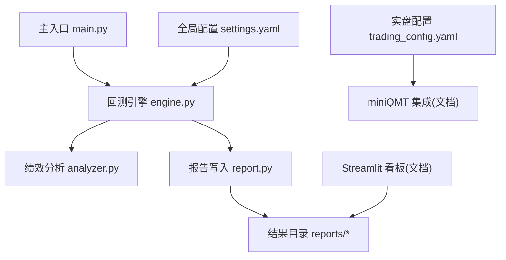
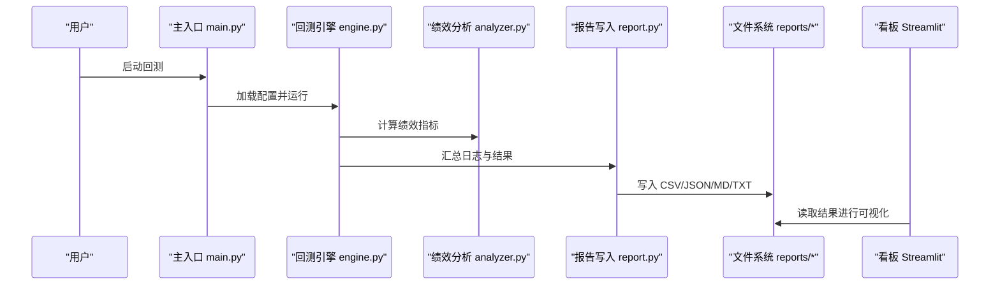
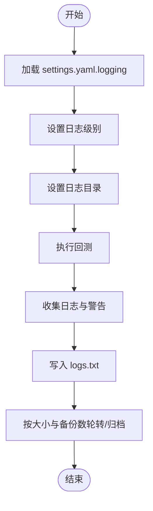
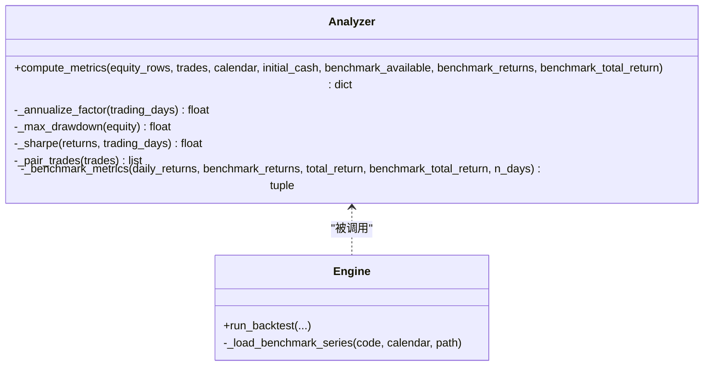
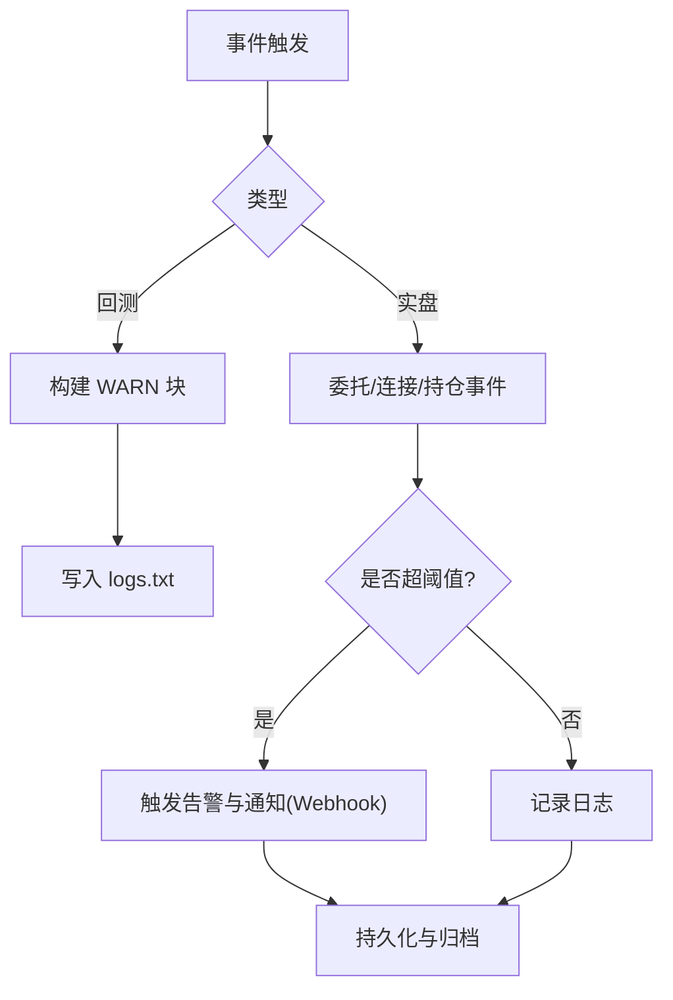
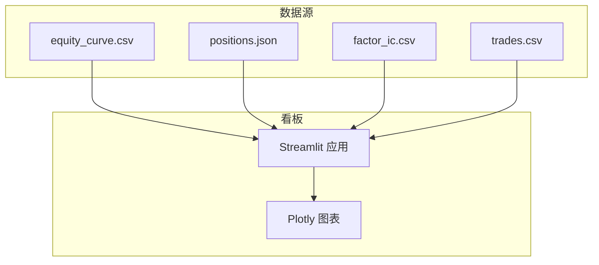
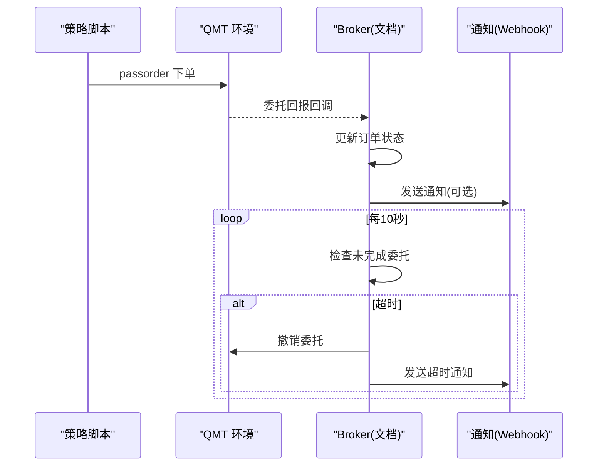
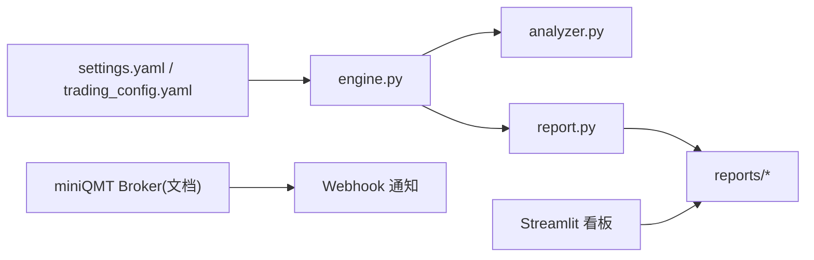

# 监控与日志系统

<cite>
**本文引用的文件**   
- [main.py](file://main.py)
- [settings.yaml](file://config/settings.yaml)
- [trading_config.yaml](file://config/trading_config.yaml)
- [engine.py](file://backtest/engine.py)
- [analyzer.py](file://backtest/analyzer.py)
- [report.py](file://backtest/report.py)
- [monitoring_indicators.md](file://projects/verification/results/monitoring_indicators.md)
- [A股量化框架_五大扩展模块.md](file://A股量化框架_五大扩展模块.md)
- [miniQMT实盘对接_生产级完善方案.md](file://miniQMT实盘对接_生产级完善方案.md)
- [全局复利与踩坑日志.md](file://全局复利与踩坑日志.md)
- [test_passorder_with_monitor.py](file://scripts/test_passorder_with_monitor.py)
</cite>

## 目录
1. [简介](#简介)
2. [项目结构](#项目结构)
3. [核心组件](#核心组件)
4. [架构总览](#架构总览)
5. [详细组件分析](#详细组件分析)
6. [依赖关系分析](#依赖关系分析)
7. [性能考量](#性能考量)
8. [故障排查指南](#故障排查指南)
9. [结论](#结论)
10. [附录](#附录)

## 简介
本指南面向 QuantLab 的监控与日志系统，覆盖以下目标：
- 日志系统架构设计：日志级别、格式规范、存储策略与轮转归档。
- 性能监控指标定义与采集：回测绩效、交易延迟、内存使用等关键指标。
- 告警机制配置：异常检测、阈值设置、通知方式（企业微信/钉钉）。
- 日志收集与分析工具：本地日志、远程存储、压缩归档与可视化。
- 实时监控仪表板搭建：基于 Streamlit 的关键指标可视化。
- 日志分析与故障诊断最佳实践。

## 项目结构
QuantLab 的监控与日志相关能力分布在如下位置：
- 全局配置：settings.yaml 中的 logging 段定义了日志级别、输出目录、轮转大小与备份数量。
- 回测引擎与报告：backtest/engine.py 负责运行与聚合诊断信息；backtest/report.py 统一输出结果与日志文本。
- 绩效分析：backtest/analyzer.py 计算收益、回撤、夏普、跟踪误差等指标。
- 实盘与委托监控：miniQMT 集成文档提供回调、重连、订单监控与通知实现思路。
- 看板：A股量化框架_五大扩展模块.md 提供 Streamlit 监控看板示例。
- 验证指标：projects/verification/results/monitoring_indicators.md 给出每日/每周/每月/季度监控指标与阈值。

**图表来源** 
- [main.py:1-104](file://main.py#L1-L104)
- [engine.py:1-200](file://backtest/engine.py#L1-L200)
- [analyzer.py:1-176](file://backtest/analyzer.py#L1-L176)
- [report.py:1-264](file://backtest/report.py#L1-L264)
- [settings.yaml:1-69](file://config/settings.yaml#L1-L69)
- [trading_config.yaml:1-62](file://config/trading_config.yaml#L1-L62)
- [A股量化框架_五大扩展模块.md:1705-2117](file://A股量化框架_五大扩展模块.md#L1705-L2117)

**章节来源**
- [settings.yaml:30-36](file://config/settings.yaml#L30-L36)
- [report.py:21-29](file://backtest/report.py#L21-L29)
- [engine.py:18-27](file://backtest/engine.py#L18-L27)

## 核心组件
- 日志配置与输出
  - 通过 settings.yaml 的 logging 段控制级别、目录、文件大小与备份数。
  - 回测阶段将 WARN/ERROR 等关键日志以 logs.txt 形式输出到 results_dir。
- 绩效指标计算
  - analyzer.compute_metrics 输出总收益、年化收益、最大回撤、夏普、Calmar、胜率、持仓天数、超额收益、信息比率、跟踪误差等。
- 报告与产物
  - report.write_all 生成 trades.csv、equity_curve.csv、positions.csv、logs.txt、report.md、summary.json。
- 实盘监控与通知
  - miniQMT 文档提供回调、断线重连、委托超时监控、持仓对账与 Webhook 通知。
- 看板可视化
  - Streamlit 看板展示净值曲线、回撤、因子IC、持仓分布与交易记录。

**章节来源**
- [analyzer.py:96-176](file://backtest/analyzer.py#L96-L176)
- [report.py:245-264](file://backtest/report.py#L245-L264)
- [miniQMT实盘对接_生产级完善方案.md:73-756](file://miniQMT实盘对接_生产级完善方案.md#L73-L756)
- [A股量化框架_五大扩展模块.md:1705-2117](file://A股量化框架_五大扩展模块.md#L1705-L2117)

## 架构总览
下图展示了从配置加载、回测执行、指标计算、报告输出到看板可视化的端到端流程。

**图表来源** 
- [main.py:28-93](file://main.py#L28-L93)
- [engine.py:479-522](file://backtest/engine.py#L479-L522)
- [analyzer.py:96-176](file://backtest/analyzer.py#L96-L176)
- [report.py:245-264](file://backtest/report.py#L245-L264)
- [A股量化框架_五大扩展模块.md:1705-2117](file://A股量化框架_五大扩展模块.md#L1705-L2117)

## 详细组件分析

### 日志系统与存储策略
- 日志级别与目录
  - settings.yaml 中 logging.level 控制级别（如 INFO），logging.dir 指定输出目录。
- 轮转与归档
  - 通过 max_file_size 与 backup_count 控制单文件大小与保留数量（需结合外部轮转工具或自定义封装）。
- 回测日志输出
  - report.write_logs_txt 将 WARN 块与每日日志写入 logs.txt，便于快速定位问题。
- 编码与路径
  - 所有输出采用 UTF-8；默认结果目录为 E:/QuantLab/reports，可通过 set_results_dir 覆盖。

**图表来源** 
- [settings.yaml:30-36](file://config/settings.yaml#L30-L36)
- [report.py:111-121](file://backtest/report.py#L111-L121)

**章节来源**
- [settings.yaml:30-36](file://config/settings.yaml#L30-L36)
- [report.py:111-121](file://backtest/report.py#L111-L121)
- [report.py:21-29](file://backtest/report.py#L21-L29)

### 性能监控指标定义与采集
- 回测绩效指标
  - 总收益、年化收益、最大回撤、夏普比率、Calmar、胜率、平均持仓天数、超额收益、信息比率、跟踪误差。
  - 由 analyzer.compute_metrics 计算，基准可用时启用 IR/excess/TE。
- 样本期与数据可用性
  - engine._load_benchmark_series 处理基准数据缺失与前向填充；短样本期会触发警告。
- 实时交易指标（实盘）
  - 委托状态、成交回报、撤单失败、账户资产、持仓市值、未成交订单监控与超时处理。
  - 参考 miniQMT 文档中的回调与监控线程实现。

**图表来源** 
- [analyzer.py:1-176](file://backtest/analyzer.py#L1-L176)
- [engine.py:38-99](file://backtest/engine.py#L38-L99)

**章节来源**
- [analyzer.py:96-176](file://backtest/analyzer.py#L96-L176)
- [engine.py:479-522](file://backtest/engine.py#L479-L522)
- [engine.py:38-99](file://backtest/engine.py#L38-L99)

### 告警机制配置
- 回测阶段告警
  - report._build_warn_block 输出固定顺序的 WARN 块，包括样本期过短、基准不可用、去重计数、sector_heat_mode=zero、WAL 检测等。
- 实盘阶段告警
  - 委托超时自动撤单、连接断开重连、持仓对账差异、Webhook 通知（企业微信/钉钉）。
- 阈值与处理
  - monitoring_indicators.md 定义了净值、回撤、持仓集中度、换手率、信号质量、业绩归因、容量检查、策略有效性等阈值与处理动作。

**图表来源** 
- [report.py:78-108](file://backtest/report.py#L78-L108)
- [miniQMT实盘对接_生产级完善方案.md:73-756](file://miniQMT实盘对接_生产级完善方案.md#L73-L756)
- [monitoring_indicators.md:1-63](file://projects/verification/results/monitoring_indicators.md#L1-L63)

**章节来源**
- [report.py:78-108](file://backtest/report.py#L78-L108)
- [monitoring_indicators.md:1-63](file://projects/verification/results/monitoring_indicators.md#L1-L63)
- [trading_config.yaml:37-41](file://config/trading_config.yaml#L37-L41)

### 日志收集与分析工具
- 本地日志
  - logs.txt 集中输出关键警告与日志摘录；report.md 包含关键日志片段与元信息。
- 轮转与归档
  - 通过 settings.yaml 的 max_file_size 与 backup_count 控制；建议配合外部工具（如 logrotate）或脚本实现压缩归档。
- 远程存储
  - 可将 reports 目录同步至远端（如 NAS/对象存储），并结合 Webhook 推送告警。
- 编码与路径注意事项
  - 全量 UTF-8；QMT 策略输出日志位于特定路径且编码为 UTF-8，避免 GBK 解码导致乱码。

**章节来源**
- [report.py:111-121](file://backtest/report.py#L111-L121)
- [report.py:138-233](file://backtest/report.py#L138-L233)
- [settings.yaml:30-36](file://config/settings.yaml#L30-L36)
- [全局复利与踩坑日志.md:147-168](file://全局复利与踩坑日志.md#L147-L168)

### 实时监控仪表板搭建
- 技术栈
  - Streamlit + Plotly，读取 equity_curve.csv、positions.json、factor_ic.csv、trades.csv 等。
- 页面内容
  - 策略概览（净值曲线、回撤、月度收益热力图）、因子分析（IC时序、相关性矩阵）、持仓管理（行业分布、个股权重）、交易记录（筛选与统计）、系统设置（参数调整与保存）。
- 部署方式
  - streamlit run dashboard.py，支持缓存与刷新。

**图表来源** 
- [A股量化框架_五大扩展模块.md:1705-2117](file://A股量化框架_五大扩展模块.md#L1705-L2117)

**章节来源**
- [A股量化框架_五大扩展模块.md:1705-2117](file://A股量化框架_五大扩展模块.md#L1705-L2117)

### 委托与状态监控（实盘）
- 委托状态查询
  - test_passorder_with_monitor.py 演示在 QMT 环境下逐 K 线查询委托状态、打印成交/撤单/废单结果。
- 回调与重连
  - miniQMT 文档提供 on_disconnected、on_stock_order、on_stock_trade、on_order_error 等回调，以及指数退避重连。
- 超时监控
  - 启动独立线程每 10 秒检查未完成委托，超过阈值自动撤单并通知。

**图表来源** 
- [test_passorder_with_monitor.py:1-75](file://scripts/test_passorder_with_monitor.py#L1-L75)
- [miniQMT实盘对接_生产级完善方案.md:73-756](file://miniQMT实盘对接_生产级完善方案.md#L73-L756)

**章节来源**
- [test_passorder_with_monitor.py:1-75](file://scripts/test_passorder_with_monitor.py#L1-L75)
- [miniQMT实盘对接_生产级完善方案.md:73-756](file://miniQMT实盘对接_生产级完善方案.md#L73-L756)

## 依赖关系分析
- 模块耦合
  - engine.py 依赖 analyzer.py 与 report.py；report.py 仅做序列化与落盘，不引入交易库。
  - settings.yaml 与 trading_config.yaml 分别驱动回测与实盘行为。
- 外部依赖
  - 基准数据读取依赖 data.benchmark_reader（在 engine 中按需导入）。
  - 看板依赖 Streamlit 与 Plotly。
  - 实盘依赖 xtquant（miniQMT）。

**图表来源** 
- [engine.py:1-200](file://backtest/engine.py#L1-L200)
- [analyzer.py:1-176](file://backtest/analyzer.py#L1-L176)
- [report.py:1-264](file://backtest/report.py#L1-L264)
- [A股量化框架_五大扩展模块.md:1705-2117](file://A股量化框架_五大扩展模块.md#L1705-L2117)
- [miniQMT实盘对接_生产级完善方案.md:73-756](file://miniQMT实盘对接_生产级完善方案.md#L73-L756)

**章节来源**
- [engine.py:1-200](file://backtest/engine.py#L1-L200)
- [report.py:1-264](file://backtest/report.py#L1-L264)

## 性能考量
- 指标计算复杂度
  - compute_metrics 基于纯 Python 循环与数学运算，时间复杂度 O(n)，n 为交易日数；空间复杂度 O(n)。
- 基准数据处理
  - _load_benchmark_series 使用前向填充与窗口对齐，避免缺失导致的偏差。
- 日志写入
  - logs.txt 与 CSV/JSON/MD 批量写入，注意磁盘 IO 与编码一致性。
- 监控线程开销
  - 委托监控线程每 10 秒检查一次，CPU 占用低；注意锁竞争与并发安全。

[本节为通用指导，不直接分析具体文件]

## 故障排查指南
- 常见问题定位
  - 查看 logs.txt 中的 WARN/ERROR 块，优先关注样本期、基准不可用、数据去重、WAL 检测等。
  - 核对 report.md 的“关键日志摘录”与“数据元信息”。
- 编码与路径
  - QMT 策略输出日志为 UTF-8，避免 GBK 解码；确认日志真实落点与文件名可信度。
- 连接与重连
  - 断线后自动重连，指数退避；若多次失败，检查网络与 QMT 客户端状态。
- 委托与成交
  - 使用 test_passorder_with_monitor.py 验证委托状态；核对未成交订单与超时撤单逻辑。

**章节来源**
- [report.py:78-108](file://backtest/report.py#L78-L108)
- [report.py:138-233](file://backtest/report.py#L138-L233)
- [全局复利与踩坑日志.md:147-168](file://全局复利与踩坑日志.md#L147-L168)
- [miniQMT实盘对接_生产级完善方案.md:73-756](file://miniQMT实盘对接_生产级完善方案.md#L73-L756)
- [test_passorder_with_monitor.py:1-75](file://scripts/test_passorder_with_monitor.py#L1-L75)

## 结论
QuantLab 的监控与日志体系以配置驱动为核心，结合回测引擎、绩效分析、报告输出与看板可视化，形成闭环。通过明确的日志级别与格式、严格的指标计算与告警阈值、完善的实盘委托监控与通知机制，能够有效支撑策略研发与生产运维。建议在生产环境中强化日志轮转与远程归档，完善 Webhook 通知通道，并持续优化看板指标与阈值策略。

[本节为总结性内容，不直接分析具体文件]

## 附录
- 监控指标清单
  - 每日：净值、回撤、持仓集中度、行业集中度。
  - 每周：换手率、信号质量。
  - 每月：业绩归因、容量检查。
  - 季度：策略有效性（信息比率、胜率）。
- 看板页面说明
  - 策略概览、因子分析、持仓管理、交易记录、系统设置。
- 实盘通知配置
  - 企业微信/钉钉 Webhook 获取与启用步骤。

**章节来源**
- [monitoring_indicators.md:1-63](file://projects/verification/results/monitoring_indicators.md#L1-L63)
- [A股量化框架_五大扩展模块.md:1705-2117](file://A股量化框架_五大扩展模块.md#L1705-L2117)
- [trading_config.yaml:37-41](file://config/trading_config.yaml#L37-L41)