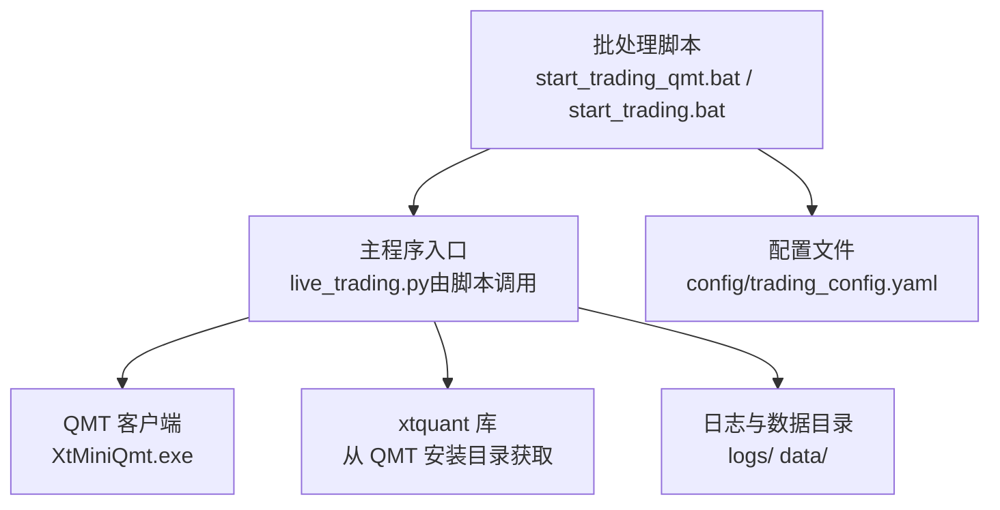
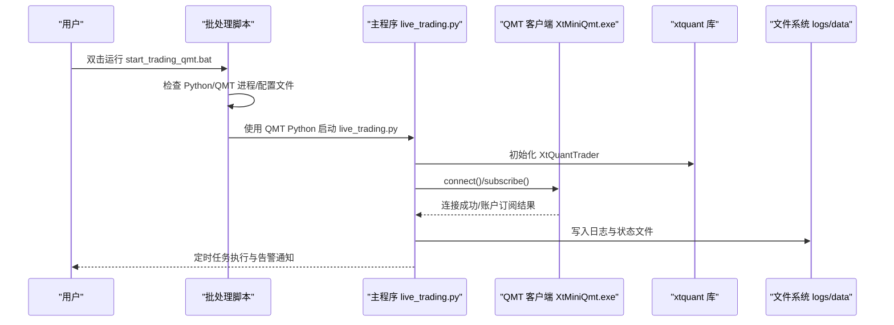
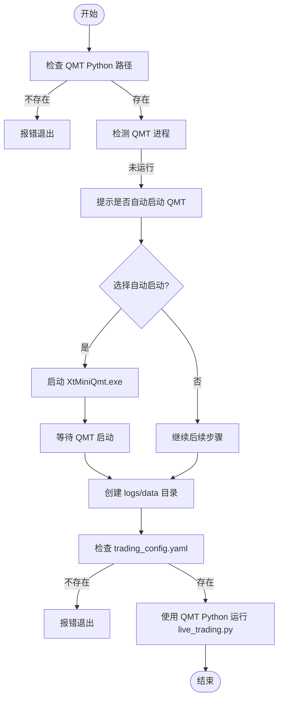
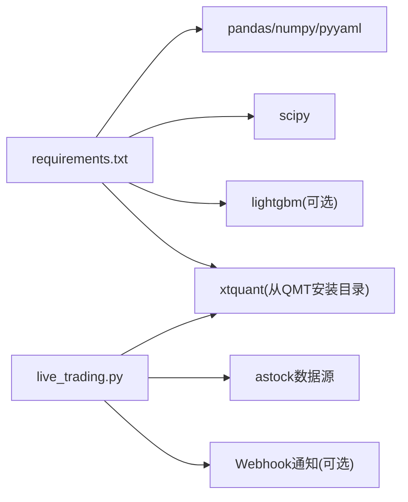

# 部署与运维

<cite>
**本文引用的文件**   
- [start_trading_qmt.bat](file://start_trading_qmt.bat)
- [start_trading.bat](file://start_trading.bat)
- [config/trading_config.yaml](file://config/trading_config.yaml)
- [config/settings.yaml](file://config/settings.yaml)
- [test_connection.py](file://test_connection.py)
- [test_connection_qmt.py](file://test_connection_qmt.py)
- [broker/qmt_builder.py](file://broker/qmt_builder.py)
- [requirements.txt](file://requirements.txt)
- [快速启动.md](file://快速启动.md)
- [实盘配置指南.md](file://实盘配置指南.md)
- [miniQMT实盘对接_生产级完善方案.md](file://miniQMT实盘对接_生产级完善方案.md)
</cite>

## 目录
1. [简介](#简介)
2. [项目结构](#项目结构)
3. [核心组件](#核心组件)
4. [架构总览](#架构总览)
5. [详细组件分析](#详细组件分析)
6. [依赖关系分析](#依赖关系分析)
7. [性能考虑](#性能考虑)
8. [故障排查指南](#故障排查指南)
9. [结论](#结论)
10. [附录](#附录)

## 简介
本指南面向 QuantLab 的实盘部署与运维，覆盖服务器准备、依赖安装、QMT 客户端部署与连接、自动化脚本使用、监控与日志、备份恢复、故障排查与性能优化等关键环节。文档以仓库现有脚本与配置为依据，提供可操作的步骤与图示，帮助在生产环境中稳定运行交易系统。

## 项目结构
QuantLab 的实盘相关能力主要由以下部分组成：
- 批处理启动脚本：用于环境检查、QMT 进程检测、日志目录创建与主程序启动
- 配置文件：交易账户、风控、订单策略、调度时间表、通知与数据源
- 连接测试脚本：验证 xtquant 库、QMT 路径、会话与账号连通性
- QMT 策略生成器：将策略逻辑打包为 QMT 可执行的 GBK 编码单文件
- 需求清单：Python 依赖与 QMT 相关说明

图表来源
- [start_trading_qmt.bat:1-66](file://start_trading_qmt.bat#L1-L66)
- [start_trading.bat:1-51](file://start_trading.bat#L1-L51)
- [config/trading_config.yaml:1-62](file://config/trading_config.yaml#L1-L62)

章节来源
- [start_trading_qmt.bat:1-66](file://start_trading_qmt.bat#L1-L66)
- [start_trading.bat:1-51](file://start_trading.bat#L1-L51)
- [config/trading_config.yaml:1-62](file://config/trading_config.yaml#L1-L62)

## 核心组件
- 批处理启动脚本
  - start_trading_qmt.bat：优先使用 QMT 内置 Python，自动检测并可选启动 QMT 客户端，创建日志与数据目录，校验配置文件后执行 live_trading.py
  - start_trading.bat：使用系统 Python，同样进行环境与 QMT 进程检查与启动流程
- 配置文件
  - trading_config.yaml：账户信息（id、path、session_id）、交易参数（资金、仓位、费用、滑点）、风控阈值、订单超时与重试、调度时间表、通知 Webhook、数据源路径
  - settings.yaml：全局配置（数据源、缓存、回测参数、日志目录、因子与策略默认设置）
- 连接测试脚本
  - test_connection.py：在系统 Python 环境下测试 xtquant 导入、QMT 路径、会话与账号连接
  - test_connection_qmt.py：使用 QMT 内置 Python 进行连接测试，输出账户资产与持仓明细
- QMT 策略生成器
  - broker/qmt_builder.py：读取配置，组装 QMT 生命周期与策略逻辑，输出 GBK 编码的单文件策略供 QMT 加载

章节来源
- [start_trading_qmt.bat:1-66](file://start_trading_qmt.bat#L1-L66)
- [start_trading.bat:1-51](file://start_trading.bat#L1-L51)
- [config/trading_config.yaml:1-62](file://config/trading_config.yaml#L1-L62)
- [config/settings.yaml:1-69](file://config/settings.yaml#L1-L69)
- [test_connection.py:1-117](file://test_connection.py#L1-L117)
- [test_connection_qmt.py:1-117](file://test_connection_qmt.py#L1-L117)
- [broker/qmt_builder.py:1-386](file://broker/qmt_builder.py#L1-L386)

## 架构总览
下图展示生产环境中的关键交互：批处理脚本负责环境检查与启动；主程序通过 xtquant 与 QMT 客户端通信；日志与数据持久化到本地目录；通知模块支持企业微信或钉钉告警。

图表来源
- [start_trading_qmt.bat:1-66](file://start_trading_qmt.bat#L1-L66)
- [config/trading_config.yaml:1-62](file://config/trading_config.yaml#L1-L62)
- [miniQMT实盘对接_生产级完善方案.md:1131-1344](file://miniQMT实盘对接_生产级完善方案.md#L1131-L1344)

## 详细组件分析

### 批处理脚本：start_trading_qmt.bat
- 功能要点
  - 设置 QMT Python 路径并校验存在性
  - 检测 QMT 进程，未运行时提示手动启动或自动拉起
  - 创建 logs 与 data 目录
  - 校验 config/trading_config.yaml 是否存在
  - 使用 QMT Python 执行 live_trading.py
- 注意事项
  - 确保 QMT 安装路径与 session_id、account.id 一致
  - 若使用系统 Python，请改用 start_trading.bat

图表来源
- [start_trading_qmt.bat:1-66](file://start_trading_qmt.bat#L1-L66)

章节来源
- [start_trading_qmt.bat:1-66](file://start_trading_qmt.bat#L1-L66)

### 批处理脚本：start_trading.bat
- 功能要点
  - 检查系统 Python 是否可用
  - 检测 QMT 进程，未运行则提示手动启动
  - 创建日志与数据目录，校验配置文件
  - 使用系统 Python 执行 live_trading.py
- 适用场景
  - 当 xtquant 已复制到系统 Python site-packages 时使用

章节来源
- [start_trading.bat:1-51](file://start_trading.bat#L1-L51)

### 配置文件：trading_config.yaml
- 关键配置项
  - account：id、path（userdata_mini 路径）、session_id
  - trading：初始资金、仓位上限、佣金、印花税、滑点
  - risk：止损比例、最大回撤、最长持有天数、单日换手上限
  - order：委托超时、最大重试次数、价格容差、超时未成交自动撤单
  - schedule：盘前、开盘、午后检查、风控间隔、尾盘时间
  - notification：开关、方法（wechat/dingtalk/email）、webhook_url
  - data：数据源类型、astock 路径、缓存目录
- 建议
  - 生产环境务必核对 path 与 id 与实际安装一致
  - 开启 notification 并配置 webhook 以便异常告警

章节来源
- [config/trading_config.yaml:1-62](file://config/trading_config.yaml#L1-L62)

### 连接测试脚本：test_connection.py 与 test_connection_qmt.py
- test_connection.py
  - 在系统 Python 下检查 xtquant 导入、QMT 路径、会话与账号连接
  - 输出账户资产与持仓明细，便于快速验证环境
- test_connection_qmt.py
  - 使用 QMT 内置 Python，确保 xtquant 兼容性最佳
  - 打印账户信息与持仓，指导下一步操作（如配置 webhook、启动实盘）

章节来源
- [test_connection.py:1-117](file://test_connection.py#L1-L117)
- [test_connection_qmt.py:1-117](file://test_connection_qmt.py#L1-L117)

### QMT 策略生成器：broker/qmt_builder.py
- 功能要点
  - 读取配置（settings.yaml），提取策略参数与因子权重
  - 组装 QMT 生命周期函数（init/handlebar/exit）与策略逻辑
  - 输出 GBK 编码的单文件策略，供 QMT 加载执行
- 注意
  - 输出路径需与 QMT 策略目录一致
  - 因子计算与评分逻辑需与回测口径保持一致

章节来源
- [broker/qmt_builder.py:1-386](file://broker/qmt_builder.py#L1-L386)

### 主程序与生产级实现参考：miniQMT实盘对接_生产级完善方案.md
- 内容概览
  - 生产级 Broker 类：连接管理、回调注册、断线重连、委托追踪、部分成交处理、持仓对账、优雅退出、通知
  - 实盘执行引擎：目标组合转指令、智能拆单、执行进度追踪、异常处理与告警
  - 主程序入口：日志配置、信号处理、定时任务注册、盘前/开盘/午后/风控/尾盘流程
- 建议
  - 将上述生产级代码整合到 live_trading.py 与 broker 模块中，提升稳定性与可观测性

章节来源
- [miniQMT实盘对接_生产级完善方案.md:1-800](file://miniQMT实盘对接_生产级完善方案.md#L1-L800)
- [miniQMT实盘对接_生产级完善方案.md:1131-1344](file://miniQMT实盘对接_生产级完善方案.md#L1131-L1344)

## 依赖关系分析
- Python 依赖
  - 核心：pandas、numpy、pyyaml
  - 回测：scipy
  - ML：lightgbm（可选）
  - QMT：xtquant（从 QMT 安装目录复制或使用 QMT 内置 Python）
- 外部依赖
  - QMT 客户端：XtMiniQmt.exe
  - 数据源：astock（路径在配置中指定）
  - 通知服务：企业微信或钉钉 Webhook（可选）

图表来源
- [requirements.txt:1-29](file://requirements.txt#L1-L29)
- [config/trading_config.yaml:1-62](file://config/trading_config.yaml#L1-L62)

章节来源
- [requirements.txt:1-29](file://requirements.txt#L1-L29)
- [config/trading_config.yaml:1-62](file://config/trading_config.yaml#L1-L62)

## 性能考虑
- 数据层
  - 启用 astock 缓存目录，减少重复下载与解析开销
  - 合理设置缓存过期时间，平衡新鲜度与存储占用
- 执行层
  - 使用 QMT 内置 Python 避免兼容性问题
  - 委托监控线程每 10 秒检查一次，避免频繁 I/O
  - 大单拆分与价格容差控制降低冲击成本
- 资源管理
  - 日志按日滚动，限制文件大小与备份数量
  - 非交易时段跳过下单与查询，减少无效请求

[本节为通用指导，不直接分析具体文件]

## 故障排查指南
- 常见问题与解决
  - xtquant 导入失败：确认已从 QMT 安装目录复制到系统 Python 的 site-packages，或使用 QMT 内置 Python
  - 连接失败（错误码非 0）：检查 QMT 是否启动、账号是否登录、配置文件中的 path 是否正确
  - 查询账户返回 0：核对 account.id 是否与 QMT 右上角账号一致
  - 程序崩溃恢复：系统会持久化 broker_state.json，重启后自动恢复状态并对账持仓
  - 停止程序：Ctrl+C 或任务管理器结束 pythonw.exe，退出时会自动撤销未完成委托并保存状态
- 诊断步骤
  - 使用 test_connection.py 或 test_connection_qmt.py 验证环境与连接
  - 查看 logs/trading_YYYYMMDD.log 定位异常堆栈
  - 检查 data/broker_state.json 与 data/positions.json 一致性

章节来源
- [实盘配置指南.md:1-258](file://实盘配置指南.md#L1-L258)
- [test_connection.py:1-117](file://test_connection.py#L1-L117)
- [test_connection_qmt.py:1-117](file://test_connection_qmt.py#L1-L117)

## 结论
通过批处理脚本、配置文件、连接测试与 QMT 策略生成器的协同，QuantLab 可在生产环境中稳定运行。结合生产级 Broker 与执行引擎、完善的日志与通知机制、以及备份恢复策略，可显著提升系统的可靠性与可维护性。建议先在模拟盘充分验证，再切换至实盘，并持续监控与优化。

[本节为总结性内容，不直接分析具体文件]

## 附录

### 服务器准备与依赖安装
- 服务器要求
  - Windows 环境，安装 QMT 客户端（XtMiniQmt.exe）
  - 系统 Python 或 QMT 内置 Python 均可（推荐 QMT 内置 Python 保证 xtquant 兼容）
- 依赖安装
  - 根据 requirements.txt 安装核心依赖
  - 从 QMT 安装目录复制 xtquant 到系统 Python 的 site-packages，或直接使用 QMT 内置 Python
- 数据准备
  - 配置 astock 数据路径与缓存目录
  - 确保数据源可用且路径正确

章节来源
- [requirements.txt:1-29](file://requirements.txt#L1-L29)
- [快速启动.md:1-67](file://快速启动.md#L1-L67)
- [config/settings.yaml:1-69](file://config/settings.yaml#L1-L69)

### QMT 平台部署与配置
- 客户端安装
  - 安装 QMT 客户端，确认 XtMiniQmt.exe 路径
- 网络连接
  - 启动 QMT 并登录账号（67014907）
- 权限设置
  - 确保 userdata_mini 路径可读写
  - 配置 account.id 与 session_id 一致

章节来源
- [快速启动.md:1-67](file://快速启动.md#L1-L67)
- [config/trading_config.yaml:1-62](file://config/trading_config.yaml#L1-L62)

### 自动化部署脚本使用方法
- start_trading_qmt.bat
  - 配置 QMT Python 路径
  - 自动检测并可选启动 QMT
  - 创建日志与数据目录
  - 校验配置文件后启动 live_trading.py
- start_trading.bat
  - 使用系统 Python 启动
  - 适用于 xtquant 已复制到系统 Python 的场景

章节来源
- [start_trading_qmt.bat:1-66](file://start_trading_qmt.bat#L1-L66)
- [start_trading.bat:1-51](file://start_trading.bat#L1-L51)

### 监控与日志系统搭建
- 日志收集
  - 日志按日滚动，保存在 logs/trading_YYYYMMDD.log
  - 配置日志级别与大小限制
- 性能监控
  - 委托监控线程跟踪超时与部分成交
  - 定期输出持仓与净值曲线
- 异常告警
  - 配置企业微信或钉钉 Webhook
  - 在连接失败、委托错误、持仓差异时发送告警

章节来源
- [config/settings.yaml:1-69](file://config/settings.yaml#L1-L69)
- [config/trading_config.yaml:1-62](file://config/trading_config.yaml#L1-L62)
- [miniQMT实盘对接_生产级完善方案.md:1-800](file://miniQMT实盘对接_生产级完善方案.md#L1-L800)

### 备份与恢复策略
- 配置备份
  - 定期备份 config/trading_config.yaml 与 settings.yaml
- 持仓数据备份
  - 备份 data/positions.json 与 broker_state.json
- 交易日志归档
  - 归档 logs/trading_YYYYMMDD.log 并按日期压缩
- 恢复流程
  - 恢复配置文件与状态文件
  - 重启主程序，自动加载上次状态并对账持仓

章节来源
- [config/trading_config.yaml:1-62](file://config/trading_config.yaml#L1-L62)
- [config/settings.yaml:1-69](file://config/settings.yaml#L1-L69)
- [实盘配置指南.md:1-258](file://实盘配置指南.md#L1-L258)

### 性能优化与扩容方案
- 性能优化
  - 使用 QMT 内置 Python 提升兼容性
  - 启用数据缓存与合理过期策略
  - 委托监控与价格容差控制降低延迟与冲击
- 扩容方案
  - 多实例部署：按策略或账户分实例运行
  - 数据层扩展：独立 astock 数据节点与缓存集群
  - 监控与告警：集中式日志与指标采集

[本节为通用指导，不直接分析具体文件]