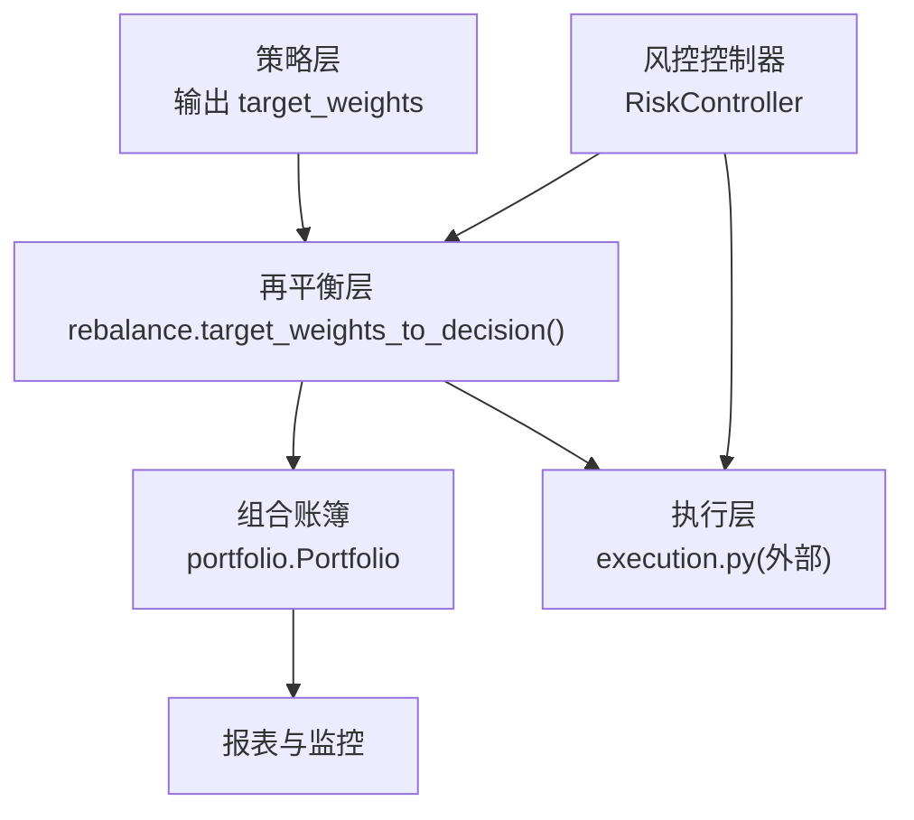
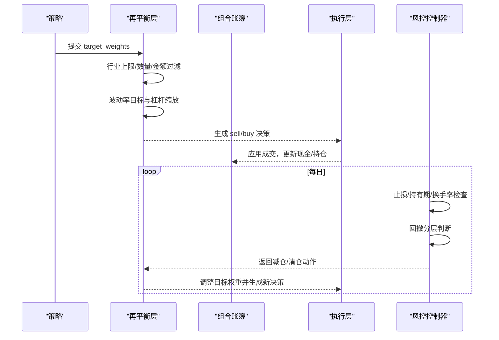
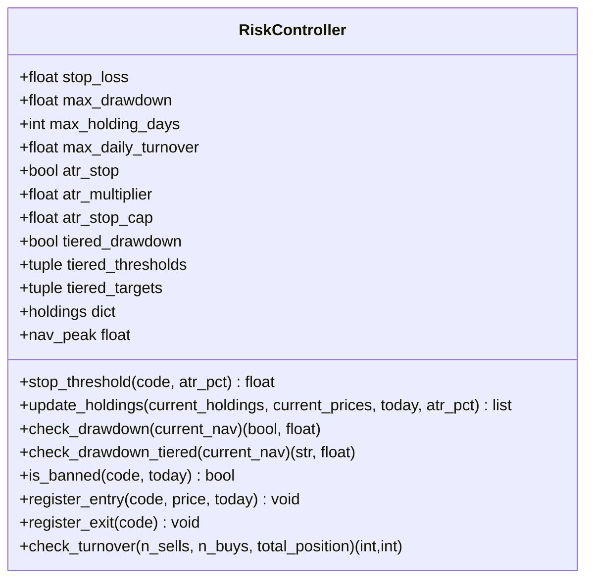
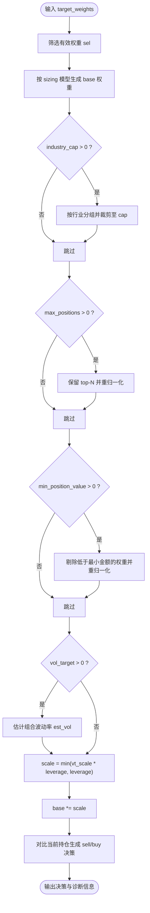
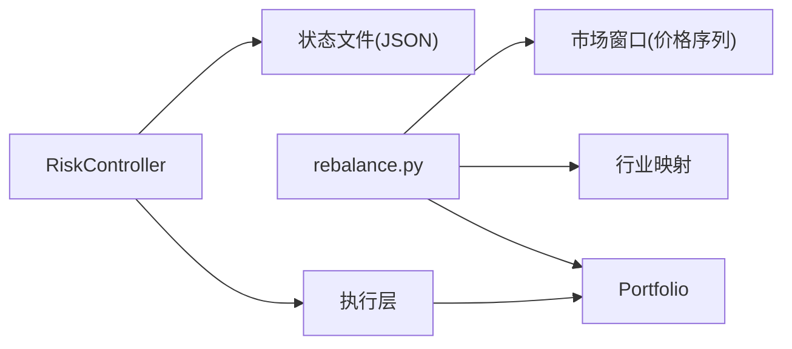
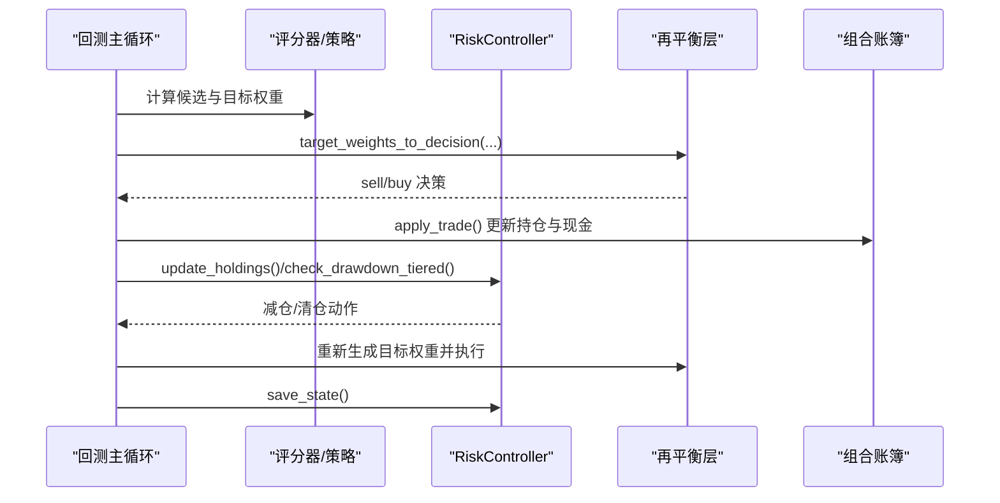

# 仓位控制机制

<cite>
**本文引用的文件**   
- [risk.py](file://projects/Project_10_价值小盘V2/strategy/risk.py)
- [rebalance.py](file://backtest/rebalance.py)
- [portfolio.py](file://backtest/portfolio.py)
- [strategy.yaml](file://projects/Project_10_价值小盘V2/config/strategy.yaml)
- [atr_lowvol_fw_leveraged.yaml](file://config/atr_lowvol_fw_leveraged.yaml)
- [run_grid_validation.py](file://projects/Project_10_价值小盘V2/run_grid_validation.py)
- [runner.py](file://projects/Project_10_价值小盘V2/runner.py)
</cite>

## 目录
1. [简介](#简介)
2. [项目结构](#项目结构)
3. [核心组件](#核心组件)
4. [架构总览](#架构总览)
5. [详细组件分析](#详细组件分析)
6. [依赖关系分析](#依赖关系分析)
7. [性能与稳定性考量](#性能与稳定性考量)
8. [故障排查指南](#故障排查指南)
9. [结论](#结论)
10. [附录：参数与回测验证流程](#附录参数与回测验证流程)

## 简介
本文件系统化阐述 QuantLab 的仓位控制机制，覆盖单只股票仓位限制、行业集中度控制、总仓位管理策略，以及 RiskController 的实现原理与配置。文档同时给出调参与回测验证方法、实际案例与效果评估要点，帮助读者在不深入源码的情况下也能正确理解与使用仓位控制能力。

## 项目结构
QuantLab 将“策略信号”和“风控/仓位控制”解耦：
- 策略层输出目标权重（target_weights）或交易信号；
- 通用再平衡层（rebalance）负责按配置进行权重归一化、行业上限、数量过滤、波动率目标与杠杆缩放，并生成买卖决策；
- 组合账簿（portfolio）记录现金、持仓、市值与每日净值；
- 风控模块（RiskController）提供个股止损、持有期、换手率限制与组合回撤分层降仓等。

图表来源
- [rebalance.py:101-195](file://backtest/rebalance.py#L101-L195)
- [portfolio.py:38-189](file://backtest/portfolio.py#L38-L189)
- [risk.py:15-195](file://projects/Project_10_价值小盘V2/strategy/risk.py#L15-L195)

章节来源
- [rebalance.py:1-281](file://backtest/rebalance.py#L1-L281)
- [portfolio.py:1-189](file://backtest/portfolio.py#L1-L189)
- [risk.py:1-195](file://projects/Project_10_价值小盘V2/strategy/risk.py#L1-L195)

## 核心组件
- RiskController：实现个股止损（固定或 ATR 自适应）、最长持有期、单日换手率限制、组合回撤检查（含分层降仓），并持久化状态（持仓登记、净值峰值、禁入列表、回撤层级）。
- Rebalance 层：将策略的目标权重转换为可执行的买卖决策，内置行业权重上限、最大持仓数、最小头寸金额、波动率目标与杠杆上限等约束。
- Portfolio：维护现金、持仓、市值与每日净值曲线，支持 T+1 可用规则与逐日盯市。

章节来源
- [risk.py:15-195](file://projects/Project_10_价值小盘V2/strategy/risk.py#L15-L195)
- [rebalance.py:101-195](file://backtest/rebalance.py#L101-L195)
- [portfolio.py:38-189](file://backtest/portfolio.py#L38-L189)

## 架构总览
仓位控制的端到端流程如下：
- 策略产生目标权重；
- 再平衡层根据配置进行权重归一化、行业上限裁剪、数量与金额过滤、波动率目标与杠杆缩放；
- 生成 sell_decisions 与 buy_candidates；
- 执行层成交后更新组合账簿；
- 风控层在每日循环中检查止损、持有期、换手率与回撤，必要时触发减仓或清仓。

图表来源
- [rebalance.py:101-195](file://backtest/rebalance.py#L101-L195)
- [portfolio.py:76-189](file://backtest/portfolio.py#L76-L189)
- [risk.py:62-195](file://projects/Project_10_价值小盘V2/strategy/risk.py#L62-L195)

## 详细组件分析

### RiskController 类与仓位控制
- 止损阈值：支持固定比例与 ATR 自适应（multiplier × ATR%，上限 stop_cap）。
- 持仓生命周期：登记买入、卖出、最长持有期强制退出。
- 组合回撤：旧口径一刀切清仓与新口径分层降仓（阈值→目标仓位比例），带状态防重触发与净值新高重置。
- 换手率限制：对当日买卖总量按比例缩放以满足 max_daily_turnover。
- 状态持久化：JSON 文件保存持仓、净值峰值、禁入列表与回撤层级。

图表来源
- [risk.py:15-195](file://projects/Project_10_价值小盘V2/strategy/risk.py#L15-L195)

章节来源
- [risk.py:15-195](file://projects/Project_10_价值小盘V2/strategy/risk.py#L15-L195)

### 再平衡层：行业集中度与总仓位管理
- 选股与基础权重：等权、波动率倒数（vol_parity）或自定义权重（custom）。
- 行业权重上限：按行业分组，超限时同比例压缩至 cap。
- 最大持仓数与最小头寸金额：Top-N 保留与最小金额过滤。
- 波动率目标与杠杆缩放：先计算达到 vol_target 所需的毛敞口 vt_scale，再与 target_leverage 相乘并以 target_leverage 为硬上限，避免误用导致杠杆被压制。
- 输出：sell_decisions、buy_candidates、target_positions、diagnostics。

图表来源
- [rebalance.py:101-195](file://backtest/rebalance.py#L101-L195)

章节来源
- [rebalance.py:101-195](file://backtest/rebalance.py#L101-L195)

### 组合账簿与现金比例
- 每日盯市：更新 last_price 与未实现盈亏；停牌时回退到最近可用收盘价。
- T+1 可用：买入当日 available_volume=0，次日 unfreeze。
- 总资产与收益率：total_asset = cash + market_value；daily_return 基于上一日总资产。
- 交易应用：买增加成本价与体积，卖减少体积与可用量，零持删除。

章节来源
- [portfolio.py:38-189](file://backtest/portfolio.py#L38-L189)

### 配置参数与开关
- 项目级风险参数（Project 10）：
  - 止损比例、最大回撤、最长持有天数、单日最大换手；
  - ATR 自适应止损开关、倍数与上限；
  - 分层回撤阈值与目标仓位比例。
- 框架级再平衡参数（通用）：
  - position_sizing（equal/vol_parity/custom）；
  - target_leverage（≥1 生效，硬上限）；
  - vol_target（>0 启用波动率目标）；
  - industry_cap（>0 启用行业上限）；
  - max_positions、min_position_value、vol_window。

章节来源
- [strategy.yaml:39-51](file://projects/Project_10_价值小盘V2/config/strategy.yaml#L39-L51)
- [atr_lowvol_fw_leveraged.yaml:39-46](file://config/atr_lowvol_fw_leveraged.yaml#L39-L46)

## 依赖关系分析
- RiskController 独立于再平衡层，通过状态文件持久化，不直接依赖 portfolio；但在运行时会与执行层交互以登记进出场。
- 再平衡层依赖市场数据窗口（用于波动率估计）与行业映射（用于行业上限），与 portfolio 仅读取当前持仓与总资产。
- 组合账簿与执行层耦合紧密，但对外暴露统一接口供上层调用。

图表来源
- [rebalance.py:101-195](file://backtest/rebalance.py#L101-L195)
- [portfolio.py:38-189](file://backtest/portfolio.py#L38-L189)
- [risk.py:15-195](file://projects/Project_10_价值小盘V2/strategy/risk.py#L15-L195)

章节来源
- [rebalance.py:101-195](file://backtest/rebalance.py#L101-L195)
- [portfolio.py:38-189](file://backtest/portfolio.py#L38-L189)
- [risk.py:15-195](file://projects/Project_10_价值小盘V2/strategy/risk.py#L15-L195)

## 性能与稳定性考量
- 波动率估计采用对角近似（忽略相关性），保守高估波动率，从而降低杠杆放大风险，适合回测稳健性。
- 行业上限裁剪按比例缩放，避免极端集中；最小头寸金额过滤减少无效微仓。
- 回撤分层降仓带状态防重触发，仅在回撤加深到新层级时动作，净值创新高时重置层级，防止频繁震荡。
- 状态文件读写需保证幂等与异常恢复，避免脏状态污染。

[本节为通用指导，不直接分析具体文件]

## 故障排查指南
- 止损未触发：检查 atr_stop 是否开启且传入 atr_pct；确认 stop_threshold 返回值是否符合预期。
- 回撤未触发减仓：确认 check_drawdown_tiered 的阈值与目标配置；检查 nav_peak 是否被净值新高重置。
- 换手率被压缩：核对 n_sells + n_buys 与 total_position 的比例，确保 max_daily_turnover 设置合理。
- 行业上限裁剪过度：检查 industry_map 是否正确映射；确认 industry_cap 是否过小。
- 波动率目标失效：确认 vol_target > 0 且 base 非空；检查 _est_portfolio_vol 的 vol_window 与数据长度。

章节来源
- [risk.py:62-195](file://projects/Project_10_价值小盘V2/strategy/risk.py#L62-L195)
- [rebalance.py:101-195](file://backtest/rebalance.py#L101-L195)

## 结论
QuantLab 的仓位控制机制通过“策略—再平衡—风控—组合账簿”的分层设计，实现了从单股止损、行业集中度到总仓位与回撤管理的完整闭环。RiskController 提供灵活的风控手段（ATR 自适应止损、分层降仓、换手率限制），再平衡层提供可配置的权重构建与约束（行业上限、数量/金额过滤、波动率目标与杠杆上限），两者协同确保策略在不同市场状态下具备稳健的仓位管理能力。

[本节为总结，不直接分析具体文件]

## 附录：参数与回测验证流程

### 关键参数说明
- 单只股票仓位限制
  - stop_loss_pct：固定止损比例；atr_stop.multiplier 与 atr_stop.stop_cap 控制 ATR 自适应止损。
  - max_holding_days：最长持有天数。
  - max_daily_turnover：单日最大换手率。
- 行业集中度控制
  - industry_cap：单行业权重上限（再平衡层）。
  - 分散化要求：max_positions 与 min_position_value 共同作用。
- 总仓位管理
  - target_leverage：杠杆上限（硬上限）。
  - vol_target：波动率目标，结合 vol_window 估计组合波动率。
  - 现金比例：由上述约束与目标权重决定，无需显式设置。

章节来源
- [strategy.yaml:39-51](file://projects/Project_10_价值小盘V2/config/strategy.yaml#L39-L51)
- [atr_lowvol_fw_leveraged.yaml:39-46](file://config/atr_lowvol_fw_leveraged.yaml#L39-L46)

### 回测验证流程
- 初始化评分器与风控控制器（RiskController），加载 risk_control 配置。
- 在每个调仓日：
  - 生成候选池与目标权重；
  - 调用再平衡层生成买卖决策；
  - 执行成交并更新组合账簿；
  - 风控层检查止损、持有期、换手率与回撤，必要时触发减仓或清仓。
- 保存状态文件（risk_state.json），用于跨期一致性。

图表来源
- [run_grid_validation.py:166-185](file://projects/Project_10_价值小盘V2/run_grid_validation.py#L166-L185)
- [runner.py:88-95](file://projects/Project_10_价值小盘V2/runner.py#L88-L95)
- [rebalance.py:101-195](file://backtest/rebalance.py#L101-L195)
- [risk.py:62-195](file://projects/Project_10_价值小盘V2/strategy/risk.py#L62-L195)

### 实际案例分析与效果评估
- 案例一：ATR 低波动策略 + 杠杆与波动率目标
  - 配置示例：target_leverage=1.5，vol_target=0.10，industry_cap=0.15，position_sizing=vol_parity。
  - 效果关注点：年化收益、最大回撤、换手率、行业集中度分布。
- 案例二：价值小盘 V2 状态机回测
  - 使用分层回撤（10%/15%/20% → 70%/40%/0%）替代一刀切清仓，提升回撤后的恢复能力。
  - 关注指标：超额收益、回撤修复时间、调仓频率与交易成本影响。

章节来源
- [atr_lowvol_fw_leveraged.yaml:39-46](file://config/atr_lowvol_fw_leveraged.yaml#L39-L46)
- [strategy.yaml:39-51](file://projects/Project_10_价值小盘V2/config/strategy.yaml#L39-L51)
- [run_grid_validation.py:256-286](file://projects/Project_10_价值小盘V2/run_grid_validation.py#L256-L286)