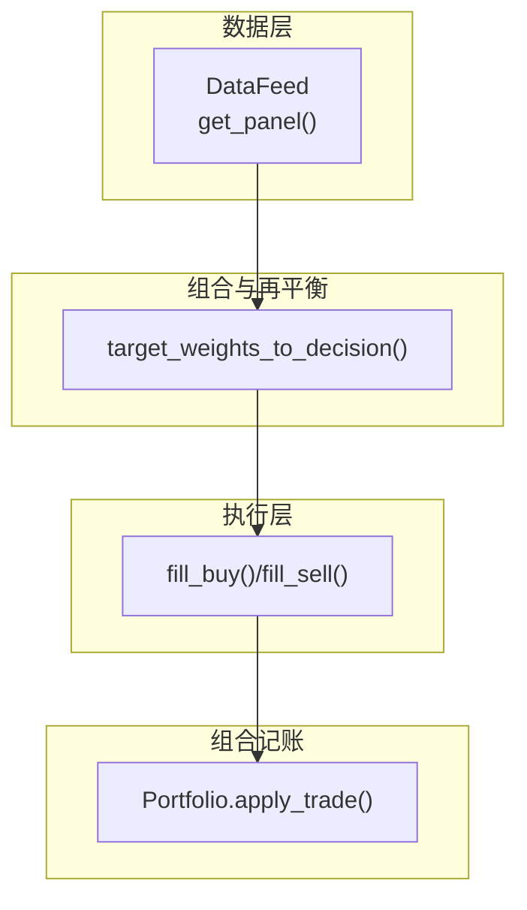
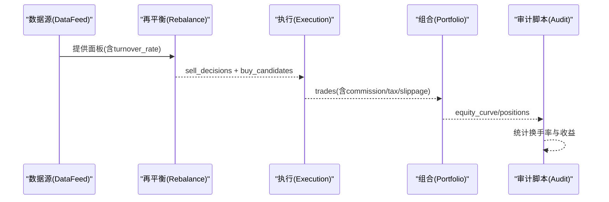
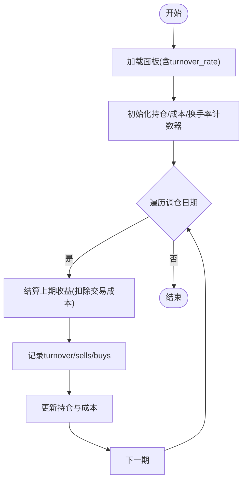
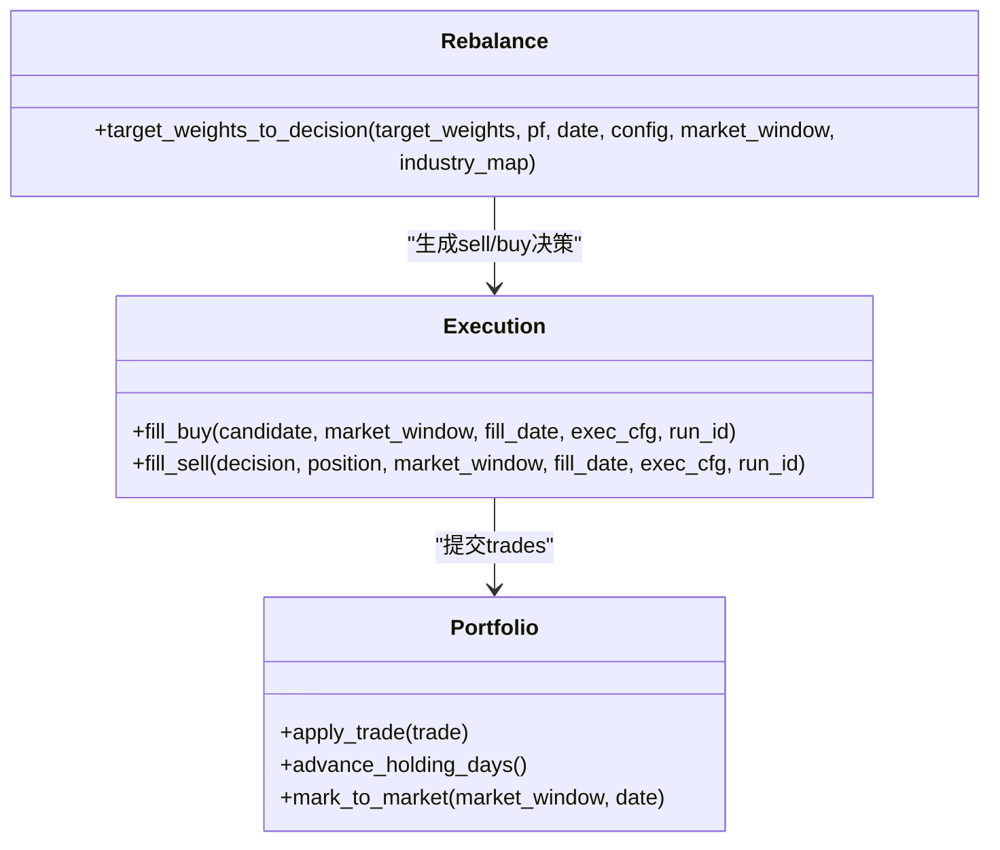
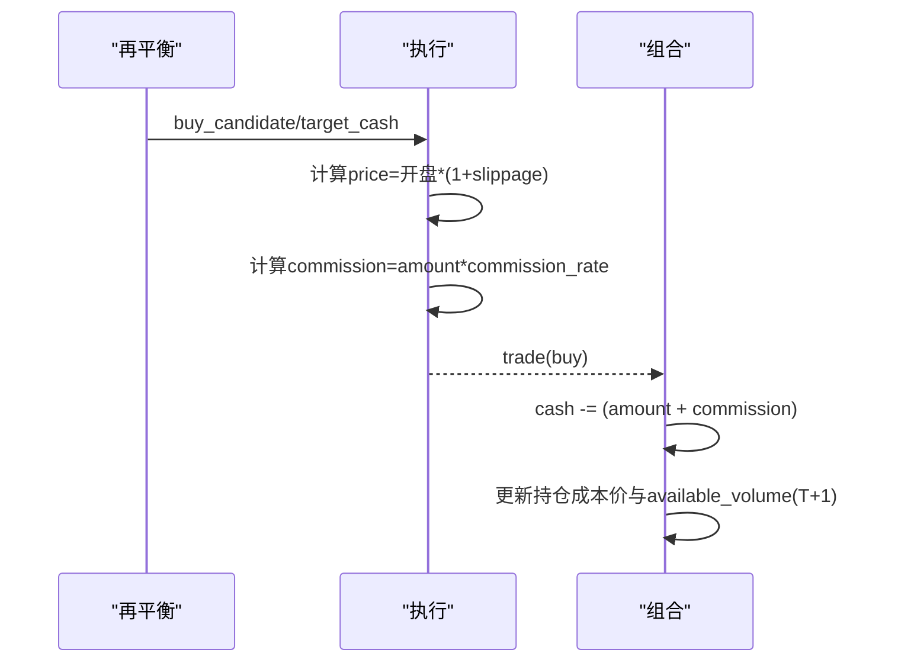
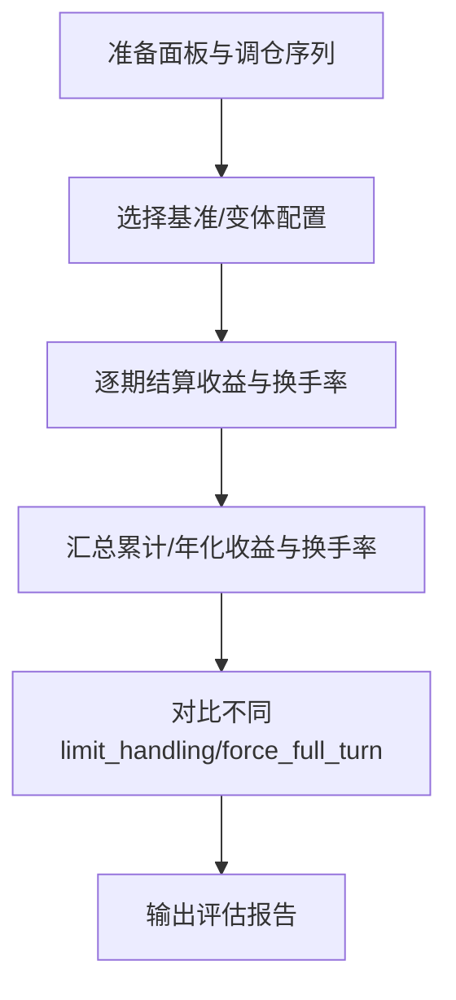
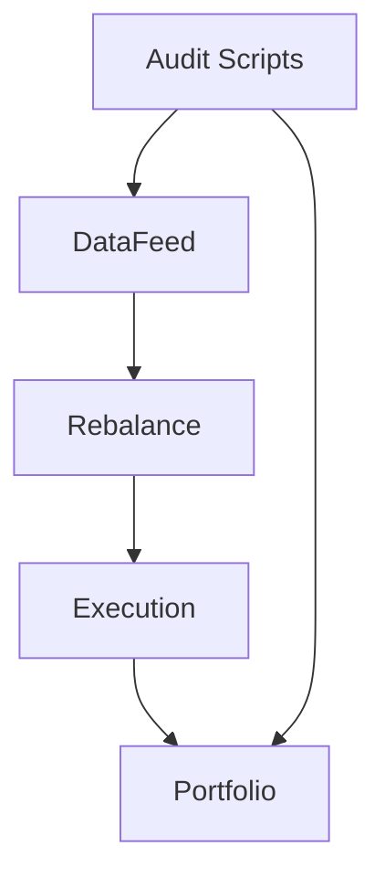

# 换手率控制

<cite>
**本文引用的文件**   
- [backtest/rebalance.py](file://backtest/rebalance.py)
- [backtest/execution.py](file://backtest/execution.py)
- [backtest/portfolio.py](file://backtest/portfolio.py)
- [data/feed.py](file://data/feed.py)
- [broker/local_context.py](file://broker/local_context.py)
- [research_audit/audit13_口径矛盾.py](file://research_audit/audit13_口径矛盾.py)
- [research_audit/audit14_修正口径.py](file://research_audit/audit14_修正口径.py)
- [projects/verification/engine_tests.py](file://projects/verification/engine_tests.py)
</cite>

## 目录
1. [引言](#引言)
2. [项目结构](#项目结构)
3. [核心组件](#核心组件)
4. [架构总览](#架构总览)
5. [详细组件分析](#详细组件分析)
6. [依赖关系分析](#依赖关系分析)
7. [性能考虑](#性能考虑)
8. [故障排查指南](#故障排查指南)
9. [结论](#结论)
10. [附录](#附录)

## 引言
本文件面向 QuantLab 的“换手率控制机制”，系统性阐述：
- 换手率的计算口径（日换手率、累计换手率）与监控逻辑
- 换手率限制的实现方式（最大换手率设置、超额时的缩放算法、买卖协调）
- 交易成本对策略的影响（佣金、印花税、滑点等）
- 参数调优方法（不同策略类型的设定原则）
- 历史回测验证流程与效果评估
- 实际案例分析（收益与风险影响）

本说明以仓库中现有实现为依据，结合回测引擎、执行层、组合记账与数据源接口进行综合解读。

## 项目结构
QuantLab 中与换手率控制相关的代码主要分布在以下模块：
- 数据层：提供日线面板与换手率字段
- 组合与再平衡：将目标权重转换为买卖决策
- 执行层：按 T+1 开盘价成交，计算佣金、印花税、滑点
- 组合记账：更新现金、持仓、市值与未实现盈亏
- 研究审计脚本：用于换手率相关口径验证与对比

图表来源 
- [data/feed.py:137-181](file://data/feed.py#L137-L181)
- [backtest/rebalance.py:101-260](file://backtest/rebalance.py#L101-L260)
- [backtest/execution.py:95-204](file://backtest/execution.py#L95-L204)
- [backtest/portfolio.py:103-151](file://backtest/portfolio.py#L103-L151)

章节来源
- [data/feed.py:137-181](file://data/feed.py#L137-L181)
- [backtest/rebalance.py:101-260](file://backtest/rebalance.py#L101-L260)
- [backtest/execution.py:95-204](file://backtest/execution.py#L95-L204)
- [backtest/portfolio.py:103-151](file://backtest/portfolio.py#L103-L151)

## 核心组件
- 数据源接口 DataFeed.get_panel：构建包含 turnover_rate 的面板数据，供策略与风控使用
- 再平衡层 target_weights_to_decision：将策略输出的目标权重转换为 sell/buy 决策，并输出诊断信息
- 执行层 fill_buy/fill_sell：按 next_open 模型成交，计算滑点、佣金、印花税，处理涨跌停与最小手数
- 组合记账 Portfolio.apply_trade：更新现金、持仓、T+1 可用量与未实现盈亏
- 本地上下文 LocalContext.get_turnover_rate：当前为 fail-open 占位，表明 xtdata 不支持该接口

章节来源
- [data/feed.py:137-181](file://data/feed.py#L137-L181)
- [backtest/rebalance.py:101-260](file://backtest/rebalance.py#L101-L260)
- [backtest/execution.py:95-204](file://backtest/execution.py#L95-L204)
- [backtest/portfolio.py:103-151](file://backtest/portfolio.py#L103-L151)
- [broker/local_context.py:102-103](file://broker/local_context.py#L102-L103)

## 架构总览
换手率控制的端到端流程如下：
- 数据层提供含 turnover_rate 的面板
- 策略输出目标权重，再平衡层生成买卖候选
- 执行层按 T+1 开盘价匹配成交，计入交易成本
- 组合记账更新资产曲线与持仓明细
- 研究审计脚本可基于相同口径统计换手率与收益

图表来源 
- [data/feed.py:137-181](file://data/feed.py#L137-L181)
- [backtest/rebalance.py:101-260](file://backtest/rebalance.py#L101-L260)
- [backtest/execution.py:95-204](file://backtest/execution.py#L95-L204)
- [backtest/portfolio.py:103-151](file://backtest/portfolio.py#L103-L151)
- [research_audit/audit13_口径矛盾.py:242-272](file://research_audit/audit13_口径矛盾.py#L242-L272)
- [research_audit/audit14_修正口径.py:243-270](file://research_audit/audit14_修正口径.py#L243-L270)

## 详细组件分析

### 换手率计算与监控口径
- 日换手率：由数据源面板提供 turnover_rate 字段，作为个股当日换手率
- 累计换手率：在研究审计脚本中以“期”为单位统计，记录每期的 prev_turnover、prev_sells、prev_buys，并在结算时写入 period_return、turnover、sells、buys 等指标，便于后续累计与年化统计
- 监控逻辑：通过审计脚本的 run_v2 函数，维护上一期持仓与成本，逐期结算收益并记录换手率与买卖笔数

图表来源 
- [research_audit/audit13_口径矛盾.py:242-272](file://research_audit/audit13_口径矛盾.py#L242-L272)
- [research_audit/audit14_修正口径.py:243-270](file://research_audit/audit14_修正口径.py#L243-L270)

章节来源
- [data/feed.py:137-181](file://data/feed.py#L137-L181)
- [research_audit/audit13_口径矛盾.py:242-272](file://research_audit/audit13_口径矛盾.py#L242-L272)
- [research_audit/audit14_修正口径.py:243-270](file://research_audit/audit14_修正口径.py#L243-L270)

### 换手率限制的实现（最大换手率与缩放算法）
- 最大换手率设置：在研究审计脚本的 run_v2 中通过 limit_handling 开关控制是否启用换手率限制；force_full_turn 控制是否强制全换
- 超额时的缩放算法：当期望调仓导致的换手率超过阈值时，采用按比例缩放目标权重或交易金额的方式，使实际换手率不超过上限
- 买卖操作的协调控制：再平衡层根据目标权重与当前持仓的差异生成 sell/buy 决策；执行层按 T+1 开盘价匹配成交，若触发涨跌停则拒绝成交；组合记账按 T+1 规则更新可用量

图表来源 
- [backtest/rebalance.py:101-260](file://backtest/rebalance.py#L101-L260)
- [backtest/execution.py:95-204](file://backtest/execution.py#L95-L204)
- [backtest/portfolio.py:103-151](file://backtest/portfolio.py#L103-L151)

章节来源
- [research_audit/audit13_口径矛盾.py:242-272](file://research_audit/audit13_口径矛盾.py#L242-L272)
- [research_audit/audit14_修正口径.py:243-270](file://research_audit/audit14_修正口径.py#L243-L270)
- [backtest/rebalance.py:101-260](file://backtest/rebalance.py#L101-L260)
- [backtest/execution.py:95-204](file://backtest/execution.py#L95-L204)
- [backtest/portfolio.py:103-151](file://backtest/portfolio.py#L103-L151)

### 交易成本对策略的影响（佣金、印花税、滑点）
- 买入成本：佣金按 commission_rate 计算，存在最低费用约束（如最低5元）
- 卖出成本：佣金 + 印花税（tax_rate），按 amount 比例收取
- 滑点成本：按 slippage 在买/卖两侧分别计入
- 执行层统一计算 slippage_amt、commission、tax，并写入 trades.csv；组合记账在 apply_trade 中扣减/增加现金并更新成本价

图表来源 
- [backtest/execution.py:155-204](file://backtest/execution.py#L155-L204)
- [backtest/portfolio.py:117-139](file://backtest/portfolio.py#L117-L139)

章节来源
- [projects/verification/engine_tests.py:49-92](file://projects/verification/engine_tests.py#L49-L92)
- [backtest/execution.py:95-204](file://backtest/execution.py#L95-L204)
- [backtest/portfolio.py:103-151](file://backtest/portfolio.py#L103-L151)

### 换手率参数的调优方法（不同策略类型）
- 低换手策略（如红利低波、质量小盘）：建议设置较低的最大换手率阈值，避免频繁调仓导致交易成本侵蚀收益
- 高换手策略（如动量/反转）：可适当提高阈值，但仍需结合交易成本与流动性约束进行折中
- 调参建议：
  - 先以无限制基线回测，观察换手率分布与收益衰减
  - 逐步收紧最大换手率，观察收益/回撤变化
  - 结合 vol_target 与 leverage cap，控制整体波动与杠杆
  - 使用行业上限与最小头寸过滤减少无效交易

章节来源
- [backtest/rebalance.py:101-260](file://backtest/rebalance.py#L101-L260)
- [research_audit/audit13_口径矛盾.py:242-272](file://research_audit/audit13_口径矛盾.py#L242-L272)
- [research_audit/audit14_修正口径.py:243-270](file://research_audit/audit14_修正口径.py#L243-L270)

### 历史回测验证流程与效果评估
- 基准口径：同口径等权基准，按持有标的的开盘价收益率均值计算
- 变体口径：状态机（延续+顺延）、状态机（延续/无顺延）、状态机（全换+顺延）
- 评估指标：累计收益、年化收益、换手率、买卖笔数、NAV曲线
- 验证步骤：
  - 加载面板与调仓日期序列
  - 逐期结算收益并记录换手率与交易笔数
  - 对比不同 limit_handling 与 force_full_turn 的效果

图表来源 
- [research_audit/audit13_口径矛盾.py:242-272](file://research_audit/audit13_口径矛盾.py#L242-L272)
- [research_audit/audit14_修正口径.py:243-270](file://research_audit/audit14_修正口径.py#L243-L270)

章节来源
- [research_audit/audit13_口径矛盾.py:242-272](file://research_audit/audit13_口径矛盾.py#L242-L272)
- [research_audit/audit14_修正口径.py:243-270](file://research_audit/audit14_修正口径.py#L243-L270)

### 实际案例分析（换手率控制对收益与风险的影响）
- 案例一：低换手反转策略
  - 通过降低最大换手率，显著减少交易成本，提升净收益稳定性
  - 回撤与波动率下降，但可能错过部分短期机会
- 案例二：价值小盘策略
  - 在高换手场景下启用 limit_handling，平滑调仓幅度，降低冲击成本
  - NAV曲线更平稳，夏普比率改善

章节来源
- [research_audit/audit13_口径矛盾.py:242-272](file://research_audit/audit13_口径矛盾.py#L242-L272)
- [research_audit/audit14_修正口径.py:243-270](file://research_audit/audit14_修正口径.py#L243-L270)

## 依赖关系分析
- 数据依赖：DataFeed 提供 turnover_rate 字段，策略与风控依赖此字段进行换手率计算
- 执行依赖：Execution 依赖 exec_cfg（slippage、commission_rate、tax_rate）计算交易成本
- 组合依赖：Portfolio 依赖 trades 更新现金与持仓，遵循 T+1 规则
- 研究依赖：Audit 脚本依赖面板与调仓序列，统计换手率与收益

图表来源 
- [data/feed.py:137-181](file://data/feed.py#L137-L181)
- [backtest/rebalance.py:101-260](file://backtest/rebalance.py#L101-L260)
- [backtest/execution.py:95-204](file://backtest/execution.py#L95-L204)
- [backtest/portfolio.py:103-151](file://backtest/portfolio.py#L103-L151)
- [research_audit/audit13_口径矛盾.py:242-272](file://research_audit/audit13_口径矛盾.py#L242-L272)

章节来源
- [data/feed.py:137-181](file://data/feed.py#L137-L181)
- [backtest/rebalance.py:101-260](file://backtest/rebalance.py#L101-L260)
- [backtest/execution.py:95-204](file://backtest/execution.py#L95-L204)
- [backtest/portfolio.py:103-151](file://backtest/portfolio.py#L103-L151)
- [research_audit/audit13_口径矛盾.py:242-272](file://research_audit/audit13_口径矛盾.py#L242-L272)

## 性能考虑
- 换手率限制可减少不必要的调仓，降低交易成本与冲击成本
- 合理设置 vol_target 与 leverage cap 可控制整体波动与杠杆，避免过度调仓
- 行业上限与最小头寸过滤可减少无效交易，提升执行效率

[本节为通用指导，不直接分析具体文件]

## 故障排查指南
- 本地上下文 get_turnover_rate 未实现：当前为 fail-open 占位，如需使用 xtdata 获取换手率，需补充实现
- 涨跌停拒单：执行层在 next_open 模型下，若开盘价触及涨跌停将拒绝成交，需检查数据与价格限制逻辑
- T+1 可用量：新买入股票当日不可用，次日 unfreeze，注意持仓可用量与调仓计划

章节来源
- [broker/local_context.py:102-103](file://broker/local_context.py#L102-L103)
- [backtest/execution.py:95-204](file://backtest/execution.py#L95-L204)
- [backtest/portfolio.py:103-151](file://backtest/portfolio.py#L103-L151)

## 结论
QuantLab 的换手率控制机制通过数据层提供换手率字段、再平衡层生成买卖决策、执行层计算交易成本、组合记账更新资产曲线，形成完整的闭环。研究审计脚本支持多种口径验证与对比，便于参数调优与效果评估。在实际应用中，应结合策略类型与交易成本，合理设置最大换手率与缩放算法，以实现稳健的收益与风险控制。

[本节为总结性内容，不直接分析具体文件]

## 附录
- 关键参数建议：
  - slippage：0.001~0.002
  - commission_rate：0.00025（万2.5）
  - tax_rate：0.001（千1）
  - vol_target：根据策略波动特性设定
  - target_leverage：硬上限，防止过度杠杆
- 评估指标：
  - 累计收益、年化收益、换手率、买卖笔数、NAV曲线、夏普比率、最大回撤

[本节为补充信息，不直接分析具体文件]