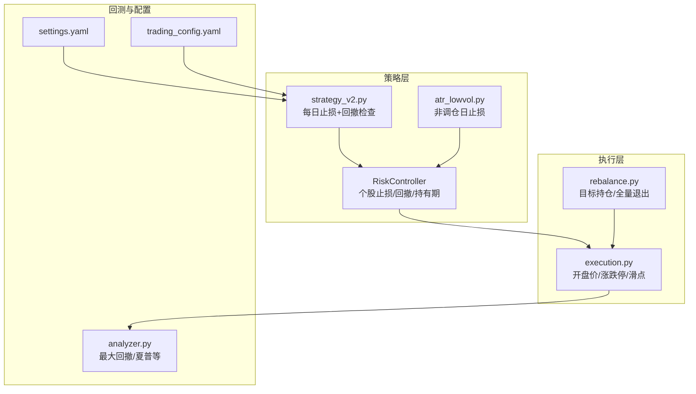
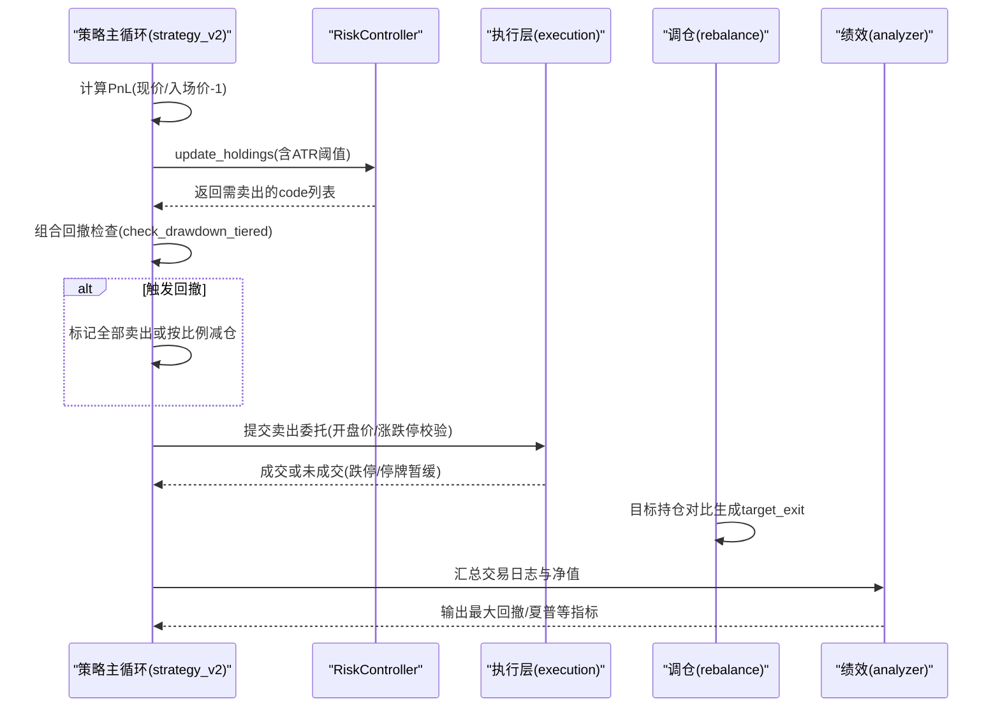
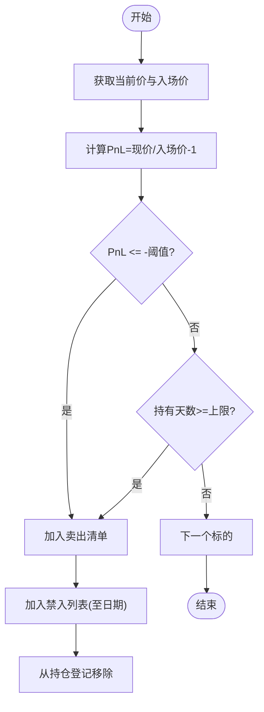
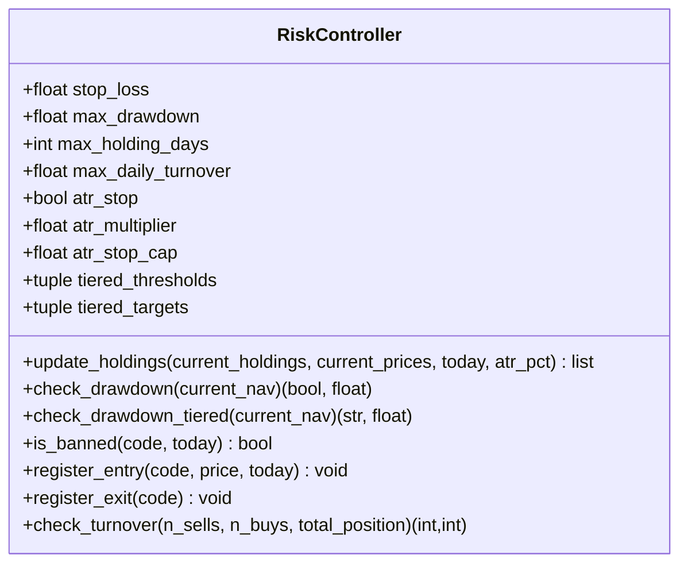
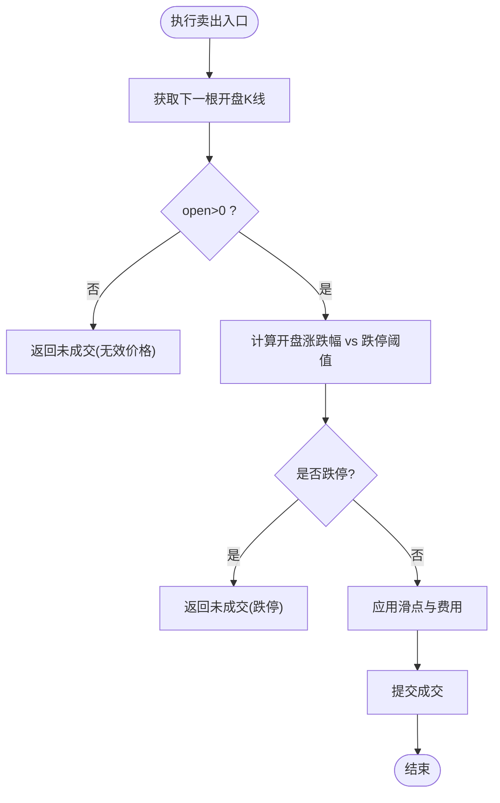
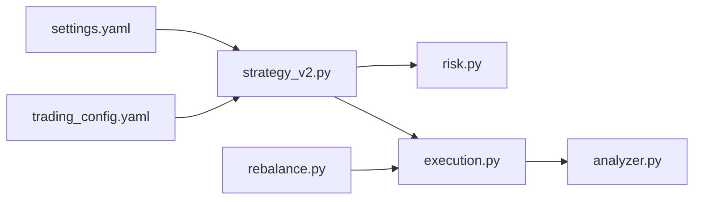

# 止损止盈机制

<cite>
**本文引用的文件**   
- [risk.py](file://projects/Project_10_价值小盘V2/strategy/risk.py)
- [strategy_v2.py](file://projects/Project_10_价值小盘V2/strategy_v2.py)
- [atr_lowvol.py](file://strategy/atr_lowvol.py)
- [execution.py](file://backtest/execution.py)
- [rebalance.py](file://backtest/rebalance.py)
- [analyzer.py](file://backtest/analyzer.py)
- [settings.yaml](file://config/settings.yaml)
- [trading_config.yaml](file://config/trading_config.yaml)
- [engine_tests.py](file://projects/verification/engine_tests.py)
</cite>

## 目录
1. [引言](#引言)
2. [项目结构](#项目结构)
3. [核心组件](#核心组件)
4. [架构总览](#架构总览)
5. [详细组件分析](#详细组件分析)
6. [依赖关系分析](#依赖关系分析)
7. [性能与回测评估](#性能与回测评估)
8. [故障排查指南](#故障排查指南)
9. [结论](#结论)
10. [附录：参数调优与验证流程](#附录参数调优与验证流程)

## 引言
本文件系统性梳理 QuantLab 中的止损止盈机制，覆盖个股止损（固定比例、ATR自适应）、持有期止损、组合回撤风控、禁入列表与恢复条件、执行层限制（跌停/停牌）以及回测指标与调参方法。文档面向策略研发与实盘运维人员，既提供代码级实现说明，也给出可操作的配置与验证建议。

## 项目结构
与止损止盈相关的核心模块分布在以下位置：
- 策略层风控：projects/Project_10_价值小盘V2/strategy/risk.py
- 策略主循环中的止损逻辑：projects/Project_10_价值小盘V2/strategy_v2.py
- 低波ATR策略的持有期止损：strategy/atr_lowvol.py
- 执行层成交与限制：backtest/execution.py
- 调仓与全量清仓：backtest/rebalance.py
- 绩效与回撤计算：backtest/analyzer.py
- 全局与交易配置：config/settings.yaml, config/trading_config.yaml
- 单元测试与示例：projects/verification/engine_tests.py

图表来源
- [risk.py:15-37](file://projects/Project_10_价值小盘V2/strategy/risk.py#L15-L37)
- [strategy_v2.py:540-580](file://projects/Project_10_价值小盘V2/strategy_v2.py#L540-L580)
- [atr_lowvol.py:37-75](file://strategy/atr_lowvol.py#L37-L75)
- [execution.py:95-117](file://backtest/execution.py#L95-L117)
- [rebalance.py:236-280](file://backtest/rebalance.py#L236-L280)
- [analyzer.py:18-31](file://backtest/analyzer.py#L18-L31)
- [settings.yaml:22-28](file://config/settings.yaml#L22-L28)
- [trading_config.yaml:18-22](file://config/trading_config.yaml#L18-L22)

章节来源
- [risk.py:15-37](file://projects/Project_10_价值小盘V2/strategy/risk.py#L15-L37)
- [strategy_v2.py:540-580](file://projects/Project_10_价值小盘V2/strategy_v2.py#L540-L580)
- [atr_lowvol.py:37-75](file://strategy/atr_lowvol.py#L37-L75)
- [execution.py:95-117](file://backtest/execution.py#L95-L117)
- [rebalance.py:236-280](file://backtest/rebalance.py#L236-L280)
- [analyzer.py:18-31](file://backtest/analyzer.py#L18-L31)
- [settings.yaml:22-28](file://config/settings.yaml#L22-L28)
- [trading_config.yaml:18-22](file://config/trading_config.yaml#L18-L22)

## 核心组件
- RiskController：封装个股止损阈值（固定或ATR自适应）、组合回撤（一刀切与分层降仓）、最长持有期、换手率限制、禁入列表与状态持久化。
- strategy_v2.py：在每个bar上执行个股止损与持有期止损，并触发组合回撤清仓；对跌停/停牌进行暂缓卖出队列处理。
- atr_lowvol.py：在非调仓日按成本与现价判断是否触发止损，输出目标权重以退出触发标的。
- execution.py：执行卖出时校验开盘价有效性、涨跌停限制、滑点与费用。
- rebalance.py：当目标持仓不包含某只股票时，生成“target_exit”卖出决策；支持全量退出。
- analyzer.py：计算最大回撤、夏普比率、胜率等回测指标，用于止损效果评估。

章节来源
- [risk.py:15-195](file://projects/Project_10_价值小盘V2/strategy/risk.py#L15-L195)
- [strategy_v2.py:540-580](file://projects/Project_10_价值小盘V2/strategy_v2.py#L540-L580)
- [atr_lowvol.py:37-75](file://strategy/atr_lowvol.py#L37-L75)
- [execution.py:95-117](file://backtest/execution.py#L95-L117)
- [rebalance.py:236-280](file://backtest/rebalance.py#L236-L280)
- [analyzer.py:18-31](file://backtest/analyzer.py#L18-L31)

## 架构总览
止损止盈在系统中的调用链如下：
- 策略主循环在每个bar计算当前价格与入场价，比较PnL与止损阈值；若触发则加入卖出清单。
- 同时检查组合净值相对历史高点的回撤，超过阈值则触发清仓或分层降仓。
- 卖出决策进入执行层，执行前检查涨跌停与停牌，失败则进入暂缓队列继续尝试。
- 调仓阶段根据目标持仓生成卖出决策，确保不在目标内的持仓被清理。
- 回测引擎汇总交易日志与成交记录，计算回撤、夏普等指标，用于评估止损有效性。

图表来源
- [strategy_v2.py:540-580](file://projects/Project_10_价值小盘V2/strategy_v2.py#L540-L580)
- [risk.py:74-110](file://projects/Project_10_价值小盘V2/strategy/risk.py#L74-L110)
- [execution.py:95-117](file://backtest/execution.py#L95-L117)
- [rebalance.py:236-280](file://backtest/rebalance.py#L236-L280)
- [analyzer.py:18-31](file://backtest/analyzer.py#L18-L31)

## 详细组件分析

### 个股止损算法
- 固定比例止损：默认阈值由配置项控制（如 trading_config.yaml 中 risk.stop_loss_pct），在 RiskController 中以 stop_loss 字段保存。
- ATR自适应止损：开启 atr_stop 后，阈值 = min(multiplier * ATR%, stop_cap)，其中 ATR% 为 ATR(14)/close 比值，stop_cap 作为上限保护。
- 持有期止损：超过 max_holding_days 强制退出，避免长期套牢。
- 禁入列表：触发止损后将股票加入“禁入列表”，设置禁入截止日期（默认30天），期间禁止再次买入。

图表来源
- [risk.py:62-110](file://projects/Project_10_价值小盘V2/strategy/risk.py#L62-L110)
- [strategy_v2.py:540-580](file://projects/Project_10_价值小盘V2/strategy_v2.py#L540-L580)

章节来源
- [risk.py:62-110](file://projects/Project_10_价值小盘V2/strategy/risk.py#L62-L110)
- [strategy_v2.py:540-580](file://projects/Project_10_价值小盘V2/strategy_v2.py#L540-L580)
- [trading_config.yaml:18-22](file://config/trading_config.yaml#L18-L22)

### 组合回撤风控（一刀切与分层降仓）
- 一刀切：check_drawdown() 在净值相对峰值回撤达到 max_drawdown 时触发清仓。
- 分层降仓：check_drawdown_tiered() 根据多级阈值（如10%/15%/20%）对应目标仓位（如70%/40%/0%），带状态防重触发，仅在回撤加深到新层级时动作；创净值新高时重置层级。

图表来源
- [risk.py:15-37](file://projects/Project_10_价值小盘V2/strategy/risk.py#L15-L37)
- [risk.py:112-157](file://projects/Project_10_价值小盘V2/strategy/risk.py#L112-L157)

章节来源
- [risk.py:112-157](file://projects/Project_10_价值小盘V2/strategy/risk.py#L112-L157)

### 执行层限制与成交处理
- 开盘价有效性：若开盘价为0或无效，跳过成交。
- 涨跌停限制：开盘涨幅低于跌停阈值（考虑涨跌幅限制）时无法成交，返回未成交原因。
- 滑点与费用：按配置计算滑点与佣金、印花税，影响实际成交价与资金。

图表来源
- [execution.py:95-117](file://backtest/execution.py#L95-L117)

章节来源
- [execution.py:95-117](file://backtest/execution.py#L95-L117)

### 调仓与全量退出
- 目标持仓不包含某只股票时，生成“target_exit”卖出决策，确保不在目标内的持仓被清理。
- 全量退出：当需要清空组合时，对所有持仓生成卖出决策。

章节来源
- [rebalance.py:236-280](file://backtest/rebalance.py#L236-L280)

### 低波ATR策略的非调仓日止损
- 非调仓日保持持仓，但若PnL<=stop_loss则退出触发标的，输出目标权重以保留未触发标的。

章节来源
- [atr_lowvol.py:37-75](file://strategy/atr_lowvol.py#L37-L75)

## 依赖关系分析
- 策略层依赖配置：settings.yaml 与 trading_config.yaml 提供回测与交易参数（初始资金、手续费、滑点、止损阈值、回撤阈值、持有期上限等）。
- 策略主循环依赖 RiskController 完成个股止损与回撤风控。
- 执行层依赖市场数据（开盘价、涨跌停限制）与费用模型。
- 回测引擎依赖 analyzer.py 计算绩效指标，用于止损效果评估。

图表来源
- [settings.yaml:22-28](file://config/settings.yaml#L22-L28)
- [trading_config.yaml:18-22](file://config/trading_config.yaml#L18-L22)
- [strategy_v2.py:540-580](file://projects/Project_10_价值小盘V2/strategy_v2.py#L540-L580)
- [risk.py:15-37](file://projects/Project_10_价值小盘V2/strategy/risk.py#L15-L37)
- [execution.py:95-117](file://backtest/execution.py#L95-L117)
- [rebalance.py:236-280](file://backtest/rebalance.py#L236-L280)
- [analyzer.py:18-31](file://backtest/analyzer.py#L18-L31)

章节来源
- [settings.yaml:22-28](file://config/settings.yaml#L22-L28)
- [trading_config.yaml:18-22](file://config/trading_config.yaml#L18-L22)
- [strategy_v2.py:540-580](file://projects/Project_10_价值小盘V2/strategy_v2.py#L540-L580)
- [risk.py:15-37](file://projects/Project_10_价值小盘V2/strategy/risk.py#L15-L37)
- [execution.py:95-117](file://backtest/execution.py#L95-L117)
- [rebalance.py:236-280](file://backtest/rebalance.py#L236-L280)
- [analyzer.py:18-31](file://backtest/analyzer.py#L18-L31)

## 性能与回测评估
- 最大回撤：analyzer.py 通过遍历净值序列计算峰值与回撤，得到最大回撤值。
- 夏普比率：基于日收益率均值与标准差年化计算。
- 胜率与交易统计：统计买卖次数、平均持有天数、止损次数等。
- 基准对比：可选计算超额收益、信息比率、跟踪误差。

章节来源
- [analyzer.py:18-31](file://backtest/analyzer.py#L18-L31)
- [analyzer.py:96-175](file://backtest/analyzer.py#L96-L175)

## 故障排查指南
- 跌停无法卖出：执行层检测到开盘跌幅低于跌停阈值，返回未成交原因；策略层将标的加入暂缓队列，待条件满足再试。
- 停牌无法卖出：同跌停逻辑，暂停卖出直至复牌。
- 未成交订单：执行层返回未成交原因（无可用数量、价格无效、跌停等），需在日志中定位。
- 禁入列表未生效：检查 RiskController 的 state_file 是否正确持久化，确认 is_banned 调用时机。

章节来源
- [execution.py:95-117](file://backtest/execution.py#L95-L117)
- [strategy_v2.py:572-596](file://projects/Project_10_价值小盘V2/strategy_v2.py#L572-L596)
- [risk.py:159-165](file://projects/Project_10_价值小盘V2/strategy/risk.py#L159-L165)

## 结论
QuantLab 的止损止盈机制以 RiskController 为核心，结合策略主循环与执行层，实现了灵活的个股止损（固定与ATR自适应）、持有期止损、组合回撤风控（一刀切与分层降仓）以及禁入列表管理。执行层对涨跌停与停牌进行严格校验，保障成交可行性。回测引擎提供完善的绩效指标，便于评估止损策略在不同市场环境下的效果。通过合理的参数调优与历史回测验证，可有效控制风险并提升策略稳健性。

## 附录：参数调优与验证流程
- 参数范围建议：
  - 固定止损阈值：5%-15%，依据波动性与策略风格调整。
  - ATR倍数：1.5-3.0，stop_cap 建议与固定止损相近或略宽。
  - 持有期上限：30-90天，平衡收益与风险暴露。
  - 组合回撤阈值：10%-20%，分层目标仓位按风险偏好设定。
- 回测验证流程：
  - 使用 settings.yaml 与 trading_config.yaml 配置回测与交易参数。
  - 运行策略主循环，记录止损事件与回撤触发情况。
  - 使用 analyzer.py 计算最大回撤、夏普比率、胜率等指标。
  - 对比不同参数组合的回测结果，选择最优参数集。
- 实战案例参考：
  - 多因子IC策略的止损回测脚本提供了参数扫描与结果对比方法。
  - 双均线趋势策略的回测脚本记录了止损事件与绩效指标。

章节来源
- [settings.yaml:22-28](file://config/settings.yaml#L22-L28)
- [trading_config.yaml:18-22](file://config/trading_config.yaml#L18-L22)
- [engine_tests.py:226-257](file://projects/verification/engine_tests.py#L226-L257)